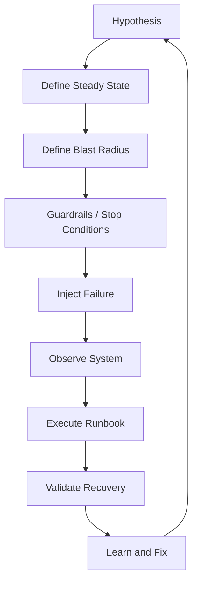
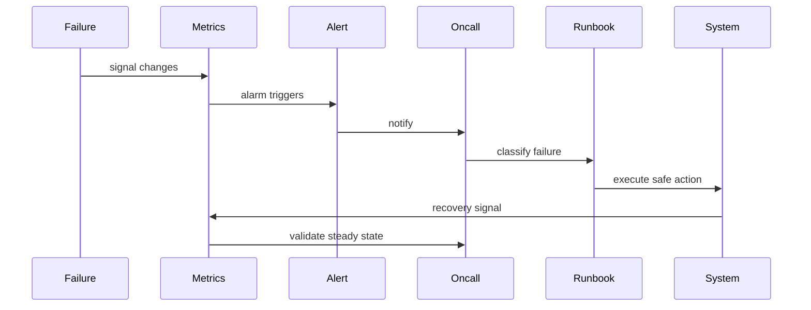
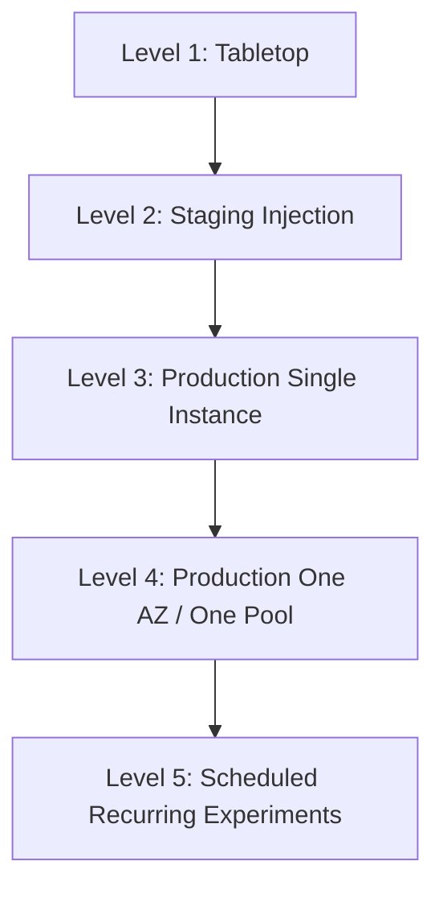
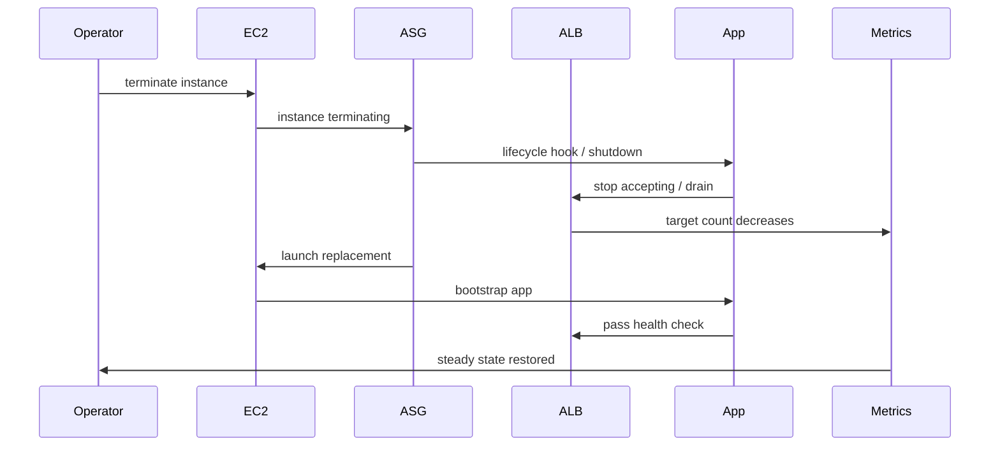
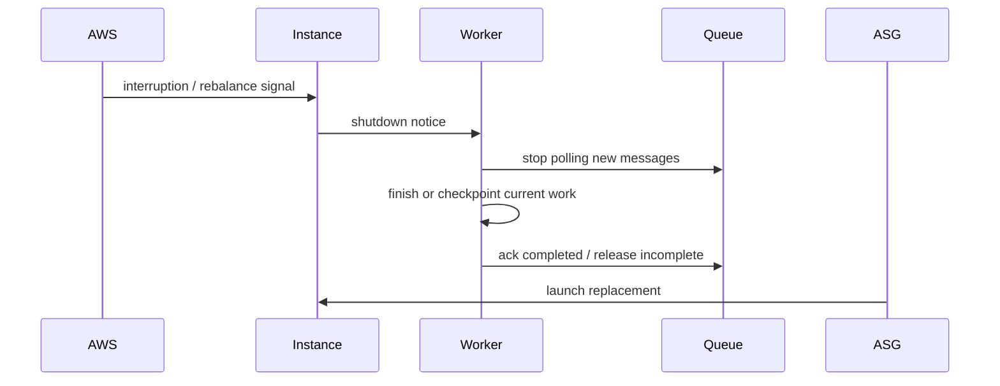
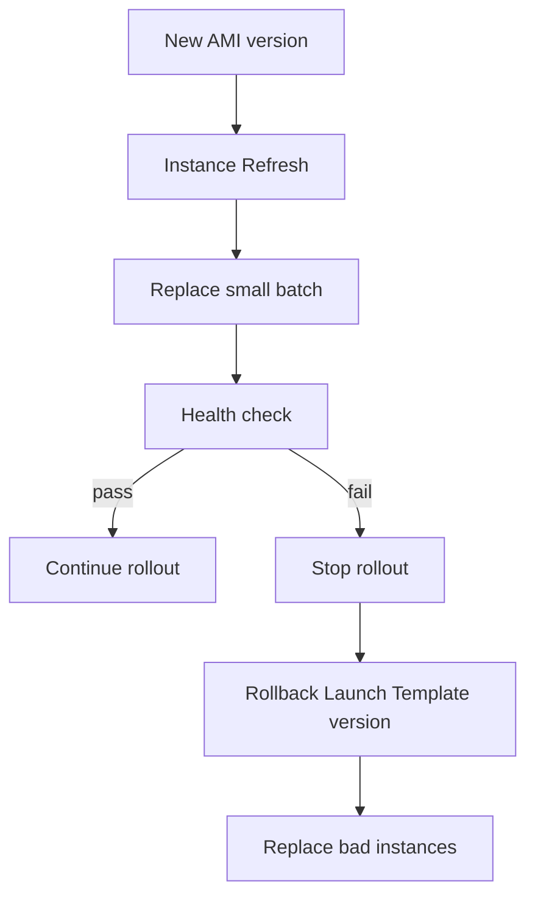

# Part 028 — Fleet Chaos and Capacity Game Days

A capacity plan that is never tested is only a story.

A fleet can look healthy in dashboards and still fail when one Availability Zone is impaired, Spot capacity disappears, a bad AMI enters the Auto Scaling group, scaling policy reacts too slowly, subnet IPs run out, or storage latency rises after compute scales out.

This part turns the previous capacity-planning model into a practical testing discipline: **fleet chaos and capacity game days**.

A game day is a planned exercise that validates whether people, automation, runbooks, dashboards, and architecture survive realistic production impairments. AWS Well-Architected Reliability Pillar explicitly recommends conducting game days regularly to exercise response procedures for workload-impacting events and impairments. Reference: [REL12-BP05 Conduct game days regularly](https://docs.aws.amazon.com/wellarchitected/latest/reliability-pillar/rel_testing_resiliency_game_days_resiliency.html).

This part focuses on EC2/Auto Scaling fleets, but the mental model applies later to EBS, S3, EFS, FSx, ECS, EKS, Lambda, and Batch.

---

## 1. Problem yang Diselesaikan

Fleet chaos/game day menjawab pertanyaan yang tidak bisa dijawab oleh diagram arsitektur:

1. Apakah Auto Scaling benar-benar mengganti instance yang tidak sehat?
2. Apakah satu AZ bisa hilang tanpa user-visible outage?
3. Apakah lifecycle hook dan draining benar-benar menyelesaikan request/job sebelum instance mati?
4. Apakah Spot interruption storm menyebabkan backlog, retry storm, atau deadline miss?
5. Apakah bad AMI rollout berhenti otomatis atau menyebar ke seluruh fleet?
6. Apakah scaling policy bereaksi cukup cepat terhadap spike?
7. Apakah quota/subnet IP/instance capacity mencegah scale-out?
8. Apakah storage/downstream menjadi bottleneck setelah compute scale-out?
9. Apakah operator tahu sinyal mana yang harus dilihat dan tindakan mana yang aman?
10. Apakah rollback dan emergency override benar-benar bisa dilakukan dalam tekanan waktu?

Tanpa game day, sistem hanya “mungkin reliable”. Dengan game day, reliability menjadi property yang diuji.

---

## 2. Mental Model

Chaos engineering bukan random destruction. Chaos engineering adalah eksperimen terkontrol untuk memvalidasi hipotesis reliability.

Format sederhananya:

```text
Given steady state,
When controlled impairment happens,
Then system should preserve or recover service within defined SLO,
And operators should detect, diagnose, and execute runbook within target time.
```

Diagram:



Game day is not successful because nothing broke. Game day is successful when it finds unknown weaknesses safely.

---

## 3. Core Concepts

### 3.1 Steady State

A chaos experiment must define steady state first.

For an API fleet:

```yaml
steady_state:
  total_rps: 3000
  p99_latency_ms: <= 250
  error_rate_percent: <= 0.1
  healthy_targets_percent: >= 95
  desired_capacity_matches_in_service: true
  db_connections_percent: <= 70
  queue_backlog: n/a
```

For a worker fleet:

```yaml
steady_state:
  queue_age_p95_minutes: <= 5
  queue_age_p99_minutes: <= 15
  dlq_rate_percent: <= 0.01
  worker_error_rate_percent: <= 0.1
  processing_rate_greater_than_arrival_rate: true
```

For a storage-heavy service:

```yaml
steady_state:
  p99_latency_ms: <= 300
  ebs_queue_length: <= threshold
  ebs_write_latency_ms: <= threshold
  db_write_latency_ms: <= threshold
  s3_error_rate: <= threshold
```

If steady state is not measurable, the game day becomes theater.

---

### 3.2 Hypothesis

A good hypothesis is specific.

Bad:

```text
The system is highly available.
```

Good:

```text
If one instance in each AZ is terminated during 70% peak traffic, the ASG replaces capacity and p99 latency remains below 250 ms with error rate below 0.1%.
```

Better:

```text
If all instances in one AZ are removed from service during weekday peak, the remaining two AZs serve traffic within SLO without requiring successful scale-out, because the ASG is statically stable for one-AZ loss.
```

Hypothesis exposes what the architecture assumes.

---

### 3.3 Blast Radius

Start small.

Blast radius dimensions:

| Dimension | Low Blast Radius | High Blast Radius |
|---|---|---|
| Environment | staging | production |
| Traffic | synthetic | real user traffic |
| Scope | one instance | one AZ / whole fleet |
| Time | 2 minutes | 1 hour |
| Dependency | app only | app + DB + storage |
| Automation | manual injection | automated continuous experiment |

A mature practice starts with staging and single-instance tests, then gradually increases realism.

Do not start by killing an AZ in production.

---

### 3.4 Guardrails and Stop Conditions

Game day must have stop conditions.

Example:

```yaml
stop_conditions:
  - p99_latency_ms > 750 for 5 minutes
  - error_rate_percent > 2 for 3 minutes
  - payment_success_rate drops below 98%
  - queue_age_p99_minutes > 30
  - manual abort by incident commander
  - unexpected data integrity risk
  - downstream saturation above 90%
```

Guardrails prevent learning from becoming customer harm.

---

### 3.5 Detection, Diagnosis, Decision, Recovery

Reliability is not just architecture. It is a loop.



Measure these times:

```yaml
mttd: mean_time_to_detect
mtta: mean_time_to_acknowledge
mttd2: mean_time_to_diagnose
mttr: mean_time_to_recover
```

Game day should test human and automation latency.

---

## 4. Production Design for Game Days

### 4.1 Game Day Roles

Small team is enough, but roles must be clear.

```yaml
roles:
  incident_commander:
    responsibility: decide start/stop, coordinate response
  experiment_lead:
    responsibility: inject impairment and track hypothesis
  primary_operator:
    responsibility: execute runbook
  observer:
    responsibility: capture timeline and gaps
  service_owner:
    responsibility: validate business impact and recovery
```

For regulated systems, add:

```yaml
compliance_observer:
  responsibility: ensure test does not violate audit/data retention requirements
```

---

### 4.2 Game Day Document Template

Use this before any experiment:

```yaml
experiment:
  name: az-loss-static-stability-test
  date: 2026-07-06
  service: customer-profile-api
  environment: staging
  hypothesis: >
    If one AZ is removed from service at 70% peak load, the remaining AZs
    maintain p99 latency <= 250 ms and error rate <= 0.1% without manual scale-out.
  steady_state:
    rps: 3000
    p99_latency_ms: 250
    error_rate_percent: 0.1
  blast_radius:
    region: ap-southeast-1
    az_scope: one_az
    user_traffic: synthetic
  injection:
    method: detach targets or block traffic to one AZ
  guardrails:
    stop_if_p99_latency_ms: 750
    stop_if_error_rate_percent: 2
  expected_detection:
    alarm: multi_az_capacity_degraded
    mttd_target_minutes: 3
  expected_recovery:
    automatic: true
    manual_action: none unless guardrail breached
  rollback:
    restore_az_targets: true
  evidence:
    dashboards:
      - service_slo
      - asg_capacity
      - alb_target_health
      - db_capacity
  postmortem_required: true
```

---

### 4.3 Experiment Maturity Ladder

Do not jump levels.



| Level | Meaning | Exit Criteria |
|---|---|---|
| 1 | tabletop runbook walkthrough | runbook has no obvious missing steps |
| 2 | staging failure injection | automation and dashboards work |
| 3 | prod single-instance failure | user impact negligible |
| 4 | prod AZ/pool/fleet scenario | SLO preserved or controlled degradation works |
| 5 | recurring controlled experiments | reliability regression caught early |

---

## 5. Implementation Patterns

### 5.1 Single Instance Termination Test

Hypothesis:

```text
If one healthy instance is terminated, ASG replaces it and ALB routes around it without SLO violation.
```

Expected behavior:

1. Instance starts termination.
2. Lifecycle hook runs if configured.
3. App stops accepting new work.
4. ALB target deregisters/drains.
5. ASG launches replacement.
6. New instance boots and passes health check.
7. Desired and in-service converge.

Mermaid:



Commands for controlled lower environment:

```bash
aws autoscaling describe-auto-scaling-groups \
  --auto-scaling-group-names customer-profile-api

aws ec2 terminate-instances \
  --instance-ids i-0123456789abcdef0

aws autoscaling describe-scaling-activities \
  --auto-scaling-group-name customer-profile-api
```

Validation:

```yaml
expected:
  error_rate: no significant increase
  p99_latency: within SLO
  replacement_launch: within expected time
  target_group_health: restored
  no_stuck_lifecycle_hook: true
```

Failure signs:

- lifecycle hook stuck;
- ALB keeps routing to draining/unhealthy target;
- replacement fails due to quota/capacity;
- bootstrap fails;
- desired > in-service for too long;
- app loses in-flight jobs.

---

### 5.2 AZ Loss Game Day

Hypothesis:

```text
If one AZ becomes unavailable, the workload remains within SLO using capacity in remaining AZs.
```

Important distinction:

- Testing AZ failure does **not** mean damaging an AWS AZ.
- You simulate the loss of your workload capacity in one AZ.

Injection options:

1. remove one AZ subnets from target group/load balancer path;
2. detach or put instances in one AZ into standby;
3. block app traffic to one AZ using controlled routing;
4. terminate instances in one AZ in staging;
5. use fault-injection tooling where approved.

AWS Fault Isolation Boundaries treats AZ as physical fault-isolation boundary; production architecture should validate behavior under zonal impairment assumptions. Reference: [Availability Zones](https://docs.aws.amazon.com/whitepapers/latest/aws-fault-isolation-boundaries/availability-zones.html).

Capacity expectation:

```text
remaining_capacity >= peak_load_at_slo
```

For 3 AZ static stability with 1 AZ loss:

```text
capacity_per_az >= peak_load / 2
```

Game day validation:

```yaml
validate:
  - per_az_healthy_targets
  - request_distribution_by_az
  - p99_latency
  - error_rate
  - db_connections
  - ebs/storage latency
  - asg_rebalancing_behavior
  - subnet_ip_headroom
  - no_manual_scaleout_required_if_static_stable
```

Common surprises:

- cross-zone load balancing behavior misunderstood;
- remaining AZ capacity insufficient;
- DB primary or dependency is zonal bottleneck;
- sticky sessions pin users to unhealthy path;
- subnet IP shortage blocks replacement;
- EBS volumes pin state to impaired AZ;
- app config has AZ-specific endpoints;
- autoscaling launches into wrong or constrained AZ.

---

### 5.3 Spot Interruption Storm

Hypothesis:

```text
If 30% of Spot capacity receives interruption/rebalance signal, workload drains or checkpoints and recovers without missing processing deadline.
```

Relevant AWS behavior:

- EC2 Spot interruption notice gives a two-minute warning before AWS interrupts a Spot Instance in many interruption scenarios.
- Rebalance recommendation can arrive earlier when a Spot Instance has elevated interruption risk.
- EC2 Auto Scaling Capacity Rebalancing can proactively replace Spot Instances at elevated risk.

References: [Spot Instance interruption notices](https://docs.aws.amazon.com/AWSEC2/latest/UserGuide/spot-instance-termination-notices.html), [EC2 instance rebalance recommendations](https://docs.aws.amazon.com/AWSEC2/latest/UserGuide/rebalance-recommendations.html), and [Use Capacity Rebalancing to handle Amazon EC2 Spot Interruptions](https://docs.aws.amazon.com/autoscaling/ec2/userguide/ec2-auto-scaling-capacity-rebalancing.html).

Test questions:

1. Does the app receive termination/rebalance signal?
2. Does it stop taking new work?
3. Does it checkpoint or make work idempotent?
4. Does queue visibility timeout match actual job duration?
5. Does replacement capacity launch fast enough?
6. Does mixed instance diversification reduce correlated interruption?
7. Does backlog age remain within deadline?

Expected worker behavior:



Common failure:

- job takes longer than 2 minutes and has no checkpoint;
- worker keeps polling after termination notice;
- queue visibility timeout too long, delaying retry;
- all Spot capacity from one pool, interruption highly correlated;
- replacement fails due to instance type scarcity;
- DLQ fills silently.

---

### 5.4 Bad AMI Rollout Game Day

Hypothesis:

```text
If a new AMI fails boot/readiness, instance refresh stops and rollback restores healthy capacity before SLO breach.
```

Failure injection options:

- deploy AMI with app process failing health check;
- deploy user data that exits non-zero;
- block artifact download in staging;
- use wrong environment config;
- remove required IAM permission in non-prod;
- set app startup delay above health check grace.

Expected behavior:



Validation:

```yaml
validate:
  - rollout_batch_size_limited
  - min_healthy_percentage_protected
  - health_check_catches_bad_ami
  - alarm_triggers
  - operator_knows_launch_template_previous_version
  - rollback_time_measured
  - no_full_fleet_replacement_with_bad_ami
```

Common surprises:

- health check only verifies port open, not readiness;
- rollout batch too large;
- instance warmup too short;
- bad AMI enters warm pool and waits there silently;
- old Launch Template version not documented;
- user data failure not visible in dashboard;
- ASG replaces failing instances with same bad template forever.

---

### 5.5 Scaling Lag Game Day

Hypothesis:

```text
If traffic ramps from baseline to expected peak in 10 minutes, scaling policy keeps p99 within SLO using headroom and warm capacity.
```

Experiment:

1. Generate synthetic load matching real endpoint mix.
2. Start at baseline.
3. Ramp according to known event shape.
4. Observe desired/pending/in-service capacity.
5. Observe p99 and error rate.
6. Observe downstream/storage metrics.
7. Abort at guardrail.

Key measurements:

```yaml
measure:
  metric_delay_seconds: ...
  alarm_evaluation_seconds: ...
  desired_capacity_change_time: ...
  ec2_launch_time_seconds: ...
  bootstrap_time_seconds: ...
  target_health_time_seconds: ...
  cache_warmup_seconds: ...
  time_until_capacity_useful_seconds: ...
```

If useful capacity arrives after SLO violation, fix one or more:

- increase min capacity;
- add scheduled scaling;
- use predictive scaling;
- add warm pool;
- reduce boot time;
- adjust target metric;
- reduce per-instance target;
- add queue/backpressure.

---

### 5.6 Quota Exhaustion Game Day

Hypothesis:

```text
If scale-out cannot launch more instances due to quota/capacity/IP exhaustion, alerts identify the exact boundary and operators execute fallback safely.
```

Do not intentionally exhaust critical production quotas without strict approval. Simulate in staging or use controlled max capacity/deny path.

Scenarios:

- ASG max too low;
- EC2 quota reached;
- subnet IPs exhausted;
- instance type unavailable;
- launch template permission error;
- security group/ENI limit;
- target group target limit;
- downstream connection limit.

Expected dashboard:

```yaml
signals:
  desired_capacity: rising
  pending_capacity: not increasing or stuck
  in_service_capacity: flat
  scaling_activities: failed launch reason visible
  subnet_available_ips: low
  quota_alarm: triggered
```

Fallback actions:

- raise max capacity only if downstream safe;
- switch/diversify instance type;
- scale non-critical fleet down;
- activate pre-approved quota request/escalation;
- shed load;
- degrade non-critical features;
- queue non-urgent work;
- reduce batch concurrency.

---

### 5.7 Storage Bottleneck Under Scale-Out

Hypothesis:

```text
If compute capacity doubles, storage/downstream remains within safe latency and throttle budget.
```

This test prevents a classic cloud failure: compute elastically scales into a non-elastic bottleneck.

Test dimensions:

```yaml
storage_test:
  ebs:
    - volume_read_latency
    - volume_write_latency
    - queue_length
    - burst_balance_if_applicable
  database:
    - cpu
    - connections
    - lock_wait
    - read/write latency
  s3:
    - request_rate
    - 4xx/5xx
    - first_byte_latency
    - request_cost
  efs/fsx:
    - throughput
    - metadata_latency
    - client_timeout
```

Failure signs:

- more workers reduce throughput;
- DB connection wait rises;
- EBS queue length rises;
- EFS metadata latency rises;
- S3 request cost explodes due to list/retry pattern;
- downstream throttles and app retries.

Fixes:

- cap concurrency;
- batch writes;
- shard/partition data;
- pre-provision throughput/IOPS;
- introduce queue buffer;
- use per-endpoint rate limit;
- reduce list operations;
- tune connection pools;
- separate hot and cold paths.

---

## 6. Failure Modes of Game Days

Game days themselves can fail. That is also useful.

### 6.1 Theater Game Day

Symptom:

- everyone knows exact failure in advance;
- no real signal changes;
- no runbook pressure;
- no action items.

Fix:

- define measurable steady state;
- include realistic load;
- hide exact injection timing from primary operator;
- require timeline and follow-up fixes.

---

### 6.2 Unsafe Game Day

Symptom:

- no stop condition;
- production blast radius too high;
- data integrity risk;
- no rollback;
- no accountable incident commander.

Fix:

- use blast radius ladder;
- define guardrails;
- use staging first;
- get explicit approval for production tests;
- avoid destructive storage tests unless restore path is proven.

---

### 6.3 Tool-Driven Chaos Without Hypothesis

Symptom:

- team uses failure-injection tool randomly;
- experiments produce noise, not learning.

Fix:

- start from architecture assumption;
- write hypothesis;
- define expected system behavior;
- capture evidence;
- convert gaps into backlog.

---

### 6.4 No Follow-through

Symptom:

- issues found;
- no owner;
- same issue appears next quarter.

Fix:

- every game day produces action items;
- assign severity and owner;
- track to closure;
- repeat experiment after fix.

---

## 7. Production Game Day Catalog

Use this catalog as a roadmap.

| ID | Experiment | Purpose | Start Environment |
|---|---|---|---|
| FLEET-001 | terminate one instance | ASG replacement + draining | staging then prod |
| FLEET-002 | terminate N% instances | fleet recovery | staging |
| FLEET-003 | one AZ capacity removed | static stability | staging then prod controlled |
| FLEET-004 | Spot interruption storm | checkpoint/drain/backlog | staging |
| FLEET-005 | bad AMI rollout | rollout guardrail/rollback | staging |
| FLEET-006 | slow bootstrap | scaling time budget | staging |
| FLEET-007 | scaling lag under spike | headroom/warm pool validation | staging/perf |
| FLEET-008 | quota exhaustion simulation | operator fallback | staging/tabletop |
| FLEET-009 | subnet IP exhaustion simulation | VPC scale boundary | staging/tabletop |
| FLEET-010 | storage bottleneck under scale-out | end-to-end capacity | perf/staging |
| FLEET-011 | lifecycle hook stuck | termination safety | staging |
| FLEET-012 | health check false positive | readiness correctness | staging |
| FLEET-013 | downstream latency injection | backpressure/circuit breaker | staging |
| FLEET-014 | queue poison message | DLQ/retry behavior | staging |
| FLEET-015 | cache flush/miss storm | cache dependency risk | staging |

---

## 8. Observability Requirements

A game day must have evidence.

### 8.1 Core Fleet Dashboard

```yaml
fleet_dashboard:
  capacity:
    - min_capacity
    - max_capacity
    - desired_capacity
    - pending_instances
    - in_service_instances
    - standby_instances
    - terminating_instances
    - warm_pool_size
  health:
    - healthy_targets
    - unhealthy_targets
    - health_check_failures
    - status_check_failures
  scaling:
    - scaling_activities
    - failed_launches
    - target_tracking_metric
    - cooldown/warmup state
  az:
    - healthy_targets_by_az
    - instance_count_by_az
    - request_count_by_az
  slo:
    - p50_latency
    - p95_latency
    - p99_latency
    - error_rate
  downstream:
    - database_latency
    - database_connections
    - storage_latency
    - throttle_rate
```

### 8.2 Timeline Capture

Use a timeline table.

| Time | Event | Signal | Action | Result |
|---|---|---|---|---|
| 10:00 | experiment started | steady state OK | none | baseline captured |
| 10:05 | instance terminated | healthy targets -1 | ASG launch | replacement pending |
| 10:08 | p99 rose | p99 260ms | observe | within guardrail |
| 10:12 | replacement healthy | in-service restored | validate | steady state recovered |

The timeline is often more valuable than the final result.

---

## 9. Runbooks

### 9.1 Game Day Preparation Runbook

1. Choose experiment from catalog.
2. Define hypothesis.
3. Define steady state and metrics.
4. Define blast radius.
5. Define stop conditions.
6. Confirm rollback path.
7. Confirm dashboard access.
8. Confirm operator roles.
9. Confirm synthetic load or traffic shape.
10. Confirm no conflicting deployment or business event.
11. Announce test window.
12. Capture baseline before injection.

---

### 9.2 During Game Day

1. Incident commander confirms start.
2. Observer starts timeline.
3. Experiment lead injects failure.
4. Primary operator uses normal alerts and runbook.
5. Team avoids giving hidden hints unless guardrail is near.
6. Validate expected automated behavior.
7. Trigger stop condition if needed.
8. Roll back impairment.
9. Confirm steady state restored.
10. Record gaps immediately.

---

### 9.3 After Game Day

Post-game day output:

```yaml
post_game_day:
  hypothesis_result: passed | failed | partially_passed
  user_impact: none | controlled | unexpected
  detection_gaps:
    - ...
  automation_gaps:
    - ...
  runbook_gaps:
    - ...
  architecture_gaps:
    - ...
  quota_or_capacity_gaps:
    - ...
  action_items:
    - owner: team-a
      due: 2026-07-20
      item: reduce bootstrap time from 9m to 4m
    - owner: team-b
      due: 2026-07-27
      item: add per-AZ healthy target alarm
  repeat_experiment_date: 2026-08-10
```

---

## 10. Common Mistakes

### Mistake 1 — Testing Only Instance Termination

Single instance termination is useful but insufficient. Many incidents are correlated:

- AZ loss;
- Spot pool interruption;
- bad AMI;
- quota exhaustion;
- storage bottleneck;
- retry storm.

Use a catalog.

---

### Mistake 2 — Running Game Days Without Realistic Load

A system can survive failure at 5% load and collapse at 70% load.

Use realistic traffic shape or synthetic load that matches endpoint mix, payload size, and storage behavior.

---

### Mistake 3 — Ignoring Human Workflow

If automation works but operator cannot detect or interpret it, incident recovery is still weak.

Test alerting, dashboard, runbook, and escalation.

---

### Mistake 4 — No Stop Conditions

Chaos without guardrails is negligence.

Define stop conditions before injection.

---

### Mistake 5 — Calling a Failed Experiment a Failure

A game day that finds a real issue safely is valuable.

The failure is not finding the issue. The failure is not fixing it.

---

## 11. Checklist

### Game Day Readiness Checklist

- [ ] Hypothesis written.
- [ ] Steady state measurable.
- [ ] Blast radius limited.
- [ ] Stop conditions defined.
- [ ] Rollback path tested.
- [ ] Dashboards ready.
- [ ] Alerts ready.
- [ ] Runbook linked.
- [ ] Roles assigned.
- [ ] Synthetic load prepared if needed.
- [ ] Quota/capacity impact understood.
- [ ] Storage/data integrity risk reviewed.
- [ ] Post-game-day owner assigned.

### Fleet Scenario Checklist

- [ ] Single instance termination tested.
- [ ] Lifecycle hook/draining tested.
- [ ] Bad AMI rollout tested.
- [ ] Scale-out lag tested.
- [ ] AZ capacity loss tested.
- [ ] Spot interruption tested if Spot is used.
- [ ] Quota exhaustion path tested/tabletopped.
- [ ] Storage bottleneck under scale-out tested.
- [ ] Downstream throttling/backpressure tested.
- [ ] Per-AZ dashboard exists.

---

## 12. Mini Case Study

### Scenario

A regulatory enforcement case platform runs these EC2/ASG fleets:

1. `case-api`: synchronous officer-facing API.
2. `document-renderer`: queue worker rendering case PDFs.
3. `evidence-processor`: async evidence metadata and object processing.

The team claims the platform is resilient because:

- ASG spans 3 AZs;
- min capacity is 12;
- target tracking is enabled;
- health checks exist;
- S3 is durable;
- database has Multi-AZ.

But those statements are not tests.

### Game Day 1 — Single Instance Termination

Hypothesis:

```text
Terminating one case-api instance should not breach p99 300 ms.
```

Result:

- passed;
- ASG replaced instance in 7 minutes;
- no user impact;
- but target group deregistration delay was longer than app shutdown timeout.

Action:

- align app shutdown timeout with ALB deregistration delay;
- add shutdown log metric.

### Game Day 2 — AZ Capacity Loss

Hypothesis:

```text
Losing one AZ at 60% peak load should preserve SLO.
```

Result:

- partially failed;
- API remained available;
- p99 rose to 650 ms;
- database connection pool in remaining instances saturated;
- per-AZ target distribution was uneven;
- subnet in one remaining AZ had low IP headroom.

Action:

- increase static per-AZ capacity;
- reduce DB pool per instance and add backpressure;
- add subnet IP alarm;
- add per-AZ request/target dashboard.

### Game Day 3 — Bad AMI Rollout

Hypothesis:

```text
A bad AMI should fail health check and stop rollout before replacing more than 10% of fleet.
```

Result:

- failed;
- health check only checked `/healthz` and returned OK before dependencies were ready;
- instance refresh replaced 30% before alarm fired;
- rollback required manual lookup of previous Launch Template version.

Action:

- split liveness and readiness;
- update instance refresh preferences;
- document rollback command;
- add automated rollback candidate output in deployment pipeline.

### Outcome

Before game days, the team had a confidence story. After game days, they had concrete reliability work:

```yaml
reliability_backlog:
  - per_az_capacity_dashboard
  - subnet_ip_headroom_alarm
  - readiness_check_fix
  - launch_template_rollback_runbook
  - db_connection_backpressure
  - scheduled_az_loss_retest
```

This is the real value of game days: they convert architectural assumptions into tested engineering facts.

---

## 13. Summary

Fleet chaos and capacity game days make reliability observable.

The core loop:

```text
hypothesis -> steady state -> controlled impairment -> observe -> recover -> learn -> fix -> repeat
```

For AWS EC2/Auto Scaling fleets, prioritize these scenarios:

1. single instance termination;
2. lifecycle hook and graceful draining;
3. AZ capacity loss;
4. Spot interruption storm;
5. bad AMI rollout;
6. scaling lag under spike;
7. quota/subnet/IP exhaustion;
8. storage bottleneck under scale-out;
9. downstream throttling and retry storm.

A top-tier engineer does not merely design for failure. They make failure assumptions executable, measurable, and repeatable.

This closes Section III: Auto Scaling, Capacity Engineering, and Fleet Control. Part 029 starts Section IV: Amazon EBS and Block Storage Engineering.

---

## References

- [REL12-BP05 Conduct game days regularly - AWS Well-Architected Reliability Pillar](https://docs.aws.amazon.com/wellarchitected/latest/reliability-pillar/rel_testing_resiliency_game_days_resiliency.html)
- [Availability Zones - AWS Fault Isolation Boundaries](https://docs.aws.amazon.com/whitepapers/latest/aws-fault-isolation-boundaries/availability-zones.html)
- [Spot Instance interruption notices](https://docs.aws.amazon.com/AWSEC2/latest/UserGuide/spot-instance-termination-notices.html)
- [EC2 instance rebalance recommendations](https://docs.aws.amazon.com/AWSEC2/latest/UserGuide/rebalance-recommendations.html)
- [Use Capacity Rebalancing to handle Amazon EC2 Spot Interruptions](https://docs.aws.amazon.com/autoscaling/ec2/userguide/ec2-auto-scaling-capacity-rebalancing.html)
- [Lifecycle hooks for Amazon EC2 Auto Scaling](https://docs.aws.amazon.com/autoscaling/ec2/userguide/lifecycle-hooks.html)
- [Instance refresh for Amazon EC2 Auto Scaling](https://docs.aws.amazon.com/autoscaling/ec2/userguide/asg-instance-refresh.html)
- [AWS Fault Injection Service User Guide](https://docs.aws.amazon.com/fis/latest/userguide/what-is.html)
