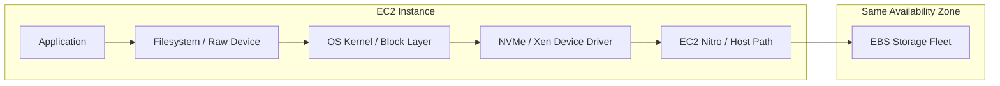
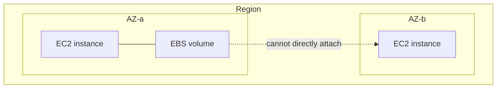
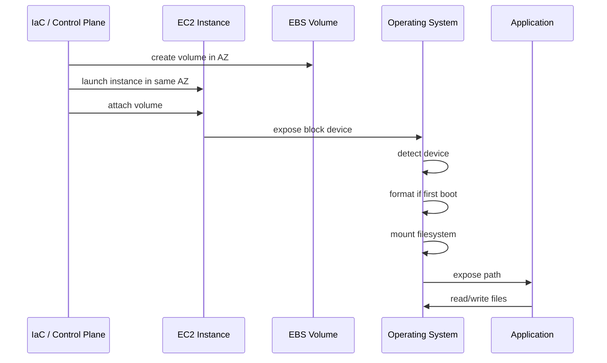
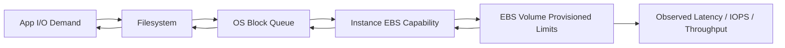
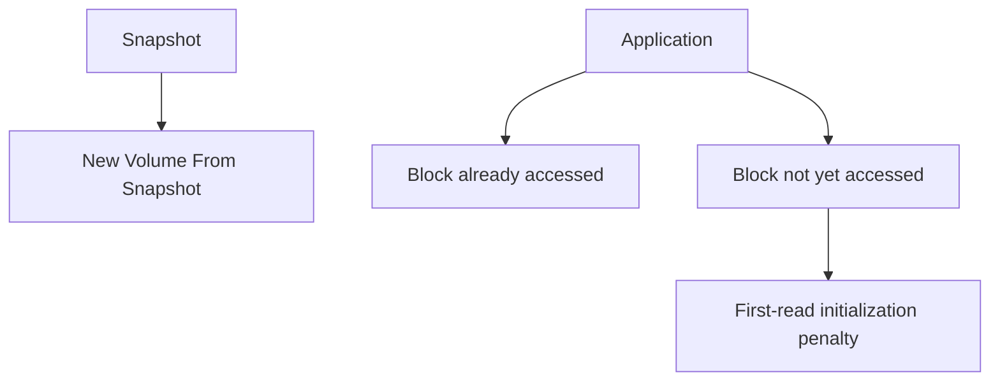
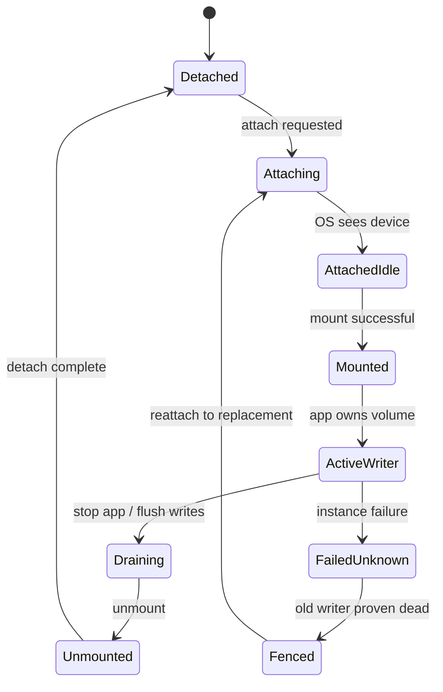
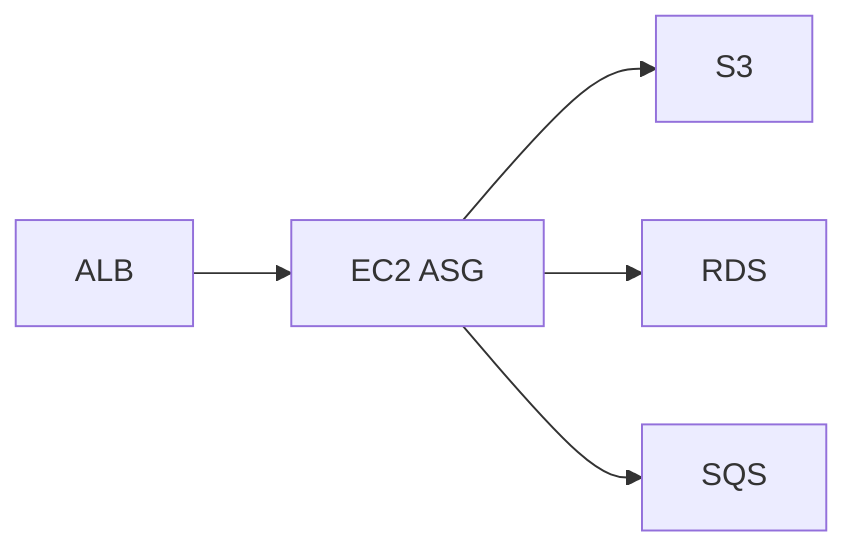
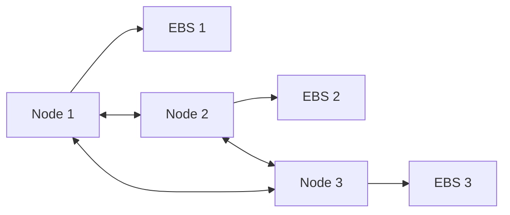
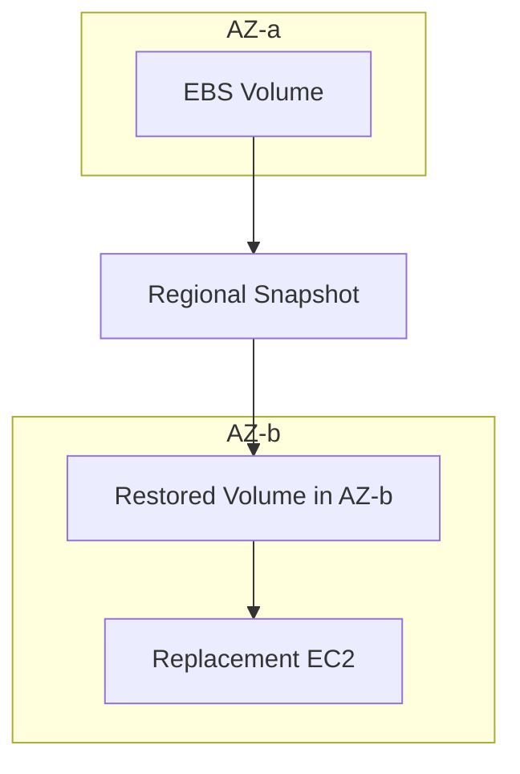

# Part 029 — EBS Block Storage Mental Model

> EBS is not "a disk in the server". It is a durable, network-attached block device with a zonal lifecycle, an attachment contract, a performance envelope, and a recovery model. Treat it like a storage subsystem, not like a folder.

This part starts the EBS section. We will not jump straight into `gp3` vs `io2`. That would create the wrong mental model. The useful sequence is:

1. Understand what a block device promises.
2. Understand what EBS adds and removes compared with local disk.
3. Understand where the fault boundary is.
4. Understand the path between application write and durable block.
5. Understand how OS, filesystem, EC2 instance type, and EBS volume type combine into one observed behavior.

AWS documentation describes EBS volume performance as a function of I/O characteristics, instance configuration, and volume configuration. That sentence is more important than most EBS tables: there is no standalone "fast volume" if the instance, OS, filesystem, queue depth, and workload shape cannot drive or absorb that performance.

References used for this part:

- Amazon EBS volume types: https://docs.aws.amazon.com/ebs/latest/userguide/ebs-volume-types.html
- Amazon EBS volume performance: https://docs.aws.amazon.com/ebs/latest/userguide/ebs-performance.html
- Amazon EBS I/O characteristics and monitoring: https://docs.aws.amazon.com/ebs/latest/userguide/ebs-io-characteristics.html
- Attach an Amazon EBS volume to an EC2 instance: https://docs.aws.amazon.com/ebs/latest/userguide/ebs-attaching-volume.html
- EC2 storage options: https://docs.aws.amazon.com/AWSEC2/latest/UserGuide/Storage.html

---

## 1. Problem yang Diselesaikan

EBS menyelesaikan masalah klasik pada VM/cloud compute:

- compute instance bisa dihentikan, diganti, atau gagal;
- data disk perlu tetap hidup melewati lifecycle instance;
- workload membutuhkan block device, bukan object API;
- filesystem, database, journal, WAL, swap, atau aplikasi legacy butuh device-level semantics;
- snapshot dan restore harus bisa dilakukan tanpa membangun storage system sendiri;
- storage performance harus bisa dipilih dan dimodifikasi secara terpisah dari compute dalam banyak kasus.

EBS bukan solusi untuk semua state. Ia cocok ketika workload butuh **block device attached ke compute**. Ia tidak cocok jika aplikasi sebenarnya butuh object storage global, shared file system multi-client sederhana, atau replicated distributed storage tanpa single-writer discipline.

### Pertanyaan inti

Gunakan EBS ketika pertanyaan ini dijawab "ya":

- Apakah aplikasi butuh filesystem lokal seperti `/var/lib/postgresql`, `/data`, `/opt/app/state`, atau raw block device?
- Apakah data harus bertahan setelah EC2 instance di-stop/terminate?
- Apakah access pattern terutama random read/write kecil atau block-level sequential I/O?
- Apakah workload punya ownership jelas atas volume?
- Apakah recovery bisa dilakukan melalui detach/attach, snapshot/restore, atau rebuild instance + reattach data volume?

Jangan gunakan EBS sebagai default untuk semua storage. Gunakan EBS ketika semantics block device memang bagian dari kontrak aplikasi.

---

## 2. Mental Model

EBS dapat dipikirkan sebagai:

```text
EBS volume = zonal durable block device
             + attach/detach lifecycle
             + provisioned performance envelope
             + snapshot lineage
             + filesystem/application consistency responsibility
```

Diagram dasar:



A write is not just "write to disk". It is:

1. Application issues a write.
2. Runtime/library buffers or flushes it.
3. Filesystem maps write to block operations.
4. OS block layer queues operations.
5. EC2 device driver sends I/O through the EBS path.
6. EBS service acknowledges completion based on its own durability semantics.
7. Application sees success or latency.

Every layer can be the bottleneck. Every layer can lie if observed alone.

---

## 3. EBS Is Block Storage, Not File Storage, Not Object Storage

### Block storage semantics

Block storage exposes numbered blocks. The OS decides how to format, mount, cache, journal, and repair them.

That means EBS does **not** know that your volume contains:

- ext4;
- XFS;
- NTFS;
- PostgreSQL data files;
- Kafka log segments;
- Lucene indexes;
- Redis append-only file;
- application uploads;
- binary blobs;
- encrypted LUKS container;
- LVM physical volume.

EBS sees block reads and writes.

### File storage semantics

File storage exposes directories, file paths, permissions, locks, and sometimes POSIX-ish semantics. EFS and FSx live here.

### Object storage semantics

Object storage exposes object keys, whole-object operations, metadata, lifecycle, and HTTP/API semantics. S3 lives here.

### Why this distinction matters

If you put an upload directory on EBS, your application sees a filesystem. But the architecture now has a **single zonal data owner** unless you add replication or backup. If you put uploads in S3, the architecture sees object storage with regional durability and different semantics. The application contract changes.

A common mistake is choosing EBS because it feels easy:

```text
"The app writes files, so let's attach a disk."
```

A better question:

```text
"Does the app require filesystem semantics, single-writer block semantics, or object semantics?"
```

---

## 4. Zonal Boundary: The Most Important EBS Constraint

An EBS volume is scoped to an Availability Zone. You attach it to EC2 instances in the same AZ only.

This has direct architectural consequences:

| Design question | EBS implication |
|---|---|
| Can I reattach a volume to an instance in another AZ? | Not directly. Restore/copy from snapshot or design replication. |
| Can my ASG freely replace across AZs and reattach the same volume? | Not without AZ-aware placement/volume ownership logic. |
| Can EBS alone make my state multi-AZ? | No. EBS is zonal. Multi-AZ availability comes from higher-level replication or restore strategy. |
| Can I fail over instantly to another AZ? | Only if state is already replicated or acceptable from snapshot/RPO. |
| Can I treat an EBS-backed stateful node as regional? | No. It is zonal unless app-level replication changes that. |

Diagram:



This is not a limitation you work around casually. It is a **failure-domain fact**.

---

## 5. Durability Boundary vs Availability Boundary

EBS volumes are designed for durability within an AZ. But durability is not the same as application availability.

### Durability

Durability asks:

```text
Will the stored blocks survive expected infrastructure failures?
```

### Availability

Availability asks:

```text
Can the application continue serving correctly when something fails?
```

EBS can preserve data while the application is unavailable because:

- the EC2 instance failed;
- the volume is stuck attaching;
- the filesystem needs repair;
- the instance is in a different AZ;
- the application cannot replay logs;
- the mount did not happen after reboot;
- KMS permissions prevent volume attachment;
- the root volume is corrupt;
- the ASG replaced the node but did not reattach the data volume.

### Recovery must be designed above the volume

EBS gives you primitives:

- create volume;
- attach volume;
- detach volume;
- snapshot volume;
- restore volume from snapshot;
- modify volume;
- encrypt volume;
- tag volume;
- monitor volume.

Your application architecture must define:

- who owns the volume;
- when writes are safe;
- when snapshots are consistent;
- how restore is verified;
- whether one writer or many writers are allowed;
- how another compute node takes over;
- how stale writers are fenced;
- how data loss is measured.

---

## 6. The EBS Attachment Contract

An EBS volume is useful only when attached and mounted correctly.

### Attachment layers



Each step needs an invariant.

| Step | Invariant |
|---|---|
| Create volume | Volume AZ matches intended compute AZ. |
| Attach | Instance and volume are compatible and in same AZ. |
| Device discovery | OS can locate stable device name. |
| Format | Formatting happens only when intended. |
| Mount | Mount path exists and has correct permissions. |
| App start | App starts only after mount is ready. |
| Detach | Writer is stopped and filesystem flushed. |
| Reattach | New owner is fenced from stale writer. |

### The dangerous boot mistake

A common incident:

1. Data volume fails to mount.
2. Application starts anyway.
3. App creates an empty directory at the mount path.
4. New data is written to root volume.
5. Later the real volume mounts over the directory.
6. Operators see missing/inconsistent data.

Avoid with systemd mount dependencies:

```ini
[Unit]
Description=Application Service
RequiresMountsFor=/data
After=network-online.target

[Service]
ExecStart=/opt/app/bin/start
Restart=always

[Install]
WantedBy=multi-user.target
```

And with explicit startup guard:

```bash
#!/usr/bin/env bash
set -euo pipefail

mountpoint -q /data || {
  echo "ERROR: /data is not mounted"
  exit 1
}

test -f /data/.volume-contract || {
  echo "ERROR: /data volume contract marker missing"
  exit 1
}

exec /opt/app/bin/start
```

---

## 7. Root Volume vs Data Volume

Do not mix OS lifecycle and application data lifecycle casually.

### Root volume

Root volume contains:

- OS;
- packages;
- system config;
- logs if not moved;
- temporary files;
- maybe app binaries;
- sometimes accidental app data.

Root volume is usually tied to instance lifecycle.

### Data volume

Data volume contains:

- database data directory;
- log segments;
- application durable files;
- index files;
- queue spool;
- persistent local state;
- recovery-critical artifacts.

Data volume should have explicit lifecycle, backup, ownership, and attach policy.

### Recommended pattern

```text
Root volume = replaceable machine artifact
Data volume = explicit state artifact
```

That produces cleaner recovery:

```text
Bad OS / bad patch / bad AMI:
  replace instance, reattach data if safe.

Bad data volume / filesystem corruption:
  stop writer, snapshot, repair or restore.

Bad application release:
  rollback app/AMI, preserve data carefully.
```

---

## 8. Filesystem Contract

EBS gives a block device. The filesystem gives application-visible semantics.

### Important filesystem choices

| Choice | Why it matters |
|---|---|
| ext4 vs XFS | Different performance, resize, metadata, and recovery behavior. |
| mount options | Can alter latency, durability, atime writes, discard behavior. |
| journal mode | Changes crash recovery and write amplification. |
| inode density | Matters for many-small-file workloads. |
| filesystem resize support | Required when expanding volume online. |
| fsck behavior | Determines recovery time after unclean shutdown. |

### Example mount contract

`/etc/fstab` entry should avoid indefinite boot hangs while still failing safely for app start:

```fstab
UUID=<volume-uuid> /data xfs defaults,nofail,x-systemd.device-timeout=30s 0 2
```

But `nofail` is not enough. It prevents boot failure, but the app must still refuse to start if `/data` is not mounted.

### Formatting guard

Never run `mkfs` blindly on every boot.

Bad:

```bash
mkfs.xfs /dev/nvme1n1
mount /dev/nvme1n1 /data
```

Better:

```bash
DEVICE=/dev/nvme1n1
MOUNT=/data

if ! blkid "$DEVICE" >/dev/null 2>&1; then
  mkfs.xfs -f "$DEVICE"
fi

mkdir -p "$MOUNT"
mount "$DEVICE" "$MOUNT"
```

Better still: identify device by stable metadata, UUID, or NVMe volume serial mapping, not by guessed device name.

---

## 9. Performance Envelope: Volume, Instance, OS, Workload

Observed EBS performance is the minimum of several ceilings:

```text
observed performance = min(
  application ability to generate I/O,
  filesystem/block layer efficiency,
  OS queue and driver behavior,
  volume provisioned IOPS/throughput,
  instance EBS bandwidth/IOPS capability,
  workload latency tolerance,
  snapshot initialization state,
  competing workload on the same instance
)
```

Diagram:



### Three different performance questions

| Question | Metric family |
|---|---|
| How many operations per second? | IOPS |
| How much data per second? | Throughput MiB/s |
| How long does each operation take? | Latency |

These interact. Large I/O can hit throughput limit before IOPS limit. Tiny random I/O can hit IOPS or latency before throughput. Queue depth can increase throughput but harm latency-sensitive transactions.

---

## 10. IOPS, Throughput, Latency, and Queue Depth

### IOPS

IOPS measures operations per second. It does not directly tell you bytes per second unless you know I/O size.

```text
throughput = IOPS * average I/O size
```

Example:

```text
3,000 IOPS * 16 KiB = ~46.9 MiB/s
3,000 IOPS * 256 KiB = ~750 MiB/s logical demand
```

If the volume or instance throughput limit is lower, observed throughput will cap and effective IOPS may drop.

### Throughput

Throughput matters for:

- sequential scans;
- backup restore;
- log compaction;
- large file processing;
- analytics staging;
- media processing;
- database full table scans;
- Kafka segment transfer;
- bulk import/export.

### Latency

Latency matters for:

- database commits;
- fsync-heavy workloads;
- transaction logs;
- small random reads;
- metadata-heavy filesystems;
- search index writes;
- queue spool operations.

### Queue depth

Queue depth is pending I/O. Too low means you may not use provisioned performance. Too high means latency can explode.

Mental model:

```text
low queue depth + high latency = storage path slow or sync workload constrained
high queue depth + high latency = saturation/backlog
low queue depth + low throughput = app not driving enough I/O or small synchronous operations
high throughput + acceptable latency = healthy for throughput workload
```

---

## 11. Snapshot Lineage and First-Read Penalty

Volumes restored from snapshots can experience latency increase when blocks are first accessed. AWS documents this as an initialization/pre-warming concern; Fast Snapshot Restore can avoid the first-access performance hit for enabled snapshots.

Mental model:



### Operational consequence

Restoring a database volume and immediately sending production traffic can produce surprising latency if blocks are cold.

Options:

- warm the volume by reading blocks before serving traffic;
- use Fast Snapshot Restore for critical snapshots/AZs;
- restore ahead of time during planned migration;
- design app-level cache warmup;
- monitor latency specifically during restore events.

---

## 12. EBS and Application Consistency

An EBS snapshot is a block-level snapshot. Whether it is application-consistent depends on the application state at snapshot time.

### Crash-consistent snapshot

Equivalent to pulling the power at that moment and preserving disk state.

Often acceptable for:

- journaling filesystems;
- databases with WAL and crash recovery;
- append-only logs with recovery logic;
- systems that tolerate replay.

But not enough for every case.

### Application-consistent snapshot

Requires coordination:

- pause writes;
- flush buffers;
- fsync critical files;
- freeze filesystem if appropriate;
- checkpoint database;
- snapshot volume set together;
- unfreeze/resume writes;
- verify restore.

### Multi-volume consistency

If a database uses multiple volumes, snapshotting one volume at a different point from another can break consistency.

Pattern:

```text
quiesce app -> freeze filesystems -> snapshot all volumes -> unfreeze -> verify restore
```

This will be covered deeply in Part 032, but the mental model begins here: EBS does not understand your transaction boundary unless you teach the system to coordinate it.

---

## 13. Single-Attach, Multi-Attach, and Ownership

Most EBS designs should assume **single writer**.

AWS supports Multi-Attach for certain Provisioned IOPS SSD volumes in the same AZ, but Multi-Attach is not shared filesystem magic. Each attached instance can have read/write permission. Your application or clustered filesystem must manage concurrent writes correctly.

### Safe default

```text
One volume -> one active writer -> explicit owner -> explicit fencing
```

### Dangerous assumption

```text
Attach same block volume to two instances -> both write files -> hope filesystem handles it
```

That is usually data corruption unless the stack is designed for shared block access.

### Ownership state machine



The `FailedUnknown -> Fenced` transition is critical. Never let a replacement write until stale writer risk is resolved.

---

## 14. EBS with Auto Scaling Groups

EBS and ASG have tension:

- ASG wants instances to be interchangeable.
- EBS data volume wants stable ownership.

### Good ASG + EBS patterns

#### Pattern A — Stateless ASG with root EBS only

```text
ASG instances are disposable.
Persistent state lives in S3/RDS/EFS/FSx/etc.
Root EBS is replaceable.
```

Best for web/API services.

#### Pattern B — ASG workers with ephemeral local state

```text
ASG instances process queue jobs.
EBS root or scratch may exist.
Job state is checkpointed externally.
```

Best for async workers.

#### Pattern C — Stateful singleton with explicit EBS data volume

```text
One active instance owns one data volume.
Replacement must attach same volume in same AZ after fencing.
```

Use carefully.

#### Pattern D — Replicated stateful cluster

```text
Each node owns its own EBS volume.
Application replication handles HA.
```

Best for systems like certain database/search/log clusters when operated correctly.

### Bad pattern

```text
ASG across 3 AZs + one EBS data volume + no placement constraint + no attach logic
```

This creates non-deterministic recovery failure.

---

## 15. EBS as Database Storage Substrate

EBS is commonly used under self-managed databases on EC2.

### What matters most

| Database behavior | EBS concern |
|---|---|
| WAL/fsync-heavy commits | write latency and provisioned IOPS |
| Large scans | throughput and read-ahead |
| Checkpoint bursts | burst absorption and queue depth |
| Compaction | mixed random/sequential I/O |
| Replication catch-up | read/write contention |
| Backup restore | snapshot initialization and throughput |
| Storage growth | Elastic Volumes and filesystem resize |
| Multi-volume layout | consistency during snapshot |

### Separate data by behavior, not habit

Useful separation:

```text
/data      -> database data files
/wal       -> write-ahead logs / transaction logs
/backup    -> temporary dump/staging if needed
/scratch   -> sort/temp/compaction if safe
```

But separation is not free. More volumes mean more operational surfaces:

- more snapshot coordination;
- more mount dependencies;
- more performance monitoring;
- more failure modes;
- more resize operations;
- more KMS/permission configuration.

Separate when behavior and recovery benefit justify it.

---

## 16. EBS vs Instance Store

| Dimension | EBS | Instance store |
|---|---|---|
| Persistence | Persists independently of instance lifecycle depending on config | Ephemeral; data lost on stop/terminate/host loss depending on instance behavior |
| Scope | AZ-scoped network-attached block | Physically attached local storage on instance host |
| Snapshot | Native EBS snapshot | No native EBS snapshot; app must copy elsewhere |
| Latency/locality | Network path to EBS storage fleet | Local NVMe path; very high locality |
| Use case | durable block state | cache, scratch, temp, spill, rebuildable data |
| Recovery | detach/attach, snapshot/restore | rebuild from source/checkpoint |

Do not choose instance store because it feels faster unless data loss is acceptable by design.

Do not choose EBS because it feels safer if your architecture needs high-write shared access or regional object semantics.

---

## 17. EBS vs S3

| Dimension | EBS | S3 |
|---|---|---|
| API | Block device | Object API |
| Attachment | Attached to EC2-like compute path | Accessed over service API |
| Scope | Zonal volume | Regional bucket service |
| Update model | Block overwrite | Object put/copy/delete/versioning |
| Filesystem | Provided by OS | Not a filesystem by default |
| Sharing | Single-writer default | Many clients via API |
| Lifecycle | Volume/snapshot | Object lifecycle/storage class |
| Good for | DB files, local app state, block workloads | uploads, artifacts, data lake, backups, immutable blobs |

If your app stores user-uploaded files and does not need filesystem-level updates, S3 is usually the better storage contract.

If your app is PostgreSQL writing data pages and WAL, EBS is the block storage substrate.

---

## 18. EBS vs EFS/FSx

| Dimension | EBS | EFS/FSx |
|---|---|---|
| Semantics | Block device | Shared file service |
| Multi-client | Not default; Multi-Attach requires careful stack | Native file sharing model |
| Mount | Local block filesystem | Network filesystem client |
| Latency | Often suitable for block workloads | Depends on metadata/file operation pattern |
| Ownership | Usually one compute owner | Shared service ownership |
| Common use | DB storage, app data local to node | shared content, home dirs, ML datasets, Windows shares, HPC file workloads |

When multiple compute nodes need to see the same file tree, EBS is usually the wrong primitive unless you are intentionally building clustered storage.

---

## 19. Terraform Skeleton: Explicit EBS Data Volume

This is a simplified pattern for one EC2 instance with one explicit data volume. Production code should add IAM, security groups, subnet selection, AMI pipeline, monitoring, and backup resources.

```hcl
resource "aws_ebs_volume" "data" {
  availability_zone = var.availability_zone
  size              = 500
  type              = "gp3"
  iops              = 6000
  throughput        = 250
  encrypted         = true

  tags = {
    Name        = "orders-data"
    Service     = "orders"
    DataClass   = "persistent"
    Owner       = "orders-platform"
    Backup      = "daily"
    Environment = var.environment
  }
}

resource "aws_instance" "node" {
  ami               = var.ami_id
  instance_type     = "m7i.large"
  availability_zone = var.availability_zone
  subnet_id         = var.subnet_id

  metadata_options {
    http_tokens = "required"
  }

  root_block_device {
    volume_type = "gp3"
    volume_size = 50
    encrypted   = true
  }

  tags = {
    Name        = "orders-node"
    Service     = "orders"
    Environment = var.environment
  }
}

resource "aws_volume_attachment" "data" {
  device_name = "/dev/sdf"
  volume_id   = aws_ebs_volume.data.id
  instance_id = aws_instance.node.id
}
```

Boot script fragment:

```bash
#!/usr/bin/env bash
set -euo pipefail

DEVICE="/dev/disk/by-id/nvme-Amazon_Elastic_Block_Store_${EBS_VOLUME_ID//-/}"
MOUNT="/data"

for i in {1..60}; do
  if [ -b "$DEVICE" ]; then
    break
  fi
  sleep 1
done

if [ ! -b "$DEVICE" ]; then
  echo "EBS device not found: $DEVICE"
  exit 1
fi

if ! blkid "$DEVICE" >/dev/null 2>&1; then
  mkfs.xfs -f "$DEVICE"
fi

mkdir -p "$MOUNT"
mountpoint -q "$MOUNT" || mount "$DEVICE" "$MOUNT"

touch "$MOUNT/.volume-contract"
chown -R app:app "$MOUNT"
```

The important part is not the exact script. The important part is that volume identity, formatting, mounting, permission, and app startup are explicit.

---

## 20. Operational Metrics

At minimum, track metrics at four layers.

### Application layer

- request latency;
- transaction commit latency;
- fsync latency if exposed;
- queue lag;
- checkpoint duration;
- compaction duration;
- error rate;
- timeout count.

### OS layer

Use tools like `iostat`, `pidstat`, `vmstat`, `sar`, `dmesg`, filesystem stats.

Key signals:

- await/read await/write await;
- utilization;
- queue size;
- read/write IOPS;
- read/write throughput;
- average request size;
- filesystem free space/inodes;
- dirty page pressure;
- kernel block device errors.

### EBS/CloudWatch layer

- read/write ops;
- read/write bytes;
- average read/write latency;
- queue length;
- burst balance where applicable;
- volume idle time;
- stalled I/O check;
- IOPS exceeded check;
- throughput exceeded check.

### EC2 instance layer

- instance EBS bandwidth limit;
- network utilization;
- CPU steal/pressure;
- memory pressure;
- Nitro EBS statistics where available;
- instance status checks;
- system log/console output.

---

## 21. Debugging Model

When EBS is suspected, do not begin with "EBS is slow". Begin with a structured question:

```text
Is the application slow because storage operations are slow,
or are storage operations slow because the application is overloaded?
```

### First triage

```bash
# disk and filesystem
lsblk -f
df -h
df -ih
mount | grep data

# I/O behavior
iostat -xz 1
pidstat -d 1

# kernel messages
dmesg -T | tail -100
journalctl -k --since "30 min ago"

# application correlation
journalctl -u app --since "30 min ago"
```

### Interpret common `iostat` patterns

| Pattern | Likely meaning |
|---|---|
| High await, high util, high queue | Storage path saturated or throttled. |
| High await, low throughput, low queue | Sync latency-sensitive workload or device issue. |
| High throughput, acceptable await | Healthy throughput workload. |
| Low disk activity, app slow | Bottleneck elsewhere. |
| High read with cold restored volume | Snapshot initialization penalty possible. |
| Sudden write latency spike | Checkpoint, compaction, burst depletion, instance limit, volume impaired. |

### AWS-side checks

- Check volume status.
- Check instance status.
- Check CloudWatch latency and exceeded metrics.
- Check recent `ModifyVolume`, snapshot, restore, attach/detach events.
- Check instance type EBS capability.
- Check if volume is restored from snapshot and cold.
- Check if burst balance applies.
- Check if KMS/decryption events correlate with attach failures.

---

## 22. Common Failure Modes

### Failure mode 1 — Volume and instance in different AZs

Symptom:

- attachment fails;
- ASG replacement cannot use existing state;
- operator attempts cross-AZ attach.

Prevention:

- AZ-aware state ownership;
- explicit placement;
- restore-from-snapshot process for cross-AZ recovery;
- app-level replication for true multi-AZ.

### Failure mode 2 — Application starts without mounted data volume

Symptom:

- app writes to empty mount directory on root volume;
- data appears missing after remount;
- root disk fills unexpectedly.

Prevention:

- `RequiresMountsFor=`;
- startup guard;
- mount marker file;
- monitoring for mount state;
- no app write permission to parent directory when unmounted.

### Failure mode 3 — Snapshot is not application-consistent

Symptom:

- restored database fails recovery;
- files from different volumes disagree;
- app sees partial state.

Prevention:

- quiesce/freeze/checkpoint;
- coordinated multi-volume snapshots;
- restore tests;
- application-level backup where needed.

### Failure mode 4 — Instance type is the bottleneck

Symptom:

- provisioned EBS IOPS not reached;
- CloudWatch shows no volume exceeded metric;
- instance EBS bandwidth saturated.

Prevention:

- size instance by EBS capability;
- use EBS-optimized/current generation instances;
- benchmark complete path.

### Failure mode 5 — Cold volume after snapshot restore

Symptom:

- high first-read latency;
- restore test passes but production latency spikes;
- DB warmup takes longer than expected.

Prevention:

- pre-initialize blocks;
- Fast Snapshot Restore for critical restore paths;
- staged restore;
- cache warmup plan.

### Failure mode 6 — Filesystem corruption after unsafe detach

Symptom:

- mount fails;
- `xfs_repair` or `fsck` required;
- data loss risk.

Prevention:

- stop app;
- flush writes;
- unmount before detach;
- avoid force detach unless incident response requires it;
- snapshot before repair if possible.

### Failure mode 7 — Full disk or inode exhaustion

Symptom:

- writes fail;
- database stops;
- app returns 500;
- logs cannot be written;
- SSH/login may degrade if root is full.

Prevention:

- disk and inode alerts;
- log rotation;
- volume expansion runbook;
- storage lifecycle policy;
- separate root and data volumes.

---

## 23. Production Design Patterns

### Pattern 1 — Disposable EC2 + durable external state

Use root EBS only. Put state in managed services.



Best default for stateless services.

### Pattern 2 — EC2 singleton with EBS data volume


Use only with explicit recovery plan.

### Pattern 3 — Replicated cluster, each node owns EBS



Use when application handles replication and quorum.

### Pattern 4 — Restore-to-new-AZ from snapshot



This is recovery, not synchronous HA.

---

## 24. Checklist

Before using EBS for production state:

- [ ] The workload truly needs block storage semantics.
- [ ] The volume owner is explicit.
- [ ] The volume AZ is part of the architecture.
- [ ] Root and data volume lifecycle are separated where needed.
- [ ] App startup requires data mount when applicable.
- [ ] Formatting is guarded and idempotent.
- [ ] Mount uses stable device identity.
- [ ] Snapshot consistency model is documented.
- [ ] Restore has been tested.
- [ ] Instance type EBS capability matches volume performance.
- [ ] Metrics exist for latency, queue, throughput, IOPS, free space, inode usage.
- [ ] Force detach procedure is documented.
- [ ] Cross-AZ recovery path is documented.
- [ ] KMS key access is tested during restore and replacement.
- [ ] Cost owner and backup retention are explicit.

---

## 25. Mini Case Study — Stateful Search Index on EC2

### Situation

A team runs a search service on EC2. Each node stores a local Lucene index on EBS. Index can be rebuilt from S3 but rebuild takes 8 hours. The service is read-heavy, but refresh writes happen every few minutes.

### Bad design

- ASG across three AZs.
- Each node has unnamed data volume.
- Replacement nodes launch anywhere.
- No mount guard.
- Snapshots run daily but restore never tested.
- Index rebuild starts automatically if `/data/index` is empty.

Incident:

- One instance fails.
- ASG launches replacement in different AZ.
- Old EBS volume cannot attach.
- App starts with empty `/data`.
- Rebuild consumes CPU/network and degrades cluster.
- Search latency spikes.

### Better design

- Each node has explicit shard identity.
- Data volume is tagged by shard and AZ.
- Replacement is AZ-aware.
- App refuses to start without valid volume marker.
- If volume unavailable, operator chooses either restore snapshot or controlled rebuild.
- Read traffic is shifted away before rebuild.
- Snapshots are tested monthly.
- Rebuild path has concurrency limit.

### Lesson

EBS preserved data, but the architecture failed because ownership, placement, and startup contracts were implicit.

---

## 26. Summary

EBS is a powerful primitive when you treat it correctly:

- It is a zonal durable block device.
- It is not a shared filesystem or object store.
- It persists independently of instance lifecycle only if lifecycle settings and architecture preserve it.
- Its performance depends on volume type, provisioned limits, instance capability, OS behavior, filesystem, queue depth, and workload shape.
- Its recovery depends on attachment, mount, consistency, snapshot, and ownership protocols.
- Its most dangerous failures are usually not EBS service failures; they are implicit assumptions in application and fleet design.

The next part turns this mental model into a volume type decision framework: `gp3`, `io2`, `st1`, `sc1`, and when not to use EBS at all.
