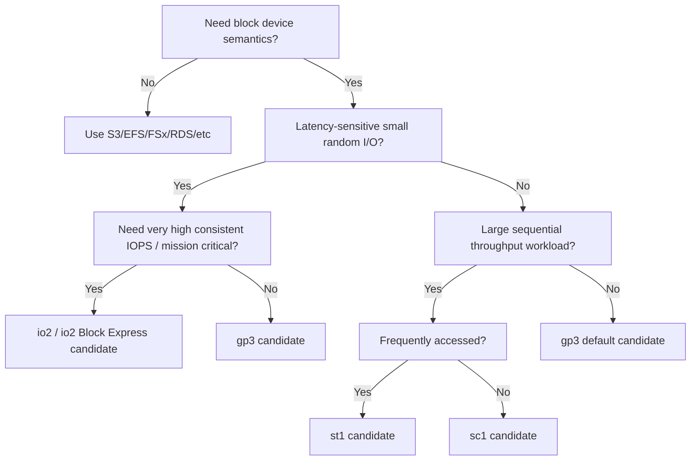

# Part 030 — EBS Volume Types and Workload Fit

> Choose an EBS volume type by access pattern, latency sensitivity, I/O size, queue depth, recovery need, and cost per useful unit. Do not choose by popularity, habit, or copy-paste from an old Terraform module.

Part 029 built the mental model: EBS is a zonal, network-attached block device. This part answers the practical question engineers ask every week:

```text
Which EBS volume type should I use?
```

The useful answer is not just `gp3` or `io2`. The useful answer is a decision procedure.

References used for this part:

- Amazon EBS volume types: https://docs.aws.amazon.com/ebs/latest/userguide/ebs-volume-types.html
- Amazon EBS volume performance: https://docs.aws.amazon.com/ebs/latest/userguide/ebs-performance.html
- Amazon EBS I/O characteristics and monitoring: https://docs.aws.amazon.com/ebs/latest/userguide/ebs-io-characteristics.html
- Amazon EBS Provisioned IOPS SSD volumes: https://docs.aws.amazon.com/ebs/latest/userguide/provisioned-iops.html
- Amazon EBS pricing: https://aws.amazon.com/ebs/pricing/

---

## 1. Problem yang Diselesaikan

EBS offers several volume types because workloads do not all stress storage the same way.

A database transaction log is not the same as a video processing staging disk. A Kafka broker is not the same as a cold archive. A file system with millions of small files is not the same as a sequential backup writer.

The core problem:

```text
Given a workload shape, choose the cheapest EBS configuration that satisfies latency, throughput, durability, recovery, and operational constraints.
```

A bad choice creates one of two failures:

1. Under-provisioned storage: incidents, latency spikes, timeouts, queue buildup.
2. Over-provisioned storage: silent recurring waste.

For senior engineers, both are architecture bugs.

---

## 2. Mental Model: Volume Type Is a Performance Contract

A volume type is not a brand. It is a performance-cost contract.

```text
volume type = media/backing architecture
            + performance dimension
            + max/min limits
            + durability characteristic
            + cost model
            + workload fit
```

At a high level:

| Volume family | Dominant attribute | Typical workload shape |
|---|---|---|
| General Purpose SSD (`gp3`, older `gp2`) | Balanced price/performance | Boot volumes, app volumes, most general workloads |
| Provisioned IOPS SSD (`io2`, older `io1`) | High IOPS, low latency, critical workloads | Databases, latency-sensitive transactional systems |
| Throughput Optimized HDD (`st1`) | Sequential throughput | Big data, log processing, streaming sequential workloads |
| Cold HDD (`sc1`) | Low cost, infrequent access | Cold data, large sequential scans with low frequency |

AWS docs summarize this split as SSD-backed volumes for transactional workloads with frequent small reads/writes where IOPS dominates, and HDD-backed volumes for large sequential I/O where throughput dominates.

---

## 3. The Decision Tree

Start with workload semantics, not volume names.



Refine with these questions:

1. What is the average and p95 I/O size?
2. Is the workload random or sequential?
3. Is it read-heavy, write-heavy, or mixed?
4. Is latency more important than throughput?
5. What is the acceptable p99 storage latency?
6. What is the required IOPS at peak?
7. What is the required MiB/s at peak?
8. Can the EC2 instance deliver that EBS bandwidth?
9. Is the volume restored from snapshot during recovery?
10. Is the workload critical enough to pay for `io2` durability/performance?
11. Is this production data, cache, scratch, or cold data?

---

## 4. `gp3`: The Default General-Purpose Workhorse

`gp3` should be your default starting point for most general EBS workloads unless the workload proves otherwise.

### Why `gp3` is often the default

- SSD-backed.
- Good general-purpose latency/performance profile.
- IOPS and throughput can be provisioned independently from volume size within service limits.
- Avoids the old `gp2` pattern where baseline IOPS scaled with size and burst credits mattered.
- Good for boot volumes, app data, moderate databases, queues, search nodes, CI caches, and general local persistent state.

### Typical good fits

- EC2 root volumes.
- General app data volumes.
- Moderate PostgreSQL/MySQL workloads.
- Elasticsearch/OpenSearch data nodes with measured sizing.
- Build agents needing persistent cache.
- Queue spool with moderate I/O.
- File processing with mixed I/O.
- Most lift-and-shift application disks.

### When `gp3` is not enough

`gp3` may not be enough when:

- p99 write latency is business-critical;
- workload requires very high sustained IOPS;
- workload requires higher throughput than `gp3` can deliver;
- database commit latency becomes bottleneck;
- EBS exceeded metrics show consistent saturation despite tuning;
- instance EBS capability is not the bottleneck;
- recovery objective requires faster restored performance and volume characteristics are insufficient.

### Practical gp3 sizing model

Start with:

```text
required_iops = peak_iops * headroom_factor
required_throughput = peak_mib_per_sec * headroom_factor
```

Then check:

```text
required_iops <= gp3 provisionable IOPS limit
required_throughput <= gp3 provisionable throughput limit
instance_ebs_iops >= required_iops
instance_ebs_throughput >= required_throughput
latency SLO satisfied under load
```

### Example

Workload:

- API service writes audit events locally before async upload.
- Peak: 1,200 write IOPS.
- Average I/O size: 16 KiB.
- Throughput: about 18.75 MiB/s.
- Latency SLO: p99 below 20 ms.

Decision:

- `gp3` is a strong candidate.
- Provision baseline plus headroom, e.g. 3,000–6,000 IOPS depending on benchmark.
- Throughput likely not bottleneck.
- Monitor latency and exceeded checks.

---

## 5. `io2`: Critical IOPS-Intensive Storage

`io2` is for workloads where consistent performance, lower latency variability, high IOPS, higher durability characteristics, or mission-critical database behavior justify cost.

AWS docs describe Provisioned IOPS SSD volumes as the highest performance EBS volumes for critical IOPS-intensive and throughput-intensive workloads that require low latency. `io2` Block Express is designed for demanding I/O-intensive workloads on Nitro-based instances and supports higher performance characteristics than general-purpose volumes.

### Typical good fits

- Critical relational databases on EC2.
- Oracle, SQL Server, SAP HANA-like demanding workloads.
- High-write transactional stores.
- Workloads with strict p99/p999 latency requirements.
- High-value systems where storage performance variance is unacceptable.
- Large single-volume designs that need high IOPS/throughput.

### `io2` is not a substitute for architecture

Do not buy `io2` to hide:

- missing indexes;
- bad query plans;
- unbounded compaction;
- too-small buffer cache;
- instance type bottleneck;
- filesystem misconfiguration;
- application-level lock contention;
- lack of batching;
- poor database checkpoint configuration.

Use `io2` when the storage path remains the bottleneck after workload and instance tuning.

### Decision rule

Use `io2` when all are true:

- workload requires block device semantics;
- I/O is latency-sensitive;
- required IOPS/throughput is high and sustained;
- `gp3` cannot satisfy p99/p999 latency/performance at acceptable cost/risk;
- instance type can drive the volume;
- database/application design has already been checked;
- business value justifies recurring cost.

### Example

Workload:

- Self-managed database on EC2.
- Peak write load: 40,000 IOPS.
- Commit latency directly affects checkout latency.
- p99 write latency SLO is strict.
- Instance type has sufficient EBS capability.
- Query/DB tuning done.

Decision:

- `io2` is likely the right class.
- Validate with production-shaped benchmark.
- Consider layout: data volume, WAL/log volume, backup/restore path.
- Add explicit restore test because high-performance primary volume does not prove recovery speed.

---

## 6. `st1`: Throughput-Optimized HDD

`st1` is for large, sequential, throughput-oriented workloads that do not need SSD-like random I/O latency.

### Typical good fits

- Big data processing.
- Sequential log processing.
- Large ETL staging.
- Streaming workloads with large sequential reads/writes.
- Data warehouse staging.
- Large scan-heavy workloads.

### Bad fits

- Boot volumes.
- Databases with small random I/O.
- Latency-sensitive transaction logs.
- Metadata-heavy file workloads.
- Small random read/write applications.
- Workloads requiring low p99 latency.

AWS docs state HDD-backed volumes perform best with large sequential I/O and are poor for small/random I/O. That means `st1` is not just "cheaper gp3". It is a different performance shape.

### Queue depth matters

Throughput-oriented HDD workloads often need enough queue depth and large I/O size to achieve expected throughput. If the application sends small random operations, it will not get the advertised shape.

### Example

Workload:

- Nightly pipeline reads 3 TB of log segments sequentially.
- Large blocks.
- Latency is not user-facing.
- Pipeline can retry.
- Cost matters.

Decision:

- `st1` can fit if access is frequent and sequential.
- Benchmark with realistic I/O size.
- Track burst balance and throughput.

---

## 7. `sc1`: Cold HDD

`sc1` is low-cost HDD-backed storage for infrequently accessed data.

### Typical good fits

- Cold datasets that still need block access.
- Infrequent large sequential reads.
- Archive-like volumes where S3/Glacier is not suitable due to block interface needs.
- Legacy workloads with large cold disks.

### Bad fits

- Boot volumes.
- Active databases.
- Random I/O.
- Latency-sensitive applications.
- Frequent access.
- Workloads where restore/access delay causes user-facing impact.

### The key question

```text
Why does cold data need to be on a block device instead of S3 lifecycle storage?
```

If the answer is weak, S3 is probably better.

---

## 8. What About `gp2` and `io1`?

`gp2` and `io1` are older generation choices. You will still encounter them in legacy environments.

### `gp2`

`gp2` ties baseline performance to volume size and uses burst credits for smaller volumes. Many old systems over-sized `gp2` volumes just to get IOPS. `gp3` often lets teams provision IOPS and throughput more directly.

Migration question:

```text
Can this gp2 volume be converted to gp3 with equivalent or better provisioned performance and lower cost?
```

Often yes, but validate:

- current baseline/burst behavior;
- peak IOPS;
- throughput;
- instance bottleneck;
- application latency;
- modify-volume rollout risk.

### `io1`

`io1` is older Provisioned IOPS SSD. Newer designs commonly prefer `io2` when Provisioned IOPS SSD is justified, but existing workloads may remain on `io1`. Migrate only with testing and a clear benefit.

---

## 9. Workload Fit Matrix

| Workload | Candidate | Reasoning |
|---|---|---|
| EC2 boot volume | `gp3` | General-purpose SSD; predictable and cost-effective. |
| App config/cache with persistence | `gp3` | Balanced profile; tune if needed. |
| Moderate PostgreSQL | `gp3` first, `io2` if proven | Start measured; move to `io2` for strict latency/high IOPS. |
| Critical database commit path | `io2` candidate | Low-latency/high-IOPS requirement. |
| Kafka broker logs | `gp3` or `st1` depending pattern | Kafka can be sequential but also latency-sensitive; benchmark. |
| Search index data node | `gp3` first | Mixed I/O; scale by benchmark. |
| Large ETL staging disk | `st1` candidate | Sequential throughput. |
| Cold legacy archive volume | `sc1` candidate | Low cost if block access required. |
| User uploads | Usually not EBS | Prefer S3 unless filesystem semantics are required. |
| Shared content across fleet | Usually not EBS | Prefer EFS/FSx/S3 depending semantics. |
| Scratch/temp data | Maybe instance store | If data can be lost, instance store may fit. |

---

## 10. IOPS vs Throughput Decision

### Use IOPS-driven thinking when

- I/O size is small;
- operations are random;
- latency matters;
- database transactions dominate;
- fsync is frequent;
- workload has many metadata operations;
- queue depth must remain low.

Candidate volume types:

- `gp3` for moderate/general use;
- `io2` for high/critical use.

### Use throughput-driven thinking when

- I/O size is large;
- access is sequential;
- batch duration matters more than per-op latency;
- queue depth can be higher;
- workload reads/writes large files or segments.

Candidate volume types:

- `gp3` if mixed or SSD behavior still useful;
- `st1` if large sequential frequent access;
- `sc1` if cold/infrequent access.

### Formula

```text
MiB/s = IOPS * I/O_size_KiB / 1024
```

Examples:

| IOPS | I/O size | Throughput |
|---:|---:|---:|
| 3,000 | 16 KiB | ~46.9 MiB/s |
| 3,000 | 64 KiB | ~187.5 MiB/s |
| 3,000 | 256 KiB | ~750 MiB/s |
| 500 | 1,024 KiB | ~500 MiB/s |

But the actual result is capped by both volume and instance limits.

---

## 11. Latency Decision

Latency-sensitive workloads need more than enough aggregate IOPS. They need stable completion time.

### Ask these questions

- What is p50/p95/p99 read latency?
- What is p50/p95/p99 write latency?
- Which app operation waits on storage?
- Is the workload sync or async?
- Does batching improve useful latency?
- Does queue depth rise under peak?
- Does latency spike during checkpoint/compaction/snapshot/backup?
- Is latency caused by EBS or app lock contention?

### Bad measurement pattern

```text
VolumeReadOps looks fine, so storage is fine.
```

Ops count alone does not prove latency health.

### Better measurement pattern

```text
application p99 latency
+ database wait events
+ OS iostat await/queue
+ EBS avg latency/exceeded checks
+ instance EBS capability
+ workload phase correlation
```

---

## 12. Instance Capability Check

Provisioning a high-performance EBS volume does not guarantee the instance can drive it.

Decision procedure:

```text
1. Determine required volume IOPS and throughput.
2. Check selected EBS volume type limits.
3. Check selected EC2 instance EBS-optimized bandwidth/IOPS limits.
4. Check whether network traffic and EBS traffic contend for resources on that instance family.
5. Benchmark the full path.
```

If the instance is the bottleneck, changing volume type may do nothing.

### Symptoms of instance bottleneck

- Volume provisioned limits are high.
- Application cannot reach expected throughput.
- EBS exceeded checks do not show volume-level saturation.
- Larger instance improves EBS performance without changing volume.
- Multiple volumes together exceed instance EBS bandwidth.

### Correct fix

- Choose instance with higher EBS bandwidth.
- Reduce per-node storage demand.
- Split workload across nodes.
- Use storage layout designed for aggregate throughput.
- Avoid over-provisioning volume beyond instance capability.

---

## 13. Benchmarking Correctly

A benchmark that does not resemble the workload is a trap.

### Bad benchmark

```bash
fio --name=test --filename=/data/testfile --rw=read --bs=1M --iodepth=64
```

Then using the result to justify a transactional database volume.

### Benchmark dimensions

Match:

- read/write mix;
- random/sequential ratio;
- block size;
- queue depth;
- number of jobs;
- file size larger than cache;
- sync behavior;
- fsync pattern;
- runtime duration;
- warm/cold volume state;
- filesystem and mount options;
- instance type;
- CPU/memory contention;
- app-level concurrency.

### Example `fio` patterns

Small random read/write, database-like:

```bash
fio --name=db-randrw \
  --filename=/data/fio.test \
  --size=20G \
  --rw=randrw \
  --rwmixread=70 \
  --bs=16k \
  --iodepth=16 \
  --numjobs=4 \
  --direct=1 \
  --time_based \
  --runtime=300 \
  --group_reporting
```

Sequential throughput:

```bash
fio --name=seq-write \
  --filename=/data/fio.seq \
  --size=100G \
  --rw=write \
  --bs=1M \
  --iodepth=32 \
  --numjobs=2 \
  --direct=1 \
  --time_based \
  --runtime=300 \
  --group_reporting
```

Sync write behavior:

```bash
fio --name=sync-writes \
  --filename=/data/fio.sync \
  --size=10G \
  --rw=write \
  --bs=8k \
  --iodepth=1 \
  --numjobs=8 \
  --direct=1 \
  --fdatasync=1 \
  --time_based \
  --runtime=300 \
  --group_reporting
```

### Benchmark rule

Benchmark the decision you are actually making.

If deciding between `gp3` and `io2` for database commit latency, benchmark sync write latency under realistic concurrency, not only maximum sequential throughput.

---

## 14. Cost Model

Cost should be measured per useful unit, not only per GB.

### Useful cost units

| Workload | Useful denominator |
|---|---|
| API with local durable queue | cost per successful request at SLO |
| Database | cost per transaction at p99 latency target |
| Batch pipeline | cost per TB processed within SLA |
| Search cluster | cost per query/index update at latency target |
| Archive | cost per TB-month plus retrieval/restore cost |

### Over-provisioning patterns

- Large `gp2` volumes kept only for IOPS.
- `io2` chosen before measuring bottleneck.
- `st1` chosen for random I/O and then scaled up unnecessarily.
- `gp3` IOPS provisioned beyond instance capability.
- Old snapshots retained without lifecycle owner.
- Unattached volumes left running.
- Root volumes oversized across fleet.

### Cost review checklist

- [ ] Are old `gp2` volumes candidates for `gp3`?
- [ ] Are provisioned IOPS actually used?
- [ ] Is throughput provisioned above observed peak + headroom?
- [ ] Is the instance too small to use provisioned volume performance?
- [ ] Are unattached volumes tagged and cleaned?
- [ ] Are snapshots lifecycle-managed?
- [ ] Is `io2` justified by SLO and measured bottleneck?
- [ ] Should cold block data move to S3 instead?

---

## 15. Migration and ModifyVolume Strategy

EBS Elastic Volumes allows changing size, volume type, and performance characteristics without detaching in many workflows. But online modification is still a production change.

### Common migrations

| From | To | Reason |
|---|---|---|
| `gp2` | `gp3` | Better control over IOPS/throughput and often cost optimization. |
| `gp3` | higher `gp3` IOPS/throughput | Workload grew; stay on general-purpose SSD. |
| `gp3` | `io2` | Strict latency/high sustained IOPS requirement. |
| `st1` | `gp3` | Workload became random/latency-sensitive. |
| `sc1` | S3 | Block semantics no longer needed. |
| smaller volume | larger volume | Data growth. |

### Migration runbook

1. Capture baseline metrics for at least one business cycle.
2. Identify bottleneck and target performance.
3. Confirm instance can use target volume performance.
4. Snapshot volume before modification.
5. Apply modification in non-peak window if risk exists.
6. Monitor modification progress.
7. Expand filesystem if size changed.
8. Compare latency/IOPS/throughput after change.
9. Roll back by restoring snapshot if needed.
10. Update Terraform/source of truth.

### Filesystem expansion example

XFS:

```bash
# after EBS volume size modification completes enough for OS to see size
sudo growpart /dev/nvme1n1 1 || true
sudo xfs_growfs /data
```

ext4:

```bash
sudo growpart /dev/nvme1n1 1 || true
sudo resize2fs /dev/nvme1n1p1
```

Actual commands depend on whether the volume has a partition table or direct filesystem.

---

## 16. Terraform Patterns

### gp3 default module pattern

```hcl
variable "ebs_size_gib" {
  type    = number
  default = 100
}

variable "ebs_iops" {
  type    = number
  default = 3000
}

variable "ebs_throughput" {
  type    = number
  default = 125
}

resource "aws_ebs_volume" "data" {
  availability_zone = var.availability_zone
  type              = "gp3"
  size              = var.ebs_size_gib
  iops              = var.ebs_iops
  throughput        = var.ebs_throughput
  encrypted         = true

  tags = merge(var.tags, {
    Name          = "${var.service_name}-data"
    StorageClass  = "block"
    VolumeType    = "gp3"
    BackupPolicy  = var.backup_policy
    DataLifecycle = var.data_lifecycle
  })
}
```

### io2 pattern with explicit justification

```hcl
resource "aws_ebs_volume" "db_data" {
  availability_zone = var.availability_zone
  type              = "io2"
  size              = var.db_volume_size_gib
  iops              = var.db_iops
  encrypted         = true
  kms_key_id        = var.kms_key_id

  tags = merge(var.tags, {
    Name                 = "${var.service_name}-db-data"
    StorageClass         = "block"
    VolumeType           = "io2"
    PerformanceJustified = "database-p99-write-latency"
    Owner                = var.owner
  })
}
```

### Policy-as-code idea

Reject risky defaults:

```text
- no unencrypted production EBS volumes
- no untagged EBS volumes
- no io2 without owner and justification tag
- no st1/sc1 for root volumes
- no data volume without backup policy tag
- no volume bigger than threshold without lifecycle owner
```

---

## 17. Observability by Volume Type

### For `gp3`

Watch:

- average read/write latency;
- IOPS exceeded check;
- throughput exceeded check;
- volume queue length;
- instance EBS bandwidth;
- filesystem free space;
- application p99.

Question:

```text
Am I constrained by provisioned IOPS, provisioned throughput, instance capability, or application behavior?
```

### For `io2`

Watch:

- latency distribution;
- IOPS utilization;
- throughput utilization;
- queue depth;
- database wait events;
- checkpoint/flush phases;
- instance EBS limits.

Question:

```text
Am I getting the latency consistency I paid for, and is storage still the real bottleneck?
```

### For `st1`/`sc1`

Watch:

- throughput;
- burst balance;
- average I/O size;
- queue length;
- read-ahead effectiveness;
- small/random I/O symptoms;
- snapshot-time performance drop.

Question:

```text
Is the workload actually large sequential I/O, or did it drift into random I/O?
```

---

## 18. Failure Modes by Bad Volume Choice

### Bad choice 1 — `st1` for random database I/O

Symptom:

- high latency;
- poor throughput despite large volume;
- database timeouts;
- queue length grows.

Fix:

- move to `gp3` or `io2` depending latency/IOPS requirement;
- restore from snapshot or modify volume where supported;
- verify database layout.

### Bad choice 2 — Oversized `gp2` legacy volume

Symptom:

- very large disk with low used space;
- cost high;
- volume size chosen for IOPS, not capacity.

Fix:

- evaluate `gp3` migration;
- provision IOPS/throughput explicitly;
- validate performance under peak.

### Bad choice 3 — `io2` used to hide app bottleneck

Symptom:

- storage cost high;
- p99 still bad;
- database wait events point to locks/CPU/query plan;
- EBS not saturated.

Fix:

- tune application/database;
- right-size volume after bottleneck analysis;
- possibly move back to `gp3`.

### Bad choice 4 — `gp3` under-provisioned for checkpoint bursts

Symptom:

- periodic latency spikes;
- app p99 correlates with checkpoint/compaction;
- EBS exceeded checks show bursts.

Fix:

- increase IOPS/throughput;
- tune checkpoint behavior;
- separate WAL/data if justified;
- move to `io2` if latency remains critical.

### Bad choice 5 — Cold archive kept on EBS without reason

Symptom:

- low access volume;
- high monthly cost compared with object lifecycle;
- no block-specific requirement.

Fix:

- move to S3 storage class/lifecycle if semantics allow;
- keep only active working set on EBS.

---

## 19. Decision Examples

### Example A — Java API root volume

Requirement:

- boot OS;
- app logs shipped externally;
- no local durable state;
- replacement via ASG.

Choice:

```text
gp3 root volume, modest size, encrypted, replaceable
```

Why:

- general-purpose;
- low complexity;
- state externalized.

### Example B — Self-managed PostgreSQL, moderate traffic

Requirement:

- 2,000–6,000 IOPS peak;
- p99 acceptable under `gp3` benchmark;
- daily snapshots;
- app can tolerate brief failover.

Choice:

```text
gp3 data volume with provisioned IOPS/throughput
```

Why:

- good cost/performance;
- no need for `io2` unless benchmark proves latency gap.

### Example C — Payment database with strict write p99

Requirement:

- high sustained IOPS;
- strict commit latency;
- high business impact;
- tuned DB still storage-bound.

Choice:

```text
io2, possibly separate WAL/data volumes, benchmarked on target instance
```

Why:

- storage performance consistency matters.

### Example D — Spark-like nightly log processing

Requirement:

- large sequential reads;
- not user-facing;
- cost-sensitive;
- retryable.

Choice:

```text
st1 candidate, or S3-native pipeline if possible
```

Why:

- throughput-oriented workload.

### Example E — Legacy cold dataset

Requirement:

- block device required by legacy software;
- accessed monthly;
- large sequential reads.

Choice:

```text
sc1 candidate, but challenge whether S3 can replace it
```

Why:

- low-cost block storage, but object storage may be better.

---

## 20. Runbook: Storage Latency Incident

### Step 1 — Confirm user impact

- Which service?
- Which endpoint/job/query?
- p50/p95/p99 changed?
- Error rate changed?
- Since when?

### Step 2 — Correlate workload phase

- deploy?
- backup?
- snapshot?
- restore?
- checkpoint?
- compaction?
- batch job?
- traffic spike?
- node replacement?

### Step 3 — Check OS

```bash
df -h
df -ih
iostat -xz 1
pidstat -d 1
vmstat 1
dmesg -T | tail -100
```

### Step 4 — Check EBS metrics

- read/write latency;
- read/write ops;
- read/write bytes;
- queue length;
- IOPS exceeded;
- throughput exceeded;
- stalled I/O check;
- burst balance where applicable.

### Step 5 — Check instance capability

- instance type EBS bandwidth;
- network contention;
- CPU/memory pressure;
- noisy co-located workload;
- number of attached volumes.

### Step 6 — Decide remediation

| Finding | Action |
|---|---|
| Volume IOPS exceeded | Increase IOPS or reduce workload. |
| Volume throughput exceeded | Increase throughput or reduce I/O size/volume demand. |
| Instance EBS limit hit | Move to instance with higher EBS capability or split workload. |
| HDD random I/O | Migrate to SSD-backed volume. |
| Cold restored volume | Warm volume or use Fast Snapshot Restore next time. |
| App lock/query bottleneck | Fix app/database; volume change may not help. |
| Disk full | Expand volume, clean data, fix lifecycle. |

---

## 21. Checklist for Volume Type Selection

- [ ] Workload requires block storage semantics.
- [ ] Access pattern is classified: random/sequential, read/write mix, sync/async.
- [ ] Average and p95 I/O size are known or estimated from measurement.
- [ ] IOPS requirement is known for normal and peak load.
- [ ] Throughput requirement is known for normal and peak load.
- [ ] Latency SLO is explicit.
- [ ] Queue depth tolerance is understood.
- [ ] Volume type candidate matches workload shape.
- [ ] EC2 instance EBS capability can support the selected volume.
- [ ] Cost per useful unit is calculated.
- [ ] Snapshot/restore behavior is included in decision.
- [ ] Monitoring exists for volume and instance saturation.
- [ ] Migration/rollback plan exists.
- [ ] Terraform/source of truth records the volume performance contract.

---

## 22. Summary

Use this default reasoning:

```text
Need block storage?
  No  -> choose a better storage primitive.
  Yes -> classify I/O shape.

Small/random/latency-sensitive?
  Start gp3.
  Move to io2 when SLO and measurements justify it.

Large/sequential/throughput-heavy?
  Consider st1 if frequently accessed.
  Consider sc1 only if cold and block semantics are required.

Legacy gp2/io1?
  Evaluate migration, but benchmark and protect rollback.
```

The important skill is not memorizing EBS volume names. The important skill is mapping workload behavior to a storage contract, then proving with metrics that the contract is satisfied at acceptable cost.

The next part goes deeper into EBS performance engineering: filesystem tuning, queue depth, block size, initialization, benchmarking, and bottleneck isolation.
