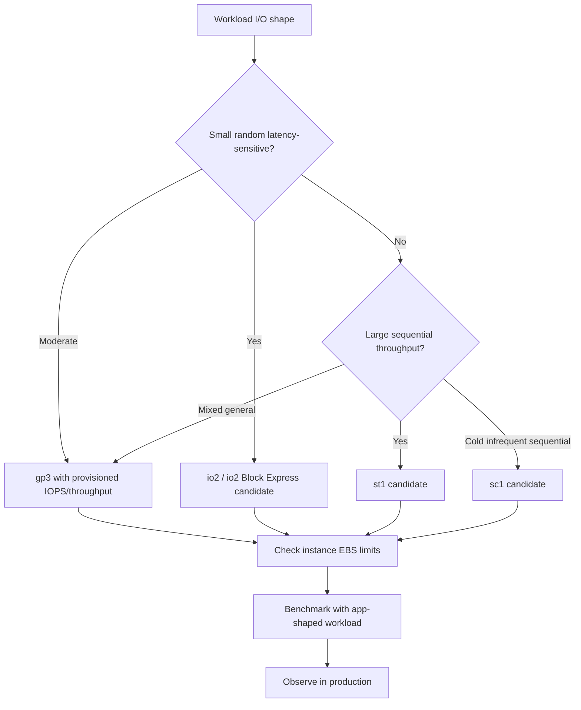
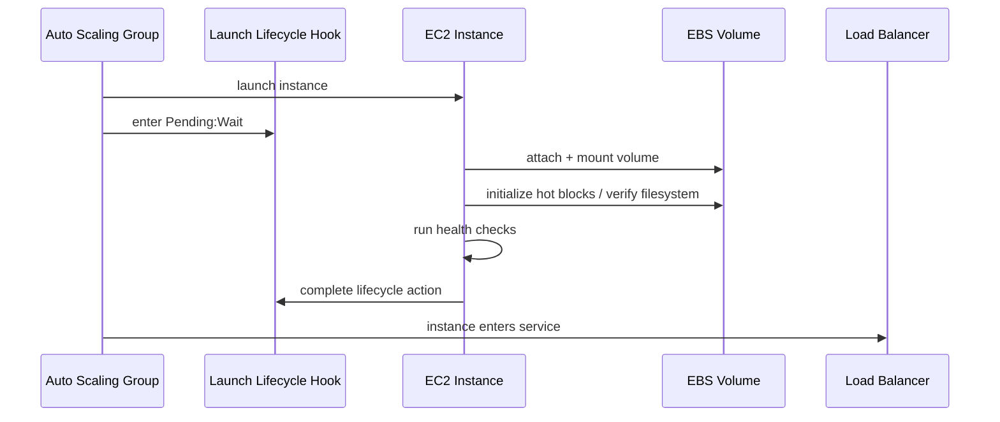

# Part 031 — EBS Performance Engineering

EBS performance engineering is not about memorizing that `gp3` can do more IOPS than `gp2`, or that `io2` is for databases. That is catalogue knowledge. The production skill is knowing where the I/O path is saturated, which layer owns the latency, which metric proves it, and which change improves useful throughput without silently damaging durability or cost.

EBS is a network-attached block device. Your application sees a disk. The actual path is longer:


A latency spike at the application is therefore not automatically an EBS problem. It can be caused by the application issuing synchronous tiny writes, the filesystem journal flushing, Linux writeback behavior, a saturated instance EBS bandwidth limit, a queue depth mismatch, a cold volume restored from snapshot, a noisy batch job, a disk-full condition, or a volume type that does not match the I/O shape.

This part gives you a working model for diagnosing and engineering EBS performance in production.

---

## 1. Problem yang Diselesaikan

The core problem:

> How do we design, measure, tune, and debug EBS-backed workloads so that storage latency, IOPS, throughput, and cost behave predictably under real production load?

In production, EBS performance questions usually appear as one of these incidents:

- “Database latency suddenly increased.”
- “The app is CPU-light, but requests are slow.”
- “We provisioned 16,000 IOPS but only see 4,000.”
- “Disk queue length is high; should we increase IOPS?”
- “After restoring from snapshot, the first minutes are slow.”
- “The EBS volume is fine, but the instance cannot push more throughput.”
- “Benchmark says it is fast, but the real app is slow.”
- “Scale-out made things worse because every node restored the same dataset from snapshot.”

The answer is rarely a single knob. EBS performance is an end-to-end contract across:

1. **Application I/O pattern** — random/sequential, sync/async, read/write ratio, block size, fsync frequency.
2. **Filesystem and OS behavior** — page cache, journal, writeback, scheduler, mount options, readahead.
3. **Volume capability** — provisioned IOPS, provisioned throughput, volume type, volume size, snapshot initialization state.
4. **Instance capability** — EBS bandwidth, network bandwidth, Nitro capability, CPU available to process I/O.
5. **Operational envelope** — backup window, batch jobs, compaction, replication, log rotation, restore time objective.

The production-grade engineer does not ask, “Which volume type is fastest?” They ask:

> “What is the I/O shape, what layer is saturated, what is the SLO, and what is the cheapest safe way to meet it?”

---

## 2. Mental Model

### 2.1 EBS exposes block storage, not application semantics

EBS knows blocks. It does not know whether those blocks are PostgreSQL heap pages, Kafka segments, Lucene indexes, JVM heap dumps, append-only logs, or temporary sort files.

That means EBS cannot automatically solve application-level consistency, transaction boundaries, compaction behavior, or file-level access patterns. It gives you a block device with a performance envelope. You must align the application, filesystem, and volume design with that envelope.

### 2.2 Four performance dimensions

Every EBS-backed workload has four practical dimensions:

| Dimension | Meaning | Typical symptom when wrong |
|---|---|---|
| IOPS | Number of I/O operations per second | Random reads/writes are slow; queue grows under small operations |
| Throughput | MiB/s transferred | Sequential scans, backups, compaction, or large file copies are slow |
| Latency | Time per I/O operation | Request p95/p99 increases, fsync is slow, DB commit stalls |
| Queue depth | Number of pending I/O requests | Volume is underfed or overloaded; latency becomes unstable |

Do not optimize one dimension blindly. High IOPS with tiny blocks can still produce low throughput. High throughput with large sequential blocks can still fail an OLTP workload that needs low-latency small random writes.

### 2.3 Little’s Law for storage intuition

A useful approximation:

```text
concurrency ≈ throughput * latency
```

For I/O:

```text
queue depth ≈ IOPS * average latency_seconds
```

If a volume completes 10,000 IOPS with 2 ms average latency:

```text
queue depth ≈ 10,000 * 0.002 = 20
```

This is not a tuning formula you apply mechanically. It is a sanity model. If the application issues only one synchronous I/O at a time, it may never reach provisioned IOPS. If it issues too many pending requests, queueing delay may explode.

### 2.4 The slowest contract wins

An EBS volume has a performance limit, but so does the EC2 instance. The actual ceiling is roughly:

```text
effective_EBS_performance = min(
  volume_limit,
  instance_EBS_limit,
  OS/filesystem_limit,
  application_issue_rate,
  downstream_consistency_requirement
)
```

Common failure: increasing `gp3` from 3,000 to 16,000 IOPS while the instance type has lower EBS bandwidth, the application has synchronous write bottleneck, or the filesystem is waiting on journal flushes. The bill increases; the user sees no improvement.

---

## 3. Core Concepts

### 3.1 IOPS

IOPS measures operation count. It matters most when operations are small and random.

Examples:

- OLTP database random reads/writes.
- Search index lookup.
- Metadata-heavy workloads.
- Many small files.
- Message broker segment index access.

IOPS alone is incomplete because operation size matters.

```text
throughput MiB/s = IOPS * block_size_KiB / 1024
```

Examples:

| IOPS | Block size | Approx throughput |
|---:|---:|---:|
| 3,000 | 4 KiB | 11.7 MiB/s |
| 3,000 | 256 KiB | 750 MiB/s |
| 16,000 | 4 KiB | 62.5 MiB/s |
| 16,000 | 64 KiB | 1,000 MiB/s |

This is why “we need 10,000 IOPS” is not enough. You need IOPS plus block size plus latency target.

### 3.2 Throughput

Throughput matters when moving large amounts of data.

Examples:

- Log scan.
- Backup and restore.
- Kafka segment replication.
- ETL staging.
- Database full table scan.
- Large artifact extraction.
- ML dataset pre-processing.

A throughput-bound workload may not need many IOPS. It needs large sequential I/O, enough queue depth, and enough instance bandwidth.

### 3.3 Latency

Latency is the time from issuing an I/O request until completion. For user-facing applications, storage latency becomes visible when the request path waits on disk.

Important distinction:

| Latency type | Meaning |
|---|---|
| Device latency | How long EBS takes to complete I/O |
| Filesystem latency | Includes filesystem/journal behavior |
| Application latency | Includes locks, runtime, serialization, transaction logic |
| User-visible latency | End-to-end request latency |

You can have healthy EBS latency and bad application latency if the application serializes writes under a single lock. You can also have bad EBS latency hidden by page cache until an `fsync` or checkpoint exposes it.

### 3.4 Queue depth

Queue depth is the number of outstanding I/O operations. Too low means the volume is underfed. Too high means operations are waiting and latency may increase.

AWS documentation emphasizes that optimal queue length depends on I/O size and latency, and the benchmark guidance recommends targeting queue length according to volume/workload class rather than guessing.

Practical intuition:

- **Small random SSD workload**: needs enough parallelism to keep provisioned IOPS busy.
- **Large sequential HDD workload**: needs a queue of large requests to keep throughput stable.
- **Latency-sensitive workload**: queue depth must be controlled; more queue can improve throughput but hurt p99.

### 3.5 Page cache

Linux page cache can hide read latency and absorb writes temporarily. This is useful, but it can mislead benchmarking.

If you benchmark without controlling cache:

- A “disk read” may actually be memory read.
- A “write complete” may mean data was accepted into page cache, not durable on EBS.
- A later `fsync` may pay the real cost.

For serious EBS testing, decide whether you are measuring:

1. **Application-perceived buffered I/O**, or
2. **Device-level direct I/O**.

Both are valid, but they answer different questions.

### 3.6 `fsync` and durability cost

Many production storage issues are not caused by write bandwidth. They are caused by synchronous durability boundaries.

Examples:

- Database commit waits for WAL fsync.
- Message broker waits for segment flush depending on durability setting.
- Application writes a file and calls `fsync` per event.
- Log framework flushes synchronously too often.

`fsync` collapses optimistic buffering into a durability requirement. That is not bad. It is the price of correctness. But it must be designed intentionally.

### 3.7 Cold blocks after restore

Volumes created from snapshots are usable immediately, but blocks may be fetched/initialized when first accessed unless you use Fast Snapshot Restore or explicit initialization. First-touch latency can surprise workloads that expect full performance immediately after restore.

For critical restore paths, performance engineering includes **restore warmup**, **volume initialization**, or **Fast Snapshot Restore**, not only snapshot creation.

---

## 4. Production Design

### 4.1 Start with workload I/O shape

Before choosing a volume or tuning Linux, write the workload shape.

```yaml
workload_io_contract:
  workload: postgres-primary
  critical_path: transaction commit
  read_write_ratio: 70_read_30_write
  operation_shape:
    random_read_size: 8KiB
    wal_write_size: sequential small append
    checkpoint_write_size: large burst
  durability:
    sync_commit_required: true
    data_loss_tolerance: near-zero
  latency_slo:
    commit_p99: 20ms
    query_p99: 100ms
  peak:
    business_hours_multiplier: 4x
    maintenance_window_io_multiplier: 8x
  recovery:
    rpo: 5m
    rto: 30m
```

This contract prevents accidental optimization. A volume that is perfect for sequential backup may be bad for low-latency commits. A configuration that works during daytime queries may fail during compaction or checkpoint.

### 4.2 Separate critical and noisy I/O paths

One of the highest-leverage EBS design choices is isolating different I/O classes.

| Data class | Common behavior | Recommended thinking |
|---|---|---|
| Root volume | OS, packages, logs | Keep boring, small, replaceable |
| Application binaries | Mostly read, low churn | AMI or separate readonly artifact path |
| Database data | Random reads/writes | Tune for latency and IOPS |
| WAL / transaction log | Sequential sync writes | Isolate if fsync latency matters |
| Application logs | Append, rotation bursts | Avoid filling root; ship out quickly |
| Temp/scratch | Burst, disposable | Instance store or separate EBS volume |
| Backup staging | Sequential throughput | Separate volume or direct to S3 |

The goal is not always “many volumes.” The goal is preventing noisy operations from sharing the same bottleneck as the critical path.

### 4.3 Match volume type to shape

A simplified decision map:



This is intentionally conservative. Most general workloads should start with `gp3`, because `gp3` decouples size from provisioned IOPS/throughput more cleanly than old `gp2` mental models. Move to `io2` when low-latency consistency and high IOPS are genuinely needed. Use HDD-backed volumes only when the access pattern is large/sequential and the workload can tolerate their latency profile.

### 4.4 Check the instance before changing the volume

Before increasing EBS performance, check:

- Does the instance type support the target EBS bandwidth?
- Is the instance EBS-optimized by default or enabled?
- Is CPU saturated while handling I/O?
- Is network bandwidth shared with other traffic?
- Is the workload running on Nitro-based instance with the expected driver path?
- Is the instance family suitable for storage-heavy workload?

A common production mistake:

```text
Incident: database storage latency high
Action: increase gp3 IOPS
Result: no improvement
Root cause: instance EBS bandwidth limit already saturated
```

The bottleneck was the compute-storage pipe, not the volume.

### 4.5 Design for maintenance I/O, not only serving I/O

Many services are stable under user traffic and fail during maintenance:

- Database checkpoint.
- VACUUM / compaction.
- Log rotation compression.
- Index rebuild.
- Snapshot creation window.
- Backup agent scan.
- Batch reconciliation.
- Warmup after restore.

Production sizing must include these periodic I/O spikes.

```text
required_storage_envelope = max(
  serving_peak,
  serving_peak + maintenance_overlap,
  restore_warmup,
  failover_catchup,
  compaction_burst
)
```

If you do not model maintenance I/O, your SLO will fail exactly when the system is already operationally fragile.

---

## 5. Implementation Pattern

### 5.1 Baseline EBS volume in Terraform

```hcl
resource "aws_ebs_volume" "data" {
  availability_zone = var.availability_zone
  type              = "gp3"
  size              = 500
  iops              = 6000
  throughput        = 250
  encrypted         = true
  kms_key_id        = var.kms_key_id

  tags = {
    Name        = "orders-db-data"
    Workload    = "orders"
    DataClass   = "primary-data"
    Owner       = "platform"
    Environment = var.environment
  }
}

resource "aws_volume_attachment" "data" {
  device_name = "/dev/sdf"
  volume_id   = aws_ebs_volume.data.id
  instance_id = aws_instance.app.id
}
```

This is intentionally simple. In production, you would usually attach through launch templates, ASG lifecycle automation, or an orchestrator. The important point is that volume attributes are not random defaults. They are part of the workload contract.

### 5.2 Linux filesystem setup

Example setup for a new data volume:

```bash
set -euo pipefail

DEVICE="/dev/nvme1n1"
MOUNT="/data"

sudo file -s "$DEVICE"
sudo mkfs.xfs -f "$DEVICE"
sudo mkdir -p "$MOUNT"

UUID=$(sudo blkid -s UUID -o value "$DEVICE")
echo "UUID=$UUID $MOUNT xfs defaults,noatime,nofail 0 2" | sudo tee -a /etc/fstab

sudo mount -a
sudo chown app:app "$MOUNT"
```

Notes:

- Prefer UUID in `/etc/fstab`, not device name, because NVMe device names can differ.
- `nofail` prevents boot from hanging forever if a non-critical data volume is missing. For critical volumes, you may prefer boot failure over running corrupted/empty state.
- `noatime` avoids unnecessary metadata writes for many workloads.
- Choose `xfs` or `ext4` based on operational familiarity and workload. Do not tune exotic mount options without testing.

### 5.3 Observe from CloudWatch

Useful EBS metrics include, depending on volume type and platform:

| Metric area | Examples | Interpretation |
|---|---|---|
| Operations | read/write ops | IOPS demand |
| Bytes | read/write bytes | Throughput demand |
| Time | read/write time / latency metrics | Latency and service time |
| Queue | volume queue length | Outstanding I/O pressure |
| Idle | idle time | Under-utilization signal |
| Burst | burst balance for burstable classes | Credit depletion risk |
| Status | volume status checks | Impaired/degraded volume signal |

A useful dashboard should align EBS metrics with:

- Application p95/p99 latency.
- DB commit latency or storage wait event.
- OS-level `await`, `svctm` equivalent, `%util` caution, queue size.
- Instance CPU and network.
- Instance EBS bandwidth/throughput where available.
- Maintenance events.

### 5.4 Observe from Linux

Install baseline tools:

```bash
sudo dnf install -y sysstat iotop nvme-cli fio || true
sudo apt-get update && sudo apt-get install -y sysstat iotop nvme-cli fio || true
```

Commands:

```bash
# Per-device I/O pressure
 iostat -xz 1

# Per-process I/O
 sudo pidstat -d 1
 sudo iotop -oPa

# Filesystem and inode usage
 df -h
 df -ih

# NVMe devices and mapping
 lsblk -o NAME,MAJ:MIN,SIZE,TYPE,MOUNTPOINT,FSTYPE,UUID
 sudo nvme list

# Kernel/device errors
 dmesg -T | egrep -i 'nvme|blk|xfs|ext4|io error|timeout'
```

Interpretation hints:

| Signal | Meaning |
|---|---|
| High `await` | I/O operations waiting longer; could be device or queueing |
| High `aqu-sz` | Queue building up |
| Low throughput + high latency | Small sync I/O, under-provisioned IOPS, or serialized app path |
| High throughput + high CPU | CPU may be handling compression/encryption/serialization |
| Disk full | Performance problem may actually be space exhaustion |
| Inodes full | Many-small-file workload; block free space can mislead |

Do not trust a single metric. Correlate.

### 5.5 Benchmark with `fio`

A benchmark must match the workload. A random 4 KiB read test says little about sequential backup throughput. A buffered write test says little about commit latency.

Example: random read/write, direct I/O.

```bash
sudo fio \
  --name=randrw \
  --filename=/data/fio-test.bin \
  --size=20G \
  --time_based \
  --runtime=180 \
  --ramp_time=30 \
  --ioengine=libaio \
  --direct=1 \
  --rw=randrw \
  --rwmixread=70 \
  --bs=4k \
  --iodepth=32 \
  --numjobs=4 \
  --group_reporting
```

Example: sequential throughput.

```bash
sudo fio \
  --name=seqread \
  --filename=/data/fio-test.bin \
  --size=50G \
  --time_based \
  --runtime=180 \
  --ramp_time=30 \
  --ioengine=libaio \
  --direct=1 \
  --rw=read \
  --bs=1M \
  --iodepth=16 \
  --numjobs=2 \
  --group_reporting
```

Benchmark guardrails:

- Do not run destructive tests on production data.
- Use a file larger than memory if measuring disk, not cache.
- Record instance type, volume type, size, IOPS, throughput, filesystem, mount options, kernel version.
- Run enough warmup time.
- Compare CloudWatch and OS metrics during the test.
- Benchmark both cold and warm conditions if restore performance matters.

### 5.6 Snapshot restore initialization

If a volume is created from snapshot and workload must immediately scan existing blocks, plan one of these:

1. **Fast Snapshot Restore** for critical snapshots/AZs.
2. **Explicit volume initialization** before admitting traffic.
3. **Progressive warmup** with degraded readiness until hot data is touched.
4. **Lazy restore acceptance** if first-touch latency is tolerable.

Example warmup pattern:

```bash
# Read all blocks to force initialization. Use carefully; this is heavy I/O.
sudo dd if=/dev/nvme1n1 of=/dev/null bs=1M status=progress
```

For production, do not blindly run this at peak. Treat warmup as a controlled lifecycle phase.



---

## 6. Failure Modes

### 6.1 Provisioned IOPS not reached

Symptoms:

- CloudWatch IOPS below provisioned limit.
- Application latency still high.
- Low queue length.

Possible causes:

- Application is not issuing enough parallel I/O.
- Synchronous single-threaded write path.
- Page cache hiding actual device demand.
- Instance EBS bandwidth limit lower than volume capability.
- CPU bottleneck before I/O can be issued.
- Benchmark block size does not match expected IOPS calculation.

Response:

1. Check queue depth.
2. Check instance EBS limits.
3. Run workload-shaped `fio`.
4. Check application thread/concurrency model.
5. Increase IOPS only after proving the volume is the bottleneck.

### 6.2 High EBS latency

Symptoms:

- Application p99 latency rises.
- DB wait events point to I/O.
- CloudWatch read/write latency rises.
- OS `await` rises.

Possible causes:

- Volume saturated.
- Queue depth too high.
- Instance EBS bandwidth saturated.
- Snapshot restore first-touch latency.
- Maintenance job competing with serving path.
- Filesystem journal pressure.
- Write amplification from small sync writes.

Response:

1. Identify read vs write latency.
2. Identify random vs sequential operation.
3. Correlate with maintenance events.
4. Check volume queue length and instance bandwidth.
5. Move noisy I/O to another volume or time window.
6. Consider higher volume class only after isolating the bottleneck.

### 6.3 Throughput ceiling lower than expected

Symptoms:

- Sequential scan cannot exceed a fixed MiB/s.
- Increasing `fio` jobs does not improve throughput.
- Volume metrics do not reach provisioned throughput.

Possible causes:

- Instance throughput limit.
- Block size too small.
- Queue depth too low.
- Compression/encryption CPU bottleneck.
- Filesystem or application read pattern not sequential.
- Shared network pressure.

Response:

1. Test with 1 MiB sequential I/O.
2. Check instance EBS bandwidth.
3. Increase queue depth for sequential workload.
4. Check CPU and network.
5. Use storage-optimized instance or different architecture if needed.

### 6.4 Volume restored from snapshot is slow

Symptoms:

- Newly restored instance starts but reads are slow.
- First request after failover is slow.
- Latency improves after the dataset is scanned once.

Possible causes:

- Lazy loading of blocks from snapshot.
- No Fast Snapshot Restore.
- Read path touches cold blocks under user traffic.

Response:

1. Check whether the volume was restored from snapshot.
2. Decide whether the workload needs full performance immediately.
3. Use Fast Snapshot Restore for critical restore path, or initialize volume before readiness.
4. Add warmup phase to lifecycle hook.

### 6.5 Disk full presented as performance problem

Symptoms:

- Writes fail or stall.
- Application returns 500 errors.
- Logs show `No space left on device`.
- Database enters protective mode.

Possible causes:

- Root volume filled by logs.
- Data volume filled by compaction/temp files.
- Inodes exhausted due to many small files.
- Snapshot/backup staging wrote locally.

Response:

1. Check `df -h` and `df -ih`.
2. Stop non-critical writers.
3. Expand EBS volume if safe.
4. Expand filesystem.
5. Move logs/temp to separate volume or external sink.
6. Add alert on both block and inode usage.

---

## 7. Performance and Cost Trade-off

### 7.1 Performance knobs have different cost shapes

| Knob | Improves | Cost/risk |
|---|---|---|
| Increase gp3 IOPS | Small random operation capacity | Higher monthly cost; may not help if instance/app bottleneck |
| Increase gp3 throughput | Sequential transfer | Higher monthly cost; instance may cap first |
| Move to io2 | Lower latency, high sustained IOPS | Higher cost; must justify with SLO |
| Larger instance | EBS/network/CPU envelope | Higher compute cost; may solve multiple bottlenecks |
| Separate volumes | Isolation | More operational complexity |
| Use instance store | Very high local performance | Data loss on stop/terminate; must be disposable or replicated |
| Fast Snapshot Restore | Predictable restore performance | Extra cost per snapshot/AZ; quota/credit considerations |
| Warmup before traffic | Predictable latency | Longer launch time, extra I/O |

### 7.2 Cost per useful operation

Do not compare EBS cost by raw provisioned IOPS only. Compare by useful work.

```text
cost_per_successful_transaction =
  (compute_cost + storage_cost + operational_cost) / successful_transactions
```

A cheaper volume that causes retries, timeouts, or replica lag may be more expensive at the system level. A more expensive volume may be cheaper if it reduces overprovisioned compute or avoids incidents.

### 7.3 Overprovisioning can hide design bugs

Increasing IOPS can hide:

- Too frequent fsync.
- Poor batching.
- Excessive small files.
- Bad compaction schedule.
- Logging too much synchronously.
- Noisy neighbor jobs on same volume.

Sometimes paying for more IOPS is correct. But first ask whether the application is wasting I/O.

---

## 8. Operational Runbook

### 8.1 Incident: application latency increased, suspected EBS

1. Confirm user-visible impact.

```text
Which endpoint/job is slow?
Is it read path, write path, or both?
When did it start?
Was there a deploy, snapshot, backup, compaction, failover, scale-out?
```

2. Check application metrics.

- Request p95/p99.
- Error rate.
- DB wait events.
- Commit/fsync latency.
- Queue depth in app/job system.

3. Check OS.

```bash
iostat -xz 1
pidstat -d 1
df -h
df -ih
dmesg -T | tail -100
```

4. Check EBS CloudWatch.

- Read/write ops.
- Read/write bytes.
- Read/write latency/time.
- Queue length.
- Burst balance if applicable.
- Volume status.

5. Check instance envelope.

- CPU.
- Network.
- EBS bandwidth capability.
- Instance family suitability.

6. Classify bottleneck.

| Evidence | Likely bottleneck |
|---|---|
| High queue + high latency + near volume limit | Volume saturation |
| Low queue + low IOPS + high app latency | App serialization or fsync pattern |
| Near instance bandwidth + volume below limit | Instance EBS/network cap |
| New restored volume + cold reads | Snapshot initialization |
| Disk/inodes full | Capacity exhaustion |
| Maintenance job active | Noisy I/O overlap |

7. Mitigate.

- Stop noisy job.
- Shift traffic.
- Increase volume IOPS/throughput if proven.
- Move workload to larger/storage-optimized instance.
- Warm up restored volume.
- Expand full disk.
- Roll back bad deploy.

8. Prevent recurrence.

- Add dashboard/alarm.
- Document I/O contract.
- Separate critical/noisy data.
- Add lifecycle warmup.
- Revise maintenance schedule.
- Add capacity test.

### 8.2 Pre-production EBS performance checklist

- [ ] Workload I/O shape documented.
- [ ] Volume type selected from workload shape, not default habit.
- [ ] Instance EBS limits checked.
- [ ] Filesystem and mount options standardized.
- [ ] Root, data, logs, temp separated where needed.
- [ ] Benchmark matches real block size and read/write ratio.
- [ ] CloudWatch dashboard includes EBS + EC2 + app metrics.
- [ ] Disk and inode alarms exist.
- [ ] Restore performance tested.
- [ ] Snapshot restore warmup or FSR decision documented.
- [ ] Maintenance I/O included in capacity plan.
- [ ] Runbook exists for high latency, full disk, restore slowness.

---

## 9. Common Mistakes

### Mistake 1 — Treating IOPS as the only performance number

IOPS without block size, latency, and queue depth is incomplete. Always ask what operation size and what p99 latency target.

### Mistake 2 — Ignoring instance EBS limit

A volume can be provisioned beyond what the instance can consume. The smaller envelope wins.

### Mistake 3 — Benchmarking the page cache

Buffered benchmarks may measure memory, not EBS. Use direct I/O when measuring device behavior, and buffered I/O when measuring application-perceived behavior.

### Mistake 4 — Mixing critical WAL and noisy temp files

A temp-heavy job can degrade commit latency if it shares the same volume path. Separate or schedule noisy I/O.

### Mistake 5 — Assuming snapshot restore performance is immediately warm

A restored volume can be usable but not fully initialized. Critical restore paths need warmup or Fast Snapshot Restore.

### Mistake 6 — Expanding volume size without expanding filesystem

Increasing EBS volume size is not enough. The OS filesystem must also be expanded.

### Mistake 7 — Making every workload `io2`

`io2` is powerful, but not every workload needs it. Many workloads are better served by `gp3`, better batching, or a larger instance.

### Mistake 8 — No maintenance I/O model

Backup, compaction, checkpoint, restore, and reindexing can dominate peak storage demand.

---

## 10. Checklist

Use this during design review.

### Workload

- [ ] Is the workload random, sequential, or mixed?
- [ ] What are typical and peak block sizes?
- [ ] What is read/write ratio?
- [ ] Is the critical path synchronous?
- [ ] What is acceptable p99 storage wait?
- [ ] What maintenance jobs overlap with serving?

### Volume

- [ ] Is the volume type aligned with I/O shape?
- [ ] Are IOPS and throughput explicitly provisioned where needed?
- [ ] Is encryption configured?
- [ ] Is snapshot/restore path defined?
- [ ] Are tags sufficient for ownership and backup policy?

### Instance

- [ ] Does the instance support required EBS bandwidth?
- [ ] Is CPU sufficient for I/O-heavy workload?
- [ ] Is network traffic competing with EBS path?
- [ ] Is the instance family appropriate?

### OS

- [ ] Filesystem chosen and documented.
- [ ] Mount options documented.
- [ ] Device naming stable via UUID.
- [ ] Disk/inode alarms configured.
- [ ] Log/temp paths isolated where needed.

### Operations

- [ ] Benchmark result stored with configuration.
- [ ] Dashboard shows app + OS + EBS + EC2 metrics.
- [ ] Restore performance tested.
- [ ] Runbook covers high latency and disk full.
- [ ] Cost/performance trade-off documented.

---

## 11. Mini Case Study

### Case: Java order service with PostgreSQL on EC2

A team runs a Java order service with PostgreSQL on EC2. During peak checkout, p99 latency increases from 120 ms to 1.5 s. CPU is only 45%. The team assumes the instance is fine and upgrades the EBS volume from `gp3` 3,000 IOPS to 12,000 IOPS.

Latency improves only slightly.

Investigation:

- Application latency spikes align with PostgreSQL commit latency.
- `iostat` shows high write `await` during peak.
- EBS queue length is moderate, not extreme.
- Volume write throughput is not at limit.
- The instance type has lower effective EBS bandwidth than the newly provisioned volume can use.
- WAL and data files share one volume.
- A reporting job runs large sequential scans during checkout.

Better fix:

1. Move reporting job away from peak window.
2. Separate WAL and data into explicit volumes.
3. Move to an instance type with better EBS bandwidth.
4. Keep `gp3`, but tune IOPS/throughput based on measured WAL/data profile.
5. Add dashboard for commit latency, EBS write latency, queue depth, and reporting job overlap.
6. Add a load test that includes reporting job overlap.

Lesson:

> The first attempted fix increased the volume number, but the real issue was a combination of noisy I/O overlap, instance bandwidth, and WAL/data contention.

---

## 12. Summary

EBS performance engineering is end-to-end engineering. The volume is only one layer. The effective performance envelope is shaped by the application, filesystem, OS, EC2 instance, EBS volume, snapshot state, and operational workload.

The mental model:

```text
application I/O shape
  -> filesystem and OS behavior
  -> instance EBS pipe
  -> EBS volume capability
  -> observed latency/throughput/cost
```

The practical rules:

- Start with I/O shape, not volume type.
- Measure IOPS, throughput, latency, and queue depth together.
- Check instance EBS limits before increasing volume performance.
- Benchmark with workload-shaped tests.
- Separate critical and noisy I/O paths.
- Treat snapshot restore performance as part of the recovery contract.
- Optimize for useful work, not raw provisioned numbers.

The next part moves from performance to protection: EBS snapshots, crash consistency, application consistency, retention, restore testing, and the difference between having backups and having recoverability.

---

## References

- AWS Documentation — Amazon EBS I/O characteristics and monitoring: https://docs.aws.amazon.com/ebs/latest/userguide/ebs-io-characteristics.html
- AWS Documentation — Amazon EBS volume performance: https://docs.aws.amazon.com/ebs/latest/userguide/ebs-performance.html
- AWS Documentation — Benchmark Amazon EBS volumes: https://docs.aws.amazon.com/ebs/latest/userguide/benchmark_procedures.html
- AWS Documentation — CloudWatch metrics for Amazon EBS: https://docs.aws.amazon.com/ebs/latest/userguide/using_cloudwatch_ebs.html
- AWS Documentation — Amazon EBS volume types: https://docs.aws.amazon.com/ebs/latest/userguide/ebs-volume-types.html
- AWS Documentation — Initialize Amazon EBS volumes: https://docs.aws.amazon.com/ebs/latest/userguide/initalize-volume.html
- AWS Documentation — Amazon EBS Fast Snapshot Restore: https://docs.aws.amazon.com/ebs/latest/userguide/ebs-fast-snapshot-restore.html
