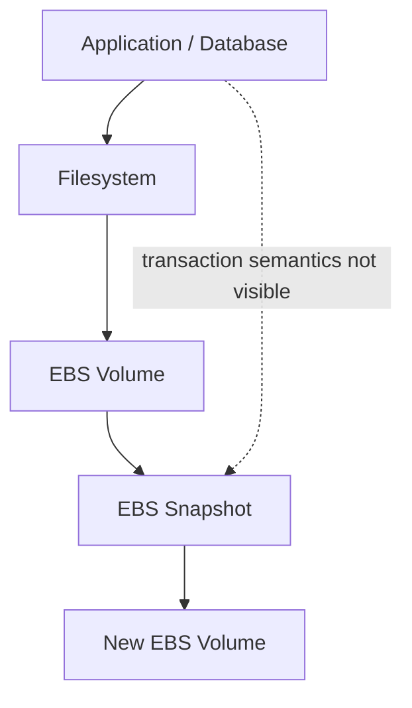
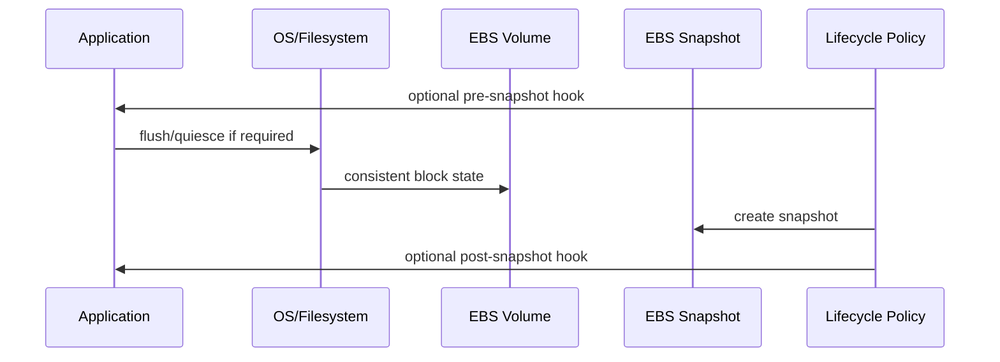
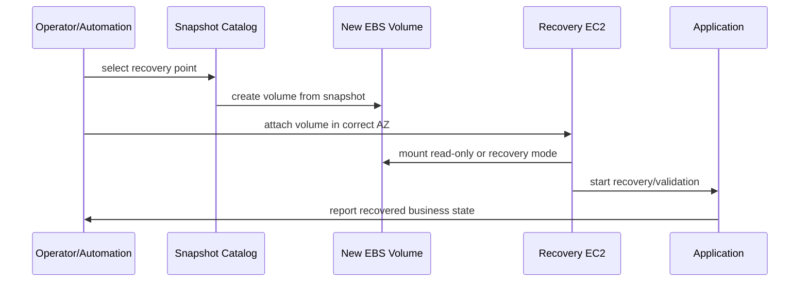
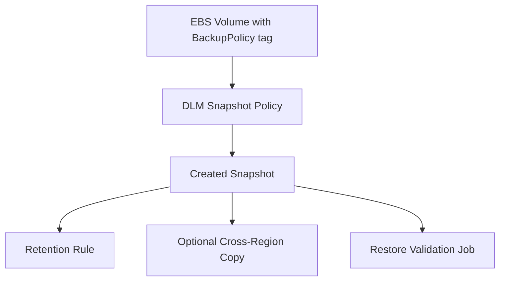
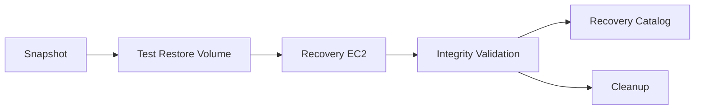

# Part 032 — EBS Snapshots and Data Protection

A snapshot is not a recovery strategy. A snapshot is a primitive.

The dangerous production mistake is believing that because snapshots exist, the system is recoverable. Real recoverability requires a complete chain:

```text
snapshot created
  -> snapshot is consistent enough
  -> snapshot is retained long enough
  -> snapshot is protected from accidental/malicious deletion
  -> snapshot can be found during incident
  -> volume can be restored in the right AZ/Region/account
  -> restored data can be mounted safely
  -> application can verify and resume from that state
  -> RPO/RTO are actually met
```

EBS snapshots are point-in-time incremental backups of EBS volumes. That is powerful, but incomplete by itself. This part builds the production mental model: crash consistency, application consistency, restore testing, retention policy, lifecycle automation, and failure modes.

---

## 1. Problem yang Diselesaikan

The core problem:

> How do we use EBS snapshots as part of a reliable data protection system, not merely as periodic copies that may or may not work during an incident?

You need this when:

- Running databases or stateful services on EC2.
- Maintaining data volumes outside managed database services.
- Building self-managed file/index/search/message workloads.
- Creating rollback points before risky maintenance.
- Migrating volumes across accounts, Regions, or environments.
- Protecting against accidental deletion, corruption, bad deploys, ransomware-like overwrite, or operator mistake.
- Meeting RPO/RTO commitments.

The key distinction:

| Concept | Meaning |
|---|---|
| Backup | A copy exists somewhere |
| Restore | The copy can be converted back into usable storage |
| Recovery | The application returns to a correct business state |
| DR | Recovery still works after larger failure domains |

Most teams have backups. Fewer teams have tested recovery. Very few teams know their real recovery time under pressure.

---

## 2. Mental Model

### 2.1 EBS snapshot is a point-in-time block-level copy

EBS snapshot captures blocks from an EBS volume. It is incremental: after the first snapshot, later snapshots store changed blocks. This reduces storage duplication and enables frequent backups.

But EBS operates below the filesystem and application layer. It sees blocks, not transactions.



If the application has dirty pages, in-memory transactions, write buffers, or partially flushed files, a storage-layer snapshot may capture a state equivalent to a sudden crash. That can be acceptable for crash-safe systems. It is not automatically acceptable for every workload.

### 2.2 Crash-consistent vs application-consistent

| Type | Meaning | Good for | Risk |
|---|---|---|---|
| Crash-consistent | Similar to state after sudden power loss/crash | Journaling filesystems, crash-safe databases, many general workloads | App may need recovery/replay; multi-volume ordering matters |
| Application-consistent | Application flushes/quiesces so on-disk state is logically consistent | Databases, VSS-aware Windows apps, complex stateful systems | Requires app hooks, coordination, operational discipline |
| File-consistent | Filesystem metadata/data are flushed | File workloads | App-level transaction may still be incomplete |

A crash-consistent backup is not bad. Many databases are explicitly designed to recover from crash-consistent storage using WAL/journals. But you must know whether your workload is crash-safe and test restore behavior.

### 2.3 Consistency is a contract, not a checkbox

For each stateful workload, define:

```yaml
snapshot_consistency_contract:
  workload: orders-postgres-primary
  snapshot_type: application-consistent
  quiesce:
    pre_hook: pause writes or pg_start_backup equivalent pattern
    flush: ensure WAL/data durability boundary
    post_hook: resume writes
  multi_volume: true
  restore_validation:
    - filesystem_check
    - database_recovery_startup
    - logical_integrity_check
    - sample_query_validation
  rpo: 5m
  rto: 30m
```

If this contract does not exist, the team is guessing.

### 2.4 RPO and RTO drive snapshot design

| Metric | Question |
|---|---|
| RPO | How much data can we lose? |
| RTO | How long can the service be unavailable/degraded? |

Snapshot frequency affects RPO. Restore automation, volume initialization, runbooks, and application recovery affect RTO.

Frequent snapshots do not guarantee low RTO. A 5-minute snapshot interval is useless if restore takes 6 hours and nobody knows which snapshot is valid.

### 2.5 Restore path is part of architecture

Snapshot creation path:



Restore path:



If you cannot draw the restore path, you do not have a recovery strategy.

---

## 3. Core Concepts

### 3.1 Snapshot lineage and incrementality

EBS snapshots are incremental from the user’s cost/storage perspective. You can delete older snapshots without necessarily losing all data needed by later snapshots; AWS manages referenced blocks. But operationally, you should still treat snapshot lineage carefully:

- Keep retention policy explicit.
- Know which snapshots are recovery points.
- Tag snapshots with workload, environment, consistency type, owner, and restore tier.
- Do not rely on humans to infer meaning from timestamps.

Example tags:

```yaml
snapshot_tags:
  Workload: orders-db
  Environment: prod
  DataClass: primary
  Consistency: application-consistent
  RecoveryTier: tier-1
  Owner: platform-storage
  Retention: 35d
  CreatedBy: dlm
```

### 3.2 Multi-volume snapshots

Many real workloads use more than one volume:

- Data volume.
- WAL/log volume.
- Index volume.
- Temp volume.
- Application metadata volume.

If the application requires ordering across volumes, snapshots must be coordinated. A snapshot of data at time `T1` and WAL at time `T2` can be invalid or require complex recovery.

Design rule:

> If volumes together represent one logical state machine, snapshot them as one consistency group or quiesce the application across all of them.

AWS supports creating crash-consistent snapshots across multiple EBS volumes attached to an EC2 instance using the relevant APIs/features. You still need to decide whether crash consistency is enough for the application.

### 3.3 Application-consistent snapshots

Application consistency usually requires hooks:

1. Signal app/database to prepare.
2. Flush dirty buffers.
3. Pause or fence writes if needed.
4. Create snapshot(s).
5. Resume writes.
6. Record snapshot metadata.
7. Validate asynchronously.

For Windows workloads, AWS documents VSS-based application-consistent snapshot workflows through Systems Manager for VSS-aware applications. For Linux/database workloads, the application-specific mechanism depends on the database or storage engine.

Pseudo-flow:

```bash
#!/usr/bin/env bash
set -euo pipefail

# Example skeleton only. Replace with real database-specific commands.
pre_snapshot() {
  echo "quiesce or enter backup mode"
  # e.g. flush tables with read lock, pg backup API, app maintenance mode, etc.
}

create_snapshot() {
  aws ec2 create-snapshots \
    --instance-specification InstanceId="$INSTANCE_ID" \
    --description "orders-db application-consistent snapshot"
}

post_snapshot() {
  echo "resume writes or exit backup mode"
}

trap post_snapshot EXIT
pre_snapshot
create_snapshot
post_snapshot
trap - EXIT
```

Never copy this blindly into production. The correct pre/post commands depend on the application. The important point is the lifecycle: consistency before snapshot, not after.

### 3.4 Snapshot timing and write pressure

Snapshot creation is designed to be online, but snapshot timing can still matter operationally:

- Heavy write workload during snapshot can increase changed-block churn.
- Application quiesce windows may affect availability.
- Backup agents may compete for I/O.
- Retention jobs can create operational noise.
- Restore tests can consume quota and budget.

The goal is not “never snapshot during peak.” The goal is knowing the impact and designing safe windows or continuous mechanisms.

### 3.5 Fast Snapshot Restore and initialization

A restored EBS volume may be available before all blocks have been fetched/initialized for full performance. For workloads that need immediate predictable performance after restore, use one of:

- Fast Snapshot Restore on selected snapshots and AZs.
- Explicit initialization rate / volume initialization workflow.
- Read-warmup before traffic.
- Tiered readiness: start service but keep it out of critical traffic until warm.

Recovery performance is part of RTO.

### 3.6 Snapshot copy and cross-Region/account strategy

Snapshots can be copied across Regions and shared/cross-account with appropriate permissions and encryption considerations. Use this for:

- DR Region recovery.
- Account isolation.
- Forensic copy.
- Environment seeding.
- Migration.

But cross-Region copy changes the recovery model:

- Copy lag affects RPO.
- KMS keys and permissions affect restore success.
- Snapshot tags/metadata must be preserved intentionally.
- DR runbook must create volumes in the target Region/AZ.

---

## 4. Production Design

### 4.1 Snapshot policy by data class

Do not use one global snapshot policy for everything.

| Data class | Example | Snapshot strategy |
|---|---|---|
| Root volume | OS/app runtime | Snapshot via AMI pipeline or rebuild from image |
| Primary data | Database data | Frequent, tested, consistency-aware snapshots |
| WAL/log | Transaction log | Coordinate with data volume; may need separate backup stream |
| Cache | Redis-like disposable cache | Usually no snapshot unless warm cache is business-critical |
| Search index | Lucene/OpenSearch-like index on EC2 | Snapshot if rebuild expensive; otherwise rebuild from source |
| Temp/scratch | Processing workspace | Usually no snapshot |
| File repository | Uploaded files on block storage | Snapshot plus object/file migration plan |

Production rule:

> Snapshot only what you are willing and able to restore. Do not snapshot garbage by default.

### 4.2 Tag-driven lifecycle

Use tags to drive automation.

```hcl
resource "aws_ebs_volume" "data" {
  availability_zone = var.az
  type              = "gp3"
  size              = 1000
  encrypted         = true

  tags = {
    Name              = "orders-db-data"
    Workload          = "orders-db"
    BackupPolicy      = "tier1-15min-35d"
    Consistency       = "application-aware"
    RestoreValidation = "required"
    Owner             = "platform"
  }
}
```

Tagging is not decoration. It is the control plane for backup selection, retention, ownership, restore automation, and audit.

### 4.3 Data Lifecycle Manager pattern

Amazon Data Lifecycle Manager can automate EBS snapshot creation and retention based on policies. A typical pattern:



Important design constraints:

- DLM can create scheduled snapshots, but application consistency may require additional coordination.
- Retention must match business and regulatory needs.
- Snapshot deletion must be guarded for critical data.
- Restore validation should not be optional for tier-1 workloads.

### 4.4 Recovery catalog

During an incident, humans should not search raw snapshot lists manually. Build or maintain a recovery catalog:

```yaml
recovery_point:
  workload: orders-db
  environment: prod
  snapshot_ids:
    data: snap-aaa
    wal: snap-bbb
  created_at: 2026-07-06T01:15:00Z
  consistency: application-consistent
  region: ap-southeast-3
  account: prod
  kms_key: alias/prod-ebs
  validation_status: passed
  restore_priority: tier-1
```

This catalog can be a DynamoDB table, SSM parameter, GitOps-generated manifest, backup system inventory, or internal platform API. The point is discoverability.

### 4.5 Restore validation environment

A restore test should not mutate production.

Pattern:

1. Select snapshot.
2. Create volume in isolated subnet/account.
3. Attach to recovery instance.
4. Mount read-only first where possible.
5. Run filesystem check if appropriate.
6. Start app/database in isolated mode.
7. Run integrity checks.
8. Record validation result.
9. Destroy test resources.



A backup that has never passed restore validation is an unproven hypothesis.

### 4.6 Snapshot protection

Protect critical snapshots from accidental deletion or malicious action.

Controls can include:

- Restricted IAM for snapshot deletion.
- Separate backup account.
- Cross-account copy.
- Cross-Region copy.
- Snapshot lock where applicable.
- CloudTrail monitoring for delete/share/copy events.
- Explicit break-glass workflow.
- KMS key protection and rotation policy.

Do not put all recovery points under the same administrative blast radius as the workload they protect.

---

## 5. Implementation Pattern

### 5.1 Manual snapshot baseline

```bash
aws ec2 create-snapshot \
  --volume-id vol-0123456789abcdef0 \
  --description "manual pre-maintenance snapshot for orders-db data" \
  --tag-specifications 'ResourceType=snapshot,Tags=[
    {Key=Workload,Value=orders-db},
    {Key=Environment,Value=prod},
    {Key=Consistency,Value=crash-consistent},
    {Key=Reason,Value=pre-maintenance},
    {Key=Owner,Value=platform}
  ]'
```

Manual snapshots are useful before risky work, but they must not be the primary backup strategy for critical systems.

### 5.2 Create volume from snapshot

```bash
aws ec2 create-volume \
  --availability-zone ap-southeast-3a \
  --snapshot-id snap-0123456789abcdef0 \
  --volume-type gp3 \
  --size 1000 \
  --encrypted \
  --tag-specifications 'ResourceType=volume,Tags=[
    {Key=Workload,Value=orders-db},
    {Key=Purpose,Value=restore-test},
    {Key=Owner,Value=platform}
  ]'
```

Remember: EBS volumes are zonal. The restored volume must be created in the AZ where you will attach it.

### 5.3 Attach restored volume to recovery instance

```bash
aws ec2 attach-volume \
  --volume-id vol-0restored123456789 \
  --instance-id i-0recovery123456789 \
  --device /dev/sdf
```

On Nitro instances, the device may appear as NVMe. Inspect it:

```bash
lsblk -o NAME,SIZE,TYPE,MOUNTPOINT,FSTYPE,UUID
sudo nvme list
```

Mount read-only for inspection:

```bash
sudo mkdir -p /mnt/recovery
sudo mount -o ro,noload /dev/nvme1n1p1 /mnt/recovery || sudo mount -o ro /dev/nvme1n1 /mnt/recovery
```

Mount options depend on filesystem and whether it has a partition table. Do not force-mount blindly.

### 5.4 Terraform DLM skeleton

```hcl
resource "aws_dlm_lifecycle_policy" "tier1_ebs_snapshots" {
  description        = "Tier 1 EBS snapshot policy"
  execution_role_arn = aws_iam_role.dlm.arn
  state              = "ENABLED"

  policy_details {
    resource_types = ["VOLUME"]

    target_tags = {
      BackupPolicy = "tier1-15min-35d"
    }

    schedule {
      name = "frequent-snapshots"

      create_rule {
        interval      = 1
        interval_unit = "HOURS"
      }

      retain_rule {
        count = 168
      }

      tags_to_add = {
        CreatedBy = "dlm"
        Tier      = "tier1"
      }

      copy_tags = true
    }
  }
}
```

This is a skeleton. Real tier-1 policies need additional thought around application consistency, cross-Region copy, compliance retention, snapshot lock, validation, and account boundary.

### 5.5 Restore validation script skeleton

```bash
#!/usr/bin/env bash
set -euo pipefail

SNAPSHOT_ID="$1"
AZ="$2"
INSTANCE_ID="$3"
DEVICE="/dev/sdf"
MOUNT="/mnt/restore-test"

VOLUME_ID=$(aws ec2 create-volume \
  --availability-zone "$AZ" \
  --snapshot-id "$SNAPSHOT_ID" \
  --volume-type gp3 \
  --tag-specifications 'ResourceType=volume,Tags=[{Key=Purpose,Value=restore-validation}]' \
  --query 'VolumeId' \
  --output text)

aws ec2 wait volume-available --volume-ids "$VOLUME_ID"
aws ec2 attach-volume --volume-id "$VOLUME_ID" --instance-id "$INSTANCE_ID" --device "$DEVICE"

sleep 10
lsblk
sudo mkdir -p "$MOUNT"

# Replace with exact filesystem/device detection.
sudo mount -o ro /dev/nvme1n1 "$MOUNT"

# Replace with real validation.
test -d "$MOUNT"
sudo find "$MOUNT" -maxdepth 2 | head -50

sudo umount "$MOUNT"
aws ec2 detach-volume --volume-id "$VOLUME_ID"
aws ec2 wait volume-available --volume-ids "$VOLUME_ID"
aws ec2 delete-volume --volume-id "$VOLUME_ID"
```

This is intentionally incomplete. A real validation job must understand partitions, filesystems, encryption, app-specific checks, cleanup failure, and audit logging.

---

## 6. Failure Modes

### 6.1 Snapshot exists but is not application-consistent

Symptoms:

- Restored app starts with corruption.
- Database recovery fails.
- Files appear but logical state is invalid.
- Multi-volume app has mismatched data/log state.

Causes:

- Snapshot created while app had in-flight writes.
- No pre/post hooks.
- Multi-volume snapshots not coordinated.
- Assumption that storage-level snapshot equals app-level consistency.

Mitigation:

- Define consistency contract.
- Use application-aware backup hooks.
- Use multi-volume snapshot capability where appropriate.
- Test restore regularly.

### 6.2 Snapshot cannot be restored due to KMS or IAM

Symptoms:

- Create volume from snapshot fails.
- DR account cannot access encrypted snapshot.
- Cross-Region restore fails.

Causes:

- KMS key not shared/available.
- Key disabled or scheduled for deletion.
- Snapshot permissions missing.
- IAM role lacks required `ec2` or `kms` actions.

Mitigation:

- Test cross-account/cross-Region restore.
- Include KMS key policy in DR design.
- Monitor key deletion/disable events.
- Use backup account patterns for critical workloads.

### 6.3 Snapshot retained but no one knows which one to use

Symptoms:

- Incident team searches hundreds of snapshots manually.
- Wrong environment snapshot restored.
- Old/corrupt snapshot selected.

Causes:

- Weak tagging.
- No recovery catalog.
- No validation status.
- Snapshot descriptions are inconsistent.

Mitigation:

- Enforce tags.
- Store recovery point metadata.
- Mark validation result.
- Provide restore automation by workload name and timestamp.

### 6.4 Restore is too slow for RTO

Symptoms:

- Snapshot exists, but volume creation/warmup takes too long.
- First reads after restore are slow.
- Recovery misses RTO.

Causes:

- No Fast Snapshot Restore.
- No initialization/warmup phase.
- Manual restore steps.
- Large volume with scattered hot data.
- Application replay/recovery takes longer than expected.

Mitigation:

- Measure restore time.
- Use FSR or controlled initialization for tier-1 snapshots.
- Automate restore.
- Keep smaller logical volumes where appropriate.
- Test application recovery, not just volume restore.

### 6.5 Snapshot policy silently stops covering new volumes

Symptoms:

- New data volume has no backups.
- Restore point missing after incident.
- DLM policy works for old resources only.

Causes:

- Tag missing on new volume.
- IaC module drift.
- Manual volume creation.
- Wrong environment tag.

Mitigation:

- Policy-as-code validation.
- AWS Config/custom checks.
- Alert on unprotected volumes.
- Deny production volume creation without backup tags where feasible.

### 6.6 Snapshots protect corruption too late

Symptoms:

- All recent snapshots contain corrupted data.
- Restore to latest point does not help.

Causes:

- Application bug corrupted data gradually.
- Bad migration ran unnoticed.
- Retention window too short.
- No logical validation.

Mitigation:

- Keep tiered retention: hourly/daily/weekly/monthly.
- Add logical integrity checks.
- Add pre-migration snapshots.
- Use application-level audit/events to reconstruct.
- For critical data, combine snapshots with logical backups or event sourcing.

---

## 7. Performance and Cost Trade-off

### 7.1 Snapshot frequency vs cost vs RPO

More frequent snapshots can reduce RPO, but they increase:

- Snapshot management volume.
- Storage cost for changed blocks.
- Operational complexity.
- Validation workload.
- Cross-Region copy cost.

Frequency should follow data criticality and change rate, not a universal schedule.

Example:

| Workload | Snapshot frequency | Retention |
|---|---:|---:|
| Tier-1 database | 15 min to 1 hour plus app-native backup | 35 days + monthly archive |
| Internal stateful service | 4 hours | 14–30 days |
| Search index rebuildable from source | Daily | 7–14 days |
| Cache/scratch | None | None |
| Pre-maintenance rollback | On demand | 1–7 days |

### 7.2 Restore performance cost

Fast Snapshot Restore costs extra, so do not enable it everywhere. Use it when:

- RTO is strict.
- Restored workload must serve immediately.
- Restore warmup is too slow.
- Frequent scale-out from snapshot is latency-sensitive.
- DR game days prove restore initialization is the bottleneck.

For non-critical workloads, lazy initialization or scheduled warmup may be enough.

### 7.3 Snapshot size and data layout

Snapshot cost follows changed blocks. Data layout affects churn.

High churn patterns:

- Large files rewritten in place.
- Compaction rewriting many blocks.
- Temporary files on protected volume.
- Logs mixed with stable data.
- Database vacuum/reindex changing many pages.

Cost optimization often starts by separating volatile disposable data from protected durable data.

### 7.4 Backup account and cross-Region copy

Cross-account/cross-Region backup improves resilience against account or Region-level events, but adds:

- Copy cost.
- KMS complexity.
- IAM complexity.
- Operational testing burden.

Use it for data whose loss would be business-critical. Do not add DR complexity without testing it.

---

## 8. Operational Runbook

### 8.1 Incident: need to restore EBS-backed workload

1. Identify recovery objective.

```text
What happened?
Need rollback from bad deploy, accidental delete, corruption, AZ issue, or Region/account issue?
What RPO is acceptable?
What RTO is required?
Should restore replace production or create forensic copy first?
```

2. Select recovery point.

- Query recovery catalog by workload/environment/time.
- Prefer latest validated snapshot before incident time.
- Confirm consistency type.
- Confirm Region/account/KMS access.

3. Restore volume.

- Create volume in correct AZ.
- Match volume type/performance to workload need.
- Attach to recovery instance or replacement node.
- Mount read-only first if investigating corruption.

4. Validate.

- Filesystem check as appropriate.
- Application recovery start.
- Logical integrity checks.
- Sample business queries.
- Confirm timestamp/RPO.

5. Promote.

- Stop old writer.
- Fence old volume if stateful.
- Attach restored volume to new writer.
- Update DNS/load balancer/service discovery if needed.
- Resume traffic gradually.

6. Monitor.

- App errors.
- Storage latency.
- Recovery replay logs.
- Data correctness signals.
- Customer/business reconciliation.

7. Post-incident.

- Record actual RPO/RTO.
- Record gaps.
- Improve automation and validation.

### 8.2 Snapshot restore test checklist

- [ ] Snapshot selected by catalog, not manual guessing.
- [ ] KMS permissions verified.
- [ ] Volume restored in target AZ.
- [ ] Volume attached to isolated recovery instance.
- [ ] Mount/read mode chosen intentionally.
- [ ] Filesystem inspected.
- [ ] App-specific validation executed.
- [ ] Restore time measured.
- [ ] Warmup/FSR need evaluated.
- [ ] Cleanup completed.
- [ ] Validation status recorded.

### 8.3 Pre-maintenance snapshot checklist

Before risky migration, patch, schema change, or storage operation:

- [ ] Identify volumes that must be snapshotted together.
- [ ] Decide crash-consistent vs application-consistent.
- [ ] Stop/quiesce writes if required.
- [ ] Create snapshot(s).
- [ ] Tag with reason and expiry.
- [ ] Confirm snapshot completion or acceptable state.
- [ ] Confirm rollback runbook.
- [ ] Do not delete rollback snapshot until maintenance validation passes.

---

## 9. Common Mistakes

### Mistake 1 — “We have snapshots, so we are safe”

Snapshots are only useful if they restore into correct application state within RPO/RTO.

### Mistake 2 — No restore tests

A backup process without restore testing is not a recovery process.

### Mistake 3 — Ignoring application consistency

Crash consistency can be enough for some workloads. It is not universally enough.

### Mistake 4 — No multi-volume coordination

If multiple volumes represent one logical state, independent snapshots can create invalid combinations.

### Mistake 5 — KMS not tested in DR

Encrypted snapshots add KMS dependency. If the DR account/Region cannot use the key, the snapshot is not recoverable there.

### Mistake 6 — Weak tags

During an incident, `snap-03abc...` is not a recovery strategy. Tag and catalog recovery points.

### Mistake 7 — Retention window too short for slow corruption

If corruption is discovered after all retained snapshots already include it, snapshots will not save you.

### Mistake 8 — Restoring directly over production

For corruption or unknown incident, create forensic copy first. Do not destroy evidence or overwrite the only recoverable state.

### Mistake 9 — Treating root volume snapshot as application backup

If the state is on a data volume, root snapshots are insufficient. If app config is externalized, root volume may not need frequent snapshots at all.

### Mistake 10 — Ignoring restore performance

RTO includes volume creation, initialization, attachment, mount, application recovery, validation, and traffic promotion.

---

## 10. Checklist

### Design

- [ ] RPO/RTO defined per workload.
- [ ] Data classes identified.
- [ ] Snapshot consistency contract defined.
- [ ] Multi-volume state groups identified.
- [ ] Snapshot frequency and retention aligned with business need.
- [ ] Cross-account/cross-Region strategy defined where needed.
- [ ] KMS key access included in recovery design.
- [ ] Snapshot protection controls defined.

### Implementation

- [ ] Volumes tagged with backup policy.
- [ ] DLM or backup automation configured.
- [ ] Application hooks implemented where needed.
- [ ] Recovery catalog populated.
- [ ] Restore automation exists.
- [ ] Validation job exists.
- [ ] Snapshot delete permissions restricted.
- [ ] CloudTrail/audit monitoring exists for snapshot operations.

### Operations

- [ ] Restore tests run on schedule.
- [ ] Actual RPO/RTO measured.
- [ ] Failed validation creates alert.
- [ ] Unprotected volumes create alert.
- [ ] Expiring critical snapshots reviewed.
- [ ] DR restore tested with target account/Region/KMS.
- [ ] Runbook reviewed after incidents.

---

## 11. Mini Case Study

### Case: rollback after bad index migration

A team runs a self-managed search service on EC2 with EBS-backed indexes. They take hourly snapshots of the data volume. A migration rewrites the index format. The migration succeeds technically, but query results become logically incorrect. The issue is discovered 18 hours later.

Initial problem:

- Latest snapshots are invalid because they contain bad index state.
- The team has hourly snapshots retained for only 12 hours.
- No pre-migration snapshot was tagged.
- Root volume snapshots exist, but the index is on a data volume.
- Restore runbook assumes restoring to the same instance, which risks overwriting forensic evidence.

Corrected architecture:

1. Pre-maintenance snapshot required for every index migration.
2. Snapshot tagged with `Reason=pre-index-migration` and `Expiry=manual-approval`.
3. Daily snapshots retained for 35 days because logical corruption may be discovered late.
4. Restore test runs weekly into an isolated environment.
5. Query correctness validation runs against restored index.
6. Recovery catalog records snapshot reason, index version, and validation status.
7. Rollback process restores to new nodes, not over existing production nodes.

Lesson:

> Snapshot frequency alone did not protect the system. The missing controls were retention depth, pre-change recovery point, logical validation, and safe restore workflow.

---

## 12. Summary

EBS snapshots are powerful, but they are not the same as recoverability. A production data protection system needs consistency, retention, cataloging, permission design, restore automation, validation, and measured RPO/RTO.

The mental model:

```text
snapshot primitive
  + consistency contract
  + lifecycle policy
  + protection boundary
  + recovery catalog
  + restore automation
  + validation
  = recoverability
```

Key rules:

- Define RPO/RTO before snapshot frequency.
- Know whether crash consistency is enough.
- Coordinate multi-volume state.
- Test restore, not just backup creation.
- Protect snapshots from the same blast radius as production.
- Include KMS and IAM in DR tests.
- Treat restore performance as part of RTO.
- Keep logical validation for corruption scenarios.

The next part continues the EBS production model with encryption and key boundaries: how EBS encryption, KMS, snapshot sharing, boot volumes, and cross-account recovery interact.

---

## References

- AWS Documentation — Amazon EBS snapshots: https://docs.aws.amazon.com/ebs/latest/userguide/ebs-snapshots.html
- AWS Documentation — Taking crash-consistent snapshots across multiple Amazon EBS volumes: https://aws.amazon.com/blogs/storage/taking-crash-consistent-snapshots-across-multiple-amazon-ebs-volumes-on-an-amazon-ec2-instance/
- AWS Documentation — Application-consistent snapshots for Windows VSS-aware applications: https://docs.aws.amazon.com/AWSEC2/latest/UserGuide/application-consistent-snapshots.html
- AWS Documentation — Amazon Data Lifecycle Manager: https://docs.aws.amazon.com/ebs/latest/userguide/snapshot-lifecycle.html
- AWS Documentation — Amazon EBS Fast Snapshot Restore: https://docs.aws.amazon.com/ebs/latest/userguide/ebs-fast-snapshot-restore.html
- AWS Documentation — Initialize Amazon EBS volumes: https://docs.aws.amazon.com/ebs/latest/userguide/initalize-volume.html
- AWS Documentation — Copy an Amazon EBS snapshot: https://docs.aws.amazon.com/ebs/latest/userguide/ebs-copy-snapshot.html
