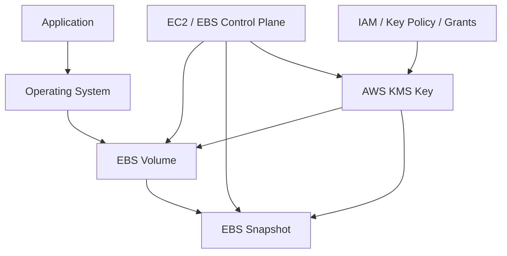
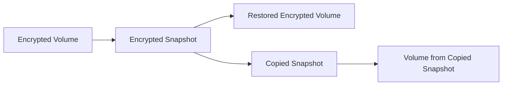
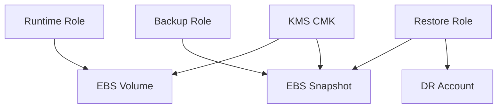
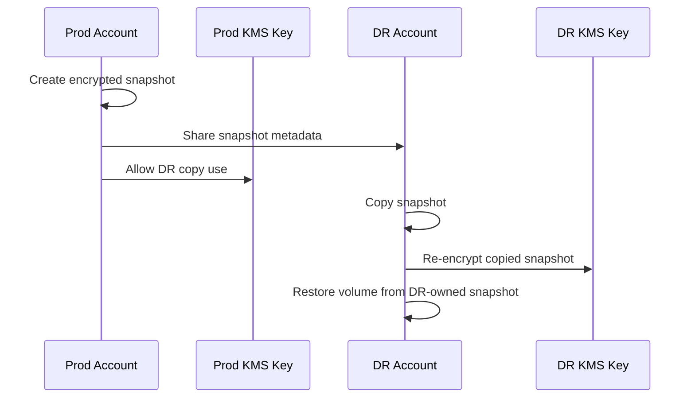

# Part 033 — EBS Encryption and Key Boundaries

EBS encryption is usually presented as a checkbox.

That framing is dangerous.

In production, EBS encryption is not merely a storage property. It is a **runtime dependency**, a **backup portability constraint**, a **cross-account sharing constraint**, a **restore constraint**, and sometimes a **boot-path dependency**. A volume can be healthy, an AMI can be correct, an Auto Scaling Group can be scaling, and yet your workload can fail because the key boundary is wrong.

This part builds the mental model for encrypted EBS volumes and snapshots as an engineering system.

We care about five questions:

1. What exactly is protected by EBS encryption?
2. Where is the KMS boundary?
3. Which operations inherit encryption and key choice?
4. What breaks during restore, sharing, copy, migration, and boot?
5. How should a production platform govern EBS encryption without creating an availability trap?

---

## 1. Problem yang Diselesaikan

EBS encryption solves the problem of protecting block storage data at rest and during EBS-managed disk I/O paths without requiring the application to implement its own block-level encryption.

But production systems need more than “encrypted: true”.

They need answers to:

- Which key encrypts the root volume?
- Which key encrypts data volumes?
- Can the account restore this snapshot in a disaster?
- Can another account copy or use this encrypted snapshot?
- What happens if the KMS key is disabled?
- Does encryption-by-default apply to old volumes?
- Can we remove encryption later?
- Can we rotate keys without breaking recovery?
- Can Auto Scaling launch instances if KMS grants fail?
- Can a DR account boot from an encrypted AMI copy?

Encryption is not only confidentiality.
It becomes part of **storage control-plane correctness**.

---

## 2. Mental Model

Think of an encrypted EBS volume as this contract:

> The block device is usable only when EC2/EBS can use a valid KMS key path to encrypt/decrypt volume material and perform the required lifecycle operation.

A simplified model:



The important point:

- The application usually does not call KMS directly for EBS encryption.
- EC2/EBS interacts with KMS on behalf of the volume lifecycle.
- IAM permission alone is not enough if the KMS key policy does not allow the needed use.
- Snapshot restore, snapshot copy, AMI launch, and cross-account sharing all cross key boundaries.

### The Correct Abstraction

Do not model EBS encryption as:

```text
volume.encrypted = true
```

Model it as:

```text
volume.encryption_contract = {
  encryption_state: encrypted,
  key_arn: arn:aws:kms:region:account:key/..., 
  key_owner_account: account_id,
  allowed_restore_accounts: [...],
  allowed_launch_roles: [...],
  rotation_policy: ...,
  snapshot_copy_policy: ...,
  disaster_recovery_policy: ...
}
```

The key is not an implementation detail. It is part of the storage contract.

---

## 3. Core Concepts

### 3.1 What EBS Encryption Covers

EBS encryption protects several related storage artifacts and paths:

- data at rest on the volume;
- disk I/O between the instance and the EBS volume;
- snapshots created from the encrypted volume;
- volumes created from encrypted snapshots.

The practical implication:

> Once you build a recovery path around encrypted EBS, your recovery path depends on key availability and key permission correctness.

### 3.2 Encryption Inheritance

EBS encryption propagates through common operations.



Typical inheritance rules:

| Source | Operation | Result |
|---|---|---|
| Encrypted volume | Create snapshot | Snapshot is encrypted |
| Encrypted snapshot | Create volume | Volume is encrypted |
| Encrypted snapshot | Copy snapshot | Copy remains encrypted, possibly with another key |
| Unencrypted snapshot | Copy with encryption | Encrypted copied snapshot |
| Encrypted volume/snapshot | Remove encryption | Not directly supported |

The dangerous assumption is thinking that encryption can be toggled like a tag. It cannot be treated that way operationally.

### 3.3 Encryption by Default

EBS encryption by default is an account/Region-level control for new volumes and snapshot copies.

It is useful as a guardrail, but it has important boundaries:

- It affects new EBS volumes and snapshot copies.
- It does not retroactively encrypt existing volumes or snapshots.
- It is regional.
- It depends on the selected default KMS key.
- It can change the behavior of workflows that assumed unencrypted resources.

A mature platform enables default encryption, but still treats key selection explicitly for production workloads.

### 3.4 AWS Managed Key vs Customer Managed Key

There are two common key strategies:

| Key type | Good for | Trade-off |
|---|---|---|
| AWS managed key, commonly `aws/ebs` | Simple single-account default encryption | Limited policy control and portability |
| Customer managed KMS key | Production governance, cross-account sharing, DR, explicit access policy | More operational responsibility |

For production systems, customer managed keys are usually preferred when any of these are true:

- snapshots must be shared cross-account;
- AMIs must be copied into DR accounts;
- key policy must be reviewed/audited;
- workloads require separation by environment, tenant, or data classification;
- restore authority must be independent from day-to-day runtime authority;
- platform wants controlled revocation.

### 3.5 Key Policy, IAM Policy, and Grants

KMS authorization is not only IAM.

A successful EBS operation may require alignment across:

- IAM policy attached to the caller or service role;
- KMS key policy;
- KMS grants created/used by AWS services;
- service-linked roles;
- cross-account trust when sharing snapshots or AMIs.

A common failure pattern:

```text
IAM says: allowed
KMS key policy says: not allowed
Result: volume/snapshot/launch operation fails
```

Another common pattern:

```text
Snapshot is shared
KMS key is not shared
Result: target account sees/copies metadata but cannot use encrypted data
```

---

## 4. Encryption Boundary Design

### 4.1 Scope the Key by Recovery Domain

A key should align with the blast radius and recovery model.

Poor key boundary:

```text
one-customer-managed-key-for-all-prod-storage
```

This creates a wide blast radius. A key policy mistake or key disablement can affect unrelated systems.

Better boundary:

```text
kms/ebs/prod/payments
kms/ebs/prod/case-management
kms/ebs/stage/shared
kms/ebs/dr/restore
```

But do not over-fragment either. Too many keys create operational complexity and policy drift.

Use a key boundary when it changes one of these:

- data classification;
- environment;
- account boundary;
- restore authority;
- compliance boundary;
- operational ownership;
- tenant isolation requirement;
- DR sharing requirement.

### 4.2 Separate Runtime Use from Restore Use

Runtime and restore have different permission needs.

Runtime role may need:

- launch encrypted instances;
- attach encrypted volumes;
- create snapshots as part of backup automation.

Restore operator may need:

- copy snapshots;
- decrypt snapshot data to create a restored volume;
- launch a recovery instance;
- re-encrypt into a target key;
- share copy with a DR account.

A strong production design explicitly documents both.



### 4.3 Boot Volume Is a Special Case

Encrypted root volumes are good practice, but they turn KMS into a boot dependency.

When an instance launches from an AMI whose snapshot is encrypted:

- EC2 must be allowed to use the relevant key;
- the key must exist in the Region;
- the key must be enabled;
- the launch role/account must be authorized;
- cross-account AMI sharing must include the encrypted snapshot/key permissions.

A wrong key policy can look like an EC2 capacity, AMI, or Auto Scaling problem.

In practice:

```text
ASG desired capacity = 10
ASG launches instances
Instances fail before becoming healthy
Root cause = KMS key access denied for encrypted root snapshot
```

### 4.4 Snapshot Sharing Boundary

Sharing encrypted snapshots is not the same as sharing unencrypted snapshots.

For encrypted snapshots:

- snapshot permissions must allow the target account;
- the KMS key used by the snapshot must allow the target account or role;
- in many production workflows, the target account should copy the snapshot and re-encrypt it with a key it owns.

Preferred production pattern:



Why copy into the target account?

Because DR must not depend forever on the source account's live key policy unless that is explicitly intended.

---

## 5. Production Design Patterns

### Pattern A — Account Default Encryption with Explicit Production Keys

Use default encryption as baseline, but pass explicit KMS keys for production resources.

```hcl
resource "aws_ebs_encryption_by_default" "this" {
  enabled = true
}

resource "aws_ebs_default_kms_key" "this" {
  key_arn = aws_kms_key.default_ebs.arn
}

resource "aws_ebs_volume" "app_data" {
  availability_zone = var.az
  size              = 500
  type              = "gp3"
  encrypted         = true
  kms_key_id        = aws_kms_key.app_ebs.arn

  tags = {
    Name             = "prod-case-management-data"
    DataClass        = "restricted"
    RecoveryTier     = "tier-1"
    EncryptionOwner  = "platform-security"
  }
}
```

Key idea:

- default encryption catches mistakes;
- explicit key keeps production intent visible.

### Pattern B — Re-Encrypt Snapshot During Copy

Use snapshot copy to change the encryption key.

```hcl
resource "aws_ebs_snapshot_copy" "dr_copy" {
  source_snapshot_id = var.source_snapshot_id
  source_region      = var.source_region
  encrypted          = true
  kms_key_id         = aws_kms_key.dr_restore.arn

  tags = {
    Name         = "dr-copy-case-management"
    SourceSystem = "case-management"
    Purpose      = "dr-restore-test"
  }
}
```

This is useful for:

- DR account ownership;
- compliance boundary changes;
- replacing an old key;
- separating restored copies from production runtime keys.

### Pattern C — Dedicated Key per High-Risk Stateful System

Use a dedicated key when the workload has high-value state.

```hcl
resource "aws_kms_key" "case_management_ebs" {
  description             = "EBS encryption key for prod case-management volumes and snapshots"
  deletion_window_in_days = 30
  enable_key_rotation     = true

  tags = {
    System      = "case-management"
    Environment = "prod"
    DataClass   = "restricted"
  }
}
```

Do not create keys casually. A key is a lifecycle object.

It needs:

- owner;
- policy review;
- rotation posture;
- backup/restore test;
- deletion protection process;
- break-glass path;
- DR copy plan.

### Pattern D — Restore Role Separate from Application Role

Application roles should not automatically have full restore/copy/share powers.

```hcl
# Example only: production policy must be narrowed by resource, condition, account, and role.
resource "aws_iam_policy" "ebs_restore_operator" {
  name = "prod-ebs-restore-operator"

  policy = jsonencode({
    Version = "2012-10-17"
    Statement = [
      {
        Effect = "Allow"
        Action = [
          "ec2:CreateVolume",
          "ec2:CreateSnapshot",
          "ec2:CopySnapshot",
          "ec2:DescribeSnapshots",
          "ec2:DescribeVolumes",
          "ec2:AttachVolume",
          "ec2:DetachVolume",
          "ec2:CreateTags"
        ]
        Resource = "*"
      },
      {
        Effect = "Allow"
        Action = [
          "kms:Decrypt",
          "kms:Encrypt",
          "kms:ReEncrypt*",
          "kms:GenerateDataKey*",
          "kms:CreateGrant",
          "kms:DescribeKey"
        ]
        Resource = [
          aws_kms_key.case_management_ebs.arn,
          aws_kms_key.dr_restore.arn
        ]
      }
    ]
  })
}
```

The real policy should be stricter. The point is the separation of authority.

---

## 6. Implementation Pattern

### 6.1 New Encrypted Data Volume

```bash
aws ec2 create-volume \
  --availability-zone ap-southeast-3a \
  --size 500 \
  --volume-type gp3 \
  --iops 6000 \
  --throughput 250 \
  --encrypted \
  --kms-key-id arn:aws:kms:ap-southeast-3:111122223333:key/example \
  --tag-specifications 'ResourceType=volume,Tags=[{Key=Name,Value=prod-app-data}]'
```

### 6.2 Snapshot an Encrypted Volume

```bash
aws ec2 create-snapshot \
  --volume-id vol-0123456789abcdef0 \
  --description "prod app data before schema migration" \
  --tag-specifications 'ResourceType=snapshot,Tags=[{Key=System,Value=case-management},{Key=Purpose,Value=pre-migration}]'
```

Snapshot encryption follows the source encrypted volume.

### 6.3 Copy and Re-Encrypt Snapshot

```bash
aws ec2 copy-snapshot \
  --source-region ap-southeast-3 \
  --source-snapshot-id snap-0123456789abcdef0 \
  --encrypted \
  --kms-key-id arn:aws:kms:ap-southeast-1:444455556666:key/dr-key \
  --description "DR copy re-encrypted under DR account key"
```

### 6.4 Verify Snapshot Restore Path

Never stop at “snapshot created”.

A restore test should include:

```bash
aws ec2 create-volume \
  --availability-zone ap-southeast-3a \
  --snapshot-id snap-0123456789abcdef0 \
  --volume-type gp3 \
  --encrypted \
  --kms-key-id arn:aws:kms:ap-southeast-3:111122223333:key/example
```

Then:

- attach to test instance;
- mount read-only when possible;
- run filesystem check if required;
- validate application-level consistency;
- verify expected files/records/log segments;
- measure restore performance;
- document time to usable state.

---

## 7. Failure Modes

### Failure Mode 1 — Key Disabled

Symptom:

- new volume creation from snapshot fails;
- instance launch fails;
- ASG replacement loop;
- restore operation fails;
- snapshot copy fails.

Cause:

- KMS key disabled intentionally or accidentally.

Mitigation:

- protect KMS key disable/delete with change control;
- monitor key state;
- use deletion window;
- test break-glass restore;
- include key status in restore preflight.

### Failure Mode 2 — Snapshot Shared Without Key Access

Symptom:

```text
Target account can see snapshot permission but cannot create usable volume.
```

Cause:

- snapshot shared;
- KMS key not shared or policy not allowing target account/role.

Mitigation:

- share both snapshot and key permission;
- copy snapshot into target account;
- re-encrypt with target account key;
- test restore from target account.

### Failure Mode 3 — Default Key Used Accidentally

Symptom:

- cross-account sharing/copy workflow breaks;
- policy cannot be customized as expected;
- DR automation fails.

Cause:

- workload relied on account default key instead of explicit customer managed key.

Mitigation:

- require `kms_key_id` for production stateful resources;
- use policy-as-code to reject missing key;
- tag volumes/snapshots with key ownership metadata.

### Failure Mode 4 — Launch Template Uses AMI Encrypted With Wrong Key

Symptom:

- instance launch fails;
- ASG keeps trying to replace;
- health never becomes green;
- problem appears after AMI promotion.

Cause:

- AMI root snapshot encrypted with a key unavailable to the launching account or role.

Mitigation:

- AMI promotion pipeline must verify launch in target account;
- copy AMI and re-encrypt snapshots in target account;
- include KMS check before updating Launch Template default version.

### Failure Mode 5 — KMS Policy Drift

Symptom:

- previously working restore fails;
- only some roles/accounts fail;
- failures appear after security hardening.

Cause:

- key policy modified without testing EBS restore/launch workflows.

Mitigation:

- treat KMS policy as code;
- regression-test `create-volume-from-snapshot`;
- regression-test cross-account copy;
- include KMS policy changes in DR game days.

### Failure Mode 6 — Key Deletion Scheduled

Symptom:

- resources still work for now;
- future restore is at risk;
- audit shows pending deletion.

Cause:

- key deletion scheduled mistakenly or during cleanup.

Mitigation:

- alarm on pending deletion;
- require manual approval for production KMS key deletion;
- keep key inventory tied to snapshots and AMIs;
- cancel deletion immediately when detected.

### Failure Mode 7 — Restore Role Missing `kms:CreateGrant`

Symptom:

- IAM appears to allow EC2 actions;
- KMS errors occur during volume creation or attach workflow.

Cause:

- EBS service interaction with KMS requires grants or key permissions not included.

Mitigation:

- follow documented KMS permissions for EBS workflows;
- scope grants with conditions;
- test with exact restore role, not admin role.

---

## 8. Operational Runbook

### Runbook A — Instance Fails to Launch From Encrypted AMI

1. Identify failing Launch Template version.
2. Identify AMI ID used by that version.
3. Inspect AMI block device mappings.
4. Identify root snapshot ID.
5. Check snapshot encryption state and KMS key ID.
6. Verify key exists in the target Region.
7. Verify key is enabled.
8. Verify launching account/role has permission through both IAM and key policy.
9. Try manual launch with same instance profile and subnet.
10. If urgent, roll back Launch Template to previous known-good AMI.
11. If AMI is correct but key is not portable, copy AMI/snapshot and re-encrypt under target account key.
12. Update Launch Template only after canary launch succeeds.

### Runbook B — Cross-Account Snapshot Restore Fails

1. Confirm snapshot is shared with target account.
2. Confirm source snapshot is encrypted.
3. Identify source KMS key ARN.
4. Confirm target role/account is allowed by source key policy.
5. Copy snapshot into target account.
6. Re-encrypt with target account customer managed key.
7. Create a volume from copied snapshot.
8. Attach to recovery instance.
9. Validate filesystem and application consistency.
10. Record missing permissions in the restore checklist.

### Runbook C — Suspected KMS Key Outage or Policy Problem

1. Check whether failures are limited to encrypted EBS operations.
2. Check CloudTrail for KMS `AccessDenied`, `DisabledException`, or grant-related errors.
3. Check KMS key state.
4. Check recent policy changes.
5. Test minimal create-volume-from-known-good-snapshot operation.
6. Avoid broad policy emergency changes unless blast radius is understood.
7. Use break-glass restore role if available.
8. Roll back policy-as-code change if applicable.
9. Run post-incident restore test.

---

## 9. Observability and Audit Signals

A production EBS encryption program should be visible.

Track:

- percentage of volumes encrypted;
- volumes without explicit customer managed key where required;
- snapshots encrypted with deprecated keys;
- snapshots older than retention policy;
- shared encrypted snapshots missing expected DR copy;
- KMS keys pending deletion;
- KMS keys disabled;
- failed `CreateVolume`, `CopySnapshot`, `CreateGrant`, `Decrypt`, `ReEncrypt` operations;
- Launch Template versions referencing AMIs encrypted with unexpected keys;
- AMIs shared across accounts without matching key policy.

Example inventory query idea:

```bash
aws ec2 describe-volumes \
  --query 'Volumes[].{VolumeId:VolumeId,Encrypted:Encrypted,KmsKeyId:KmsKeyId,Az:AvailabilityZone,State:State,Tags:Tags}'
```

Snapshot inventory:

```bash
aws ec2 describe-snapshots \
  --owner-ids self \
  --query 'Snapshots[].{SnapshotId:SnapshotId,Encrypted:Encrypted,KmsKeyId:KmsKeyId,StartTime:StartTime,VolumeId:VolumeId}'
```

KMS key state must be part of the same operational dashboard as snapshot recoverability.

---

## 10. Common Mistakes

### Mistake 1 — “Encryption by Default Means We Are Done”

Default encryption is a baseline, not a complete design.

It does not answer:

- which key should production data use;
- who can restore;
- how DR account can copy;
- whether old snapshots are encrypted;
- whether AMI launch works cross-account.

### Mistake 2 — Using Admin Role for Restore Tests

Restore tests must use the real restore role.

Testing with admin role proves almost nothing about operational recoverability.

### Mistake 3 — No Key Inventory for Snapshots

A snapshot without key inventory is a future incident.

A production snapshot catalog should record:

- snapshot ID;
- source volume;
- KMS key ARN;
- owner account;
- target restore accounts;
- last restore test;
- expected retention.

### Mistake 4 — Cross-Account AMI Sharing Without KMS Verification

An AMI can look shared while the encrypted root snapshot cannot be used.

AMI sharing pipelines must verify actual launch in the target account.

### Mistake 5 — Treating Key Deletion as Cleanup

Deleting a key can destroy recoverability for encrypted historical snapshots.

Before deleting a key, prove that no required volume, snapshot, AMI, or backup depends on it.

### Mistake 6 — Key Boundary Too Wide

A single production EBS key is simple but can produce huge blast radius.

### Mistake 7 — Key Boundary Too Narrow

One key per volume is usually excessive and creates operational chaos.

The right boundary follows ownership, data class, environment, and recovery domain.

---

## 11. Security and Reliability Trade-off

Encryption design is a trade-off between control and operability.

| Design | Security posture | Operability risk |
|---|---|---|
| AWS managed default key | Simple baseline | Weak portability/control |
| One customer managed key per account/env | Moderate control | Broad blast radius |
| One key per critical system | Strong ownership boundary | More key management |
| One key per volume | Maximum granularity | High operational burden |
| Central security-owned key only | Strong central governance | App/platform recovery can be blocked |

The best design is usually not the most granular design.

It is the one where:

- key ownership is clear;
- recovery path is tested;
- policy is reviewed as code;
- blast radius is acceptable;
- operational teams can restore under pressure.

---

## 12. Mini Case Study — Encrypted Root Volume Broke Auto Scaling

### Situation

A team promotes a new AMI to production.

The Auto Scaling Group starts an instance refresh.
New instances fail to become healthy.
The group keeps launching replacements.
Capacity drops below safe level.

### First Assumption

The team suspects:

- bad AMI;
- package regression;
- EC2 capacity shortage;
- user data failure.

### Actual Root Cause

The AMI was copied from a build account.
Its root snapshot was encrypted with a customer managed key in the build account.
The production account could see the shared AMI metadata but could not use the encrypted root snapshot correctly during launch.

### Correct Fix

The promotion pipeline was changed to:

1. copy AMI into production account;
2. re-encrypt root snapshot using production-owned KMS key;
3. launch canary instance using production Launch Template role;
4. wait for health check success;
5. only then update ASG Launch Template version.

### Lesson

AMI promotion is not complete until the target account proves it can boot from the encrypted root snapshot.

---

## 13. Checklist

Before approving an encrypted EBS design, verify:

- [ ] EBS encryption by default is enabled where required.
- [ ] Production volumes specify explicit KMS key IDs.
- [ ] Root and data volume key choices are documented.
- [ ] Key policy is managed as code.
- [ ] Restore role is separate from application runtime role.
- [ ] Snapshot copy/re-encryption path is tested.
- [ ] Cross-account sharing includes key permission.
- [ ] DR account owns a copied snapshot or has explicit dependency accepted.
- [ ] AMI promotion tests actual launch in target account.
- [ ] KMS key disable/delete is protected by change control.
- [ ] Snapshots are inventoried with KMS key ARN.
- [ ] Old snapshots under deprecated keys are migrated or documented.
- [ ] Break-glass restore process exists.
- [ ] Game day includes encrypted snapshot restore.

---

## 14. Summary

EBS encryption is not a cosmetic control.

It changes the lifecycle of volumes, snapshots, AMIs, restores, cross-account sharing, and disaster recovery.

The key mental model:

> Encrypted EBS state is recoverable only if the data artifact and the key path are both recoverable.

A top-tier engineer does not merely set `encrypted = true`.

They design:

- key ownership;
- key boundary;
- snapshot portability;
- restore roles;
- cross-account copy;
- AMI boot verification;
- key deletion guardrails;
- operational runbooks.

The production question is not “is it encrypted?”

The real question is:

> Can the right people restore the right data in the right account and Region under pressure without accidentally widening access or breaking boot-time availability?

---

## References

- AWS Documentation — Amazon EBS encryption: `https://docs.aws.amazon.com/ebs/latest/userguide/ebs-encryption.html`
- AWS Documentation — Enable Amazon EBS encryption by default: `https://docs.aws.amazon.com/ebs/latest/userguide/encryption-by-default.html`
- AWS Documentation — Share the KMS key used to encrypt a shared Amazon EBS snapshot: `https://docs.aws.amazon.com/ebs/latest/userguide/share-kms-key.html`
- AWS Documentation — Share an Amazon EBS snapshot with other AWS accounts: `https://docs.aws.amazon.com/ebs/latest/userguide/ebs-modifying-snapshot-permissions.html`
- AWS KMS Developer Guide — How Amazon EBS uses AWS KMS: `https://docs.aws.amazon.com/kms/latest/developerguide/services-ebs.html`
