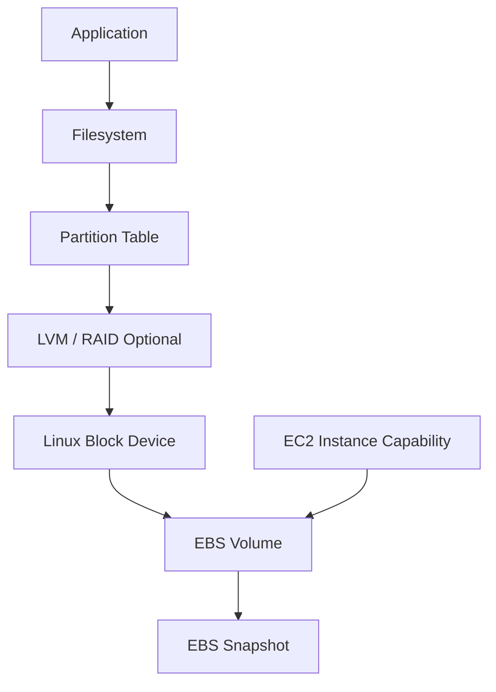
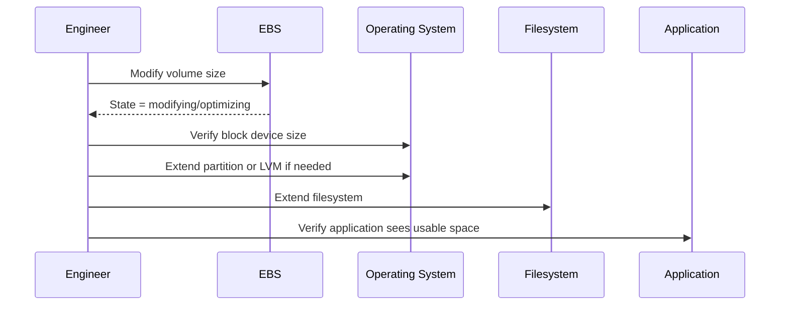
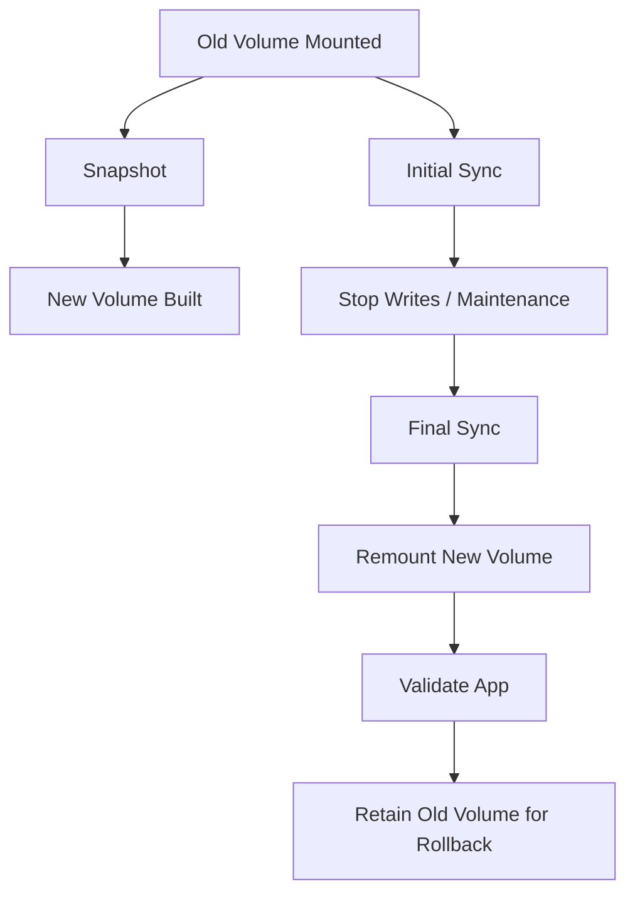

# Part 034 — EBS Resize, Migration, and Volume Evolution

Storage changes are where many production systems reveal whether they were designed or merely assembled.

A volume resize looks simple in the console.
A volume type change looks like a dropdown.
A throughput increase looks like a number.

But in production, EBS volume evolution touches:

- instance capability;
- volume type limits;
- filesystem behavior;
- partition tables;
- LVM;
- application write patterns;
- snapshot safety;
- rollback;
- performance during modification;
- Terraform drift;
- maintenance windows;
- cost control;
- monitoring thresholds;
- and recovery proof.

This part is about changing EBS safely while the system is alive.

---

## 1. Problem yang Diselesaikan

EBS volumes evolve because workloads evolve.

Common triggers:

- disk is near full;
- `gp2` burst behavior is unstable;
- database needs more IOPS;
- WAL/log volume needs more throughput;
- application moved from small random I/O to large sequential I/O;
- storage cost is too high;
- old volumes must be encrypted or re-encrypted;
- root volume must grow after OS/package expansion;
- data volume must move to another AZ or account;
- storage layout must change from one volume to several;
- over-sized volumes must be shrunk by migration;
- filesystem needs to move from ad hoc layout to LVM/RAID/managed layout.

The safe mental model:

> EBS volume modification is not one operation. It is a staged migration of capacity, performance, filesystem visibility, application safety, and rollback state.

---

## 2. Mental Model

An EBS volume has multiple layers.



When you modify EBS, not every layer updates automatically.

For example:

```text
EBS volume size increased from 100 GiB to 200 GiB
```

But the OS might still see:

```text
partition = 100 GiB
filesystem = 100 GiB
application usable space = 100 GiB
```

You must expand the correct upper layers.

### The Four-Layer Resize Model

```text
Layer 1: EBS volume size/performance/type
Layer 2: OS block device recognition
Layer 3: partition / LVM / RAID expansion
Layer 4: filesystem expansion
Layer 5: application threshold/config update
```

A production resize is complete only when all relevant layers are updated and verified.

---

## 3. What Elastic Volumes Can and Cannot Do

Amazon EBS Elastic Volumes allows you to modify certain properties of an existing EBS volume.

Common supported changes:

- increase volume size;
- change volume type;
- adjust IOPS;
- adjust throughput where the volume type supports it.

Important constraints:

- You can increase volume size; you cannot directly decrease it.
- After increasing size, you must extend the partition/filesystem where applicable.
- Some old or unsupported instance/volume combinations may require stop/detach workflows.
- Modification requests cannot be cancelled after submission.
- You must respect volume type limits and instance EBS bandwidth limits.
- After a modification, AWS reports modification state such as `modifying`, `optimizing`, and `completed`.
- Current API rules allow a volume to be modified up to four times within a rolling 24-hour period, after previous modifications have completed.

The dangerous misunderstanding:

> “Modify volume completed” does not necessarily mean the application sees more usable filesystem space.

---

## 4. Change Types

### 4.1 Grow Capacity

Use when disk is filling up or growth forecast requires headroom.

Flow:



### 4.2 Increase Performance

Use when volume is bottlenecked on IOPS or throughput.

Examples:

- increase `gp3` IOPS;
- increase `gp3` throughput;
- move from `gp3` to `io2`;
- move from HDD-backed volume to SSD-backed volume for random I/O.

Do not increase performance blindly.

First prove whether bottleneck is:

- EBS volume limit;
- instance EBS bandwidth limit;
- filesystem lock/contention;
- application sync pattern;
- database checkpoint/write amplification;
- queue depth too low/high;
- CPU saturation;
- page cache behavior;
- network path unrelated to EBS.

### 4.3 Change Volume Type

Typical migrations:

| From | To | Reason |
|---|---|---|
| `gp2` | `gp3` | decouple size from performance and reduce cost/control performance |
| `gp3` | `io2` | lower latency / higher durability / more consistent IOPS profile |
| `st1` | `gp3` | workload changed from sequential to random I/O |
| `gp3` | `st1` | large sequential throughput at lower cost, if workload fits |
| old `io1` | `io2` | modernize high-performance block storage |

### 4.4 Re-Encrypt or Change KMS Key

You cannot simply change the KMS key of an existing encrypted volume in-place as a normal Elastic Volumes property.

Common pattern:

1. snapshot volume;
2. copy snapshot with encryption using target KMS key;
3. create new volume from copied snapshot;
4. attach new volume;
5. validate data;
6. cut over;
7. keep old volume/snapshot until rollback window passes.


### 4.5 Shrink Volume

EBS does not directly decrease volume size.

Shrink is a migration, not a modification.

Pattern:

1. create smaller target volume;
2. format/mount target;
3. copy data at application/filesystem level;
4. validate consistency;
5. stop writes or enter maintenance window;
6. perform final sync;
7. remount/swap device path;
8. rollback if needed;
9. snapshot old state before deletion.

For Linux, tools might include:

- `rsync`;
- application-native backup/restore;
- database dump/restore;
- logical replication;
- filesystem-level migration tools.

For Windows, tools might include `robocopy` or application-native backup/restore.

---

## 5. Production Resize Protocol

Do not resize from the console as a casual action.

Use a repeatable protocol.

### Step 1 — Classify the Change

```text
capacity-only?
performance-only?
volume-type-change?
filesystem-layout-change?
KMS-key-change?
AZ/account/region migration?
shrink-by-migration?
```

Each has different risk.

### Step 2 — Identify the Ownership Boundary

Before modification:

- who owns the application?
- who owns the volume?
- who owns the filesystem?
- who owns the backup?
- who approves downtime?
- who can roll back?

Storage changes often fail because the platform team controls EBS but the application team owns the filesystem and data semantics.

### Step 3 — Capture Baseline

Collect:

```bash
lsblk -f
findmnt
df -hT
sudo file -s /dev/nvme1n1
sudo nvme list || true
iostat -xz 1 5
```

For EBS metadata:

```bash
aws ec2 describe-volumes \
  --volume-ids vol-0123456789abcdef0 \
  --query 'Volumes[0].{Size:Size,Type:VolumeType,Iops:Iops,Throughput:Throughput,Encrypted:Encrypted,KmsKeyId:KmsKeyId,Az:AvailabilityZone,State:State}'
```

For modification history:

```bash
aws ec2 describe-volumes-modifications \
  --volume-ids vol-0123456789abcdef0
```

### Step 4 — Snapshot First

For most production changes, create a snapshot before modification.

```bash
aws ec2 create-snapshot \
  --volume-id vol-0123456789abcdef0 \
  --description "pre-resize snapshot for prod app data" \
  --tag-specifications 'ResourceType=snapshot,Tags=[{Key=Purpose,Value=pre-resize},{Key=System,Value=case-management}]'
```

Snapshot is not magic rollback.

A useful rollback requires:

- snapshot creation completed;
- restore tested or at least restore command known;
- application consistency considered;
- downtime/cutover path documented.

### Step 5 — Modify EBS Layer

Example: grow `gp3` volume and increase performance.

```bash
aws ec2 modify-volume \
  --volume-id vol-0123456789abcdef0 \
  --size 500 \
  --volume-type gp3 \
  --iops 12000 \
  --throughput 500
```

Monitor:

```bash
aws ec2 describe-volumes-modifications \
  --volume-ids vol-0123456789abcdef0 \
  --query 'VolumesModifications[0].{State:ModificationState,Progress:Progress,OriginalSize:OriginalSize,TargetSize:TargetSize,OriginalType:OriginalVolumeType,TargetType:TargetVolumeType}'
```

### Step 6 — Expand Partition if Needed

Check device layout:

```bash
lsblk
```

Example with Nitro NVMe device:

```bash
sudo growpart /dev/nvme1n1 1
```

Example with Xen-style device:

```bash
sudo growpart /dev/xvdf 1
```

Do not guess device names. Confirm with `lsblk`, `findmnt`, and `/dev/disk/by-id`.

### Step 7 — Expand Filesystem

For XFS:

```bash
sudo xfs_growfs /mount/point
```

For ext4:

```bash
sudo resize2fs /dev/nvme1n1p1
```

Verify:

```bash
df -hT
lsblk -f
```

### Step 8 — Update Application and Monitoring Thresholds

Resize is incomplete if alerts still assume the old size.

Update:

- disk usage thresholds;
- capacity forecast dashboard;
- backup size expectation;
- snapshot retention cost estimate;
- database tablespace thresholds;
- autoscaling or placement assumptions if applicable;
- runbooks and architecture diagrams.

---

## 6. Filesystem-Specific Notes

### XFS

XFS can grow online, but cannot shrink online.

Common command:

```bash
sudo xfs_growfs /data
```

You pass the mount point, not the block device.

### ext4

ext4 can grow online in many cases.

Common command:

```bash
sudo resize2fs /dev/nvme1n1p1
```

You usually pass the partition device.

### LVM

With LVM, the flow is different:

```bash
sudo pvresize /dev/nvme1n1p1
sudo lvextend -r -l +100%FREE /dev/vgdata/lvdata
```

`-r` asks LVM to resize the filesystem as part of the operation where supported.

### RAID

If the volume participates in RAID, do not modify only one member casually.

You need to reason about:

- RAID level;
- member size consistency;
- resync behavior;
- write availability;
- rebuild time;
- failure risk during rebuild;
- snapshot consistency across volumes.

### Database Volumes

Database-backed EBS changes need database-aware thinking.

Ask:

- Is the database using direct I/O?
- Is WAL/log separated from data?
- Is checkpoint pressure causing write burst?
- Is snapshot crash-consistent or application-consistent?
- Can the DB recover from the snapshot?
- Does volume modification affect benchmark latency during operation?
- Is there a replica promotion path instead of in-place mutation?

For critical systems, prefer testing on restored copy first.

---

## 7. Migration Patterns

### Pattern A — In-Place Grow

Use when:

- only more capacity/performance is needed;
- filesystem supports online grow;
- rollback can tolerate snapshot restore;
- maintenance risk is low.

Flow:

```text
snapshot -> modify volume -> grow partition -> grow filesystem -> verify
```

### Pattern B — Blue/Green Volume Cutover

Use when:

- changing KMS key;
- shrinking volume;
- changing filesystem layout;
- changing from single volume to LVM/RAID layout;
- high-risk data migration;
- need a clean rollback.

Flow:



### Pattern C — Replica-Based Migration

Use for databases when possible.

Examples:

- create new database replica with desired storage layout;
- let replication catch up;
- promote replica;
- cut traffic;
- keep old primary for rollback window.

This is often safer than mutating a critical primary volume under load.

### Pattern D — Snapshot Restore and Replace

Use when:

- source volume is not easily mutable;
- need to move to another AZ;
- need to test restore path;
- need to re-encrypt;
- need to build a fresh volume from known point-in-time.

Flow:

```text
snapshot -> create new volume -> attach to new instance -> validate -> cutover
```

### Pattern E — Application-Level Export/Import

Use when block-level copy is the wrong abstraction.

Examples:

- database logical dump/restore;
- object export to S3;
- application-native backup;
- search index rebuild;
- event replay;
- package repository regeneration.

This is slower but often cleaner for semantic data changes.

---

## 8. Terraform and IaC Considerations

Terraform can describe EBS volumes, but storage mutation requires caution.

Example volume:

```hcl
resource "aws_ebs_volume" "data" {
  availability_zone = var.az
  size              = 500
  type              = "gp3"
  iops              = 12000
  throughput        = 500
  encrypted         = true
  kms_key_id        = aws_kms_key.ebs.arn

  lifecycle {
    prevent_destroy = true
  }

  tags = {
    Name         = "prod-case-management-data"
    System       = "case-management"
    RecoveryTier = "tier-1"
  }
}
```

Attach:

```hcl
resource "aws_volume_attachment" "data" {
  device_name = "/dev/sdf"
  volume_id   = aws_ebs_volume.data.id
  instance_id = aws_instance.app.id
}
```

### Important IaC Rules

- Use `prevent_destroy` for critical volumes.
- Do not let Terraform replace stateful volumes unintentionally.
- Treat `kms_key_id` changes as migration work, not a casual plan apply.
- Keep snapshots outside accidental destroy paths.
- Store volume ownership and recovery tier in tags.
- Prefer explicit migration runbooks for complex changes.
- Use plan review gates for `size`, `type`, `iops`, `throughput`, and attachment changes.

### Detect Dangerous Plan

Any plan that says something equivalent to:

```text
-/+ aws_ebs_volume.data must be replaced
```

should be treated as a high-risk storage event.

A top-tier review asks:

- Why replacement?
- Is data preserved?
- Is there a snapshot?
- Is restore tested?
- Is attachment order safe?
- Is application downtime approved?
- Is there a rollback path?

---

## 9. Performance During Modification

Volume modification is not always instantly complete.

AWS may show states like:

- `modifying`;
- `optimizing`;
- `completed`;
- `failed`.

During optimization, performance may be between old and new characteristics depending on the operation and state.

Operational implication:

- do not schedule benchmark immediately and assume final result;
- monitor modification progress;
- avoid stacking multiple uncoordinated storage changes;
- keep application SLO dashboards visible;
- be prepared to scale reads/writes or reduce batch jobs during the change.

Example monitoring command:

```bash
watch -n 15 'aws ec2 describe-volumes-modifications --volume-ids vol-0123456789abcdef0 --output table'
```

Observe OS-level impact:

```bash
iostat -xz 5
vmstat 5
pidstat -d 5
```

---

## 10. Failure Modes

### Failure Mode 1 — EBS Size Increased but Filesystem Not Expanded

Symptom:

- AWS console shows larger volume;
- `df -h` still shows old size;
- application still fails with disk full.

Cause:

- partition/filesystem layer not extended.

Fix:

- check `lsblk`;
- run `growpart` if partitioned;
- run filesystem-specific grow command;
- verify with `df -hT`.

### Failure Mode 2 — Wrong Device Expanded

Symptom:

- wrong filesystem changes;
- target mount still full;
- possible data corruption risk.

Cause:

- device name assumption wrong, especially on Nitro/NVMe instances.

Fix:

- use `lsblk -f`, `findmnt`, `/dev/disk/by-id`;
- map EBS volume IDs to NVMe devices carefully;
- document mount points.

### Failure Mode 3 — Cannot Decrease Volume Size

Symptom:

- team tries to reduce oversized EBS volume directly;
- operation not supported.

Fix:

- create smaller volume;
- migrate data;
- cut over;
- delete old volume only after rollback window.

### Failure Mode 4 — Volume Modified Beyond Instance Capability

Symptom:

- provisioned IOPS/throughput increased;
- application performance does not improve.

Cause:

- EC2 instance EBS bandwidth limit is lower than volume configuration;
- workload bottleneck is elsewhere.

Fix:

- check instance type EBS bandwidth;
- use CloudWatch and OS metrics;
- benchmark with correct queue depth and block size;
- resize instance or redesign volume layout.

### Failure Mode 5 — Terraform Replaces Volume

Symptom:

- IaC plan wants to destroy/recreate volume;
- potential data loss.

Cause:

- immutable property change;
- incorrect resource refactoring;
- state mismatch;
- attachment dependency issue.

Fix:

- stop apply;
- import/adopt state carefully;
- use `prevent_destroy`;
- perform manual migration plan;
- snapshot before any destructive action.

### Failure Mode 6 — Modification Fails or Stalls

Symptom:

- `describe-volumes-modifications` shows failed state;
- desired size/type/performance not reached.

Cause:

- unsupported parameter combination;
- exceeding volume type limits;
- quota/rate limits;
- invalid state;
- API constraint.

Fix:

- inspect failure message;
- verify volume type requirements;
- wait until previous modification completed before another;
- choose valid target values;
- open AWS Support case for unclear stuck states.

### Failure Mode 7 — Snapshot Rollback Is Too Slow

Symptom:

- snapshot exists;
- restore time exceeds RTO;
- application remains down.

Cause:

- rollback plan assumed snapshot is instant recovery;
- no Fast Snapshot Restore or pre-warmed volume strategy;
- no tested attach/mount path.

Fix:

- measure restore time;
- pre-create rollback volume for high-risk changes;
- use blue/green cutover;
- use replica-based migration for databases.

### Failure Mode 8 — Application Keeps Writing During Copy Migration

Symptom:

- copied data is inconsistent;
- application fails after cutover;
- missing recent files/records.

Cause:

- no write freeze/final sync;
- application-level consistency not considered.

Fix:

- stop writes;
- use maintenance window;
- use application-native backup/restore;
- use database replication or snapshot consistency features.

---

## 11. Operational Runbooks

### Runbook A — Online Grow Linux Data Volume

1. Confirm volume ID and mount point.
2. Confirm filesystem type.
3. Confirm recent snapshot exists.
4. Modify EBS volume size/performance.
5. Wait until modification state is `optimizing` or suitable for filesystem expansion.
6. Confirm OS sees larger block device with `lsblk`.
7. Extend partition if needed using `growpart`.
8. Extend filesystem using `xfs_growfs` or `resize2fs`.
9. Verify `df -hT` and application health.
10. Update monitoring thresholds.
11. Record change in storage inventory.

Example:

```bash
# 1. Confirm
lsblk -f
findmnt /data
df -hT /data

# 2. Modify EBS
aws ec2 modify-volume \
  --volume-id vol-0123456789abcdef0 \
  --size 500

# 3. Watch modification
aws ec2 describe-volumes-modifications \
  --volume-ids vol-0123456789abcdef0

# 4. Expand partition
sudo growpart /dev/nvme1n1 1

# 5. Expand XFS filesystem
sudo xfs_growfs /data

# 6. Verify
df -hT /data
lsblk -f
```

### Runbook B — Migrate to New Smaller Volume

1. Snapshot source volume.
2. Create target smaller volume in same AZ.
3. Attach target volume to instance.
4. Format and mount target volume.
5. Initial sync while application is running if safe.
6. Stop writes or enter maintenance mode.
7. Final sync.
8. Unmount old volume.
9. Mount new volume at expected path.
10. Start application.
11. Validate application and data checksums.
12. Keep old volume detached but retained for rollback.
13. Snapshot final new volume.
14. Delete old volume only after rollback window expires.

### Runbook C — Change KMS Key by Snapshot Copy

1. Confirm source volume/snapshot key.
2. Snapshot source volume.
3. Copy snapshot with target KMS key.
4. Create volume from copied snapshot.
5. Attach to test instance.
6. Validate filesystem and application data.
7. Plan cutover window.
8. Stop writes.
9. Attach new volume to production instance or new replacement instance.
10. Start app and validate.
11. Retain old encrypted snapshot until rollback window passes.

### Runbook D — Performance Increase Does Not Help

1. Confirm EBS modification completed.
2. Check volume CloudWatch metrics.
3. Check instance EBS bandwidth limit.
4. Run `iostat -xz`.
5. Check queue size and await latency.
6. Check application thread/blocking metrics.
7. Verify benchmark matches production I/O shape.
8. Check CPU saturation.
9. Check filesystem/journal behavior.
10. Decide whether to resize instance, change volume layout, separate logs/data, or change app write path.

---

## 12. Decision Table

| Goal | Preferred approach | Avoid |
|---|---|---|
| More free space | Elastic Volumes grow + filesystem expansion | Growing EBS but forgetting FS layer |
| More gp3 performance | Modify IOPS/throughput | Assuming instance can consume it |
| Lower cost from gp2 | Change to gp3 with explicit perf | Blind migration without baseline |
| Lower latency critical DB | Test gp3 vs io2 on restored workload | Choosing io2 without benchmark |
| Shrink oversized volume | New smaller volume + data migration | Looking for direct shrink |
| Change KMS key | Snapshot copy re-encrypted + new volume | Expecting in-place KMS key change |
| Move AZ | Snapshot + create volume in target AZ | Trying to attach across AZ |
| Safer database migration | Replica/logical migration where possible | In-place mutation of critical primary without rollback |
| Change filesystem layout | Blue/green volume cutover | Live hand editing under pressure |

---

## 13. Mini Case Study — `gp2` to `gp3` Migration Gone Half Right

### Situation

A team migrates a production Java service data volume from `gp2` to `gp3` to reduce cost and stabilize performance.

They modify the volume type successfully.
The console shows `gp3`.
The incident rate drops for a while.
Then a nightly job becomes slower.

### Investigation

The old `gp2` volume was large enough that it had higher baseline performance than the default `gp3` baseline chosen during migration.
The migration changed volume type but did not explicitly provision equivalent IOPS/throughput.

### Fix

They measured real nightly job I/O:

- average block size;
- read/write mix;
- throughput during job;
- queue depth;
- latency envelope.

Then they configured `gp3` with explicit IOPS and throughput matching the workload, while still reducing cost compared with the previous layout.

### Lesson

A volume type migration is not complete until the target performance contract is explicitly specified and verified against the real workload.

---

## 14. Mini Case Study — “We Resized It, Why Is Disk Still Full?”

### Situation

A production EC2 instance has `/data` at 98%.
The engineer increases the EBS volume from 200 GiB to 500 GiB.
The application still fails with disk-full errors.

### Root Cause

Only the EBS layer changed.
The partition and filesystem were still 200 GiB.

### Fix

The team ran:

```bash
lsblk
sudo growpart /dev/nvme1n1 1
sudo xfs_growfs /data
df -hT /data
```

### Lesson

EBS resize is a lower-layer operation. Filesystem visibility is a separate step.

---

## 15. Checklist

Before changing an EBS volume:

- [ ] Volume ID and mount point confirmed.
- [ ] Filesystem type identified.
- [ ] Application owner informed.
- [ ] Recent snapshot exists.
- [ ] Snapshot consistency is understood.
- [ ] Rollback path documented.
- [ ] Target size/type/IOPS/throughput validated against limits.
- [ ] EC2 instance EBS capability checked.
- [ ] Terraform plan reviewed for replacement/destruction.
- [ ] Monitoring and alert thresholds updated.
- [ ] Maintenance window defined if writes must stop.
- [ ] Partition/LVM/filesystem commands prepared.
- [ ] Post-change validation prepared.
- [ ] Cost impact calculated.
- [ ] Change recorded in storage inventory.

After changing:

- [ ] EBS modification state checked.
- [ ] OS block device size verified.
- [ ] Partition/LVM expanded if needed.
- [ ] Filesystem expanded.
- [ ] Application sees new capacity/performance.
- [ ] CloudWatch and OS metrics look healthy.
- [ ] Backup/snapshot policy still works.
- [ ] Rollback artifacts retained until safe.

---

## 16. Summary

EBS volume evolution is not a UI action.

It is a production migration across layers:

```text
EBS property -> OS device -> partition/LVM -> filesystem -> application -> monitoring -> backup -> cost model
```

The most important rules:

- You can grow EBS volumes, but you cannot directly shrink them.
- Volume modification does not automatically expand every upper layer.
- Performance changes must be validated against instance limits and workload shape.
- KMS key changes are migration workflows, not ordinary in-place edits.
- Snapshot rollback must be timed and tested, not assumed.
- Terraform must never be allowed to destroy stateful volumes casually.

A top-tier engineer treats storage evolution as controlled surgery:

- baseline first;
- snapshot first;
- change one layer intentionally;
- verify each layer;
- preserve rollback;
- update monitoring;
- record the new contract.

The goal is not merely to resize a disk.

The goal is to evolve persistent state without surprising the application, the recovery path, or the humans who must operate it later.

---

## References

- AWS Documentation — Modify an Amazon EBS volume using Elastic Volumes: `https://docs.aws.amazon.com/ebs/latest/userguide/ebs-modify-volume.html`
- AWS Documentation — Request Amazon EBS volume modifications: `https://docs.aws.amazon.com/ebs/latest/userguide/requesting-ebs-volume-modifications.html`
- AWS Documentation — Requirements for Amazon EBS volume modifications: `https://docs.aws.amazon.com/ebs/latest/userguide/modify-volume-requirements.html`
- AWS Documentation — Extend the file system after resizing an Amazon EBS volume: `https://docs.aws.amazon.com/ebs/latest/userguide/recognize-expanded-volume-linux.html`
- AWS EC2 API Reference — ModifyVolume: `https://docs.aws.amazon.com/AWSEC2/latest/APIReference/API_ModifyVolume.html`
- AWS Documentation — Amazon EBS volume types: `https://docs.aws.amazon.com/ebs/latest/userguide/ebs-volume-types.html`
