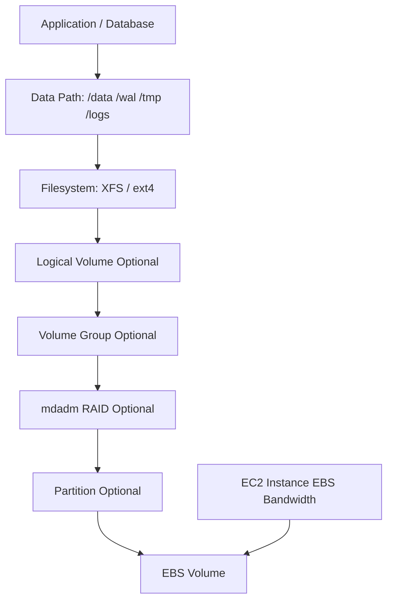
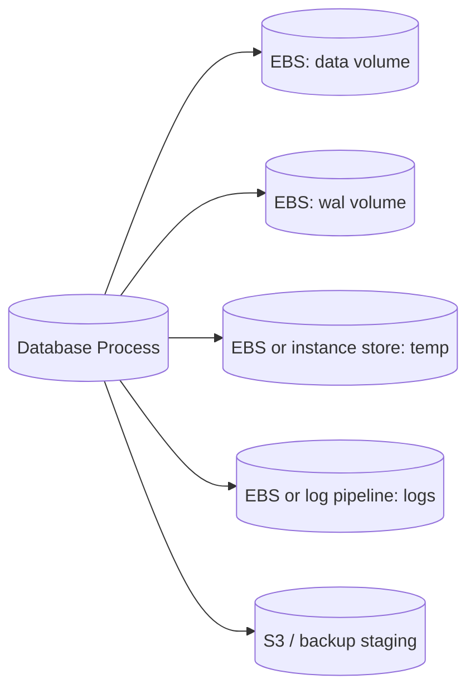
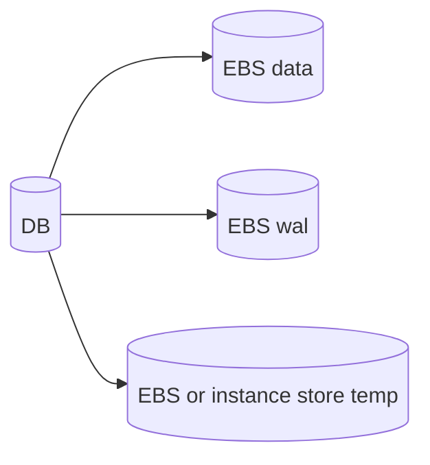
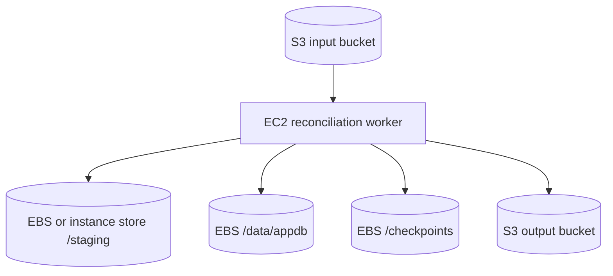

# Part 035 — EBS RAID, LVM, and Database Storage Layout

A production storage layout is not a folder structure.

It is a set of promises about:

- write latency;
- write ordering;
- throughput;
- isolation between data classes;
- restore boundaries;
- volume ownership;
- failure blast radius;
- operational change safety;
- and recovery time.

EBS gives you block devices. Linux gives you partitions, filesystems, LVM, and software RAID. Databases add their own write-ahead logs, checkpoints, temp files, compaction, snapshots, and crash recovery rules.

The hard part is not creating the volume.

The hard part is designing a layout where one noisy path does not poison the whole system, where recovery is possible, and where performance can be explained when the incident starts at 03:00.

---

## 1. Problem yang Diselesaikan

A common anti-pattern:

```text
One EC2 instance
One large EBS volume
Everything mounted under /data
Database data, WAL, logs, temp files, backups, exports, and application files mixed together
```

This works until:

- backup export fills the same filesystem as database data;
- WAL latency spikes because temp sort files saturate the same volume;
- log growth causes the database to stop;
- snapshot restore requires restoring unrelated data together;
- filesystem corruption affects every data class;
- resize/migration becomes high-risk;
- performance debugging cannot isolate which path is slow;
- Terraform sees one big blob, not storage intent.

A better storage layout makes each data class explicit.

```text
/data         durable primary data
/wal          latency-sensitive write-ahead logs
/temp         disposable scratch/temp
/logs         application/system logs, bounded retention
/backup-stg   staging area for backups/exports, disposable or separately protected
/cache        rebuildable cache
```

The goal is not to use more volumes for its own sake.

The goal is to align **storage shape** with **failure shape**.

---

## 2. Mental Model

EBS is a block device. Linux storage is a stack.



Every layer adds power and operational surface area.

| Layer | What it gives | What it costs |
|---|---|---|
| Single EBS volume | Simplicity | Single performance envelope, coarse restore boundary |
| Multiple independent volumes | Isolation by data class | More mounts, more backup policies, more observability |
| LVM | Flexible logical volumes, online growth, naming abstraction | More commands, metadata backup, operator complexity |
| RAID 0 | Aggregate IOPS/throughput across volumes | Any member failure loses the array/filesystem |
| RAID 1 | Mirroring at OS layer | Usually redundant with EBS durability, doubles cost, does not replace backup |
| Filesystem tuning | Better behavior for workload shape | More OS-specific runbook and testing |

The important question:

> Which failure or bottleneck do you want to make smaller?

---

## 3. Core Concepts

### 3.1 RAID on EBS Is a Performance Tool, Not a Default

AWS documents RAID 0 for cases where you need more performance than a single EBS volume can provide. In RAID 0, I/O is striped across volumes, so adding volumes can increase aggregate IOPS and throughput.

But RAID 0 changes your failure model.

```text
Single volume filesystem:
  volume failure or corruption affects that filesystem

RAID 0 filesystem across N volumes:
  failure of any member can affect the whole array
```

RAID 0 should be treated as:

```text
Use only when:
  required throughput/IOPS > practical single-volume limit
  restore process is proven
  snapshots are coordinated
  application can tolerate recovery from backup/snapshot
  all member volumes are monitored

Do not use when:
  operator team cannot debug mdadm/LVM/filesystem issues
  restore has never been tested
  workload could be solved with a larger/faster single volume
  database already has its own sharding/partitioning mechanism
```

### 3.2 LVM Is an Operations Abstraction

LVM helps when storage needs to evolve.

It can provide:

- stable logical names;
- online growth;
- separation of logical volumes from physical devices;
- easier migration from one disk layout to another;
- consistent mount naming;
- ability to add a new physical volume to a volume group.

But LVM is not magic. It does not make writes safer by itself. It does not create backups. It does not solve split-brain. It adds metadata that must be backed up and understood.

Use LVM when you need an explicit storage-management layer.

Avoid LVM when a single simple filesystem is enough and operational simplicity matters more.

### 3.3 Database Storage Layout Is About Write Paths

Most databases have multiple storage classes.

Example for a PostgreSQL-like system:

| Path | Storage behavior | Operational meaning |
|---|---|---|
| Data directory | Durable random read/write | Primary recoverable state |
| WAL | Append-heavy, latency-sensitive | Recovery correctness and commit latency |
| Temp | Rebuildable, bursty | Query execution scratch |
| Logs | Important for debugging, not primary state | Retention and observability |
| Backup staging | Large sequential write/read | Must not fill data/WAL filesystem |

The layout should prevent one class from starving another.



The point is not that every database must use five volumes.

The point is that every database must have a conscious answer for:

```text
What happens if temp fills?
What happens if logs fill?
What happens if WAL latency increases?
What happens if backup export is slow?
What happens if data needs restore but logs do not?
```

---

## 4. Design Decision Framework

### 4.1 Start With Storage Classes

Classify each directory/path.

```text
Path: /var/lib/postgresql/data
State: durable
Latency: medium/high sensitivity
Recovery: snapshot + WAL replay
Can delete: no
Can rebuild: no

Path: /var/lib/postgresql/wal
State: durable, ordered
Latency: very high sensitivity
Recovery: required for crash recovery and PITR
Can delete: no
Can rebuild: no

Path: /var/lib/postgresql/tmp
State: temporary
Latency: medium sensitivity
Recovery: delete/recreate
Can delete: yes
Can rebuild: yes

Path: /var/log/app
State: useful but not authoritative
Latency: low sensitivity
Recovery: log pipeline or bounded local retention
Can delete: bounded by policy
Can rebuild: no, but system can continue
```

Then choose storage shape.

| Requirement | Likely layout |
|---|---|
| Simple app, modest I/O | One gp3 data volume |
| DB with latency-sensitive WAL | Separate WAL volume |
| Large sequential analytics staging | st1/sc1 only if latency profile fits, or S3 staging |
| Very high I/O beyond one volume | RAID 0 over multiple io2/gp3 volumes |
| Frequent online growth | LVM or planned Elastic Volumes process |
| Heavy temp/scratch | Instance store if data is disposable; otherwise separate EBS |
| Shared file semantics | EFS/FSx, not EBS Multi-Attach by default |

### 4.2 Prefer Single Volume Until You Can Name the Isolation Boundary

A separate volume is justified when you can complete this sentence:

```text
This path deserves its own volume because ____ must not affect ____.
```

Good examples:

```text
WAL deserves its own volume because temp sort files must not affect commit latency.

Backup staging deserves its own volume because backup export must not fill the primary data filesystem.

Cache deserves its own disposable volume because cache corruption must be solved by rebuild, not database restore.
```

Weak examples:

```text
We use many volumes because it feels more enterprise.

We separate every folder because someone once said databases need many disks.

We use RAID because more disks are faster.
```

### 4.3 Use RAID 0 Only When the Bottleneck Is the Single-Volume Envelope

Before RAID 0, prove the bottleneck.

Check:

```bash
# OS device view
lsblk -o NAME,TYPE,SIZE,FSTYPE,MOUNTPOINTS

# I/O pressure
avg-cpu: %iowait

# device utilization and latency
sudo iostat -xz 1

# EBS metrics
VolumeReadOps
VolumeWriteOps
VolumeReadBytes
VolumeWriteBytes
VolumeQueueLength
VolumeReadLatency
VolumeWriteLatency
VolumeThroughputPercentage
VolumeConsumedReadWriteOps
```

RAID 0 is reasonable when:

- single volume max throughput is lower than instance EBS bandwidth;
- workload can drive parallel I/O;
- application restore process is tested;
- snapshots are coordinated across member volumes;
- team understands `mdadm` recovery and monitoring;
- a managed service is not a better option.

---

## 5. Reference Layout Patterns

### 5.1 Pattern A — Simple Durable Data Volume

Use for:

- small/medium stateful service;
- single-node tools;
- non-critical internal systems;
- apps where throughput is not near EBS limits.

```mermaid
flowchart TD
    EC2[EC2]
    Root[(Root EBS)]
    Data[(gp3 Data EBS)]

    EC2 --> Root
    EC2 --> Data
    Data --> FS[/data]
```

Example mount plan:

```text
/dev/nvme1n1 -> /data -> xfs -> durable application state
```

Pros:

- simple;
- easy to snapshot;
- easy to restore;
- low operator burden.

Cons:

- coarse isolation;
- logs/temp can still poison data unless configured separately;
- performance envelope tied to one volume.

### 5.2 Pattern B — Data + WAL Separation

Use for:

- database workloads;
- systems where commit latency matters;
- write-heavy services;
- controlled single-node database deployments.



Mount plan:

```text
/data  -> gp3/io2 durable data volume
/wal   -> gp3/io2 latency-sensitive WAL volume
/temp  -> instance store or separate gp3, depending on disposability
```

Rules:

- WAL volume should not share noisy temp/export workload;
- WAL disk full is a severe incident;
- WAL snapshot must be coordinated with database backup strategy;
- do not place backup tarballs on WAL volume;
- monitor `fsync` latency from the database, not only EBS metrics.

### 5.3 Pattern C — RAID 0 Performance Stripe

Use for:

- very high throughput workloads;
- large database or analytics node;
- a workload that exceeds single-volume performance but fits one instance;
- proven backup/restore path.

```mermaid
flowchart TD
    EC2[EC2]
    V1[(EBS vol 1)]
    V2[(EBS vol 2)]
    V3[(EBS vol 3)]
    V4[(EBS vol 4)]
    RAID[mdadm RAID 0]
    FS[XFS/ext4]
    Mount[/data]

    EC2 --> V1
    EC2 --> V2
    EC2 --> V3
    EC2 --> V4
    V1 --> RAID
    V2 --> RAID
    V3 --> RAID
    V4 --> RAID
    RAID --> FS
    FS --> Mount
```

Operator warning:

```text
RAID 0 turns N volumes into one performance surface and one failure surface.
```

Snapshot rule:

```text
Single-volume snapshot is not enough.
For RAID 0, all member volumes must be snapshotted in a coordinated application-consistent window.
```

### 5.4 Pattern D — LVM Logical Layout

Use for:

- systems needing named logical volumes;
- online growth;
- migration between volume sizes/types;
- multiple mount points backed by a managed volume group.

```mermaid
flowchart TD
    EBS1[(EBS PV 1)]
    EBS2[(EBS PV 2 Optional)]
    VG[Volume Group: vg_app]
    LVData[LV: lv_data]
    LVLog[LV: lv_logs]
    LVTemp[LV: lv_temp]
    FSData[/data]
    FSLog[/logs]
    FSTemp[/temp]

    EBS1 --> VG
    EBS2 --> VG
    VG --> LVData --> FSData
    VG --> LVLog --> FSLog
    VG --> LVTemp --> FSTemp
```

LVM is useful when you need flexibility.
But if you only need one filesystem on one volume, LVM can be unnecessary complexity.

---

## 6. Linux Implementation Patterns

### 6.1 Device Discovery on Nitro Instances

On modern Nitro instances, EBS volumes appear as NVMe devices. The device name requested at attach time may not match the Linux device path.

Use stable identifiers.

```bash
lsblk -o NAME,SERIAL,MODEL,SIZE,FSTYPE,MOUNTPOINTS
sudo nvme list
ls -l /dev/disk/by-id/
```

Avoid fragile mounts like:

```text
/dev/nvme1n1 /data xfs defaults 0 2
```

Prefer UUID or filesystem label:

```bash
sudo blkid
```

`/etc/fstab` example:

```text
UUID=11111111-2222-3333-4444-555555555555 /data xfs defaults,nofail 0 2
```

Be careful with `nofail`.

`nofail` can prevent boot failure when a non-critical data volume is missing. But for a database volume, booting without the volume may be more dangerous than failing fast.

Decision:

```text
Critical state volume missing -> fail boot or keep service stopped
Disposable cache volume missing -> recreate and continue
Log volume missing -> continue only if log pipeline is safe
```

### 6.2 Single Volume Format and Mount

Example for a dedicated `/data` volume:

```bash
sudo mkfs.xfs -f /dev/nvme1n1
sudo mkdir -p /data
sudo mount /dev/nvme1n1 /data
sudo chown app:app /data
sudo blkid /dev/nvme1n1
```

Add to `/etc/fstab` using UUID.

```text
UUID=<uuid> /data xfs defaults 0 2
```

Validation:

```bash
findmnt /data
 df -h /data
sudo xfs_info /data
```

### 6.3 RAID 0 With mdadm

Example with four empty EBS volumes.

```bash
sudo mdadm --create /dev/md0 \
  --level=0 \
  --raid-devices=4 \
  /dev/nvme1n1 /dev/nvme2n1 /dev/nvme3n1 /dev/nvme4n1

cat /proc/mdstat
sudo mkfs.xfs -f /dev/md0
sudo mkdir -p /data
sudo mount /dev/md0 /data
```

Persist array metadata:

```bash
sudo mdadm --detail --scan | sudo tee -a /etc/mdadm.conf
sudo dracut -H -f || true
```

Depending on distribution, the initramfs update command differs.

For Debian/Ubuntu-like systems:

```bash
sudo update-initramfs -u
```

Validate:

```bash
cat /proc/mdstat
sudo mdadm --detail /dev/md0
findmnt /data
```

Operational notes:

- record member volume IDs;
- tag member volumes with array name and role;
- monitor each volume, not only `/dev/md0`;
- snapshot all members consistently;
- test instance reboot and stop/start behavior.

### 6.4 LVM Basic Layout

Example:

```bash
sudo pvcreate /dev/nvme1n1
sudo vgcreate vg_app /dev/nvme1n1
sudo lvcreate -n lv_data -L 200G vg_app
sudo mkfs.xfs /dev/vg_app/lv_data
sudo mkdir -p /data
sudo mount /dev/vg_app/lv_data /data
```

Grow later:

```bash
sudo pvresize /dev/nvme1n1
sudo lvextend -r -L +100G /dev/vg_app/lv_data
```

Backup LVM metadata:

```bash
sudo vgcfgbackup
sudo ls -l /etc/lvm/backup /etc/lvm/archive
```

LVM operational invariant:

```text
A team that uses LVM must know how to inspect PV/VG/LV state during an incident.
```

Minimum commands:

```bash
sudo pvs
sudo vgs
sudo lvs -a -o +devices
sudo lvdisplay
sudo vgcfgbackup
```

---

## 7. Database-Oriented Storage Layout

This section does not teach database internals. It gives storage-layout thinking for databases running on EC2/EBS.

### 7.1 PostgreSQL-Like Layout

Example target:

```text
/data/postgres      primary data directory
/wal/postgres       WAL directory or symlink target
/temp/postgres      temp tablespace or temp files
/logs/postgres      logs if not shipped directly
/backup-staging     backup export staging, never on WAL volume
```

Design rules:

- data volume optimized for mixed random I/O;
- WAL volume optimized for low write latency;
- temp path allowed to be disposable if database/app can recreate it;
- backup staging separated to avoid filling `/data`;
- snapshots coordinated with database checkpoint/backup mechanism;
- crash recovery tested from snapshot;
- PITR strategy defined outside the instance.

Failure example:

```text
If /backup-staging fills:
  backup job fails
  database continues

If /wal fills:
  database may block writes or crash
  incident severity is high

If /temp fills:
  heavy query fails
  database should remain recoverable
```

### 7.2 Kafka-Like Layout

For log-segment systems:

- disk throughput matters;
- fsync/flush behavior matters;
- recovery time after broker replacement matters;
- replication factor at the application layer changes storage decisions;
- JBOD semantics may be preferable to RAID depending on broker behavior;
- instance store may be viable only when replication and replacement are designed properly.

A dangerous pattern:

```text
RAID 0 over many EBS volumes for Kafka with no tested broker rebuild process.
```

A safer question:

```text
If this node disappears, can the cluster rebuild partitions within the SLO without saturating network/storage?
```

### 7.3 Search/Index Workloads

Search engines and indexing services often have:

- large segment files;
- merge/compaction spikes;
- read-heavy query patterns;
- write bursts during indexing;
- replica-based recovery.

Storage layout should isolate:

- index data;
- translog/write-ahead component;
- temp merge space;
- logs;
- snapshot repository, usually object storage.

Do not let merge temp space fill the same filesystem required for primary index writes unless the engine is explicitly designed and configured for it.

### 7.4 Application File Store on EBS

EBS is not a shared file service by default.

Use EBS for application files when:

- single writer owns the volume;
- failover is controlled;
- volume attachment is fenced;
- AZ boundary is acceptable;
- backup/restore is explicit.

Avoid EBS for shared multi-instance POSIX-like access unless the application implements safe concurrent write coordination and the EBS Multi-Attach limitations are understood.

For normal shared file workloads, prefer EFS or FSx.

---

## 8. EBS Multi-Attach: Sharp Tool, Not Shared Filesystem

EBS Multi-Attach allows one eligible Provisioned IOPS SSD volume to attach to multiple instances in the same AZ. Each attached instance can have read/write access.

This does **not** automatically provide a safe shared filesystem.

You need an application or cluster filesystem that understands concurrent writes.

Dangerous assumption:

```text
Multi-Attach means multiple EC2 instances can safely mount ext4 and write files together.
```

Safer framing:

```text
Multi-Attach provides block-level concurrent access.
Data consistency is the application/cluster-filesystem responsibility.
```

Use Multi-Attach only when:

- the workload is explicitly designed for shared block storage;
- fencing is implemented;
- write coordination is proven;
- operators understand failure scenarios;
- simpler EFS/FSx patterns are not sufficient.

---

## 9. Snapshot and Backup Implications

Storage layout changes backup semantics.

### 9.1 One Volume

```text
One snapshot captures one block device point in time.
```

Still, application consistency may require:

- database checkpoint;
- filesystem freeze;
- application pause;
- backup mode;
- transaction log archive.

### 9.2 Multiple Independent Volumes

If volumes contain independent state, independent snapshots may be fine.

Example:

```text
/data durable state snapshot
/logs not part of restore
/cache no snapshot
```

### 9.3 RAID 0 or Cross-Volume Database Layout

If one logical filesystem spans multiple EBS volumes, snapshot consistency becomes multi-volume.

Rules:

- snapshot all members together;
- freeze/coordinate application if needed;
- record array metadata;
- restore all members into same AZ;
- recreate array using correct metadata;
- test restore on isolated EC2.

For database layout where data and WAL are separate volumes, recovery consistency must match database backup rules.

Never assume:

```text
Two independent EBS snapshots taken close together are equivalent to a transactionally consistent database backup.
```

---

## 10. Terraform Skeleton

Example: three EBS volumes for data, WAL, and backup staging.

```hcl
resource "aws_ebs_volume" "db_data" {
  availability_zone = var.az
  size              = 500
  type              = "gp3"
  iops              = 12000
  throughput        = 500
  encrypted         = true
  kms_key_id        = var.kms_key_arn

  tags = {
    Name        = "db-data"
    Workload    = var.workload
    StorageRole = "data"
    Recovery    = "snapshot-required"
  }
}

resource "aws_ebs_volume" "db_wal" {
  availability_zone = var.az
  size              = 200
  type              = "io2"
  iops              = 16000
  encrypted         = true
  kms_key_id        = var.kms_key_arn

  tags = {
    Name        = "db-wal"
    Workload    = var.workload
    StorageRole = "wal"
    Recovery    = "snapshot-and-log-archive"
  }
}

resource "aws_ebs_volume" "backup_staging" {
  availability_zone = var.az
  size              = 1000
  type              = "gp3"
  iops              = 3000
  throughput        = 250
  encrypted         = true
  kms_key_id        = var.kms_key_arn

  tags = {
    Name        = "db-backup-staging"
    Workload    = var.workload
    StorageRole = "backup-staging"
    Recovery    = "rebuildable"
  }
}

resource "aws_volume_attachment" "db_data" {
  device_name = "/dev/sdf"
  volume_id   = aws_ebs_volume.db_data.id
  instance_id = aws_instance.db.id
}

resource "aws_volume_attachment" "db_wal" {
  device_name = "/dev/sdg"
  volume_id   = aws_ebs_volume.db_wal.id
  instance_id = aws_instance.db.id
}

resource "aws_volume_attachment" "backup_staging" {
  device_name = "/dev/sdh"
  volume_id   = aws_ebs_volume.backup_staging.id
  instance_id = aws_instance.db.id
}
```

Production additions:

- backup policy by tag;
- CloudWatch alarms per volume;
- filesystem bootstrap script;
- `/etc/fstab` management;
- SSM document for mount validation;
- runbook links in tags or metadata catalog;
- explicit deletion protection for critical volumes.

---

## 11. Observability Contract

For each volume or array, capture:

```text
VolumeId
StorageRole
MountPoint
Filesystem
ExpectedOwner
ExpectedService
SnapshotPolicy
RPO
RTO
CanDelete
CanRebuild
ExpectedIOPS
ExpectedThroughput
LatencySLO
```

Minimum metrics:

| Layer | Metrics / signals |
|---|---|
| EBS | read/write ops, bytes, queue length, read/write latency, burst balance where applicable, status checks |
| EC2 | EBS bandwidth saturation, CPU iowait, network, instance status checks |
| Linux | `iostat -xz`, `df -h`, inode usage, filesystem errors, mount status |
| Database | commit latency, fsync latency, checkpoint duration, WAL write latency, temp spill, replication lag |
| Backup | snapshot age, restore test age, archive lag, failed backup count |

Dashboards should answer:

```text
Which path is slow?
Which volume is saturated?
Is the instance EBS limit saturated?
Is the filesystem full?
Is the database waiting on storage?
Is the backup path competing with the write path?
```

---

## 12. Failure Modes

### 12.1 RAID 0 Member Volume Fails

Symptoms:

- array degraded or unavailable;
- filesystem read/write errors;
- database I/O errors;
- mount becomes read-only;
- application crash or data corruption risk.

Response:

1. Stop application writes.
2. Preserve evidence: `mdadm --detail`, `dmesg`, CloudWatch metrics.
3. Do not blindly reassemble writable.
4. Restore from coordinated snapshot/backups.
5. Validate application consistency.
6. Rebuild array on fresh volumes.
7. Re-run restore test and root cause review.

### 12.2 LVM Metadata Confusion

Symptoms:

- missing volume group;
- duplicate PV UUID after cloning;
- logical volume not active;
- mount fails after restore.

Commands:

```bash
sudo pvscan
sudo vgscan
sudo lvscan
sudo vgchange -ay
sudo lvs -a -o +devices
```

Mitigation:

- document volume group names;
- backup LVM metadata;
- test restore from snapshot;
- avoid cloning production volumes into same host namespace without understanding duplicate IDs.

### 12.3 WAL and Data Snapshots Not Consistent

Symptoms:

- database restore fails;
- WAL replay errors;
- checkpoint mismatch;
- silent rollback to older state.

Prevention:

- use database-native backup mode;
- coordinate snapshots;
- archive WAL/logs externally;
- test point-in-time recovery;
- do not treat filesystem snapshots as database backup strategy without proof.

### 12.4 Temp Volume Fills and Takes Down Service

The failure is often not storage capacity.
It is missing isolation.

Prevention:

- separate temp path;
- set query/work memory limits;
- bound temp usage;
- alert on temp filesystem;
- fail query, not whole database.

### 12.5 Backup Staging Fills Primary Data Disk

This is one of the easiest incidents to prevent.

Rule:

```text
Backup staging must not share the primary data/WAL filesystem unless capacity limits are explicitly enforced.
```

---

## 13. Operational Runbook

### 13.1 Before Production

```bash
# Verify mounts
findmnt
lsblk -f

# Verify fstab
sudo mount -a

# Verify reboot safety
sudo reboot

# After reboot
findmnt /data
findmnt /wal
findmnt /backup-staging

# Verify EBS metrics are tagged and visible
aws ec2 describe-volumes --filters Name=tag:Workload,Values=<workload>
```

### 13.2 Before Layout Change

Checklist:

- [ ] Identify state class per path.
- [ ] Confirm owner service is stopped or backup mode enabled if needed.
- [ ] Take snapshot or database backup.
- [ ] Validate snapshot policy includes all required volumes.
- [ ] Confirm restore procedure.
- [ ] Confirm KMS permissions.
- [ ] Confirm AZ and instance compatibility.
- [ ] Confirm rollback plan.
- [ ] Run change on staging clone.

### 13.3 During Incident

Do not start with random repair commands.

Start with classification:

```text
Is this capacity, latency, corruption, attachment, or consistency?
Is the affected path durable or disposable?
Is the application still writing?
Is snapshot/backup current?
Can we replace the node?
Can we restore to a new instance instead of repairing in place?
```

Then act.

---

## 14. Common Mistakes

### Mistake 1 — RAID 0 Without Restore Test

RAID 0 without restore proof is a bet that all members and operators behave perfectly.

That is not engineering.

### Mistake 2 — Treating EBS Multi-Attach as EFS

Multi-Attach is shared block access.
It does not solve filesystem-level concurrent write safety.

### Mistake 3 — Separating Volumes Without Separating Policies

If `/data`, `/wal`, and `/backup-staging` all have the same alarms, same backup retention, same owner, and same runbook, the layout is mostly cosmetic.

### Mistake 4 — Mounting by Unstable Device Name

Nitro device mapping can surprise teams.
Use UUIDs, labels, or stable by-id paths.

### Mistake 5 — Letting Backup and Temp Compete With WAL

Backups and temp files are not allowed to steal commit latency.

### Mistake 6 — Optimizing for Peak IOPS Before Understanding Write Semantics

A database bottleneck may be `fsync`, checkpoint, lock contention, application transaction shape, or instance EBS bandwidth. More EBS IOPS is not always the fix.

---

## 15. Checklist

Use this before approving an EC2/EBS storage layout.

- [ ] Every mount point has a named state class.
- [ ] Durable and disposable data are separated or explicitly bounded.
- [ ] WAL/log/commit-sensitive path is protected from noisy temp/export workload.
- [ ] Single-volume performance has been evaluated before RAID 0.
- [ ] RAID 0, if used, has tested coordinated snapshot/restore.
- [ ] LVM, if used, has metadata backup and operator runbook.
- [ ] Filesystems are mounted using stable identifiers.
- [ ] Critical missing volumes fail safe, not silently boot unsafe.
- [ ] KMS permissions are tested for restore path.
- [ ] CloudWatch and OS metrics are available per volume.
- [ ] Database-level storage latency metrics are tracked.
- [ ] Backup staging cannot fill primary data/WAL disk.
- [ ] Restore has been tested on an isolated instance.
- [ ] The layout is documented in Terraform/tags/runbook.

---

## 16. Mini Case Study — Payment Reconciliation Node

A reconciliation service processes large files, writes intermediate records, and stores a local embedded database for idempotency.

Initial layout:

```text
/data
  app.db
  input-files/
  output-files/
  logs/
  backup-exports/
```

Incident:

- month-end file is 5x larger than normal;
- `backup-exports` fills `/data`;
- embedded database cannot write;
- service restarts and reprocesses partial jobs;
- duplicate detection becomes slow;
- recovery requires manual cleanup.

Improved layout:

```text
/data/appdb          durable idempotency database on gp3
/staging/input       disposable processing input on separate gp3 or instance store
/staging/output      export staging with quota
/logs                shipped to logging service, bounded local retention
/checkpoints         durable job checkpoint state, small and backed up
```

New invariants:

```text
Large input cannot fill app database volume.
Backup/export failure cannot block idempotency database writes.
Staging can be deleted and rebuilt from S3 source objects.
Checkpoint restore is tested independently from staging restore.
```

Architecture:



Result:

- failure of staging is recoverable;
- database volume remains protected;
- output upload can retry idempotently;
- runbook becomes clear;
- storage cost is explainable.

---

## 17. Summary

EBS layout is architecture.

A strong layout does not ask only:

```text
How much disk do we need?
```

It asks:

```text
What data class is this?
What failure must be isolated?
What path is latency-sensitive?
What path can be rebuilt?
What must be snapshotted together?
What can be restored independently?
What operator action is safe during an incident?
```

Use one volume when simplicity is enough.
Use separate volumes when isolation is real.
Use LVM when evolution needs an abstraction.
Use RAID 0 only when a single EBS volume is the proven bottleneck and restore is already tested.
Use EFS/FSx when you need shared file semantics.

The next part turns these layouts into an incident handbook: EBS failure modes and debugging.

---

## 18. References

- AWS Documentation — Amazon EBS and RAID configuration: https://docs.aws.amazon.com/ebs/latest/userguide/raid-config.html
- AWS Documentation — Amazon EBS volume performance: https://docs.aws.amazon.com/ebs/latest/userguide/ebs-performance.html
- AWS Documentation — Amazon EBS I/O characteristics and monitoring: https://docs.aws.amazon.com/ebs/latest/userguide/ebs-io-characteristics.html
- AWS Documentation — Attach an Amazon EBS volume to an Amazon EC2 instance: https://docs.aws.amazon.com/ebs/latest/userguide/ebs-attaching-volume.html
- AWS Documentation — Amazon EBS Multi-Attach: https://docs.aws.amazon.com/ebs/latest/userguide/ebs-volumes-multi.html
