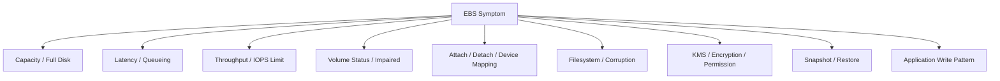
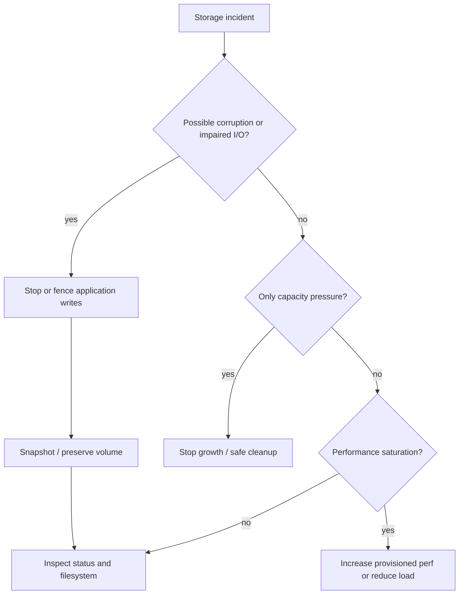
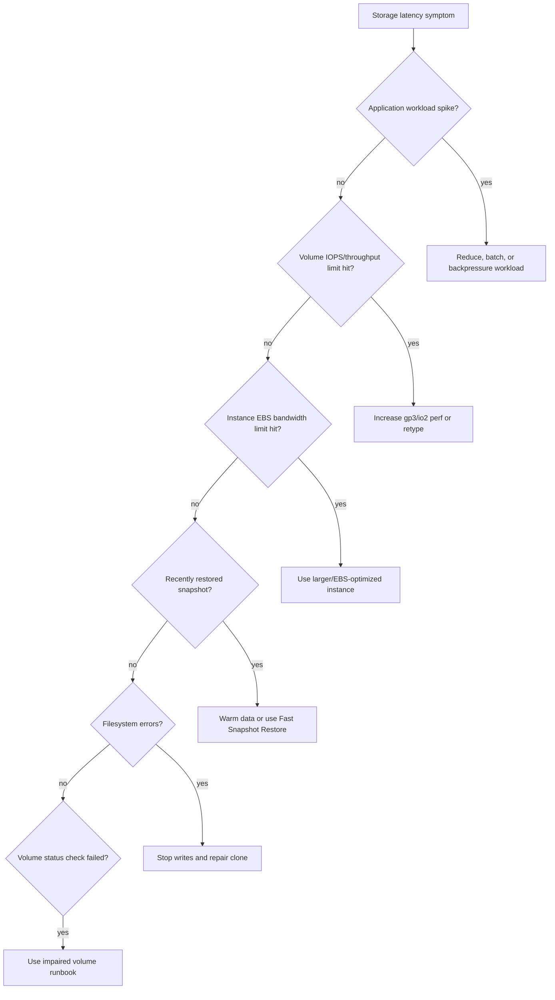
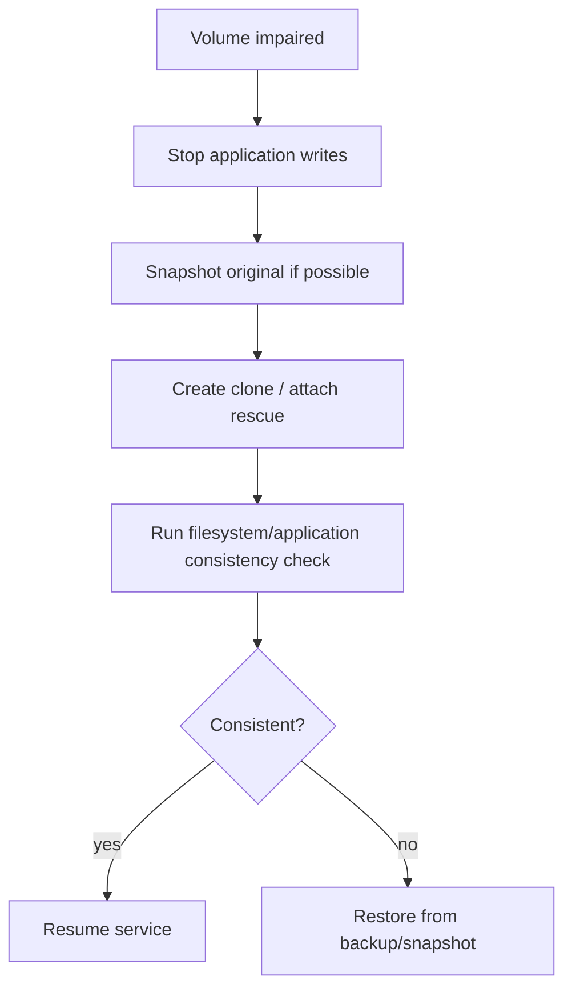
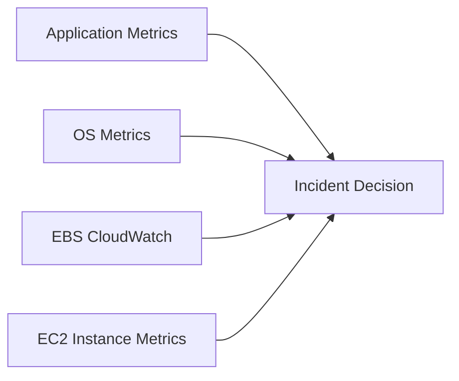
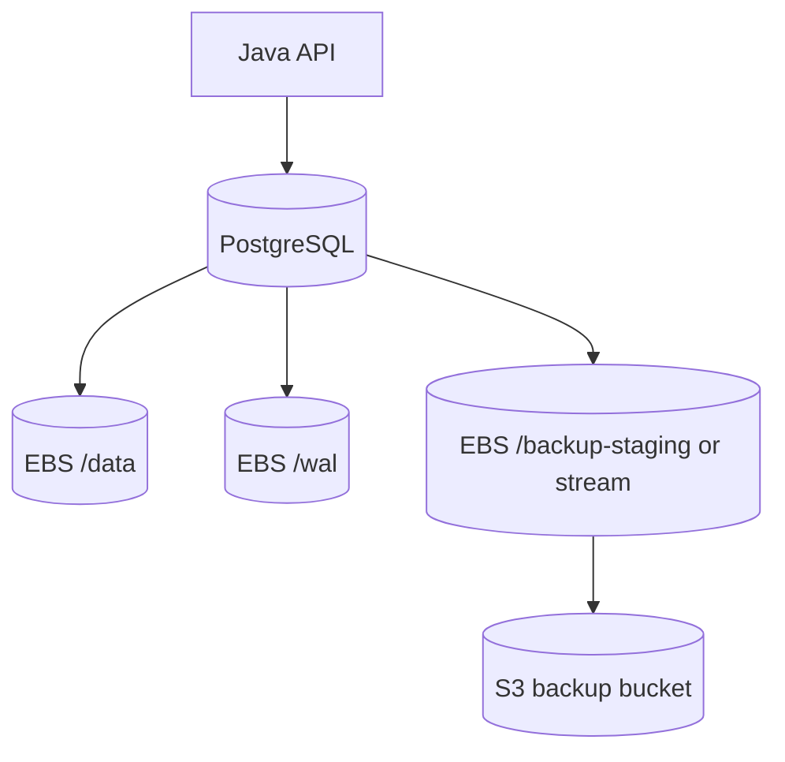

# Part 036 — EBS Failure Modes and Debugging

EBS incidents often look like application incidents first.

The app is slow.
The database is stuck.
SSH is lagging.
The instance becomes unreachable.
Writes time out.
A deployment hangs.
The service restarts in a loop.

Then someone checks disk.

This part is a field manual for debugging EBS-backed systems without guessing.

The goal is not to memorize every possible error.

The goal is to classify the failure quickly:

```text
capacity problem?
latency problem?
throughput or IOPS saturation?
instance EBS bandwidth limit?
volume status issue?
attachment or device discovery issue?
filesystem corruption?
KMS/permission issue?
snapshot/restore issue?
application write pattern issue?
```

Once the class is clear, the next action becomes safer.

---

## 1. Problem yang Diselesaikan

Bad EBS incident handling usually follows this pattern:

```text
Application is slow
Operator SSHes into instance
Runs random df/iostat/fsck commands
Restarts service
Maybe reboots instance
Maybe detaches volume
Maybe enables I/O
Maybe deletes logs
Root cause disappears or data gets worse
```

Production-grade handling is different:

```text
1. Preserve state.
2. Classify failure mode.
3. Stop unsafe writes if needed.
4. Inspect AWS status and OS signals.
5. Decide repair vs replace vs restore.
6. Validate data consistency.
7. Record prevention control.
```

EBS is below the application but above the physical device layer. You must inspect both AWS-level and guest-OS-level signals.

---

## 2. EBS Failure Taxonomy



Each class has a different safe action.

| Class | Common symptom | First safe action |
|---|---|---|
| Capacity | `No space left on device`, service crash | Identify filesystem/inode owner, stop growth, preserve critical data |
| Latency | high iowait, app timeout | Check queue length, EBS latency, instance EBS bandwidth, workload spike |
| Throughput/IOPS | sustained max ops/bytes | Compare demand with provisioned volume and instance limits |
| Impaired status | I/O disabled, status check failed | Preserve evidence, decide enable I/O + consistency check vs restore |
| Attachment | volume stuck attaching/detaching, device missing | Verify AZ, state, OS device mapping, mount/fstab |
| Filesystem | read-only mount, journal errors | Stop writes, snapshot if possible, repair on clone/rescue instance |
| KMS | attach/restore denied, boot failure | Validate key policy, grants, role permissions, cross-account access |
| Snapshot restore | slow first read, wrong data, missing array | Validate restore plan, warmup/FSR, metadata, AZ, KMS |
| App write pattern | storage looks fine but app blocks | Inspect fsync, checkpoint, compaction, temp spill, lock contention |

---

## 3. First Five Minutes Runbook

### 3.1 Do Not Start With Reboot

A reboot can help some system-level issues, but it can also:

- erase volatile evidence;
- extend downtime;
- replay filesystem journal unexpectedly;
- restart writers against a corrupted filesystem;
- hide whether the issue was application, OS, EBS, or instance-level.

Start with classification.

### 3.2 Capture Basic State

AWS side:

```bash
INSTANCE_ID=i-xxxxxxxxxxxxxxxxx
aws ec2 describe-instance-status \
  --instance-ids "$INSTANCE_ID" \
  --include-all-instances

aws ec2 describe-volumes \
  --filters Name=attachment.instance-id,Values="$INSTANCE_ID" \
  --query 'Volumes[].{VolumeId:VolumeId,State:State,AZ:AvailabilityZone,Type:VolumeType,Size:Size,Iops:Iops,Throughput:Throughput,Encrypted:Encrypted,Attachments:Attachments}'
```

OS side:

```bash
hostname
uptime
lsblk -f
df -hT
df -ih
findmnt
sudo dmesg -T | tail -n 200
sudo journalctl -p warning..alert --since "1 hour ago"
iostat -xz 1 10
```

Application side:

```text
current write latency
commit/fsync latency
request p95/p99
queue depth
worker backlog
replication lag
checkpoint/compaction activity
temp spill
```

### 3.3 Decide Whether Writes Are Safe

This is the most important branch.



If corruption or impaired volume is suspected, stop writes before repair.

---

## 4. Failure Mode 1 — Disk Full

### 4.1 Symptoms

```text
No space left on device
Database cannot extend file
WAL/archive failure
Application writes fail
Systemd service cannot create pid/log/temp file
SSH works but service is dead
Root volume at 100%
Inodes exhausted despite free GiB
```

Commands:

```bash
df -hT
df -ih
sudo du -xh / --max-depth=1 2>/dev/null | sort -h
sudo du -xh /var --max-depth=1 2>/dev/null | sort -h
sudo find / -xdev -type f -size +1G -printf '%s %p\n' 2>/dev/null | sort -n | tail -20
```

### 4.2 Capacity vs Inode Exhaustion

A filesystem can fail writes because:

```text
blocks are full
or
inodes are full
```

Check both.

```bash
df -h
df -ih
```

If inodes are full, deleting one giant file may not help.
You need to remove many small files or redesign the workload.

### 4.3 Safe Cleanup Rules

Never run blind cleanup such as:

```bash
sudo rm -rf /var/log/*
```

Safer approach:

```bash
# Identify biggest directories first
sudo du -xh /var --max-depth=2 2>/dev/null | sort -h | tail -50

# Check deleted-but-open files
sudo lsof +L1

# Truncate only known log files when log loss is acceptable
sudo truncate -s 0 /var/log/some-known-log.log
```

For databases:

- do not delete WAL manually unless following database-specific recovery procedure;
- do not delete data files manually;
- do not delete temporary files while database is running unless docs permit it;
- prefer stopping runaway process and adding capacity.

### 4.4 Immediate Fix Options

| Option | When to use | Risk |
|---|---|---|
| Delete safe temp/cache | Path is explicitly disposable | Low if classification is correct |
| Truncate known logs | Logs are shipped or non-critical | Medium; may lose evidence |
| Increase EBS size | Filesystem supports grow | Low/medium; still needs filesystem expansion |
| Attach emergency volume | Need quick relocation | Medium; app config change needed |
| Restore to larger volume | Corruption or risky full state | Higher time, safer consistency if done well |

### 4.5 Prevention

- separate data, WAL, temp, logs, and backup staging;
- filesystem-level alerts at 70/80/90%;
- inode alerts;
- log retention enforced;
- backup staging quota;
- capacity trend alarms;
- runbook for online volume expansion.

---

## 5. Failure Mode 2 — EBS Latency Spike

### 5.1 Symptoms

```text
Application p99 latency spikes
Database commit latency increases
Linux iowait high
VolumeQueueLength increases
Read/write latency metrics increase
Throughput/IOPS near provisioned limit
Instance EBS bandwidth near limit
Deployment or backup causes service degradation
```

Commands:

```bash
iostat -xz 1 30
pidstat -d 1 30
sudo sar -d 1 30 || true
sudo dmesg -T | grep -iE 'blk|nvme|io error|timeout|ext4|xfs' | tail -50
```

CloudWatch metrics to compare:

```text
VolumeReadOps
VolumeWriteOps
VolumeReadBytes
VolumeWriteBytes
VolumeQueueLength
VolumeReadLatency
VolumeWriteLatency
VolumeThroughputPercentage
VolumeConsumedReadWriteOps
VolumeStalledIOCheck
VolumeIOPSExceededCheck
VolumeThroughputExceededCheck
```

### 5.2 Queue Length Interpretation

Queue length means pending I/O requests.
It is not automatically bad.

It becomes suspicious when:

```text
queue length rises
and latency rises
and application waits on I/O
and throughput/IOPS or instance bandwidth is saturated
```

A queue can also rise because the application suddenly issues many parallel requests.

Do not conclude "EBS is slow" until you compare:

- application workload;
- OS iowait;
- EBS queue/latency;
- volume limits;
- instance EBS bandwidth;
- neighboring paths such as backup/compaction.

### 5.3 Bottleneck Isolation



### 5.4 Common Causes

| Cause | Signal | Fix |
|---|---|---|
| Under-provisioned gp3 | EBS exceeded metrics, queue rise | Increase IOPS/throughput |
| Instance EBS cap | all volumes slow together | Larger instance / reduce concurrency |
| Backup job | bytes spike, sequential read/write | Schedule/throttle/separate volume |
| DB checkpoint | periodic write spike | Tune DB checkpoint, provision throughput |
| Compaction/merge | search/index workload spike | isolate temp/merge, provision headroom |
| Snapshot restore cold blocks | first-read latency after restore | initialization/warmup/FSR |
| Filesystem issue | kernel errors, remount read-only | stop writes, clone, repair |

---

## 6. Failure Mode 3 — EBS Volume Status Impaired

EBS volume status checks can detect potential inconsistency. When EBS determines that data may be inconsistent, I/O may be disabled by default to prevent corruption, and the volume status can become `impaired`.

### 6.1 Symptoms

```text
Volume status check failed
Volume impaired
I/O disabled
Attached EBS status check failing on EC2
Application I/O errors
Filesystem remounted read-only
Instance appears hung due to blocked I/O
```

AWS-side checks:

```bash
VOL_ID=vol-xxxxxxxxxxxxxxxxx
aws ec2 describe-volume-status --volume-ids "$VOL_ID"
aws ec2 describe-volumes --volume-ids "$VOL_ID"
```

OS checks:

```bash
sudo dmesg -T | grep -iE 'I/O error|blk_update_request|nvme|ext4|xfs|buffer error' | tail -100
mount | grep -E ' ro[ ,]|read-only'
```

### 6.2 Safe Response

Do not immediately enable I/O and restart everything.

Classify first:

```text
Is this a critical durable volume?
Is application still writing?
Is there a current snapshot?
Can we perform consistency check on attached instance?
Should we attach to a rescue instance?
Is restore from backup safer?
```

Options:

| Option | Use when |
|---|---|
| Enable I/O and check attached | Low-risk filesystem, app stopped, fastest path needed |
| Attach to rescue instance | Need offline fsck/xfs_repair or evidence preservation |
| Snapshot then restore clone | Need safer repair or testing before touching original |
| Delete volume | Disposable volume or obsolete data |
| Restore from known-good backup | Consistency uncertain or business-critical state |

### 6.3 Consistency Check Pattern

High-level flow:



Filesystem commands depend on filesystem.

For ext4 on unmounted volume:

```bash
sudo fsck -f /dev/nvmeXn1
```

For XFS, use `xfs_repair` on unmounted filesystem:

```bash
sudo xfs_repair /dev/nvmeXn1
```

For database volumes, filesystem consistency is not enough. Run database recovery/validation too.

---

## 7. Failure Mode 4 — Attachment, Detachment, and Device Mapping Problems

### 7.1 Symptoms

```text
EBS volume shows attached but device missing
mount fails after reboot
wrong filesystem mounted
volume stuck detaching
Terraform stuck on attachment
app starts before mount exists
root volume boots but data volume missing
```

AWS-side checks:

```bash
aws ec2 describe-volumes --volume-ids vol-xxxxxxxxxxxxxxxxx
aws ec2 describe-instances --instance-ids i-xxxxxxxxxxxxxxxxx \
  --query 'Reservations[].Instances[].BlockDeviceMappings'
```

OS-side checks:

```bash
lsblk -f
sudo nvme list
ls -l /dev/disk/by-id/
sudo blkid
findmnt
systemctl status local-fs.target
```

### 7.2 Common Causes

| Cause | Explanation | Fix |
|---|---|---|
| Wrong AZ | EBS volume and EC2 must be in same AZ | Create/restore volume in correct AZ |
| Nitro device naming | Requested `/dev/sdf` appears as NVMe path | Mount by UUID/by-id, not assumed path |
| Missing filesystem | Raw block device not formatted | Format only if new/empty volume is confirmed |
| Stale fstab | Boot waits/fails on absent volume | Use correct UUID and fail-safe policy |
| Busy mount | Processes using filesystem block detach | Stop process, unmount cleanly |
| ASG replacement | New instance does not own old data volume | Implement attach/fencing/lifecycle process |
| KMS access | encrypted volume cannot be used | Fix key policy/grants/role |

### 7.3 Stuck Detach

Before forcing detach, understand what is writing.

```bash
findmnt /data
sudo lsof +f -- /data
sudo fuser -vm /data
```

Safe order:

1. Stop application.
2. Flush writes.
3. Unmount filesystem.
4. Detach volume.
5. Verify AWS state.

```bash
sync
sudo umount /data
```

Force detach can cause data loss or filesystem corruption if writes are active.

---

## 8. Failure Mode 5 — Filesystem Corruption or Read-Only Remount

### 8.1 Symptoms

```text
EXT4-fs error
XFS metadata corruption
Buffer I/O error
mount: wrong fs type, bad option, bad superblock
filesystem remounted read-only
application receives EIO
```

Inspect:

```bash
sudo dmesg -T | grep -iE 'ext4|xfs|I/O error|buffer error|nvme|blk'
mount | grep -E ' ro[ ,]|read-only'
lsblk -f
```

### 8.2 Safe Repair Rule

Do not repair the only copy first if you can avoid it.

Better:

```text
snapshot original -> create clone -> attach clone to rescue -> run repair -> validate -> promote or restore
```

For ext4:

```bash
sudo umount /dev/nvmeXn1
sudo fsck -f /dev/nvmeXn1
```

For XFS:

```bash
sudo umount /dev/nvmeXn1
sudo xfs_repair /dev/nvmeXn1
```

If filesystem is part of LVM or RAID, repair the correct logical device, not a random member volume.

```bash
lsblk
sudo lvs -a -o +devices
cat /proc/mdstat
```

### 8.3 Application Consistency

Filesystem repair may make the filesystem mountable.
It does not guarantee the database/application state is correct.

After repair, validate:

- database startup recovery;
- checksum validation if available;
- application-level consistency checks;
- row/count/invariant checks;
- replication status;
- recent transaction correctness;
- backup chain integrity.

---

## 9. Failure Mode 6 — Snapshot and Restore Surprises

### 9.1 Slow Reads After Restore

EBS volumes restored from snapshots can experience higher latency on first access to blocks that have not been initialized. For latency-sensitive restore paths, plan warmup or Fast Snapshot Restore.

Symptoms:

```text
restored volume attaches successfully
filesystem mounts
application starts
first query/read is slow
latency gradually improves as data is read
```

Mitigations:

- pre-warm critical files/blocks;
- run controlled initialization reads;
- use Fast Snapshot Restore for critical snapshots/AZs;
- avoid declaring restore complete before latency is acceptable.

### 9.2 Missing RAID/LVM Metadata After Restore

A restored member volume is not enough if original storage was array-based.

Check:

```bash
cat /proc/mdstat
sudo mdadm --examine /dev/nvme*n1
sudo pvscan
sudo vgscan
sudo lvscan
```

Restore plan must include:

- all member snapshots;
- original array metadata;
- volume order/role tags;
- same or compatible AZ;
- application consistency point;
- mount validation.

### 9.3 KMS Restore Failure

Symptoms:

```text
volume created but attach/use fails
AccessDeniedException
encrypted snapshot cannot be copied/shared/restored
boot volume from encrypted AMI fails for role/account
```

Check:

- key policy;
- IAM role permissions;
- grants;
- cross-account snapshot sharing;
- key enabled/disabled state;
- region/account of key;
- AWS managed key vs customer managed key boundary.

### 9.4 Wrong Restore Boundary

A snapshot is point-in-time for a volume.
If the application state spans volumes, a restore from only one volume can be inconsistent.

Example:

```text
/data restored from 10:00:00
/wal restored from 10:04:30
```

This may be invalid depending on database recovery rules.

---

## 10. Failure Mode 7 — Instance-Level EBS Bottleneck

Sometimes every volume looks slow because the instance is the bottleneck.

Symptoms:

```text
multiple volumes show latency at same time
aggregate throughput near instance EBS limit
larger volume provisioning does not improve performance
network/EBS bandwidth metrics suggest saturation
CPU iowait high across devices
```

Fix options:

- reduce concurrent I/O;
- split workload across instances;
- choose instance type with higher EBS bandwidth;
- use RAID 0 only if instance still has unused bandwidth;
- move appropriate data to S3/EFS/FSx/managed database;
- isolate backup/compaction from serving path.

Key invariant:

```text
A volume cannot deliver useful performance beyond what the instance and workload can drive.
```

---

## 11. Failure Mode 8 — Multi-Attach Split-Brain

EBS Multi-Attach can expose one block volume to multiple instances in the same AZ. That does not make the filesystem safe.

Danger:

```text
Instance A and Instance B both mount the same ext4 filesystem read/write.
Both write.
Filesystem metadata corrupts.
Application state is no longer reliable.
```

Prevention:

- use cluster-aware filesystem/application;
- implement fencing;
- never allow two uncoordinated writers;
- test node death and recovery;
- prefer EFS/FSx for shared file semantics where appropriate.

Incident response:

1. Stop all writers.
2. Snapshot original volume.
3. Attach clone to rescue host.
4. Run filesystem/application consistency checks.
5. Restore from backup if consistency is uncertain.
6. Fix fencing before re-enabling service.

---

## 12. Debugging Playbooks by Symptom

### 12.1 Application Is Slow

```text
1. Check app p95/p99 and error type.
2. Check database/storage wait metrics.
3. Check iostat latency/utilization.
4. Check EBS latency/queue/exceeded metrics.
5. Check instance EBS bandwidth.
6. Check backup/compaction/deployment jobs.
7. Decide: shape load, increase EBS perf, resize instance, or isolate path.
```

### 12.2 Instance Is Unreachable

Possible causes:

- root volume full;
- root filesystem corruption;
- kernel hung on I/O;
- EBS status issue;
- unrelated network/security issue.

Storage-focused path:

```text
1. Check EC2 system/instance/attached EBS status checks.
2. Check console output/system log.
3. Stop instance only if safe for workload.
4. Detach root volume to rescue instance if needed.
5. Snapshot before repair.
6. Fix root filesystem/capacity.
7. Reattach and boot.
```

### 12.3 Volume Attached but Not Mounted

```text
1. Verify volume state = in-use.
2. Verify same AZ and correct instance.
3. Check lsblk/nvme list.
4. Check filesystem UUID.
5. Check fstab.
6. Check systemd mount ordering.
7. Mount manually.
8. Update boot automation.
```

### 12.4 Disk Full but `du` Does Not Match `df`

Common cause: deleted but open files.

```bash
sudo lsof +L1
```

Fix:

- restart process holding deleted file;
- truncate known safe file descriptor only if necessary;
- fix log rotation.

### 12.5 `fsck` Says Device Busy

Find users:

```bash
findmnt /data
sudo lsof +f -- /data
sudo fuser -vm /data
```

Stop services and unmount.

Do not run filesystem repair on a mounted read-write filesystem.

---

## 13. Repair vs Replace vs Restore

### 13.1 Decision Table

| Situation | Prefer |
|---|---|
| Stateless compute with bad root volume | Replace instance |
| Root volume full but state external | Replace or repair quickly |
| Data volume full, filesystem healthy | Resize/cleanup |
| EBS latency from underprovisioning | Modify volume or resize instance |
| Volume impaired, consistency uncertain | Snapshot + clone + check or restore |
| Filesystem corruption on durable DB | Stop writes + clone repair + DB validation |
| RAID 0 member issue | Restore coordinated set |
| KMS denied on restore | Fix key policy before repeated attempts |
| Multi-Attach split-brain | Stop all writers + consistency validation/restore |

### 13.2 Replace-Over-Repair Principle

For compute:

```text
replace over repair
```

For state:

```text
preserve before repair
```

Do not apply replace-over-repair blindly to unique state.

Better framing:

```text
Rebuild compute.
Restore or validate state.
```

---

## 14. Monitoring and Alarms

Minimum EBS alarms:

```text
VolumeStatus impaired / failed check
Attached EBS status check failed on EC2
VolumeReadLatency high
VolumeWriteLatency high
VolumeQueueLength abnormal for workload
VolumeIOPSExceededCheck > 0
VolumeThroughputExceededCheck > 0
VolumeStalledIOCheck > 0
Disk usage > threshold
Inode usage > threshold
Filesystem read-only signal
```

Application-level alarms:

```text
DB commit latency
WAL write latency
checkpoint duration
replication lag
request timeout rate
queue backlog age
job retry rate
```

Dashboards should show AWS and OS/app signals together.



---

## 15. Preventive Controls

### 15.1 Design Controls

- separate durable/disposable paths;
- separate WAL/commit-sensitive path from temp/export;
- avoid RAID unless bottleneck is proven;
- use EFS/FSx for shared file semantics;
- use S3 for object/archive/staging where appropriate;
- keep root volume boring and replaceable;
- keep state volume ownership explicit.

### 15.2 Operational Controls

- snapshots by storage role;
- restore tests;
- KMS restore tests;
- runbooks per mount point;
- volume tags with owner/recovery metadata;
- golden AMI includes diagnostic tools;
- SSM access for impaired SSH cases;
- chaos/game day for disk full and restore.

### 15.3 Change Controls

Before modifying storage:

- snapshot;
- validate app consistency requirements;
- confirm rollback;
- confirm filesystem grow/shrink path;
- update IaC;
- update dashboards and alarms;
- test in staging clone.

---

## 16. Mini Case Study — Latency Spike During Nightly Backup

A Java service uses PostgreSQL on EC2 with one gp3 volume mounted at `/data`.

At 01:00:

- backup job starts;
- database dump writes to `/data/backups`;
- CloudWatch shows increased write bytes;
- `VolumeQueueLength` rises;
- application p99 latency goes from 80 ms to 2.5 s;
- database commit latency increases;
- no EC2 CPU issue.

Initial wrong conclusion:

```text
EBS is unreliable at night.
```

Actual root cause:

```text
Backup staging competes with database data and WAL on the same volume.
The volume throughput budget is consumed by sequential backup writes.
Commit path suffers.
```

Fix:

```text
1. Separate WAL volume.
2. Write backup staging to separate volume or stream directly to S3.
3. Throttle backup job.
4. Add alarms for write latency and queue length.
5. Test restore from backup, not local dump only.
```

Improved architecture:



Outcome:

- backup no longer steals commit latency;
- alert points to exact path;
- storage cost is higher but incident risk is lower;
- restore process is documented and tested.

---

## 17. Final Checklist

When debugging EBS, confirm:

- [ ] Which volume and mount point is affected?
- [ ] Is data durable, disposable, or reconstructable?
- [ ] Is application still writing?
- [ ] Are EC2 system/instance/attached EBS checks healthy?
- [ ] Is EBS volume status healthy?
- [ ] Is disk space or inode usage exhausted?
- [ ] Is latency caused by queueing, volume limit, instance limit, or workload spike?
- [ ] Are there filesystem/kernel errors?
- [ ] Are KMS permissions valid for attach/restore?
- [ ] Was the volume recently restored from snapshot?
- [ ] Is LVM/RAID involved?
- [ ] Are snapshots coordinated across all required volumes?
- [ ] Is repair being done on a clone where possible?
- [ ] Has application-level consistency been validated?
- [ ] Has the prevention control been added after incident?

---

## 18. Summary

EBS debugging is a classification problem.

Do not ask only:

```text
Is the disk slow?
```

Ask:

```text
Which path is affected?
Which layer is failing?
Is this capacity, latency, status, attachment, filesystem, KMS, restore, or app write shape?
Can writes continue safely?
Should we repair, replace, or restore?
```

The safest production pattern:

```text
Preserve before repair.
Repair on clone when possible.
Validate at filesystem and application layer.
Prevent recurrence with layout, alarms, and restore tests.
```

This closes the EBS block-storage section.

The next section moves to instance store and ephemeral storage, where the design premise flips: data is allowed to disappear if the system is designed correctly.

---

## 19. References

- AWS Documentation — Amazon EBS volume status checks: https://docs.aws.amazon.com/ebs/latest/userguide/monitoring-volume-checks.html
- AWS Documentation — Work with an impaired Amazon EBS volume: https://docs.aws.amazon.com/ebs/latest/userguide/work_volumes_impaired.html
- AWS Documentation — Auto-enable I/O for impaired Amazon EBS volumes: https://docs.aws.amazon.com/ebs/latest/userguide/volumeIO.html
- AWS Documentation — Amazon EBS I/O characteristics and monitoring: https://docs.aws.amazon.com/ebs/latest/userguide/ebs-io-characteristics.html
- AWS Documentation — CloudWatch metrics for Amazon EBS: https://docs.aws.amazon.com/ebs/latest/userguide/using_cloudwatch_ebs.html
- AWS Documentation — Attach an Amazon EBS volume to an Amazon EC2 instance: https://docs.aws.amazon.com/ebs/latest/userguide/ebs-attaching-volume.html
- AWS Documentation — Status checks for Amazon EC2 instances: https://docs.aws.amazon.com/AWSEC2/latest/UserGuide/monitoring-system-instance-status-check.html
