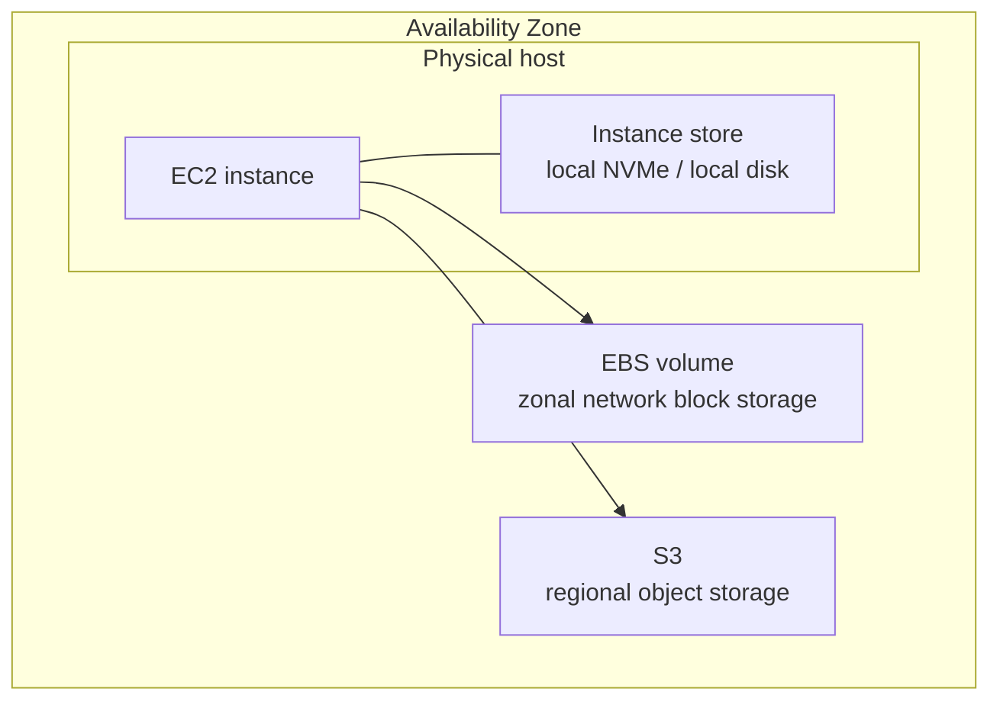
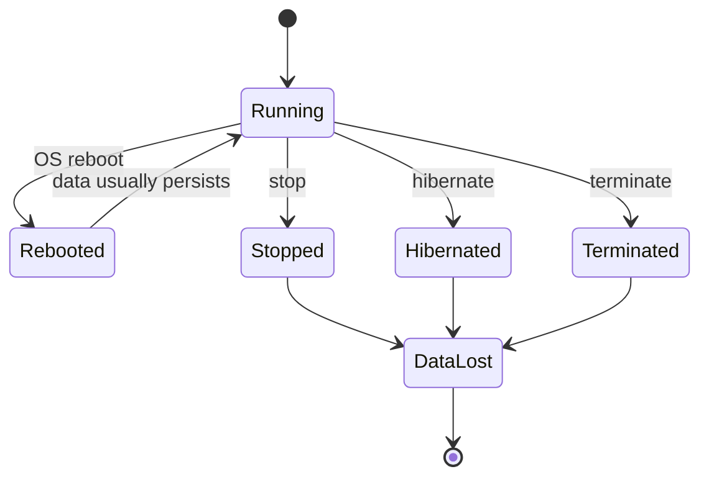
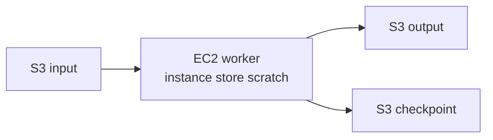
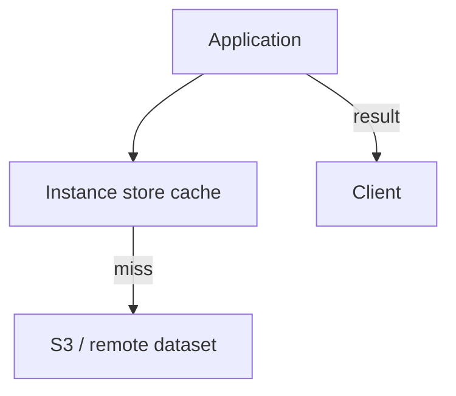
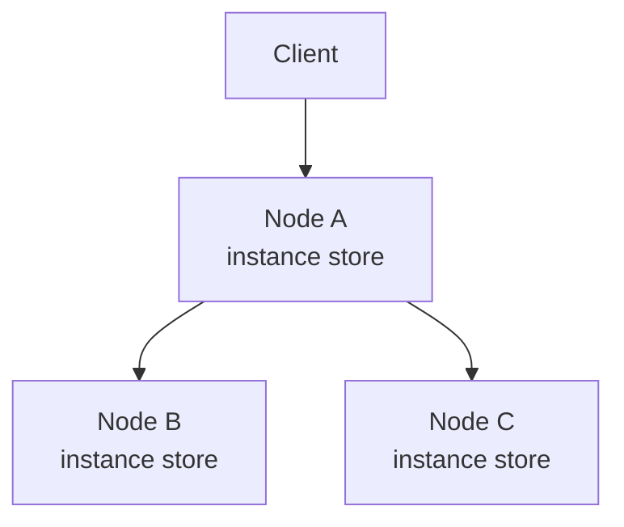
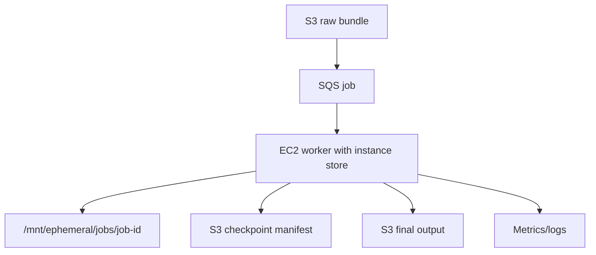

## 1. Problem yang Diselesaikan

Banyak engineer memperlakukan semua "disk" di EC2 seolah-olah sama. Ini berbahaya.

Di EC2 ada beberapa jenis storage yang terlihat seperti block device di OS, tetapi kontraknya berbeda:

| Storage | Attached to | Survives reboot | Survives stop/start | Survives termination | Typical use |
|---|---|---:|---:|---:|---|
| EBS | Network-attached, zonal | Yes | Yes | Depends on delete-on-termination | durable block storage |
| Instance store | Physically attached to host | Yes | No | No | cache, scratch, temporary replicated data |
| RAM/tmpfs | Memory | No, unless app restores | No | No | ultra-temporary data |

Instance store menyelesaikan masalah ini:

> "Saya butuh local storage yang sangat dekat dengan compute, throughput/latency tinggi, dan saya rela kehilangan isinya karena data bisa dibuat ulang, di-recompute, di-rehydrate, atau direplikasi."

Kalimat pentingnya adalah: **rela kehilangan isinya**.

Kalau data tidak boleh hilang, instance store bukan storage utama. Kalau data bisa hilang tetapi kehilangan itu membuat seluruh sistem berhenti total selama berjam-jam, kontrak recovery-nya belum lengkap.

---

## 2. Mental Model

Instance store adalah **local ephemeral block storage** yang melekat pada host fisik tempat EC2 instance berjalan.



Model mentalnya:

1. **Dekat dengan CPU**  
   Storage berada di host yang sama atau sangat dekat dengan instance. Ini membuatnya cocok untuk workload yang sensitif terhadap local I/O.

2. **Terikat pada lifetime instance/host**  
   Instance store bukan resource independen seperti EBS. Ia tidak bisa dilepas lalu dipasang ke instance lain untuk recovery state.

3. **Ephemeral**  
   Data bisa tetap ada saat reboot, tetapi hilang saat instance stop, hibernate, atau terminate. Ketika instance stop/terminate, blok instance store dihapus secara kriptografis.

4. **Tidak ada snapshot managed seperti EBS**  
   Kalau butuh backup, Anda harus membuat mekanisme sendiri ke S3/EBS/EFS/FSx/remote system.

5. **Tidak semua instance type punya instance store**  
   Kapasitas, jumlah disk, dan performanya ditentukan oleh instance type.

---

## 3. Core Concepts

### 3.1 Instance Store Bukan EBS Murah

Kesalahan umum:

```text
EBS mahal.
Instance store gratis di beberapa instance.
Maka taruh data database di instance store.
```

Premis ini salah karena yang dibandingkan bukan hanya harga per GB, tetapi **kontrak kehilangan data**.

Instance store cocok ketika:

- data bisa dibuat ulang;
- data adalah cache;
- data adalah temporary working set;
- data direplikasi ke node lain;
- data adalah output intermediate;
- job bisa restart dari checkpoint durable;
- loss hanya menurunkan performa sementara, bukan menghilangkan kebenaran bisnis.

Instance store tidak cocok sebagai satu-satunya tempat untuk:

- database source of truth;
- user-uploaded file;
- audit log;
- ledger;
- queue durable;
- compliance record;
- primary artifact;
- encryption key material;
- unrecoverable ML checkpoint;
- state regulatory/case-management.

### 3.2 Persistence Contract

Instance store memiliki kontrak lifecycle seperti ini:



Prinsip:

- reboot bukan loss event utama;
- stop/start adalah loss event;
- terminate adalah loss event;
- hibernate juga membuat instance store tidak menjadi storage recovery;
- host failure harus diasumsikan sebagai loss event;
- ASG replacement selalu harus diasumsikan menghilangkan isi instance store.

### 3.3 Device Discovery

Pada instance berbasis Nitro, instance store umumnya muncul sebagai NVMe device.

Contoh discovery:

```bash
lsblk
nvme list
sudo file -s /dev/nvme1n1
```

Jangan hardcode device name seperti `/dev/xvdb` sebagai asumsi universal. Pada Nitro, device enumeration bisa berbeda. Gunakan:

- `lsblk`;
- `nvme list`;
- udev rule;
- filesystem label;
- UUID;
- bootstrap script yang eksplisit mendeteksi disk.

Contoh mount by label:

```bash
sudo mkfs.xfs -L INSTANCE_STORE_0 /dev/nvme1n1
sudo mkdir -p /mnt/ephemeral
sudo mount LABEL=INSTANCE_STORE_0 /mnt/ephemeral
```

Untuk production, proses ini harus idempotent. Jangan format ulang disk sembarangan saat reboot bila Anda masih mengandalkan data reboot-persistent.

### 3.4 Encryption Boundary

Untuk NVMe instance store, data dienkripsi menggunakan hardware module di instance. Kunci dibuat per perangkat dan dihancurkan ketika instance stop atau terminate. Anda tidak membawa KMS key sendiri untuk instance store encryption.

Implikasi:

- default hardware encryption bagus untuk data at rest pada media;
- tetapi tidak menggantikan application-level security;
- tidak memberi recovery karena key dihancurkan;
- tidak memberi audit semantics seperti KMS-managed EBS/S3;
- tidak membuat temporary secret dumping menjadi aman secara otomatis.

### 3.5 Capacity and Shape

Instance store tidak dipilih sendiri seperti EBS. Anda memilih **instance type**, lalu menerima bentuk local storage-nya.

Pertanyaan desain:

- berapa jumlah local disk?
- NVMe atau non-NVMe?
- total GB?
- apakah butuh RAID 0?
- apakah workload sequential throughput heavy?
- apakah workload random I/O heavy?
- apakah I/O local lebih penting daripada fleet elasticity?
- apakah node replacement bisa kehilangan cache tanpa incident?

---

## 4. Workload Fit

### 4.1 Good Fit

| Workload | Mengapa cocok |
|---|---|
| Build cache | cache bisa dibuat ulang dari source/dependency |
| Temporary file processing | intermediate dapat diulang dari input durable |
| Video/image transcoding scratch | raw input/output final berada di S3/EFS/FSx |
| ETL spill | input dan checkpoint durable, spill temporary |
| Search engine segment cache | index bisa direplikasi atau rebuild |
| Database temp tablespace | source data tetap ada di durable DB storage |
| Kafka-like replicated log dengan replication factor benar | data punya replica lain, bukan single copy |
| HPC scratch | final artifact/checkpoint ditulis ke S3/FSx/EBS |
| ML preprocessing cache | dataset source of truth tetap di S3/FSx |

### 4.2 Bad Fit

| Workload | Mengapa buruk |
|---|---|
| Single-node database primary | host loss = data loss |
| Audit log utama | loss melanggar durability/compliance |
| User upload sementara tanpa durable copy | retry user belum tentu mungkin |
| Queue utama tanpa replication | acknowledged message bisa hilang |
| Manual admin artifact | sering tidak terdokumentasi dan tidak recoverable |
| Secret material | local ephemeral bukan secret manager |
| Backup staging satu-satunya | backup hilang bersama instance |

---

## 5. Production Design

### 5.1 Treat Instance Store as Disposable

Desain harus memenuhi invariant:

> Menghapus seluruh isi instance store kapan pun tidak boleh menyebabkan permanent data loss.

Uji invariant ini secara praktis:

```bash
sudo systemctl stop app
sudo rm -rf /mnt/ephemeral/*
sudo systemctl start app
```

Sistem boleh:

- lebih lambat;
- melakukan cache warmup;
- reprocess job;
- pull ulang artifact;
- rebalance shard;
- restore working set.

Sistem tidak boleh:

- kehilangan transaksi yang sudah di-ack;
- kehilangan file user;
- kehilangan status case;
- kehilangan audit trail;
- gagal boot permanen;
- butuh SSH manual untuk hidup.

### 5.2 Separate Durable and Ephemeral Paths

Contoh directory contract:

```text
/app
  /config              -> immutable or parameterized config
  /data-durable         -> EBS/EFS/FSx, if needed
  /data-ephemeral       -> instance store
  /logs                 -> stdout/agent shipping, not local-only
  /tmp                  -> OS temp, bounded
```

Untuk aplikasi:

```yaml
storage:
  source_of_truth: s3://company-prod-input/
  checkpoint_path: s3://company-prod-checkpoints/job-a/
  scratch_path: /mnt/ephemeral/job-a
  output_path: s3://company-prod-output/
```

Jangan biarkan aplikasi menulis sembarangan ke path default tanpa klasifikasi.

### 5.3 Bootstrap Mount Contract

Contoh bootstrap sederhana:

```bash
#!/usr/bin/env bash
set -euo pipefail

MOUNT_POINT="/mnt/ephemeral"
DEVICE="$(lsblk -ndo NAME,TYPE | awk '$2=="disk" && $1 ~ /^nvme/ {print "/dev/"$1}' | head -n1)"

if [ -z "${DEVICE}" ]; then
  echo "No NVMe instance store device found"
  exit 0
fi

sudo mkdir -p "${MOUNT_POINT}"

if ! sudo blkid "${DEVICE}" >/dev/null 2>&1; then
  sudo mkfs.xfs -f -L EPHEMERAL0 "${DEVICE}"
fi

if ! mountpoint -q "${MOUNT_POINT}"; then
  sudo mount LABEL=EPHEMERAL0 "${MOUNT_POINT}"
fi

sudo mkdir -p "${MOUNT_POINT}/scratch" "${MOUNT_POINT}/cache"
sudo chown -R app:app "${MOUNT_POINT}"
```

Catatan produksi:

- script harus aman saat reboot;
- jangan format disk jika filesystem sudah ada;
- beri label filesystem;
- enforce ownership;
- expose mount status ke health check;
- fail fast kalau workload wajib instance store.

### 5.4 Health Check Contract

Aplikasi yang butuh instance store harus memvalidasi:

- mount point ada;
- writable;
- free space cukup;
- inode cukup;
- latency tidak ekstrem;
- filesystem tidak read-only;
- cleanup daemon berjalan.

Contoh check:

```bash
test -d /mnt/ephemeral
test -w /mnt/ephemeral
df -h /mnt/ephemeral
df -i /mnt/ephemeral
touch /mnt/ephemeral/.healthcheck
rm /mnt/ephemeral/.healthcheck
```

Health check yang buruk hanya memeriksa proses hidup. Health check yang benar memeriksa kemampuan memenuhi kontrak storage temporary.

---

## 6. Implementation Pattern

### Pattern A — Scratch Space for Batch Worker



Kontrak:

- input durable di S3;
- scratch di instance store;
- output final ke S3;
- checkpoint berkala ke S3;
- worker boleh hilang kapan saja;
- job retry harus idempotent.

Pseudo workflow:

```text
1. Worker receives job.
2. Worker creates /mnt/ephemeral/jobs/<job-id>.
3. Worker downloads input or streams from S3.
4. Worker writes intermediate data locally.
5. Worker periodically writes checkpoint to S3.
6. Worker uploads final output atomically.
7. Worker deletes scratch directory.
```

### Pattern B — Read-Through Cache



Rules:

- cache miss must be expected;
- cache corruption must be recoverable;
- cache key must include version;
- cache cleanup must be bounded;
- cache hit ratio is optimization, not correctness.

Safe cache key:

```text
/mnt/ephemeral/cache/<dataset-version>/<sha256-object-key>
```

Bad cache key:

```text
/mnt/cache/latest
```

`latest` invites stale read, partial update, and silent correctness bug.

### Pattern C — Spill for Memory-Heavy Workload

For sort/join/aggregation workloads:

```text
RAM -> local spill -> durable output
```

Useful when:

- data set larger than RAM;
- intermediate data not valuable after completion;
- recomputation is cheaper than durable write amplification;
- job framework can retry.

Guardrail:

- cap spill directory;
- track spill bytes;
- kill job before host disk is exhausted globally;
- never let one job fill entire node.

### Pattern D — Replicated Temporary State

Instance store can hold replicated state if the replication protocol is correct.

Example:



But this is safe only when:

- replication factor > 1;
- quorum/ack semantics are explicit;
- rebalancing works;
- node identity is separate from disk identity;
- loss of one node does not lose acknowledged data;
- bootstrap can rejoin from peers;
- split-brain is prevented.

If you cannot explain the replication invariant, do not use instance store for acknowledged state.

---

## 7. Terraform and User Data Skeleton

Example Launch Template excerpt:

```hcl
resource "aws_launch_template" "worker" {
  name_prefix   = "ephemeral-worker-"
  image_id      = var.ami_id
  instance_type = "i4i.large"

  iam_instance_profile {
    name = aws_iam_instance_profile.worker.name
  }

  metadata_options {
    http_endpoint = "enabled"
    http_tokens   = "required"
  }

  user_data = base64encode(templatefile("${path.module}/user-data.sh", {
    app_user = "app"
  }))

  tag_specifications {
    resource_type = "instance"

    tags = {
      Name        = "ephemeral-worker"
      StorageRole = "scratch-cache"
    }
  }
}
```

User data should:

1. detect instance store;
2. format only when safe;
3. mount by label/UUID;
4. set ownership;
5. create directories;
6. start app after mount;
7. emit clear logs;
8. fail or degrade explicitly based on workload requirement.

Systemd dependency example:

```ini
[Unit]
Description=Application Worker
After=network-online.target mnt-ephemeral.mount
Requires=mnt-ephemeral.mount

[Service]
User=app
Environment=SCRATCH_DIR=/mnt/ephemeral/scratch
ExecStart=/opt/app/bin/worker
Restart=always

[Install]
WantedBy=multi-user.target
```

---

## 8. Failure Modes

### 8.1 Instance Replacement Deletes Working Set

Symptom:

- ASG replaces instance;
- cache hit ratio collapses;
- job progress disappears;
- node rejoins empty.

Correct response:

- verify no acknowledged durable data was lost;
- let cache warm;
- retry jobs from durable checkpoint;
- avoid manual attempt to "recover" instance store.

Design fix:

- checkpoint more frequently;
- improve job chunking;
- reduce warmup load spike;
- prewarm cache from manifest if necessary.

### 8.2 Stop/Start Surprises Team

Symptom:

- engineer stops instance to save cost;
- starts it later;
- app data missing.

Root cause:

- team treated instance store like EBS.

Design fix:

- tag instances with `EphemeralData=true`;
- prevent stop/start workflow for stateful-looking nodes;
- document lifecycle;
- use EBS for persistent data;
- use ASG replacement as normal path.

### 8.3 Disk Full Takes Node Down

Symptom:

- `/mnt/ephemeral` full;
- app fails writes;
- OS root may also fill if spill path fallback is wrong.

Fix:

- never fallback scratch to `/`;
- set per-job quotas;
- run cleanup daemon;
- alarm on usage;
- reject new jobs before full;
- isolate scratch path from root volume.

### 8.4 Cache Poisoning

Symptom:

- application reads stale/corrupt data from local cache;
- correctness bug appears only on some nodes.

Fix:

- content-address cache;
- include version in key;
- validate checksum;
- write temp then atomic rename;
- delete cache on validation failure;
- avoid mutable shared cache entries.

### 8.5 Format-on-Reboot Bug

Symptom:

- reboot happens;
- script formats instance store;
- data expected to survive reboot disappears.

Fix:

- detect existing filesystem;
- mount by label/UUID;
- never `mkfs -f` blindly;
- integration test reboot behavior;
- clearly distinguish first boot from reboot.

### 8.6 Instance Type Change Removes Local Storage

Symptom:

- fleet changes instance type;
- new type has no instance store;
- app cannot start or spills to root disk.

Fix:

- encode instance-store requirement in instance type selection;
- validate at bootstrap;
- use instance requirements carefully;
- add launch-time conformance check;
- fail deployment if expected device missing.

---

## 9. Performance and Cost Trade-off

Instance store can be attractive because local I/O is fast and included in selected instance types, but this does not mean it is "free".

Cost dimensions:

| Cost | Explanation |
|---|---|
| Larger instance type | You may choose a more expensive family just to get local NVMe |
| Recompute | Lost scratch/cache may create CPU/network cost |
| Warmup | Cache warmup can overload upstream storage |
| Complexity | Custom bootstrap, cleanup, idempotency, restore protocol |
| Risk | Wrong workload fit can cause permanent data loss |
| Fragmentation | Local capacity is tied to node count, not independently elastic |

A good design measures:

- cache hit ratio;
- cache warmup time;
- scratch bytes per job;
- spill bytes per query;
- local disk utilization;
- local disk latency;
- job retry rate;
- recompute cost;
- upstream S3/EFS/FSx request amplification after node replacement.

---

## 10. Operational Runbook

### Check Device and Mount

```bash
lsblk -o NAME,TYPE,SIZE,FSTYPE,MOUNTPOINT
nvme list || true
mount | grep ephemeral || true
df -h /mnt/ephemeral
df -i /mnt/ephemeral
```

### Check Local I/O

```bash
iostat -xz 1
pidstat -d 1
sudo du -xh /mnt/ephemeral | sort -h | tail -50
```

### Clean Safely

```bash
# Example only: clean old job directories, not arbitrary files
find /mnt/ephemeral/jobs -mindepth 1 -maxdepth 1 -type d -mtime +1 -print
```

### Validate App Contract

Ask:

1. Which data on instance store is source of truth?
2. What happens if this directory disappears?
3. Which durable system can recreate it?
4. What is max acceptable warmup time?
5. What is max upstream load during warmup?
6. Does shutdown checkpoint or just discard?
7. Is job retry idempotent?
8. Are partial files detected and removed?
9. Are cache keys versioned?
10. Does deployment validate local disk availability?

If answer to #1 is "yes, source of truth", stop and redesign.

---

## 11. Common Mistakes

### Mistake 1 — "Temporary" But Business-Critical

A file is called temporary, but if it disappears the business process cannot continue.

Better framing:

> Temporary means the system can regenerate it automatically within the stated RTO.

### Mistake 2 — No Durable Checkpoint

A 12-hour job writes all intermediate output locally and only uploads final result at the end.

Better:

- split into chunks;
- checkpoint every bounded interval;
- upload manifest;
- use idempotent final commit.

### Mistake 3 — Local Logs Only

Logs written only to instance store disappear during failure.

Better:

- stdout/stderr shipped to CloudWatch Logs or equivalent;
- structured app events emitted externally;
- local logs only for short-lived debugging.

### Mistake 4 — Cache Without Versioning

Cache key does not include source version/checksum.

Better:

```text
cache/<source-system>/<dataset-id>/<version>/<object-sha>
```

### Mistake 5 — Storage-Optimized Instance Without Recovery Plan

Choosing `i`/`d`/storage-optimized family for local disk is fine. Assuming that local disk solves durability is not.

---

## 12. Checklist

Before using instance store:

- [ ] Data on instance store is not source of truth.
- [ ] Loss event is explicitly documented.
- [ ] Stop/terminate behavior is understood by team.
- [ ] Bootstrap detects and mounts device idempotently.
- [ ] App fails clearly if required local disk is missing.
- [ ] Scratch/cache path cannot fall back to root disk silently.
- [ ] Cache entries are versioned or content-addressed.
- [ ] Partial writes use temp file + atomic rename.
- [ ] Cleanup policy exists.
- [ ] Alarms exist for free space, inode, and I/O error.
- [ ] Job retry/checkpoint protocol exists.
- [ ] Node replacement has been tested.
- [ ] Instance type changes validate local storage requirement.
- [ ] Logs/metrics are shipped off-node.
- [ ] Security model does not rely only on local disk disappearance.

---

## 13. Mini Case Study

### Scenario

A document processing platform receives large PDF bundles. Each bundle is 2–20 GB. Workers extract text, images, metadata, and compliance annotations. Final output must be durable. Intermediate OCR images are large but reproducible.

### Bad Design

```text
Worker downloads bundle to root EBS.
Worker creates OCR temp files in /tmp.
Worker writes final JSON locally.
Cron uploads final JSON later.
```

Problems:

- root disk fills;
- final output can be lost;
- retry creates duplicate output;
- job progress is invisible;
- instance replacement loses work without clear recovery.

### Better Design



Rules:

- raw input durable in S3;
- job ID stable;
- scratch on instance store;
- checkpoint every N pages;
- final output written to temp S3 prefix first;
- final manifest committed last;
- duplicate job execution checks manifest;
- worker deletion only loses current chunk.

This design uses instance store for speed while keeping correctness in S3.

---

## 14. Summary

Instance store is powerful precisely because it is not trying to be durable network storage. It is local, fast, and disposable.

The top-level invariant:

> Instance store may improve performance, but it must not carry irreplaceable truth.

Use it for cache, scratch, spill, temporary replicated data, and rebuildable working sets. Avoid it for single-copy state, audit data, user data, and any output that cannot be regenerated.

The next part builds on this: how to design **local cache, scratch, and spill patterns** so temporary storage accelerates the system without quietly becoming the system's hidden database.

---

## References

- AWS EC2 User Guide — Instance store temporary block storage for EC2 instances: https://docs.aws.amazon.com/AWSEC2/latest/UserGuide/InstanceStorage.html
- AWS EC2 User Guide — Data persistence for instance store volumes: https://docs.aws.amazon.com/AWSEC2/latest/UserGuide/instance-store-lifetime.html
- AWS EC2 User Guide — SSD instance store volumes: https://docs.aws.amazon.com/AWSEC2/latest/UserGuide/ssd-instance-store.html
- AWS EC2 User Guide — Instance store volume limits: https://docs.aws.amazon.com/AWSEC2/latest/UserGuide/instance-store-volumes.html
- AWS EC2 User Guide — Detailed performance statistics for NVMe instance store: https://docs.aws.amazon.com/AWSEC2/latest/UserGuide/nvme-detailed-performance-stats.html
- AWS EC2 User Guide — Data protection in Amazon EC2: https://docs.aws.amazon.com/AWSEC2/latest/UserGuide/data-protection.html
