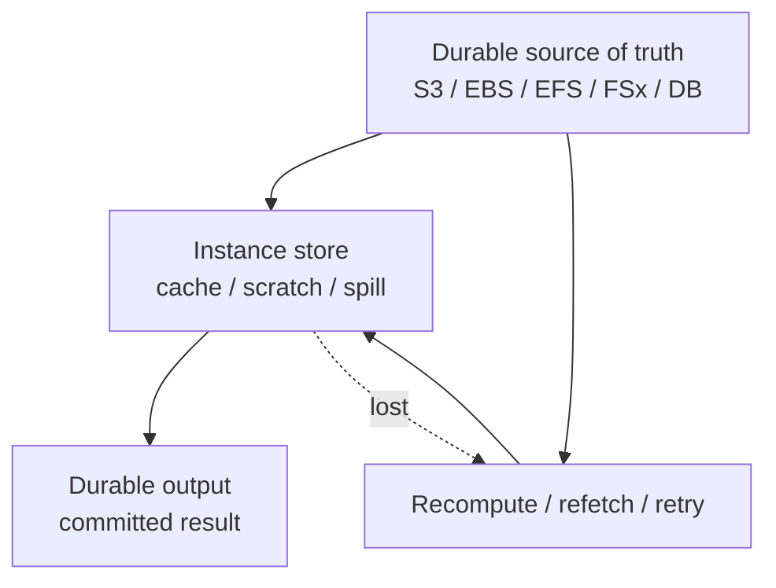
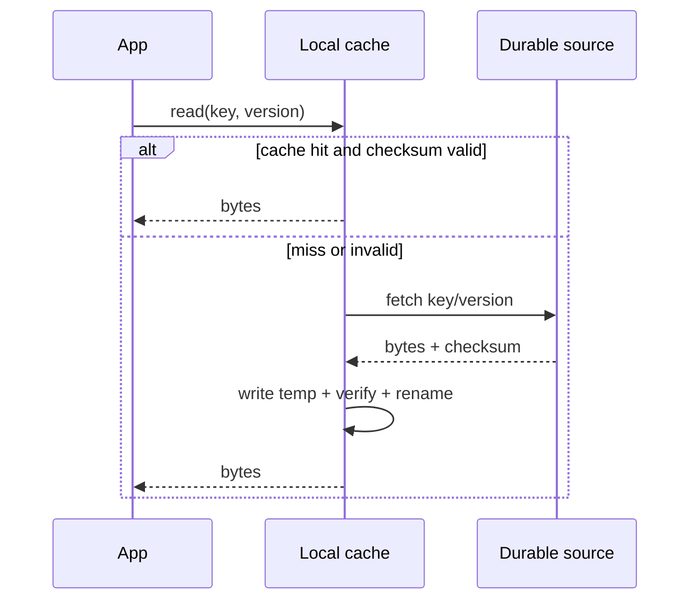
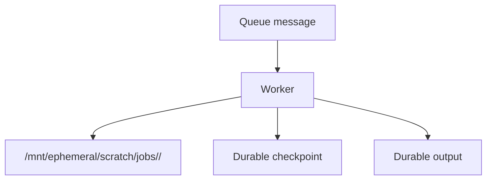
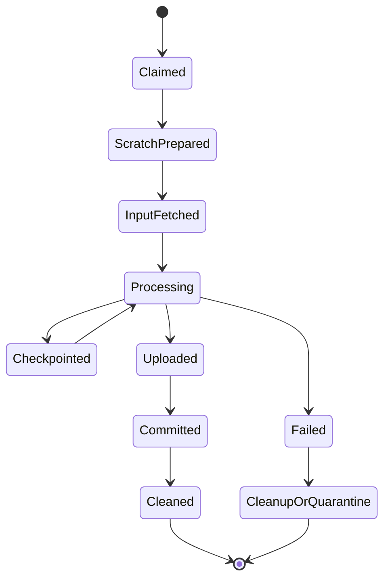
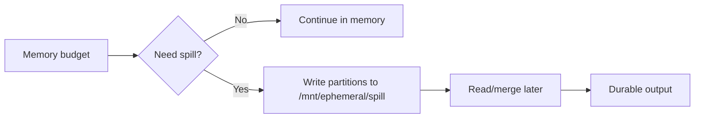
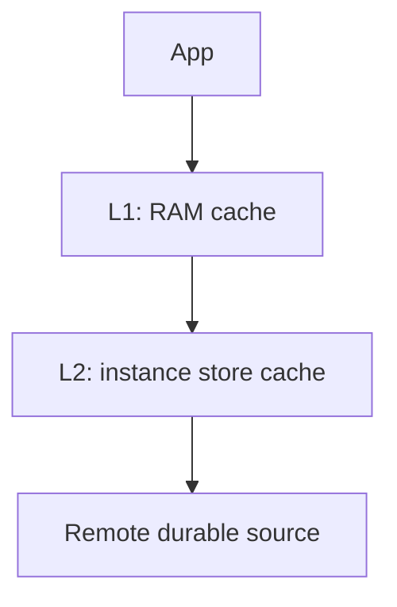
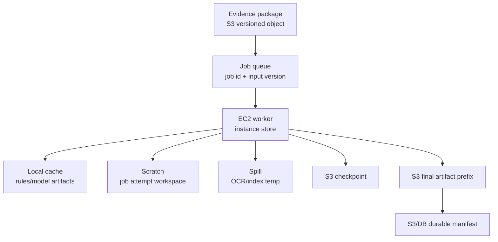

## 1. Problem yang Diselesaikan

Setelah memahami instance store sebagai ephemeral disk, pertanyaan berikutnya adalah:

> Bagaimana cara menggunakannya untuk mempercepat sistem tanpa mengorbankan correctness?

Instance store biasanya dipakai dalam tiga pattern:

1. **Local cache**  
   Menyimpan data yang bisa di-fetch ulang dari source of truth.

2. **Scratch space**  
   Working directory untuk job sementara.

3. **Spill space**  
   Tempat membuang intermediate data ketika RAM tidak cukup.

Ketiganya terlihat mirip karena sama-sama memakai local disk. Tetapi kontraknya berbeda.

| Pattern | Primary goal | Data source | Loss impact | Common bug |
|---|---|---|---|---|
| Cache | reduce repeated remote read | durable upstream | slower until warm | stale/corrupt cache |
| Scratch | isolate job working files | job input/checkpoint | job retry needed | partial output treated final |
| Spill | extend memory temporarily | in-memory execution plan | query/job restart | node disk full |

Jika tiga pattern ini dicampur, instance store berubah menjadi hidden database. Hidden database adalah state yang tidak diakui, tidak di-backup, tidak dimonitor, tetapi menentukan correctness.

---

## 2. Mental Model

Temporary storage yang aman punya satu invariant:

> Semua bytes di local disk harus punya parent durable object, deterministic recomputation path, atau replica quorum.



Local disk boleh hilang. Sistem harus punya jawaban otomatis:

- dari mana data dibuat ulang?
- job mana yang perlu diulang?
- output mana yang sudah committed?
- partial file mana yang harus dibuang?
- upstream load apa yang terjadi saat warmup?
- berapa lama recovery yang masih diterima?

---

## 3. Core Concepts

### 3.1 Source of Truth vs Derived Bytes

Klasifikasi setiap file:

| Class | Meaning | Allowed on instance store? |
|---|---|---:|
| Source of truth | data asli yang tidak bisa hilang | No |
| Durable checkpoint | restart point yang menghindari ulang dari nol | No, except local copy |
| Derived cache | bisa dibuat dari source durable | Yes |
| Intermediate scratch | hanya valid selama job | Yes |
| Spill | artifact internal execution | Yes |
| Final output | hasil yang dianggap selesai | No, except before durable commit |
| Log/audit | evidence/debug/compliance record | No as only copy |

Rule:

```text
If losing this file changes business truth, it does not belong only on instance store.
```

### 3.2 Commit Boundary

Temporary storage aman jika ada commit boundary.

Bad:

```text
write result.json locally
later upload result.json
mark job complete in database
```

Race:

- upload gagal;
- job complete sudah tercatat;
- instance mati;
- output hilang.

Better:

```text
write local temp
upload to durable temp key
verify checksum
write durable manifest / final marker
ack job complete
cleanup local temp
```

Object-storage style commit:

```text
s3://bucket/jobs/<job-id>/attempts/<attempt-id>/part-0001.tmp
s3://bucket/jobs/<job-id>/manifest.json
```

Manifest adalah durable commit boundary.

### 3.3 Idempotency Key

Temporary processing harus idempotent.

Gunakan:

- stable job ID;
- attempt ID;
- input version;
- output version;
- content checksum;
- deterministic target path;
- final marker.

Contoh:

```json
{
  "jobId": "case-doc-2026-07-06-00091",
  "attemptId": "i-0123456789abcdef0:1742",
  "input": {
    "bucket": "raw-docs",
    "key": "cases/2026/00091/bundle.zip",
    "versionId": "3HL4kqtJlcpXroDTDmJ"
  },
  "outputPrefix": "processed/cases/2026/00091/",
  "checkpointPrefix": "checkpoints/cases/2026/00091/"
}
```

### 3.4 Atomic Local Write

Never write final-looking local file directly.

Bad:

```bash
my-job > /mnt/ephemeral/output/result.json
```

Better:

```bash
tmp="/mnt/ephemeral/output/result.json.tmp.$$"
final="/mnt/ephemeral/output/result.json"

my-job > "$tmp"
sync "$tmp"
mv "$tmp" "$final"
```

Then upload with checksum validation.

### 3.5 Bound Every Temporary Directory

Unbounded temp directories become production incidents.

Every local directory needs:

- owner;
- max size;
- cleanup policy;
- file naming convention;
- TTL;
- observability;
- admission control.

Example:

```text
/mnt/ephemeral
  /cache
    /datasets
    /artifacts
  /scratch
    /jobs
  /spill
    /queries
  /quarantine
```

Do not let every library use `/tmp` freely.

---

## 4. Pattern A — Local Read-Through Cache

### 4.1 Use Case

A service repeatedly reads large reference files from S3/FSx/EFS. Remote reads are correct but expensive or slow. Local cache reduces repeated latency.



### 4.2 Cache Key Design

Cache key must identify content, not just name.

Bad:

```text
/mnt/ephemeral/cache/customer-rules.json
```

Better:

```text
/mnt/ephemeral/cache/customer-rules/version=2026-07-06/sha256=<hash>/rules.json
```

Or content-addressed:

```text
/mnt/ephemeral/cache/blobs/sha256/ab/cd/<hash>
```

### 4.3 Cache Validation

Validation choices:

| Method | Use when |
|---|---|
| ETag/checksum | object source provides stable checksum |
| version ID | S3 versioning enabled |
| manifest hash | dataset has manifest |
| TTL | weak consistency acceptable |
| application schema version | file format changes matter |

For correctness-sensitive systems, prefer version/checksum over TTL.

### 4.4 Cache Miss Storm

When a fleet replaces many nodes, all caches are cold.

Failure:

```text
ASG replaces 200 nodes.
Each node downloads same 20 GB dataset.
S3/network/downstream throttling increases.
App latency spikes.
```

Mitigations:

- stagger rollout;
- warm pool;
- prewarm cache;
- shared regional cache layer if justified;
- per-node rate limit;
- local admission control;
- use manifest and only fetch required shards;
- avoid synchronized cron warmup.

### 4.5 Cache Eviction

Eviction must preserve correctness.

Options:

- LRU;
- size-based;
- TTL;
- version-based cleanup;
- protected hot set;
- delete incomplete temp files first.

Example cleanup policy:

```bash
# delete temp files older than 6 hours
find /mnt/ephemeral/cache -name "*.tmp" -mmin +360 -delete

# delete old version directories except current manifest versions
```

Avoid blind `rm -rf /mnt/ephemeral/cache/*` during live operation unless app can tolerate all misses.

---

## 5. Pattern B — Scratch Directory per Job

### 5.1 Use Case

A worker processes one job at a time or multiple isolated jobs. Each job needs working files.



### 5.2 Directory Contract

Good structure:

```text
/mnt/ephemeral/scratch/jobs/
  <job-id>/
    <attempt-id>/
      input/
      work/
      output/
      logs-local/
      status.json
```

`attempt-id` prevents two retries from corrupting each other.

### 5.3 Job Lifecycle



### 5.4 Attempt Isolation

Never write output directly to the final durable path from multiple attempts.

Bad:

```text
s3://outputs/case-123/result.json
```

Better:

```text
s3://outputs/case-123/attempts/<attempt-id>/result.json
s3://outputs/case-123/manifest.json
```

Only one attempt writes/updates the durable manifest. Manifest update requires idempotency or conditional write semantics at the application layer.

### 5.5 Cleanup

Cleanup must happen in two paths:

1. normal success cleanup;
2. startup cleanup for abandoned attempts.

Startup cleanup example:

```bash
find /mnt/ephemeral/scratch/jobs -mindepth 2 -maxdepth 2 -type d -mtime +1 -print
```

Do not cleanup active job directories. Active detection should use:

- lock file with process ID;
- heartbeat file;
- worker registry;
- job lease;
- mtime with safety margin;
- queue visibility timeout.

### 5.6 Failure Behavior

If instance dies:

- local scratch disappears;
- queue visibility timeout expires;
- job retries elsewhere;
- worker resumes from durable checkpoint or restarts;
- abandoned durable attempt output is ignored unless committed by manifest.

If process crashes but instance survives:

- local scratch remains;
- startup cleanup/quarantine decides whether to reuse or discard;
- never assume partial local state is valid without status/checksum.

---

## 6. Pattern C — Spill Space

### 6.1 Use Case

A process needs more intermediate storage than RAM:

- sort;
- hash join;
- aggregation;
- compression;
- parquet generation;
- ML feature generation;
- graph processing;
- search indexing;
- compiler/build workload.



### 6.2 Spill Is Not Scratch

Scratch is job workspace. Spill is execution engine internals.

Spill needs stricter controls:

- bounded bytes;
- predictable cleanup;
- backpressure before disk full;
- per-query/per-job accounting;
- abort threshold;
- global reserve.

### 6.3 Spill Budget

Example budget:

```yaml
node:
  ephemeral_bytes: 1800GiB
  reserved_for_os_and_logs: 50GiB
  reserved_for_cache: 300GiB
  reserved_for_scratch: 800GiB
  reserved_for_spill: 600GiB
  emergency_free_space: 50GiB
```

Admission control:

```text
if estimated_spill_bytes > available_spill_budget:
    reject_or_queue_job()
```

### 6.4 Avoid Root Disk Fallback

Many libraries fallback to `/tmp`.

Set explicit environment:

```bash
export TMPDIR=/mnt/ephemeral/spill/tmp
export JAVA_IO_TMPDIR=/mnt/ephemeral/spill/java
```

For JVM:

```bash
java \
  -Djava.io.tmpdir=/mnt/ephemeral/spill/java \
  -jar app.jar
```

For containers on EC2, ensure container writable layer does not become accidental spill target. Use explicit bind mount or volume.

---

## 7. Pattern D — Two-Level Cache

Sometimes one cache is not enough.



Contract:

- RAM cache is fastest and smallest;
- instance store cache is larger and survives process restart/reboot;
- remote source is durable;
- versioning invalidates both L1 and L2;
- eviction at L1 must not delete L2;
- eviction at L2 must not affect correctness.

Useful for:

- reference datasets;
- ML model artifacts;
- search dictionaries;
- geospatial files;
- rule bundles;
- compiled templates;
- package/dependency cache.

Risk:

- stale dataset after deployment;
- inconsistent node behavior;
- warmup storm;
- cache grows without bound.

---

## 8. Pattern E — Prewarming

Prewarming is useful when cold cache creates unacceptable latency.

### 8.1 Startup Prewarm

```text
instance boot
mount instance store
download critical manifest
download hot shard set
verify checksums
mark node ready
```

Do not register node into load balancer before critical prewarm completes if the app requires warm data to meet SLO.

### 8.2 Lazy Prewarm

Node starts serving immediately, fetches on demand.

Good when:

- cache miss latency acceptable;
- remote source can absorb load;
- request distribution is broad;
- early users tolerate slower responses.

### 8.3 Background Prewarm

Node serves degraded while background task warms cache.

Good when:

- top N hot objects known;
- traffic should not wait for full warmup;
- app can prioritize foreground reads.

### 8.4 Prewarm Failure

Prewarm should fail explicitly.

Bad:

```text
prewarm fails
node still marked healthy
first requests fail
```

Better:

- required dataset failure = node unhealthy;
- optional dataset failure = degraded metric;
- alarm on prewarm duration/failure;
- rate limit downloads;
- retry with jitter.

---

## 9. Observability

Temporary storage needs first-class observability.

### 9.1 Metrics

Emit:

- disk used percent;
- inode used percent;
- cache hit/miss;
- cache bytes;
- cache validation failure;
- scratch bytes per job;
- active scratch jobs;
- spill bytes;
- spill wait time;
- local disk read/write latency;
- cleanup success/failure;
- prewarm duration;
- retry due to local storage loss;
- durable checkpoint age;
- time since last successful upload.

### 9.2 Logs

Structured events:

```json
{
  "event": "cache_fetch",
  "cacheKey": "dataset:v42:sha256:abc",
  "source": "s3://bucket/datasets/v42/object",
  "bytes": 104857600,
  "durationMs": 1820,
  "checksumValid": true
}
```

```json
{
  "event": "scratch_cleanup",
  "jobId": "job-123",
  "attemptId": "i-abc:42",
  "bytesDeleted": 4294967296,
  "reason": "success"
}
```

```json
{
  "event": "spill_limit_reached",
  "queryId": "q-999",
  "spillBytes": 644245094400,
  "limitBytes": 536870912000,
  "action": "abort"
}
```

### 9.3 Alarms

Minimum alarms:

| Alarm | Why |
|---|---|
| ephemeral disk > 80% | avoid sudden write failure |
| inode > 80% | many small temp files |
| cache validation failures | stale/corrupt local data |
| prewarm failures | cold fleet risk |
| scratch cleanup failures | disk leak |
| spill limit reached too often | memory/sizing problem |
| root disk temp growth | accidental fallback |

---

## 10. Implementation Skeleton: Worker with Scratch and Checkpoint

Pseudo code:

```java
public final class EphemeralJobWorker {
    private final DurableStore durable;
    private final JobQueue queue;
    private final Path scratchRoot = Path.of("/mnt/ephemeral/scratch/jobs");

    public void runOne() {
        Job job = queue.claim();
        String attemptId = currentInstanceId() + ":" + System.currentTimeMillis();

        Path attemptDir = scratchRoot.resolve(job.id()).resolve(attemptId);
        Path inputDir = attemptDir.resolve("input");
        Path workDir = attemptDir.resolve("work");
        Path outputDir = attemptDir.resolve("output");

        createDirectories(inputDir, workDir, outputDir);

        try {
            durable.fetchInput(job.inputRef(), inputDir);

            Processor processor = new Processor(workDir);
            processor.onCheckpoint(cp -> durable.writeCheckpoint(job.id(), attemptId, cp));

            Path localResult = processor.process(inputDir, outputDir);

            String checksum = sha256(localResult);
            DurableRef uploaded = durable.uploadAttemptOutput(job.id(), attemptId, localResult, checksum);

            durable.commitManifest(job.id(), uploaded, checksum);
            queue.ack(job);

            cleanup(attemptDir);
        } catch (RetryableException e) {
            queue.release(job);
            quarantine(attemptDir, e);
        } catch (Exception e) {
            queue.fail(job, e);
            quarantine(attemptDir, e);
        }
    }
}
```

Important design details:

- `attemptId` isolates retry;
- checkpoint goes durable;
- final output goes durable before ack;
- manifest is the commit;
- cleanup is after ack/commit;
- partial local result is never the source of truth.

---

## 11. Implementation Skeleton: Read-Through Cache

Pseudo code:

```java
public final class LocalObjectCache {
    private final DurableObjectStore source;
    private final Path cacheRoot = Path.of("/mnt/ephemeral/cache/blobs");

    public Path get(ObjectRef ref) {
        String cacheKey = ref.sha256();
        Path finalPath = cacheRoot.resolve(cacheKey.substring(0, 2)).resolve(cacheKey);
        Path tmpPath = finalPath.resolveSibling(finalPath.getFileName() + ".tmp." + ProcessHandle.current().pid());

        if (Files.exists(finalPath) && checksumValid(finalPath, ref.sha256())) {
            return finalPath;
        }

        Files.createDirectories(finalPath.getParent());

        source.download(ref, tmpPath);

        if (!checksumValid(tmpPath, ref.sha256())) {
            deleteQuietly(tmpPath);
            throw new IllegalStateException("Downloaded object checksum mismatch: " + ref);
        }

        atomicMove(tmpPath, finalPath);
        return finalPath;
    }
}
```

Properties:

- content-addressed;
- validates checksum;
- temp file then atomic rename;
- partial downloads not mistaken as valid;
- cache loss only causes re-download.

---

## 12. Operational Runbook

### 12.1 Disk Pressure

1. Check usage:

```bash
df -h /mnt/ephemeral
df -i /mnt/ephemeral
sudo du -xh /mnt/ephemeral | sort -h | tail -50
```

2. Identify category:

```bash
du -xh /mnt/ephemeral/cache /mnt/ephemeral/scratch /mnt/ephemeral/spill
```

3. Determine action:

| Category | Safe action |
|---|---|
| cache | evict old/unreferenced versions |
| scratch active job | pause admission, let jobs finish, kill if needed |
| scratch abandoned | quarantine/delete based on lease |
| spill | abort offending query/job |
| unknown | quarantine, inspect, then define owner |

4. Prevent recurrence:

- add quota;
- fix cleanup;
- fix fallback path;
- adjust job sizing;
- adjust instance type.

### 12.2 Cache Corruption

1. Identify affected cache key.
2. Validate checksum.
3. Delete corrupted entry.
4. Refetch from durable source.
5. Check whether corruption came from partial write, concurrent writer, bad versioning, or source mismatch.
6. Add atomic rename/checksum if missing.

### 12.3 Warmup Storm

1. Detect fleet-wide cache miss spike.
2. Rate limit prewarm/download.
3. Temporarily increase upstream capacity if possible.
4. Stagger ASG instance refresh.
5. Use warm pool or rolling update size limit.
6. Add jitter to prewarm.
7. Consider shared cache or data layout improvement.

### 12.4 Job Lost Due to Instance Termination

1. Verify queue visibility timeout or job lease reissued.
2. Check last durable checkpoint.
3. Confirm final manifest not committed incorrectly.
4. Retry from checkpoint.
5. Inspect whether checkpoint interval is too long.
6. Improve graceful termination signal handling.

---

## 13. Failure Modes

### 13.1 Partial File Becomes Cache Hit

Cause:

- process dies during download;
- file path already final;
- next process sees file exists.

Prevention:

- write `.tmp`;
- validate checksum;
- atomic rename;
- include expected size/hash.

### 13.2 Multiple Attempts Overwrite Each Other

Cause:

- retry uses same output path;
- old attempt finishes after new attempt.

Prevention:

- attempt-specific paths;
- durable manifest commit;
- conditional commit;
- idempotency key.

### 13.3 Spill Fills Entire Node

Cause:

- execution engine spills without limit;
- multiple jobs share same disk;
- no admission control.

Prevention:

- per-job spill budget;
- global reserve;
- kill before full;
- queue when insufficient disk.

### 13.4 Cache Stale After Deployment

Cause:

- cache key ignores application/data version.

Prevention:

- include dataset version;
- include schema version;
- include checksum;
- delete incompatible versions on startup.

### 13.5 Cleanup Deletes Active Files

Cause:

- cleanup based only on age.

Prevention:

- job lease;
- heartbeat;
- lock file;
- active process check;
- conservative TTL;
- quarantine before delete.

### 13.6 Prewarm Blocks Fleet Recovery

Cause:

- node requires full dataset before healthy;
- dataset huge;
- upstream throttles;
- ASG cannot reach desired healthy capacity.

Prevention:

- classify required vs optional warm data;
- prewarm minimal critical set;
- lazy-load the rest;
- use warm pool;
- cap rollout batch size.

---

## 14. Performance and Cost Reasoning

### 14.1 Cache ROI

Cache is worth it when:

```text
remote_read_cost + remote_read_latency + remote_load_risk
>
local_storage_complexity + warmup_cost + stale_data_risk
```

Measure:

- request volume;
- object size;
- reuse frequency;
- miss penalty;
- invalidation frequency;
- warmup cost;
- node churn rate.

High churn can erase cache benefit. A fleet that replaces nodes frequently may spend most of its time warming cache.

### 14.2 Scratch ROI

Scratch is worth it when:

- intermediate bytes are large;
- durable write for every intermediate is wasteful;
- job retry is acceptable;
- checkpoint interval bounds lost work;
- final output is durable.

Scratch is not worth it when:

- intermediate state is business-significant;
- job cannot retry;
- checkpointing is absent;
- one failure loses hours/days of work beyond RTO.

### 14.3 Spill ROI

Spill is worth it when:

- memory-only execution would require much larger instance;
- local disk spill keeps job within cost target;
- latency penalty acceptable;
- failure/retry semantics exist.

Spill becomes dangerous when:

- it hides memory leak;
- it enables unbounded queries;
- it fills node and harms unrelated workloads;
- it creates unpredictable tail latency.

---

## 15. Case Study: Large Regulatory Evidence Processing

### Context

A regulatory case platform processes uploaded evidence packages:

- raw evidence package in S3;
- metadata stored in database;
- OCR/extraction workers on EC2;
- each package can produce millions of temporary files;
- final normalized artifacts must be retained;
- intermediate page images can be recreated.

### Bad Approach

```text
Worker writes everything to /tmp.
Final output is copied later by cron.
Cache uses filename only.
No checkpoint.
No cleanup until disk full.
```

Failure:

- `/tmp` fills root disk;
- instance dies mid-job;
- partial output is treated as complete;
- retry duplicates results;
- old cache reads wrong version of rules;
- incident response requires SSH.

### Production Approach



Key contracts:

- raw evidence source is S3 version ID;
- rule/model cache key includes model version and checksum;
- scratch path includes job ID and attempt ID;
- page-level checkpoint written every N pages;
- final artifacts uploaded under attempt path;
- manifest commit is the only "done" marker;
- queue ack happens after manifest commit;
- startup cleanup quarantines abandoned attempt directories;
- local disk pressure pauses new job admission.

Result:

- instance loss only loses bounded work;
- cache loss slows node but does not corrupt output;
- duplicate attempts do not overwrite final state;
- cleanup is safe;
- operational behavior is visible.

---

## 16. Checklist

For local cache:

- [ ] Cache key includes version/checksum.
- [ ] Partial downloads use temp path.
- [ ] Checksum/size validation exists.
- [ ] Atomic rename used.
- [ ] Eviction policy exists.
- [ ] Cache miss storm has mitigation.
- [ ] Cache hit/miss metrics emitted.
- [ ] Cache is not source of truth.

For scratch:

- [ ] Directory includes job ID and attempt ID.
- [ ] Durable checkpoint exists if job is long-running.
- [ ] Final output is uploaded before job ack.
- [ ] Durable manifest/commit boundary exists.
- [ ] Startup cleanup handles abandoned attempts.
- [ ] Active job directories are protected.
- [ ] Local logs are shipped externally.
- [ ] Retry is idempotent.

For spill:

- [ ] Explicit spill path configured.
- [ ] Root disk fallback disabled.
- [ ] Per-job spill budget exists.
- [ ] Global free-space reserve exists.
- [ ] Admission control considers disk.
- [ ] Spill pressure metrics emitted.
- [ ] Job abort behavior is safe.
- [ ] Cleanup on crash exists.

---

## 17. Summary

Instance store becomes production-grade only when temporary data has explicit semantics.

Use this classification:

```text
cache   = can refetch
scratch = can retry
spill   = can recompute
final   = must commit durably
audit   = must never be local-only
```

The practical goal is not merely "use fast local disk." The goal is to use local disk as an accelerator while keeping system truth in durable, observable, recoverable places.

The next part goes deeper into the trade-off between **compute locality and durability**: when local data is acceptable, when replication makes it safe, and when locality silently creates architectural debt.

---

## References

- AWS EC2 User Guide — Instance store temporary block storage for EC2 instances: https://docs.aws.amazon.com/AWSEC2/latest/UserGuide/InstanceStorage.html
- AWS EC2 User Guide — Data persistence for instance store volumes: https://docs.aws.amazon.com/AWSEC2/latest/UserGuide/instance-store-lifetime.html
- AWS EC2 User Guide — SSD instance store volumes: https://docs.aws.amazon.com/AWSEC2/latest/UserGuide/ssd-instance-store.html
- AWS EC2 User Guide — Detailed performance statistics for NVMe instance store: https://docs.aws.amazon.com/AWSEC2/latest/UserGuide/nvme-detailed-performance-stats.html
- AWS EC2 User Guide — Storage optimized instances: https://docs.aws.amazon.com/ec2/latest/instancetypes/so.html
- AWS Well-Architected Framework — Reliability Pillar: https://docs.aws.amazon.com/wellarchitected/latest/reliability-pillar/welcome.html
