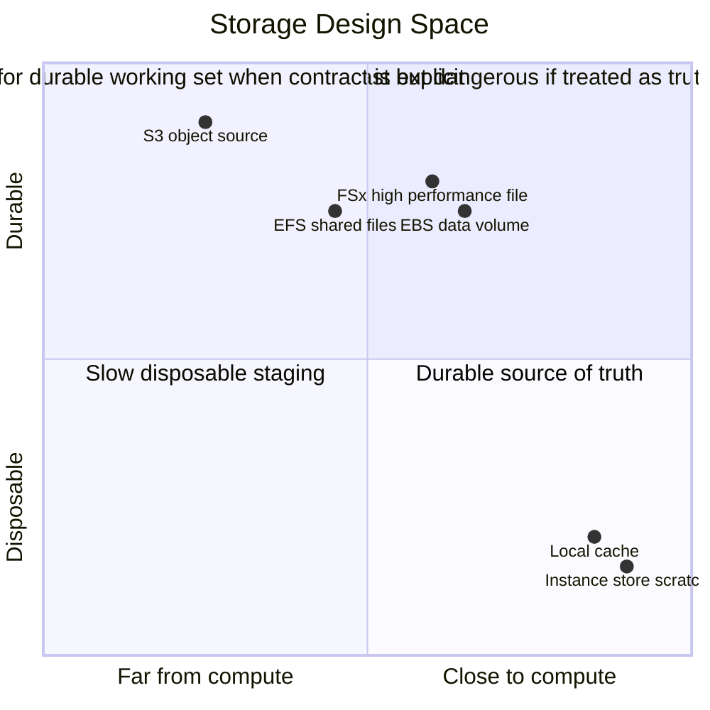
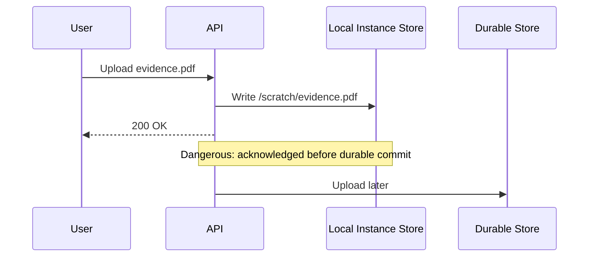
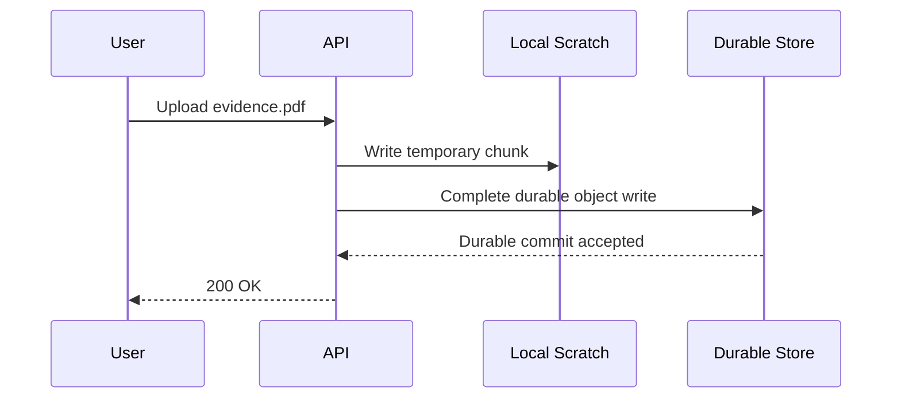
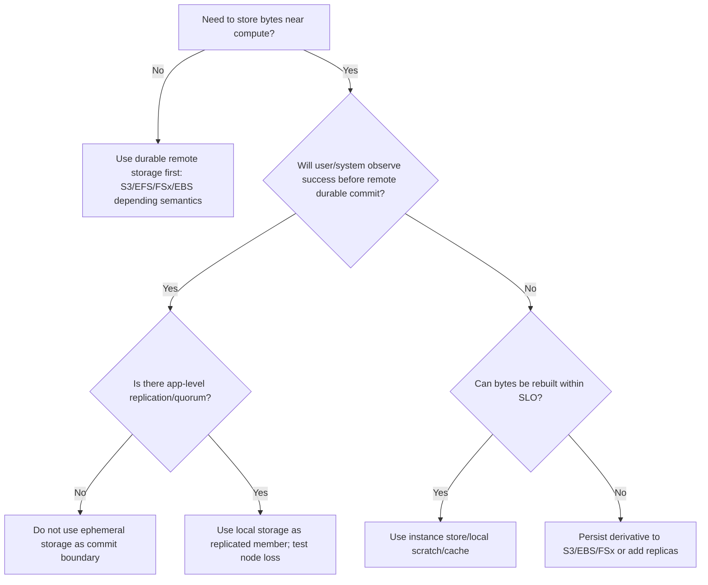
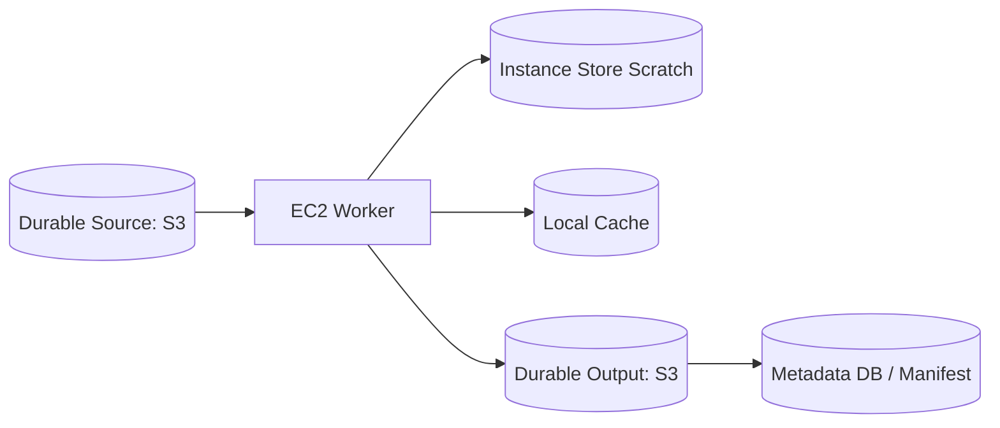
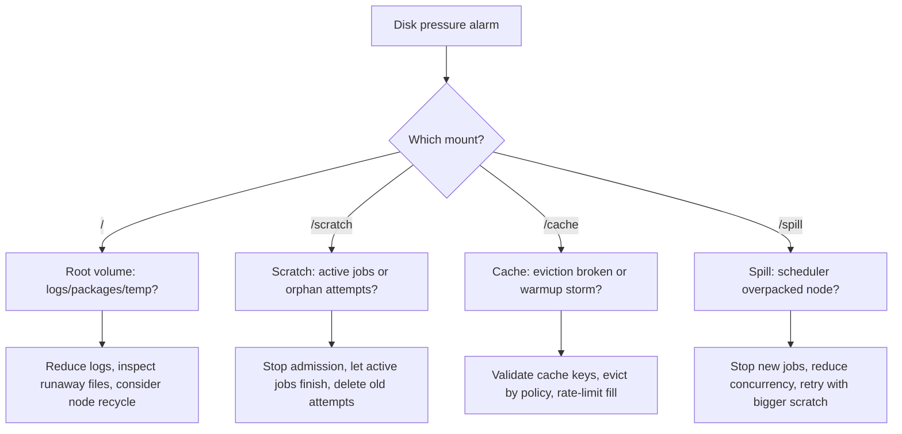

# Part 039 — Compute Locality vs Durability

Local disk feels simple because it is near the process.

That is exactly why it is dangerous.

When a workload uses local storage, it is making a trade:

> I want low latency, high throughput, and low network dependency now, and I accept that this data may disappear with the compute node.

This is not wrong. Some of the highest-performance production systems depend heavily on local storage. Search engines, stream processors, compilers, media processors, ML preprocessors, batch workers, and distributed databases all use local disk. The difference between a safe design and a fragile design is not whether local disk is used. The difference is whether the system can explain which bytes are durable, which bytes are derived, and which bytes are disposable.

AWS EC2 instance store makes this boundary explicit. Instance store provides temporary block-level storage physically attached to the host computer. It is a good fit for buffers, caches, scratch data, and temporary replicated data. Its data persists across instance reboot, but it does not persist when an instance is stopped, hibernated, or terminated. On those events, every block is cryptographically erased. Instance store also cannot be detached from one instance and attached to another.

That contract is not a footnote. It is the design center.

---

## 1. Problem yang Diselesaikan

Part ini menjawab pertanyaan praktis:

- Kapan local disk/instance store aman dipakai?
- Kapan local disk menjadi hidden source of truth?
- Bagaimana membedakan cache, scratch, spill, checkpoint, replica, dan durable data?
- Bagaimana mendesain workload agar locality memberi performance tanpa menghancurkan recovery?
- Bagaimana menulis invariant produksi untuk storage yang bisa hilang?
- Bagaimana memilih antara instance store, EBS, S3, EFS, FSx, dan replicated application-level storage?

Kita tidak akan membahas ulang EBS, S3, EFS, atau FSx secara lengkap. Di sini mereka muncul sebagai pembanding kontrak.

---

## 2. Mental Model

### 2.1 Locality adalah jarak; durability adalah janji

Storage punya dua sumbu besar:



Locality menjawab:

- Seberapa dekat byte dengan CPU?
- Apakah akses butuh network hop?
- Apakah throughput naik jika data berada di host yang sama?
- Apakah workload sensitif terhadap latency tail?
- Apakah data movement lebih mahal daripada compute?

Durability menjawab:

- Apakah byte tetap ada saat process crash?
- Apakah byte tetap ada saat OS reboot?
- Apakah byte tetap ada saat instance stop/terminate?
- Apakah byte tetap ada saat AZ hilang?
- Apakah ada copy lain yang bisa dipercaya?
- Apakah recovery path sudah diuji?

Local storage sering unggul di locality, tetapi kontraknya lemah di durability. Durable storage sering unggul di survival, tetapi punya latency, throughput, cost, dan coupling berbeda.

### 2.2 Ada empat jenis byte

Jangan klasifikasikan storage berdasarkan nama layanan dulu. Klasifikasikan byte.

| Jenis byte | Boleh hilang? | Contoh | Storage yang cocok |
|---|---:|---|---|
| Source of truth | Tidak | order, case record, ledger, canonical document | S3, database, replicated storage, EBS dengan backup jelas |
| Durable derivative | Bisa dibuat ulang, tapi mahal | index, compacted segment, model artifact, processed file | S3, EBS snapshot, FSx, replicated store |
| Local derivative | Bisa dibuat ulang dan murah/sedang | cache, decoded file, extracted archive, build output | instance store, ephemeral volume |
| Disposable working data | Ya | temp chunk, spill, partial upload, local sort run | instance store, `/tmp`, scratch mount |

The invariant:

> Local disk may contain only local derivatives and disposable working data unless an application-level replication protocol protects the data.

### 2.3 Local data is not state unless someone depends on it

A file becomes state when something outside the local process depends on its continued existence.

Examples:

- A video transcoder writes `/scratch/output.mp4` and has not uploaded it to S3 yet.
  - This is not durable.
  - If the node dies, the job must restart or resume.
- A search node stores shard segment files on local NVMe.
  - This can be safe only if the cluster has replica shards and rebalancing.
- A web app writes uploaded files to `/var/uploads`.
  - This is dangerous unless another process durably copies them before acknowledging the user.
- A compiler cache writes artifacts to local SSD.
  - This is usually safe because cache miss only costs time.

---

## 3. Core Concepts

### 3.1 The acknowledgement boundary

Most durability bugs are acknowledgement bugs.

The user thinks the system has accepted something. The system has only written it locally.



Safe version:



Rule:

> Never acknowledge business success based only on ephemeral local write.

There are exceptions, but they require a different durable contract: replication quorum, WAL shipping, or external journal.

### 3.2 The rebuild boundary

A local file is safe if the system can answer:

- What durable input can recreate it?
- What version of code/config recreates it?
- What idempotency key prevents duplicate output?
- What is the maximum rebuild time?
- Who triggers rebuild?
- How is partial local output detected and removed?

If those answers are vague, local disk is not a cache. It is undeclared state.

### 3.3 The replica boundary

Local storage can hold important data if the application-level system replicates it.

Examples:

- Kafka broker storage on local disk with replication factor and ISR discipline.
- Search shard copies on local disk with primary/replica placement.
- Distributed database using consensus/replication.
- HDFS-like data nodes with block replicas.
- Build cache cluster where missing node only reduces hit rate.

But this does not make instance store durable. It means the *system* is durable because the same data exists elsewhere according to a protocol.

The local disk is still disposable at the node level.

### 3.4 The recovery-time boundary

Some data is technically reconstructable but operationally expensive.

Example:

- An analytics index can be rebuilt from S3 in 18 hours.
- Losing all local indexes during an AZ replacement may violate SLO.
- Therefore the index is not truly disposable from a service-level perspective.

So classify data using two questions:

```text
Can it be rebuilt?
Can it be rebuilt fast enough?
```

A rebuildable object with unacceptable rebuild time needs durable derivative treatment.

---

## 4. Decision Matrix

### 4.1 Storage choice by data role

| Data role | Local instance store | EBS | S3 | EFS/FSx |
|---|---:|---:|---:|---:|
| Process temp file | Excellent | Good | Poor | Usually poor |
| Sort/shuffle spill | Excellent | Good | Poor/direct only for some frameworks | Workload dependent |
| Cache | Excellent | Good | Source backing | Shared cache sometimes |
| Durable upload before ACK | Unsafe alone | Possible with backup/replication | Excellent | Possible |
| DB primary data | Usually unsafe alone unless replicated | Common | Not block DB storage | Workload dependent |
| Search index replica | Good if replicated | Good | Durable source/snapshot | FSx for specific cases |
| ML preprocessing scratch | Excellent | Good | Dataset source/output | FSx Lustre for high throughput |
| Build artifacts | Cache only | Good | Durable artifact store | Sometimes |
| Compliance record | No | With backup/controls | Strong candidate | Sometimes |

### 4.2 Decision tree



### 4.3 The three acceptable uses of ephemeral local storage

#### Pattern A — Pure scratch

Local bytes are used inside one attempt.

```text
input:  s3://bucket/raw/job-123/*
local:  /scratch/job-123/*
output: s3://bucket/processed/job-123/
```

If the node dies, the job attempt is abandoned and retried elsewhere.

Requirements:

- Job ID and attempt ID are explicit.
- Output commit is atomic or idempotent.
- Partial local files are not reused across attempts.
- Durable output is written before success is recorded.

#### Pattern B — Cache of durable source

Local bytes are a performance optimization.

```text
source: s3://models/model-v17.tar
cache:  /cache/models/sha256/<digest>
```

Requirements:

- Cache key includes content hash/version.
- Cache entries are immutable once complete.
- Partial entries use `.tmp` then atomic rename.
- Cache miss is acceptable.
- Cache poisoning is detectable.

#### Pattern C — Replica managed by distributed protocol

Local bytes are part of a replicated cluster.

```text
shard A primary: node-1
shard A replica: node-5
shard A source snapshot: s3://snapshots/search/shard-a/
```

Requirements:

- Replication factor > failure domain.
- Node loss is a normal event.
- Rebalancing is automatic or runbooked.
- Recovery load is capacity-planned.
- Split-brain prevention exists.

---

## 5. Production Design

### 5.1 Durable source + local derivative

This is the safest high-performance pattern.



Design details:

1. Source is immutable or versioned.
2. Worker downloads/stages input to local disk.
3. Worker computes output locally.
4. Worker uploads output to durable storage.
5. Worker writes manifest/metadata only after durable output exists.
6. Cleanup removes local working files.

This pattern works for:

- transcoding
- document processing
- evidence normalization
- ETL transforms
- scientific simulation
- build pipelines
- ML feature extraction
- archive extraction

### 5.2 Local cache with immutable key

Cache correctness depends on key design.

Bad cache key:

```text
/cache/customer-config.json
```

Better:

```text
/cache/customer-config/customer-123/version-2026-07-06T10-15-00Z/sha256-b2af...
```

Best for content-addressed artifacts:

```text
/cache/blobs/sha256/b2/af/b2af31...
```

Invariant:

> A completed cache file is immutable. New content gets a new key.

This avoids half of cache poisoning bugs.

### 5.3 Atomic local write

Do not write directly to final path.

```bash
set -euo pipefail

target="/cache/blobs/sha256/$DIGEST"
tmp="${target}.tmp.${HOSTNAME}.$$"

mkdir -p "$(dirname "$target")"

if [ -f "$target" ]; then
  exit 0
fi

download_or_compute > "$tmp"

actual="$(sha256sum "$tmp" | awk '{print $1}')"
if [ "$actual" != "$DIGEST" ]; then
  rm -f "$tmp"
  echo "checksum mismatch" >&2
  exit 1
fi

chmod 0444 "$tmp"
mv "$tmp" "$target"
```

This gives:

- no reader sees partial content
- crash leaves `.tmp` file only
- cleanup can safely delete old `.tmp`
- checksum detects corruption/poisoning

### 5.4 Commit marker for durable output

When output goes to S3 or another durable store, do not let downstream consume partial output.

Common pattern:

```text
s3://bucket/jobs/job-123/attempt-2/part-0001.parquet
s3://bucket/jobs/job-123/attempt-2/part-0002.parquet
s3://bucket/jobs/job-123/attempt-2/_SUCCESS
```

Downstream reads only attempts with `_SUCCESS`.

For stricter correctness, use a manifest:

```json
{
  "jobId": "job-123",
  "attemptId": "attempt-2",
  "inputs": [
    "s3://raw/a",
    "s3://raw/b"
  ],
  "outputs": [
    {
      "uri": "s3://processed/job-123/part-0001.parquet",
      "sha256": "..."
    }
  ],
  "createdAt": "2026-07-06T03:00:00Z"
}
```

The manifest is the commit record.

### 5.5 Spill budget

Spill is not free. If the system spills to local disk, define budget.

```text
usable_scratch_bytes =
    total_scratch_bytes
  - reserved_for_os
  - reserved_for_logs
  - reserved_for_cache_floor
  - safety_margin
```

Then enforce:

```text
max_concurrent_jobs_per_node =
    floor(usable_scratch_bytes / worst_case_spill_per_job)
```

If this is not explicit, the scheduler can overpack the node and create self-inflicted disk pressure.

### 5.6 Locality-aware scheduling

Locality is useful only if scheduler decisions preserve it.

Examples:

- A worker with warm model cache should receive compatible jobs.
- A search shard should not be moved randomly.
- A build cache node should be reused by related builds.
- A batch job should not assume the same node on retry unless explicitly pinned.

But pinning reduces elasticity. Use locality as a preference, not a hard dependency, unless the application protocol can handle node loss.

---

## 6. Implementation Patterns

### 6.1 Mount layout

Use explicit mount points. Do not mix OS, logs, cache, and scratch blindly.

```text
/
  OS root, packages, system files

/var/log
  logs; bounded by logrotate/journald config

/cache
  reusable local derivatives

/scratch
  per-attempt disposable working data

/spill
  framework-managed spill area

/run
  runtime state; small, volatile
```

Example `/etc/fstab` idea:

```text
UUID=<instance-store-fs> /scratch xfs defaults,noatime,nofail 0 2
```

`nofail` is useful when boot should not fail if a non-critical local scratch mount is absent. But do not use `nofail` to hide a required data dependency.

### 6.2 Boot-time preparation

```bash
#!/usr/bin/env bash
set -euo pipefail

mountpoint -q /scratch || {
  device="$(lsblk -ndo NAME,TYPE | awk '$2=="disk" {print "/dev/"$1}' | tail -n 1)"
  if [ -n "${device:-}" ]; then
    mkfs.xfs -f "$device"
    mkdir -p /scratch
    mount "$device" /scratch
  fi
}

mkdir -p /scratch/jobs /cache/blobs /spill
chmod 1777 /scratch/jobs /spill
chmod 0755 /cache /cache/blobs
```

Production version should be stricter:

- identify NVMe instance store devices correctly
- avoid formatting the root volume
- tag/label filesystems
- emit boot metrics
- fail closed when required scratch is unavailable
- fail open only for optional cache

### 6.3 Per-attempt directory

```text
/scratch/jobs/<job-id>/<attempt-id>/
```

Never reuse:

```text
/scratch/jobs/<job-id>/
```

Why?

Retries need isolation. Attempt 2 must not consume partial files from attempt 1 unless a protocol explicitly validates them.

### 6.4 Idempotent durable output

Bad:

```text
s3://processed/customer-123/output.json
```

Better:

```text
s3://processed/customer-123/job-456/attempt-2/output.json
```

Then commit with a manifest:

```text
s3://processed/customer-123/job-456/manifest.json
```

Manifest update must be conditional where possible, or protected by an idempotency record in a database.

### 6.5 Local cache object format

A robust cache entry needs metadata.

```text
/cache/models/sha256-b2af31/
  data.tar
  metadata.json
  COMPLETE
```

Example `metadata.json`:

```json
{
  "digest": "sha256:b2af31...",
  "source": "s3://models/model-v17.tar",
  "createdAt": "2026-07-06T03:00:00Z",
  "builderVersion": "model-loader/3.2.1",
  "sizeBytes": 182736281
}
```

Readers require `COMPLETE`.

Writers use:

```text
/cache/models/.building/<uuid>/
```

Then atomic rename.

### 6.6 Cache eviction

Eviction should prefer correctness over cleverness.

Simple policy:

1. Never delete files opened by active process.
2. Delete `.tmp` older than one hour.
3. Delete completed cache entries by LRU when disk usage exceeds high watermark.
4. Stop accepting new work if disk usage remains high.
5. Recycle node if cleanup cannot recover.

Watermarks:

```text
low watermark:  65%
high watermark: 80%
critical:       90%
emergency:      95%
```

Why not wait until 99%?

Because many filesystems and applications fail poorly near full disk. Logs cannot write, temp files fail, package updates fail, and health checks may lie until the node collapses.

---

## 7. Failure Modes

### 7.1 Hidden source of truth

Symptom:

- Node termination loses user-visible data.
- Retry cannot recreate output.
- Backup does not include local path.
- Operators discover important files under `/tmp`, `/scratch`, or `/var/lib/app`.

Root cause:

- Local write was treated as durable commit.
- No explicit data classification.
- No durable manifest or upload-before-ack invariant.

Fix:

- Move commit boundary to durable store.
- Add idempotency key.
- Make local path attempt-scoped.
- Add scan/alarm for unexpected persistent local directories.

### 7.2 Cache poisoning

Symptom:

- Some nodes serve wrong version.
- Restart fixes issue temporarily.
- Rolling deployment produces inconsistent behavior.
- Cache hit rate is high but correctness is low.

Root cause:

- Mutable cache key.
- Partial writes visible to readers.
- No checksum validation.
- Version/config omitted from key.

Fix:

- Content-addressed keys.
- Atomic write + rename.
- Checksum and metadata validation.
- Cache purge runbook.

### 7.3 Warm cache dependency

Symptom:

- New nodes are healthy but too slow.
- Scale-out increases error rate.
- AZ replacement creates thundering herd against S3/downstream.

Root cause:

- System assumes warm local cache.
- Cache fill is not capacity-planned.
- No prewarm or rate limit.

Fix:

- Treat cache warmup as part of readiness.
- Rate-limit cache fill.
- Use warm pools where appropriate.
- Add fallback capacity.
- Separate "process alive" from "ready for full traffic".

### 7.4 Rebuild storm

Symptom:

- One node loss triggers many nodes to rebuild data.
- S3 request rate, network, CPU, or downstream DB spikes.
- Recovery overloads the healthy fleet.

Root cause:

- Rebuild concurrency is unbounded.
- Local derivative rebuild not included in capacity model.
- No backoff/jitter.

Fix:

- Add rebuild tokens.
- Use queue-based repair.
- Apply per-node and global concurrency limits.
- Persist expensive derivatives if rebuild time violates SLO.

### 7.5 Spill collapse

Symptom:

- Jobs fail with `No space left on device`.
- Latency spikes before failure.
- Cleanup cannot keep up.
- Retry repeats failure.

Root cause:

- Scheduler ignores disk as a resource.
- Spill per job is underestimated.
- Attempts reuse dirty directories.
- Logs/cache/scratch share same disk without quotas.

Fix:

- Model scratch bytes as schedulable resource.
- Add per-job spill budget.
- Separate cache and scratch.
- Add high-watermark admission control.

---

## 8. Performance and Cost Trade-off

### 8.1 Locality reduces repeated network cost

Local caching helps when:

```text
cost_to_fetch_or_recompute * expected_reuse > cost_to_store_locally + invalidation_cost
```

But this formula hides risk. Add:

```text
+ correctness_risk
+ rebuild_storm_risk
+ operational_complexity
```

### 8.2 Local disk can improve tail latency

Remote storage latency includes network, service-side throttling, client retry behavior, and shared backend characteristics. Local disk removes some of that path.

But local disk adds:

- host-level failure coupling
- disk pressure risk
- cleanup complexity
- cache coherency complexity
- node replacement cost

Use local disk when access locality materially improves the workload.

Do not use it because "disk is easier than designing storage."

### 8.3 Bigger local disk can reduce fleet cost

For some workloads, storage-optimized instances with local NVMe reduce:

- S3 repeated read cost
- EBS provisioned IOPS cost
- network transfer pressure
- job runtime

But they may increase:

- instance hourly cost
- interruption/recovery impact
- scheduling constraints
- Spot pool scarcity
- rebuild time after node loss

The right metric is not disk cost. It is:

```text
cost per successful durable output within SLO
```

### 8.4 Rebuild cost is capacity cost

If 30% of a fleet disappears and every replacement must rebuild 500 GB of local cache, the system needs enough spare network/storage/downstream capacity to survive that rebuild.

Production question:

```text
Can the system rebuild N failed nodes without violating the customer-facing SLO?
```

If not, local derivative is more critical than the team admits.

---

## 9. Operational Runbook

### 9.1 Before incident: required signals

Collect:

- filesystem usage by mount
- inode usage
- local disk read/write throughput
- local disk read/write latency where available
- process-level disk I/O
- cache hit/miss rate
- cache fill rate
- scratch bytes per job
- number of active attempts
- cleanup success/failure count
- eviction count
- durable output commit latency
- job retry reason
- node age
- node replacement count

For Nitro-based instances with NVMe instance store, AWS exposes detailed performance statistics as aggregated counters for operations, bytes, I/O time, and histograms for read/write operations for the lifetime of the instance.

### 9.2 Disk pressure triage



### 9.3 Immediate actions

1. Stop accepting new work on the node.
2. Preserve diagnostics if incident requires RCA.
3. Identify mount and top consumers.
4. Delete only files that are contractually disposable.
5. Restart affected local agents only if safe.
6. If uncertain, drain and replace the node.

Commands:

```bash
df -hT
df -ih
lsblk -f
du -xhd1 /scratch | sort -h
du -xhd1 /cache | sort -h
lsof +L1
journalctl --disk-usage
```

### 9.4 Cache poisoning triage

1. Identify bad artifact digest/version.
2. Stop using mutable cache key.
3. Remove only affected cache paths.
4. Force checksum validation on reload.
5. Compare durable source hash with local hash.
6. Roll out fixed cache key scheme.
7. Add test that partial cache writes are never visible.

Example:

```bash
find /cache/models -name COMPLETE -print | while read marker; do
  dir="$(dirname "$marker")"
  test -f "$dir/metadata.json" || echo "missing metadata: $dir"
done
```

### 9.5 Node recycle decision

Recycle the node when:

- root disk is corrupted or repeatedly fills
- cleanup cannot identify safe deletions
- cache poisoning scope is unclear
- local state violates contract
- disk I/O errors appear
- filesystem remounts read-only
- node is stuck in degraded performance
- repair time exceeds replacement time

Replacement is usually safer than heroic local surgery because local storage should be disposable by design.

---

## 10. Common Mistakes

### Mistake 1 — "It is only temporary" without a cleanup owner

Temporary files are permanent if no one deletes them.

Every local path needs:

- owner
- max age
- max size
- cleanup command
- active-use detection
- emergency behavior

### Mistake 2 — treating reboot persistence as durability

Instance store data can survive reboot, but that does not mean it is durable. Stop, hibernate, terminate, host failure, or replacement still remove the data. Reboot persistence is operational convenience, not a storage guarantee.

### Mistake 3 — cache key does not include version

If cache key omits code/config/model/schema version, the system can serve stale or incompatible data after deployment.

### Mistake 4 — scheduler ignores disk

CPU and memory are scheduled. Disk scratch is "best effort." Then production fails due to full disk. Treat scratch as a resource.

### Mistake 5 — durable output is not atomic

Writing output files directly to final location lets consumers read partial data. Use attempt path and manifest/commit marker.

### Mistake 6 — rebuild path is never load tested

A cache can be rebuilt in one node test. But can it be rebuilt when 100 nodes are replaced at once?

---

## 11. Checklist

### 11.1 Local storage classification

For every local path:

- [ ] Is this source of truth, durable derivative, local derivative, or disposable working data?
- [ ] Is there a durable source?
- [ ] Can it be rebuilt?
- [ ] Can it be rebuilt within SLO?
- [ ] Is it attempt-scoped?
- [ ] Is it content/version addressed?
- [ ] Is partial write invisible?
- [ ] Is cleanup safe?
- [ ] Is disk usage bounded?
- [ ] Is node replacement safe?

### 11.2 Acknowledgement boundary

- [ ] No user-visible success before durable commit.
- [ ] Local-only write is never the final commit.
- [ ] Idempotency key exists for retry.
- [ ] Partial output cannot be consumed.
- [ ] Manifest or commit marker exists.
- [ ] Downstream consumers ignore incomplete attempts.

### 11.3 Cache correctness

- [ ] Immutable cache key.
- [ ] Checksum validation.
- [ ] Atomic rename.
- [ ] Metadata file.
- [ ] COMPLETE marker.
- [ ] Eviction policy.
- [ ] Poisoned cache purge path.
- [ ] Warmup rate limit.

### 11.4 Rebuild readiness

- [ ] Rebuild concurrency limit.
- [ ] Rebuild dashboard.
- [ ] Rebuild runbook.
- [ ] Rebuild tested under node-loss scenario.
- [ ] Durable source throughput is sufficient.
- [ ] Downstream services are protected by backpressure.

---

## 12. Mini Case Study — Evidence Processing Worker

### 12.1 Bad design

A regulatory evidence ingestion worker:

1. Receives uploaded archive.
2. Writes it to `/scratch/uploads/case-123.zip`.
3. Returns `200 OK`.
4. Extracts archive later.
5. Uploads extracted files to S3.

Failure:

- instance is terminated after step 3
- `/scratch/uploads/case-123.zip` disappears
- user believes evidence was accepted
- case record references missing evidence

The bug is not instance store. The bug is acknowledgement before durable commit.

### 12.2 Better design

1. API receives upload stream.
2. API writes multipart object to S3.
3. API records object URI, checksum, and upload status.
4. API returns success only after durable object exists.
5. Worker downloads object to `/scratch/jobs/<job>/<attempt>/`.
6. Worker extracts locally.
7. Worker uploads normalized output to S3 under attempt path.
8. Worker writes manifest.
9. Worker marks processing complete.

Local disk now accelerates extraction. It does not own truth.

### 12.3 Operational behavior

If worker dies:

- job becomes visible again
- new worker downloads durable source from S3
- attempt directory is new
- duplicate output is ignored by manifest/idempotency
- old local scratch disappears with node or cleanup

This is the shape we want.

---

## 13. Summary

Compute locality is a performance tool. Durability is a correctness contract.

Instance store and local ephemeral disk are excellent for:

- cache
- scratch
- spill
- temporary processing
- replicated local shards
- derived working sets

They are dangerous for:

- user-visible commit
- canonical records
- unreplicated database state
- compliance evidence
- irreplaceable intermediate output
- any data whose rebuild path is unclear

The production rule is simple:

> Locality may optimize the path, but durability must define the truth.

In the next part, we turn these invariants into a practical runbook for ephemeral storage operations: disk pressure, cleanup, cache poisoning, node recycle, and rebuild safety.

---

## References

- AWS EC2 User Guide — Instance store temporary block storage: https://docs.aws.amazon.com/AWSEC2/latest/UserGuide/InstanceStorage.html
- AWS EC2 User Guide — Data persistence for instance store volumes: https://docs.aws.amazon.com/AWSEC2/latest/UserGuide/instance-store-lifetime.html
- AWS EC2 User Guide — Storage options for EC2 instances: https://docs.aws.amazon.com/AWSEC2/latest/UserGuide/Storage.html
- AWS EC2 User Guide — Detailed performance statistics for NVMe instance store: https://docs.aws.amazon.com/AWSEC2/latest/UserGuide/nvme-detailed-performance-stats.html
- AWS EC2 User Guide — Instance store volume limits: https://docs.aws.amazon.com/AWSEC2/latest/UserGuide/instance-store-volumes.html
