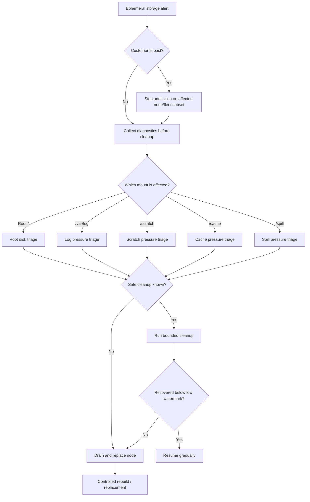
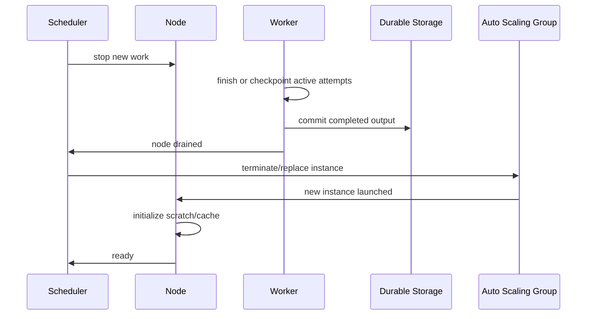

# Part 040 — Ephemeral Storage Runbook

Ephemeral storage incidents look small at first.

A disk fills. A worker fails. A cache gets corrupted. A node becomes slow. Someone deletes a directory. The service recovers for a while, then fails again.

The real issue is rarely "disk full" alone.

The real issue is usually one of these:

- local storage has no owner
- scratch has no budget
- cache has no correctness contract
- cleanup deletes the wrong thing
- success is acknowledged before durable commit
- retry reuses partial output
- rebuild overwhelms the fleet
- node replacement is not safe

This part is a runbook. It converts the previous mental model into operational steps.

The goal is not to keep a broken node alive forever. The goal is to protect correctness, preserve useful diagnostics, reduce customer impact, and return the fleet to a known-good state.

---

## 1. Problem yang Diselesaikan

Kita akan membahas:

- bagaimana mendeteksi ephemeral disk pressure
- bagaimana membedakan root disk, scratch, cache, spill, dan log pressure
- bagaimana triage tanpa menghapus data yang salah
- kapan cleanup aman
- kapan node harus di-drain dan diganti
- bagaimana menangani cache poisoning
- bagaimana mencegah rebuild storm
- bagaimana membuat guardrail sebelum incident
- bagaimana mendesain automation yang tidak memperburuk situasi

Scope utama adalah EC2 instance store/local disk. Namun prinsipnya juga berlaku untuk ephemeral disk di container worker, build runner, batch node, dan data processing node.

---

## 2. Mental Model

### 2.1 Every ephemeral path needs a contract

A local path without contract is an outage waiting.

Contract minimal:

```yaml
path: /scratch/jobs
owner: evidence-worker
dataClass: disposable-working-data
maxAge: 24h
maxUsagePercent: 70
safeToDeleteWhen: job attempt is not active
activeUseDetection: worker registry + lsof
durableSource: s3://evidence-raw/
durableOutput: s3://evidence-processed/
cleanupCommand: /opt/app/bin/cleanup-scratch
emergencyAction: stop admission, drain node, replace if cleanup fails
```

Make this explicit. Put it in code, docs, and alarms.

### 2.2 Node local state has three incident priorities

During incident, prioritize:

1. **Correctness**
   - Do not lose acknowledged data.
   - Do not serve corrupted cache.
   - Do not publish partial output.

2. **Impact reduction**
   - Stop assigning new work to sick nodes.
   - Let safe active work finish.
   - Shed load or retry elsewhere.

3. **Recovery speed**
   - Clean if safe.
   - Recycle if uncertain.
   - Rebuild at controlled rate.

Do not reverse the order. Fast cleanup that deletes the wrong file is worse than a slower node replacement.

### 2.3 The correct default is drain, not SSH surgery

If local storage is designed correctly, node replacement should be safe.

SSH surgery is appropriate for diagnostics and emergency mitigation, not as the normal recovery path.

---

## 3. Detection and Alerting

### 3.1 Required metrics

For each important mount:

- used bytes
- used percent
- free bytes
- inode used percent
- read bytes/sec
- write bytes/sec
- read latency
- write latency
- I/O utilization
- queue depth where available
- cleanup success/failure count
- cache hit/miss/fill rate
- scratch active attempts
- orphan attempt count
- eviction count
- node drain count
- node replacement count

For root filesystem:

- `/` usage
- `/var/log` usage
- journald usage
- package/cache directories
- container runtime storage usage
- deleted-but-open files

For instance store on Nitro-based EC2, AWS exposes detailed NVMe instance store performance counters retained for the lifetime of the instance, including operations, bytes, I/O time, and histograms.

### 3.2 Recommended alarm thresholds

Use different thresholds per mount. One threshold for everything is lazy.

| Mount | Warning | Critical | Emergency |
|---|---:|---:|---:|
| `/` | 70% | 80% | 90% |
| `/var/log` | 65% | 80% | 90% |
| `/scratch` | 75% | 85% | 92% |
| `/cache` | 80% | 90% | 95% |
| `/spill` | 70% | 85% | 92% |

Reasoning:

- root disk needs earlier alarms because OS failure can cascade quickly
- cache can run hotter if eviction is reliable
- scratch/spill needs admission control before full disk
- inode usage can fail writes even when bytes look fine

### 3.3 Alarm semantics

Bad alarm:

```text
Disk > 90%
```

Better alarm:

```text
/scratch > 85% for 5 minutes AND active attempts increasing AND cleanup not reducing usage
```

Best alarm:

```text
Node cannot safely accept new work because scratch free bytes < maxAttemptScratchBudget * 2
```

The best alarm maps directly to an action.

---

## 4. Triage Decision Tree



---

## 5. Immediate Incident Commands

### 5.1 First snapshot of state

Run quickly before cleanup:

```bash
date -Is
hostname
uptime
df -hT
df -ih
lsblk -o NAME,TYPE,SIZE,FSTYPE,MOUNTPOINTS,MODEL,SERIAL
mount | column -t
```

### 5.2 Top consumers

```bash
sudo du -xhd1 / 2>/dev/null | sort -h
sudo du -xhd1 /var 2>/dev/null | sort -h
sudo du -xhd1 /scratch 2>/dev/null | sort -h
sudo du -xhd1 /cache 2>/dev/null | sort -h
sudo du -xhd1 /spill 2>/dev/null | sort -h
```

Use `-x` to stay on the same filesystem.

### 5.3 Deleted but open files

A common trap: you delete a large file, but disk usage does not drop because a process still holds the file open.

```bash
sudo lsof +L1
```

If a log file is deleted but still open, restart or signal the owning process safely.

### 5.4 Active writers

```bash
sudo iotop -oPa
sudo pidstat -d 1 5
sudo lsof /scratch | head -200
sudo lsof /cache | head -200
```

### 5.5 Filesystem health

```bash
dmesg -T | egrep -i 'nvme|xfs|ext4|i/o error|read-only|corrupt|reset|timeout' | tail -200
journalctl -p warning --since "2 hours ago"
```

### 5.6 Container runtime storage

If EC2 runs containers:

```bash
docker system df
docker ps -a --size
docker images
```

For containerd/Kubernetes-like nodes:

```bash
sudo crictl images
sudo crictl ps -a
sudo du -xhd1 /var/lib/containerd 2>/dev/null | sort -h
sudo du -xhd1 /var/lib/kubelet 2>/dev/null | sort -h
```

Do not blindly run destructive prune commands on production nodes without understanding what workloads are using.

---

## 6. Runbook: Root Disk Pressure

### 6.1 Symptoms

- SSH login slow or impossible
- package install/update fails
- application cannot write temp files
- journald/logging errors
- health check still passes until sudden failure
- systemd units fail to start
- root filesystem remounted read-only

### 6.2 Common causes

- unbounded logs
- core dumps
- temporary files under `/tmp`
- package manager cache
- application accidentally writes data to root
- container runtime uses root volume
- deleted-but-open files
- crash loops producing logs

### 6.3 Safe triage

```bash
df -hT /
df -ih /
sudo du -xhd1 /var | sort -h
sudo du -xhd1 /tmp | sort -h
sudo journalctl --disk-usage
sudo lsof +L1
```

### 6.4 Safe cleanup candidates

Depends on OS, but common examples:

```bash
# journald vacuum, bounded
sudo journalctl --vacuum-time=3d

# package cache, distro-specific
sudo yum clean all || true
sudo apt-get clean || true

# old app temp files only if contract says safe
sudo find /tmp -mindepth 1 -mtime +2 -print
```

Do not delete:

- database files
- active app directories
- unknown `/var/lib/*`
- current logs required for incident if not shipped
- files just because they are large

### 6.5 Permanent fixes

- move scratch/cache off root volume
- logrotate/journald limits
- container runtime storage limits
- application config prevents root writes
- larger root volume if justified
- AMI bake check for disk budget
- alarm at lower threshold
- node recycle automation

---

## 7. Runbook: Scratch Pressure

### 7.1 Symptoms

- worker failures with `ENOSPC`
- job retry storms
- partial output
- high local write throughput
- queue grows even while CPU is low
- cleanup removes old files but usage returns quickly

### 7.2 Common causes

- too many concurrent jobs per node
- worst-case input larger than expected
- orphan attempt directories
- retry reuses old scratch path
- compression/extraction expansion ratio underestimated
- spill and scratch share disk
- cleanup cannot delete active files

### 7.3 Scratch triage

```bash
df -hT /scratch
df -ih /scratch
sudo du -xhd1 /scratch | sort -h
sudo find /scratch/jobs -maxdepth 3 -type d -mtime +1 -print | head -100
sudo lsof /scratch | head -200
```

### 7.4 Stop admission

Before cleanup, prevent new work:

- mark node as draining in worker registry
- remove node from custom scheduler
- set local admission flag
- for ASG-backed worker, put instance in Standby only if safe
- for ECS/EKS, use native draining mechanisms when applicable

Example local flag:

```bash
sudo touch /var/run/app-draining
```

The worker should check this flag before accepting new jobs.

### 7.5 Safe cleanup algorithm

Pseudo-code:

```text
for each attempt_dir in /scratch/jobs:
    if attempt is active:
        skip
    if attempt has durable success marker:
        delete
    else if attempt is older than max_attempt_age:
        delete or quarantine according to policy
    else:
        skip
```

Shell skeleton:

```bash
#!/usr/bin/env bash
set -euo pipefail

root="/scratch/jobs"
quarantine="/scratch/quarantine/$(date +%Y%m%dT%H%M%S)"
mkdir -p "$quarantine"

find "$root" -mindepth 2 -maxdepth 2 -type d -mmin +360 | while read -r dir; do
  attempt_id="$(basename "$dir")"

  if /opt/app/bin/is-attempt-active "$attempt_id"; then
    continue
  fi

  if [ -f "$dir/DURABLE_COMMIT_COMPLETE" ] || /opt/app/bin/is-attempt-expired "$attempt_id"; then
    rm -rf --one-file-system "$dir"
  else
    mv "$dir" "$quarantine/"
  fi
done
```

### 7.6 Permanent fixes

- per-job scratch estimate
- max concurrent jobs by scratch budget
- attempt-scoped directories
- durable commit marker
- orphan cleanup
- input expansion ratio guardrail
- scheduler includes disk as resource
- fail job early if scratch budget insufficient

---

## 8. Runbook: Cache Pressure

### 8.1 Symptoms

- cache consumes disk
- new nodes overload durable source
- eviction loop
- high cache miss rate after deployment
- inconsistent behavior across nodes
- stale or corrupted data served

### 8.2 Common causes

- no eviction policy
- mutable cache keys
- cache key missing version
- partial writes visible to readers
- deployment invalidates all cache at once
- warmup storm
- oversized artifacts
- multiple apps sharing cache root

### 8.3 Cache triage

```bash
df -hT /cache
sudo du -xhd1 /cache | sort -h
sudo find /cache -name '*.tmp' -mmin +60 -print | head -100
sudo find /cache -name COMPLETE -print | wc -l
```

### 8.4 Safe cache eviction

Cache is supposed to be disposable, but only if it is truly a cache.

Safe eviction requirements:

- content can be refetched/rebuilt
- no active reader/writer
- complete entries are immutable
- partial entries are identifiable
- cache miss path is healthy

Example:

```bash
# Remove stale temporary files
sudo find /cache -name '*.tmp.*' -mmin +60 -delete

# Remove incomplete build directories older than 2 hours
sudo find /cache/.building -mindepth 1 -maxdepth 1 -type d -mmin +120 -exec rm -rf {} +
```

LRU eviction should be implemented by application-aware tooling, not random `rm`.

### 8.5 Cache poisoning runbook

When cache correctness is suspected:

1. Stop new work on affected nodes.
2. Identify artifact key/version.
3. Compare local checksum to durable source checksum.
4. Remove only affected cache entry.
5. Force reload with checksum validation.
6. If scope is unknown, drain and recycle node.
7. Deploy immutable/content-addressed key fix.
8. Add regression test.

Commands:

```bash
artifact="/cache/models/sha256-b2af31/data.tar"
sha256sum "$artifact"
cat "$(dirname "$artifact")/metadata.json"
```

### 8.6 Permanent fixes

- content-addressed cache keys
- metadata + COMPLETE marker
- atomic write + rename
- checksum validation
- warmup rate limits
- fleet-wide cache invalidation plan
- cache hit/miss dashboards
- max cache size per app

---

## 9. Runbook: Spill Pressure

### 9.1 Symptoms

- sorting/aggregation job fails
- JVM/native process throws temp file error
- high disk write and read amplification
- throughput collapses after memory pressure
- retry fails on same instance size

### 9.2 Causes

- memory underprovisioned
- concurrency too high
- input skew
- compression ratio surprise
- framework spill directory on root disk
- no per-job spill budget
- local disk bandwidth saturated

### 9.3 Triage

```bash
df -hT /spill
sudo du -xhd1 /spill | sort -h
sudo iotop -oPa
sudo pidstat -d 1 5
```

Check application/framework settings:

- JVM temp dir: `java.io.tmpdir`
- Spark local dirs
- sort temp directory
- database temp tablespace
- search engine merge temp
- compiler build directory

### 9.4 Mitigation

- stop new jobs
- reduce concurrency
- increase memory if spill is avoidable
- move spill to larger/faster scratch
- partition skewed input
- split job
- retry on storage-optimized instance
- use FSx/EBS/S3-aware framework if appropriate

### 9.5 Permanent fixes

- make spill budget schedulable
- estimate worst-case expansion
- set framework local directory explicitly
- alarm on spill slope, not just fullness
- apply backpressure before full disk
- load test with skewed data

---

## 10. Runbook: Disk I/O Degradation

### 10.1 Symptoms

- local disk latency rises
- CPU idle but throughput low
- jobs timeout
- application threads blocked on I/O
- filesystem warnings
- NVMe reset/timeouts in kernel log

### 10.2 Triage

```bash
iostat -x 1 10
pidstat -d 1 10
dmesg -T | egrep -i 'nvme|timeout|reset|i/o error|xfs|ext4' | tail -200
```

For Nitro NVMe instance store, inspect available NVMe statistics where supported.

```bash
sudo nvme list
sudo nvme smart-log /dev/nvme1n1 || true
```

### 10.3 Response

- stop admission
- reduce concurrency
- preserve logs
- drain node
- replace node if hardware/filesystem issue suspected
- do not depend on local recovery unless data contract proves safe

### 10.4 Permanent fixes

- isolate noisy workloads
- reduce write amplification
- use bigger/faster instance store instance type
- move durable or high-contention data to appropriate storage
- add per-node I/O limit
- add workload-level backpressure

---

## 11. Runbook: Node Recycle

### 11.1 When to recycle

Recycle instead of repair when:

- disk corruption is suspected
- filesystem remounted read-only
- cache poisoning scope is unclear
- local cleanup cannot identify safe deletions
- disk pressure recurs quickly
- I/O errors appear
- node differs from desired AMI/config
- instance store contract is violated
- manual repair would exceed replacement time

### 11.2 Safe recycle protocol



### 11.3 EC2/ASG version

For ASG worker fleets:

1. Mark node as draining in application scheduler.
2. Wait for active jobs to finish or checkpoint.
3. Confirm no local-only acknowledged data exists.
4. Terminate instance through ASG-managed path.
5. Let ASG launch replacement.
6. Monitor warmup and cache fill.
7. Resume work gradually.

### 11.4 ECS/EKS note

Container orchestration introduces its own draining primitives. Use them when available, but keep the same storage invariant:

- pod/task ephemeral data is disposable
- durable output is committed before success
- retry uses new attempt path
- node loss is expected
- local PV/hostPath requires explicit ownership model

This series will cover container storage in more detail later.

---

## 12. Automation Guardrails

### 12.1 Cleanup automation rules

Good cleanup automation:

- is path-scoped
- is app-aware
- checks active use
- has dry-run mode
- logs every deletion
- has max deletion rate
- stops before deleting unknown files
- emits metrics
- exits non-zero on uncertainty

Bad cleanup automation:

```bash
rm -rf /scratch/*
```

Even if technically disposable, this can kill active attempts and create duplicate work.

### 12.2 Example cleanup systemd timer

`/etc/systemd/system/app-scratch-cleanup.service`:

```ini
[Unit]
Description=Application scratch cleanup

[Service]
Type=oneshot
ExecStart=/opt/app/bin/cleanup-scratch --max-age 24h --high-watermark 80 --dry-run=false
```

`/etc/systemd/system/app-scratch-cleanup.timer`:

```ini
[Unit]
Description=Run application scratch cleanup periodically

[Timer]
OnBootSec=10min
OnUnitActiveSec=15min
AccuracySec=1min

[Install]
WantedBy=timers.target
```

### 12.3 Admission control file

Worker startup/admission check:

```bash
if [ -f /var/run/app-draining ]; then
  echo "node is draining; refusing new work"
  exit 75
fi

free_bytes="$(df --output=avail -B1 /scratch | tail -1)"
required_bytes="$((20 * 1024 * 1024 * 1024))"

if [ "$free_bytes" -lt "$required_bytes" ]; then
  echo "insufficient scratch"
  exit 75
fi
```

Do not depend only on centralized scheduling. Nodes should defend themselves.

### 12.4 Fleet-wide rebuild limiter

When nodes are replaced, cache and local derivatives may rebuild. Add a shared limiter.

Options:

- token bucket in DynamoDB/Redis
- SQS-based rebuild queue
- per-AZ rebuild concurrency cap
- rate-limited S3 download
- exponential backoff + jitter
- warm pool prefill where suitable

Goal:

```text
node loss should not trigger downstream overload
```

---

## 13. Operational Dashboards

### 13.1 Node dashboard

Show per node:

- root usage
- scratch usage
- cache usage
- spill usage
- inode usage
- active jobs
- orphan attempts
- cleanup result
- cache hit/miss
- local I/O throughput
- local I/O latency
- node age
- drain state

### 13.2 Fleet dashboard

Show:

- number of nodes above warning/critical threshold
- total scratch capacity
- total scratch free
- replacement rate
- rebuild rate
- cache fill rate
- durable source request rate
- job retry count by reason
- failed output commits
- node drain duration
- SLO impact

### 13.3 SLO correlation

Do not display disk in isolation. Correlate it with:

- request latency
- job completion latency
- queue age
- error rate
- retry rate
- durable output commit latency
- downstream throttling

Disk pressure matters because it affects service behavior.

---

## 14. Game Day Scenarios

### Scenario 1 — Scratch full on 20% of workers

Inject:

- create large files under `/scratch/jobs/<old-attempt>/`
- run normal workload
- watch scheduler behavior

Expected:

- affected nodes stop accepting new work
- cleanup removes safe old attempts
- active attempts are not deleted
- nodes that do not recover are replaced
- queue drains without duplicate durable output

### Scenario 2 — Cache poisoning

Inject:

- corrupt one model cache entry on a subset of nodes

Expected:

- checksum validation fails
- node evicts bad entry or drains
- no corrupted output is committed
- metric identifies artifact version
- rollout fix prevents recurrence

### Scenario 3 — Rebuild storm

Inject:

- terminate 30% of warm-cache nodes

Expected:

- replacements launch
- cache fill is rate-limited
- durable source is not overwhelmed
- service SLO remains inside target
- capacity model is updated if not

### Scenario 4 — Root disk log flood

Inject:

- app writes excessive logs

Expected:

- journald/logrotate bounds limit damage
- root usage alarm fires early
- node is drained if needed
- log flood root cause is visible
- root disk does not reach 100%

### Scenario 5 — Instance stop/terminate loss

Inject:

- terminate a node mid-job

Expected:

- local scratch disappears
- job retries from durable source
- no acknowledged local-only data is lost
- partial durable output is ignored
- manifest/idempotency prevents duplicate success

---

## 15. Common Mistakes

### Mistake 1 — cleanup script has no active-use check

Deleting old-looking files can break active long-running jobs.

Use active attempt registry, lock files, `lsof`, or application metadata.

### Mistake 2 — treating cache as harmless

Cache can corrupt correctness if it is stale, partial, or keyed incorrectly.

### Mistake 3 — root disk used as scratch

Root disk is the worst place for unbounded temp files. Root disk pressure turns a local workload bug into OS instability.

### Mistake 4 — manual deletion without durable-state check

Before deleting, know whether data is disposable, reconstructable, or already committed.

### Mistake 5 — no inode alarms

Small-file workloads can exhaust inodes before bytes.

### Mistake 6 — retry reuses local path

Retries must use attempt-scoped local directories. Otherwise attempt 2 can consume attempt 1's corrupted partial files.

### Mistake 7 — all nodes rebuild at once

Unbounded rebuild can cause a second outage after the first outage.

---

## 16. Checklist

### 16.1 Before production

- [ ] Every local path has a contract.
- [ ] Root disk is not used for scratch.
- [ ] Scratch/cache/spill are separate where needed.
- [ ] Cleanup is app-aware.
- [ ] Active-use detection exists.
- [ ] Cache writes are atomic.
- [ ] Cache keys are immutable/versioned.
- [ ] Durable output uses manifest or commit marker.
- [ ] Attempt directories are unique per retry.
- [ ] Node drain is implemented.
- [ ] Node replacement is safe.
- [ ] Rebuild rate is limited.
- [ ] Disk metrics and inode metrics exist.
- [ ] Game day covers node loss and disk full.

### 16.2 During incident

- [ ] Stop admission if impact exists.
- [ ] Collect diagnostics.
- [ ] Identify affected mount.
- [ ] Identify owner and data class.
- [ ] Check active users before deletion.
- [ ] Run bounded cleanup only if safe.
- [ ] Drain/replace if uncertain.
- [ ] Monitor retry and rebuild load.
- [ ] Confirm durable output correctness.
- [ ] Record root cause and missing guardrail.

### 16.3 After incident

- [ ] Add or tune alarm.
- [ ] Add cleanup contract.
- [ ] Fix scheduler resource model.
- [ ] Add test for partial output.
- [ ] Add cache checksum/versioning if missing.
- [ ] Add runbook automation.
- [ ] Run game day.
- [ ] Update capacity model.

---

## 17. Mini Case Study — Batch Extractor Disk Pressure

### 17.1 Context

A batch extractor processes archives from S3.

Each job:

1. downloads archive
2. extracts to local `/scratch`
3. validates files
4. uploads normalized output to S3
5. writes manifest

The team estimated each job needs 5 GB scratch. Real archives sometimes expand to 80 GB. Node has 300 GB scratch. Scheduler packs 12 jobs per node.

### 17.2 Failure

At peak:

- `/scratch` reaches 100%
- active jobs fail with `ENOSPC`
- retry sends jobs to other nodes
- other nodes also fill
- queue age grows
- some output paths contain partial files
- consumers pick up partial output

### 17.3 Root causes

- expansion ratio not modeled
- scratch not schedulable
- output had no commit marker
- retry reused same output path
- no node-level admission control
- cleanup could not distinguish active attempts

### 17.4 Fixed design

Changes:

- max concurrent jobs computed by scratch budget
- job declares estimated and max scratch bytes
- archive expansion ratio measured per file type
- attempt-scoped local directories
- S3 output written under attempt path
- manifest marks durable success
- downstream reads only manifest
- node stops admission below free-space threshold
- cleanup removes inactive attempts only
- large jobs routed to storage-optimized nodes

### 17.5 Resulting invariant

```text
A full scratch disk may fail or retry an attempt,
but it must not publish partial output or lose acknowledged data.
```

That is the difference between a degraded worker and a data incident.

---

## 18. Section V Summary

Section V covered:

- instance store and ephemeral disk
- local cache, scratch, and spill patterns
- locality versus durability
- operational runbook for ephemeral storage

The key lesson:

> Ephemeral storage is powerful when it is treated as disposable, bounded, and reconstructable.

The moment local bytes become unacknowledged truth, ephemeral storage becomes a hidden database with no backup, no failover, and no recovery contract.

This closes Section V.

Next, the series moves into **Section VI — Amazon S3 Object Storage Deep Implementation**, starting with S3 object storage mental model.

---

## References

- AWS EC2 User Guide — Instance store temporary block storage: https://docs.aws.amazon.com/AWSEC2/latest/UserGuide/InstanceStorage.html
- AWS EC2 User Guide — Data persistence for instance store volumes: https://docs.aws.amazon.com/AWSEC2/latest/UserGuide/instance-store-lifetime.html
- AWS EC2 User Guide — Make instance store volume available for use: https://docs.aws.amazon.com/AWSEC2/latest/UserGuide/making-instance-stores-available-on-your-instances.html
- AWS EC2 User Guide — Detailed performance statistics for NVMe instance store: https://docs.aws.amazon.com/AWSEC2/latest/UserGuide/nvme-detailed-performance-stats.html
- AWS EC2 User Guide — Storage options for EC2 instances: https://docs.aws.amazon.com/AWSEC2/latest/UserGuide/Storage.html
