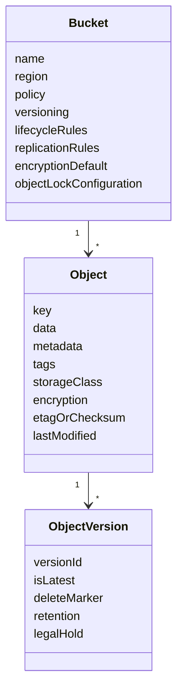
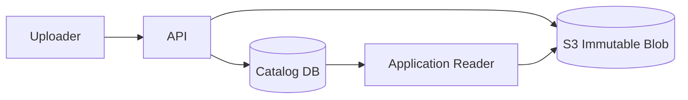

# Part 041 — S3 Object Storage Mental Model

Amazon S3 is not a disk.

It is not a filesystem.

It is not a database.

It is an object storage service.

That sentence sounds obvious until a system is designed as if S3 were `/mnt/shared`, a mutable directory tree, a relational table, or an appendable log file. Most S3 production problems come from violating its object-storage contract.

S3 is excellent when you treat it as:

- a durable object store
- a regional storage service
- a namespace of buckets and keys
- an immutable or versioned blob repository
- an event source
- a source of truth for files, artifacts, data lake partitions, backups, archives, and application objects
- a storage substrate with explicit metadata, lifecycle, access, and replication policies

S3 becomes painful when you treat it as:

- a low-latency local disk
- a POSIX filesystem
- a mutable shared folder
- a transactional database
- a tiny-record store
- a queue with exactly-once semantics
- a place where object naming can be careless

This part builds the mental model.

---

## 1. Problem yang Diselesaikan

Part ini menjawab:

- Apa sebenarnya object dalam S3?
- Bagaimana bucket, key, object, metadata, tag, version, dan storage class berhubungan?
- Mengapa S3 bukan filesystem walaupun key-nya terlihat seperti path?
- Bagaimana consistency S3 memengaruhi application semantics?
- Apa arti durability di S3 dan apa yang tetap harus didesain sendiri?
- Bagaimana memikirkan overwrite, delete, versioning, lifecycle, Object Lock, dan replication?
- Apa batas antara S3, EBS, EFS, FSx, database, dan queue?
- Bagaimana membuat storage contract yang production-grade?

---

## 2. Mental Model

### 2.1 Object storage stores whole named objects

S3 stores objects in buckets.

An object has:

- key
- value/body
- metadata
- optional tags
- storage class
- encryption state
- version identity if versioning is enabled
- access control context
- lifecycle behavior
- replication behavior
- retention behavior if Object Lock is used

Simplified:



The object key is not a directory path. It is a string. The console and many SDKs make prefixes look like folders, but S3 does not expose POSIX directory semantics.

This matters because there is no:

- `rename()` as a cheap metadata operation
- append-to-file operation
- file locking
- directory-level transaction
- inode
- shared mutable file handle
- partial in-place update
- local filesystem cache coherency

A changed object is a new write.

### 2.2 Bucket is a regional namespace and policy boundary

A bucket is not just a folder. It is a major boundary.

It carries:

- name
- region
- bucket policy
- public access block
- default encryption
- versioning state
- lifecycle rules
- replication rules
- notification configuration
- Object Lock configuration if enabled at creation
- logging/Inventory/Storage Lens integration
- ownership and access settings

Bad bucket design makes every future object design harder.

Do not create buckets merely because teams like folders. Create buckets when there is a real boundary:

- environment boundary
- data classification boundary
- account ownership boundary
- lifecycle boundary
- retention boundary
- replication boundary
- compliance boundary
- access policy boundary
- blast-radius boundary
- cost allocation boundary

### 2.3 Key is the application-level address

The key identifies the object inside a bucket.

Example:

```text
s3://regulatory-evidence-prod/cases/2026/07/06/case-9231/evidence/raw/upload-17.pdf
```

This key encodes:

- domain: cases
- date: 2026/07/06
- entity: case-9231
- type: evidence/raw
- item: upload-17.pdf

But S3 does not understand those segments unless your application does.

A key is a contract between:

- writers
- readers
- lifecycle rules
- analytics jobs
- event processors
- operators
- cost tools
- incident response
- retention policies

Key design deserves architecture review.

### 2.4 Object metadata is not a database

S3 object metadata is useful for facts tightly coupled to the object:

- content type
- content encoding
- checksum
- source system
- schema version
- ingestion ID
- original filename
- processing state at write time

But metadata is not a query engine. If you need to search objects by arbitrary business properties, use a catalog/index:

- DynamoDB
- Aurora/PostgreSQL
- OpenSearch
- Glue Data Catalog
- Lake Formation catalog
- custom manifest files
- event-sourced metadata table

Do not design a system that requires listing millions of objects and reading metadata to answer user queries.

### 2.5 S3 is regionally durable; application correctness is still your job

S3 is designed for very high durability and availability, but durability is not the same as correctness.

S3 can durably store:

- the wrong object
- an incomplete object you committed too early
- an object under the wrong key
- a duplicate upload
- a file with bad business metadata
- a version you meant to delete
- a manifest that references missing objects
- personally identifiable data under the wrong retention policy

S3 protects bytes after accepted writes. Your system must protect semantics before and after writes.

---

## 3. Core Concepts

### 3.1 Bucket

Bucket decision checklist:

| Question | Why it matters |
|---|---|
| Who owns this bucket? | IAM, operations, incident responsibility |
| Which Region? | latency, compliance, DR, cost |
| What data classification? | encryption, retention, access policy |
| Is versioning required? | recovery, delete marker semantics |
| Is Object Lock required? | must be configured early for WORM use cases |
| What lifecycle applies? | cost and retention |
| What replication applies? | multi-region or same-region data copy |
| What event notifications apply? | event-driven processors |
| What logging/inventory is required? | operations and audit |
| What is the deletion strategy? | bucket cleanup can be hard at scale |

### 3.2 Object key

Key design answers:

- How do writers choose keys?
- Can two writers collide?
- Is key immutable after creation?
- Does key include tenant/customer/case/date/version?
- Does key support efficient listing for operational workflows?
- Does key avoid hot-prefix or single-prefix pressure?
- Does key leak sensitive data?
- Does key encode business state that may later change?
- Can lifecycle rules target the right prefix?
- Can replication rules target the right prefix?
- Can operators reason about it under incident pressure?

Bad key:

```text
s3://bucket/file.pdf
```

Better key:

```text
s3://bucket/cases/2026/07/case-9231/evidence/raw/upload-17/content.pdf
```

Often better with content-addressed component:

```text
s3://bucket/blobs/sha256/b2/af/b2af31.../content
```

And metadata/catalog record:

```json
{
  "caseId": "case-9231",
  "evidenceId": "upload-17",
  "blobKey": "blobs/sha256/b2/af/b2af31.../content",
  "originalFilename": "passport.pdf",
  "contentType": "application/pdf",
  "sizeBytes": 928371,
  "sha256": "b2af31..."
}
```

### 3.3 Object body

Object body should usually be treated as immutable.

You can overwrite the same key, but in architecture terms that is a new object value at the same address. This creates questions:

- Does a reader see old or new content?
- Is overwrite intentional?
- Is there a version record?
- Are downstream processors idempotent?
- Are events duplicated?
- Is lifecycle impacted?
- Are caches invalidated?

For production systems, prefer:

- immutable keys
- versioned objects
- manifest pointer updates
- catalog state transitions
- conditional write where needed

### 3.4 Metadata

Metadata is split into system metadata and user metadata.

Use metadata for object-local facts:

```text
x-amz-meta-ingestion-id: ing-20260706-abc
x-amz-meta-schema-version: evidence-v3
x-amz-meta-source-system: citizen-portal
x-amz-meta-sha256: b2af31...
```

Do not use metadata as the only source for query workflows.

If operators need to ask "show all pending evidence for case 9231," use a catalog.

### 3.5 Tags

Tags are useful for:

- lifecycle filtering
- access policy conditions
- cost allocation
- classification
- operational state when carefully controlled

But tags can become dangerous if mutable tags are treated as a transactional state machine. S3 object tagging is useful, but complex workflow state is better stored in a database or event log.

### 3.6 Versioning

Versioning changes delete and overwrite semantics.

With versioning:

- multiple object versions can exist under the same key
- delete can create a delete marker
- older versions can be restored
- lifecycle must handle current and noncurrent versions
- storage cost can grow unexpectedly
- application must understand version IDs when needed

Versioning is powerful for recovery. It is not a substitute for intentional state design.

### 3.7 Delete marker

In a versioned bucket, deleting an object generally adds a delete marker as the latest version. The data may still exist as a previous version.

Implications:

- `GET key` may behave as if object is deleted
- older version can still be retrieved by version ID
- lifecycle must expire delete markers and noncurrent versions if desired
- recovery workflows must distinguish key deletion from version deletion

### 3.8 Storage class

Storage class is a cost/performance/access contract.

Examples:

- frequently accessed objects
- infrequently accessed but quickly retrievable objects
- archive objects
- single-AZ low-cost objects
- intelligent tiering
- high-performance directory-bucket use cases

Do not choose storage class only by price per GB.

Ask:

- How often is object read?
- How quickly must it be retrieved?
- What is minimum storage duration?
- Is there retrieval cost?
- Is object small?
- Is access unpredictable?
- Is single-AZ storage acceptable?
- Is lifecycle transition safe?

### 3.9 Lifecycle

Lifecycle rules can:

- transition objects to another storage class
- expire current objects
- expire noncurrent versions
- delete incomplete multipart uploads
- remove expired delete markers

Lifecycle is not only cost optimization. It is data governance.

Bad lifecycle:

```text
Delete everything under /tmp after 7 days.
```

Better lifecycle:

```text
For prefix processing/attempts/:
- abort incomplete multipart uploads after 1 day
- expire uncommitted attempts after 7 days
- keep committed manifests according to retention policy
```

### 3.10 Object Lock

Object Lock supports WORM-style retention. It can help prevent deletion or overwrite for fixed time or indefinitely.

Use it for:

- compliance evidence
- regulatory records
- immutable audit artifacts
- ransomware-resilient backup copies
- legal hold scenarios

But Object Lock is not a casual feature. Retention errors can make data undeletable for longer than expected. Design retention before enabling.

---

## 4. Consistency and Application Semantics

### 4.1 Strong read-after-write consistency

Amazon S3 provides strong read-after-write consistency for operations such as PUT, GET, LIST, and operations that change object tags, ACLs, or metadata in all Regions.

This simplifies many older patterns. You generally do not need a "consistent view" layer to see a newly written object in list results.

But strong consistency does not give you:

- multi-object transaction
- exactly-once event processing
- object-level compare-and-swap for all workflows
- append semantics
- directory rename
- distributed lock
- relational constraint
- cross-service atomicity

The application still owns workflow correctness.

### 4.2 Single-object visibility is not workflow atomicity

Suppose a job writes:

```text
part-0001.parquet
part-0002.parquet
part-0003.parquet
```

After `part-0001` appears, a reader can see it. That does not mean the dataset is complete.

Use:

```text
_manifest.json
_SUCCESS
_committed
```

or catalog state to indicate completeness.

### 4.3 S3 event notifications are not transaction logs

S3 event notifications are useful to trigger processing, but application design should tolerate:

- duplicate events
- out-of-order events
- retries
- missing downstream processing due to consumer failure
- partial workflow visibility
- event delivery lag

Use idempotency.

A robust event processor keys work by:

```text
bucket + key + versionId/eTag/checksum + eventName
```

and records processed state in a durable table.

### 4.4 Overwrite semantics

Overwriting the same key is allowed, but often harmful.

Use overwrite only when:

- object is genuinely replaceable
- readers can tolerate new value
- versioning or catalog history exists
- caches can be invalidated
- events are idempotent
- old value retention is understood

For canonical records, prefer immutable object keys and a pointer/catalog update.

---

## 5. Production Design Patterns

### 5.1 Immutable blob + catalog pointer

This is one of the strongest S3 application patterns.



Object key:

```text
blobs/sha256/b2/af/b2af31.../content
```

Catalog record:

```json
{
  "caseId": "case-9231",
  "evidenceId": "ev-17",
  "blobKey": "blobs/sha256/b2/af/b2af31.../content",
  "sha256": "b2af31...",
  "sizeBytes": 928371,
  "state": "ACCEPTED",
  "createdAt": "2026-07-06T03:00:00Z"
}
```

Benefits:

- deduplication possible
- content integrity is explicit
- object key is immutable
- business identity is in catalog
- object path does not need to change when case metadata changes
- readers can verify checksum

### 5.2 Attempt path + commit manifest

For pipelines:

```text
datasets/evidence-normalized/job-123/attempt-1/part-0001.json
datasets/evidence-normalized/job-123/attempt-1/part-0002.json
datasets/evidence-normalized/job-123/attempt-1/_manifest.json
```

Commit manifest:

```json
{
  "jobId": "job-123",
  "attemptId": "attempt-1",
  "inputs": [
    {
      "bucket": "raw-bucket",
      "key": "cases/2026/07/case-9231/raw/upload-17.pdf",
      "sha256": "..."
    }
  ],
  "outputs": [
    {
      "key": "datasets/evidence-normalized/job-123/attempt-1/part-0001.json",
      "sha256": "..."
    }
  ],
  "status": "COMMITTED"
}
```

Downstream reads only committed manifests.

### 5.3 Current pointer

When users need "latest":

```text
artifacts/service-a/releases/release-2026-07-06T03-00-00Z/app.tar
artifacts/service-a/releases/release-2026-07-06T04-00-00Z/app.tar
artifacts/service-a/current.json
```

`current.json`:

```json
{
  "releaseId": "release-2026-07-06T04-00-00Z",
  "artifactKey": "artifacts/service-a/releases/release-2026-07-06T04-00-00Z/app.tar",
  "sha256": "...",
  "createdAt": "2026-07-06T04:00:00Z"
}
```

The artifact is immutable. The pointer is mutable.

This isolates mutation to a tiny object or database row.

### 5.4 Prefix-based lifecycle boundary

Example:

```text
raw/
  retain according to source retention

processed/
  retain according to business retention

processing-attempts/
  expire after 7 days

tmp-multipart/
  abort incomplete uploads after 1 day

archive/
  transition to archive class after age threshold
```

Design prefixes with lifecycle in mind from the beginning.

### 5.5 S3 as backup target

S3 is a common backup target, but backup correctness needs:

- immutable backup objects
- versioning or Object Lock where needed
- encryption and key access continuity
- restore testing
- inventory/catalog
- lifecycle that does not delete before retention expires
- separate account/bucket boundary for blast-radius reduction
- least-privilege write path

Backup not tested is storage cost, not recovery.

### 5.6 S3 for large object exchange

For large uploads/downloads:

- use multipart upload
- validate checksum
- store size and checksum
- abort incomplete multipart uploads
- use pre-signed URLs carefully
- do not route huge bodies through application servers unless required
- consider Transfer Acceleration for geographically distant clients when measured beneficial

---

## 6. Implementation Skeletons

### 6.1 Bucket baseline with Terraform

```hcl
resource "aws_s3_bucket" "evidence" {
  bucket = "regulatory-evidence-prod-${var.account_id}-${var.region}"

  tags = {
    Service     = "case-management"
    Environment = "prod"
    DataClass   = "regulatory-evidence"
  }
}

resource "aws_s3_bucket_public_access_block" "evidence" {
  bucket = aws_s3_bucket.evidence.id

  block_public_acls       = true
  block_public_policy     = true
  ignore_public_acls      = true
  restrict_public_buckets = true
}

resource "aws_s3_bucket_versioning" "evidence" {
  bucket = aws_s3_bucket.evidence.id

  versioning_configuration {
    status = "Enabled"
  }
}

resource "aws_s3_bucket_server_side_encryption_configuration" "evidence" {
  bucket = aws_s3_bucket.evidence.id

  rule {
    apply_server_side_encryption_by_default {
      kms_master_key_id = aws_kms_key.evidence.arn
      sse_algorithm     = "aws:kms"
    }
  }
}
```

### 6.2 Lifecycle for attempts and incomplete multipart uploads

```hcl
resource "aws_s3_bucket_lifecycle_configuration" "evidence" {
  bucket = aws_s3_bucket.evidence.id

  rule {
    id     = "expire-processing-attempts"
    status = "Enabled"

    filter {
      prefix = "processing-attempts/"
    }

    expiration {
      days = 7
    }

    abort_incomplete_multipart_upload {
      days_after_initiation = 1
    }
  }

  rule {
    id     = "noncurrent-version-retention"
    status = "Enabled"

    noncurrent_version_expiration {
      noncurrent_days = 90
    }
  }
}
```

### 6.3 Upload with checksum and catalog

Pseudo-flow:

```text
1. Client requests upload session.
2. API allocates object key and upload ID.
3. Client uploads directly to S3.
4. API verifies object exists and checksum/size match.
5. API creates catalog record as ACCEPTED.
6. Downstream processors use catalog, not bucket listing alone.
```

Java-like pseudo-code:

```java
record StoredObject(
    String bucket,
    String key,
    String sha256,
    long sizeBytes,
    String contentType
) {}

StoredObject acceptUpload(UploadCompleteCommand command) {
    HeadObjectResponse head = s3.headObject(b -> b
        .bucket(command.bucket())
        .key(command.key()));

    if (head.contentLength() != command.expectedSizeBytes()) {
        throw new IllegalStateException("size mismatch");
    }

    // In production, verify checksum using S3 checksum fields or separately stored digest.
    CatalogRecord record = catalog.insertAcceptedObject(
        command.caseId(),
        command.evidenceId(),
        command.bucket(),
        command.key(),
        command.expectedSha256(),
        command.expectedSizeBytes()
    );

    return new StoredObject(
        command.bucket(),
        command.key(),
        command.expectedSha256(),
        command.expectedSizeBytes(),
        head.contentType()
    );
}
```

### 6.4 Idempotent event processor

```java
void handleS3Event(S3Event event) {
    String idempotencyKey = event.bucket() + ":" +
        event.key() + ":" +
        event.versionIdOrEmpty() + ":" +
        event.eventName();

    if (!processedEvents.tryStart(idempotencyKey)) {
        return;
    }

    try {
        processObject(event.bucket(), event.key(), event.versionIdOrNull());
        processedEvents.markSucceeded(idempotencyKey);
    } catch (Exception e) {
        processedEvents.markFailed(idempotencyKey, e);
        throw e;
    }
}
```

---

## 7. Failure Modes

### 7.1 Treating S3 like a filesystem

Symptoms:

- frequent rename/copy/delete operations
- listing huge prefixes in hot path
- "directories" used as state
- concurrent writers overwrite each other
- poor latency from small-file access

Fix:

- model object writes as immutable commits
- use manifest/catalog
- avoid rename-heavy workflows
- batch/list offline, not request path
- use EFS/FSx if actual file semantics are required

### 7.2 Using bucket listing as primary query engine

Symptoms:

- user-facing search times out
- list cost grows
- prefix scan becomes bottleneck
- metadata filtering requires many HEAD requests

Fix:

- create metadata catalog
- write catalog transaction near object write
- use S3 Inventory for offline audit
- use Glue/Athena/OpenSearch depending query type

### 7.3 Mutable key race

Symptoms:

- two writers write same key
- old result disappears
- downstream sees unexpected object version
- cache has stale data

Fix:

- use unique immutable keys
- use idempotency tokens
- store latest pointer separately
- enable versioning where appropriate
- reject duplicate business IDs in catalog

### 7.4 Partial dataset visibility

Symptoms:

- downstream reads some parts before job completes
- analytics result is inconsistent
- retries produce duplicate files

Fix:

- write attempt-scoped output
- publish manifest only after all parts exist
- downstream consumes manifest, not raw prefix
- expire failed attempts

### 7.5 Lifecycle deletes needed data

Symptoms:

- old versions disappear
- restore impossible
- archive transition breaks low-latency read path
- noncurrent versions cost surprise

Fix:

- lifecycle review by data owner
- test restore from each storage class
- tag/prefix-based lifecycle with clear ownership
- monitor object age and transition counts
- keep lifecycle rules out of hot prefixes unless intentional

### 7.6 KMS dependency surprise

Symptoms:

- object exists but cannot be read
- replication fails
- cross-account access denied
- restore fails during incident

Fix:

- define KMS key ownership
- test read from recovery role/account
- monitor KMS errors
- ensure replication role can use key
- document key rotation/deletion policy

### 7.7 Event duplicate processing

Symptoms:

- processor runs twice
- duplicate database rows
- duplicate downstream files
- user sees duplicate notifications

Fix:

- durable idempotency table
- version-aware event key
- conditional writes
- commutative processing where possible
- DLQ and replay protocol

---

## 8. Performance and Cost Trade-off

### 8.1 Request shape matters

S3 cost and performance are not only GB-month.

They include:

- PUT/COPY/POST/LIST requests
- GET/HEAD requests
- data transfer
- lifecycle transitions
- retrieval from infrequent/archive classes
- metadata operations
- replication
- inventory/analytics
- small object overhead
- application retries

Bad design:

```text
Store every tiny event as a separate 400-byte object and list all objects every second.
```

Better:

- batch small records
- use streaming service or database for small events
- compact objects
- write manifests
- use S3 as durable object/log segment store, not tiny-row OLTP

### 8.2 Prefix distribution

S3 can scale high request rates, and request-rate scaling is influenced by prefix distribution and gradual scaling behavior. Very high request-rate workloads should deliberately distribute requests and avoid a single hot prefix.

This will be covered deeply in Part 042.

### 8.3 Small files are expensive operationally

Small files create:

- many PUTs
- many GET/HEADs
- listing overhead
- lifecycle overhead
- analytics planning overhead
- slow compaction
- large metadata surface
- more event notifications

For analytics/data lake workloads, small-file compaction is often mandatory.

### 8.4 Storage class is not only price

Cheaper storage can increase:

- retrieval latency
- retrieval cost
- minimum duration cost
- operational complexity
- restore delay
- application error rate if unexpected

Model access pattern before lifecycle transitions.

---

## 9. Operational Runbook

### 9.1 Object missing

Questions:

- Is bucket correct?
- Is Region correct?
- Is key exact?
- Is versioning enabled?
- Is there a delete marker?
- Is caller allowed to know whether object exists?
- Was object written under attempt path instead?
- Did lifecycle expire it?
- Did replication lag/fail?
- Was object uploaded but catalog not updated?

Commands:

```bash
aws s3api head-object --bucket "$BUCKET" --key "$KEY"

aws s3api list-object-versions \
  --bucket "$BUCKET" \
  --prefix "$KEY"
```

### 9.2 Access denied

Check:

- identity policy
- bucket policy
- public access block
- object ownership
- KMS key policy
- encryption context where applicable
- VPC endpoint policy
- SCP/permission boundary
- explicit deny
- expected account/role

Do not assume "object missing" when error is access denied. Sometimes authorization deliberately hides existence.

### 9.3 Unexpected cost spike

Check:

- request metrics
- LIST frequency
- HEAD amplification
- retry storm
- small object explosion
- lifecycle transition count
- incomplete multipart uploads
- replication backlog
- inventory reports
- storage class retrieval charges
- noncurrent versions accumulation

### 9.4 Processing duplication

Check:

- S3 event duplicate
- retry behavior
- idempotency table
- object version ID
- overwritten key
- duplicate upload session
- downstream database constraints
- manifest commit protocol

---

## 10. Checklist

### 10.1 Bucket design

- [ ] Bucket has owner.
- [ ] Region is justified.
- [ ] Data classification is documented.
- [ ] Default encryption is configured.
- [ ] Public access is blocked unless explicitly required.
- [ ] Versioning decision is explicit.
- [ ] Lifecycle rules are reviewed.
- [ ] Replication decision is explicit.
- [ ] Object Lock decision is explicit.
- [ ] Logging/inventory/metrics decision is explicit.
- [ ] Bucket deletion strategy exists.

### 10.2 Object design

- [ ] Key pattern is documented.
- [ ] Key collision is impossible or controlled.
- [ ] Object body is immutable unless overwrite is intentional.
- [ ] Metadata schema is documented.
- [ ] Tags are not abused as workflow database.
- [ ] Checksums are stored/validated for critical objects.
- [ ] Large object upload uses multipart when appropriate.
- [ ] Incomplete multipart uploads are cleaned up.
- [ ] Lifecycle does not delete needed object versions.

### 10.3 Application semantics

- [ ] Durable commit happens before user-visible success.
- [ ] Multi-object output uses manifest/commit marker.
- [ ] Event processing is idempotent.
- [ ] Listing is not used as a hot-path query engine.
- [ ] Catalog exists for business queries.
- [ ] Versioning/delete marker behavior is understood.
- [ ] Restore workflow is tested.
- [ ] KMS/key access is tested from recovery role.

---

## 11. Mini Case Study — Regulatory Evidence Store

### 11.1 Bad design

A case management system stores uploaded evidence as:

```text
s3://case-files/uploads/<filename>
```

Problems:

- filename collisions
- sensitive names in keys
- no tenant/case boundary
- no checksum
- no immutable key
- no catalog
- lifecycle impossible to target
- accidental overwrite
- difficult restore
- audit trail incomplete

### 11.2 Better design

Bucket:

```text
regulatory-evidence-prod-<account>-<region>
```

Blob key:

```text
blobs/sha256/b2/af/b2af31.../content
```

Case view key if needed:

```text
cases/2026/07/case-9231/evidence/ev-17/manifest.json
```

Catalog:

```json
{
  "caseId": "case-9231",
  "evidenceId": "ev-17",
  "blobKey": "blobs/sha256/b2/af/b2af31.../content",
  "sha256": "b2af31...",
  "sizeBytes": 928371,
  "contentType": "application/pdf",
  "originalFilename": "passport.pdf",
  "classification": "confidential",
  "retentionPolicy": "regulatory-evidence-7y",
  "state": "ACCEPTED"
}
```

Benefits:

- immutable object
- dedupe possible
- catalog holds business identity
- key does not depend on mutable case metadata
- lifecycle can target class/prefix
- audit can compare catalog and S3 Inventory
- restore can be tested by object key and version

### 11.3 Production invariant

```text
A user upload is accepted only after:
1. the object is durably stored,
2. checksum/size are validated,
3. the catalog record is committed,
4. the object is linked to a retention policy.
```

---

## 12. Summary

S3 is a durable object store with strong consistency, rich lifecycle controls, versioning, replication, storage classes, event integration, and policy boundaries.

It is not a filesystem.

The core design rule:

> Store immutable objects. Put business meaning in a catalog or manifest. Use lifecycle and versioning intentionally. Treat object keys as API contracts.

If you do that, S3 becomes one of the most powerful primitives in AWS architecture.

If you do not, S3 becomes a slow, expensive, mutable shared folder with surprising failure modes.

Next, we go deeper into key design and access patterns: prefix layout, hot path, list behavior, partitioning, small files, object naming contracts, and production-scale request design.

---

## References

- AWS S3 User Guide — What is Amazon S3?: https://docs.aws.amazon.com/AmazonS3/latest/userguide/Welcome.html
- AWS S3 User Guide — Naming Amazon S3 objects: https://docs.aws.amazon.com/AmazonS3/latest/userguide/object-keys.html
- AWS S3 User Guide — Organizing objects using prefixes: https://docs.aws.amazon.com/AmazonS3/latest/userguide/using-prefixes.html
- AWS S3 User Guide — Amazon S3 data consistency model: https://docs.aws.amazon.com/AmazonS3/latest/userguide/Welcome.html#ConsistencyModel
- AWS S3 User Guide — S3 Versioning: https://docs.aws.amazon.com/AmazonS3/latest/userguide/Versioning.html
- AWS S3 User Guide — S3 Object Lock: https://docs.aws.amazon.com/AmazonS3/latest/userguide/object-lock.html
- AWS S3 User Guide — S3 storage classes: https://docs.aws.amazon.com/AmazonS3/latest/userguide/storage-class-intro.html
- AWS S3 User Guide — Lifecycle configuration: https://docs.aws.amazon.com/AmazonS3/latest/userguide/object-lifecycle-mgmt.html
