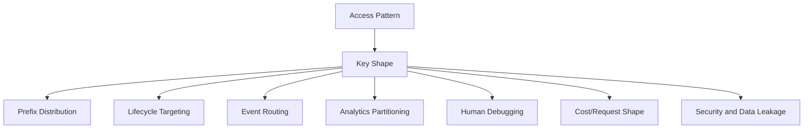
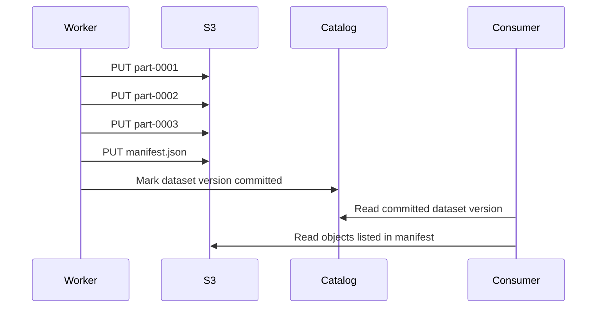

# Part 042 — S3 Key Design and Access Pattern

An S3 key is not just a filename.

It is a routing hint, lifecycle selector, operational index, cost multiplier, event trigger, access-policy target, analytics partition, and human debugging surface.

Bad key design survives the first prototype. It fails at scale.

The failure usually appears as:

- slow listing
- expensive request amplification
- hot prefixes
- painful lifecycle rules
- impossible restore targeting
- confusing incident response
- duplicate data
- partial dataset reads
- awkward analytics partitioning
- object names that leak sensitive business data
- data lake small-file explosion
- application code that scans S3 like a database

This part is about designing S3 keys and prefixes as a production API.

---

## 1. Problem yang Diselesaikan

Kita akan membahas:

- bagaimana memilih bucket/key/prefix layout
- apa arti prefix di S3
- bagaimana request rate berhubungan dengan prefix
- bagaimana menghindari hot prefix dan list-heavy design
- bagaimana membuat key yang cocok untuk application access pattern
- bagaimana mendesain key untuk upload, processing, data lake, archive, backup, dan artifact
- bagaimana memisahkan business identity dari object identity
- bagaimana memakai manifest/catalog agar S3 tidak dipakai sebagai database
- bagaimana mengurangi small-file problem
- bagaimana membuat object namespace yang bisa dioperasikan saat incident

---

## 2. Mental Model

### 2.1 Key design starts from access pattern, not folder aesthetics

A common mistake:

```text
Let's organize objects so the console looks neat.
```

Better question:

```text
How will the system write, read, list, expire, replicate, audit, and restore these objects?
```

The key pattern must serve operations.



### 2.2 A prefix is a string range, not a directory

S3 prefixes are based on key string prefixes.

Given key:

```text
cases/2026/07/case-9231/evidence/ev-17/content.pdf
```

Possible prefixes:

```text
cases/
cases/2026/
cases/2026/07/
cases/2026/07/case-9231/
cases/2026/07/case-9231/evidence/
```

The slash has no special storage meaning by itself. It is a convention.

Your application, lifecycle rules, analytics tools, and operators give it meaning.

### 2.3 Key design is a set of competing goals

A key pattern that is good for listing by date may be poor for listing by customer.

A key pattern that is good for lifecycle may leak tenant identity.

A key pattern that is good for analytics may be poor for object lookup.

Therefore key design is not about one perfect hierarchy. It is about choosing the primary access path and using catalog/manifest for secondary access.

### 2.4 S3 is not the secondary index

If you need multiple query dimensions:

- by case ID
- by customer
- by upload status
- by document type
- by retention state
- by owner
- by processing status
- by legal hold
- by date range

do not encode every dimension into path and scan prefixes.

Use a catalog.

S3 stores objects. A database indexes business relationships.

---

## 3. Core Concepts

### 3.1 Object identity vs business identity

Object identity should be stable.

Business identity may change.

Bad:

```text
cases/open/case-9231/customer-name-john-doe/passport.pdf
```

Problems:

- case status changes from open to closed
- customer name changes
- key leaks sensitive data
- rename requires copy/delete
- audit references become fragile

Better:

```text
blobs/sha256/b2/af/b2af31.../content
```

Catalog:

```json
{
  "caseId": "case-9231",
  "customerId": "cust-8831",
  "evidenceId": "ev-17",
  "blobKey": "blobs/sha256/b2/af/b2af31.../content",
  "documentType": "passport",
  "caseStatusAtIngestion": "open"
}
```

Business state belongs in catalog. Object bytes belong in S3.

### 3.2 Immutable key vs mutable key

Immutable key:

```text
artifacts/service-a/release-20260706T030000Z/app.tar
```

Mutable key:

```text
artifacts/service-a/latest/app.tar
```

Mutable keys are sometimes useful, but they are riskier.

Safer pattern:

```text
artifacts/service-a/releases/release-20260706T030000Z/app.tar
artifacts/service-a/current.json
```

`current.json` is a pointer. The artifact remains immutable.

### 3.3 Prefix cardinality

Prefix cardinality controls how many independent key ranges your workload naturally spreads across.

Low-cardinality prefix:

```text
uploads/2026/07/06/<id>
```

All writes for the day hit a narrow logical area.

Higher-cardinality prefix:

```text
uploads/2026/07/06/shard-37/<id>
```

or content hash:

```text
blobs/sha256/b2/af/<digest>/content
```

Do not blindly randomize everything. Randomization can make listing and operations harder. Use it when write/read load requires distribution or when content-addressed identity naturally distributes.

### 3.4 Listability

Some prefixes should be listable.

Examples:

```text
cases/2026/07/case-9231/evidence/
processing-attempts/job-123/
datasets/events/dt=2026-07-06/hour=03/
```

Some prefixes should not be used for frequent listing.

Examples:

```text
blobs/sha256/
raw-ingest/
global-upload-stream/
```

If listing is a hot path, ask whether a database query should replace it.

### 3.5 Key as lifecycle selector

Lifecycle rules often use prefix and/or tags.

If lifecycle differs by object class, reflect that in key or tag design.

Example:

```text
raw/
processed/
attempts/
manifests/
archive/
```

Avoid mixing objects with different retention requirements under the same prefix unless tags are enforced reliably.

### 3.6 Key as event routing selector

S3 event notification configuration often filters by prefix/suffix.

Example:

```text
incoming/evidence/
incoming/images/
incoming/video/
```

If you want separate processors, key structure can route events cleanly.

But avoid designing prefixes only for event routing if it harms data ownership/lifecycle. Use EventBridge or catalog-driven routing when needed.

### 3.7 Key as analytics partition

Analytics engines commonly use partition-like paths:

```text
events/dt=2026-07-06/hour=03/part-0001.parquet
```

Benefits:

- partition pruning
- predictable data layout
- lifecycle by partition
- easier compaction
- easier repair

But partition explosion and small files can destroy performance.

---

## 4. S3 Request Pattern and Prefix Performance

### 4.1 Request rate is part of design

S3 supports high request rates, and AWS guidance gives per-prefix request-rate performance expectations. For high-request-rate workloads, design patterns include spreading requests across multiple prefixes and scaling request rates gradually.

The practical engineering takeaway:

> Do not build a system where all hot writes and reads fight over one narrow prefix unless measured capacity is sufficient.

### 4.2 Hot prefix example

Bad high-volume upload key:

```text
uploads/current/<uuid>
```

All current uploads share one logical prefix.

Better with date and shard:

```text
uploads/dt=2026-07-06/hour=03/shard=37/<uuid>
```

Or content addressed:

```text
blobs/sha256/b2/af/<digest>/content
```

### 4.3 Avoid premature randomization

Old S3 designs often recommended random prefixes to avoid partition hot spots. Modern S3 has much better automatic scaling and strong consistency, but high-request-rate workloads still need intentional design.

Do not add random prefix blindly if humans and systems need efficient listing by date/case/customer.

Instead:

1. model request rate
2. identify hot access path
3. choose distribution dimension
4. preserve operational listability where needed
5. benchmark and monitor

### 4.4 Gradual scaling

S3 request-rate scaling can be gradual. If a workload suddenly jumps from low traffic to massive traffic against a new prefix, transient throttling or elevated latency can appear.

Mitigation:

- warm traffic gradually for large migrations
- spread writes across prefixes
- use exponential backoff and jitter
- parallelize across connections
- avoid synchronized clients
- pre-create workload sharding logic, not manual prefixes

### 4.5 HTTP connection reuse

For direct S3 clients, performance depends on client behavior:

- connection pooling
- TLS handshake reuse
- DNS behavior
- retry strategy
- multipart configuration
- parallelism
- request timeout
- SDK client configuration

Bad pattern:

```text
create new S3 client per request
open new connection per object
list prefix repeatedly
HEAD every object before GET without need
```

Better:

- reuse SDK client
- configure connection pool
- use parallel multipart for large objects
- reduce unnecessary HEAD/LIST calls
- cache object metadata where safe

---

## 5. Key Design Patterns

### 5.1 Content-addressed blob store

Use when object bytes matter more than business path.

```text
blobs/sha256/<first-2>/<next-2>/<full-digest>/content
```

Example:

```text
blobs/sha256/b2/af/b2af31d2.../content
```

Metadata:

```text
blobs/sha256/b2/af/b2af31d2.../metadata.json
```

Benefits:

- immutable identity
- deduplication
- checksum by design
- natural distribution
- safe cache key

Trade-offs:

- not human-friendly
- requires catalog
- listing by business entity impossible without index

Best for:

- evidence blobs
- build artifacts
- model files
- binary assets
- document storage
- backup chunks

### 5.2 Entity-owned object layout

Use when operators frequently inspect by entity.

```text
cases/<yyyy>/<mm>/<case-id>/evidence/<evidence-id>/content
cases/<yyyy>/<mm>/<case-id>/evidence/<evidence-id>/metadata.json
```

Benefits:

- human debuggable
- lifecycle by domain/entity
- easy restore for one case
- easy incident navigation

Trade-offs:

- case ID/date can create uneven distribution
- mutable business state should not be encoded
- duplicates harder to detect
- key may leak business identifiers

Best for:

- moderate-volume case/document systems
- support/debug workflows
- per-tenant exports
- per-account reports

### 5.3 Time-partitioned event/data lake layout

```text
events/source=portal/event=case-submitted/dt=2026-07-06/hour=03/part-0001.parquet
```

Benefits:

- analytics partition pruning
- lifecycle by time
- compaction by partition
- clean batch boundaries

Trade-offs:

- high-cardinality partitions can explode
- late arriving data needs strategy
- small files need compaction
- not ideal for object lookup by ID

Best for:

- logs
- analytics events
- data lake tables
- pipeline outputs
- compliance exports

### 5.4 Attempt-and-manifest layout

```text
jobs/job-123/attempt-001/output/part-0001
jobs/job-123/attempt-001/output/part-0002
jobs/job-123/attempt-001/_manifest.json
```

Benefits:

- safe retries
- partial output isolated
- downstream reads only committed manifest
- debugging attempts is easy

Trade-offs:

- failed attempts need lifecycle cleanup
- manifest discipline required
- downstream must not scan raw output blindly

Best for:

- batch processing
- ETL
- media processing
- document conversion
- ML preprocessing

### 5.5 Release artifact layout

```text
artifacts/service-a/releases/2026-07-06T03-00-00Z/app.tar
artifacts/service-a/releases/2026-07-06T03-00-00Z/sbom.json
artifacts/service-a/releases/2026-07-06T03-00-00Z/provenance.json
artifacts/service-a/current.json
```

Benefits:

- immutable release history
- rollback
- SBOM/provenance colocated
- latest pointer separated

Trade-offs:

- current pointer update must be controlled
- retention/lifecycle needed
- consumers must validate digest

Best for:

- deployment artifacts
- ML model registry
- package distribution
- internal binaries

### 5.6 Tenant-scoped layout

```text
tenants/<tenant-id>/exports/dt=2026-07-06/export-123/file.parquet
```

Benefits:

- tenant-level restore/export
- lifecycle by tenant
- cost allocation
- access-policy conditions possible

Trade-offs:

- tenant ID may leak
- hot tenant can create hot prefix
- cross-tenant analytics may require separate layout/catalog
- tenant deletion requires careful lifecycle

For sensitive systems, consider opaque tenant IDs.

---

## 6. Anti-Patterns

### 6.1 Filename as identity

```text
uploads/passport.pdf
uploads/passport-final.pdf
uploads/passport-final-v2.pdf
```

This is not identity. This is human improvisation.

Use durable IDs and store original filename as metadata/catalog field.

### 6.2 Mutable business status in key

```text
cases/open/case-9231/file.pdf
```

When case closes, do you copy/delete the object?

Do not encode frequently changing state in object key.

### 6.3 Listing as request path

```text
GET /cases/9231/evidence
 -> ListObjectsV2 prefix=cases/9231/
 -> HEAD every object
 -> render page
```

This becomes expensive and slow.

Use catalog:

```text
GET /cases/9231/evidence
 -> Query DB by caseId
 -> return object references
```

### 6.4 Directory rename workflow

```text
processing/job-123/*
move to processed/job-123/*
```

S3 does not do cheap directory rename. This becomes copy + delete.

Use attempt path + manifest instead.

### 6.5 One object per tiny record

```text
events/<uuid>.json  # 500 bytes each
```

Millions of tiny objects cause request overhead, listing overhead, analytics overhead, and lifecycle overhead.

Batch records into larger objects unless per-record object semantics are required.

### 6.6 Key leaks sensitive data

```text
customers/john-smith-1990-01-01/passport.pdf
```

Keys appear in logs, metrics, events, inventories, audit trails, and support tools. Treat key names as metadata exposure.

Use opaque IDs.

---

## 7. Designing from Workload Shape

### 7.1 Upload-heavy application

Questions:

- How many uploads per second?
- Average and p99 object size?
- Is upload direct-to-S3 or through API?
- Is multipart needed?
- Is checksum required?
- Is idempotency required?
- Does user receive success before processing?
- How are duplicates handled?
- How are incomplete uploads cleaned?

Key pattern:

```text
uploads/dt=<yyyy-mm-dd>/hour=<hh>/shard=<00-99>/<upload-id>/content
```

or content addressed:

```text
blobs/sha256/<2>/<2>/<digest>/content
```

### 7.2 Read-heavy artifact store

Questions:

- Are reads by exact key?
- Is latest pointer needed?
- Are clients globally distributed?
- Is cache/CDN used?
- Are artifacts immutable?
- Are range requests needed?
- Are objects large?

Key pattern:

```text
artifacts/<service>/releases/<release-id>/<artifact-name>
artifacts/<service>/current.json
```

### 7.3 Batch processing output

Questions:

- Can job retry?
- Can output be partial?
- How does downstream know completion?
- Is output partitioned?
- Is compaction needed?
- How are failed attempts expired?

Key pattern:

```text
pipeline=<name>/dt=<yyyy-mm-dd>/job=<job-id>/attempt=<attempt-id>/part-0001.parquet
pipeline=<name>/dt=<yyyy-mm-dd>/job=<job-id>/attempt=<attempt-id>/_manifest.json
```

### 7.4 Data lake events

Questions:

- Query by time?
- Query by source/type?
- Late data?
- Schema evolution?
- Partition granularity?
- Compaction?
- Table format?

Key pattern:

```text
lake/events/source=<source>/event=<event-type>/dt=<yyyy-mm-dd>/hour=<hh>/part-<uuid>.parquet
```

Do not over-partition by high-cardinality fields like user ID unless the table format and query pattern justify it.

### 7.5 Backup/archive

Questions:

- Restore unit?
- Retention period?
- Object Lock?
- Cross-account?
- Encryption key ownership?
- Inventory?
- Restore test frequency?
- Lifecycle to archive class?

Key pattern:

```text
backups/system=<system>/dt=<yyyy-mm-dd>/backup-id=<id>/manifest.json
backups/system=<system>/dt=<yyyy-mm-dd>/backup-id=<id>/chunks/<chunk-id>
```

Manifest is mandatory for restore correctness.

---

## 8. Prefix and Lifecycle Design

### 8.1 Prefixes by lifecycle

Good:

```text
raw/
processed/
attempts/
manifests/
exports/
backups/
```

Each has clear retention.

Bad:

```text
files/
```

Everything under `files/` has different lifecycle, but lifecycle rules cannot express business nuance unless tags are perfectly maintained.

### 8.2 Prefixes by durability stage

Example pipeline:

```text
incoming/
  raw user uploads waiting for validation

accepted/
  durable accepted objects

processing-attempts/
  intermediate outputs, expire quickly

processed/
  committed outputs

rejected/
  invalid inputs retained for audit period
```

This layout makes operational state visible, but beware: if "accepted" becomes mutable business status, store status in catalog instead.

### 8.3 Tags vs prefixes

Use prefix when:

- lifecycle boundary is structural
- access pattern aligns with hierarchy
- humans need easy navigation
- object class is known at write time

Use tags when:

- lifecycle cuts across prefixes
- classification can vary per object
- access conditions depend on object attributes
- cost allocation needs metadata

But tags require enforcement. If missing tags break retention, validate them at write path.

---

## 9. Manifest and Catalog Patterns

### 9.1 Why manifests exist

S3 strong consistency means a written object is visible. It does not mean a group of objects is complete.

Manifest gives group atomicity at application level.



### 9.2 Manifest schema

```json
{
  "manifestVersion": 1,
  "dataset": "evidence-normalized",
  "jobId": "job-123",
  "attemptId": "attempt-002",
  "createdAt": "2026-07-06T03:00:00Z",
  "inputs": [
    {
      "bucket": "raw",
      "key": "incoming/2026/07/06/upload-17/content",
      "versionId": "..."
    }
  ],
  "outputs": [
    {
      "bucket": "processed",
      "key": "pipeline=evidence-normalized/dt=2026-07-06/job=job-123/attempt=002/part-0001.parquet",
      "sizeBytes": 1882931,
      "sha256": "..."
    }
  ]
}
```

### 9.3 Catalog role

The catalog answers:

- Which objects belong to case 9231?
- Which manifest is current?
- Which upload is accepted?
- Which processing attempt succeeded?
- Which object version is legally retained?
- Which objects should be restored?
- Which object corresponds to business entity X?

S3 stores the bytes. Catalog stores the relationships.

### 9.4 Catalog consistency

When updating both S3 and database:

- write object first
- validate object
- insert catalog record with idempotency key
- expose success after catalog commit
- periodically reconcile catalog and S3 inventory

For delete:

- mark catalog state first if business deletion is requested
- apply retention/lifecycle rules carefully
- record object version IDs
- avoid immediate physical delete if audit/recovery requires retention

---

## 10. Small File Problem

### 10.1 Why small files hurt

Small objects can be correct and still expensive.

They hurt because:

- each object has request overhead
- listing grows
- metadata operations grow
- analytics engines plan many files
- lifecycle evaluates many objects
- replication handles many objects
- event processors receive many events
- compaction becomes necessary

### 10.2 Symptoms

- Athena/Spark queries slow despite small data volume
- LIST requests spike
- millions of objects under daily partition
- event processor lag
- lifecycle cost/latency surprises
- S3 Inventory reports huge object counts
- storage cost is low but request cost is high

### 10.3 Mitigation patterns

#### Batch writes

Write larger files:

```text
events/dt=2026-07-06/hour=03/part-0001.parquet
```

instead of:

```text
events/dt=2026-07-06/hour=03/event-<uuid>.json
```

#### Compaction

```text
raw-small/
  many small files

compacted/
  fewer larger columnar files
```

#### Segment log

Accumulate records into segment objects:

```text
streams/case-events/dt=2026-07-06/hour=03/segment-000001.jsonl.gz
```

#### Use the right service

For tiny frequently updated records, consider:

- DynamoDB
- RDS/Aurora
- Kinesis
- MSK/Kafka
- SQS
- OpenSearch

S3 can store small objects. That does not mean it is the right hot-path database.

---

## 11. Naming Rules and Safety

### 11.1 Safe key characters

S3 keys can contain many characters, but practical systems should avoid unnecessary pain.

Prefer:

```text
a-z A-Z 0-9 ! - _ . * ' ( )
```

Common safe operational subset:

```text
lowercase letters, numbers, hyphen, underscore, slash, equals, dot
```

Example:

```text
source=portal/event=case-submitted/dt=2026-07-06/hour=03/part-0001.parquet
```

Avoid where possible:

- spaces
- control characters
- backslashes
- ambiguous Unicode normalization
- leading/trailing slash confusion
- `.` and `..` path-like segments
- sensitive personal data
- characters that break shell scripts or URLs

### 11.2 Opaque IDs

Use opaque IDs instead of business names.

Bad:

```text
customers/john-doe/case-tax-fraud-2026/evidence.pdf
```

Better:

```text
tenants/tnt-83f2/cases/case-9231/evidence/ev-17/content
```

Or content-addressed plus catalog.

### 11.3 Date format

Use ISO-like sortable date formats:

```text
dt=2026-07-06/hour=03
```

Avoid:

```text
07-06-2026
6-July-2026
```

### 11.4 Version in key

For schema or release version:

```text
schema=v3/
release=2026-07-06T03-00-00Z/
```

Do not rely only on mutable metadata if consumers need partition pruning or operational clarity.

---

## 12. Performance Testing

### 12.1 What to test

Test actual access shape:

- PUT rate by prefix
- GET/HEAD rate by prefix
- object size distribution
- concurrency
- multipart threshold
- LIST frequency
- retry behavior
- TLS/connection pooling
- SDK configuration
- client network path
- Region distance
- lifecycle transition impact
- event notification lag
- downstream processor throughput

### 12.2 Synthetic benchmark warning

A benchmark that writes random 64 MB objects to random prefixes tells you little about an application that writes 20 KB JSON files to one daily prefix and lists them every second.

Benchmark the workload shape.

### 12.3 Client configuration

Production SDK client should usually:

- be reused
- have adequate connection pool
- set sane timeouts
- use retries with jitter
- use multipart for large objects
- avoid per-object client creation
- avoid unnecessary HEAD before GET
- stream bodies safely
- validate checksums for critical data

### 12.4 Backoff and retry

S3 clients should handle transient errors. But retries can amplify load.

Use:

- exponential backoff
- jitter
- bounded retries
- idempotency for writes
- per-prefix concurrency controls
- circuit breakers for downstream processors

---

## 13. Operational Runbook

### 13.1 Prefix is too hot

Symptoms:

- elevated 503 Slow Down or throttling-like behavior
- increasing latency
- high retry count
- request concentration under one prefix
- sudden traffic spike after deployment

Actions:

1. Confirm request rate by prefix.
2. Check recent traffic shape change.
3. Reduce client concurrency temporarily.
4. Add backoff/jitter if missing.
5. Spread writes/reads across designed shards.
6. Avoid emergency randomization that breaks readers.
7. Update key strategy for future writes.
8. Migrate old objects only if necessary.

### 13.2 Listing is too slow/costly

Symptoms:

- UI/API timeout
- batch discovery slow
- ListObjectsV2 request count high
- many prefixes scanned to answer business query

Actions:

1. Identify why listing is needed.
2. Replace hot-path listing with catalog query.
3. Use manifest for completed datasets.
4. Use S3 Inventory for offline audit.
5. Narrow prefix where listing remains necessary.
6. Add pagination and continuation token handling.
7. Cache list results only if correctness allows.

### 13.3 Key collision

Symptoms:

- overwritten object
- unexpected latest version
- lost output
- duplicate writers

Actions:

1. Check versioning.
2. Retrieve previous versions if available.
3. Identify writer identity and request IDs.
4. Add idempotency key.
5. Make object keys unique/immutable.
6. Move "latest" to pointer object or catalog.
7. Add duplicate-key rejection in catalog.

### 13.4 Lifecycle mis-targeting

Symptoms:

- objects transitioned too early
- restore latency surprises
- current and noncurrent versions deleted
- attempts retained forever
- archive retrieval cost spike

Actions:

1. Inspect lifecycle rules by prefix/tag.
2. Sample affected objects and versions.
3. Check object age, storage class, tags.
4. Disable dangerous rule if active incident.
5. Restore from versions/replicas/backups if possible.
6. Add lifecycle tests for representative keys.
7. Separate prefixes by retention class.

### 13.5 Small-file explosion

Symptoms:

- millions of tiny objects
- analytics slow
- request cost spike
- event processor lag

Actions:

1. Quantify object count and size distribution.
2. Stop or rate-limit offending writer.
3. Introduce batching/compaction.
4. Update writer contract.
5. Add partition compaction job.
6. Update lifecycle for raw small files.
7. Monitor object count per partition.

---

## 14. Design Review Questions

Before approving a key pattern, ask:

1. What is the primary lookup path?
2. What secondary lookups exist, and where are they indexed?
3. What objects must be listed by prefix?
4. What prefixes will be hot?
5. What is expected request rate per prefix?
6. Are keys immutable?
7. How are duplicates prevented?
8. Is business state encoded in key?
9. Does key leak sensitive information?
10. How do lifecycle rules target objects?
11. How do event processors route objects?
12. How do failed attempts get cleaned up?
13. How does downstream know dataset completion?
14. How are object versions restored?
15. How does the design behave under retry?
16. How does the design behave under multi-writer concurrency?
17. What is the migration path if key layout is wrong?

---

## 15. Mini Case Study — Evidence Upload and Processing

### 15.1 Initial design

```text
s3://evidence-prod/uploads/<original-filename>
s3://evidence-prod/processed/<original-filename>.json
```

Problems:

- filename collision
- PII in key
- overwritten uploads
- no attempt isolation
- processed output visible before complete
- processing retries overwrite each other
- lifecycle cannot distinguish failed attempt from accepted evidence

### 15.2 Revised design

Raw blob:

```text
blobs/sha256/b2/af/b2af31.../content
```

Upload session:

```text
uploads/dt=2026-07-06/hour=03/shard=17/upload=up-8831/manifest.json
```

Processing attempt:

```text
processing/pipeline=evidence-normalizer/dt=2026-07-06/job=job-991/attempt=002/part-0001.json
processing/pipeline=evidence-normalizer/dt=2026-07-06/job=job-991/attempt=002/_manifest.json
```

Committed output pointer in catalog:

```json
{
  "caseId": "case-9231",
  "evidenceId": "ev-17",
  "rawBlobKey": "blobs/sha256/b2/af/b2af31.../content",
  "normalizedManifestKey": "processing/pipeline=evidence-normalizer/dt=2026-07-06/job=job-991/attempt=002/_manifest.json",
  "state": "NORMALIZED"
}
```

### 15.3 Outcome

- raw bytes are immutable
- upload key does not leak filename
- processing retries are isolated
- manifest indicates completion
- catalog supports case query
- lifecycle expires failed attempts
- audit can reconcile catalog with S3 Inventory
- cache keys can use content digest

---

## 16. Summary

S3 key design is architecture, not naming preference.

Good key design:

- starts from access pattern
- separates object identity from business identity
- avoids mutable business state in key
- uses immutable objects where possible
- distributes high request rates intentionally
- preserves listability where needed
- uses manifests for multi-object completion
- uses catalog for business queries
- avoids small-file explosion
- supports lifecycle, replication, audit, and incident response

The core rule:

> Design S3 keys for how the system behaves under scale, failure, retry, restore, and audit.

Next, we will go deeper into S3 consistency and application semantics: overwrite, delete, listing, idempotent writes, manifest commits, multi-object workflows, and exactly-once illusions.

---

## References

- AWS S3 User Guide — Naming Amazon S3 objects: https://docs.aws.amazon.com/AmazonS3/latest/userguide/object-keys.html
- AWS S3 User Guide — Organizing objects using prefixes: https://docs.aws.amazon.com/AmazonS3/latest/userguide/using-prefixes.html
- AWS S3 User Guide — Performance guidelines for Amazon S3: https://docs.aws.amazon.com/AmazonS3/latest/userguide/optimizing-performance-guidelines.html
- AWS S3 User Guide — Performance design patterns for Amazon S3: https://docs.aws.amazon.com/AmazonS3/latest/userguide/optimizing-performance-design-patterns.html
- AWS S3 User Guide — Data consistency model: https://docs.aws.amazon.com/AmazonS3/latest/userguide/Welcome.html#ConsistencyModel
- AWS S3 User Guide — S3 Inventory: https://docs.aws.amazon.com/AmazonS3/latest/userguide/storage-inventory.html
- AWS S3 User Guide — Lifecycle configuration: https://docs.aws.amazon.com/AmazonS3/latest/userguide/object-lifecycle-mgmt.html
