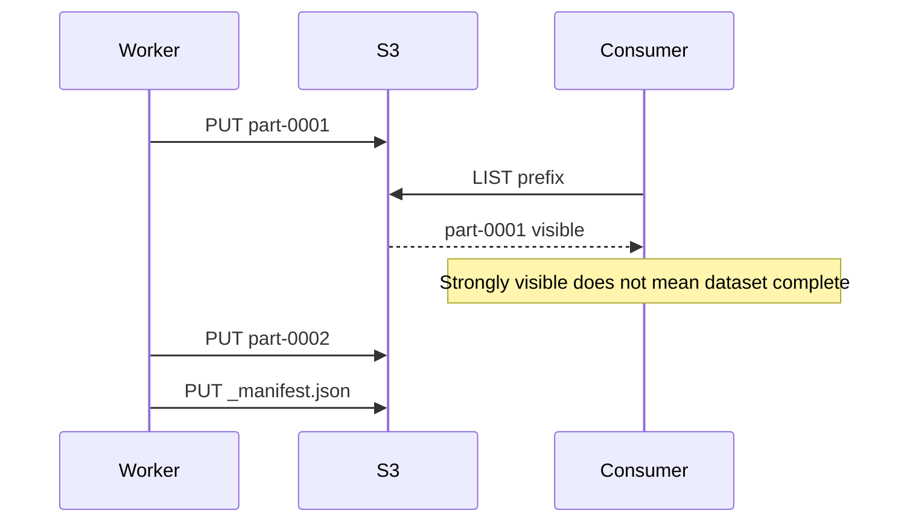
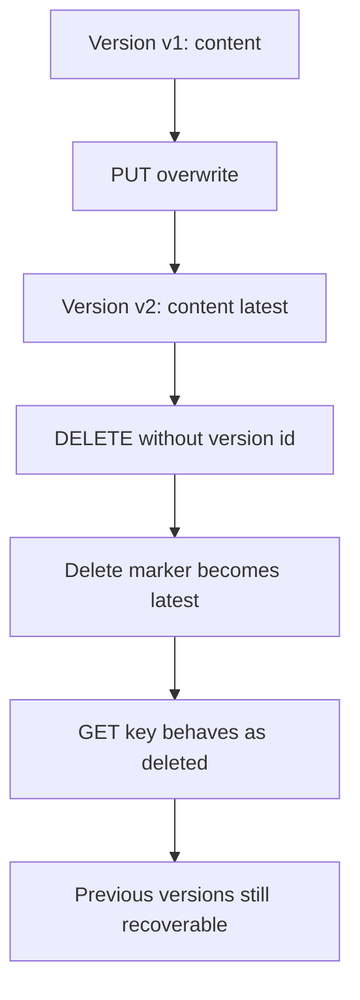
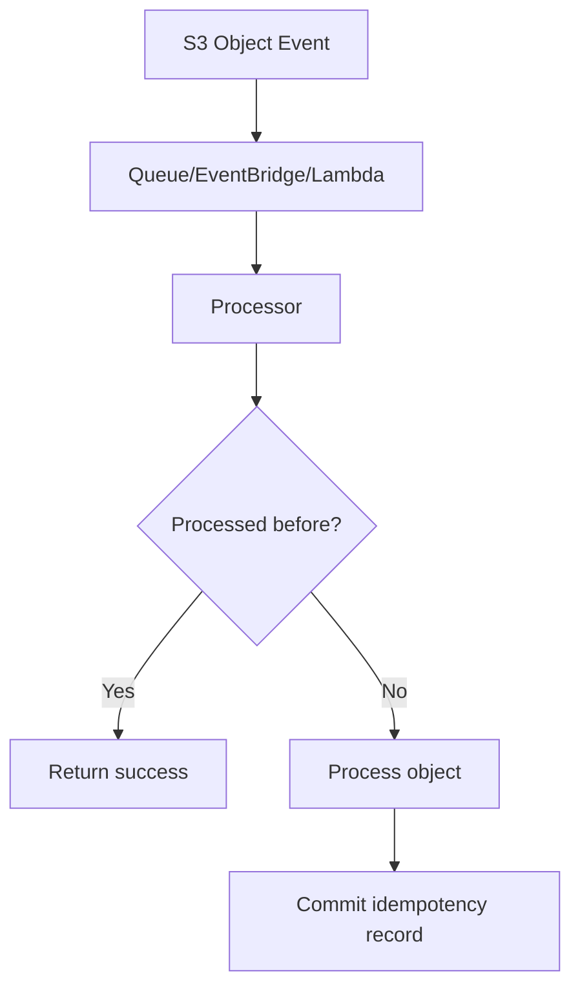
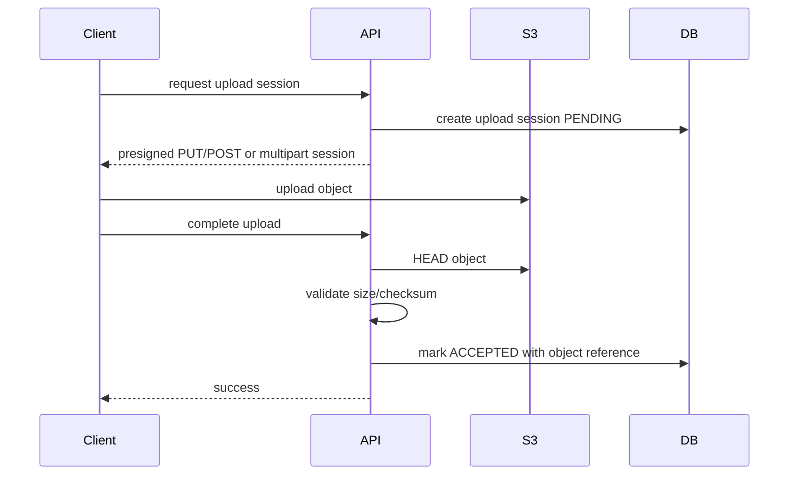

# Part 043 — S3 Consistency and Application Semantics

S3 is strongly consistent.

That does not mean your application is automatically correct.

This distinction matters.

Amazon S3 provides strong read-after-write consistency for object PUT and DELETE requests in all AWS Regions. This applies to writes of new objects, overwrites of existing objects, deletes, and read operations such as GET, HEAD, LIST, object tags, ACLs, and metadata.

That removes an entire class of older S3 design workarounds.

But strong consistency is not:

- a transaction across multiple objects
- a relational constraint
- a queue guarantee
- exactly-once event processing
- an append-only log protocol
- a lock service
- a workflow state machine
- a replacement for idempotency
- a substitute for manifest/catal​​og design

S3 can tell you what object state exists now. It cannot tell your application what that state means.

This part is about the boundary between storage consistency and application semantics.

---

## 1. Problem yang Diselesaikan

Part ini menjawab:

- Apa yang dijamin oleh S3 strong consistency?
- Apa yang tidak dijamin?
- Bagaimana overwrite dan delete bekerja secara production semantics?
- Bagaimana versioning mengubah delete/restore behavior?
- Bagaimana menggunakan conditional writes untuk mencegah overwrite tidak sengaja?
- Bagaimana membuat multi-object output terlihat atomic secara aplikasi?
- Bagaimana mendesain idempotent S3 write/read/event processor?
- Mengapa S3 event notification harus dianggap at-least-once dan possibly out-of-order?
- Bagaimana menghindari exactly-once illusion?
- Bagaimana menyusun runbook untuk duplicate processing, stale state, partial dataset, dan accidental overwrite?

---

## 2. Mental Model

### 2.1 Consistency is visibility; semantics is meaning

Consistency answers:

```text
After a successful write, what will a later read/list observe?
```

Semantics answers:

```text
What does that observed object mean for the business workflow?
```

Example:

```text
s3://bucket/jobs/job-123/part-0001.parquet exists
```

Strong consistency means readers can observe it after successful PUT.

It does not mean:

- job is complete
- all parts exist
- manifest is valid
- downstream may consume it
- processing is exactly once
- catalog is updated
- object content is business-valid

That meaning is owned by your application.

### 2.2 Object-level consistency is not group-level atomicity

One object can be strongly visible.

A group of objects is still a workflow.



The fix is not weaker listing. The fix is explicit commit semantics.

### 2.3 S3 has object operations, not directory transactions

There is no cheap atomic rename of a directory:

```text
processing/job-123/* -> processed/job-123/*
```

That is not one metadata move. It is copy/delete across objects.

So do not build correctness on "move folder when done."

Use:

- attempt-scoped output
- manifest object
- catalog state
- commit marker
- immutable data + mutable pointer

### 2.4 Idempotency is the application-level consistency layer

Retries are normal:

- client timeout after successful PUT
- SDK retry
- Lambda retry
- S3 event duplicate
- worker crash after writing output
- network failure before response observed
- job scheduler retry

Idempotency lets the system repeat an operation without changing the final logical outcome.

For S3 workflows, idempotency often needs:

- deterministic key
- content checksum
- attempt ID
- version ID where available
- catalog record with uniqueness constraint
- manifest commit protocol
- conditional write
- processed-event table

---

## 3. What S3 Strong Consistency Gives You

### 3.1 Write visibility

After successful object write:

- GET sees the object
- HEAD sees metadata
- LIST includes the object
- object tag/ACL/metadata reads are consistent after changes

This simplifies write-then-read workflows.

Example:

```text
PUT object A
HEAD object A
GET object A
LIST prefix containing A
```

The system does not need to wait for eventual listing propagation.

### 3.2 Overwrite visibility

If you overwrite an existing key, later reads see the latest committed state according to S3 consistency semantics.

But application questions remain:

- Did you mean to overwrite?
- Who wrote last?
- Is previous content recoverable?
- Did downstream process both versions?
- Do caches know about the change?
- Did versioning capture the prior object?

### 3.3 Delete visibility

Delete operations are strongly consistent too.

But versioned buckets complicate meaning:

- unversioned delete physically removes the object
- versioned delete generally creates a delete marker
- previous versions may remain
- deleting a specific version permanently removes that version
- lifecycle may later expire noncurrent versions

So "deleted" can mean:

```text
not visible by default key lookup
```

not necessarily:

```text
all bytes are physically gone
```

### 3.4 LIST correctness

LIST reflects current object state consistently, but LIST is still not a database query.

LIST can answer:

```text
What keys currently exist under this prefix?
```

It should not be the main hot-path answer for:

```text
Which evidence objects are attached to case 9231 and visible to this user?
```

Use a catalog for business queries.

---

## 4. What S3 Strong Consistency Does Not Give You

### 4.1 Multi-object transaction

S3 does not provide:

```text
PUT object A
PUT object B
PUT object C
commit all or none
```

If A succeeds and B fails, your application owns recovery.

Pattern:

```text
write parts under attempt path
validate parts
write manifest last
catalog points only to committed manifest
```

### 4.2 Exactly-once event processing

S3 event notifications are designed for at-least-once delivery and are not guaranteed to arrive in event order.

Therefore event processors must handle:

- duplicates
- retries
- out-of-order events
- missing downstream side effects
- poison objects
- replay
- partial batch failure in downstream queues/functions

### 4.3 Compare-and-swap for arbitrary workflow

S3 supports conditional requests/writes for some object operations, such as using `If-None-Match` to prevent overwriting an existing object, or `If-Match` to check an object's ETag before writing/copying. This is useful, but it is not a general workflow transaction manager.

For complex state transitions, use a database or state machine.

### 4.4 Append

S3 objects are not appendable files in the normal filesystem sense.

To append records:

- buffer and write segment objects
- use Kinesis/MSK/SQS for event streams
- use a table format/log protocol
- write new object versions
- compact later

Do not repeatedly read/modify/write a growing object as a hot path.

### 4.5 Locks

S3 is not a lock service.

You can sometimes use conditional object creation as a coarse lock primitive, but this is usually inferior to DynamoDB conditional writes, Step Functions, database row locks, or dedicated coordination systems.

Use S3 for storage. Use coordination tools for coordination.

---

## 5. Object Write Semantics

### 5.1 Immutable write

Best default:

```text
write once under unique key
never modify object body
```

Example:

```text
blobs/sha256/b2/af/b2af31.../content
```

Benefits:

- simple caching
- safe retry if content-addressed
- easy audit
- simple replication
- simple restore
- no reader ambiguity
- no overwrite race

### 5.2 Idempotent immutable write

If key is content-addressed, repeated writes of same bytes to same key are logically safe.

But still consider:

- request cost
- concurrent writes
- checksum validation
- metadata differences
- conditional write to prevent conflicting content under same key

Pseudo-flow:

```text
sha256 = digest(content)
key = "blobs/sha256/<sha256>/content"
PUT key with If-None-Match: *
if 412 Precondition Failed:
    HEAD existing key
    verify checksum/size
    treat as success if identical
```

### 5.3 Conditional create

Use conditional create when object must not already exist:

```text
PUT key
If-None-Match: *
```

Outcomes:

| Result | Meaning |
|---|---|
| 2xx | object created |
| 412 Precondition Failed | object already exists |
| 409 ConditionalRequestConflict | conflicting operation occurred; retry according to AWS guidance |
| 5xx/timeout | unknown; verify with HEAD/GET/catalog |

This is useful for:

- upload session object
- manifest object
- idempotency marker
- lock-like marker with caution
- "first writer wins" data

### 5.4 Conditional update

Use `If-Match` only when object ETag semantics are appropriate for your object and operation.

Caution:

- ETag is not always a simple MD5, especially with multipart upload or encryption contexts.
- For business state, a database version column is usually clearer.
- For pointer objects, a tiny JSON pointer with conditional update can work if failure handling is careful.

### 5.5 Mutable pointer object

A common safe mutation pattern:

```text
immutable/release-001/app.tar
immutable/release-002/app.tar
current.json
```

`current.json` changes. The artifact does not.

Pointer content:

```json
{
  "releaseId": "release-002",
  "artifactKey": "immutable/release-002/app.tar",
  "sha256": "..."
}
```

Rules:

- pointer is small
- pointer update is audited
- artifact is immutable
- rollback changes pointer
- consumers validate artifact checksum
- pointer caches have TTL/invalidation policy

### 5.6 Catalog as commit authority

For business systems, put commit authority in a database.

S3 stores object bytes:

```text
s3://bucket/blobs/sha256/b2/af/.../content
```

Catalog stores business acceptance:

```sql
evidence_id
case_id
blob_key
sha256
state
created_at
accepted_by
retention_policy
```

The user-visible state comes from catalog, not from bucket listing.

---

## 6. Delete Semantics

### 6.1 Unversioned delete

In an unversioned bucket:

```text
DELETE key
```

removes the object from normal access.

Risks:

- accidental delete is hard to recover unless backup/replication exists
- delete and recreate same key can confuse event processors/caches
- audit may not know which object version existed before

Use unversioned buckets mostly for disposable data, attempts, temp objects, or datasets with external recovery.

### 6.2 Versioned delete

In versioning-enabled buckets:

```text
DELETE key
```

usually creates a delete marker. Previous versions remain.



To undelete:

- list versions
- remove delete marker
- or copy a previous version to a new current version

### 6.3 Specific version delete

Deleting a specific version ID is a permanent action for that version.

Lifecycle `NoncurrentVersionExpiration` can also permanently delete noncurrent versions. Once permanently removed, they cannot be recovered from S3 versioning.

Therefore lifecycle on versioned buckets is a recovery policy, not only a cost policy.

### 6.4 Delete as business event

Do not equate physical delete with business delete.

For regulated systems, deletion may mean:

- hide from UI
- mark as revoked
- retain for audit
- legal hold
- retention expiration
- purge after approval
- delete all versions after retention

Represent this in business state.

S3 lifecycle and versioning implement physical object management after business policy decides.

---

## 7. Multi-Object Workflow Semantics

### 7.1 The partial dataset problem

A batch job writes 100 output files.

If downstream lists the prefix while the job is still writing, it can consume partial output.

Bad consumer:

```text
LIST s3://bucket/output/job-123/
READ all files found
```

Safe consumer:

```text
READ manifest for committed job version
READ only files listed in manifest
```

### 7.2 Attempt-scoped output

Write retries to different paths:

```text
jobs/job-123/attempt-001/part-0001
jobs/job-123/attempt-001/part-0002
jobs/job-123/attempt-001/_manifest.json

jobs/job-123/attempt-002/part-0001
jobs/job-123/attempt-002/part-0002
jobs/job-123/attempt-002/_manifest.json
```

Do not let attempts overwrite each other.

### 7.3 Manifest as commit object

Manifest is written last.

A manifest should include:

- job ID
- attempt ID
- input object references
- input versions/checksums where available
- output object references
- output sizes/checksums
- schema version
- producer version
- creation time
- status
- row/object counts if relevant

Example:

```json
{
  "manifestVersion": 1,
  "jobId": "job-123",
  "attemptId": "attempt-002",
  "producer": "evidence-normalizer/4.8.2",
  "inputs": [
    {
      "bucket": "raw",
      "key": "incoming/upload-17/content",
      "versionId": "abc",
      "sha256": "..."
    }
  ],
  "outputs": [
    {
      "bucket": "processed",
      "key": "jobs/job-123/attempt-002/part-0001.json",
      "sizeBytes": 99182,
      "sha256": "..."
    }
  ],
  "committedAt": "2026-07-06T03:00:00Z"
}
```

### 7.4 Catalog points to manifest

Final commit:

```text
UPDATE job_catalog
SET committed_manifest_key = 'jobs/job-123/attempt-002/_manifest.json',
    state = 'COMMITTED'
WHERE job_id = 'job-123'
  AND state IN ('RUNNING', 'RETRYING')
```

Consumers query catalog. They do not list attempts.

### 7.5 Failed attempts lifecycle

Failed attempts should expire automatically.

Prefix:

```text
processing-attempts/
```

Lifecycle:

- abort incomplete multipart uploads
- expire failed attempts after N days
- retain manifests/logs for debugging if needed
- do not expire committed manifests before retention requirement

---

## 8. Event Semantics

### 8.1 S3 events are triggers, not source-of-truth workflow state

An S3 event says:

```text
something happened to an object
```

It should not be the only record that your business process depends on.

Use events to trigger work. Use durable state to record work.

### 8.2 At-least-once processing

Design event processor as at-least-once:



Idempotency key should include:

- bucket
- key
- version ID if present
- event name
- sequencer or eTag/checksum where appropriate
- processor name/version if needed

### 8.3 Duplicate event runbook

If duplicate output appears:

1. Inspect event source.
2. Confirm whether same bucket/key/version produced multiple events.
3. Check idempotency table.
4. Check output key deterministic/idempotent.
5. Check retry path.
6. Check downstream database uniqueness.
7. Replay event into fixed processor after patch.

### 8.4 Out-of-order events

Possible sequence:

```text
PUT v1
PUT v2
event for v2 arrives
event for v1 arrives later
```

If processor ignores versioning/sequencer, it can regress state.

Use:

- object version ID
- event sequencer if available
- catalog version column
- monotonic state transition rules
- reject stale event based on known latest version

### 8.5 Event loop hazard

Do not configure a processor to write output into the same prefix that triggers itself unless filters prevent loops.

Bad:

```text
incoming/ -> Lambda -> writes incoming/processed.json
```

Better:

```text
incoming/ -> Lambda -> writes processed/
```

or filter by suffix/prefix carefully.

---

## 9. Exactly-Once Illusions

### 9.1 "S3 event fired once"

No. Treat events as at-least-once and unordered.

### 9.2 "PUT succeeded exactly once"

Client may time out after S3 accepted the write. Retry may write again. With same immutable key, this can be safe. With mutable key, it can corrupt workflow semantics.

### 9.3 "LIST found all objects, so job is done"

LIST can consistently show current objects. It does not know job completeness.

### 9.4 "DELETE means data is gone"

Versioned buckets can retain older versions. Replication and backups can retain copies. Object Lock can prevent deletion.

### 9.5 "ETag is checksum"

ETag is not always a simple MD5 of object content, especially with multipart uploads. For critical integrity, use explicit checksum fields or your own digest stored in metadata/catalog.

---

## 10. Implementation Patterns

### 10.1 Safe object upload flow



User-visible success happens after durable object validation and catalog commit.

### 10.2 Idempotent upload completion

```java
UploadResult completeUpload(CompleteUploadCommand cmd) {
    String idempotencyKey = cmd.uploadSessionId();

    return idempotencyStore.runOnce(idempotencyKey, () -> {
        HeadObjectResponse head = s3.headObject(b -> b
            .bucket(cmd.bucket())
            .key(cmd.key()));

        if (head.contentLength() != cmd.expectedSizeBytes()) {
            throw new UploadValidationException("size mismatch");
        }

        // Prefer explicit checksum validation for critical records.
        catalog.acceptUpload(
            cmd.caseId(),
            cmd.evidenceId(),
            cmd.bucket(),
            cmd.key(),
            cmd.expectedSha256(),
            cmd.expectedSizeBytes()
        );

        return new UploadResult(cmd.evidenceId(), "ACCEPTED");
    });
}
```

### 10.3 Conditional create with AWS SDK concept

Pseudo-code:

```java
try {
    s3.putObject(req -> req
            .bucket(bucket)
            .key(key)
            .ifNoneMatch("*")
            .checksumSHA256(checksum),
        requestBody);
} catch (PreconditionFailedException alreadyExists) {
    HeadObjectResponse existing = s3.headObject(r -> r.bucket(bucket).key(key));
    verifyExistingObject(existing, expectedSize, expectedChecksum);
}
```

### 10.4 Manifest commit

```java
void commitAttempt(JobAttempt attempt) {
    List<OutputObject> outputs = validateOutputs(attempt.outputKeys());

    Manifest manifest = new Manifest(
        attempt.jobId(),
        attempt.attemptId(),
        attempt.inputRefs(),
        outputs,
        Instant.now()
    );

    String manifestKey = attempt.manifestKey();

    putJsonIfAbsent(bucket, manifestKey, manifest);

    jobCatalog.commitManifest(
        attempt.jobId(),
        attempt.attemptId(),
        manifestKey
    );
}
```

### 10.5 Event processor idempotency

```java
void handle(ObjectCreatedEvent event) {
    String key = String.join(":",
        event.bucket(),
        event.objectKey(),
        event.versionId().orElse(""),
        event.eventName()
    );

    if (!processedEvents.tryStart(key)) {
        return;
    }

    try {
        ObjectRef ref = new ObjectRef(
            event.bucket(),
            event.objectKey(),
            event.versionId().orElse(null)
        );

        process(ref);
        processedEvents.markSucceeded(key);
    } catch (Exception ex) {
        processedEvents.markFailed(key, ex);
        throw ex;
    }
}
```

### 10.6 Stale event guard

```java
void applyObjectEvent(S3ObjectEvent event) {
    CatalogRecord current = catalog.get(event.businessId());

    if (event.versionOrdinal() < current.latestVersionOrdinal()) {
        metrics.increment("s3_event_stale");
        return;
    }

    catalog.applyIfNewer(event.businessId(), event.versionOrdinal(), event.objectRef());
}
```

If S3 version ID ordering is not suitable for your workflow, maintain your own logical version in the catalog.

---

## 11. Failure Modes and Debugging

### 11.1 Accidental overwrite

Symptoms:

- object content unexpectedly changed
- old output gone from normal GET
- downstream reprocessed object
- cache inconsistency

Triage:

```bash
aws s3api list-object-versions \
  --bucket "$BUCKET" \
  --prefix "$KEY"
```

Check:

- bucket versioning status
- writer identity in CloudTrail
- object version IDs
- event notifications
- catalog history
- deployment that changed key generation

Fix:

- restore previous version if available
- switch to immutable key
- add conditional create
- enforce `If-None-Match` via bucket policy where appropriate
- add catalog uniqueness constraint

### 11.2 Partial dataset consumed

Symptoms:

- downstream count mismatch
- missing partitions
- query inconsistent
- consumers read prefix before job completion

Fix:

- stop prefix-scanning consumer
- identify committed manifest if any
- isolate partial attempt path
- republish manifest only after validation
- add lifecycle cleanup for failed attempts
- update consumer contract to read manifest/catalog

### 11.3 Duplicate event processing

Symptoms:

- duplicate DB rows
- duplicate output objects
- duplicate user notification
- processor logs show same object event multiple times

Fix:

- idempotency table keyed by bucket/key/version/event
- conditional output writes
- database uniqueness constraints
- deterministic output key
- safe replay tests

### 11.4 Delete marker confusion

Symptoms:

- object appears missing
- old versions still consume cost
- undelete works unexpectedly
- lifecycle seems not to delete data

Triage:

```bash
aws s3api list-object-versions \
  --bucket "$BUCKET" \
  --prefix "$KEY"
```

Look for:

- DeleteMarkers
- IsLatest
- VersionId
- LastModified
- StorageClass

Fix:

- remove delete marker to undelete if allowed
- add noncurrent version expiration if permanent cleanup required
- add lifecycle for expired object delete markers
- update operational docs

### 11.5 Event loop

Symptoms:

- Lambda invocation storm
- bucket request spike
- repeated processing of processor output
- cost spike

Fix:

- disable event notification temporarily
- move output prefix
- add event filter
- add idempotency guard
- separate input/output buckets if needed

---

## 12. Operational Runbook

### 12.1 "Object exists but application says missing"

Check:

1. Correct bucket/Region?
2. Correct key exact string?
3. Versioning/delete marker?
4. Catalog state?
5. Permission issue masked as missing?
6. KMS access issue?
7. Object written under attempt path?
8. Manifest committed?
9. Lifecycle expired current version?
10. Replication destination lag/failure?

Commands:

```bash
aws s3api head-object --bucket "$BUCKET" --key "$KEY"

aws s3api list-object-versions --bucket "$BUCKET" --prefix "$KEY"
```

### 12.2 "Object overwritten"

Check:

1. Versioning enabled?
2. Previous version available?
3. CloudTrail PutObject writer?
4. Any CopyObject operation?
5. Conditional write missing?
6. Key generation collision?
7. Retry path reused key?
8. Multiple writers?

Immediate mitigation:

- disable writer if still active
- restore previous version if needed
- patch key generator
- add conditional write
- add catalog uniqueness constraint

### 12.3 "Processing duplicated"

Check:

1. Duplicate S3 event?
2. Queue redelivery?
3. Lambda retry?
4. Processor timeout after side effect?
5. Output key deterministic?
6. Idempotency table?
7. DB uniqueness?
8. Manifest commit repeated?

Immediate mitigation:

- pause processor
- identify idempotency gap
- dedupe downstream state
- replay from durable source after fix

### 12.4 "Lifecycle deleted needed data"

Check:

1. Current version or noncurrent version deleted?
2. Delete marker involved?
3. Object Lock/retention?
4. Replication/backups?
5. S3 Inventory?
6. CloudTrail lifecycle events where available?
7. Rule prefix/tag filter?
8. Recent lifecycle rule change?

Immediate mitigation:

- disable suspect lifecycle rule
- restore from version/backup/replica
- correct rule and add lifecycle simulation/test

---

## 13. Design Checklist

### 13.1 For every write path

- [ ] Is key immutable?
- [ ] If mutable, why?
- [ ] Is overwrite prevented where needed?
- [ ] Is conditional write used where appropriate?
- [ ] Is checksum stored and validated?
- [ ] Is user-visible success after durable validation?
- [ ] Is catalog commit idempotent?
- [ ] Can client retry safely?
- [ ] Is object version ID stored when useful?

### 13.2 For every multi-object workflow

- [ ] Attempt path is unique.
- [ ] Manifest is written last.
- [ ] Consumer reads manifest/catalog, not raw prefix.
- [ ] Failed attempts expire.
- [ ] Output objects include checksum/size.
- [ ] Commit is idempotent.
- [ ] Retry cannot mix attempts.
- [ ] Partial output is invisible to consumers.

### 13.3 For every event processor

- [ ] Assumes duplicate events.
- [ ] Assumes out-of-order events.
- [ ] Has durable idempotency store.
- [ ] Uses bucket/key/version/event as identity.
- [ ] Handles poison objects.
- [ ] Has DLQ/replay plan.
- [ ] Avoids event loop.
- [ ] Emits duplicate/stale metrics.

### 13.4 For every delete path

- [ ] Business delete and physical delete are separate.
- [ ] Versioning behavior is understood.
- [ ] Delete markers are monitored if versioning is enabled.
- [ ] Noncurrent version lifecycle is intentional.
- [ ] Retention/Object Lock rules are respected.
- [ ] Restore path is tested.
- [ ] Permanent deletes require explicit authorization.

---

## 14. Mini Case Study — Duplicate Evidence Normalization

### 14.1 Incident

A document processing pipeline receives S3 ObjectCreated events for uploaded PDF evidence.

Observed:

- some evidence records processed twice
- duplicate normalized JSON objects
- duplicate "evidence ready" notifications
- downstream UI shows two processing histories

### 14.2 Broken design

Processor logic:

```text
on S3 event:
  normalize object
  write processed/<caseId>/<evidenceId>.json
  insert processing_history row
  send notification
```

Problems:

- assumes event arrives once
- no idempotency table
- output key overwritten on retry
- notification sent outside durable state transition
- no manifest/attempt ID
- no version ID stored

### 14.3 Fixed design

Event identity:

```text
bucket + key + versionId + eventName
```

Attempt output:

```text
processing/evidence-normalizer/job=<job-id>/attempt=<attempt-id>/output.json
processing/evidence-normalizer/job=<job-id>/attempt=<attempt-id>/_manifest.json
```

Catalog transition:

```sql
UPDATE evidence_processing
SET state = 'NORMALIZED',
    committed_manifest_key = ?,
    normalized_at = ?
WHERE evidence_id = ?
  AND state IN ('ACCEPTED', 'RETRYING');
```

Notification sent from committed state transition, not raw event handler.

### 14.4 New invariant

```text
An S3 event may happen more than once.
The business transition may commit only once.
```

---

## 15. Summary

S3 strong consistency is valuable. It makes object visibility predictable.

But it does not remove distributed-systems design.

You still need:

- immutable object keys
- conditional writes where overwrite must be prevented
- versioning-aware delete/restore semantics
- manifests for multi-object outputs
- catalogs for business state
- idempotency for retries/events
- replay-safe processors
- lifecycle-aware recovery design

The core rule:

> Treat S3 consistency as a storage guarantee, then build application semantics explicitly on top.

Next, we move to S3 storage classes and lifecycle policies: how to choose storage class, model access frequency, avoid retrieval surprises, manage noncurrent versions, and design lifecycle rules that reduce cost without destroying recovery.

---

## References

- AWS S3 User Guide — Amazon S3 data consistency model: https://docs.aws.amazon.com/AmazonS3/latest/userguide/Welcome.html#ConsistencyModel
- AWS S3 User Guide — Conditional writes: https://docs.aws.amazon.com/AmazonS3/latest/userguide/conditional-writes.html
- AWS S3 User Guide — Conditional requests: https://docs.aws.amazon.com/AmazonS3/latest/userguide/conditional-requests.html
- AWS S3 User Guide — S3 Versioning: https://docs.aws.amazon.com/AmazonS3/latest/userguide/Versioning.html
- AWS S3 User Guide — How S3 Versioning works: https://docs.aws.amazon.com/AmazonS3/latest/userguide/versioning-workflows.html
- AWS S3 User Guide — Managing delete markers: https://docs.aws.amazon.com/AmazonS3/latest/userguide/ManagingDelMarkers.html
- AWS S3 User Guide — Event notification ordering and duplicate events: https://docs.aws.amazon.com/AmazonS3/latest/userguide/notification-how-to-event-types-and-destinations.html
- AWS S3 User Guide — Multipart upload overview: https://docs.aws.amazon.com/AmazonS3/latest/userguide/mpuoverview.html
