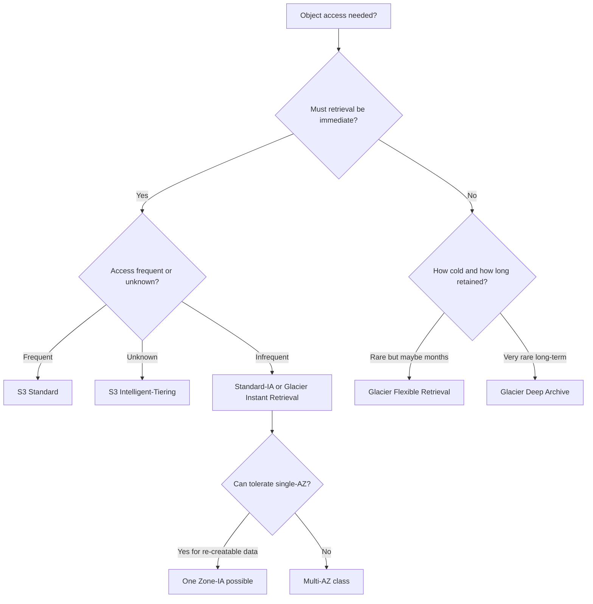
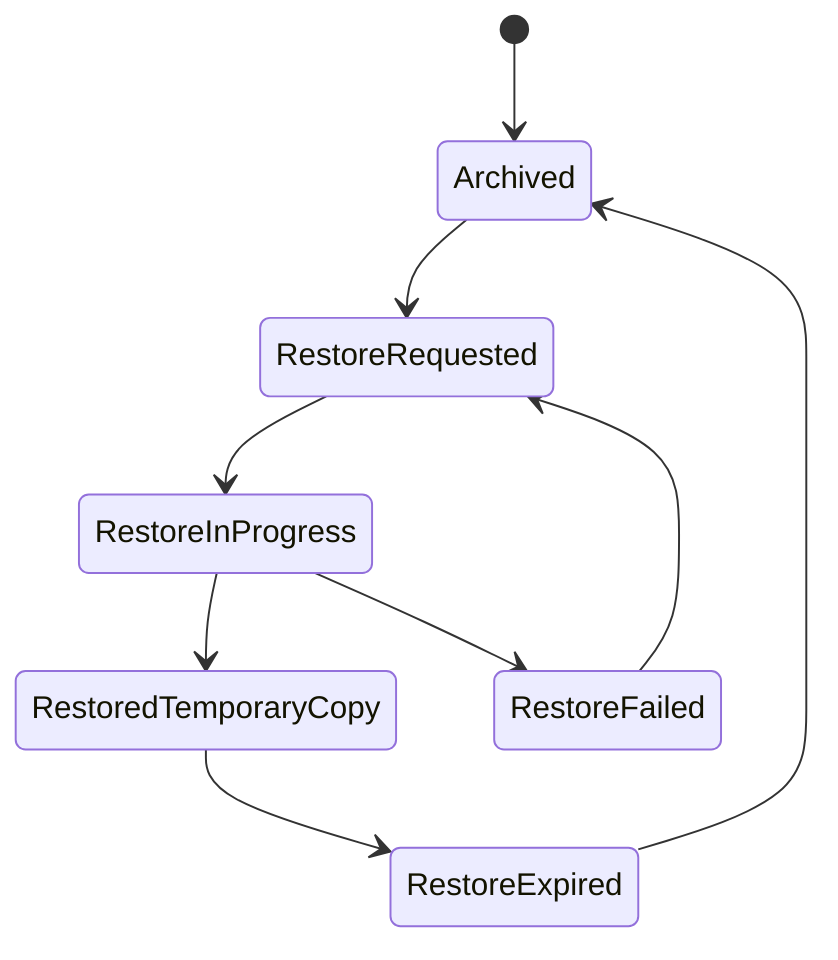

# Part 044 — S3 Storage Classes and Lifecycle Policy

Storage class is not a price label.

Lifecycle policy is not a cleanup script.

Together, they are a long-running production contract between:

- access frequency
- retrieval latency
- durability and availability target
- minimum storage duration
- request and retrieval cost
- retention requirement
- recovery expectation
- compliance policy
- data ownership
- object versioning
- operational runbook

A lifecycle rule can save money quietly.

It can also delete your recovery path quietly.

This part explains how to reason about S3 storage classes and lifecycle rules as an engineering system.

---

## 1. Problem yang Diselesaikan

Part ini menjawab:

- Kapan memakai S3 Standard, Intelligent-Tiering, Standard-IA, One Zone-IA, Glacier Instant Retrieval, Glacier Flexible Retrieval, Glacier Deep Archive?
- Apa yang harus dipikirkan selain biaya per GB?
- Bagaimana lifecycle transition dan expiration bekerja?
- Apa bahaya lifecycle pada bucket versioned?
- Bagaimana menangani noncurrent versions dan delete markers?
- Bagaimana menghindari incomplete multipart upload cost leak?
- Bagaimana menghitung storage class berdasarkan access pattern dan restore requirement?
- Bagaimana menulis lifecycle policy yang aman untuk raw, processed, attempts, backup, dan archive?
- Bagaimana menyusun runbook untuk retrieval surprise, lifecycle misconfiguration, dan cost spike?

---

## 2. Mental Model

### 2.1 Storage class is an access contract

When choosing a storage class, ask:

```text
When this object is needed, how fast must it be available?
How often is it expected to be read?
What happens if retrieval is slow or costly?
How long must it be retained?
Can it live in one AZ?
Is access pattern known or unknown?
Is it small?
Is it compliance-controlled?
Can lifecycle move it without breaking application assumptions?
```

Do not ask only:

```text
Which one is cheapest per GB?
```

### 2.2 Lifecycle is a policy engine over object age/state

Lifecycle rules apply actions to objects based on:

- prefix
- tags
- object size filters
- current object age
- noncurrent version age
- delete marker state
- incomplete multipart upload age

Actions include:

- transition current objects
- transition noncurrent versions
- expire current objects
- expire noncurrent versions
- remove expired object delete markers
- abort incomplete multipart uploads

Lifecycle is powerful because it runs continuously and automatically. That is also why it is dangerous.

### 2.3 Storage cost is not recovery cost

An archive object may be cheap to store but expensive or slow to restore.

A noncurrent version may be cheap compared to losing data.

A lifecycle rule that deletes failed attempts may be excellent.

A lifecycle rule that deletes noncurrent backup versions too early may destroy RPO.

The right metric:

```text
total cost of storing, accessing, recovering, auditing, and retaining data within SLO
```

### 2.4 Data class drives lifecycle

Classify objects first:

| Data class | Example | Lifecycle tendency |
|---|---|---|
| Hot source of truth | active evidence, current artifacts | Standard or Intelligent-Tiering |
| Unknown access | user uploads, documents, logs with unpredictable access | Intelligent-Tiering candidate |
| Infrequent but immediate access | monthly report, old case evidence | Standard-IA or Glacier Instant Retrieval |
| Re-creatable derivative | processed cache, normalized output | lower storage or expiration depending rebuild cost |
| Failed attempt | partial pipeline output | short expiration |
| Backup | database backup, EBS snapshot export | retention + possible Object Lock/archive |
| Long-term archive | closed case evidence after retention threshold | Glacier Flexible/Deep Archive if retrieval delay acceptable |

---

## 3. S3 Storage Class Landscape

### 3.1 S3 Standard

Use for:

- frequently accessed data
- active application objects
- current artifacts
- hot data lake partitions
- operationally critical objects needing immediate access
- unknown systems before access is measured

Properties:

- multi-AZ storage
- low latency
- high availability target
- no minimum storage duration penalty like IA/archive classes
- higher storage cost than colder classes

Production default:

> Start with Standard when correctness and access pattern are uncertain. Optimize after measurement.

### 3.2 S3 Intelligent-Tiering

Use for:

- unknown or changing access patterns
- objects with unpredictable read behavior
- long-lived data where manual lifecycle tuning is risky
- mixed hot/cold document stores
- case evidence with unpredictable audit/retrieval
- datasets that may be accessed after long quiet periods

S3 Intelligent-Tiering monitors access and moves objects between access tiers. It has a monitoring/automation charge. It can also optionally use archive access tiers for data that can be accessed asynchronously.

Production caveat:

- For very small objects, monitoring overhead may not be worth it.
- Optional archive tiers change retrieval behavior.
- Application must tolerate asynchronous retrieval if archive access tiers are enabled.
- Confirm whether object size and access pattern make it economical.

### 3.3 S3 Standard-IA

Use for:

- infrequently accessed data
- immediate retrieval required
- multi-AZ resilience desired
- objects large enough and retained long enough to justify IA economics

Good examples:

- older but still user-accessible documents
- monthly reports
- closed-but-queryable case attachments
- low-frequency restore data requiring milliseconds access

Cautions:

- retrieval charges
- minimum storage duration
- minimum billable object size considerations
- not ideal for tiny frequently touched objects

### 3.4 S3 One Zone-IA

Use only when single-AZ loss is acceptable.

Good examples:

- re-creatable secondary copies
- derived data
- non-critical infrequently accessed data
- replicas that can be regenerated from durable source

Avoid for:

- sole copy of critical data
- compliance evidence without other protection
- data with strict availability requirements
- backups where AZ-level loss must be survived

The name says the important part: One Zone.

### 3.5 S3 Glacier Instant Retrieval

Use for:

- archive-like data that still needs milliseconds retrieval
- quarterly accessed data
- long-lived documents with rare but immediate reads
- old evidence that may be retrieved interactively

Cautions:

- minimum storage duration
- retrieval charges
- not appropriate for frequent access

### 3.6 S3 Glacier Flexible Retrieval

Use for:

- archive data where retrieval can take minutes to hours
- backup copies
- compliance archives
- old closed-case documents
- data read rarely and asynchronously

Cautions:

- object not immediately available through normal GET until restored
- restore workflow required
- retrieval quotas and delays matter
- applications must expose "restore pending" state

### 3.7 S3 Glacier Deep Archive

Use for:

- very long-term archival
- annual or rarer access
- data where retrieval can take many hours
- low-cost compliance retention
- cold backup copies

Cautions:

- retrieval delay can be very long
- minimum storage duration is longer
- operational restore must be rehearsed
- not for urgent recovery unless RTO allows it

### 3.8 S3 Express One Zone note

S3 Express One Zone/directory buckets are a specialized high-performance storage class/architecture with different operational constraints. This series focuses the main lifecycle discussion on general purpose bucket storage classes. Use S3 Express One Zone only after explicit workload fit analysis: high request rate, low latency, and single-AZ placement trade-off.

---

## 4. Decision Framework

### 4.1 First decision: can access be delayed?



### 4.2 Second decision: is this the only copy?

| Only copy? | Storage class implication |
|---|---|
| Yes, critical | Prefer multi-AZ class, versioning/backup/replication as needed |
| Yes, non-critical | Still define deletion/recovery explicitly |
| No, re-creatable | One Zone-IA or expiration may be acceptable |
| No, replicated elsewhere | Optimize based on RTO/RPO and rebuild cost |

### 4.3 Third decision: what is the RTO?

| RTO | Candidate |
|---|---|
| milliseconds | Standard, Intelligent-Tiering Frequent/IA, Standard-IA, One Zone-IA, Glacier Instant Retrieval |
| minutes to hours | Glacier Flexible Retrieval |
| many hours to days | Glacier Deep Archive |
| rebuild from source acceptable | expire/recompute or lower class |

### 4.4 Fourth decision: object size and request shape

Small objects can make cheaper storage classes less attractive.

Consider:

- minimum billable object size
- monitoring charge
- per-object lifecycle overhead
- request charges
- retrieval charges
- transition charges
- minimum storage duration penalties

If object is tiny and accessed unpredictably, Standard may be simpler and cheaper operationally.

---

## 5. Lifecycle Policy Design

### 5.1 Lifecycle rule anatomy

Lifecycle rule needs:

- ID
- status
- filter: prefix/tags/size
- transition action
- expiration action
- noncurrent version actions
- abort incomplete multipart upload action
- expired object delete marker action

Example conceptual rule:

```json
{
  "Rules": [
    {
      "ID": "expire-processing-attempts",
      "Status": "Enabled",
      "Filter": {
        "Prefix": "processing-attempts/"
      },
      "Expiration": {
        "Days": 7
      },
      "AbortIncompleteMultipartUpload": {
        "DaysAfterInitiation": 1
      }
    }
  ]
}
```

### 5.2 Separate lifecycle by prefix

Recommended high-level layout:

```text
raw/
processed/
processing-attempts/
manifests/
exports/
backups/
archive/
```

Each prefix should have one clear owner and retention logic.

Bad:

```text
files/
```

where raw evidence, temp files, exports, and backups all mix.

### 5.3 Lifecycle for failed attempts

Good candidate for expiration:

```text
processing-attempts/
```

Policy:

- expire after 7–30 days depending debug needs
- abort incomplete multipart uploads quickly
- never put committed source of truth under this prefix
- include attempt ID in key
- preserve failed manifest/logs if required

### 5.4 Lifecycle for raw source

Raw source is often the highest-value data.

Policy examples:

- keep in Standard for active period
- move to Intelligent-Tiering after N days if unpredictable
- move to Glacier Instant/Flexible after case closes and active appeal window ends
- Object Lock/retention if compliance requires
- replicate before archive if DR requires
- never delete solely based on upload date if business retention depends on case state

Important:

> Business retention often depends on domain state, not just object age.

### 5.5 Lifecycle for processed derivatives

Processed outputs may be:

- cheaper to keep than rebuild
- cheaper to rebuild than keep
- legally derived records that must be retained
- cached artifacts that can expire

Decide per derivative.

Questions:

- Can it be rebuilt?
- From which input versions?
- With which code version?
- How long does rebuild take?
- Is old output needed for audit?
- Is schema evolution backward compatible?

### 5.6 Lifecycle for backups

Backup lifecycle is recovery policy.

A backup object lifecycle should encode:

- short-term fast restore tier
- medium-term lower-cost tier
- long-term archive tier
- noncurrent version policy
- Object Lock if ransomware/compliance protection required
- cross-account/cross-region copy if needed
- tested restore path

Never set backup lifecycle only from cost pressure.

### 5.7 Abort incomplete multipart uploads

Multipart uploads can leave uploaded parts if not completed or aborted. Lifecycle can abort incomplete multipart uploads after a configured number of days.

This is one of the safest lifecycle rules when scoped correctly.

Recommended:

- enable abort incomplete multipart uploads on buckets/prefixes using multipart
- choose low number of days for temp/upload sessions
- monitor incomplete multipart upload count/bytes
- ensure long-running uploads are not killed prematurely

---

## 6. Versioning and Lifecycle

### 6.1 Versioning changes lifecycle meaning

In versioned buckets:

- current version
- noncurrent versions
- delete markers
- expired object delete markers
- incomplete multipart uploads

all need separate policy consideration.

### 6.2 Current expiration with versioning

If versioning is enabled, expiring current object generally adds a delete marker rather than removing all data. Older versions can remain as noncurrent versions.

This can surprise teams:

```text
We expired objects but storage cost did not drop.
```

Because noncurrent versions still exist.

### 6.3 Noncurrent version expiration

Noncurrent version expiration permanently deletes older versions.

This is recovery-critical.

Questions:

- How many old versions are needed?
- For how long?
- Is accidental overwrite recovery required?
- Does compliance require retention?
- Are object versions large?
- Do old versions contain sensitive data that must eventually purge?
- Is Object Lock involved?

### 6.4 Delete marker cleanup

Delete markers can accumulate.

Lifecycle can remove expired object delete markers, but be careful with semantics.

Before enabling:

- understand versioning state
- test with sample keys
- ensure no active restore workflow depends on marker
- monitor delete marker count

### 6.5 Lifecycle test cases

For every lifecycle rule on versioned bucket, test:

| Case | Expected |
|---|---|
| current object only | transition/expire correct |
| object with old noncurrent version | old version retained/deleted as intended |
| delete marker latest | cleanup correct |
| object under legal hold | not deleted improperly |
| incomplete multipart upload | aborted after threshold |
| object smaller than filter | not transitioned if excluded |
| object with missing tag | safe default |

---

## 7. Terraform Patterns

### 7.1 Standard bucket baseline

```hcl
resource "aws_s3_bucket" "data" {
  bucket = var.bucket_name

  tags = {
    Service     = var.service
    Environment = var.environment
    DataOwner   = var.data_owner
  }
}

resource "aws_s3_bucket_versioning" "data" {
  bucket = aws_s3_bucket.data.id

  versioning_configuration {
    status = "Enabled"
  }
}
```

### 7.2 Lifecycle for attempts

```hcl
resource "aws_s3_bucket_lifecycle_configuration" "attempts" {
  bucket = aws_s3_bucket.data.id

  rule {
    id     = "expire-processing-attempts"
    status = "Enabled"

    filter {
      prefix = "processing-attempts/"
    }

    expiration {
      days = 14
    }

    abort_incomplete_multipart_upload {
      days_after_initiation = 1
    }
  }
}
```

### 7.3 Lifecycle for noncurrent versions

```hcl
resource "aws_s3_bucket_lifecycle_configuration" "versions" {
  bucket = aws_s3_bucket.data.id

  rule {
    id     = "retain-noncurrent-versions"
    status = "Enabled"

    filter {
      prefix = "raw/"
    }

    noncurrent_version_transition {
      noncurrent_days = 30
      storage_class   = "STANDARD_IA"
    }

    noncurrent_version_expiration {
      noncurrent_days = 365
    }
  }
}
```

This is only an example. Do not copy it without mapping it to retention/RPO requirements.

### 7.4 Lifecycle with tags

```hcl
resource "aws_s3_bucket_lifecycle_configuration" "archive" {
  bucket = aws_s3_bucket.data.id

  rule {
    id     = "archive-closed-cases"
    status = "Enabled"

    filter {
      tag {
        key   = "retention-class"
        value = "closed-case-archive"
      }
    }

    transition {
      days          = 90
      storage_class = "GLACIER_IR"
    }

    transition {
      days          = 365
      storage_class = "DEEP_ARCHIVE"
    }
  }
}
```

Tag-based lifecycle requires tag enforcement at write/update time.

---

## 8. Application Patterns

### 8.1 Active documents

Pattern:

```text
raw/cases/<case-id>/evidence/<evidence-id>/content
```

Lifecycle:

- Standard while case active
- Intelligent-Tiering after active period if unpredictable
- archive only after business state permits delayed retrieval
- Object Lock if compliance requires immutability
- catalog stores retention policy and state

Avoid lifecycle based only on object age if case can remain active longer than expected.

### 8.2 Processing attempts

Pattern:

```text
processing-attempts/job=<job-id>/attempt=<attempt-id>/*
```

Lifecycle:

- expire after debug window
- abort incomplete multipart uploads
- no versioning required unless audit needs
- output not consumed unless manifest committed elsewhere

### 8.3 Data lake partitions

Pattern:

```text
lake/table=<table>/dt=2026-07-06/hour=03/part-0001.parquet
```

Lifecycle:

- hot recent partitions in Standard
- older partitions Intelligent-Tiering/IA/archive depending query SLA
- compaction before transition
- table metadata aware of archived partitions
- queries do not accidentally scan restored/cold data without intention

### 8.4 Exports

Pattern:

```text
exports/tenant=<tenant-id>/export=<export-id>/file.zip
```

Lifecycle:

- expire after download window
- retain manifest longer if audit needed
- avoid archive if export must be immediately downloadable
- notify user before expiration if product requirement

### 8.5 Backups

Pattern:

```text
backups/system=<name>/dt=<date>/backup=<id>/manifest.json
backups/system=<name>/dt=<date>/backup=<id>/chunks/*
```

Lifecycle:

- fast restore tier for recent backups
- archive older backups
- Object Lock/cross-account for critical backups
- manifest retained with chunks
- restore tested before deleting older backup generations

---

## 9. Cost Modeling

### 9.1 Cost dimensions

Model:

```text
monthly_cost =
    storage_gb_month
  + put_copy_post_list_requests
  + get_head_requests
  + lifecycle_transition_requests
  + retrieval_requests
  + retrieval_data
  + replication_cost
  + monitoring_automation_cost
  + inventory_analytics_cost
  + data_transfer
  + operational recovery cost
```

### 9.2 Access probability model

For each object class:

```text
expected_monthly_read_cost =
    object_count * read_probability * read_request_cost
  + bytes_read * retrieval_data_cost
```

For archive:

```text
expected_recovery_impact =
    restore_delay * business_impact
  + restore_request_cost
  + operational_runbook_cost
```

Do not put active data into archive because storage GB-month is cheap.

### 9.3 Minimum storage duration

Some classes have minimum duration economics. If you delete or transition too early, you may still pay minimum duration charges.

Design lifecycle transitions only after objects are likely to live long enough.

### 9.4 Small object economics

For tiny objects:

- monitoring fees can dominate
- request cost can dominate
- lifecycle transition may not pay off
- minimum object size billing can matter
- compaction may save more than class transition

### 9.5 Cost anomaly examples

| Symptom | Likely cause |
|---|---|
| storage cost grows despite expiration | noncurrent versions/delete markers remain |
| request cost spike | LIST/HEAD loop, retry storm, tiny objects |
| retrieval cost spike | IA/archive object read unexpectedly |
| lifecycle transition cost spike | too many tiny objects transitioned |
| multipart cost leak | incomplete multipart uploads not aborted |
| archive restore delay incident | app did not know objects were archived |

---

## 10. Retrieval and Restore Semantics

### 10.1 Immediate vs asynchronous retrieval

Immediate access classes support normal GET.

Archive classes like Glacier Flexible Retrieval and Deep Archive require restore before normal access. The object remains archived; restore creates a temporary accessible copy for a configured period.

Application must model:

- restore requested
- restore in progress
- restore complete
- restore expired
- restore failed
- user notification
- retry policy
- retrieval priority/tier

### 10.2 Restore workflow



### 10.3 Application UI/API implications

For archived objects:

- do not return generic 500
- expose "restore required"
- show estimated availability window
- prevent repeated duplicate restore requests
- queue restore requests
- notify user when ready
- cache restored availability in catalog
- respect retrieval quotas

### 10.4 Disaster recovery implication

If your RTO is one hour, do not put the only backup copy in a class that may take many hours to restore.

Use tiering:

- recent backups in Standard/IA
- older backups in Glacier Flexible
- long-term compliance in Deep Archive

---

## 11. Observability

### 11.1 Metrics to track

Per bucket/prefix/data class:

- object count
- total bytes
- current version bytes
- noncurrent version bytes
- delete marker count
- incomplete multipart upload bytes
- storage class distribution
- lifecycle transitions
- lifecycle expirations
- restore requests
- restore failures
- retrieval bytes
- request counts by operation
- 4xx/5xx
- top prefixes by size/request
- average object size
- small object count
- replication backlog if enabled

### 11.2 Tools

Use:

- S3 Storage Lens
- S3 Inventory
- CloudTrail data events where needed
- CloudWatch request metrics
- Cost and Usage Report
- AWS Budgets/anomaly detection
- application catalog reconciliation

### 11.3 Reconciliation

Periodically compare:

```text
catalog records <-> S3 Inventory
```

Find:

- catalog points to missing object
- object exists without catalog
- wrong storage class
- missing tags
- unexpected noncurrent versions
- incomplete multipart uploads
- unexpired failed attempts
- objects without encryption/retention metadata

---

## 12. Failure Modes

### 12.1 Lifecycle deletes needed data

Cause:

- prefix too broad
- tag missing/misapplied
- retention based on object age but business retention depends on case state
- noncurrent version expiration too aggressive
- lifecycle rule applied to backup prefix accidentally

Mitigation:

- disable rule
- restore from version/replica/backup if possible
- add lifecycle dry-run review via Inventory
- add approval for lifecycle rule changes
- separate prefixes by data class

### 12.2 Archive retrieval surprise

Cause:

- lifecycle transitioned active objects
- Intelligent-Tiering archive tier enabled without app awareness
- user expected immediate download
- restore workflow missing

Mitigation:

- expose restore state
- restore objects in batch
- update lifecycle policy
- keep active window longer
- do not enable archive tier for interactive objects unless product supports it

### 12.3 Noncurrent version cost explosion

Cause:

- versioning enabled on frequently overwritten keys
- lifecycle lacks noncurrent expiration
- delete markers accumulate
- app uses mutable object as state file

Mitigation:

- stop overwriting large keys
- use immutable objects + pointer
- add noncurrent version transition/expiration after retention review
- monitor version bytes
- clean expired delete markers carefully

### 12.4 Incomplete multipart upload leak

Cause:

- clients crash mid-upload
- multipart sessions never completed/aborted
- no lifecycle abort rule

Mitigation:

- add abort incomplete multipart upload lifecycle rule
- fix client completion/abort behavior
- monitor incomplete MPU bytes

### 12.5 Retrieval cost spike

Cause:

- application reads IA/archive class repeatedly
- analytics scans cold partitions
- accidental bulk restore
- retry storm

Mitigation:

- identify prefix/object class
- rate-limit reads
- move hot data back to Standard/Intelligent-Tiering
- add query guardrails
- educate consumers through data catalog

---

## 13. Operational Runbook

### 13.1 "Why did this object move storage class?"

Check:

```bash
aws s3api head-object --bucket "$BUCKET" --key "$KEY"
```

Look at:

- StorageClass
- LastModified
- tags
- lifecycle rules
- object size
- prefix
- object age
- version state

Then check:

```bash
aws s3api get-bucket-lifecycle-configuration --bucket "$BUCKET"
aws s3api get-object-tagging --bucket "$BUCKET" --key "$KEY"
```

### 13.2 "Why is object not immediately readable?"

Check:

- storage class
- restore status
- lifecycle transition
- Intelligent-Tiering archive access tier
- object version
- KMS permission
- bucket policy
- application cache

For archived object, initiate restore if authorized:

```bash
aws s3api restore-object \
  --bucket "$BUCKET" \
  --key "$KEY" \
  --restore-request '{"Days":7,"GlacierJobParameters":{"Tier":"Standard"}}'
```

### 13.3 "Why is bucket cost growing?"

Check:

- noncurrent version bytes
- object count
- small object count
- incomplete multipart uploads
- delete markers
- lifecycle transition backlog
- request metrics
- top prefixes
- replication copies
- Intelligent-Tiering monitoring charges

Use S3 Storage Lens and Inventory.

### 13.4 "How to change lifecycle safely?"

Safe procedure:

1. Identify data class and owner.
2. Export S3 Inventory sample.
3. Simulate rule match using prefix/tags/object age.
4. Review current/noncurrent/delete marker behavior.
5. Validate restore/RPO/RTO impact.
6. Apply rule to narrow prefix/tag first.
7. Monitor transition/expiration metrics.
8. Expand gradually.
9. Document rollback and restore plan.

### 13.5 Emergency disable

If lifecycle is actively damaging data:

1. Disable suspect rule.
2. Preserve inventory and evidence.
3. Identify affected keys/versions.
4. Restore from version/replica/backup.
5. Add guardrail tests.
6. Require review before re-enabling.

---

## 14. Design Checklist

### 14.1 Storage class decision

- [ ] Access frequency known or measured.
- [ ] Retrieval latency requirement defined.
- [ ] Retrieval cost understood.
- [ ] Minimum storage duration understood.
- [ ] Object size distribution considered.
- [ ] Single-AZ risk accepted if using One Zone-IA/Express One Zone.
- [ ] Archive restore workflow exists if using archive class.
- [ ] Interactive users will not hit async archive unexpectedly.
- [ ] RTO/RPO are compatible with class.

### 14.2 Lifecycle rule design

- [ ] Rule has owner.
- [ ] Rule has prefix/tag filter narrow enough.
- [ ] Data class documented.
- [ ] Business retention mapped.
- [ ] Versioning behavior reviewed.
- [ ] Noncurrent version policy explicit.
- [ ] Delete marker policy explicit.
- [ ] Incomplete multipart upload abort configured.
- [ ] Lifecycle tested against sample keys.
- [ ] Monitoring exists.

### 14.3 Backup/archive design

- [ ] Backup manifest retained.
- [ ] Chunks and manifest lifecycle aligned.
- [ ] Recent restore tier supports RTO.
- [ ] Long-term archive supports retention.
- [ ] Object Lock considered where needed.
- [ ] Cross-account/cross-region considered.
- [ ] KMS key access tested.
- [ ] Restore game day performed.
- [ ] Lifecycle does not delete before legal retention.

### 14.4 Cost optimization

- [ ] Optimize after measuring access pattern.
- [ ] Small object count understood.
- [ ] Request cost included.
- [ ] Retrieval cost included.
- [ ] Noncurrent version cost included.
- [ ] Transition cost included.
- [ ] Incomplete multipart uploads monitored.
- [ ] Cost anomaly alarms exist.

---

## 15. Mini Case Study — Closed Case Evidence Archive

### 15.1 Context

A regulatory case platform stores evidence documents in S3.

Requirements:

- active cases require immediate access
- closed cases rarely accessed
- some closed cases may be reopened
- evidence retained for 7 years
- legal hold can override normal lifecycle
- user-facing download must explain restore delay if archived
- audit must prove object was retained

### 15.2 Naive lifecycle

```text
Transition all evidence to Deep Archive after 30 days.
```

Failure:

- active long-running cases become archived
- investigators cannot download evidence immediately
- restore process missing
- legal hold not modeled
- case reopen takes too long
- support tickets spike

### 15.3 Better policy

Data classes:

```text
raw/active/
raw/closed/
raw/legal-hold/
processing-attempts/
manifests/
```

But status in prefix is dangerous if business status changes often. Better: stable object key plus catalog state and lifecycle tags.

Catalog:

```json
{
  "caseId": "case-9231",
  "evidenceId": "ev-17",
  "blobKey": "blobs/sha256/b2/af/.../content",
  "caseState": "CLOSED",
  "retentionClass": "closed-case-7y",
  "accessProfile": "rare-immediate-for-90d-then-async",
  "legalHold": false
}
```

Lifecycle tags:

```text
retention-class=closed-case-7y
archive-policy=async-after-180d
```

Policy:

- active evidence: Standard or Intelligent-Tiering without archive tier
- first 180 days after close: immediate-access class
- after 180 days: Glacier Flexible Retrieval if async restore acceptable
- legal hold: protected from expiration
- failed processing attempts: expire after 14 days
- incomplete multipart uploads: abort after 1–7 days
- restore workflow: catalog records restore state

### 15.4 Resulting invariant

```text
Lifecycle follows business retention, not raw object age alone.
```

That invariant prevents cost optimization from violating operational reality.

---

## 16. Summary

S3 storage classes and lifecycle policies are production controls.

Use them to optimize cost, retention, and recovery only after defining:

- data class
- access pattern
- retrieval latency
- RTO/RPO
- retention policy
- versioning behavior
- object size/request profile
- restore workflow
- ownership and monitoring

The core rule:

> A lifecycle rule is safe only when the objects it matches have the same retention, recovery, and access contract.

Next, we go deeper into S3 versioning, delete markers, and recovery: how to recover from accidental overwrite/delete, control noncurrent versions, reason about delete markers, and build object-level restore runbooks.

---

## References

- AWS S3 User Guide — Understanding and managing S3 storage classes: https://docs.aws.amazon.com/AmazonS3/latest/userguide/storage-class-intro.html
- AWS S3 User Guide — S3 Intelligent-Tiering: https://docs.aws.amazon.com/AmazonS3/latest/userguide/intelligent-tiering-overview.html
- AWS S3 User Guide — S3 Glacier storage classes: https://docs.aws.amazon.com/AmazonS3/latest/userguide/glacier-storage-classes.html
- AWS S3 User Guide — Understanding archive retrieval options: https://docs.aws.amazon.com/AmazonS3/latest/userguide/restoring-objects-retrieval-options.html
- AWS S3 User Guide — Managing object lifecycle: https://docs.aws.amazon.com/AmazonS3/latest/userguide/object-lifecycle-mgmt.html
- AWS S3 User Guide — Lifecycle configuration elements: https://docs.aws.amazon.com/AmazonS3/latest/userguide/intro-lifecycle-rules.html
- AWS S3 User Guide — Transitioning objects using lifecycle: https://docs.aws.amazon.com/AmazonS3/latest/userguide/lifecycle-transition-general-considerations.html
- AWS S3 User Guide — Expiring objects: https://docs.aws.amazon.com/AmazonS3/latest/userguide/lifecycle-expire-general-considerations.html
- AWS S3 User Guide — Abort incomplete multipart uploads with lifecycle: https://docs.aws.amazon.com/AmazonS3/latest/userguide/mpu-abort-incomplete-mpu-lifecycle-config.html
- AWS S3 User Guide — S3 Storage Lens: https://docs.aws.amazon.com/AmazonS3/latest/userguide/storage_lens.html
