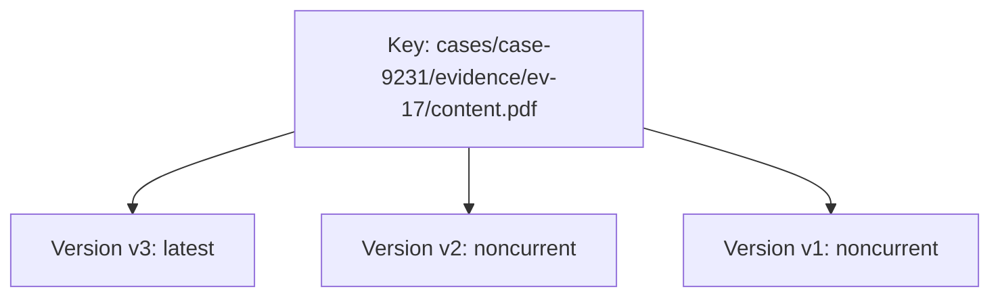
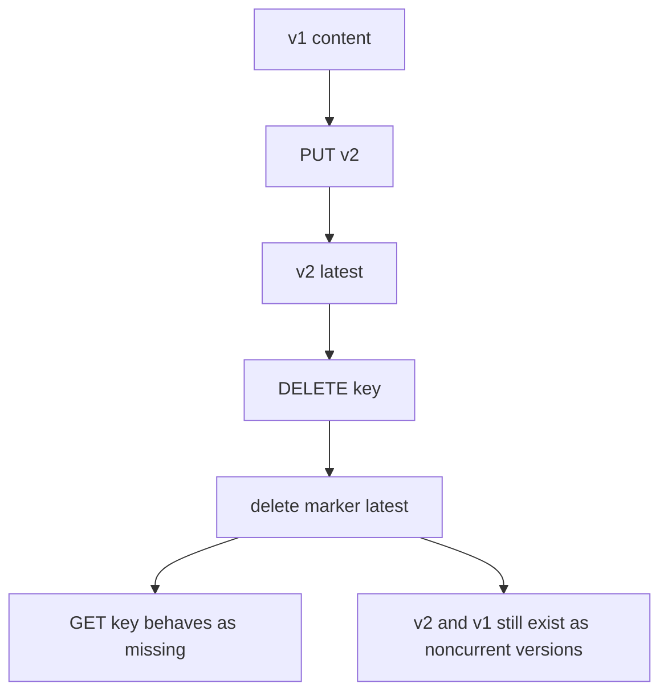
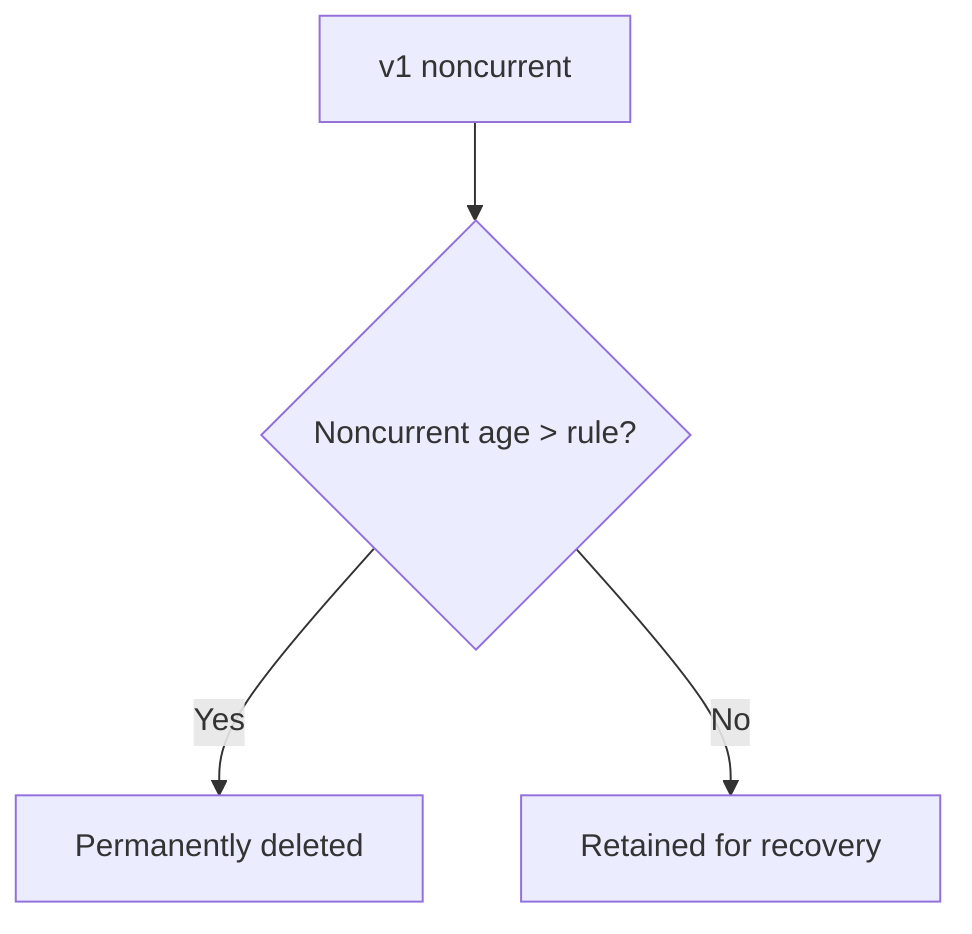

# Part 045 — S3 Versioning, Delete Marker, and Recovery

S3 versioning is one of the simplest features to enable and one of the easiest features to misunderstand.

Versioning does not mean your data can never be lost.

Versioning means S3 can retain multiple variants of an object under the same key. That gives you a recovery surface for accidental overwrite and accidental delete. But recovery still depends on lifecycle rules, permissions, Object Lock, replication behavior, KMS access, catalog design, and operational discipline.

The common production failure is this:

```text
"We enabled versioning, so we thought we were safe."
```

Then the team discovers:

- lifecycle permanently deleted noncurrent versions
- delete markers hid objects from normal reads
- costs exploded because versions accumulated
- rollback restored bytes but not catalog state
- KMS permissions blocked recovery
- replication copied the wrong thing
- Object Lock prevented intended cleanup
- nobody knew the version ID to restore

This part treats S3 versioning as a recovery system, not a checkbox.

---

## 1. Problem yang Diselesaikan

Kita akan membahas:

- apa yang terjadi saat versioning enabled, suspended, atau disabled
- bagaimana overwrite berubah menjadi noncurrent version
- bagaimana delete marker bekerja
- bagaimana restore previous version
- bagaimana undelete object dengan menghapus delete marker
- bagaimana lifecycle berinteraksi dengan current dan noncurrent versions
- bagaimana mencegah version-cost explosion
- bagaimana Object Lock berbeda dari versioning
- bagaimana menulis runbook accidental delete/overwrite
- bagaimana mendesain catalog yang version-aware
- bagaimana recovery diuji, bukan diasumsikan

---

## 2. Mental Model

### 2.1 Key is stable; versions change

Without versioning, a key points to one current object value.

With versioning, a key points to a history of versions.



A normal `GET key` returns the latest version unless the latest version is a delete marker.

A version-aware `GET key?versionId=...` can retrieve a specific version if it still exists and caller is authorized.

### 2.2 Delete marker is a tombstone, not necessarily data destruction

In a versioning-enabled bucket, deleting an object without specifying version ID usually creates a delete marker.



To undelete, remove the delete marker if policy allows.

### 2.3 Noncurrent version is recovery inventory

A noncurrent version is not waste by default. It is recovery inventory.

But recovery inventory has cost.

You need policy:

```text
How many old versions?
For how long?
For which prefixes?
For which data class?
Who can permanently delete them?
Can lifecycle delete them?
Can Object Lock protect them?
Can recovery role decrypt them?
```

### 2.4 Versioning protects from some mistakes, not all mistakes

Versioning helps with:

- accidental overwrite
- accidental delete marker
- rollback to previous bytes
- audit of object mutation
- recovery from bad writer

Versioning does not automatically solve:

- lifecycle deleting noncurrent versions
- malicious actor deleting specific versions if allowed
- KMS key deletion/permission loss
- catalog state corruption
- application using wrong version
- multi-object transaction rollback
- regulatory retention without Object Lock
- cross-account recovery permission gaps

### 2.5 Versioning changes delete semantics and cost semantics

Versioning makes delete safer, but storage cost can grow.

If an application repeatedly overwrites a large object:

```text
state.json
state.json
state.json
state.json
```

S3 can retain many old versions.

This may be good for audit. It may also be a hidden cost leak and poor architecture. Often the better pattern is immutable versioned keys plus a small pointer/catalog update.

---

## 3. Versioning States

### 3.1 Unversioned

Original state for a bucket before versioning is enabled.

Behavior:

- key has one value
- overwrite replaces it
- delete removes it
- recovery depends on backups/replication/logs, not S3 version history

Use for:

- disposable attempt outputs
- temp data
- cache-like objects
- data where external recovery exists

Avoid for:

- critical source of truth
- user uploads
- compliance evidence
- backups requiring object-level rollback

### 3.2 Enabled

When enabled:

- new object writes receive version IDs
- overwrites create new versions
- previous versions become noncurrent
- delete without version ID creates delete marker
- specific version delete can permanently remove that version
- lifecycle must account for noncurrent versions

Use for:

- important application objects
- evidence/document storage
- backup manifests
- release artifacts
- data where accidental overwrite/delete recovery matters

### 3.3 Suspended

Suspended is not the same as disabled.

Once versioning has been enabled, you can suspend it. Existing versions remain. New writes may use a null version behavior. This creates subtle semantics and should be treated carefully.

Production guidance:

- avoid toggling versioning casually
- document versioning state in IaC
- alert on versioning status change
- do not suspend versioning on critical buckets without data-owner approval

---

## 4. Write and Overwrite Behavior

### 4.1 New object write

In a versioned bucket:

```text
PUT key -> creates version v1
```

### 4.2 Overwrite

```text
PUT same key -> creates version v2
```

Now:

- v2 is current
- v1 is noncurrent

This is useful for rollback.

But if overwrites are frequent and object is large, noncurrent storage grows quickly.

### 4.3 Safer alternative: immutable key + pointer

Instead of overwriting:

```text
reports/current/report.pdf
```

use:

```text
reports/versions/report-2026-07-06T03-00-00Z.pdf
reports/current.json
```

`current.json` is small and versioned. Large report versions are explicit.

### 4.4 Conditional write

If overwrite is not allowed, use conditional create:

```text
If-None-Match: *
```

This prevents accidental overwrite at object level.

Still store business uniqueness in a catalog/database.

### 4.5 Store version IDs in catalog

For critical objects, catalog should store:

```json
{
  "bucket": "evidence-prod",
  "key": "blobs/sha256/b2/af/.../content",
  "versionId": "3HL4kqtJlcpXroDTDmJ+rmSpXd3dIbrHY",
  "sha256": "...",
  "sizeBytes": 928371
}
```

Why?

- exact restore
- exact audit
- exact replication validation
- disambiguation after overwrite
- KMS/access testing against specific version

---

## 5. Delete Behavior

### 5.1 Delete current key without version ID

In a versioned bucket:

```bash
aws s3api delete-object --bucket "$BUCKET" --key "$KEY"
```

typically creates a delete marker.

Normal read:

```bash
aws s3api head-object --bucket "$BUCKET" --key "$KEY"
```

may behave as missing because the latest version is a delete marker.

### 5.2 Undelete by removing delete marker

List versions:

```bash
aws s3api list-object-versions \
  --bucket "$BUCKET" \
  --prefix "$KEY"
```

Find latest delete marker, then delete that delete marker by version ID:

```bash
aws s3api delete-object \
  --bucket "$BUCKET" \
  --key "$KEY" \
  --version-id "$DELETE_MARKER_VERSION_ID"
```

Now previous content version becomes current again.

### 5.3 Delete specific version

This is dangerous.

```bash
aws s3api delete-object \
  --bucket "$BUCKET" \
  --key "$KEY" \
  --version-id "$CONTENT_VERSION_ID"
```

That specific version is permanently removed unless protected by Object Lock/legal hold or another copy exists.

Guardrail:

- restrict `s3:DeleteObjectVersion`
- use MFA Delete where operationally feasible
- use Object Lock for compliance-grade immutability
- monitor DeleteObjectVersion activity
- separate recovery admin role from application writer role

### 5.4 Delete marker accumulation

Delete markers can accumulate, especially when:

- application repeatedly deletes same keys
- lifecycle expiration creates delete markers
- no expired delete marker cleanup
- versioned bucket used for temp data

Delete markers consume storage and can confuse operators.

Use S3 Storage Lens/Inventory to observe them.

---

## 6. Lifecycle and Versioning

### 6.1 Current expiration can create delete marker

Lifecycle `Expiration` on a versioned bucket generally does not immediately remove all bytes. It can make the current version noncurrent and add a delete marker.

This is why cost may not drop after lifecycle expiration.

### 6.2 Noncurrent version expiration is permanent

Lifecycle `NoncurrentVersionExpiration` permanently removes noncurrent versions.

That is a recovery policy.



If lifecycle deletes the only recoverable old version, versioning cannot help you.

### 6.3 Noncurrent version transition

You can transition noncurrent versions to colder storage.

This can reduce cost while preserving rollback capability, but restore may be slower if version is in archive class.

For critical rollback:

- keep recent noncurrent versions in immediate-access class
- archive older versions only if RTO allows
- test restore of archived noncurrent version

### 6.4 Expired object delete marker cleanup

Lifecycle can clean up expired object delete markers when no noncurrent versions remain. This helps remove tombstones after all data versions are gone.

Be careful:

- test with representative version histories
- understand whether delete marker is meaningful for application
- do not hide recovery state from operators

### 6.5 Lifecycle policy matrix

| Prefix | Versioning | Current expiration | Noncurrent expiration | Notes |
|---|---|---:|---:|---|
| `raw/` | Enabled | business-controlled | after retention review | source of truth |
| `processed/` | Optional | depends rebuild/audit | depends rebuild/audit | derivative |
| `processing-attempts/` | Often off or short | 7–30 days | short | disposable |
| `backups/` | Enabled/Object Lock | per retention | per retention | restore-critical |
| `artifacts/` | Enabled | long/explicit | controlled | rollback |
| `exports/` | optional | short | short | user download window |

---

## 7. Object Lock Boundary

### 7.1 Versioning vs Object Lock

Versioning retains multiple versions.

Object Lock can prevent object versions from being deleted or overwritten for a retention period or legal hold.

Important:

- Object Lock works on object versions.
- Bucket must have Object Lock enabled for using Object Lock retention.
- Governance mode can be bypassed by principals with specific permission.
- Compliance mode is stricter and cannot be shortened/removed by normal users, including root, before retention expires.
- Legal hold prevents deletion until removed by authorized principal.

### 7.2 When Object Lock is appropriate

Use for:

- compliance evidence
- regulated records
- immutable audit logs
- ransomware-resilient backups
- legal hold requirements
- WORM retention

Avoid casual use for:

- temp data
- high-churn mutable objects
- data with uncertain retention policy
- objects that may need quick deletion due to privacy obligations unless policy is clear

### 7.3 Object Lock failure mode

Object Lock mistakes can be irreversible for the retention period.

Examples:

- retention too long
- wrong prefix receives locked objects
- test data locked in production bucket
- legal hold not removed after legal process
- lifecycle cannot delete locked objects
- cost grows because objects cannot expire

Design retention with legal/compliance approval.

---

## 8. Recovery Patterns

### 8.1 Recover accidental delete

Situation:

- object key returns 404/missing
- bucket has versioning enabled
- delete marker is latest

Steps:

```bash
aws s3api list-object-versions \
  --bucket "$BUCKET" \
  --prefix "$KEY"
```

Find latest delete marker.

Remove marker:

```bash
aws s3api delete-object \
  --bucket "$BUCKET" \
  --key "$KEY" \
  --version-id "$DELETE_MARKER_VERSION_ID"
```

Validate:

```bash
aws s3api head-object --bucket "$BUCKET" --key "$KEY"
```

Update catalog if catalog state also changed.

### 8.2 Recover accidental overwrite

Situation:

- current object content is wrong
- previous version exists

Options:

1. Copy previous version over current key.
2. Update catalog/pointer to reference previous version/key.
3. Create new correction object under immutable key.

Copy previous version to become latest:

```bash
aws s3api copy-object \
  --bucket "$BUCKET" \
  --key "$KEY" \
  --copy-source "$BUCKET/$KEY?versionId=$GOOD_VERSION_ID"
```

Validate checksum/size.

### 8.3 Recover catalog pointer

Sometimes S3 object is correct but catalog points to wrong version.

Steps:

1. List object versions.
2. Identify intended version by checksum/time/writer.
3. Validate object.
4. Update catalog under transaction.
5. Re-run downstream reconciliation.

### 8.4 Bulk undelete

For a bad delete operation affecting many keys:

1. Stop writer/deleter.
2. Preserve CloudTrail/request logs.
3. Generate affected key list from logs, Inventory, or version listing.
4. For each key, identify latest delete marker after incident time.
5. Remove delete marker if policy allows.
6. Validate catalog and application visibility.
7. Create incident artifact: keys, versions, restore time, failures.

Do not blindly remove every delete marker in a bucket.

### 8.5 Restore after lifecycle transition

If previous version exists but is in archive class:

1. Initiate restore for the specific version if needed.
2. Wait for restore completion.
3. Copy restored version to current or update catalog.
4. Keep restored copy available long enough for recovery.
5. Revisit lifecycle RTO assumptions.

---

## 9. Catalog Design for Versioning

### 9.1 Store exact object reference

For critical records:

```json
{
  "bucket": "regulatory-evidence-prod",
  "key": "blobs/sha256/b2/af/.../content",
  "versionId": "abc123",
  "sha256": "b2af31...",
  "sizeBytes": 928371,
  "kmsKeyId": "arn:aws:kms:...",
  "retentionClass": "regulatory-evidence-7y"
}
```

### 9.2 Store business state separately

Do not rely on object deletion as business state.

Use:

```text
ACCEPTED
REVOKED
REDACTED
DELETED_PENDING_RETENTION
PURGED
LEGAL_HOLD
```

Object lifecycle follows business policy.

### 9.3 Store recovery metadata

For important objects:

- first seen time
- writer principal
- source request ID
- checksum
- object version ID
- replication destination
- retention policy
- Object Lock retention date
- legal hold state
- last recovery test result

### 9.4 Reconciliation

Periodic reconciliation:

```text
catalog object refs -> S3 HEAD object/version
S3 Inventory -> catalog ownership
version count -> expected mutation profile
delete markers -> expected delete operations
noncurrent bytes -> expected recovery budget
```

---

## 10. IAM and Guardrails

### 10.1 Separate write, delete, and permanent delete

Application writer role may need:

- `s3:PutObject`
- `s3:GetObject`
- maybe `s3:DeleteObject` for temp prefixes

It usually should not have:

- `s3:DeleteObjectVersion`
- lifecycle configuration permissions
- bucket versioning change permission
- Object Lock bypass governance retention
- KMS key administration

### 10.2 Protect bucket configuration

Restrict:

- `s3:PutBucketVersioning`
- `s3:PutLifecycleConfiguration`
- `s3:DeleteBucket`
- `s3:PutBucketObjectLockConfiguration`
- `s3:PutReplicationConfiguration`

Bucket config is production infrastructure, not application runtime.

### 10.3 Monitoring

Alert on:

- bucket versioning suspended
- lifecycle rule changed
- large spike in delete markers
- large spike in noncurrent version bytes
- DeleteObjectVersion events
- Object Lock retention changes
- KMS key scheduled deletion/disabled
- replication failures for versioned objects

---

## 11. Cost Control

### 11.1 Version cost drivers

- frequent overwrites of large objects
- noncurrent versions retained forever
- delete markers accumulating
- lifecycle expiration creating markers but not removing versions
- Object Lock preventing deletion
- archive retrieval of old versions
- replicated versions in destination buckets

### 11.2 Cost dashboard

Track:

- current version bytes
- noncurrent version bytes
- delete marker count
- object count by prefix
- version count per key percentile
- top keys by version count
- lifecycle transition count
- noncurrent version expiration count
- Object Lock retained bytes

### 11.3 Design to avoid version explosion

Prefer:

```text
objects/versions/<id>
current.json
```

over repeatedly overwriting:

```text
objects/current
```

For mutable tiny pointer objects, versioning is often acceptable. For large mutable files, use immutable versions.

---

## 12. Operational Runbooks

### 12.1 Object missing but should exist

1. Check bucket and key.
2. Check permissions/KMS.
3. List versions.
4. Look for delete marker.
5. Look for lifecycle expiration.
6. Look for specific version in catalog.
7. Check replication destination.
8. Check Object Lock/legal hold if deletion expected.
9. Restore by removing delete marker or copying previous version.

### 12.2 Wrong object content

1. HEAD current object.
2. Validate checksum/size.
3. List previous versions.
4. Identify good version.
5. Copy good version to current or update catalog.
6. Stop bad writer.
7. Add conditional write/immutable key fix.
8. Reprocess downstream consumers if necessary.

### 12.3 Noncurrent cost spike

1. Identify top prefixes by noncurrent bytes.
2. Identify keys with many versions.
3. Determine whether overwrites are expected.
4. Review lifecycle noncurrent policy.
5. Confirm retention/RPO requirement.
6. Add transition/expiration if safe.
7. Change application to immutable key + pointer if needed.

### 12.4 Bad lifecycle rule

1. Disable rule immediately.
2. Export affected object list.
3. Determine current/noncurrent/delete marker impact.
4. Restore from versions/replicas/backups.
5. Add test cases for lifecycle changes.
6. Require data owner approval for re-enable.

---

## 13. Failure Modes

### 13.1 Versioning enabled but lifecycle deletes recovery

Symptom:

- object was overwritten
- previous version expected
- noncurrent version already expired

Fix:

- restore from replica/backup if available
- increase noncurrent retention
- add lifecycle review
- add recovery game day

### 13.2 Delete marker hides object

Symptom:

- GET key returns missing
- list versions shows older content versions
- latest is delete marker

Fix:

- remove delete marker
- update catalog state
- investigate deleter

### 13.3 Application sees old version after rollback

Symptom:

- object restored
- app still points to wrong version in catalog/cache

Fix:

- update catalog pointer
- invalidate cache/CDN
- record version ID
- re-run consumers

### 13.4 Permanent version delete

Symptom:

- specific version removed
- cannot recover from versioning

Fix:

- restore from replication/backup
- restrict `DeleteObjectVersion`
- consider Object Lock
- alert on permanent version delete

### 13.5 KMS prevents restore

Symptom:

- object version exists
- restore/read fails AccessDenied/KMS

Fix:

- verify KMS key policy
- verify recovery role has `kms:Decrypt`
- check key disabled/deletion state
- test cross-account recovery access

---

## 14. Game Day Scenarios

### Scenario 1 — Accidental delete

Inject:

```text
delete object without version ID
```

Expected:

- delete marker created
- app detects missing object
- operator lists versions
- delete marker removed
- object restored
- incident timeline recorded

### Scenario 2 — Bad overwrite

Inject:

```text
overwrite object with bad content
```

Expected:

- previous version found
- checksum validates
- good version restored or catalog pointer updated
- downstream duplicate/reprocess handled

### Scenario 3 — Lifecycle too aggressive

Inject in non-prod:

```text
noncurrent version expiration too short
```

Expected:

- monitoring detects version loss risk
- rule disabled
- lifecycle test fails
- change blocked before prod

### Scenario 4 — KMS recovery failure

Inject:

```text
recovery role lacks kms:Decrypt
```

Expected:

- object exists but recovery fails
- runbook identifies KMS
- key policy fixed
- recovery test passes

---

## 15. Checklist

### 15.1 Versioning readiness

- [ ] Versioning enabled on critical buckets.
- [ ] Versioning status managed by IaC.
- [ ] Alert on suspension.
- [ ] Application stores version ID for critical objects.
- [ ] Conditional writes used where overwrite must not happen.
- [ ] Catalog separates business state from object existence.
- [ ] Restore previous version tested.
- [ ] Delete marker recovery tested.

### 15.2 Lifecycle safety

- [ ] Noncurrent version policy documented.
- [ ] Noncurrent expiration matches RPO/retention.
- [ ] Delete marker cleanup understood.
- [ ] Lifecycle rule sample-tested.
- [ ] Object Lock interaction understood.
- [ ] Backup/replica exists for irreversible actions.
- [ ] Data owner approves lifecycle changes.

### 15.3 IAM safety

- [ ] Application role cannot delete object versions unless required.
- [ ] Lifecycle config changes restricted.
- [ ] Versioning config changes restricted.
- [ ] KMS recovery role tested.
- [ ] Object Lock bypass restricted.
- [ ] DeleteObjectVersion events monitored.

### 15.4 Recovery operations

- [ ] Runbook for accidental delete.
- [ ] Runbook for accidental overwrite.
- [ ] Runbook for bulk restore.
- [ ] Runbook for KMS recovery failure.
- [ ] S3 Inventory or equivalent audit available.
- [ ] Recovery game day executed.

---

## 16. Mini Case Study — Accidental Evidence Deletion

### 16.1 Incident

An operator runs a cleanup script with broad prefix:

```bash
aws s3 rm s3://evidence-prod/cases/2026/07/ --recursive
```

Application reports missing evidence for active cases.

### 16.2 Why data survives

Bucket versioning is enabled. The delete operation created delete markers for affected keys.

Content versions still exist.

### 16.3 Recovery

Steps:

1. Stop cleanup credentials.
2. Identify affected keys from CloudTrail and S3 version listing.
3. For each key, find delete marker after incident start.
4. Delete the delete marker.
5. Validate object HEAD and checksum.
6. Reconcile catalog state.
7. Add guardrail: cleanup role cannot delete under `raw/active/`.
8. Add lifecycle and cleanup dry-run approval.

### 16.4 Better long-term design

- cleanup only touches `processing-attempts/`
- raw evidence bucket has Object Lock/retention where required
- app role cannot delete object versions
- cleanup role cannot touch source-of-truth prefix
- catalog stores object version IDs
- recovery game day runs quarterly

### 16.5 Invariant

```text
A cleanup job may delete only data whose owner, retention, and rebuild path are explicit.
```

---

## 17. Summary

S3 versioning is a recovery primitive, not a complete recovery strategy.

Use it with:

- version-aware catalog
- strict IAM boundaries
- lifecycle policy review
- noncurrent version monitoring
- delete marker runbooks
- conditional writes
- Object Lock where immutability is legally required
- tested restore procedures

The core rule:

> Versioning gives you history. Recovery requires knowing which history to restore, whether it still exists, and whether the application state agrees.

Next, we move to S3 replication and multi-region data: Cross-Region Replication, Same-Region Replication, replication lag, delete behavior, KMS, ownership, failover, and recovery patterns.

---

## References

- AWS S3 User Guide — S3 Versioning: https://docs.aws.amazon.com/AmazonS3/latest/userguide/Versioning.html
- AWS S3 User Guide — How S3 Versioning works: https://docs.aws.amazon.com/AmazonS3/latest/userguide/versioning-workflows.html
- AWS S3 User Guide — Working with delete markers: https://docs.aws.amazon.com/AmazonS3/latest/userguide/DeleteMarker.html
- AWS S3 User Guide — Managing delete markers: https://docs.aws.amazon.com/AmazonS3/latest/userguide/ManagingDelMarkers.html
- AWS S3 User Guide — Restoring previous versions: https://docs.aws.amazon.com/AmazonS3/latest/userguide/RestoringPreviousVersions.html
- AWS S3 User Guide — Deleting object versions from a versioning-enabled bucket: https://docs.aws.amazon.com/AmazonS3/latest/userguide/DeletingObjectVersions.html
- AWS S3 User Guide — S3 Object Lock: https://docs.aws.amazon.com/AmazonS3/latest/userguide/object-lock.html
- AWS S3 User Guide — Lifecycle expiration considerations: https://docs.aws.amazon.com/AmazonS3/latest/userguide/lifecycle-expire-general-considerations.html
