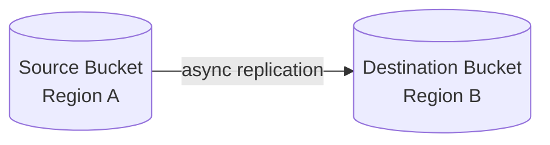
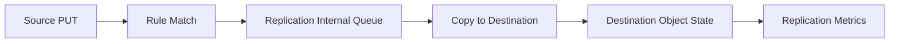
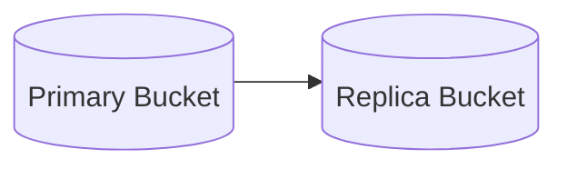
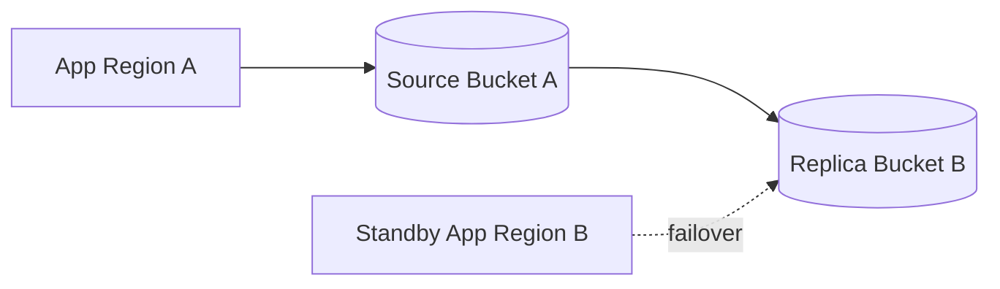
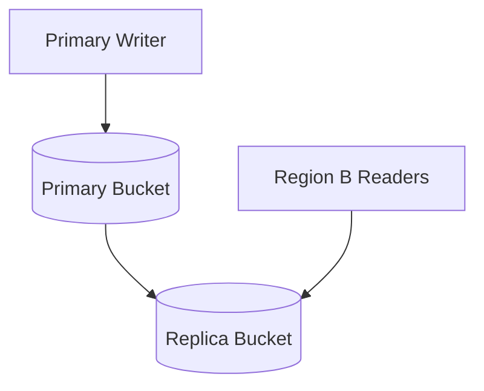
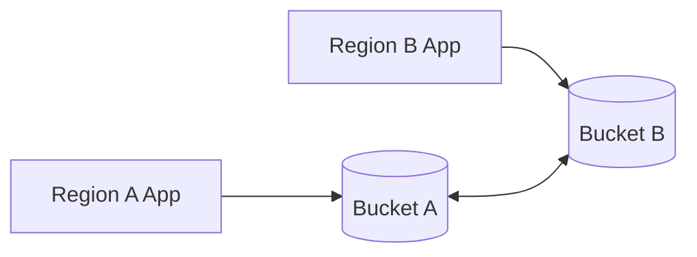
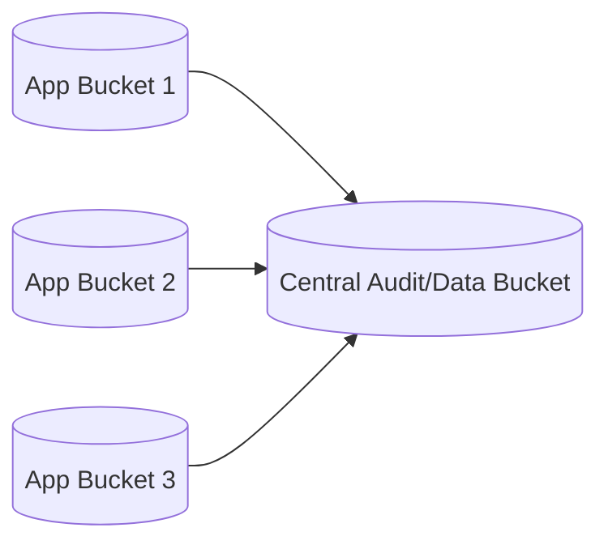
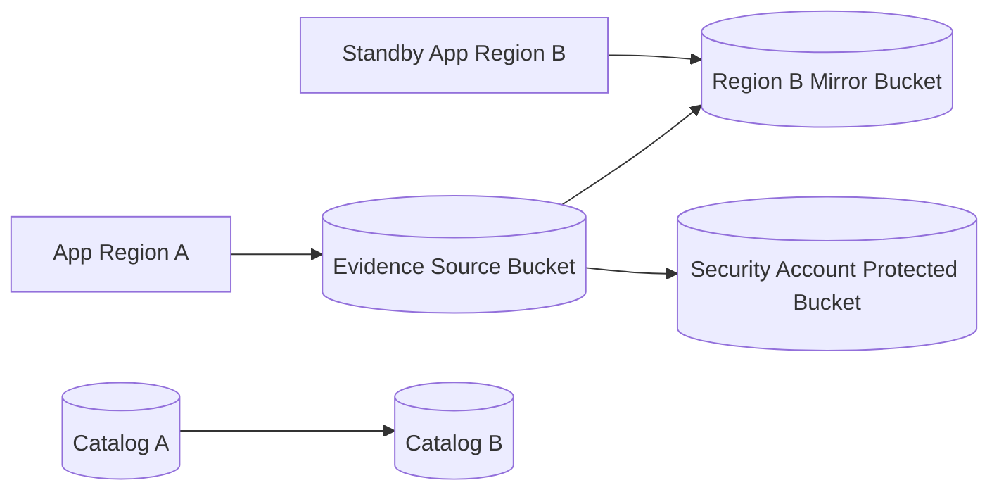

# Part 046 — S3 Replication and Multi-Region Data

Replication is not backup.

Replication is not failover.

Replication is not consistency across Regions.

Replication is a data movement system.

Amazon S3 Replication can copy objects, metadata, and tags from one bucket to another bucket in the same Region or across Regions. It can help with compliance, latency, data locality, account isolation, disaster recovery, and data aggregation. But it introduces a new set of production questions:

- What is replicated?
- What is not replicated?
- How much lag is acceptable?
- Who owns the replica?
- Can the destination decrypt KMS-encrypted objects?
- Are delete markers replicated?
- Is failover read-only or read-write?
- How is split-brain prevented?
- How do you fail back?
- Is the replica a backup or a hot serving copy?
- How do you prove the destination is complete enough to use?

This part treats S3 replication as architecture, not a checkbox.

---

## 1. Problem yang Diselesaikan

Kita akan membahas:

- Same-Region Replication vs Cross-Region Replication
- one-way vs two-way replication
- replication lag and recovery point implications
- Replication Time Control and metrics
- delete marker and version replication
- KMS-encrypted object replication
- cross-account ownership and bucket owner enforced mode
- replica modification sync
- failover/failback patterns
- multi-region read and write models
- monitoring and runbooks
- when replication is not enough and backup/Object Lock is still required

---

## 2. Mental Model

### 2.1 Replication copies object changes asynchronously

Base model:



A successful write to source does not mean the object is immediately available in destination.

Replication lag is a real part of the system.

### 2.2 Replication is a pipeline

Think of replication as:



Failure can happen at every stage:

- rule does not match
- IAM role lacks permission
- destination bucket issue
- KMS permission missing
- Object Lock mismatch
- ownership/ACL issue
- replication backlog
- destination Region issue
- delete behavior not configured as expected

### 2.3 Replica is not automatically the authority

A replicated object is a copy. Application authority must be explicit.

Questions:

```text
Is source always authoritative?
Can destination serve reads?
Can destination accept writes during failover?
How are writes reconciled after failback?
Is catalog replicated too?
Is KMS key available in destination?
Are object versions and manifests consistent enough?
```

If the application catalog is not replicated or failover-aware, object replication alone may not make the application recoverable.

### 2.4 RPO is bounded by replication lag

If source Region fails before object is replicated, destination may miss recent writes.

```text
RPO <= maximum acceptable replication lag + detection/failover decision delay
```

If RPO must be near zero, asynchronous S3 replication may be insufficient by itself.

### 2.5 RTO is more than object availability

RTO includes:

- detecting source failure
- deciding to fail over
- routing clients
- making destination readable/writable
- ensuring catalog/state consistency
- KMS/key availability
- IAM role availability
- application configuration switch
- downstream processor switch
- validation before serving

S3 replication is one ingredient.

---

## 3. Replication Types

### 3.1 Same-Region Replication

Same-Region Replication copies objects between buckets in the same AWS Region.

Use cases:

- log aggregation
- account isolation
- copy to security/audit account
- test/dev copy
- compliance boundary
- different lifecycle/retention policy
- Object Lock protected copy
- ownership transfer

SRR is not a Region-level DR solution because source and destination remain in the same Region.

### 3.2 Cross-Region Replication

Cross-Region Replication copies objects to a bucket in another AWS Region.

Use cases:

- disaster recovery
- lower-latency read copy near users
- compliance/regulatory geographic separation
- data sovereignty constraints
- multi-region analytics
- backup-like copy with separate account and retention

CRR is asynchronous. Design RPO.

### 3.3 One-way replication

Most common:



Source is authoritative.

Good for:

- backup copy
- DR standby
- read replica
- audit copy
- downstream analytics copy

### 3.4 Two-way replication

Two-way replication can synchronize changes between buckets.

Use cases:

- active-active object distribution
- multi-region collaboration
- migration/failback scenarios

Risks:

- conflict semantics
- delete propagation surprises
- loops if misconfigured
- application catalog conflict
- write ownership unclear
- duplicate event processing

Use only with explicit conflict model and application-level write authority.

### 3.5 Batch Replication

S3 Batch Replication can replicate existing objects that were not replicated previously or need re-replication.

Use cases:

- enabling replication on existing bucket
- backfilling old data
- recovering from failed replication
- changing destination/account policy
- migration

Batch replication must be capacity/cost planned.

---

## 4. What Replication Can Copy

Replication can copy:

- new objects after rule is enabled
- object metadata
- object tags
- object versions when versioning is enabled
- delete markers if configured
- encrypted objects when KMS permissions/config are correct
- replicas to same or different account
- objects matching prefix/tag filters

Replication does not remove need to model:

- catalog/database replication
- event processor idempotency
- application routing
- restore decision
- lifecycle alignment
- legal retention
- KMS failover
- downstream dependencies

---

## 5. Versioning Requirement

Replication generally requires versioning on both source and destination buckets.

Why?

Replication tracks versions.

If versioning is disabled or suspended unexpectedly, replication behavior can break or drift from expectations.

Guardrails:

- manage bucket versioning in IaC
- alert on versioning suspension
- deny versioning change outside platform role
- test replication after config changes
- store version IDs for critical objects

---

## 6. Delete and Replication Semantics

### 6.1 Delete marker replication

Delete marker replication must be understood explicitly.

A delete in source can create a delete marker. Whether that marker replicates depends on replication configuration and rule behavior.

Production question:

```text
Should deleting in source hide/delete the destination copy?
```

For backup-like replica, often no.

For mirror-like replica, often yes.

### 6.2 Permanent version delete

Permanent deletion of a specific version is not the same as delete marker creation. Treat it as a high-risk operation. Replication behavior and recovery must be reviewed carefully.

### 6.3 Backup vs mirror

Backup-like replica:

- source deletes should not necessarily delete destination
- destination may have Object Lock
- destination in separate account
- lifecycle independent
- destination not used for normal writes
- restore is explicit

Mirror-like replica:

- destination should reflect source logical state
- delete markers may replicate
- useful for read locality/failover
- accidental deletes can propagate
- needs extra protection for operator mistakes

You cannot design one bucket to be both perfect mirror and immutable backup without careful rules and usually separate destinations.

---

## 7. KMS and Encryption

### 7.1 KMS-encrypted objects require explicit configuration

For SSE-KMS encrypted objects, replication needs permissions for source and destination KMS keys. The replication role must be able to decrypt/source-read as needed and encrypt/write at destination.

Common failure:

```text
objects replicate fine until SSE-KMS is enabled
```

or:

```text
replication succeeds, but recovery role in destination cannot decrypt
```

### 7.2 Key ownership matters

For cross-account replication:

- source account may own source KMS key
- destination account may own destination KMS key
- replication role needs policy access
- destination recovery role needs decrypt access
- key deletion/disable schedule can break restore

### 7.3 KMS runbook

When replication fails for encrypted object:

1. Confirm replication rule includes encrypted object handling.
2. Check replication IAM role permissions.
3. Check source KMS key policy.
4. Check destination KMS key policy.
5. Check destination bucket encryption configuration.
6. Check CloudWatch replication metrics/failures.
7. Retry/backfill with Batch Replication if needed.

---

## 8. Ownership and Cross-Account Replication

### 8.1 Why cross-account destination matters

For DR/security, destination bucket is often in a separate account.

Benefits:

- blast-radius reduction
- ransomware/operator mistake resistance
- independent access policy
- separate lifecycle/Object Lock
- security team ownership
- recovery account isolation

Trade-offs:

- IAM/KMS complexity
- ownership semantics
- operational coordination
- cost allocation
- replication setup complexity

### 8.2 Bucket owner enforced

Modern S3 Object Ownership settings can disable ACLs and make bucket owner own objects in the bucket. This simplifies ownership but must be understood with replication.

Production default for many systems:

```text
Bucket owner enforced + bucket policies/IAM, not object ACLs
```

### 8.3 Replica ownership

Question:

```text
Who owns the destination object, source account or destination bucket owner?
```

For recovery, destination account usually should be able to read, retain, and restore without depending on compromised source account.

Test this.

Do not infer ownership from config. Verify with actual cross-account read.

---

## 9. Replication Time Control and Metrics

### 9.1 Replication lag is observable

S3 Replication metrics can track:

- bytes pending replication
- operations pending replication
- replication latency

Use these metrics to understand backlog and recovery readiness.

### 9.2 Replication Time Control

S3 Replication Time Control is designed to provide predictable replication time backed by an SLA for most objects, commonly used when replication time objective matters.

Use when:

- compliance requires predictable replication
- DR RPO needs tighter bound
- object availability in destination must be monitored
- backlog alarms must be actionable

Cautions:

- cost
- not replacement for application failover
- still asynchronous
- still needs catalog/state replication
- still needs validation

### 9.3 RPO dashboard

Track:

```text
max replication latency by rule
bytes pending
operations pending
failed operations
oldest unreplicated object age
replication status distribution
destination object count lag
replication KMS errors
```

Application DR decision should include this dashboard.

---

## 10. Multi-Region Architecture Patterns

### 10.1 Passive DR copy



Characteristics:

- Region A authoritative
- Region B standby
- replica is read during DR
- writes usually stopped or redirected only after failover decision
- catalog/database must also fail over
- RPO depends on replication lag

Good for:

- regulatory archive
- evidence documents
- backup-like application objects
- lower-cost DR

### 10.2 Read-local replica



Characteristics:

- writes centralized
- reads distributed
- stale reads possible until replication completes
- object version/catalog must indicate freshness
- readers may fallback to source if needed

Good for:

- software artifacts
- media/static content
- reports
- large documents

### 10.3 Active-active writes



Hard mode.

Requires:

- conflict model
- globally unique immutable keys
- idempotency across Regions
- replicated catalog with conflict resolution
- per-object write ownership
- delete semantics
- event deduplication
- failback protocol

Avoid unless business needs justify it.

### 10.4 Aggregation copy

Multiple source buckets replicate to central analytics/security bucket.



Use cases:

- logs
- audit artifacts
- compliance copy
- security data lake
- organization-wide inventory

Guardrails:

- avoid key collision by source account/bucket prefix
- preserve source metadata
- control KMS
- lifecycle by data class
- monitor failed replication per source

---

## 11. Failover Design

### 11.1 Failover is a state transition

Do not think:

```text
source bucket down, use replica
```

Think:

```text
system authority moves from Region A to Region B under controlled conditions
```

Failover questions:

- Is Region A truly unavailable or degraded?
- Are writes stopped in Region A?
- What replication lag exists?
- Is Region B catalog consistent with object replicas?
- Which object versions are safe to expose?
- Can Region B decrypt objects?
- Are event processors disabled/enabled correctly?
- Are clients routed safely?
- Is destination bucket writable?
- What is the failback plan?

### 11.2 Read-only failover

Simpler:

- serve replicated objects from destination
- do not accept new writes
- use catalog snapshot
- expose degraded mode

Good when:

- RTO matters more than write availability
- conflict avoidance is important
- data can be viewed but not changed during DR

### 11.3 Read-write failover

Harder:

- freeze Region A writes
- promote Region B
- update DNS/config
- use destination bucket as new source
- ensure catalog writes in B
- record failover epoch
- plan failback with replication in reverse or migration

Requires game day.

### 11.4 Failback

Failback is often harder than failover.

After Region A returns:

- what writes happened in B?
- were they replicated back?
- are object keys globally unique?
- are catalogs reconciled?
- are events duplicated?
- are lifecycle policies symmetric?
- are KMS keys available?
- which Region is authoritative now?

If failback is not designed, failover may be one-way migration.

---

## 12. Terraform Pattern

### 12.1 Source bucket replication skeleton

```hcl
resource "aws_iam_role" "s3_replication" {
  name = "s3-replication-role"

  assume_role_policy = jsonencode({
    Version = "2012-10-17"
    Statement = [{
      Effect = "Allow"
      Principal = {
        Service = "s3.amazonaws.com"
      }
      Action = "sts:AssumeRole"
    }]
  })
}

resource "aws_s3_bucket_versioning" "source" {
  bucket = aws_s3_bucket.source.id

  versioning_configuration {
    status = "Enabled"
  }
}

resource "aws_s3_bucket_versioning" "destination" {
  bucket = aws_s3_bucket.destination.id

  versioning_configuration {
    status = "Enabled"
  }
}

resource "aws_s3_bucket_replication_configuration" "replication" {
  bucket = aws_s3_bucket.source.id
  role   = aws_iam_role.s3_replication.arn

  rule {
    id     = "replicate-critical-objects"
    status = "Enabled"

    filter {
      prefix = "raw/"
    }

    destination {
      bucket        = aws_s3_bucket.destination.arn
      storage_class = "STANDARD"
    }

    delete_marker_replication {
      status = "Disabled"
    }
  }

  depends_on = [
    aws_s3_bucket_versioning.source,
    aws_s3_bucket_versioning.destination
  ]
}
```

This is intentionally incomplete. Real production needs IAM permissions, KMS configuration, metrics, ownership, lifecycle, and cross-account policies.

### 12.2 Rule filter discipline

Do not replicate everything by accident.

For each rule:

- ID
- owner
- source prefix/tags
- destination
- delete marker behavior
- storage class
- KMS
- metrics/RTC
- lifecycle alignment
- recovery purpose

---

## 13. Observability

### 13.1 Required metrics

Per replication rule:

- bytes pending replication
- operations pending replication
- replication latency
- failed replication operations
- oldest pending object age
- destination object count
- destination version count
- KMS errors
- access denied errors
- delete marker replication count
- batch replication job status
- Replication Time Control threshold misses if used

### 13.2 Replication status

Objects can expose replication status such as pending, completed, failed, or replica status depending on context.

Operational use:

- do not declare backup copy complete until replication status/metrics confirms
- do not fail over to destination blindly if backlog is high
- sample critical object versions
- reconcile source and destination inventory

### 13.3 Inventory reconciliation

Use S3 Inventory to compare:

```text
source object version list
destination object version list
replication status
size/checksum/ETag where applicable
storage class
encryption
Object Lock metadata
tags
```

---

## 14. Failure Modes

### 14.1 Rule does not match

Symptom:

- objects not replicated
- metrics show no pending operations
- prefix/tag filter excludes object

Fix:

- inspect key pattern
- inspect object tags
- update rule
- backfill with Batch Replication if needed

### 14.2 KMS replication failure

Symptom:

- unencrypted objects replicate
- KMS-encrypted objects fail

Fix:

- update source/destination key policies
- update replication role permissions
- enable encrypted object replication configuration
- test recovery role decrypt

### 14.3 Delete propagated unintentionally

Symptom:

- destination missing object after source delete

Fix:

- inspect delete marker replication config
- inspect version history
- restore destination version if available
- separate backup replica from mirror replica

### 14.4 Destination cannot serve recovery

Symptom:

- objects exist
- app/recovery role cannot read
- KMS/ownership/bucket policy blocks

Fix:

- test cross-account read regularly
- bucket owner enforced if appropriate
- destination KMS key policy
- recovery role permissions
- Object Lock/legal hold awareness

### 14.5 Replication backlog

Symptom:

- bytes/operations pending rising
- replication latency grows
- DR RPO violated

Fix:

- identify prefix/object surge
- check KMS/access errors
- check destination throttling/policy
- enable/adjust RTC if required
- throttle source if necessary
- backfill/retry

### 14.6 Active-active conflict

Symptom:

- two Regions write same logical object
- events duplicate
- catalog diverges
- latest pointer oscillates

Fix:

- stop one writer
- pick authority by epoch
- reconcile immutable keys
- repair catalog
- add global ID/ownership/epoch model

---

## 15. Operational Runbooks

### 15.1 Object not replicated

1. Confirm source bucket versioning enabled.
2. Confirm destination bucket versioning enabled.
3. Check replication rule filter.
4. Check object prefix/tags.
5. Check object encryption.
6. Check replication role IAM.
7. Check KMS key policies.
8. Check destination bucket policy/ownership.
9. Check replication metrics.
10. Use Batch Replication if object predates rule or failed.

### 15.2 Destination read fails during DR

1. Confirm object exists in destination.
2. Confirm correct version ID.
3. Check destination bucket policy.
4. Check recovery role identity.
5. Check Object Ownership.
6. Check KMS decrypt permission.
7. Check Object Lock/legal hold if delete/modify involved.
8. Validate catalog points to destination bucket/key/version.
9. Test application read path.

### 15.3 Replication lag violates RPO

1. Check bytes pending and operations pending.
2. Identify top prefixes/objects.
3. Check recent traffic spike.
4. Check failed replication errors.
5. Check KMS/access issues.
6. Consider RTC for future if predictable SLA required.
7. Update DR decision to account for lag.
8. Record possible data-loss window.

### 15.4 Failover procedure

Minimum sequence:

1. Declare incident and freeze source writes if possible.
2. Capture replication metrics.
3. Determine safe recovery point.
4. Switch catalog/application configuration to destination.
5. Verify KMS/IAM access.
6. Enable destination event processors if needed.
7. Route readers/writers according to failover mode.
8. Monitor errors, missing objects, stale reads.
9. Record failover epoch.
10. Begin failback planning immediately.

### 15.5 Failback procedure

1. Stop or quiesce writes in failed-over Region.
2. Inventory objects written during failover epoch.
3. Replicate/copy them back to original Region or promote new Region permanently.
4. Reconcile catalog state.
5. Reconcile event processing/idempotency records.
6. Validate object versions and checksums.
7. Switch routing.
8. Keep old Region read-only until confidence restored.

---

## 16. Design Checklist

### 16.1 Replication purpose

- [ ] Purpose is explicit: DR, backup, read locality, audit, aggregation, migration.
- [ ] Source of authority is defined.
- [ ] RPO is defined.
- [ ] RTO is defined.
- [ ] Delete behavior is defined.
- [ ] Destination ownership is defined.
- [ ] KMS recovery access is tested.
- [ ] Lifecycle policies are aligned.
- [ ] Object Lock requirement is reviewed.
- [ ] Catalog/database replication is designed.

### 16.2 Rule configuration

- [ ] Source versioning enabled.
- [ ] Destination versioning enabled.
- [ ] Rule filter is correct.
- [ ] Destination bucket/account correct.
- [ ] Replication IAM role least-privilege and complete.
- [ ] KMS policy complete.
- [ ] Delete marker replication intentional.
- [ ] Metrics enabled.
- [ ] RTC considered if RPO requires.
- [ ] Batch Replication plan exists for existing objects.

### 16.3 DR readiness

- [ ] Destination read tested.
- [ ] Destination write behavior decided.
- [ ] Failover runbook exists.
- [ ] Failback runbook exists.
- [ ] Replication lag dashboard exists.
- [ ] Game day executed.
- [ ] Application catalog is destination-aware.
- [ ] Event processors are idempotent across Regions.
- [ ] Split-brain prevention exists.

---

## 17. Mini Case Study — Multi-Region Evidence Repository

### 17.1 Requirement

A regulatory platform stores evidence in Region A. It needs:

- DR read access in Region B
- RPO under 15 minutes for accepted evidence
- source account isolated from recovery account
- legal retention for accepted evidence
- active application catalog in Region A
- standby catalog in Region B
- no accidental delete propagation to immutable backup copy

### 17.2 Bad design

One CRR rule:

```text
source raw/ -> destination raw/
delete marker replication enabled
same account
same KMS key dependency
no replication metrics
no catalog replication test
```

Failure:

- operator deletes source objects
- delete markers replicate
- destination mirrors deletion
- recovery role cannot decrypt some objects
- catalog points to source bucket
- failover blocked

### 17.3 Better design

Two destinations:

1. **Mirror replica**
   - cross-region
   - serves DR read
   - delete marker behavior aligned with application state
   - RTC/metrics enabled if RPO needs
   - catalog replicated and destination-aware

2. **Protected recovery copy**
   - cross-account
   - Object Lock where required
   - delete marker replication disabled or carefully controlled
   - independent KMS key
   - security/recovery account owned
   - restore tested

Architecture:



### 17.4 Invariants

```text
Mirror supports service continuity.
Protected copy supports recovery from accidental or malicious source-side deletion.
Catalog failover is tested with object version IDs.
KMS recovery is tested from destination account.
```

---

## 18. Summary

S3 replication is powerful, but only when its purpose is explicit.

Use it for:

- DR
- read locality
- compliance copy
- account isolation
- audit aggregation
- migration/backfill

But design:

- RPO from replication lag
- RTO from full application failover
- delete marker behavior
- KMS/key ownership
- destination object ownership
- lifecycle alignment
- catalog/database consistency
- active-active conflict prevention
- failback

The core rule:

> Replication copies objects. Architecture decides authority, recovery, and correctness.

Next, we cover S3 Object Lock, retention, WORM, legal hold, governance/compliance mode, and how to design immutable storage for regulated systems and ransomware-resilient backups.

---

## References

- AWS S3 User Guide — Replicating objects within and across Regions: https://docs.aws.amazon.com/AmazonS3/latest/userguide/replication.html
- AWS S3 User Guide — Same-Region Replication: https://docs.aws.amazon.com/AmazonS3/latest/userguide/replication.html
- AWS S3 User Guide — Cross-Region Replication: https://docs.aws.amazon.com/AmazonS3/latest/userguide/replication.html
- AWS S3 User Guide — Using S3 Replication metrics: https://docs.aws.amazon.com/AmazonS3/latest/userguide/repl-metrics.html
- AWS S3 User Guide — S3 Replication Time Control: https://docs.aws.amazon.com/AmazonS3/latest/userguide/replication-time-control.html
- AWS S3 User Guide — Configuring replication for buckets in different accounts: https://docs.aws.amazon.com/AmazonS3/latest/userguide/replication-walkthrough-2.html
- AWS S3 User Guide — Replicating encrypted objects: https://docs.aws.amazon.com/AmazonS3/latest/userguide/replication-config-for-kms-objects.html
- AWS S3 User Guide — Replication and Object Ownership: https://docs.aws.amazon.com/AmazonS3/latest/userguide/replication-change-owner.html
- AWS S3 User Guide — Batch Replication: https://docs.aws.amazon.com/AmazonS3/latest/userguide/s3-batch-replication-batch.html
