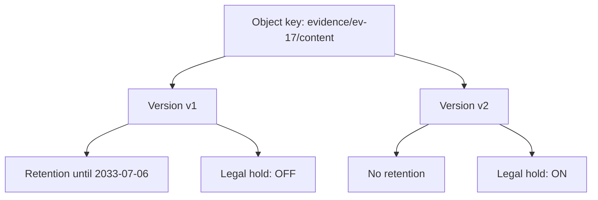
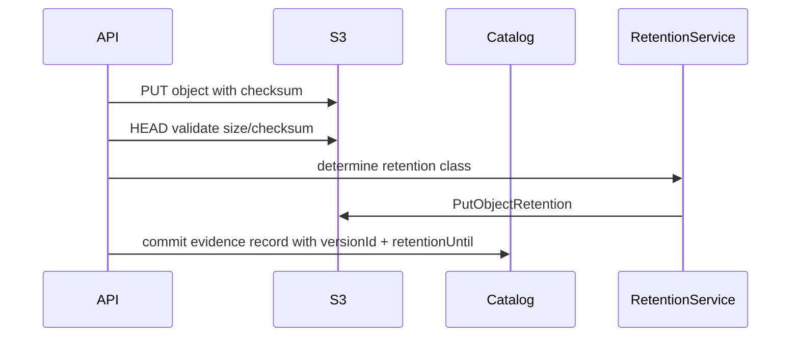
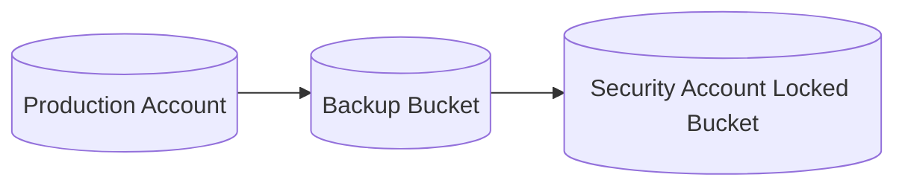
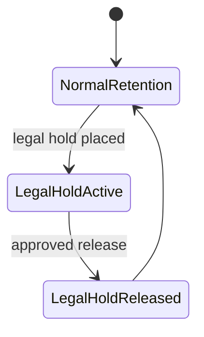
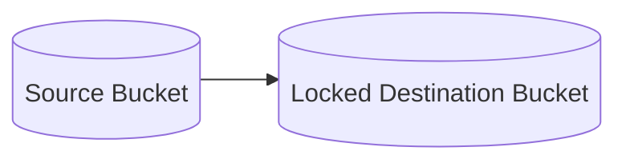

# Part 047 — S3 Object Lock, Retention, and WORM

Object Lock is not versioning.

Object Lock is not lifecycle.

Object Lock is not "delete protection" in the casual sense.

Object Lock is a WORM-style control: Write Once, Read Many. It can prevent an object version from being deleted or overwritten for a fixed retention period or while a legal hold is active.

This is powerful.

It is also dangerous when used without a retention model.

If you accidentally lock the wrong objects for seven years, S3 will do what you asked. If you set compliance mode incorrectly, normal administrators cannot simply undo it before the retention date. If you enable legal hold without ownership process, objects can remain undeletable indefinitely. If you mix temporary data and compliance data in the same bucket/prefix, lifecycle cleanup may fail unexpectedly.

Object Lock is a production governance feature. Treat it like you would treat database immutability, legal retention, or financial ledger controls.

---

## 1. Problem yang Diselesaikan

Part ini membahas:

- apa itu S3 Object Lock dan WORM
- hubungan Object Lock dengan versioning
- retention period vs legal hold
- governance mode vs compliance mode
- default retention di bucket
- object-level retention
- Object Lock untuk compliance evidence
- Object Lock untuk ransomware-resilient backup
- Object Lock vs lifecycle
- Object Lock vs replication
- IAM guardrails
- runbook untuk locked object, mistaken retention, legal hold, dan restore
- design checklist sebelum mengaktifkan Object Lock

---

## 2. Mental Model

### 2.1 Object Lock protects object versions

S3 Object Lock applies to object versions.

That means the unit of protection is not merely:

```text
bucket/key
```

It is:

```text
bucket/key/versionId
```

Simplified:



A newer version can exist under the same key, but a locked version cannot be deleted or overwritten before its retention/hold allows it.

### 2.2 Retention and legal hold are different controls

Retention period:

- has a timestamp/end date
- prevents deletion/overwrite until the date
- uses governance or compliance mode

Legal hold:

- has no fixed end date
- remains until explicitly removed
- prevents deletion/overwrite while active
- independent of retention period

An object version can have:

- retention only
- legal hold only
- both
- neither

### 2.3 Object Lock is not backup by itself

Object Lock can make object versions immutable. It does not guarantee:

- that the right objects were written
- that the catalog points to them
- that KMS keys remain usable
- that lifecycle is correct
- that replica exists in another account/Region
- that restore is tested
- that data is not logically corrupted before being locked

For backup systems, Object Lock protects backup objects after write. The backup process still must ensure consistency, completeness, encryption, cataloging, and restore validation.

### 2.4 Immutability changes operational failure modes

Without Object Lock, accidental deletion is the big risk.

With Object Lock, accidental retention is also a risk.

Failure modes include:

- cannot delete wrong test data
- cannot expire high-volume objects
- lifecycle cost grows
- compliance mode prevents administrative correction
- legal hold remains forever
- restore works but purge does not
- privacy deletion request conflicts with retention policy
- replication destination rejects locked objects due to configuration mismatch

---

## 3. Core Concepts

### 3.1 WORM

WORM means Write Once, Read Many.

The system allows writing an object version, then prevents destructive mutation for a policy-defined time or hold condition.

Use cases:

- regulatory records
- financial records
- legal evidence
- audit logs
- immutable backups
- ransomware-resilient copies
- chain-of-custody artifacts

WORM is about preserving evidence of what existed. It is not a general-purpose application state mechanism.

### 3.2 Bucket-level Object Lock enablement

To use Object Lock, the bucket must support Object Lock and versioning must be enabled. In practice, Object Lock should be decided at bucket creation time and managed via IaC.

Production guidance:

- create dedicated buckets for Object Lock workloads
- do not mix temp and immutable data in the same protected prefix
- define retention classes before enabling defaults
- test in non-production with short retention first
- ensure lifecycle and retention do not conflict
- ensure KMS/key access is durable

### 3.3 Default retention

A bucket can have default Object Lock retention so new objects receive retention automatically unless overridden.

This is useful for compliance buckets.

It is dangerous for mixed-use buckets.

Example:

```text
bucket default retention = 7 years compliance mode
```

If application writes temp files into this bucket, those temp files may become undeletable for seven years.

Default retention should be applied only when every object under the policy boundary deserves it.

### 3.4 Object-level retention

Applications can set retention at object write or later.

This is useful when retention depends on business classification:

- evidence accepted
- backup completed
- audit record finalized
- legal hold triggered
- case closed
- retention clock started

But application-level retention must be governed. Do not let arbitrary application code choose compliance-mode retention dates without policy.

### 3.5 Governance mode

Governance mode prevents ordinary deletion/overwrite until retention expires, but users with special permission can bypass governance retention.

Use governance mode when:

- you need strong protection
- authorized break-glass override is acceptable
- operational mistakes may need correction
- retention policy is serious but not legally irreversible

Guardrail:

- `s3:BypassGovernanceRetention` should be very restricted
- break-glass use should be logged and reviewed
- bypass should require change/incident ticket

### 3.6 Compliance mode

Compliance mode is stricter. Protected object versions cannot be overwritten or deleted by any user, including root, before retention expires.

Use compliance mode when:

- legal/regulatory WORM requires it
- retention policy is approved and stable
- wrong retention date risk is controlled
- cost implication is accepted
- privacy deletion conflict is legally resolved
- test data cannot accidentally enter the protected path

Do not use compliance mode as a casual "extra-safe" flag.

### 3.7 Legal hold

Legal hold prevents object version deletion/overwrite until removed. It has no expiry date.

Use for:

- litigation hold
- investigation hold
- regulator request
- preservation order
- incident evidence freeze

Legal hold needs workflow:

```text
who can place hold?
who can remove hold?
what evidence supports removal?
how is hold audited?
how is business catalog updated?
```

Legal hold without removal process becomes indefinite storage debt.

---

## 4. Object Lock vs Related Controls

### 4.1 Object Lock vs versioning

Versioning keeps historical versions.

Object Lock protects versions from deletion/overwrite.

Versioning alone:

- helps recovery
- does not prevent authorized permanent version deletion
- can be defeated by lifecycle noncurrent expiration

Object Lock:

- prevents deletion/overwrite while retention/hold applies
- can preserve versions even against deletion attempts
- introduces undeletable period

Use together for protected records.

### 4.2 Object Lock vs lifecycle

Lifecycle manages storage class transition and expiration.

Object Lock can block expiration/deletion while retention or legal hold applies.

Lifecycle can still transition objects to another storage class if allowed, but deletion before retention expiry is blocked.

Design question:

```text
Should this object be immutable but moved to archive after 180 days?
```

That can be valid.

But:

```text
Expire after 30 days while retention says 7 years
```

is contradictory. Retention wins for locked versions.

### 4.3 Object Lock vs bucket policy

Bucket policy controls who can call APIs.

Object Lock controls whether deletion/overwrite is allowed even if caller otherwise has permission.

Use both:

- bucket policy restricts actors
- Object Lock enforces retention
- IAM monitors and limits bypass permissions
- CloudTrail audits access

### 4.4 Object Lock vs backup vault lock

AWS Backup Vault Lock is a control for AWS Backup vaults. S3 Object Lock protects S3 object versions. They solve related immutability goals but apply to different backup/storage systems.

For S3-native backup objects, use S3 Object Lock.

For AWS Backup-managed recovery points, evaluate AWS Backup Vault Lock.

### 4.5 Object Lock vs replication

Replication can copy locked objects to destination if configured correctly and destination supports Object Lock requirements.

Questions:

- does destination bucket have Object Lock enabled?
- are retention settings replicated?
- should destination retention differ?
- does destination account own recovery?
- do KMS permissions allow replication and restore?
- does lifecycle conflict?

For ransomware-resilient backup, a cross-account locked replica is often stronger than same-account lock only.

---

## 5. Design Patterns

### 5.1 Immutable evidence bucket

Use case:

- accepted regulatory evidence
- chain of custody
- retention period mandated by policy

Pattern:

```text
bucket: regulatory-evidence-lock-prod
prefix: evidence/blobs/sha256/<digest>/content
catalog: case/evidence metadata with versionId and retention class
```

Write flow:



Invariant:

```text
Evidence is user-visible only after object is durably stored, validated, retention-applied, and cataloged.
```

### 5.2 Ransomware-resilient backup copy

Use case:

- backup artifacts stored in S3
- source account might be compromised
- deletion resistance required

Pattern:



Destination:

- separate account
- Object Lock enabled
- default retention
- restricted delete/version-delete
- KMS key controlled by recovery/security account
- lifecycle archive after restore-fast period
- restore tested regularly

Invariant:

```text
Production account can write backup copy but cannot shorten retention or delete protected versions.
```

### 5.3 Governance-mode operational guardrail

Use case:

- important artifacts
- need retention protection
- break-glass required for operator mistakes

Pattern:

- governance mode
- retention 30–180 days
- bypass permission only to break-glass role
- break-glass requires approval
- CloudTrail alert on bypass
- periodic review of bypass attempts

Good for:

- release artifacts
- deployment bundles
- critical pipeline outputs
- medium-risk records

### 5.4 Compliance-mode regulatory archive

Use case:

- mandated WORM retention
- retention duration known
- deletion before retention is illegal or unacceptable

Pattern:

- dedicated bucket
- compliance mode
- default retention or controlled object retention
- Object Lock configuration protected by IaC
- no temp writes
- no test data
- legal/compliance approval
- retention report
- lifecycle transitions only after approval
- recovery tested

### 5.5 Legal hold workflow

Use case:

- investigation or litigation hold on selected records

Pattern:



Catalog fields:

```json
{
  "evidenceId": "ev-17",
  "objectVersionId": "abc",
  "retentionUntil": "2033-07-06T00:00:00Z",
  "legalHold": true,
  "legalHoldReason": "investigation-2026-184",
  "legalHoldPlacedBy": "legal-ops",
  "legalHoldPlacedAt": "2026-07-06T03:00:00Z"
}
```

---

## 6. Anti-Patterns

### 6.1 Locking temp data

```text
processing-attempts/* locked for 7 years
```

This creates permanent storage waste and may block cleanup.

Fix:

- separate buckets/prefixes
- default retention only on protected bucket
- explicit object retention for final records only

### 6.2 Compliance mode for uncertain retention

If retention policy is not final, do not start with compliance mode.

Use governance mode in non-prod or short retention test buckets first.

### 6.3 Object Lock without catalog version ID

If the catalog stores only bucket/key, recovery and audit are weaker.

Store version ID.

### 6.4 Lifecycle assumed to delete locked objects

Lifecycle cannot delete locked versions before retention/hold allows. Cost can grow if teams expect lifecycle to clean locked objects.

### 6.5 Legal hold without owner

A legal hold needs an owner, reason, and release process.

Otherwise "temporary hold" becomes indefinite data retention.

### 6.6 Same-account protected backup only

If the same compromised account can delete, change policies, disable KMS, or bypass governance, backup protection is weaker.

For high-value backup, use cross-account isolation.

---

## 7. IAM Guardrails

### 7.1 Dangerous permissions

Treat these as sensitive:

- `s3:PutObjectRetention`
- `s3:GetObjectRetention`
- `s3:BypassGovernanceRetention`
- `s3:PutObjectLegalHold`
- `s3:GetObjectLegalHold`
- `s3:PutBucketObjectLockConfiguration`
- `s3:GetBucketObjectLockConfiguration`
- `s3:DeleteObjectVersion`
- lifecycle configuration changes
- bucket versioning changes
- KMS key administration

### 7.2 Role separation

Recommended separation:

| Role | Capabilities |
|---|---|
| application writer | put objects, maybe set allowed retention class |
| retention service | calculate/apply retention |
| legal operations | apply/remove legal hold |
| break-glass admin | bypass governance with approval |
| security auditor | read retention/hold status |
| lifecycle admin | manage lifecycle with data-owner approval |
| recovery operator | restore/read protected versions |
| KMS admin | manage keys, not object deletion |

### 7.3 Deny patterns

Use explicit denies where appropriate.

Examples:

- deny `DeleteObjectVersion` for application roles
- deny retention shortening
- deny bypass governance except break-glass role
- deny writes without required object tags in protected bucket
- deny object puts to protected prefix unless retention headers are present or default retention covers it
- deny lifecycle configuration changes outside platform pipeline

### 7.4 CloudTrail and alerting

Alert on:

- PutObjectRetention
- BypassGovernanceRetention
- PutObjectLegalHold
- DeleteObjectVersion
- PutBucketObjectLockConfiguration
- PutLifecycleConfiguration
- PutBucketVersioning
- KMS DisableKey/ScheduleKeyDeletion
- unusual delete attempts on locked objects

---

## 8. Lifecycle and Cost Design

### 8.1 Retention and transition are separate

You can retain an object for seven years and still transition it to colder storage after 180 days if access/RTO allows.

Example policy:

```text
0-180 days: Standard or Intelligent-Tiering
180 days-2 years: Glacier Instant Retrieval or Flexible Retrieval
2-7 years: Deep Archive
delete after retention expires, if no legal hold
```

But for user-facing immediate retrieval, archive transition can create operational friction.

### 8.2 Locked object cost planning

Model:

```text
locked_storage_cost =
    object_size
  * retention_duration
  * storage_class_cost_over_time
  + request_cost
  + retrieval_cost
  + monitoring/inventory
  + replication cost
```

You cannot count on early deletion to fix bad assumptions.

### 8.3 Retention classes

Define retention classes as policy objects:

```yaml
retentionClasses:
  regulatory-evidence-7y:
    mode: COMPLIANCE
    duration: 7 years
    archiveAfter: 180 days
    legalHoldAllowed: true
  backup-immutable-35d:
    mode: GOVERNANCE
    duration: 35 days
    archiveAfter: null
    legalHoldAllowed: false
  audit-log-1y:
    mode: COMPLIANCE
    duration: 1 year
    archiveAfter: 90 days
```

Applications choose from allowed classes; they do not invent retention dates.

### 8.4 Expiration after retention

Lifecycle can delete after retention expires if:

- no legal hold
- retention date passed
- lifecycle rule matches
- IAM/policy allows
- Object Lock no longer blocks

For compliance-sensitive records, deletion after retention should often be a controlled purge workflow, not blind lifecycle alone.

---

## 9. Replication Design

### 9.1 Locked replica

For protected copy:



Destination requirements:

- Object Lock enabled
- versioning enabled
- KMS key accessible to replication role
- destination bucket owner can recover
- lifecycle/retention configured
- replication metrics enabled
- failure events monitored

### 9.2 Retention propagation

Decide whether retention metadata should replicate exactly or be applied differently at destination.

Use cases differ:

- compliance mirror: preserve retention
- backup copy: destination default retention may enforce stronger policy
- audit copy: destination account may control retention independent of source

Document it.

### 9.3 Delete behavior

For backup/protected copy, source delete marker replication may be undesirable.

For mirror/failover copy, delete marker replication may be expected.

Do not use one replica for both purposes unless policy is explicit.

---

## 10. Implementation Skeletons

### 10.1 Terraform bucket with Object Lock enabled

Object Lock should be decided at bucket creation.

```hcl
resource "aws_s3_bucket" "locked" {
  bucket              = var.bucket_name
  object_lock_enabled = true

  tags = {
    Service     = var.service
    Environment = var.environment
    DataClass   = "locked-records"
  }
}

resource "aws_s3_bucket_versioning" "locked" {
  bucket = aws_s3_bucket.locked.id

  versioning_configuration {
    status = "Enabled"
  }
}

resource "aws_s3_bucket_object_lock_configuration" "locked" {
  bucket = aws_s3_bucket.locked.id

  rule {
    default_retention {
      mode = "GOVERNANCE"
      days = 35
    }
  }

  depends_on = [aws_s3_bucket_versioning.locked]
}
```

Do not copy governance/35d into compliance production without policy review.

### 10.2 Apply object retention

AWS CLI example:

```bash
aws s3api put-object-retention \
  --bucket "$BUCKET" \
  --key "$KEY" \
  --version-id "$VERSION_ID" \
  --retention '{
    "Mode": "GOVERNANCE",
    "RetainUntilDate": "2026-08-10T00:00:00Z"
  }'
```

### 10.3 Apply legal hold

```bash
aws s3api put-object-legal-hold \
  --bucket "$BUCKET" \
  --key "$KEY" \
  --version-id "$VERSION_ID" \
  --legal-hold Status=ON
```

Remove after approval:

```bash
aws s3api put-object-legal-hold \
  --bucket "$BUCKET" \
  --key "$KEY" \
  --version-id "$VERSION_ID" \
  --legal-hold Status=OFF
```

### 10.4 Check retention/hold

```bash
aws s3api get-object-retention \
  --bucket "$BUCKET" \
  --key "$KEY" \
  --version-id "$VERSION_ID"

aws s3api get-object-legal-hold \
  --bucket "$BUCKET" \
  --key "$KEY" \
  --version-id "$VERSION_ID"
```

### 10.5 Application retention service pseudo-code

```java
record RetentionDecision(
    String mode,
    Instant retainUntil,
    boolean legalHoldAllowed,
    String retentionClass
) {}

RetentionDecision decideRetention(EvidenceRecord evidence) {
    return switch (evidence.classification()) {
        case REGULATORY_EVIDENCE -> new RetentionDecision(
            "COMPLIANCE",
            evidence.acceptedAt().plus(Period.ofYears(7)),
            true,
            "regulatory-evidence-7y"
        );
        case TEMPORARY_EXPORT -> throw new IllegalArgumentException(
            "temporary export must not use locked evidence bucket"
        );
    };
}
```

---

## 11. Operational Runbooks

### 11.1 Object cannot be deleted

Check:

1. Is bucket versioned?
2. Is specific object version under retention?
3. Is legal hold active?
4. Is retention governance or compliance mode?
5. Is caller trying to delete key or version?
6. Does caller have bypass governance permission?
7. Is lifecycle blocked by retention?
8. Is Object Lock expected by policy?

Commands:

```bash
aws s3api list-object-versions --bucket "$BUCKET" --prefix "$KEY"

aws s3api get-object-retention \
  --bucket "$BUCKET" \
  --key "$KEY" \
  --version-id "$VERSION_ID"

aws s3api get-object-legal-hold \
  --bucket "$BUCKET" \
  --key "$KEY" \
  --version-id "$VERSION_ID"
```

### 11.2 Wrong object locked

If governance mode:

1. Stop writer.
2. Identify affected versions.
3. Get approval.
4. Use break-glass role with bypass governance.
5. Delete or correct versions if policy allows.
6. Record incident.
7. Fix write path/prefix/default retention.

If compliance mode:

1. Stop writer.
2. Identify affected versions.
3. Confirm retention date.
4. Escalate to compliance/legal.
5. Plan storage cost until retention expires.
6. Fix write path immediately.
7. Do not promise deletion before retention expiry.

### 11.3 Legal hold removal

Required evidence:

- hold ID
- reason for release
- approving authority
- affected object versions
- catalog update
- audit record

Steps:

1. Verify hold still active.
2. Verify retention period status.
3. Get approval.
4. Remove legal hold.
5. Update catalog.
6. Record CloudTrail/event evidence.
7. If retention expired and purge needed, run purge workflow.

### 11.4 Locked backup restore

1. Identify backup manifest and object versions.
2. Verify retention/hold does not block read.
3. Verify KMS decrypt permissions.
4. Restore archive objects if needed.
5. Validate checksum.
6. Restore into isolated environment.
7. Test application-level consistency.
8. Promote recovery data according to DR runbook.

### 11.5 Cost spike from locked objects

1. Identify prefixes/classes using S3 Storage Lens/Inventory.
2. Check retention mode/date distribution.
3. Check legal hold count.
4. Identify unexpected write source.
5. Stop bad writer.
6. For governance mode, evaluate approved cleanup.
7. For compliance mode, plan cost and wait until expiry.
8. Add prefix/bucket isolation.

---

## 12. Observability

Track:

- locked object count
- locked bytes by retention class
- retain-until date distribution
- governance vs compliance count
- legal hold count
- objects with missing expected retention
- objects locked under temp prefixes
- denied delete attempts
- bypass governance attempts
- lifecycle deletion blocked by Object Lock
- KMS errors on locked objects
- replica retention failures
- Object Lock config changes

Use:

- S3 Inventory with Object Lock metadata where configured
- S3 Storage Lens
- CloudTrail data events for sensitive buckets
- application catalog reports
- AWS Config/custom policy checks
- security account dashboards

---

## 13. Failure Modes

### 13.1 Default retention applied to wrong prefix

Symptom:

- temp objects cannot be deleted
- cost grows
- lifecycle fails

Fix:

- separate bucket
- remove writer access
- governance cleanup if allowed
- compliance wait if not
- prefix/tag guardrail

### 13.2 Compliance mode too long

Symptom:

- objects retained longer than intended
- cannot shorten retention

Fix:

- escalate to legal/compliance
- document cost exposure
- prevent future writes
- correct retention class definitions
- test with governance mode before compliance

### 13.3 Legal hold never removed

Symptom:

- object retained after normal retention
- legal hold count grows

Fix:

- legal hold review process
- owner field required
- periodic report
- removal workflow with approval

### 13.4 Locked object cannot be restored because KMS

Symptom:

- object exists and is retained
- read/restore fails due to KMS

Fix:

- validate KMS key status
- verify recovery role decrypt permission
- avoid deleting/disabling old keys
- replicate with destination-owned KMS key where appropriate

### 13.5 Object Lock blocks incident cleanup

Symptom:

- bad data locked
- cannot remove from application-visible path

Fix:

- hide via catalog/business state
- write corrected version
- prevent consumers from reading bad version
- wait for retention expiry or governance bypass if allowed

---

## 14. Game Day Scenarios

### Scenario 1 — Governance bypass

Test:

- write object with governance retention
- attempt delete as normal role
- confirm denied
- delete with approved break-glass role and bypass
- confirm CloudTrail/alert

### Scenario 2 — Compliance immutability

Test in non-prod with short retention:

- write object with compliance mode
- attempt delete as admin/root-equivalent
- confirm blocked
- wait retention expiry
- confirm deletion allowed after expiry

### Scenario 3 — Legal hold

Test:

- apply legal hold
- attempt delete after retention expiry
- confirm blocked
- remove hold with legal-ops role
- delete after approval

### Scenario 4 — Locked backup restore

Test:

- restore backup object under Object Lock
- validate KMS
- validate manifest
- restore application into sandbox
- record RTO

### Scenario 5 — Bad prefix protection

Test:

- application attempts to write temp object into locked bucket
- policy denies or retention service rejects
- alert fires

---

## 15. Checklist

### 15.1 Before enabling Object Lock

- [ ] Use case requires WORM/immutability.
- [ ] Dedicated bucket or strict prefix boundary exists.
- [ ] Versioning is enabled.
- [ ] Retention classes are defined.
- [ ] Governance vs compliance mode is approved.
- [ ] Legal hold workflow exists.
- [ ] Lifecycle interaction reviewed.
- [ ] KMS recovery access tested.
- [ ] Cross-account recovery considered.
- [ ] Application stores version IDs.
- [ ] Non-prod test with short retention completed.
- [ ] Cost model includes full retention duration.

### 15.2 Application write path

- [ ] Object checksum validated.
- [ ] Object version ID captured.
- [ ] Retention applied before business success where required.
- [ ] Catalog stores retention class and retain-until date.
- [ ] Temp/attempt objects cannot enter locked path.
- [ ] Retention service uses allowed classes only.
- [ ] Legal hold state stored in catalog.
- [ ] Error handling does not leave unclassified locked objects.

### 15.3 Operations

- [ ] Runbook for cannot-delete object.
- [ ] Runbook for wrong retention.
- [ ] Runbook for legal hold release.
- [ ] Runbook for locked backup restore.
- [ ] Alerts on bypass/delete/versioning/lifecycle changes.
- [ ] Periodic legal hold review.
- [ ] Periodic restore game day.
- [ ] Inventory reconciliation.

---

## 16. Mini Case Study — Immutable Enforcement Evidence

### 16.1 Context

An enforcement lifecycle platform stores evidence used in regulatory decisions.

Requirements:

- evidence cannot be altered after acceptance
- retained for seven years after case closure
- legal hold may extend retention indefinitely
- active cases require immediate access
- closed cases may move to colder storage
- recovery copy must survive compromised application account

### 16.2 Design

Buckets:

```text
evidence-active-prod
evidence-locked-prod
evidence-protected-copy-security-account
```

Flow:

1. Upload enters staging bucket.
2. Malware/content validation runs.
3. Checksum is computed.
4. Evidence is accepted in catalog.
5. Object is copied/written to locked bucket.
6. Version ID is captured.
7. Retention is applied based on policy.
8. Catalog marks evidence as immutable accepted.
9. Cross-account protected replica receives locked copy.

### 16.3 Why staging and locked bucket are separate

Staging contains:

- incomplete uploads
- rejected files
- temporary processing output
- objects that may need deletion

Locked bucket contains:

- accepted evidence only
- explicit retention
- no temp writes
- strict IAM
- Object Lock

This separation prevents accidental WORM retention of garbage.

### 16.4 Invariant

```text
Only accepted evidence may enter the locked bucket.
Every accepted evidence object must have version ID, checksum, retention class, and catalog record.
```

That is a defensible regulatory storage model.

---

## 17. Summary

S3 Object Lock gives you immutability at the object-version level.

Use it for:

- regulatory evidence
- immutable audit records
- ransomware-resilient backups
- legal holds
- WORM archives

Do not use it casually.

The core rule:

> Object Lock should protect only data whose retention owner, retention duration, legal basis, recovery path, and cost model are explicit.

Next, we move to S3 event-driven storage patterns: how to use S3 as a trigger source for Lambda, SQS, SNS, and EventBridge while preserving idempotency, ordering safety, and workflow correctness.

---

## References

- AWS S3 User Guide — Locking objects with Object Lock: https://docs.aws.amazon.com/AmazonS3/latest/userguide/object-lock.html
- AWS S3 User Guide — Object Lock considerations: https://docs.aws.amazon.com/AmazonS3/latest/userguide/object-lock-managing.html
- AWS S3 User Guide — Configuring S3 Object Lock: https://docs.aws.amazon.com/AmazonS3/latest/userguide/object-lock-configure.html
- AWS S3 User Guide — Legal hold with S3 Object Lock: https://docs.aws.amazon.com/AmazonS3/latest/userguide/batch-ops-legal-hold.html
- AWS S3 User Guide — S3 Versioning: https://docs.aws.amazon.com/AmazonS3/latest/userguide/Versioning.html
- AWS S3 User Guide — S3 Lifecycle management: https://docs.aws.amazon.com/AmazonS3/latest/userguide/object-lifecycle-mgmt.html
- AWS Backup Developer Guide — AWS Backup Vault Lock: https://docs.aws.amazon.com/aws-backup/latest/devguide/vault-lock.html
