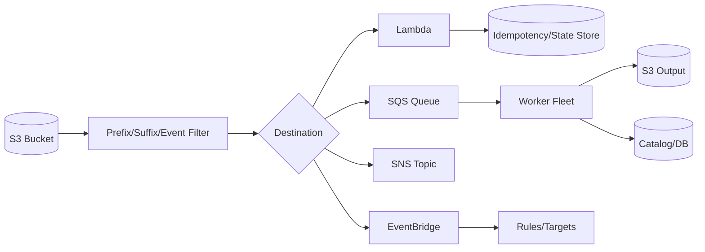
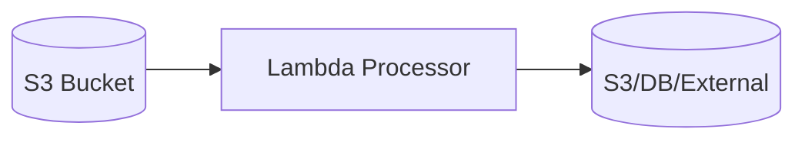
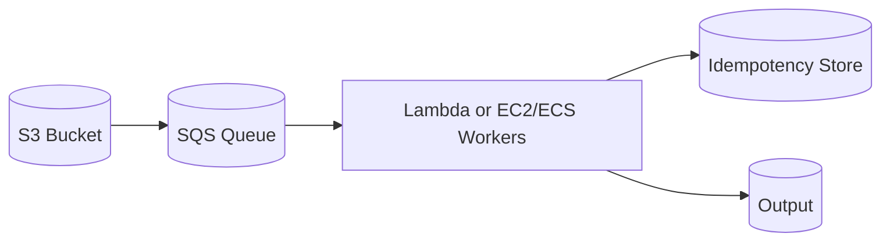
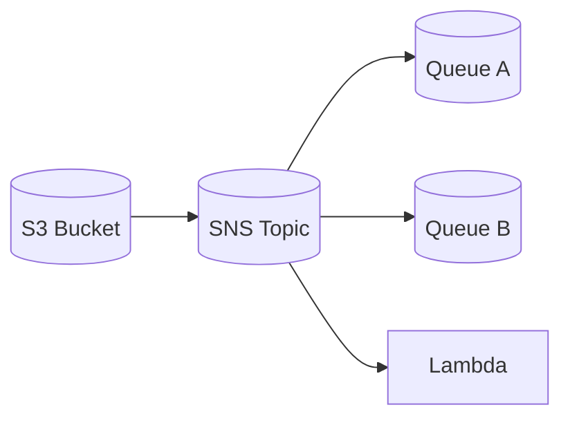
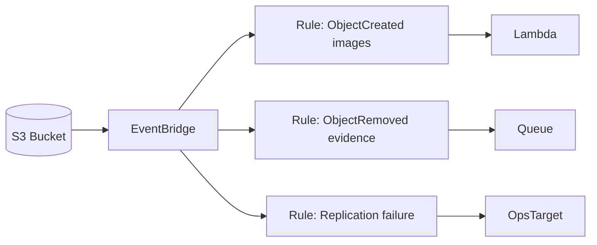
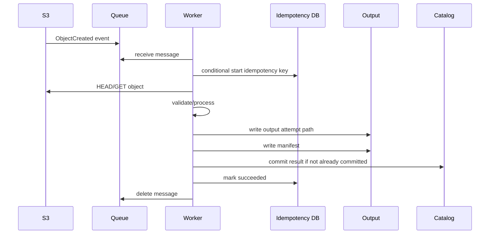
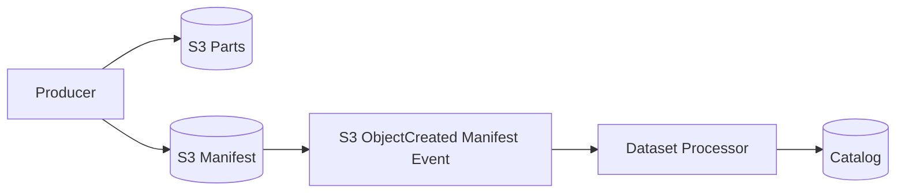
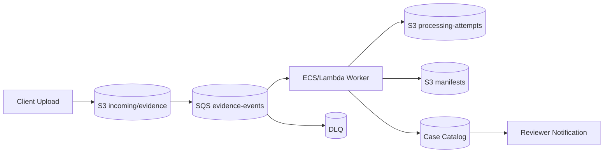

# Part 048 — S3 Event-Driven Storage Patterns

S3 can trigger compute.

That sentence sounds simple. In production, it is a distributed workflow.

An object appears. A notification is emitted. A queue or function receives it. A processor reads the object. It writes output. It updates state. It may fail halfway. It may be retried. The same event may arrive more than once. Events may arrive out of order. A delete event may arrive after a create event has already been processed. A processor may write back into the same bucket and accidentally trigger itself.

S3 event-driven design is not about "connect bucket to Lambda."

It is about designing a pipeline that remains correct under duplicate, retry, reorder, partial failure, poison objects, large object processing, lifecycle cleanup, and downstream backpressure.

---

## 1. Problem yang Diselesaikan

Part ini membahas:

- S3 Event Notifications
- Lambda direct trigger
- S3 -> SQS -> workers
- S3 -> SNS fanout
- S3 -> EventBridge routing
- prefix/suffix filtering
- duplicate and out-of-order events
- sequencer usage
- idempotency
- poison object handling
- DLQ and replay
- event loop prevention
- manifest-based workflow
- pipeline observability
- runbook untuk duplicate processing, stuck queue, Lambda storm, dan partial output

---

## 2. Mental Model

### 2.1 Object event is a signal, not a transaction

An S3 event means:

```text
An S3 object event happened.
```

It does not mean:

- processing must happen exactly once
- event is ordered globally
- object is business-valid
- multi-object dataset is complete
- downstream side effects committed
- catalog updated
- no duplicate notification exists

Treat event as a trigger. Treat durable workflow state as authority.

### 2.2 At-least-once and unordered by default

Amazon S3 Event Notifications are designed to deliver notifications at least once. They are not guaranteed to arrive in the same order as the events occurred. Duplicate notifications can happen.

Therefore every S3 event-driven processor must be:

- idempotent
- retry-safe
- duplicate-aware
- stale-event-aware where overwrite/delete matters
- poison-object tolerant
- observable
- replayable

### 2.3 Event pipeline has control points



Each control point changes failure semantics.

### 2.4 Compute should not infer completeness from object presence

For single-object workflows:

```text
ObjectCreated -> process object
```

may be fine.

For multi-object workflows:

```text
N files under prefix -> process dataset
```

object-level events are not enough. Use a manifest or catalog state.

---

## 3. Event Destinations

### 3.1 Direct S3 to Lambda

Pattern:



Use when:

- processing is short
- concurrency can be controlled
- object size manageable
- downstream can tolerate Lambda burst
- failure/retry semantics are simple
- direct invocation is enough

Risks:

- Lambda concurrency spike
- downstream overload
- duplicate processing
- function timeout
- no natural buffer
- harder redrive compared with queue
- event loop if output writes to same prefix

Best for:

- metadata extraction
- lightweight validation
- image thumbnail for moderate volume
- catalog update
- notification generation
- small object processing

### 3.2 S3 to SQS to worker

Pattern:



Use when:

- need buffering
- need backpressure
- processing is slower
- downstream needs rate limit
- workers may be EC2/ECS/EKS
- need DLQ/redrive
- need visibility timeout control
- need independent scaling

This is often the safest default for non-trivial pipelines.

### 3.3 S3 to SNS fanout

Pattern:



Use when:

- multiple independent consumers
- fanout to teams/systems
- each consumer has its own queue/DLQ
- notifications, indexing, auditing, and processing happen independently

Caution:

- every consumer must be idempotent
- message filtering/ownership must be clear
- one consumer failure should not block others
- event schema must be versioned

### 3.4 S3 to EventBridge

Pattern:



Use when:

- routing logic matters
- multiple event types and consumers
- centralized event bus
- SaaS/custom event integration
- archive/replay/event rules are useful
- event governance matters
- cross-account routing needed

Caution:

- EventBridge is not a magic exactly-once layer
- idempotency still needed
- event schema and rules must be tested
- replay can intentionally duplicate work

### 3.5 Destination decision matrix

| Need | Recommended pattern |
|---|---|
| simple lightweight processing | S3 -> Lambda |
| buffer/backpressure | S3 -> SQS -> worker |
| multiple consumers | S3 -> SNS -> SQS per consumer |
| complex routing/governance | S3 -> EventBridge |
| long processing | SQS -> ECS/EC2/EKS/Batch worker |
| strict business workflow | S3 event -> state machine/catalog-driven processing |
| high fanout + isolation | SNS/EventBridge + per-consumer queue |
| replayable pipeline | EventBridge archive or durable queue + catalog |

---

## 4. Event Filtering

### 4.1 Prefix and suffix filters

Use filters to reduce noise.

Example:

```text
incoming/evidence/
incoming/images/
processing-attempts/
processed/
```

Trigger only on:

```text
incoming/evidence/*.pdf
```

not on:

```text
processed/
```

### 4.2 Avoid overlapping filters

Overlapping filters can cause duplicate or confusing routing.

Bad:

```text
prefix incoming/
prefix incoming/evidence/
```

If both trigger processors, the same object may be processed twice.

Use explicit non-overlapping prefixes or one router.

### 4.3 Prevent event loops

Bad:

```text
S3 event on prefix: images/
Lambda writes output to: images/thumbnails/
```

If filter includes `images/`, Lambda may trigger itself.

Better:

```text
input:  incoming/images/
output: processed/thumbnails/
```

Or filter by suffix carefully:

```text
trigger .jpg
write .thumbnail.json
```

But prefix separation is clearer.

### 4.4 Event type selection

Do not subscribe to all event types unless needed.

Common:

- ObjectCreated
- ObjectRemoved
- Restore completed
- Lifecycle expiration
- Replication failure

Each event type has different meaning.

ObjectRemoved is not always "physically gone" in versioned buckets; it may be delete marker creation.

---

## 5. Idempotency Design

### 5.1 Idempotency key

For object-level processing:

```text
processorName + bucket + key + versionId + eventName
```

If versioning disabled:

```text
processorName + bucket + key + eTag/checksum + eventName
```

For workflows where object can be overwritten, version ID is strongly preferred.

### 5.2 Idempotency table

DynamoDB-like schema:

```json
{
  "pk": "processor:evidence-normalizer#bucket:key:version:event",
  "status": "STARTED|SUCCEEDED|FAILED",
  "startedAt": "2026-07-06T03:00:00Z",
  "completedAt": "2026-07-06T03:02:00Z",
  "attemptCount": 2,
  "outputManifestKey": "processing/.../_manifest.json",
  "errorClass": null
}
```

Use conditional write:

```text
INSERT if not exists
```

Then process.

### 5.3 Idempotent output key

Bad:

```text
processed/<caseId>.json
```

Better:

```text
processed/processor=evidence-normalizer/input-version=<versionId>/attempt=<attemptId>/output.json
```

Best for committed result:

```text
manifest points to output
catalog transitions once
```

### 5.4 Exactly-once via idempotent commit

You cannot rely on exactly-once delivery.

You can produce exactly-once business effect:

```text
event may happen many times
processing may run many times
catalog transition commits once
notification sends once after commit
```

### 5.5 Stale event handling

S3 event messages for create/delete can contain a `sequencer` value. The sequencer can help determine ordering for events for a given object key.

Pattern:

```text
if event.sequencer <= storedLatestSequencerForKey:
    ignore stale event
else:
    process and update storedLatestSequencer
```

Caution:

- compare sequencers according to AWS guidance
- sequencer is for ordering events for the same object key
- do not use it as global order across objects
- for business workflow, catalog version may be clearer

---

## 6. Single-Object Processing Pattern

### 6.1 Flow



### 6.2 Invariants

- worker validates object before processing
- output path is attempt-scoped
- manifest written last
- catalog commit is idempotent
- duplicate event returns success if already processed
- poison object goes to failed state, not infinite retry
- downstream reads catalog/manifest

### 6.3 Java-like pseudo-code

```java
void handleS3Event(S3EventRecord event) {
    ObjectRef ref = ObjectRef.from(event);
    String key = idempotencyKey("evidence-normalizer", ref);

    if (!idempotency.tryStart(key)) {
        return;
    }

    try {
        HeadObjectResponse head = s3.headObject(ref.toHeadRequest());
        validate(head);

        ProcessingAttempt attempt = attempts.create(ref);
        ProcessedOutput output = processor.process(ref, attempt.localWorkDir());

        Manifest manifest = manifestWriter.write(attempt, output);
        catalog.commitNormalizedEvidence(ref.businessId(), manifest.key());

        idempotency.markSucceeded(key, manifest.key());
    } catch (PoisonObjectException e) {
        catalog.markRejected(ref.businessId(), e.reason());
        idempotency.markFailedNonRetryable(key, e);
    } catch (Exception e) {
        idempotency.markFailedRetryable(key, e);
        throw e;
    }
}
```

---

## 7. Multi-Object Dataset Pattern

### 7.1 Anti-pattern: process on every part event

If a dataset consists of many files:

```text
dataset/job-123/part-0001
dataset/job-123/part-0002
dataset/job-123/part-0003
```

do not trigger full dataset processing on every part.

Use manifest event:

```text
dataset/job-123/_manifest.json
```

Trigger only on manifest.

### 7.2 Manifest-driven trigger



Filter:

```text
suffix: _manifest.json
```

or prefix:

```text
committed-manifests/
```

### 7.3 Manifest validation

Processor should:

- read manifest
- validate schema
- check all listed objects exist
- validate sizes/checksums if needed
- ensure manifest producer/version allowed
- idempotently commit dataset state

### 7.4 Late part events

Part object events may still arrive. Ignore them or route to a lightweight audit processor.

Do not let them trigger dataset completion.

---

## 8. Poison Object Handling

### 8.1 What is a poison object?

An object that repeatedly fails processing due to content or metadata.

Examples:

- corrupted file
- unsupported format
- too large
- malware detected
- schema invalid
- decompression bomb
- missing required metadata
- encrypted with wrong key
- illegal filename/content
- parser bug triggered

### 8.2 Retry classification

Classify errors:

| Error | Retry? | Action |
|---|---:|---|
| S3 transient 5xx | yes | retry with backoff |
| KMS throttling | yes | retry/backoff |
| downstream DB timeout | yes | retry |
| unsupported file type | no | mark rejected |
| checksum mismatch | no/manual | quarantine |
| parser bug | no until fix | DLQ/quarantine |
| object too large | no/manual | reject or route |
| missing metadata | maybe | wait for catalog or reject |
| access denied | maybe | permission fix then redrive |

### 8.3 Quarantine pattern

```text
incoming/
accepted/
quarantine/
processed/
```

For poison object:

- do not delete immediately
- mark catalog state
- store error reason
- move/copy reference to quarantine state if needed
- notify owner
- prevent repeated automatic retry
- allow manual redrive after fix

### 8.4 DLQ

For queue-based pipelines:

- configure DLQ
- keep original event body
- include receive count
- alarm on DLQ depth
- build redrive tool
- redrive only after fix
- preserve idempotency on redrive

### 8.5 Lambda direct trigger caution

Direct S3 -> Lambda has less explicit queue control. For non-trivial pipelines, S3 -> SQS -> Lambda often gives clearer buffering, visibility timeout, DLQ, and redrive behavior.

---

## 9. Backpressure and Scaling

### 9.1 Why direct event trigger can overload downstream

A large batch upload creates thousands of object events. Lambda scales. Downstream database, KMS, third-party API, or S3 destination may not.

Use:

- SQS buffer
- reserved concurrency
- worker fleet autoscaling
- token bucket
- batch processing
- per-tenant limits
- circuit breaker
- DLQ

### 9.2 Queue depth as control signal

For SQS-based processing:

Metrics:

- visible messages
- age of oldest message
- messages in flight
- receive count
- DLQ depth
- processing success/failure rate
- worker concurrency
- downstream latency

Scale on:

```text
queue age
```

not only queue depth.

### 9.3 Visibility timeout

Visibility timeout must exceed processing time with margin, or messages can be delivered to another worker before first worker finishes.

But too long visibility timeout delays retry.

Design:

```text
visibility_timeout = p99_processing_time + safety_margin
```

For long jobs, extend visibility heartbeat or use orchestration.

### 9.4 Batch size

Lambda/SQS batch size impacts:

- throughput
- failure granularity
- retry amplification
- memory use
- downstream burst

Use partial batch response where available to avoid retrying successful records in a failed batch.

### 9.5 Worker isolation

Separate queues by workload class:

```text
small-documents
large-documents
video
high-priority
quarantine-redrive
```

This prevents one class from starving others.

---

## 10. Event Schema and Validation

### 10.1 S3 notification structure

S3 event record includes fields like:

- event source
- event name
- event time
- bucket name
- object key
- object size
- eTag
- version ID when available
- sequencer for ordering related events
- request/user identity context in some fields

Do not parse only with string hacks. Use schema-aware parser.

### 10.2 URL-encoded object keys

S3 event object keys may be URL encoded. Decode carefully.

Bug example:

```text
file name.pdf
```

appears as:

```text
file+name.pdf
```

Incorrect decoding can cause object-not-found errors.

### 10.3 Event versioning

Store event raw payload for debugging and replay. Validate event version and required fields.

### 10.4 Object metadata validation

Before processing:

- HEAD object
- validate content type
- validate size
- validate checksum where needed
- validate expected metadata/tags
- validate encryption/KMS if required
- reject or quarantine invalid object

---

## 11. Event Routing Patterns

### 11.1 Prefix router

```text
incoming/evidence/ -> evidence queue
incoming/images/   -> image queue
incoming/video/    -> video queue
```

Simple and effective.

### 11.2 EventBridge router

Route by:

- bucket
- key prefix
- event type
- object size
- source account
- detail fields
- custom event after catalog validation

Use EventBridge when routing logic grows beyond S3 notification filters.

### 11.3 Catalog-driven routing

Best for business-sensitive processing:

1. S3 event arrives.
2. Lightweight handler validates object.
3. Handler looks up upload session/catalog.
4. Catalog determines pipeline.
5. Handler emits internal domain event.

This prevents raw S3 key layout from becoming business routing logic.

### 11.4 Fanout with isolated consumers

Use SNS/EventBridge fanout with one queue per consumer.

Do not let a slow audit/indexing consumer block the critical normalization processor.

---

## 12. Output Design

### 12.1 Never write output into input prefix

Input:

```text
incoming/evidence/
```

Output:

```text
processed/evidence/
```

Attempt output:

```text
processing-attempts/evidence-normalizer/job=<job>/attempt=<attempt>/
```

Committed manifest:

```text
manifests/evidence-normalizer/job=<job>/manifest.json
```

### 12.2 Manifest as commit boundary

Output files are not committed until manifest exists and catalog points to it.

### 12.3 Idempotent catalog transition

```sql
UPDATE evidence
SET processing_state = 'NORMALIZED',
    manifest_key = :manifestKey
WHERE evidence_id = :evidenceId
  AND processing_state IN ('ACCEPTED', 'RETRYING');
```

If already normalized, duplicate event should not produce duplicate business effect.

### 12.4 Notifications from state transition

Do not send user notification directly from raw S3 event.

Send after durable catalog transition.

---

## 13. Observability

### 13.1 Pipeline metrics

Track:

- S3 event count by type/prefix
- queue depth
- age of oldest message
- messages in flight
- Lambda invocations
- Lambda errors/throttles/duration
- worker success/failure
- idempotency duplicate count
- stale event count
- poison object count
- DLQ depth
- redrive count
- processing latency
- object age at processing
- output commit latency
- catalog commit failures
- event loop detection
- downstream dependency latency

### 13.2 Trace context

S3 events do not automatically carry your application trace context unless you encode it in object metadata/catalog.

For upload workflows, store:

- upload session ID
- request ID
- case/evidence ID
- producer ID
- checksum
- object version ID

Then processors can correlate object event to business transaction.

### 13.3 Audit logs

Keep:

- raw event payload
- idempotency record
- processing attempt logs
- manifest
- catalog transition record
- error classification
- DLQ payload
- redrive history

---

## 14. Failure Modes

### 14.1 Duplicate processing

Symptoms:

- duplicate output
- duplicate notification
- duplicate DB rows

Root cause:

- no idempotency
- event duplicated
- queue redelivery
- Lambda retry after side effect
- output key not deterministic

Fix:

- idempotency table
- deterministic output
- catalog conditional commit
- notification from state transition
- uniqueness constraints

### 14.2 Out-of-order overwrite/delete

Symptoms:

- delete event processed after newer create
- old version overwrites newer state
- stale event regresses catalog

Fix:

- version ID/sequencer-aware processing
- catalog monotonic version
- ignore stale events
- prefer immutable keys

### 14.3 Event loop

Symptoms:

- Lambda invocation storm
- cost spike
- repeated writes
- same prefix triggers itself

Fix:

- disable notification temporarily
- separate input/output prefix
- add filters
- deploy loop guard
- review event config

### 14.4 Poison object retry storm

Symptoms:

- same object fails repeatedly
- queue age grows
- DLQ grows
- worker capacity wasted

Fix:

- classify non-retryable errors
- quarantine object
- mark catalog rejected
- configure DLQ/redrive
- set max receive count

### 14.5 Partial output consumed

Symptoms:

- downstream reads incomplete files
- inconsistent analytics
- missing parts

Fix:

- use attempt path
- manifest written last
- consumer reads manifest/catalog only
- expire failed attempts

### 14.6 Downstream overload

Symptoms:

- DB throttles
- KMS throttles
- Lambda throttling
- retry amplification

Fix:

- queue buffer
- reserved concurrency
- backpressure
- batch size tuning
- worker rate limit
- dead-letter/retry policy

---

## 15. Operational Runbooks

### 15.1 Duplicate output incident

1. Identify input object bucket/key/version.
2. Find event records and idempotency records.
3. Check whether same event processed more than once.
4. Check output key pattern.
5. Check catalog uniqueness.
6. Remove/mark duplicate outputs if safe.
7. Patch idempotency gap.
8. Replay from source if needed.

### 15.2 Events not arriving

1. Verify bucket notification configuration.
2. Verify prefix/suffix filter.
3. Verify event type.
4. Verify destination policy allows S3.
5. Check destination queue/topic/function.
6. Check EventBridge integration if used.
7. Check Region/account.
8. Upload test object with matching key.
9. Inspect metrics/logs.

### 15.3 Queue stuck

1. Check age of oldest message.
2. Check visible/in-flight messages.
3. Check worker errors.
4. Check visibility timeout.
5. Check poison object count.
6. Check downstream dependency.
7. Scale workers or reduce batch size.
8. Move poison messages to DLQ.
9. Redrive after fix.

### 15.4 Lambda storm

1. Disable event source or reduce reserved concurrency.
2. Check recent object upload spike.
3. Check event loop possibility.
4. Check output prefix.
5. Check function retry/error.
6. Add queue buffer if direct trigger insufficient.
7. Add prefix/suffix filter.
8. Add idempotency.

### 15.5 Poison object

1. Identify object.
2. HEAD object and validate metadata.
3. Classify error retryable/non-retryable.
4. Quarantine or mark rejected.
5. Stop infinite retries.
6. Notify owner.
7. Redrive only after fix.

---

## 16. Infrastructure Skeletons

### 16.1 S3 to SQS notification

```hcl
resource "aws_sqs_queue" "events" {
  name                       = "evidence-s3-events"
  visibility_timeout_seconds = 300
  message_retention_seconds  = 1209600
}

resource "aws_sqs_queue" "events_dlq" {
  name = "evidence-s3-events-dlq"
}

resource "aws_s3_bucket_notification" "events" {
  bucket = aws_s3_bucket.evidence.id

  queue {
    queue_arn     = aws_sqs_queue.events.arn
    events        = ["s3:ObjectCreated:*"]
    filter_prefix = "incoming/evidence/"
    filter_suffix = ".pdf"
  }
}
```

Queue policy must allow S3 to send messages.

### 16.2 Lambda direct trigger caution

```hcl
resource "aws_lambda_permission" "allow_s3" {
  statement_id  = "AllowExecutionFromS3"
  action        = "lambda:InvokeFunction"
  function_name = aws_lambda_function.processor.function_name
  principal     = "s3.amazonaws.com"
  source_arn    = aws_s3_bucket.evidence.arn
}

resource "aws_s3_bucket_notification" "lambda" {
  bucket = aws_s3_bucket.evidence.id

  lambda_function {
    lambda_function_arn = aws_lambda_function.processor.arn
    events              = ["s3:ObjectCreated:*"]
    filter_prefix       = "incoming/evidence/"
  }

  depends_on = [aws_lambda_permission.allow_s3]
}
```

Use reserved concurrency and idempotency.

### 16.3 EventBridge pattern

Enable S3 events to EventBridge, then route with rules.

Conceptual event rule:

```json
{
  "source": ["aws.s3"],
  "detail-type": ["Object Created"],
  "detail": {
    "bucket": {
      "name": ["evidence-prod"]
    },
    "object": {
      "key": [{
        "prefix": "incoming/evidence/"
      }]
    }
  }
}
```

EventBridge is useful when routing rules outgrow S3 notification filters.

---

## 17. Design Checklist

### 17.1 Event source

- [ ] Event types are explicit.
- [ ] Prefix/suffix filters are non-overlapping.
- [ ] Input and output prefixes are separate.
- [ ] Versioning behavior is understood.
- [ ] Object key decoding is handled.
- [ ] Event payload is stored for debugging.
- [ ] Test object validates route.

### 17.2 Processor

- [ ] Idempotency key includes bucket/key/version/event.
- [ ] Duplicate event returns success.
- [ ] Stale event ignored.
- [ ] Object metadata is validated.
- [ ] Poison object classification exists.
- [ ] Retryable/non-retryable errors separated.
- [ ] Output is attempt-scoped.
- [ ] Manifest is commit boundary.
- [ ] Catalog transition is conditional.
- [ ] Notification sent after durable state transition.

### 17.3 Queue/backpressure

- [ ] SQS buffer used for non-trivial processing.
- [ ] Visibility timeout matches p99 processing time.
- [ ] DLQ configured.
- [ ] Redrive procedure exists.
- [ ] Queue age alarm exists.
- [ ] Worker concurrency has downstream limit.
- [ ] Batch size tuned.
- [ ] Partial batch failure handled if applicable.

### 17.4 Operations

- [ ] Dashboard covers event count, queue age, errors, duplicates, DLQ.
- [ ] Runbook for missing events.
- [ ] Runbook for duplicate processing.
- [ ] Runbook for event loop.
- [ ] Runbook for poison objects.
- [ ] Replay/redrive tool exists.
- [ ] Game day executed.

---

## 18. Mini Case Study — Evidence Normalization Pipeline

### 18.1 Requirement

When PDF evidence is uploaded:

1. validate object
2. extract text
3. generate normalized JSON
4. store output
5. update case catalog
6. notify reviewer

### 18.2 Bad design

```text
S3 incoming/ -> Lambda -> processed/<evidenceId>.json -> notify
```

Problems:

- duplicate events cause duplicate notifications
- Lambda timeout creates repeated side effects
- output overwrite hides attempts
- poison PDFs retry forever
- output in same bucket triggers another event
- no catalog commit boundary

### 18.3 Better design

Architecture:



Key design:

```text
incoming/evidence/upload=<upload-id>/content.pdf
processing-attempts/evidence-normalizer/job=<job-id>/attempt=<attempt-id>/output.json
manifests/evidence-normalizer/job=<job-id>/attempt=<attempt-id>/_manifest.json
```

Idempotency key:

```text
evidence-normalizer:<bucket>:<key>:<versionId>:ObjectCreated
```

State transition:

```text
ACCEPTED -> NORMALIZING -> NORMALIZED
                 |
                 -> REJECTED_POISON
```

### 18.4 Resulting invariant

```text
An object event may be delivered multiple times.
An evidence record may transition to NORMALIZED once.
A reviewer notification is sent only after that transition commits.
```

That is the production-grade event-driven pattern.

---

## 19. Summary

S3 event-driven architecture is powerful when events are treated as unreliable triggers and application state is treated as authority.

Use:

- prefix/suffix filters
- SQS buffering for backpressure
- SNS/EventBridge for fanout/routing
- idempotency table
- version/sequencer awareness
- poison object quarantine
- DLQ/redrive
- attempt-scoped output
- manifest commit
- catalog state transition

The core rule:

> S3 events start work. They do not prove workflow completion.

Next, we continue with S3 large object and multipart upload: upload sessions, multipart semantics, checksum, retry, resumability, orphan parts, pre-signed URLs, and production-safe large-file ingestion.

---

## References

- AWS S3 User Guide — Amazon S3 Event Notifications: https://docs.aws.amazon.com/AmazonS3/latest/userguide/EventNotifications.html
- AWS S3 User Guide — Event notification types and destinations: https://docs.aws.amazon.com/AmazonS3/latest/userguide/notification-how-to-event-types-and-destinations.html
- AWS S3 User Guide — Event message structure: https://docs.aws.amazon.com/AmazonS3/latest/userguide/notification-content-structure.html
- AWS S3 User Guide — Configuring event notifications using object key name filtering: https://docs.aws.amazon.com/AmazonS3/latest/userguide/notification-how-to-filtering.html
- AWS Lambda Developer Guide — Process Amazon S3 event notifications with Lambda: https://docs.aws.amazon.com/lambda/latest/dg/with-s3.html
- AWS Decision Guide — Amazon SQS, Amazon SNS, or EventBridge?: https://docs.aws.amazon.com/decision-guides/latest/sns-or-sqs-or-eventbridge/sns-or-sqs-or-eventbridge.html
- Amazon SQS Developer Guide — At-least-once delivery: https://docs.aws.amazon.com/AWSSimpleQueueService/latest/SQSDeveloperGuide/standard-queues-at-least-once-delivery.html
- AWS Storage Blog — Manage event ordering and duplicate events with Amazon S3 Event Notifications: https://aws.amazon.com/blogs/storage/manage-event-ordering-and-duplicate-events-with-amazon-s3-event-notifications/
