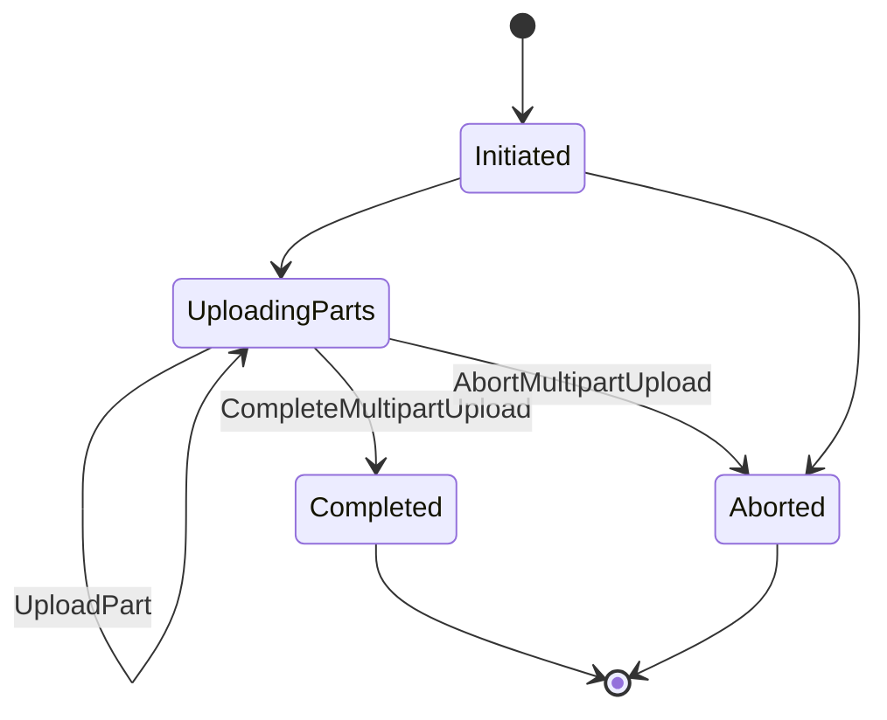
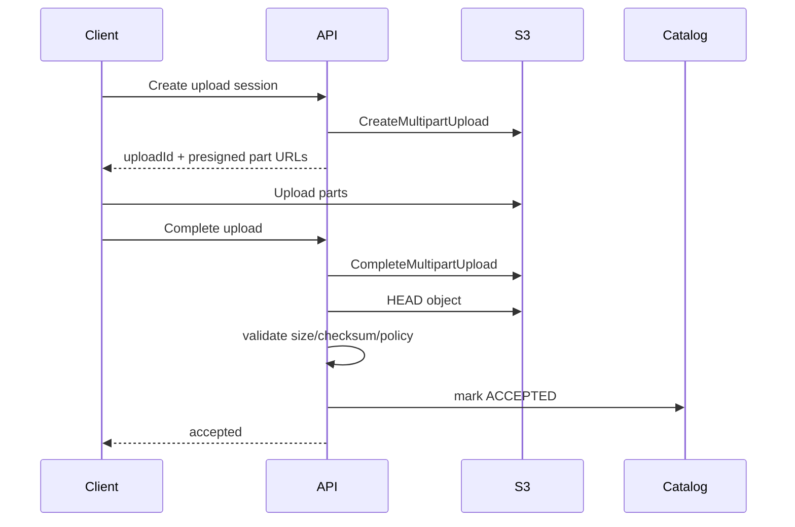
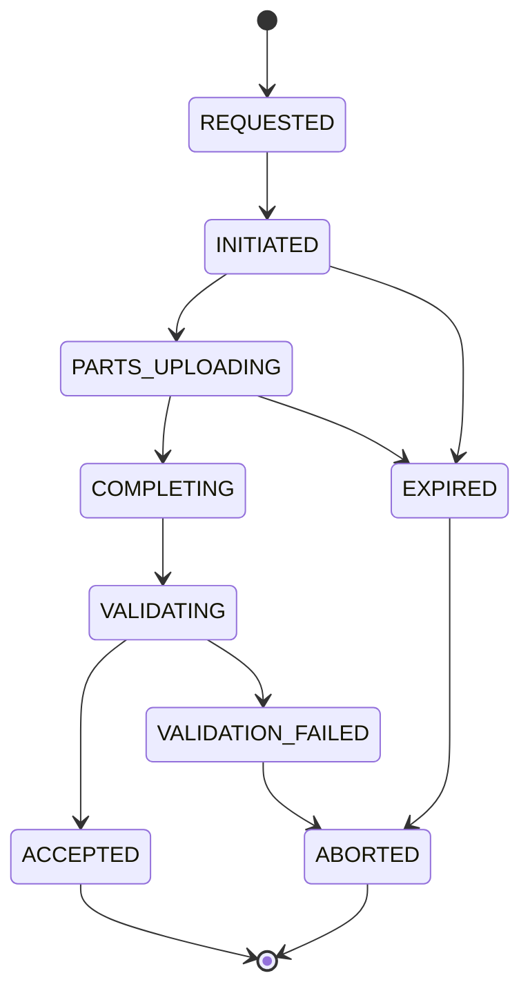
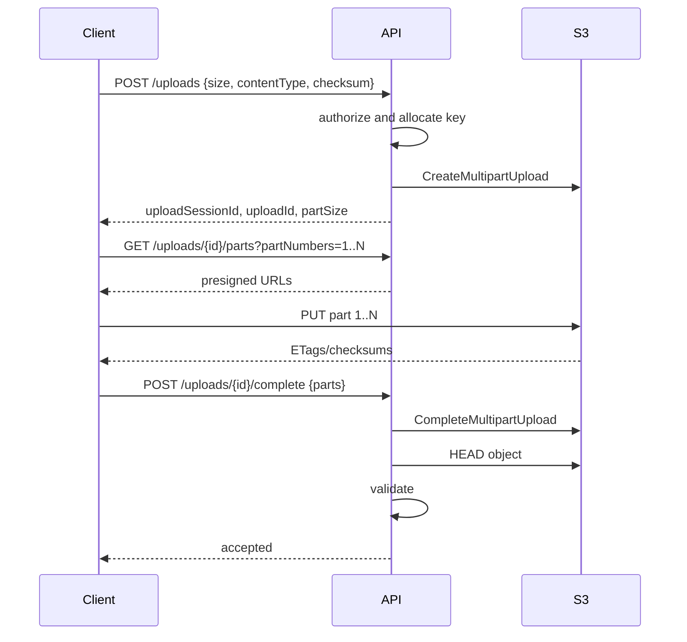

# Part 049 — S3 Large Object and Multipart Upload

Large object upload is not just "send file to S3."

It is a protocol.

A production-grade upload path must handle:

- large files
- unstable networks
- retries
- resumability
- checksum validation
- partial upload cleanup
- client timeouts
- duplicate completion calls
- malicious or oversized files
- KMS/encryption policy
- pre-signed URL security
- application catalog state
- object versioning
- user-visible success semantics
- downstream processing triggers

S3 Multipart Upload is the core primitive for large object ingestion. It lets you split a large object into parts, upload those parts independently, and complete the upload after all parts are uploaded. This gives better throughput, better retry behavior, and resumability compared with one huge request.

But multipart upload also introduces new failure states.

An initiated multipart upload can leave uploaded parts if the upload is never completed or aborted. Those parts are not visible as a completed object, but they can still consume storage. A production system must explicitly complete, abort, or lifecycle-clean incomplete multipart uploads.

This part is about designing that system.

---

## 1. Problem yang Diselesaikan

Kita akan membahas:

- kapan memakai multipart upload
- bagaimana multipart upload bekerja
- part sizing dan limit praktis
- checksum per part dan object-level integrity
- ETag misconception
- retry dan resumability
- pre-signed multipart upload
- upload session state machine
- abort incomplete multipart upload lifecycle
- large object security validation
- direct-to-S3 vs proxy-through-API
- operational runbook untuk stuck upload, checksum mismatch, orphan MPU, user retry, dan downstream duplicate event

---

## 2. Mental Model

### 2.1 Multipart upload is a state machine



Until `CompleteMultipartUpload` succeeds, there is no completed object at the final key.

But uploaded parts may exist and cost money.

### 2.2 Completed object is the commit point

For a multipart upload:

```text
CreateMultipartUpload
UploadPart 1
UploadPart 2
UploadPart 3
CompleteMultipartUpload
```

The application should treat `CompleteMultipartUpload` plus validation/catalog commit as the durable upload boundary.

Not:

```text
part 1 uploaded
```

Not:

```text
all client parts sent
```

Not:

```text
browser says upload finished
```

The durable application-level commit should be:

```text
S3 completed object exists
checksum/size/content policy validated
catalog state committed
```

### 2.3 Upload session is application state

S3 has an upload ID, but your application needs its own upload session.

Example:

```json
{
  "uploadSessionId": "up-20260706-abc",
  "caseId": "case-9231",
  "evidenceId": "ev-17",
  "bucket": "evidence-staging-prod",
  "key": "incoming/evidence/upload=up-20260706-abc/content.pdf",
  "s3UploadId": "VXBsb2FkIElE...",
  "expectedSizeBytes": 4288331200,
  "expectedChecksum": "sha256:...",
  "state": "INITIATED",
  "expiresAt": "2026-07-06T05:00:00Z",
  "createdBy": "user-991"
}
```

The application session controls:

- authorization
- allowed object key
- expected size
- expected content type
- checksum policy
- number of parts
- expiration
- completion idempotency
- catalog commit
- cleanup

### 2.4 Direct upload and business acceptance are different

A client uploading to S3 does not mean your business accepted the file.

Correct separation:

```text
physical upload complete != business upload accepted
```

Business acceptance requires validation.



---

## 3. Multipart Upload Core Concepts

### 3.1 Initiate

`CreateMultipartUpload` starts the upload and returns an upload ID.

At initiation, decide:

- bucket
- key
- metadata
- tags
- content type
- encryption
- storage class
- checksum algorithm
- object lock headers if applicable
- expected owner/bucket policy requirements

Do not let clients choose arbitrary keys.

### 3.2 Upload parts

Each part has:

- part number
- bytes
- checksum if used
- ETag returned by S3
- retry behavior

Part numbers are from 1 to 10,000. Part sizes must be between 5 MiB and 5 GiB except the last part, which can be smaller. Maximum object size is 5 TiB.

Design implication:

```text
minimum_part_size >= ceil(object_size / 10000)
```

For very large objects, part size must be large enough to avoid exceeding 10,000 parts.

### 3.3 Complete

`CompleteMultipartUpload` sends the ordered list of parts and ETags/checksum context required by S3.

After complete:

- S3 assembles object
- object becomes visible
- normal GET/HEAD works
- S3 events may fire
- lifecycle applies to completed object

### 3.4 Abort

`AbortMultipartUpload` stops the MPU and removes uploaded parts.

Use abort when:

- user cancels upload
- session expires
- checksum validation cannot pass
- upload is malicious/oversized
- business entity is deleted before completion
- completion repeatedly fails and state is invalid

Lifecycle should also abort old incomplete MPUs.

### 3.5 List parts and list multipart uploads

Useful for:

- resumability
- cleanup
- debugging
- stale upload detection
- proving which parts were received

But do not build user-facing list-heavy workflows on it.

---

## 4. Part Size Strategy

### 4.1 Part size formula

For an expected object size:

```text
min_part_size = ceil(expected_object_size / 10000)
```

Then choose a practical part size above it.

Examples:

| Object size | Minimum to fit <=10,000 parts | Practical starting point |
|---:|---:|---:|
| 100 MiB | 5 MiB floor | 8–16 MiB |
| 1 GiB | 5 MiB floor | 16–64 MiB |
| 100 GiB | ~10 MiB | 64–128 MiB |
| 1 TiB | ~105 MiB | 128–256 MiB |
| 5 TiB | ~524 MiB | 512 MiB+ |

The right size depends on:

- client memory
- network bandwidth
- retry cost
- parallelism
- latency
- object size distribution
- checksum overhead
- mobile/browser constraints
- server-side processing needs

### 4.2 Small parts increase overhead

Too-small parts cause:

- too many requests
- more ETags/checksums to track
- more retry metadata
- more completion payload
- higher request cost
- more pressure on client concurrency

### 4.3 Large parts increase retry pain

Too-large parts cause:

- more bytes lost per failed retry
- higher memory requirement
- worse mobile/network experience
- slower progress feedback
- less parallelism

### 4.4 Parallelism

Upload parallelism improves throughput until bottleneck:

- client CPU/checksum
- client bandwidth
- NAT/proxy path
- S3 request behavior
- browser limits
- KMS or policy checks
- local disk read speed
- mobile network stability

Start conservative.

Example:

```text
partSize = 64 MiB
parallelism = 4
```

Then measure.

### 4.5 Adaptive strategy

For production upload service:

```text
if file < 64 MiB:
    single PUT or small MPU
elif file < 5 GiB:
    MPU 16-64 MiB parts
else:
    MPU 128-512 MiB parts
```

But do not hardcode forever. Use telemetry.

---

## 5. Checksum and Integrity

### 5.1 ETag is not a universal checksum

For single-part uploads, ETag may look like an MD5 in many cases.

For multipart uploads, ETag is not simply the MD5 of the full object. Encryption and upload mode can also affect assumptions.

For critical integrity, use explicit checksum support or store your own digest.

### 5.2 S3 checksum algorithms

S3 supports additional checksum algorithms for object integrity, including algorithms such as CRC32, CRC32C, SHA1, SHA256, CRC64NVME, and others depending on API/context.

Production guidance:

- choose a checksum algorithm per data class
- validate on upload completion
- store checksum in catalog
- store checksum metadata where useful
- verify before business acceptance
- verify after replication/restore for critical data

### 5.3 Client-side full-object digest

For regulatory evidence or backup:

```text
sha256(file) computed before/during upload
```

Catalog:

```json
{
  "sha256": "b2af31...",
  "sizeBytes": 4288331200
}
```

After completion:

- HEAD object
- compare checksum if available
- compare size
- optionally read/verify for high-integrity workflows
- store version ID

### 5.4 Per-part checksum

Per-part checksum helps detect corruption at part upload level.

But full-object logical integrity still needs:

- complete part list
- final object checksum or stored digest
- catalog match
- application validation

### 5.5 Checksum mismatch runbook

If checksum mismatch after completion:

1. Mark upload session `VALIDATION_FAILED`.
2. Do not mark business object accepted.
3. Preserve object temporarily if forensic/debug needed.
4. Abort if incomplete; delete completed bad object if policy allows.
5. Ask client to retry with new upload session.
6. Investigate client bug/network/proxy/library.
7. Add telemetry: part number, client version, algorithm.

---

## 6. Upload Session State Machine

### 6.1 States



### 6.2 State table

| State | Meaning | Allowed actions |
|---|---|---|
| REQUESTED | app intent created | initiate or reject |
| INITIATED | S3 upload ID exists | upload parts, abort |
| PARTS_UPLOADING | client uploading | upload/list parts, complete, abort |
| COMPLETING | app is completing MPU | retry complete idempotently |
| VALIDATING | completed object being validated | accept or fail |
| ACCEPTED | business accepted | process downstream |
| VALIDATION_FAILED | object invalid | abort/delete/quarantine |
| EXPIRED | no longer valid | abort MPU |
| ABORTED | upload abandoned | final cleanup |

### 6.3 Idempotent completion

Client may call complete multiple times.

Completion endpoint should:

- lock upload session
- check state
- if ACCEPTED, return accepted result
- if COMPLETING/VALIDATING, return in-progress or retry-safe result
- if expired/aborted, reject
- if initiated, call CompleteMultipartUpload once or safely retry after checking object
- validate HEAD object
- commit catalog once

### 6.4 Expiration

Upload sessions need expiration.

Expiration must coordinate:

- pre-signed URL TTL
- application session TTL
- multipart abort lifecycle
- user retry UX
- object cleanup
- catalog state

Example:

```text
presigned part URL TTL: 15 minutes
upload session TTL: 24 hours
abort incomplete MPU lifecycle: 2 days
staging object cleanup: 7 days
```

---

## 7. Direct-to-S3 vs Proxy Upload

### 7.1 Proxy through API

Client uploads to app server, app server uploads to S3.

Pros:

- simple authorization
- full server-side validation
- no pre-signed complexity
- easy audit at API layer

Cons:

- app server handles huge traffic
- double bandwidth
- higher latency
- scaling pressure
- timeout risk
- expensive for large objects

Use for:

- small files
- strict inspection before storage
- internal services with low volume
- legacy clients

### 7.2 Direct-to-S3

Client uploads directly to S3 using pre-signed URL or credentials.

Pros:

- app server offload
- better scalability
- client can parallelize parts
- lower app compute/network cost

Cons:

- more complex state machine
- must constrain key/size/type
- completion callback required
- cleanup required
- validation after upload required
- pre-signed URL leakage risk
- browser/mobile retry complexity

Use for:

- large user uploads
- media/document ingestion
- browser/mobile apps
- high-volume file intake
- batch import

### 7.3 Recommended production pattern

For large user upload:

1. API authenticates user.
2. API creates upload session.
3. API chooses bucket/key.
4. API initiates MPU.
5. API returns pre-signed part URLs or signing endpoint.
6. Client uploads parts.
7. Client reports uploaded parts.
8. API completes MPU.
9. API validates object.
10. API commits catalog.
11. S3 event triggers downstream only after accepted prefix or manifest.

### 7.4 Do not expose arbitrary key write

Pre-signed URL must constrain:

- bucket
- key
- method
- expiration
- content length where possible
- checksum headers where possible
- content type where useful
- server-side encryption requirements
- metadata/tags if required

---

## 8. Pre-Signed Multipart Upload Pattern

### 8.1 API flow



### 8.2 Why API completes upload

Letting client complete directly is possible, but application-controlled completion is often safer because the API can:

- validate user/session
- ensure expected parts
- validate size/checksum
- commit catalog
- prevent accepting unexpected key
- handle idempotency
- record version ID
- trigger domain workflow

### 8.3 Part URL batching

Do not generate 10,000 URLs at once unless needed.

Use batches:

```text
GET /uploads/{id}/parts?start=1&count=20
```

This limits exposure and supports resumability.

### 8.4 Resume upload

To resume:

1. Client asks API for upload session.
2. API checks state and expiry.
3. API calls ListParts or uses stored part records.
4. Client uploads missing parts.
5. Complete.

Part records:

```json
{
  "partNumber": 17,
  "etag": "\"abc...\"",
  "sizeBytes": 67108864,
  "checksum": "..."
}
```

### 8.5 Client retry

For part upload failure:

- retry same part number
- use backoff/jitter
- if URL expired, request new pre-signed URL
- if part uploaded but response lost, list parts or retry same part
- do not allocate new upload session unless old one is abandoned

---

## 9. Security and Validation

### 9.1 Size validation

Enforce at multiple layers:

- declared expected size
- pre-signed constraints where possible
- part count and part size
- object HEAD after completion
- application max size by data class
- decompression expansion guard if archive

### 9.2 Content type validation

Do not trust browser-provided content type.

Use:

- declared type
- server-side sniffing where appropriate
- malware scanning
- parser validation
- allowed extension as weak signal only

### 9.3 Metadata constraints

Required metadata might include:

- upload session ID
- tenant ID or opaque owner ID
- classification
- schema version
- checksum
- producer
- original filename

But sensitive data in object metadata can leak into logs/events/tools. Use catalog for sensitive business data.

### 9.4 KMS/encryption

For protected uploads:

- server-side encryption required
- bucket policy enforces encryption
- KMS key selected by data class
- client cannot choose arbitrary key
- recovery role has decrypt access
- replication role has required KMS access

### 9.5 Malware and content scanning

Upload acceptance states:

```text
UPLOADED
VALIDATING
MALWARE_SCAN_PENDING
ACCEPTED
REJECTED
QUARANTINED
```

Do not expose uploaded object as trusted until validation completes.

### 9.6 Decompression bombs

For archives:

- limit uncompressed size
- limit file count
- limit nesting depth
- limit compression ratio
- process in sandbox
- use scratch budget
- timeout extraction
- reject suspicious archives

---

## 10. Event-Driven Completion Design

### 10.1 Avoid processing staging uploads too early

If S3 event fires after completed object in staging:

```text
staging/uploads/...
```

the object may not yet be business-accepted.

Options:

1. Do not configure events on staging prefix.
2. API writes/copies accepted object to `accepted/` prefix after validation.
3. API writes manifest to `manifests/accepted/`.
4. Event processor triggers only on accepted manifest.

Preferred:

```text
staging/ -> API validate -> accepted/manifest -> processor
```

### 10.2 Manifest trigger

For large uploads, create manifest:

```json
{
  "uploadSessionId": "up-abc",
  "bucket": "evidence-prod",
  "key": "accepted/evidence/ev-17/content.pdf",
  "versionId": "abc",
  "sizeBytes": 4288331200,
  "sha256": "...",
  "acceptedAt": "2026-07-06T03:00:00Z"
}
```

Then trigger processing on manifest, not raw object.

### 10.3 Duplicate completion and duplicate event

Completion endpoint and event processor both need idempotency.

```text
upload complete may be called twice
ObjectCreated event may be delivered twice
processor may retry after writing output
```

Every stage has its own idempotency key.

---

## 11. Cleanup

### 11.1 Abort incomplete multipart uploads

Always configure lifecycle abort for incomplete MPUs on buckets/prefixes that use MPU.

Example lifecycle concept:

```json
{
  "Rules": [
    {
      "ID": "abort-incomplete-mpu",
      "Status": "Enabled",
      "Filter": {
        "Prefix": "staging/"
      },
      "AbortIncompleteMultipartUpload": {
        "DaysAfterInitiation": 2
      }
    }
  ]
}
```

### 11.2 Application cleanup

Lifecycle is not a substitute for app state cleanup.

Cleanup jobs should:

- mark expired sessions
- abort known upload IDs
- clean staging objects not accepted
- preserve forensic/quarantine objects as required
- avoid deleting accepted objects
- report orphaned sessions

### 11.3 Orphan detection

Orphan types:

| Orphan | Meaning |
|---|---|
| app session without S3 upload ID | initiation failed |
| S3 MPU without active app session | app lost state or expired |
| completed S3 object without catalog | completion/catalog failure |
| catalog accepted but object missing | severe consistency/permission/delete issue |
| staging object old and unaccepted | validation/callback failure |

Use reconciliation.

### 11.4 Incomplete MPU cost

Incomplete parts can incur storage cost. Use S3 Storage Lens/Inventory/operational queries where available to detect them, and lifecycle abort to remove them.

---

## 12. Performance Engineering

### 12.1 Throughput model

Upload throughput is roughly:

```text
throughput = min(
    client_network,
    client_disk_read,
    part_size * parallelism / part_upload_time,
    S3/client connection behavior,
    NAT/proxy/egress path,
    KMS/policy overhead
)
```

### 12.2 Client-side constraints

Browser/mobile:

- memory pressure
- background upload interruption
- network changes
- battery saver
- tab close
- upload progress
- retry persistence
- URL expiration
- CORS

Server-side:

- disk read throughput
- CPU checksum
- connection pool
- SDK retry
- temporary file handling
- local scratch

### 12.3 S3 performance guidelines

For high throughput:

- parallelize requests
- use byte-range GET for downloads
- retry slow requests
- use appropriate SDK timeouts
- avoid per-request client construction
- distribute request load where needed
- measure first-byte latency and retry rate
- use S3 Transfer Acceleration only when measured beneficial

### 12.4 Download large objects

Large object download also benefits from:

- range requests
- parallel download
- checksum validation
- resumability
- CDN/CloudFront where appropriate
- local disk write safety
- partial file atomic rename

---

## 13. Observability

Track:

- upload sessions by state
- initiated MPUs
- completed MPUs
- aborted MPUs
- expired sessions
- parts uploaded
- average part size
- part retry count
- completion latency
- validation failures
- checksum mismatch count
- incomplete MPU bytes
- staging object age
- accepted object count
- upload throughput
- client error rate by version/platform
- S3 4xx/5xx
- KMS errors
- CORS/pre-signed URL failures
- event processing lag after acceptance

Dashboards should answer:

```text
Are users uploading?
Are uploads completing?
Are objects accepted?
Are incomplete uploads accumulating?
Are downstream processors keeping up?
```

---

## 14. Failure Modes

### 14.1 Client timeout after successful part upload

Symptom:

- client retries part
- duplicate part upload for same part number
- ETag differs if bytes differ

Fix:

- retry same part with same bytes
- list parts on resume
- validate part ETags/checksums
- avoid changing file content mid-upload

### 14.2 Complete request timeout

Symptom:

- client/API does not know if object completed
- retry completion may fail or duplicate

Fix:

- HEAD final object
- check upload session state
- idempotent complete endpoint
- store completion attempt record
- if object exists and validates, mark accepted

### 14.3 Incomplete MPU cost leak

Symptom:

- storage cost grows
- no visible completed object
- many old MPUs

Fix:

- lifecycle abort incomplete MPUs
- app expiration job
- list multipart uploads for debugging
- fix clients that abandon sessions

### 14.4 Checksum mismatch

Symptom:

- completed object size/checksum wrong
- parser failure downstream
- user upload corrupted

Fix:

- fail validation
- do not accept object
- quarantine or delete according to policy
- ask retry
- inspect client/proxy/chunking bug

### 14.5 Staging object processed before validation

Symptom:

- malware/invalid object processed
- downstream side effects before acceptance

Fix:

- disable staging prefix events
- trigger on accepted manifest
- add catalog state check in processor
- quarantine invalid uploads

### 14.6 Pre-signed URL leaked

Symptom:

- unauthorized upload attempt
- unexpected object size/type
- user denies action

Fix:

- short URL TTL
- constrain key
- validate session ownership on complete
- reject unexpected object metadata/size
- rotate session
- audit access logs/CloudTrail where available

---

## 15. Operational Runbooks

### 15.1 User says upload stuck

1. Find upload session.
2. Check state and expiry.
3. Check S3 upload ID exists.
4. List parts.
5. Check last uploaded part time.
6. Check client errors.
7. Generate new part URLs if session valid.
8. Resume missing parts.
9. Expire/abort if invalid.

### 15.2 Upload completed but app does not show file

1. HEAD final object.
2. Check catalog state.
3. Check validation job.
4. Check checksum/size.
5. Check S3 event/manifest.
6. Check KMS access.
7. Check object version ID.
8. Re-run completion idempotently if safe.

### 15.3 Incomplete MPU spike

1. Identify bucket/prefix.
2. Check lifecycle abort rule.
3. List multipart uploads sample.
4. Identify client/app version.
5. Check upload session expiry job.
6. Abort stale uploads if safe.
7. Patch abandonment source.
8. Add metric/alert.

### 15.4 Checksum mismatch incident

1. Stop accepting affected client version if widespread.
2. Preserve sample object if needed.
3. Compare client checksum, part checksums, S3 checksum.
4. Validate part order in CompleteMultipartUpload.
5. Check file mutation during upload.
6. Check proxy/transcoding bug.
7. Reject affected uploads and notify retry.
8. Add regression test.

### 15.5 Accidental huge upload

1. Check session max size.
2. Abort MPU if incomplete.
3. If completed, quarantine or delete according to policy.
4. Patch size validation/pre-signed policy.
5. Add billing alert.
6. Add WAF/API limit where relevant.

---

## 16. Design Checklist

### 16.1 Upload protocol

- [ ] Application allocates key.
- [ ] Upload session has expiry.
- [ ] MPU initiated by trusted backend.
- [ ] Part size calculated from expected size.
- [ ] Part count cannot exceed 10,000.
- [ ] Checksum strategy defined.
- [ ] Completion endpoint is idempotent.
- [ ] Object HEAD validation after complete.
- [ ] Catalog commit after validation.
- [ ] Client retry/resume supported.
- [ ] Upload cancellation aborts MPU.

### 16.2 Security

- [ ] Pre-signed URL TTL short enough.
- [ ] Key constrained to session.
- [ ] Size/type validated.
- [ ] Encryption enforced.
- [ ] KMS key controlled.
- [ ] Metadata/tags validated.
- [ ] Malware/content validation state exists.
- [ ] Staging prefix not trusted.
- [ ] Accepted state separate from uploaded state.

### 16.3 Cleanup

- [ ] Lifecycle abort incomplete MPUs.
- [ ] Expired session cleanup job.
- [ ] Staging object cleanup.
- [ ] Orphan reconciliation.
- [ ] Incomplete MPU metric.
- [ ] Runbook for stuck sessions.
- [ ] Runbook for checksum mismatch.

### 16.4 Downstream

- [ ] Process accepted manifest, not raw staging event.
- [ ] Event processor idempotent.
- [ ] Output attempt-scoped.
- [ ] Poison object handling.
- [ ] DLQ/redrive if event-driven.
- [ ] Catalog state transition once.

---

## 17. Mini Case Study — 4 GB Evidence Video Upload

### 17.1 Requirement

Users upload large video evidence files.

Constraints:

- browser/mobile clients
- unstable network
- max file size 10 GB
- malware/content validation required
- object must be immutable after acceptance
- reviewers see file only after validation
- processing pipeline extracts thumbnails/transcripts

### 17.2 Design

Flow:

1. API creates upload session.
2. API initiates MPU under `staging/uploads/<session-id>/content`.
3. API returns part size 64 MiB.
4. Client uploads up to 4 parts concurrently.
5. Client reports part ETags/checksums.
6. API completes MPU.
7. API validates size/checksum.
8. Malware scanner scans object.
9. API copies/promotes object to accepted immutable prefix or records accepted version.
10. API writes accepted manifest.
11. S3 event on accepted manifest triggers processing.

### 17.3 Invariants

```text
Staging upload is not evidence.
Accepted manifest is evidence workflow trigger.
Catalog ACCEPTED state means durable object exists, validates, and is allowed for processing.
```

### 17.4 Failure behavior

- user closes browser: session remains resumable until expiry
- session expires: MPU aborted
- part upload fails: retry same part
- complete times out: API checks final object and resumes completion
- scanner rejects file: catalog state REJECTED, staging object quarantined/deleted by policy
- event duplicates: processor idempotency prevents duplicate transcript

---

## 18. Summary

S3 Multipart Upload is the right primitive for large object ingestion, but it must be wrapped in an application protocol.

Production-grade large upload requires:

- explicit upload session
- backend-controlled key
- part sizing strategy
- checksum validation
- idempotent completion
- abort/cleanup path
- lifecycle abort incomplete MPUs
- direct-to-S3 security constraints
- staging vs accepted state separation
- downstream manifest/event processing
- observability and runbooks

The core rule:

> A large object is not accepted when bytes are sent. It is accepted when the completed object is validated and the catalog commit succeeds.

Next, we move to S3 data layout for analytics and applications: partition design, manifest design, small-file compaction, application object layout, data lake layout, and table-like S3 datasets.

---

## References

- AWS S3 User Guide — Uploading and copying objects using multipart upload: https://docs.aws.amazon.com/AmazonS3/latest/userguide/mpuoverview.html
- AWS S3 User Guide — Multipart upload limits: https://docs.aws.amazon.com/AmazonS3/latest/userguide/qfacts.html
- AWS S3 User Guide — Checking object integrity in Amazon S3: https://docs.aws.amazon.com/AmazonS3/latest/userguide/checking-object-integrity.html
- AWS S3 User Guide — Checking object integrity for data uploads: https://docs.aws.amazon.com/AmazonS3/latest/userguide/checking-object-integrity-upload.html
- AWS S3 User Guide — Abort incomplete multipart uploads using lifecycle: https://docs.aws.amazon.com/AmazonS3/latest/userguide/mpu-abort-incomplete-mpu-lifecycle-config.html
- AWS S3 API Reference — UploadPart: https://docs.aws.amazon.com/AmazonS3/latest/API/API_UploadPart.html
- AWS S3 User Guide — Performance guidelines for Amazon S3: https://docs.aws.amazon.com/AmazonS3/latest/userguide/optimizing-performance-guidelines.html
