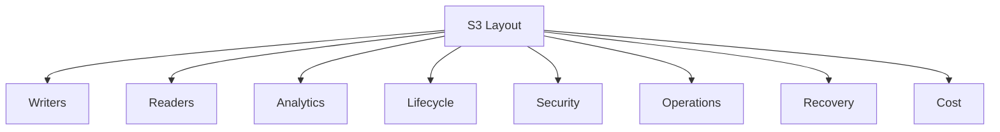
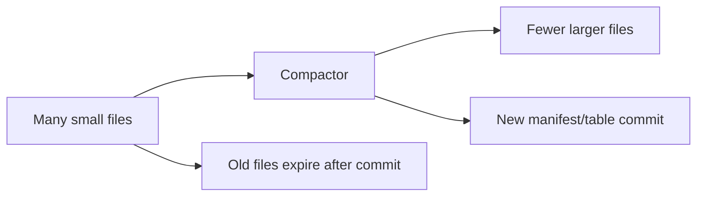

# Part 050 — S3 Data Layout for Analytics and Applications

S3 can store almost anything.

That is both its strength and its trap.

A bucket can hold documents, logs, artifacts, backups, exports, table partitions, manifests, model files, temporary attempts, and immutable evidence blobs. S3 will accept the objects if your permissions and request are valid.

But production systems need more than accepted objects.

They need layout.

A good S3 data layout answers:

- how writers commit data
- how readers discover data
- how analytics engines prune data
- how failed attempts are ignored
- how small files are compacted
- how object lifecycle is applied
- how schema evolves
- how business entities map to objects
- how recovery works
- how cost is controlled
- how operators debug an incident at 3 a.m.

This part covers S3 layout for both application object storage and analytics/data-lake workloads.

---

## 1. Problem yang Diselesaikan

Kita akan membahas:

- perbedaan application object layout vs analytics layout
- bagaimana memilih key/prefix structure
- partitioning untuk query pruning
- small-file problem dan compaction
- manifest/catal​​og pattern
- raw/processed/curated zones
- attempt path dan commit protocol
- object layout untuk documents, artifacts, exports, events, backups
- table-like datasets di atas S3
- Glue/Athena/Spark/Iceberg/Hudi/Delta considerations
- lifecycle dan retention by layout
- runbook untuk slow queries, missing data, duplicate data, small-file explosion, dan wrong partition

---

## 2. Mental Model

### 2.1 S3 layout is an application protocol

A layout is not a folder convention. It is a protocol between:

- writers
- readers
- batch jobs
- event processors
- lifecycle rules
- IAM policies
- data catalog
- cost tools
- backup/restore workflows
- humans



If only the writer understands the layout, the system is fragile.

### 2.2 Application layout and analytics layout optimize for different reads

Application object layout:

```text
Get object by exact business reference.
```

Analytics layout:

```text
Scan many objects efficiently with partition pruning.
```

Document store wants:

- exact lookup
- immutable blobs
- metadata catalog
- retention per object
- auditability

Data lake wants:

- partition pruning
- columnar format
- compaction
- table metadata
- schema evolution
- batch/stream writes
- query performance

Do not force one layout to serve every access pattern. Use derived layouts.

### 2.3 Source of truth vs derived datasets

Raw source:

```text
raw object uploaded by user/system
```

Derived dataset:

```text
processed/normalized/aggregated representation
```

The raw source may be immutable and retained. The derived dataset may be rebuildable.

This changes lifecycle:

```text
raw: retain according to business/compliance
processed: retain if expensive/audit-needed, otherwise rebuild/expire
attempts: expire quickly
```

### 2.4 Commit protocol matters more than folder neatness

A beautiful prefix tree that exposes partial output is broken.

A production layout must define:

- where attempts write
- how completion is signaled
- how consumers discover committed data
- how failed attempts expire
- how retries avoid mixing files
- how catalog/table metadata is updated
- how readers avoid partial datasets

---

## 3. Layout Classes

### 3.1 Application object store

Use for:

- documents
- images
- videos
- evidence files
- artifacts
- exports
- backups
- model binaries
- user uploads

Primary access:

```text
catalog -> bucket/key/version -> GET object
```

Layout example:

```text
blobs/sha256/b2/af/<digest>/content
manifests/evidence/<evidence-id>.json
exports/tenant=<tenant-id>/export=<export-id>/file.zip
artifacts/service=<service>/release=<release-id>/app.tar
```

### 3.2 Event/log dataset

Use for:

- application events
- audit logs
- clickstream
- telemetry
- operational logs
- append-only fact data

Primary access:

```text
query by time/source/type
```

Layout example:

```text
events/source=portal/event=case-submitted/dt=2026-07-06/hour=03/part-0001.jsonl.gz
events/source=portal/event=case-submitted/dt=2026-07-06/hour=03/part-0002.parquet
```

### 3.3 Table dataset

Use for:

- analytics tables
- curated facts
- incremental datasets
- slowly changing dimensions
- lakehouse tables

Primary access:

```text
table catalog -> metadata snapshot -> data files
```

Layout example:

```text
tables/case_events/
  metadata/
  data/dt=2026-07-06/hour=03/part-0001.parquet
```

For table formats like Apache Iceberg/Hudi/Delta, table metadata is part of the commit protocol.

### 3.4 Processing attempt layout

Use for:

- ETL attempts
- conversion jobs
- media processing
- ML preprocessing
- batch output before commit

Layout:

```text
processing-attempts/pipeline=<pipeline>/job=<job-id>/attempt=<attempt-id>/
```

Consumers should not read this directly except for debugging.

### 3.5 Backup layout

Use for:

- database backup files
- export snapshots
- application backup chunks
- restore manifests

Layout:

```text
backups/system=<system>/dt=2026-07-06/backup=<backup-id>/manifest.json
backups/system=<system>/dt=2026-07-06/backup=<backup-id>/chunks/chunk-000001
```

Restore reads manifest, not raw listing.

---

## 4. Zone Design

### 4.1 Raw, processed, curated

Common data lake zones:

```text
raw/
processed/
curated/
```

Meaning:

| Zone | Purpose | Mutation |
|---|---|---|
| raw | original data as received | append/immutable preferred |
| processed | cleaned/normalized data | derived, rebuildable |
| curated | business-ready tables | governed, schema-managed |

But names alone are not enough. Each zone needs contract.

### 4.2 Bronze/silver/gold

Equivalent pattern:

```text
bronze/
silver/
gold/
```

Use only if the organization understands it. Otherwise raw/processed/curated is clearer.

### 4.3 Attempts outside committed zones

Do not write failed attempts into curated path.

Bad:

```text
curated/table=case_events/dt=2026-07-06/attempt-1/part.parquet
```

Better:

```text
processing-attempts/table=case_events/job=job-123/attempt=1/part.parquet
curated/table=case_events/dt=2026-07-06/part-committed.parquet
```

Or table format commit protocol handles uncommitted files.

### 4.4 Manifest per zone transition

When data moves from raw to processed:

```text
raw manifest -> processed manifest -> catalog commit
```

This lets you trace lineage.

---

## 5. Partitioning for Analytics

### 5.1 Partitioning purpose

Partitioning helps query engines skip data.

If most queries filter by date, use date partition.

```text
dt=2026-07-06/
```

If queries filter by source and date:

```text
source=portal/dt=2026-07-06/
```

Partitioning is not just for neatness. It is query pruning.

### 5.2 Common partition dimensions

| Dimension | Good when | Risk |
|---|---|---|
| date/hour | time-range queries | too many tiny hourly files |
| source/system | source-specific queries | skewed source |
| event type | event-specific queries | too many event types |
| tenant | tenant isolation/query | high cardinality, skew, sensitive |
| region | regional analytics | cross-region aggregation |
| version/schema | schema migration | query complexity |

### 5.3 High-cardinality trap

Bad partition:

```text
user_id=<user-id>/
```

if there are millions of users and queries rarely filter by exact user.

High-cardinality partitions cause:

- too many prefixes
- too many small files
- catalog bloat
- slow planning
- poor compaction
- lifecycle complexity

Use high-cardinality fields inside data files and index/table features, not always as S3 partition path.

### 5.4 Partition order

Order matters for listing and operational scans.

Example:

```text
events/source=portal/event=case-submitted/dt=2026-07-06/hour=03/
```

Good for source/event-specific queries.

Alternative:

```text
events/dt=2026-07-06/hour=03/source=portal/event=case-submitted/
```

Good for time-first jobs.

Choose based on dominant access path.

### 5.5 Hive-style partition keys

Common convention:

```text
dt=2026-07-06/hour=03/
```

Benefits:

- catalog tools infer partition columns
- humans understand field names
- query engines integrate well

### 5.6 Late-arriving data

Late events for old partition require policy:

- allow writes to older partitions
- compact old partitions periodically
- track ingestion time separately from event time
- use table format that supports incremental commits
- avoid assuming partition immutable immediately

Example:

```text
event_dt=2026-07-06/ingest_dt=2026-07-08/
```

But too many dimensions can over-partition.

---

## 6. File Format

### 6.1 JSON/CSV

Good for:

- raw ingestion
- debugging
- small/simple pipelines
- human-readable logs

Bad for:

- large analytics scans
- schema evolution at scale
- compression/column pruning
- nested data performance

### 6.2 JSON Lines + compression

```text
part-0001.jsonl.gz
```

Good for append events and raw logs.

### 6.3 Parquet

Good for analytics:

- columnar
- compressed
- schema-aware
- efficient for Athena/Glue/Spark
- supports predicate/column pruning

S3 data lake analytics often benefits from Parquet or ORC rather than JSON/CSV for large datasets.

### 6.4 Avro

Good for:

- row-oriented data
- schema evolution
- streaming ingestion
- intermediate durable logs

### 6.5 Table formats

Apache Iceberg, Hudi, and Delta Lake add table-level metadata/transaction semantics over files in object storage.

They help with:

- snapshot isolation
- schema evolution
- partition evolution
- compaction
- delete/update/merge semantics
- time travel
- manifest/metadata management

But they also require:

- compatible engines
- catalog integration
- commit protocol discipline
- maintenance operations
- operational expertise

Do not adopt table format just to avoid thinking. Adopt it when table semantics are required.

---

## 7. Small-File Problem

### 7.1 Definition

Small-file problem occurs when many tiny objects represent data that would be more efficient as fewer larger objects.

Example:

```text
10 million files x 2 KB
```

instead of:

```text
1000 files x 20 MB
```

### 7.2 Why it hurts

Small files hurt:

- request cost
- listing cost
- query planning
- metadata catalog size
- lifecycle operations
- replication
- event fanout
- compression ratio
- CPU overhead
- Glue/Spark/Athena performance

AWS Glue has specific grouping features to group input files within S3 data partitions when there are many small files, but grouping is mitigation, not a substitute for good layout and compaction.

### 7.3 Causes

- event-per-object writers
- Lambda writing one file per invocation
- streaming micro-batches too small
- partitioning too granular
- high-cardinality partition keys
- retries producing attempt files in committed path
- no compaction job
- one object per business record

### 7.4 Target file size

There is no universal file size, but analytics datasets usually perform better with fewer moderately large files than millions of small files.

Common starting targets:

```text
128 MiB to 1 GiB per Parquet file
```

Adjust based on:

- query engine
- compression
- row group size
- parallelism
- partition size
- update frequency
- SLA

### 7.5 Compaction

Compaction reads many small files and writes fewer larger files.



Compaction must be commit-safe:

- write compacted files to attempt path
- validate counts/checksums
- commit manifest/table metadata
- expire old files after readers no longer need them

### 7.6 S3 Tables note

Amazon S3 Tables/table buckets provide managed table storage capabilities and can perform automatic maintenance such as compaction, snapshot management, and unreferenced file removal for table workloads. That is useful for certain analytics workloads, but the underlying design principles remain: table metadata is the authority, and object layout/compaction determines query behavior.

---

## 8. Manifest and Catalog

### 8.1 Manifest for dataset commit

Manifest example:

```json
{
  "dataset": "case_events",
  "version": "2026-07-06T03:00:00Z",
  "schemaVersion": 3,
  "partition": {
    "dt": "2026-07-06",
    "hour": "03"
  },
  "files": [
    {
      "key": "curated/case_events/dt=2026-07-06/hour=03/part-0001.parquet",
      "sizeBytes": 268435456,
      "rowCount": 1029384,
      "sha256": "..."
    }
  ]
}
```

### 8.2 Catalog for business queries

For application objects:

```text
caseId -> evidence objects
tenantId -> exports
backupId -> backup chunks
artifact release -> object keys
```

Use database/catalog.

For analytics:

- AWS Glue Data Catalog
- Iceberg/Hudi/Delta catalog
- Hive metastore-compatible catalog
- custom metadata table

### 8.3 Catalog is authority for committed data

Object existence alone is not enough.

A file under `processing-attempts/` exists, but it is not committed.

A compacted file exists, but table metadata may not point to it.

A raw object exists, but catalog may mark upload rejected.

Rule:

```text
Readers use catalog/manifest/table metadata, not raw bucket scan, for committed state.
```

### 8.4 Reconciliation

Periodically check:

- catalog points to existing objects
- S3 objects have catalog owner
- uncommitted attempt files expire
- table metadata references valid files
- no unexpected objects in curated prefix
- partitions match catalog
- lifecycle did not remove committed files

---

## 9. Application Object Layout Patterns

### 9.1 Document/evidence store

```text
blobs/sha256/<2>/<2>/<digest>/content
manifests/evidence/evidence-id=<id>.json
```

Catalog:

```text
evidence_id -> blob_key + version_id + checksum + retention
```

Benefits:

- immutable
- dedupe possible
- stable reference
- business state externalized
- retention explicit

### 9.2 User exports

```text
exports/tenant=<tenant-id>/export=<export-id>/manifest.json
exports/tenant=<tenant-id>/export=<export-id>/files/export.zip
```

Lifecycle:

- expire after download window
- retain manifest longer if audit needed
- no archive if user needs immediate download

### 9.3 Release artifacts

```text
artifacts/service=<service>/release=<release-id>/app.tar
artifacts/service=<service>/release=<release-id>/sbom.json
artifacts/service=<service>/current.json
```

Current pointer is small and controlled.

### 9.4 ML model registry

```text
models/name=<model>/version=<version>/model.tar
models/name=<model>/version=<version>/metrics.json
models/name=<model>/version=<version>/signature.json
models/name=<model>/current.json
```

Include:

- checksum
- training data reference
- code version
- environment
- approval status
- rollback pointer

### 9.5 Backup chunks

```text
backups/system=<system>/backup=<backup-id>/manifest.json
backups/system=<system>/backup=<backup-id>/chunks/chunk-000001
```

Restore always starts from manifest.

---

## 10. Analytics Layout Patterns

### 10.1 Raw event landing

```text
raw/events/source=portal/dt=2026-07-06/hour=03/batch=<uuid>.jsonl.gz
```

Properties:

- append-only
- minimal transformation
- schema captured
- ingestion metadata
- replayable
- retained according to source policy

### 10.2 Processed normalized data

```text
processed/events/source=portal/event=case-submitted/dt=2026-07-06/hour=03/part-0001.parquet
```

Properties:

- typed schema
- quality checks
- normalized fields
- compacted
- partitioned for common queries

### 10.3 Curated table

```text
curated/table=case_events/dt=2026-07-06/hour=03/part-0001.parquet
```

or table format:

```text
warehouse/case_events/
  metadata/
  data/dt=2026-07-06/hour=03/...
```

Properties:

- business-ready
- cataloged
- query optimized
- governed
- schema evolution controlled

### 10.4 Quarantine

```text
quarantine/source=portal/reason=schema-invalid/dt=2026-07-06/object=<id>
```

Quarantine objects should have:

- reason
- source reference
- error details
- owner
- retry policy
- lifecycle

### 10.5 Backfill layout

Backfill should not mix with live writes blindly.

```text
backfill/job=<job-id>/attempt=<attempt-id>/...
```

Then commit to target table/prefix through manifest/table metadata.

---

## 11. Commit Protocols

### 11.1 Simple append

Acceptable when:

- each object is independent
- duplicates are tolerable or handled
- readers expect append-only
- no multi-object atomicity needed

Example:

```text
logs/dt=2026-07-06/hour=03/part-<uuid>.jsonl.gz
```

### 11.2 Manifest commit

Use when:

- dataset version contains multiple files
- readers need completeness
- retries possible
- validation required

Flow:

1. write output files to attempt path
2. validate
3. write manifest
4. update catalog pointer
5. expire failed attempts

### 11.3 Table format commit

Use when:

- updates/deletes/merges needed
- snapshot isolation needed
- schema evolution needed
- many readers/writers
- compaction integrated
- time travel needed

Table metadata commit is the authority.

### 11.4 Pointer commit

Use when:

- latest artifact/version needed
- immutable versions exist
- rollback needed

```text
versions/release-001/...
current.json
```

Pointer commit changes small object/catalog row.

---

## 12. Lifecycle by Layout

### 12.1 Raw

Retention:

- business/compliance driven
- often longer
- versioning/lock depending criticality
- archive after active window if retrieval SLA allows

### 12.2 Processing attempts

Retention:

- short
- expire after debug window
- abort incomplete multipart uploads
- never treated as committed

### 12.3 Processed

Retention:

- based on rebuild cost and audit needs
- compact old partitions
- archive rarely used partitions if query SLA allows

### 12.4 Curated

Retention:

- governed by business reporting requirements
- table metadata and data files must align
- do not lifecycle-delete files still referenced by table snapshots

### 12.5 Exports

Retention:

- short user download window
- manifest/audit optionally longer
- do not archive if immediate download expected

### 12.6 Backups

Retention:

- RPO/RTO/compliance driven
- manifest and chunks aligned
- Object Lock/cross-account for high-value backup
- restore tested

---

## 13. Security and Data Leakage

### 13.1 Keys are metadata

S3 keys appear in:

- logs
- events
- inventory
- metrics
- error messages
- support tooling
- access trails
- cost reports

Do not put sensitive names or personal data in keys.

Bad:

```text
customers/john-smith/passport.pdf
```

Better:

```text
tenants/tnt-83f2/evidence/ev-17/content
```

or content-addressed blob with catalog.

### 13.2 Layout and IAM

Prefix-based IAM can be useful:

```text
tenant=<tenant-id>/
```

But high-cardinality tenant prefix may affect layout. Also, IAM must not be the only isolation for sensitive multi-tenant apps unless fully designed and tested.

### 13.3 Layout and KMS

Different data classes may require different KMS keys:

- evidence
- backups
- logs
- exports
- temporary staging

Do not mix data requiring separate key ownership under one prefix without policy.

### 13.4 Layout and Object Lock

Keep locked objects separate.

```text
locked/
staging/
attempts/
```

Do not let temporary objects enter locked prefix.

---

## 14. Observability

Track per layout zone:

- object count
- total bytes
- average object size
- p50/p95 object size
- small object count
- files per partition
- partitions per day
- query latency
- scanned bytes
- LIST/HEAD/GET count
- lifecycle transitions
- failed attempts bytes
- orphan files
- catalog mismatch
- table snapshot count
- compaction backlog
- restore requests
- storage class distribution

For data lake:

- files per partition
- rows per file
- compression ratio
- partition skew
- schema version distribution
- late data count
- quarantine count
- compaction success/failure
- unreferenced file count

---

## 15. Failure Modes

### 15.1 Slow analytics query

Symptoms:

- query scans too much data
- planning slow
- many small files
- partition pruning not working

Fix:

- inspect partition filters
- convert to columnar format
- compact small files
- add/update catalog partitions/index
- reduce over-partitioning
- avoid scanning raw JSON for production query

### 15.2 Missing partition

Symptoms:

- data exists in S3
- query does not see it

Causes:

- catalog partition not added
- wrong partition path
- late data not repaired
- table metadata not committed
- file under attempt path only

Fix:

- add/repair partition
- commit table metadata
- move through proper commit protocol
- fix writer path

### 15.3 Duplicate data

Symptoms:

- counts doubled
- retry wrote same records twice
- backfill overlaps live data
- duplicate events

Fix:

- idempotency key
- deterministic output
- manifest/table commit
- primary key/dedup at query/table layer
- isolate backfill attempts
- catalog commit once

### 15.4 Small-file explosion

Symptoms:

- millions of tiny objects
- high request cost
- slow Glue/Athena/Spark
- event processor lag

Fix:

- batch writer output
- compaction job
- larger micro-batches
- partition redesign
- writer concurrency control
- table format maintenance

### 15.5 Lifecycle deletes referenced files

Symptoms:

- table query fails
- manifest references missing object
- restore needed

Fix:

- stop lifecycle rule
- restore versions/backups
- align lifecycle with table snapshots/manifests
- use catalog-aware cleanup

### 15.6 Wrong data in partition

Symptoms:

- `dt=2026-07-06` contains event time from other dates
- query results wrong
- late data mishandled

Fix:

- validate partition columns against file content
- write ingestion date separately
- correct writer partition logic
- quarantine bad files
- repair/rewrite partition

---

## 16. Operational Runbooks

### 16.1 Slow query

1. Identify table/prefix.
2. Check scanned bytes.
3. Check partition filter.
4. Count files per partition.
5. Check average file size.
6. Check file format.
7. Check catalog partition/index.
8. Check compression.
9. Run compaction.
10. Update layout/partition strategy.

### 16.2 Data missing from query

1. Confirm object exists in S3.
2. Confirm object under committed path.
3. Confirm manifest/table metadata references it.
4. Confirm Glue/Athena partition exists if applicable.
5. Confirm lifecycle did not transition/delete.
6. Confirm permissions/KMS.
7. Repair catalog/partition.
8. Re-run commit/backfill if needed.

### 16.3 Duplicate records

1. Identify duplicate key/business ID.
2. Find source object(s).
3. Find job attempts.
4. Check retry/idempotency.
5. Check manifest/table commit history.
6. Quarantine duplicate output if uncommitted.
7. Apply dedup/backfill repair.
8. Patch writer commit protocol.

### 16.4 Small-file incident

1. Identify writer and prefix.
2. Stop or rate-limit writer if severe.
3. Quantify file count and average size.
4. Run compaction for affected partitions.
5. Update writer batch size.
6. Add file-count alarm.
7. Review partition granularity.

### 16.5 Bad lifecycle

1. Disable lifecycle rule.
2. Identify matched keys using Inventory/logs.
3. Check referenced manifests/table snapshots.
4. Restore missing versions/backups.
5. Add catalog-aware cleanup.
6. Add lifecycle tests before re-enable.

---

## 17. Design Review Questions

Before approving S3 layout:

1. What is source of truth?
2. What is derived?
3. What is temporary?
4. What is primary access path?
5. What secondary queries exist?
6. Where is metadata/catalog stored?
7. How are writes committed?
8. How are retries isolated?
9. How do consumers know completeness?
10. What is partition strategy?
11. What is file size target?
12. How is compaction done?
13. How is schema versioned?
14. How does lifecycle differ by prefix?
15. What data can be archived?
16. What data can be deleted?
17. How is restore performed?
18. How are old table snapshots cleaned?
19. What does S3 Inventory reconciliation check?
20. What happens if a writer produces bad partition paths?

---

## 18. Mini Case Study — Case Events Data Lake

### 18.1 Bad design

A case platform writes every event as one object:

```text
events/<uuid>.json
```

Problems:

- millions of tiny files
- no partition pruning
- slow query planning
- expensive LIST/GET
- difficult lifecycle
- duplicate retry records
- no schema version
- no compaction

### 18.2 Better design

Raw landing:

```text
raw/events/source=case-service/dt=2026-07-06/hour=03/batch=<uuid>.jsonl.gz
```

Processed:

```text
processed/events/source=case-service/event=case-status-changed/dt=2026-07-06/hour=03/part-0001.parquet
```

Curated table:

```text
warehouse/case_events/
  metadata/
  data/dt=2026-07-06/hour=03/part-0001.parquet
```

Commit:

- writer writes attempt output
- validates row counts
- commits manifest/table metadata
- catalog exposes partition
- compaction merges small files
- lifecycle expires raw after retention or archives it

### 18.3 Invariants

```text
Raw is replayable.
Processed is rebuildable.
Curated is query-authoritative.
Readers never infer completeness from raw prefix listing.
```

### 18.4 Result

- query scans fewer bytes
- duplicates are controlled
- schema evolution is explicit
- compaction reduces small files
- lifecycle can target raw/processed/curated differently
- operators can debug by partition/job/manifest

---

## 19. Mini Case Study — Application Evidence Store + Analytics Projection

### 19.1 Application store

Evidence object:

```text
blobs/sha256/b2/af/<digest>/content
```

Catalog:

```text
case_id, evidence_id, blob_key, version_id, checksum, retention
```

This optimizes exact lookup and audit.

### 19.2 Analytics projection

Derived event:

```text
curated/evidence_events/dt=2026-07-06/hour=03/part-0001.parquet
```

This optimizes analytics.

Do not query the application object store with LIST to build dashboards on every request.

Use projection.

### 19.3 Invariant

```text
Application layout serves operational object access.
Analytics layout serves scan/query workloads.
A projection pipeline connects them.
```

---

## 20. Summary

S3 layout is the backbone of object storage architecture.

Good layout:

- separates raw, attempts, processed, curated, backup, export
- distinguishes application object access from analytics scans
- uses manifests/catalogs for committed state
- partitions by query pattern
- avoids high-cardinality partition traps
- controls small-file explosion
- uses columnar formats for analytics
- compacts data safely
- aligns lifecycle with data class
- protects sensitive key metadata
- supports recovery and audit

The core rule:

> S3 stores objects; your layout defines the system.

Next, we close the S3 section with performance, cost, and operational debugging: latency, 403/404 ambiguity, lifecycle cost, request amplification, Storage Lens, Inventory, CloudWatch metrics, and S3 incident runbooks.

---

## References

- AWS S3 User Guide — Naming Amazon S3 objects: https://docs.aws.amazon.com/AmazonS3/latest/userguide/object-keys.html
- AWS S3 User Guide — Organizing objects using prefixes: https://docs.aws.amazon.com/AmazonS3/latest/userguide/using-prefixes.html
- AWS S3 User Guide — Performance guidelines for Amazon S3: https://docs.aws.amazon.com/AmazonS3/latest/userguide/optimizing-performance-guidelines.html
- AWS Glue User Guide — Managing partitions for ETL output: https://docs.aws.amazon.com/glue/latest/dg/aws-glue-programming-etl-partitions.html
- AWS Glue User Guide — Reading input files in larger groups: https://docs.aws.amazon.com/glue/latest/dg/grouping-input-files.html
- AWS Glue User Guide — Using Parquet format: https://docs.aws.amazon.com/glue/latest/dg/aws-glue-programming-etl-format-parquet-home.html
- AWS Glue User Guide — Using data lake frameworks with AWS Glue ETL jobs: https://docs.aws.amazon.com/glue/latest/dg/aws-glue-programming-etl-datalake-native-frameworks.html
- Amazon Athena User Guide — Optimize queries with AWS Glue partition indexing: https://docs.aws.amazon.com/athena/latest/ug/glue-best-practices-partition-index.html
- AWS S3 User Guide — Working with Amazon S3 Tables and table buckets: https://docs.aws.amazon.com/AmazonS3/latest/userguide/s3-tables.html
- AWS Storage Blog — Optimizing storage costs and query performance by compacting small objects: https://aws.amazon.com/blogs/storage/optimizing-storage-costs-and-query-performance-by-compacting-small-objects/
