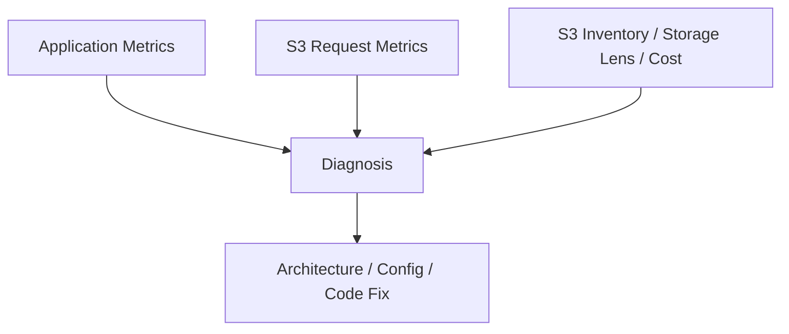

# Part 051 — S3 Performance, Cost, and Operational Debugging

S3 problems rarely announce themselves as "S3 is down."

They show up as:

- API latency rising
- Lambda concurrency spike
- request cost explosion
- queue backlog
- 403/404 ambiguity
- 503 Slow Down
- lifecycle deleted something important
- LIST calls dominating cost
- millions of tiny objects
- archive retrieval surprise
- incomplete multipart uploads
- versioned bucket cost growth
- KMS AccessDenied
- replication lag
- application retry storm

The root cause is often not S3 itself. It is the application’s request shape.

S3 automatically scales to high request rates. AWS documents that applications can achieve at least 3,500 PUT/COPY/POST/DELETE or 5,500 GET/HEAD requests per second per partitioned S3 prefix, and there is no limit to the number of prefixes in a bucket. That is extremely powerful, but it does not make request design irrelevant.

This part closes the S3 section with production debugging: how to find the bottleneck, how to reason about cost, how to debug errors, and how to build dashboards/runbooks that catch design mistakes early.

---

## 1. Problem yang Diselesaikan

Part ini membahas:

- S3 performance model
- prefix request rate and parallelization
- latency and retry behavior
- 503 Slow Down and hot prefix diagnosis
- 403 vs 404 ambiguity
- HEAD/LIST request amplification
- small object cost
- lifecycle cost and noncurrent version cost
- incomplete multipart upload leakage
- Storage Lens and S3 Inventory
- request metrics and CloudTrail
- runbook for S3 latency, access denied, missing object, cost spike, lifecycle accident, and request storm
- production checklist for S3 observability

---

## 2. Mental Model

### 2.1 S3 performance is request-shape driven

S3 performance is not only about object size.

It is shaped by:

```text
operation type
prefix distribution
object size distribution
client parallelism
connection reuse
retry behavior
KMS usage
network path
Region distance
storage class
listing pattern
event fanout
lifecycle state
versioning state
```

Bad request shape can make a strong service look weak.

### 2.2 Object store bottlenecks are often self-inflicted

Typical anti-patterns:

```text
LIST prefix in every user request
HEAD every object before GET
write millions of tiny files
overwrite large state object frequently
trigger Lambda per tiny object
read archived object in hot path
retry aggressively without jitter
write all events into one hot prefix
ignore KMS throttling/errors
```

### 2.3 Cost is a behavioral signal

S3 cost increases can reveal architecture bugs:

| Cost spike | Possible design issue |
|---|---|
| GET/HEAD request spike | hot client loop, cache miss storm, retry storm |
| LIST request spike | S3 used as database/index |
| PUT request spike | tiny object writes, duplicate uploads |
| storage growth | noncurrent versions, failed attempts, orphan data |
| retrieval cost | IA/archive data read unexpectedly |
| lifecycle transition cost | too many tiny objects transitioned |
| MPU storage | incomplete multipart uploads not aborted |
| replication cost | unexpected replication scope |
| KMS cost/errors | per-object KMS operations at high request rate |

### 2.4 S3 debugging needs object, request, and application views

You need three layers:



Application logs alone are not enough. S3 metrics alone are not enough.

---

## 3. Performance Model

### 3.1 Operation type

Different operations behave differently:

| Operation | Common use | Risk |
|---|---|---|
| PUT | create object | request spike, overwrite race |
| GET | read object | hot object/prefix, retrieval cost |
| HEAD | metadata check | amplification if before every GET |
| LIST | prefix discovery | expensive/slow as query pattern |
| COPY | rename-like workflow | hidden data movement cost |
| DELETE | cleanup | version/delete marker confusion |
| CompleteMultipartUpload | large object commit | idempotency/timeout ambiguity |
| RestoreObject | archive restore | async workflow required |

### 3.2 Prefix request rate

AWS documents high request-rate behavior per partitioned prefix. You can scale by using multiple prefixes and parallelization.

Implication:

```text
single hot prefix + sudden massive traffic = possible throttling/latency
```

Better:

```text
prefixes aligned with workload distribution and access pattern
```

Example:

```text
events/dt=2026-07-06/hour=03/shard=00/
events/dt=2026-07-06/hour=03/shard=01/
...
events/dt=2026-07-06/hour=03/shard=63/
```

But do not shard blindly. Sharding makes listing and operations harder. Shard when the request rate requires it.

### 3.3 Parallelism

For high throughput:

- parallelize GET/PUT
- use multipart upload/download
- reuse SDK client
- tune connection pools
- use byte-range GET for large object reads
- use exponential backoff with jitter
- measure p95/p99 latency and retry rate
- avoid synchronized client waves

### 3.4 KMS as part of performance path

If objects use SSE-KMS, KMS authorization and key usage become part of the request path.

Watch for:

- KMS AccessDenied
- KMS throttling
- disabled key
- wrong key policy
- cross-account decrypt failure
- replication KMS failure
- restore KMS failure

For high-throughput workloads, include KMS metrics and quotas in performance planning.

### 3.5 Storage class affects access behavior

Reading from Standard is not the same as reading from archive classes.

Before moving objects to IA/archive:

- understand retrieval cost
- understand retrieval latency
- build restore flow
- protect interactive paths from async archive
- tag/catalog objects by access class

---

## 4. Common Performance Anti-Patterns

### 4.1 LIST as database query

Bad:

```text
GET /cases/9231/evidence
  -> ListObjectsV2 prefix=cases/9231/
  -> HeadObject each object
```

This couples user latency to S3 listing and object count.

Fix:

```text
GET /cases/9231/evidence
  -> Query catalog DB
  -> Return object references
```

Use S3 Inventory for offline object audit, not hot-path user query.

### 4.2 HEAD before every GET

Sometimes HEAD is useful.

But this is often waste:

```text
HEAD object
GET object
```

If GET failure can handle missing/access denied correctly, HEAD may be unnecessary.

Fix:

- remove unnecessary HEAD
- cache metadata in catalog
- use conditional GET where appropriate
- use object version/checksum from catalog
- use HEAD only for validation/control-plane paths

### 4.3 Tiny object storm

Symptoms:

- millions of 1 KB objects
- high PUT cost
- event storm
- slow analytics
- lifecycle transition cost

Fix:

- batch records
- write segment files
- compact
- use Kinesis/SQS/DynamoDB for tiny hot events
- avoid Lambda one-object-per-record output

### 4.4 Copy/delete as rename

S3 has no cheap directory rename.

Bad:

```text
copy processing/job/* to processed/job/*
delete processing/job/*
```

Fix:

- attempt path + manifest
- table commit protocol
- immutable keys + pointer
- write directly to final committed file only when single-object atomicity is enough

### 4.5 Synchronized retry

Many clients fail, then retry at the same time.

Fix:

- exponential backoff
- jitter
- bounded retries
- circuit breaker
- queue buffer
- per-prefix concurrency control

### 4.6 Event loop

S3 event triggers Lambda, Lambda writes back to triggering prefix, Lambda triggers again.

Fix:

- separate input/output prefixes
- suffix/prefix filters
- event loop alarm
- idempotency guard
- disable event source during incident

---

## 5. Error Semantics

### 5.1 403 vs 404 ambiguity

S3 may return different errors depending on permission. A caller without permission to list a bucket may receive AccessDenied rather than a clean NotFound-style answer. This is intentional security behavior.

Operational question:

```text
Is the object missing, or is the caller not allowed to know?
```

Triage:

- check exact bucket/key
- check caller identity
- check `s3:GetObject`
- check `s3:ListBucket` if caller expects missing detection
- check bucket policy explicit deny
- check VPC endpoint policy
- check SCP/permission boundary
- check KMS decrypt
- check object ownership
- check version/delete marker

### 5.2 503 Slow Down

Potential causes:

- hot prefix
- sudden request-rate ramp
- synchronized clients
- retry storm
- too little prefix distribution
- too much LIST/HEAD amplification

Response:

- reduce client concurrency temporarily
- add backoff/jitter
- spread requests across prefixes
- remove unnecessary HEAD/LIST
- batch/compact tiny objects
- monitor per-prefix behavior

### 5.3 AccessDenied due to KMS

Object exists. S3 permission appears correct. Read still fails.

Check:

- object uses SSE-KMS
- caller has `kms:Decrypt`
- KMS key policy allows caller
- grant still valid
- key not disabled/scheduled deletion
- cross-account key policy
- encryption context where relevant

### 5.4 NoSuchKey with versioning

Possibilities:

- key typo
- latest version is delete marker
- specific version ID wrong
- lifecycle expired current/noncurrent version
- object in different Region/account
- object uploaded to staging prefix
- catalog points to old key

Use:

```bash
aws s3api list-object-versions --bucket "$BUCKET" --prefix "$KEY"
```

### 5.5 PermanentRedirect / wrong Region

S3 bucket Region matters. Using wrong Region endpoint/client config can create redirects, latency, or failures depending on client behavior.

Fix:

- discover bucket region
- configure client region
- avoid cross-region hot path unless intentional
- use regional clients in multi-region apps

---

## 6. Cost Model

### 6.1 Cost dimensions

S3 cost includes:

```text
storage GB-month
request cost
data retrieval cost
data transfer
lifecycle transition cost
replication cost
inventory/analytics
Storage Lens advanced metrics
KMS request cost
multipart orphan storage
noncurrent versions
archive restore cost
```

### 6.2 Request cost amplification

Request amplification example:

```text
1 user page
-> list 1000 objects
-> head 1000 objects
-> get 10 objects
```

That is not 1 request. That is 1011 S3 requests.

Fix with catalog.

### 6.3 Version cost

A versioned bucket can store:

```text
current versions
noncurrent versions
delete markers
```

If a large object is overwritten daily and old versions kept indefinitely, cost grows linearly with time.

Mitigation:

- immutable key + small pointer
- noncurrent lifecycle after retention review
- monitor top keys by version count
- restrict overwrite paths

### 6.4 Lifecycle transition cost

Transitioning many tiny objects may cost more than expected.

Model:

```text
transition_requests = number_of_objects_transitioned
```

If you transition 500 million tiny objects, transition request cost and lifecycle overhead matter.

### 6.5 Archive retrieval surprise

IA/archive storage reduces storage cost but can increase retrieval cost and latency.

Bad:

```text
move active user documents to archive after 30 days
```

Then support tickets arrive when users click old documents.

Fix:

- align with product retrieval SLA
- expose restore state
- use Intelligent-Tiering without archive tiers for unpredictable interactive data
- keep recent/active data in immediate class

### 6.6 Incomplete multipart uploads

Incomplete MPU parts can consume storage.

Mitigation:

- lifecycle abort incomplete MPUs
- upload session expiration
- app-level abort on cancel
- Storage Lens/inventory/cost monitoring
- client abandonment metrics

---

## 7. Observability Toolkit

### 7.1 CloudWatch request metrics

Enable request metrics when you need detailed per-bucket/prefix insight.

Track:

- AllRequests
- GetRequests
- PutRequests
- HeadRequests
- ListRequests
- DeleteRequests
- 4xxErrors
- 5xxErrors
- FirstByteLatency
- TotalRequestLatency
- BytesDownloaded
- BytesUploaded

Use filters/prefixes for important workloads.

### 7.2 S3 Storage Lens

S3 Storage Lens provides organization-wide visibility into object storage usage and activity. It can surface trends and recommendations for cost optimization and data protection.

Use it for:

- storage growth
- object count
- versioning growth
- incomplete multipart uploads
- encryption/replication visibility
- lifecycle adoption
- prefix-level analysis with advanced metrics
- organization/account/bucket-level dashboarding

### 7.3 S3 Inventory

S3 Inventory provides scheduled object metadata reports and can be used as an alternative to synchronous LIST operations for business/compliance/audit workflows.

Use it for:

- object audit
- encryption status
- replication status
- storage class distribution
- lifecycle verification
- catalog reconciliation
- large-scale object reports
- compliance evidence

Do not use LIST across huge buckets when Inventory can answer offline.

### 7.4 CloudTrail data events

Use for high-value buckets to audit:

- PutObject
- DeleteObject
- DeleteObjectVersion
- GetObject
- PutObjectRetention
- PutObjectLegalHold
- RestoreObject
- lifecycle/config changes through management events

Caution:

- CloudTrail data events can be high volume and cost-sensitive.
- Scope to critical buckets/prefixes.

### 7.5 Server access logs / access logs

Useful for request-level debugging, though operational setup and analysis pipeline must be designed.

### 7.6 Application catalog metrics

Track:

- catalog object count
- missing object refs
- orphan S3 objects
- checksum mismatch
- accepted vs uploaded count
- unprocessed object age
- object version ID coverage
- retention class coverage
- archive restore state

---

## 8. Debugging Runbooks

### 8.1 S3 latency spike

1. Identify operation type: GET, PUT, LIST, HEAD, COMPLETE MPU.
2. Check latency: first-byte vs total request.
3. Check error rate: 4xx/5xx/503.
4. Check prefix distribution.
5. Check request volume ramp.
6. Check client retries and connection pooling.
7. Check KMS latency/errors.
8. Check object size and storage class.
9. Check network path/Region.
10. Add backoff/concurrency control.
11. Remove request amplification.

### 8.2 503 Slow Down

1. Confirm 503 rate and affected prefixes.
2. Reduce concurrency temporarily.
3. Enable/verify exponential backoff with jitter.
4. Spread load across prefixes if needed.
5. Stop retry storm.
6. Remove unnecessary HEAD/LIST calls.
7. Pre-warm/ramp future traffic gradually.
8. Review key design.

### 8.3 AccessDenied

1. Capture request ID, caller ARN, bucket, key, version.
2. Check identity policy.
3. Check bucket policy.
4. Check explicit deny.
5. Check VPC endpoint policy.
6. Check SCP/permission boundary.
7. Check object ownership.
8. Check KMS key policy.
9. Check Object Lock if delete/modify.
10. Test with minimal read role.

### 8.4 Object missing

1. Check exact key encoding.
2. Check bucket Region.
3. HEAD object.
4. List versions.
5. Look for delete marker.
6. Check catalog reference.
7. Check lifecycle expiration.
8. Check replication destination.
9. Check upload/session state.
10. Restore previous version or repair catalog.

### 8.5 Cost spike

1. Break down cost by bucket/prefix/operation/storage class.
2. Check request counts.
3. Check object count growth.
4. Check average object size.
5. Check noncurrent version bytes.
6. Check delete markers.
7. Check incomplete MPUs.
8. Check lifecycle transition count.
9. Check retrieval from IA/archive.
10. Check replication scope.
11. Patch writer/request pattern.

### 8.6 Lifecycle accident

1. Disable suspect lifecycle rule.
2. Determine prefix/tag match.
3. Identify affected keys/versions using Inventory/logs.
4. Restore from version/replica/backup if possible.
5. Repair catalog/table metadata.
6. Add lifecycle simulation/test.
7. Re-enable only after data-owner approval.

### 8.7 Event-driven storm

1. Check S3 event count by prefix.
2. Check Lambda concurrency/queue depth.
3. Check output prefix for event loop.
4. Disable event source if needed.
5. Add filter/separate output prefix.
6. Add queue buffer/backpressure.
7. Patch idempotency.
8. Redrive DLQ carefully.

---

## 9. Diagnostic Commands

### 9.1 Head object

```bash
aws s3api head-object \
  --bucket "$BUCKET" \
  --key "$KEY"
```

### 9.2 List versions

```bash
aws s3api list-object-versions \
  --bucket "$BUCKET" \
  --prefix "$KEY"
```

### 9.3 Lifecycle configuration

```bash
aws s3api get-bucket-lifecycle-configuration \
  --bucket "$BUCKET"
```

### 9.4 Bucket versioning

```bash
aws s3api get-bucket-versioning \
  --bucket "$BUCKET"
```

### 9.5 Object tagging

```bash
aws s3api get-object-tagging \
  --bucket "$BUCKET" \
  --key "$KEY"
```

### 9.6 Object retention and legal hold

```bash
aws s3api get-object-retention \
  --bucket "$BUCKET" \
  --key "$KEY" \
  --version-id "$VERSION_ID"

aws s3api get-object-legal-hold \
  --bucket "$BUCKET" \
  --key "$KEY" \
  --version-id "$VERSION_ID"
```

### 9.7 Restore archived object

```bash
aws s3api restore-object \
  --bucket "$BUCKET" \
  --key "$KEY" \
  --restore-request '{"Days":7,"GlacierJobParameters":{"Tier":"Standard"}}'
```

### 9.8 List multipart uploads

```bash
aws s3api list-multipart-uploads \
  --bucket "$BUCKET"
```

---

## 10. Production Dashboards

### 10.1 Bucket health dashboard

Show:

- total bytes
- object count
- average object size
- current vs noncurrent bytes
- delete marker count
- storage class distribution
- incomplete MPU bytes
- encryption coverage
- replication status
- Object Lock coverage
- lifecycle transition/expiration
- request count by operation
- 4xx/5xx
- first-byte latency
- total latency

### 10.2 Prefix workload dashboard

Per workload prefix:

- GET/PUT/HEAD/LIST rates
- error rates
- latency
- object count
- average object size
- cost estimate
- lifecycle actions
- event notification volume
- queue age if event-driven
- KMS errors
- top callers if available

### 10.3 Data governance dashboard

Show:

- objects missing required tags
- objects without catalog reference
- catalog refs missing S3 object
- objects without version ID in catalog
- locked objects by retention class
- legal hold count
- expired-but-not-deleted objects
- archived objects with recent access

### 10.4 Cost dashboard

Show:

- storage by class
- request cost by operation
- top buckets/prefixes
- lifecycle transition cost
- retrieval cost
- replication cost
- noncurrent version cost
- incomplete MPU cost
- small object count
- object count growth rate

---

## 11. Guardrails

### 11.1 Prefix design review

Require review when:

- new high-volume prefix
- new event notification prefix
- new lifecycle rule
- new archive transition
- new replication rule
- new Object Lock retention
- new large upload path
- new data lake table layout

### 11.2 Bucket policy guardrails

Examples:

- require encryption
- block public access
- deny unapproved prefixes
- deny deletes under source-of-truth prefix for app roles
- deny `DeleteObjectVersion`
- require object tags for protected prefixes
- restrict lifecycle config changes

### 11.3 Cost guardrails

- budget alarms
- Storage Lens reports
- object count alarms
- small object alarms
- incomplete MPU alarms
- noncurrent version alarms
- retrieval cost alarms
- lifecycle transition alarms

### 11.4 Application guardrails

- idempotent writes
- deterministic keys
- checksum validation
- catalog commit
- manifest commit
- retry with jitter
- bounded parallelism
- staging/accepted separation
- archive-aware reads

---

## 12. Failure Mode Patterns

### 12.1 "S3 is slow"

Usually means one of:

- application is listing too much
- client connection pool too small
- client creates new SDK client per call
- KMS bottleneck
- hot prefix
- large object without range/multipart strategy
- retry storm
- network path issue
- downstream processor bottleneck misattributed to S3

### 12.2 "S3 object disappeared"

Usually means one of:

- delete marker
- lifecycle expiration
- wrong key encoding
- wrong bucket/Region/account
- KMS/access issue appears as missing to app
- catalog stale
- object never completed
- staging object cleaned up
- replication destination not caught up

### 12.3 "S3 cost exploded"

Usually means one of:

- request amplification
- small-file explosion
- noncurrent versions
- incomplete MPUs
- lifecycle transition storm
- IA/archive retrieval
- replication scope too broad
- event loop

### 12.4 "S3 events duplicated"

Expected. Fix idempotency, not S3.

### 12.5 "Lifecycle did not delete"

Usually:

- Object Lock/legal hold
- versioning left noncurrent versions
- delete marker semantics
- rule filter mismatch
- object too new
- minimum storage duration/cost misunderstanding
- lifecycle action pending

---

## 13. Incident Review Template

For S3 incidents, capture:

```yaml
incident:
  bucket:
  prefix:
  keySamples:
  operationType:
  errorCodes:
  requestIds:
  affectedCallers:
  firstSeen:
  lastSeen:
  objectCountAffected:
  bytesAffected:
  storageClass:
  versioningState:
  lifecycleRules:
  replicationRules:
  objectLock:
  kmsKey:
  requestRate:
  retryRate:
  costImpact:
  dataImpact:
  recoveryAction:
  permanentFix:
```

Questions:

- Was this a storage service issue or application request-shape issue?
- Was data lost, hidden, archived, or merely inaccessible?
- Did versioning/replication/Object Lock help or hurt?
- Did lifecycle behave as configured?
- Was catalog consistent with S3?
- Could this have been caught by Storage Lens/Inventory/request metrics?
- Which invariant failed?

---

## 14. Mini Case Study — Request Amplification Outage

### 14.1 Incident

A case UI endpoint becomes slow.

Endpoint:

```text
GET /cases/{caseId}/evidence
```

Implementation:

1. LIST `cases/<caseId>/evidence/`
2. HEAD every object
3. GET metadata JSON for each object
4. render response

A large case has 80,000 evidence artifacts.

### 14.2 Symptoms

- API p99 latency > 30 seconds
- S3 LIST and HEAD request cost spikes
- Lambda/API workers saturate
- retries amplify load
- S3 appears "slow"

### 14.3 Root cause

S3 was used as hot-path database/index.

### 14.4 Fix

- create evidence catalog table
- store object references and metadata at write time
- endpoint queries catalog by caseId
- S3 GET only for actual document download
- S3 Inventory used for offline reconciliation
- alarm added for LIST/HEAD request spike

### 14.5 Invariant

```text
S3 stores object bytes.
Catalog answers business queries.
```

---

## 15. Mini Case Study — Lifecycle Cost Optimization Accident

### 15.1 Incident

Team adds lifecycle rule:

```text
transition all objects under documents/ to Deep Archive after 30 days
```

### 15.2 Impact

- users cannot instantly download older documents
- restore workflow missing
- support tickets spike
- retrieval requests become manual
- product SLA violated

### 15.3 Root cause

Lifecycle was based on object age, not business access contract.

### 15.4 Fix

- disable rule
- restore affected objects to immediate class where needed
- classify documents by access profile
- archive only closed/inactive objects after policy window
- add catalog field `archiveState`
- UI exposes restore request for truly archived records
- lifecycle change requires data-owner review

### 15.5 Invariant

```text
Lifecycle may optimize only objects with the same retention and retrieval contract.
```

---

## 16. S3 Section Summary

This closes the S3 section.

Across Parts 041–051, the main lesson is:

> S3 is a durable, scalable object store. It becomes production-grade only when key design, consistency semantics, lifecycle, versioning, event processing, upload protocol, data layout, and observability are explicit.

The essential S3 invariants:

1. Object keys are API contracts.
2. Business state belongs in catalog/manifest, not bucket listing.
3. Multi-object completeness requires manifest/table metadata.
4. Events are triggers, not workflow truth.
5. Versioning creates recovery history; lifecycle can destroy it.
6. Object Lock protects versions; it must be legally and operationally designed.
7. Multipart upload needs application session management.
8. Cost is a signal of request/data-layout behavior.
9. Recovery must be tested with real keys, versions, KMS, and catalog state.

Next section: **File Storage — EFS, FSx, and File Cache**.

We move from object semantics to file semantics: shared mounts, NFS/SMB, metadata, locking, throughput modes, access points, POSIX-ish expectations, and why shared file storage can be both convenient and dangerous.

---

## References

- AWS S3 User Guide — Best practices design patterns: optimizing Amazon S3 performance: https://docs.aws.amazon.com/AmazonS3/latest/userguide/optimizing-performance.html
- AWS S3 User Guide — Performance guidelines for Amazon S3: https://docs.aws.amazon.com/AmazonS3/latest/userguide/optimizing-performance-guidelines.html
- AWS S3 User Guide — Amazon S3 data consistency model: https://docs.aws.amazon.com/AmazonS3/latest/userguide/Welcome.html#ConsistencyModel
- AWS S3 User Guide — Monitoring storage with S3 Storage Lens: https://docs.aws.amazon.com/AmazonS3/latest/userguide/storage_lens.html
- AWS S3 User Guide — S3 Inventory: https://docs.aws.amazon.com/AmazonS3/latest/userguide/storage-inventory.html
- AWS S3 User Guide — Lifecycle management: https://docs.aws.amazon.com/AmazonS3/latest/userguide/object-lifecycle-mgmt.html
- AWS S3 User Guide — S3 Event Notifications: https://docs.aws.amazon.com/AmazonS3/latest/userguide/EventNotifications.html
- AWS S3 User Guide — Multipart upload overview: https://docs.aws.amazon.com/AmazonS3/latest/userguide/mpuoverview.html
