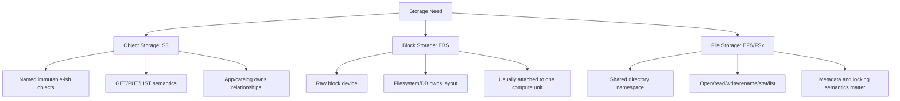
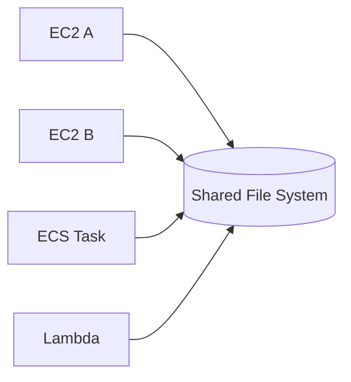

# Part 052 — File Storage Mental Model

File storage is seductive because it feels familiar.

You mount a path. Applications read and write files. Multiple machines can share the same namespace. Legacy software works. Users and processes understand directories.

That convenience is real.

So are the traps.

Shared file storage turns storage into a distributed coordination surface. File metadata, directory listings, locks, permissions, cache behavior, network latency, mount failure, and concurrent writers become part of your application architecture.

If S3 is object storage and EBS is block storage, file storage sits between application expectations and distributed systems reality.

On AWS, the main managed file storage families include:

- Amazon EFS: elastic NFS file system for Linux-style shared access.
- Amazon FSx for Windows File Server: managed SMB/Windows file storage.
- Amazon FSx for Lustre: high-performance file system for HPC/ML/data processing.
- Amazon FSx for NetApp ONTAP: managed ONTAP features and multiprotocol enterprise file workloads.
- Amazon FSx for OpenZFS: managed OpenZFS file storage.
- Amazon File Cache: high-speed cache for file data stored elsewhere.

This part builds the file storage mental model before going deep into EFS and FSx.

---

## 1. Problem yang Diselesaikan

Part ini menjawab:

- kapan file storage cocok dibanding S3/EBS
- apa arti shared file semantics
- mengapa file storage bukan hanya "folder bersama"
- bagaimana NFS/SMB berbeda dari object/block
- apa risiko metadata-heavy workload
- bagaimana file locking, permissions, and caching memengaruhi correctness
- bagaimana multi-client access dapat membuat hidden coupling
- bagaimana memilih EFS vs FSx family
- bagaimana file storage gagal di production
- bagaimana mendesain runbook dan checklist

---

## 2. Mental Model

### 2.1 Three storage abstractions



File storage gives applications a filesystem interface.

That means the app can use:

- paths
- directories
- file names
- open/read/write
- rename
- delete
- permissions
- file locks
- directory listing
- metadata operations
- shared mounts

But because the filesystem is remote/shared, every file operation can carry distributed-system cost.

### 2.2 Shared namespace is shared coupling

A shared filesystem means multiple clients can observe and mutate the same namespace.



This is useful when:

- legacy app expects shared files
- multiple workers need common files
- user home directories
- content management
- shared ML/data assets
- build artifacts
- application plugins
- file-based workflow handoff
- enterprise Windows workloads
- HPC scratch/shared input

It is dangerous when:

- app uses files as implicit database
- multiple writers update same files without locking
- directory scans become hot path
- metadata operations explode
- mount failure blocks request path
- permissions drift
- cleanup deletes active files
- shared path becomes hidden integration bus

### 2.3 File storage is stateful infrastructure

A file system has more operational state than a bucket/prefix:

- mount targets/endpoints
- client mount options
- file permissions
- UID/GID mapping
- locking behavior
- throughput mode
- performance mode
- directory layout
- metadata workload
- snapshots/backups
- access points/shares/exports
- protocol version
- network path
- DNS resolution
- OS client behavior

Treat file storage as a platform component, not a mount command.

### 2.4 Metadata is workload

A file workload is not just bytes/sec.

It includes metadata operations:

- `stat`
- `open`
- `close`
- `rename`
- `unlink`
- `mkdir`
- `readdir`
- permission checks
- lock operations
- attribute updates

A workload with many tiny files can be metadata-bound even when throughput is low.

### 2.5 File systems encode time and concurrency assumptions

Many legacy apps assume local filesystem semantics:

- rename is atomic
- lock works across processes
- directory listing is fast
- metadata is cheap
- file modification time is meaningful
- all clients see updates quickly
- permissions behave consistently
- file handles remain valid
- path length/case sensitivity rules are known

When moved to remote file storage, these assumptions need validation.

---

## 3. File vs Object vs Block

### 3.1 File storage

Use when application needs:

- shared mounted namespace
- POSIX-like file API
- hierarchical directories
- file permissions
- file locking
- multiple clients reading same files
- legacy app compatibility
- NFS or SMB protocol
- file-level operations

Examples:

- shared WordPress/media directory
- enterprise Windows file share
- home directories
- shared ML training dataset
- genomics/HPC input/output
- content management system
- lift-and-shift app expecting NAS
- build farm shared cache

### 3.2 Object storage

Use when application can use:

- object API
- immutable blobs
- explicit catalog/metadata
- event-driven processing
- large durable objects
- lifecycle/retention
- high-scale object namespace

Examples:

- user uploads
- evidence blobs
- data lake files
- backups
- logs
- artifacts
- media originals
- archive

### 3.3 Block storage

Use when application needs:

- low-latency block device
- database files
- OS volume
- filesystem controlled by one host
- application manages data layout
- high IOPS/throughput volume

Examples:

- PostgreSQL data volume
- Kafka broker disk
- search index disk
- boot/root volume
- single-node stateful service

### 3.4 Decision table

| Requirement | S3 | EBS | EFS | FSx |
|---|---:|---:|---:|---:|
| shared filesystem mount | no | no | yes | yes |
| object API | yes | no | no | no |
| block device | no | yes | no | no |
| multiple concurrent clients | yes via API | not typical | yes | yes |
| POSIX-like Linux access | no | local FS only | yes-ish NFS | OpenZFS/Lustre/ONTAP depending |
| Windows SMB | no | local only | no | FSx Windows/ONTAP |
| HPC high-throughput file | limited/object | local/block | sometimes | FSx Lustre |
| enterprise NAS features | no | no | limited | FSx ONTAP/OpenZFS/Windows |
| lifecycle/object lock/archive | rich | snapshot-based | lifecycle limited | service-specific |
| database primary storage | usually no | common | usually no for latency-critical DB | workload-specific |

---

## 4. File Protocols and Semantics

### 4.1 NFS

NFS is common for Linux/Unix shared file access.

Amazon EFS supports NFSv4.0 and NFSv4.1 when mounting from EC2 and other clients. EFS can be used with EC2, Lambda, ECS, EKS, and on-premises servers.

NFS considerations:

- mount options matter
- UID/GID permissions matter
- network path matters
- locking semantics matter
- stale file handles can happen
- client caching behavior matters
- noresvport and mount helper recommendations matter for EFS

### 4.2 SMB

SMB is common for Windows file sharing.

FSx for Windows File Server provides managed Windows file servers with native Windows filesystem compatibility and SMB access.

SMB considerations:

- Active Directory integration
- Windows ACLs
- file locking
- share permissions
- user identity
- application compatibility
- DFS/namespace design
- backup/shadow copy expectations

### 4.3 POSIX-ish does not mean local disk

Remote file storage may support POSIX-style operations, but latency and failure behavior differ from local disk.

Local disk assumption:

```text
stat/open/rename is cheap
```

Remote shared filesystem reality:

```text
metadata operation crosses client/kernel/network/filesystem boundary
```

A loop that stats 1 million files can be a distributed metadata load test.

### 4.4 Rename semantics

Many file workflows use atomic rename:

```text
write file.tmp
fsync
rename file.tmp -> file.done
```

This can be a good commit pattern if filesystem semantics support it and clients agree.

But for distributed readers:

- ensure readers only read final names
- ensure writer uses same filesystem
- ensure metadata visibility behavior is acceptable
- avoid cross-directory rename assumptions without testing
- avoid rename-heavy huge directory workflows

### 4.5 File locking

Locks can coordinate multi-client access, but only if:

- all clients use the same locking protocol
- application honors locks
- lock recovery after client crash is understood
- stale locks are handled
- timeout behavior is acceptable
- OS/runtime library uses network lock correctly

Do not assume "we use files, so locking is solved."

### 4.6 Permissions

Permissions can fail due to:

- UID/GID mismatch
- root squash/export policy
- access point identity enforcement
- Windows ACL mismatch
- AD trust issue
- container user mismatch
- Lambda runtime user mismatch
- mount path ownership drift

Permission design is part of storage design.

---

## 5. AWS File Storage Families

### 5.1 Amazon EFS

EFS is a serverless, elastic file system that grows and shrinks automatically as files are added and removed. It is accessible using NFS and integrates with compute services such as EC2, Lambda, ECS, and EKS.

Use when:

- Linux-style shared filesystem
- elastic capacity
- multiple clients
- simple managed NFS
- serverless/container shared mount
- home directories
- shared app assets
- moderate to high scale shared file workload

Be careful with:

- metadata-heavy workloads
- latency-sensitive database workloads
- many small files
- permission/UID design
- mount target network placement
- throughput mode
- lifecycle/storage class behavior

### 5.2 FSx for Windows File Server

Use when:

- Windows-native SMB
- Active Directory integration
- Windows ACLs
- lift-and-shift Windows apps
- user shares
- Microsoft workloads
- Windows file server compatibility

Be careful with:

- AD dependency
- SMB permissions
- throughput capacity
- backup/restore
- multi-AZ vs single-AZ choice
- Windows path/case semantics

### 5.3 FSx for Lustre

Use when:

- high-performance parallel file system
- HPC
- ML training/preprocessing
- genomics
- media processing
- S3-linked datasets
- high-throughput scratch or persistent file workloads

Be careful with:

- metadata and small file behavior
- S3 import/export semantics
- scratch vs persistent deployment
- client mount and tuning
- job scheduler integration

### 5.4 FSx for NetApp ONTAP

Use when:

- enterprise NAS features
- NFS/SMB/iSCSI multiprotocol
- snapshots/clones
- compression/dedup
- data management features
- migration from NetApp environments
- hybrid enterprise storage

Be careful with:

- ONTAP operational model
- capacity pools/volumes
- protocol/identity design
- licensing/cost/performance model
- enterprise admin boundaries

### 5.5 FSx for OpenZFS

Use when:

- ZFS semantics/features
- NFS file workloads
- snapshots/clones
- high-performance file access
- workloads needing ZFS-style data management

Be careful with:

- capacity/performance provisioning
- snapshot management
- client semantics
- operational complexity vs EFS

### 5.6 Amazon File Cache

Use when:

- need high-speed cache for file data stored elsewhere
- accelerate access to on-premises or cloud datasets
- HPC/ML/data processing needs local-like file access to remote data

Be careful with:

- cache consistency expectations
- source-of-truth boundary
- warmup
- eviction
- data synchronization
- job scheduling locality

---

## 6. Workload Taxonomy

### 6.1 Shared application assets

Example:

```text
web servers share uploaded media directory
```

Potential fit:

- EFS
- FSx depending OS/protocol

Risks:

- app writes user uploads directly to shared path
- no content validation
- directory grows huge
- backup/retention unclear
- many small files

Better:

- use S3 for durable originals
- use file storage only if application requires mount
- catalog metadata
- cache/thumbnail derivatives with lifecycle

### 6.2 Lift-and-shift enterprise app

Example:

```text
legacy app expects \\fileserver\share or /mnt/shared
```

Potential fit:

- FSx for Windows
- FSx ONTAP
- EFS for Linux apps

Risks:

- hidden file locks
- AD/identity dependency
- throughput underprovisioning
- path semantics
- backup assumptions

### 6.3 HPC/ML dataset

Example:

```text
thousands of workers read training data/checkpoints
```

Potential fit:

- FSx for Lustre
- EFS for some shared access
- S3 + local cache
- File Cache

Risks:

- small file metadata bottleneck
- checkpoint storm
- S3 staging cost
- cache warmup
- job failure cleanup

### 6.4 Shared build cache

Potential fit:

- EFS
- FSx OpenZFS/ONTAP
- local cache + S3
- dedicated cache service

Risks:

- cache poisoning
- metadata-heavy access
- high churn
- lock contention
- permission drift

### 6.5 User home directories

Potential fit:

- EFS
- FSx Windows/ONTAP

Risks:

- quota expectations
- backup/restore per user
- permissions
- many small files
- interactive latency

### 6.6 Database on shared file system

Usually dangerous unless database/vendor explicitly supports and workload is validated.

Many databases assume low-latency block storage and carefully controlled filesystem semantics.

Prefer:

- EBS for single-node DB
- managed database service
- database-native replication
- FSx only for workloads explicitly designed/certified

---

## 7. Production Design Principles

### 7.1 Choose file storage because semantics require it

Do not choose file storage because it feels easier than designing object storage.

Use file storage when the application truly needs:

- file API
- shared mount
- file locking
- directory semantics
- legacy compatibility
- POSIX/SMB protocol

If the application can use object API and catalog, S3 is often simpler and more scalable.

### 7.2 Keep source of truth explicit

If file storage is source of truth:

- define backup
- define restore
- define replication/DR
- define permissions
- define owner
- define lifecycle
- define recovery point
- define deletion policy

If file storage is cache/derived:

- define durable source
- define rebuild path
- define eviction
- define warmup
- define stale data handling

### 7.3 Avoid shared filesystem as integration bus

Bad:

```text
Service A writes file.
Service B polls directory.
Service C deletes file.
Service D updates status file.
```

This becomes a hidden distributed workflow.

Better:

- use queue/event system for workflow
- use catalog for state
- use file storage for payload only if needed
- use manifest/commit marker if file handoff is required

### 7.4 Separate hot metadata from large data

If application frequently queries file metadata, use a database/catalog.

Do not repeatedly scan huge directories to answer business questions.

### 7.5 Design directory fanout

Avoid millions of files in one directory.

Use fanout:

```text
files/ab/cd/<id>
```

or domain partitions:

```text
tenants/<tenant-id>/cases/<case-id>/...
```

But avoid sensitive names and high-cardinality traps without need.

### 7.6 Use atomic commit pattern

For file workflows:

```text
write temp file
fsync if required
rename to final path
write manifest/done marker
```

Readers read only final/manifested files.

### 7.7 Mount is dependency

If application cannot start without mount, mount failure is application failure.

Decide:

- fail closed or degrade?
- mount at boot or app start?
- retry behavior?
- health check includes file system?
- read-only fallback?
- local cache fallback?
- node drain if mount stale?

---

## 8. Failure Modes

### 8.1 Metadata bottleneck

Symptoms:

- low throughput but high latency
- many stat/open/list operations
- directory listing slow
- CPU idle
- app appears hung

Fix:

- reduce small files
- fan out directories
- cache metadata in DB
- batch operations
- use table/object layout where better
- choose FSx/Lustre/ONTAP if workload needs high metadata performance

### 8.2 Lock contention

Symptoms:

- processes blocked
- stale locks
- one writer stalls many readers
- failover leaves lock ambiguity

Fix:

- understand lock protocol
- reduce shared mutable file writes
- use database/queue for coordination
- add lock timeout/owner visibility
- test client crash recovery

### 8.3 Permission drift

Symptoms:

- works on one node, fails on another
- container user cannot write
- Lambda/ECS access denied
- files owned by unexpected UID/GID

Fix:

- standardize UID/GID
- use EFS access points where appropriate
- define mount user
- avoid manual chmod fixes
- add permission check in readiness

### 8.4 Mount failure

Symptoms:

- app startup hangs
- I/O timeout
- stale file handle
- intermittent read/write failure

Fix:

- check network/security group/DNS
- check mount target/share endpoint
- remount safely
- drain node if stale
- use recommended mount options
- avoid indefinite request blocking

### 8.5 Directory as queue

Symptoms:

- polling storm
- duplicate processing
- partial files consumed
- cleanup races

Fix:

- use SQS/EventBridge/Step Functions
- use manifest/done marker
- write temp + rename
- idempotent processing
- do not poll huge directory on hot path

### 8.6 Shared mutable config

Symptoms:

- config file updated by one node
- others see different state timing
- partial config read
- rollback unclear

Fix:

- use parameter store/config service
- version config
- atomic rename
- checksum
- app reload protocol

---

## 9. Operational Runbook

### 9.1 File operation slow

1. Identify operation: read, write, stat, list, rename, lock.
2. Check file size and count.
3. Check directory size.
4. Check client CPU/network.
5. Check mount options.
6. Check filesystem throughput/performance metrics.
7. Check number of clients.
8. Check metadata-heavy pattern.
9. Reduce concurrency or batch operations.
10. Redesign layout if needed.

### 9.2 Permission denied

1. Check path ownership and mode.
2. Check process UID/GID.
3. Check mount identity/access point/share permission.
4. Check NFS/SMB protocol identity mapping.
5. Check container runtime user.
6. Check AD/ACL for SMB.
7. Check recent deployment/chmod.
8. Fix via IaC/bootstrap, not manual drift.

### 9.3 Mount unavailable

1. Check DNS resolution.
2. Check network route/security group.
3. Check mount target/file server endpoint health.
4. Check NFS/SMB client logs.
5. Check OS dmesg/journal.
6. Remount only if safe.
7. Drain node if app state uncertain.
8. Add mount health check.

### 9.4 Disk full / file system full

Even elastic systems can hit quotas, provisioned capacity, or application-level limits.

1. Identify top directories.
2. Classify data: source, derived, temp.
3. Stop new writes if risk.
4. Delete only contractually disposable data.
5. Snapshot/backup if forensic needed.
6. Add lifecycle/cleanup/quota.
7. Redesign path ownership.

### 9.5 Stale file handle / client inconsistency

1. Identify affected clients.
2. Check server/file system events.
3. Check mount/network interruption.
4. Restart/remount client if safe.
5. Drain workload before remount if writes active.
6. Add retry/reopen logic.
7. Review client mount options.

---

## 10. Observability

Track:

- throughput read/write
- IOPS/operation rate
- metadata operation rate
- client count
- mount errors
- NFS/SMB errors
- latency
- burst credits/throughput credits where applicable
- capacity used
- file count
- directory fanout
- top directories by file count/bytes
- lock wait time
- permission errors
- stale handle errors
- backup success
- restore test success
- lifecycle transitions
- client retry count

Application metrics:

- file open latency
- directory scan duration
- queue depth if directory-based
- failed reads/writes
- partial file detection
- commit marker latency
- cleanup results

---

## 11. Design Checklist

### 11.1 Workload fit

- [ ] Application truly needs file API.
- [ ] Shared mount requirement is explicit.
- [ ] Protocol required: NFS or SMB.
- [ ] OS/client compatibility checked.
- [ ] File locking expectations tested.
- [ ] Metadata workload measured.
- [ ] Directory fanout designed.
- [ ] Small-file behavior understood.
- [ ] Latency requirement compatible.
- [ ] Source-of-truth boundary defined.

### 11.2 Operations

- [ ] Mount targets/endpoints designed per AZ/network.
- [ ] Mount options documented.
- [ ] Health checks include file system dependency.
- [ ] Backup/restore designed.
- [ ] Permission model standardized.
- [ ] Cleanup/lifecycle owner defined.
- [ ] Monitoring and alarms configured.
- [ ] Runbook for mount failure.
- [ ] Runbook for permission issue.
- [ ] Runbook for metadata bottleneck.

### 11.3 Correctness

- [ ] Multi-writer behavior tested.
- [ ] Atomic commit pattern used.
- [ ] Readers avoid partial files.
- [ ] Locks have timeout/recovery.
- [ ] File storage not used as hidden queue without safeguards.
- [ ] Catalog used for business queries.
- [ ] Restore path tested with app.
- [ ] DR/RPO/RTO defined.

---

## 12. Decision Heuristics

### 12.1 Choose EFS when

- Linux workloads need shared NFS
- capacity should grow elastically
- EC2/ECS/EKS/Lambda need shared files
- operational simplicity matters
- workload is compatible with EFS latency/performance model
- POSIX-like semantics are enough

### 12.2 Choose FSx for Windows when

- SMB/Windows-native semantics required
- Active Directory integration required
- Windows ACL compatibility matters
- lift-and-shift Windows file server workload

### 12.3 Choose FSx for Lustre when

- HPC/ML/data processing needs high-throughput parallel file system
- S3-linked dataset acceleration
- job-based scratch or persistent high-performance file workload

### 12.4 Choose FSx ONTAP/OpenZFS when

- enterprise NAS/ZFS features matter
- snapshots/clones/multiprotocol/data management required
- migration from similar enterprise storage
- workload needs more specialized file system behavior than EFS

### 12.5 Choose S3 instead when

- application can use object API
- files are immutable blobs
- access is by object ID/catalog
- lifecycle/archive/versioning/object lock needed
- shared mount is not required
- high-scale durable object storage is primary

### 12.6 Choose EBS instead when

- one compute node owns filesystem
- database/block-level workload
- low-latency random I/O
- OS/root/data volume
- shared filesystem not required

---

## 13. Mini Case Study — Legacy Case Document App

### 13.1 Initial situation

Legacy app expects:

```text
/mnt/shared/cases/<case-id>/documents/
```

Multiple app servers read/write the same directory.

### 13.2 Naive migration

Mount shared file system and copy data.

Problems:

- app lists huge directories on every page load
- two servers write same filename
- permissions differ by server UID
- cleanup script deletes active temp files
- backup restore not tested
- evidence acceptance uses file write as commit

### 13.3 Improved architecture

- EFS/FSx used for compatibility layer.
- Upload acceptance writes durable object/case catalog.
- Shared file path stores only compatibility projection or validated documents.
- Directory fanout by case ID.
- Temporary writes use `.tmp` then atomic rename.
- Catalog answers UI queries.
- File system backup/restore tested.
- Permission enforced via access point/share configuration.
- Long-term archive stored in S3.
- Migration plan gradually removes dependency on shared file scans.

### 13.4 Invariant

```text
The shared file system supports legacy file access.
The catalog remains business authority.
```

That prevents the shared mount from becoming an invisible database.

---

## 14. Mini Case Study — ML Training Dataset

### 14.1 Requirement

A training job needs to read millions of images repeatedly across many GPU nodes.

Options:

- read directly from S3
- stage to instance store
- mount EFS
- use FSx for Lustre
- use File Cache

### 14.2 Analysis

Questions:

- dataset size?
- file count?
- read pattern sequential/random?
- repeated epochs?
- metadata operations?
- number of nodes?
- required throughput?
- checkpoint pattern?
- source-of-truth location?
- cleanup after job?
- cost per training run?

### 14.3 Likely design

- S3 is durable dataset source.
- FSx for Lustre or File Cache accelerates high-throughput shared reads.
- Instance store caches local shards if job framework supports it.
- Checkpoints written to durable storage.
- Job manifest records dataset version.
- Cache can be destroyed and rebuilt.

### 14.4 Invariant

```text
High-performance file system accelerates training.
S3/catalog defines durable dataset identity.
```

---

## 15. Summary

File storage is the right abstraction when applications need shared filesystem semantics.

But file storage is not "simpler S3." It has its own distributed-systems surface:

- metadata operations
- locks
- permissions
- mount lifecycle
- directory layout
- shared mutable state
- backup/restore
- client behavior
- protocol semantics
- network failure

The core rule:

> Use file storage when file semantics are required. Do not use it to avoid designing object metadata, workflow state, or concurrency control.

Next, we go deep into Amazon EFS design and performance: mount targets, throughput modes, performance modes, access points, lifecycle, NFS mount options, and production patterns.

---

## References

- Amazon EFS Documentation: https://docs.aws.amazon.com/efs/
- Amazon EFS User Guide — How Amazon EFS works: https://docs.aws.amazon.com/efs/latest/ug/how-it-works.html
- Amazon EFS User Guide — Mounting EFS file systems: https://docs.aws.amazon.com/efs/latest/ug/mounting-fs.html
- Amazon EFS User Guide — Recommended NFS mount settings: https://docs.aws.amazon.com/efs/latest/ug/mounting-fs-nfs-mount-settings.html
- Amazon FSx Documentation: https://docs.aws.amazon.com/fsx/
- Amazon FSx for Windows File Server User Guide — What is FSx for Windows File Server?: https://docs.aws.amazon.com/fsx/latest/WindowsGuide/what-is.html
- AWS Storage Decision Guide — Choosing an AWS storage service: https://docs.aws.amazon.com/decision-guides/latest/storage-on-aws-how-to-choose/choosing-aws-storage-service.html
