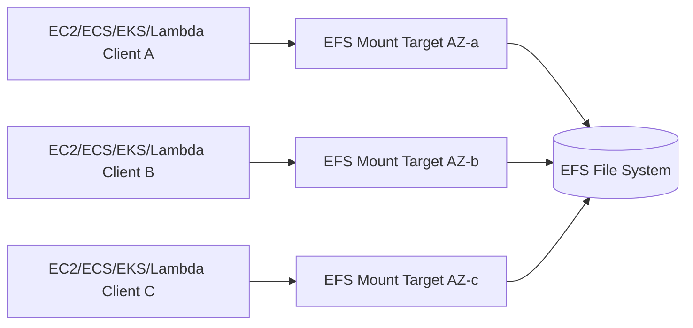
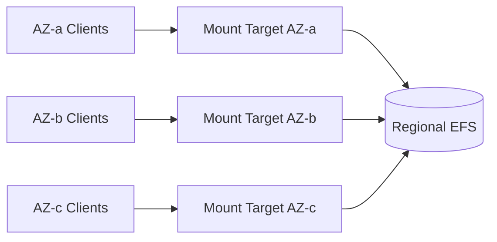
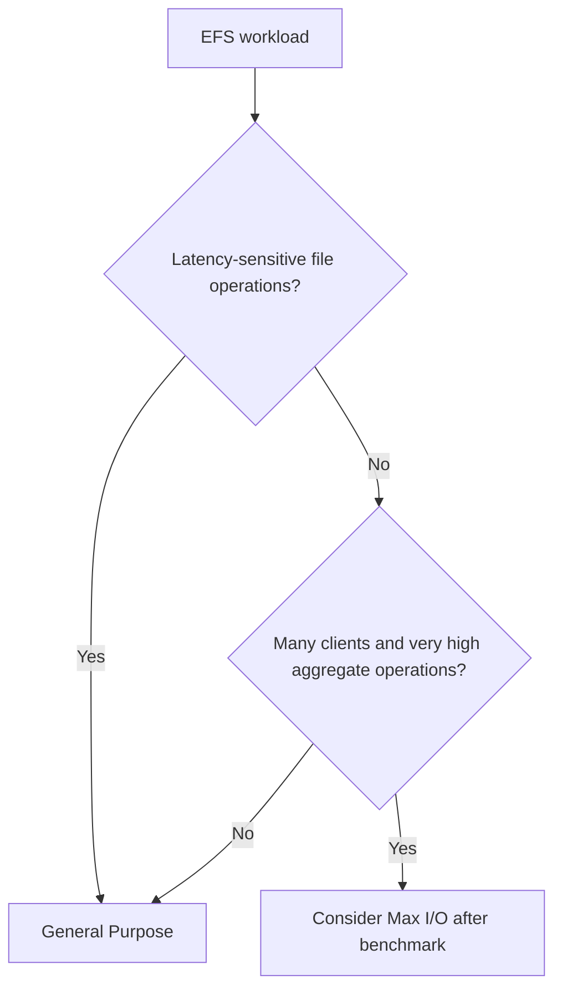
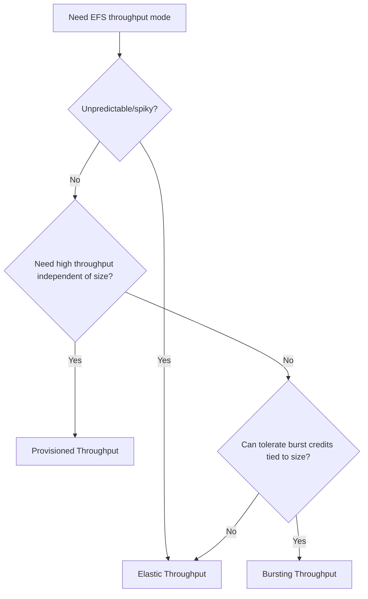

# Part 053 — EFS Architecture and Performance

Amazon EFS looks simple from the client side:

```bash
mount -t efs fs-12345678:/ /mnt/efs
```

But production EFS performance is not simple.

EFS is a distributed NFS file system. The application talks to an NFS client in the operating system. The client talks over the network to an EFS mount target. The file system serves file data and metadata. The application sees paths, reads, writes, stats, renames, and directory listings.

That means performance depends on more than storage capacity.

It depends on:

- mount target placement
- Availability Zone topology
- NFS client behavior
- metadata operation rate
- file size distribution
- directory layout
- throughput mode
- performance mode
- read/write ratio
- client parallelism
- network path
- TLS and mount helper
- lifecycle/storage class
- application access pattern

EFS can be excellent for shared Linux file storage. It can also become the silent bottleneck of a fleet if treated like local disk.

This part focuses on EFS architecture and performance.

---

## 1. Problem yang Diselesaikan

Part ini menjawab:

- bagaimana EFS bekerja secara arsitektur
- apa itu mount target dan mengapa AZ placement penting
- kapan memakai Regional vs One Zone EFS
- apa beda performance mode dan throughput mode
- bagaimana read/write throughput dihitung secara mental model
- mengapa metadata-heavy workload bisa lambat walau byte throughput kecil
- bagaimana mengoptimalkan small-file workload
- bagaimana memilih EFS untuk ECS/EKS/Lambda/EC2
- bagaimana mendesain observability, dashboard, dan runbook untuk EFS

---

## 2. Mental Model

### 2.1 EFS is shared remote file storage



The application does file operations. Those operations cross the network.

Therefore:

```text
EFS latency != local filesystem latency
EFS metadata operation != memory lookup
EFS shared directory != local folder
```

### 2.2 EFS stores files, not objects or blocks

EFS exposes:

- directories
- files
- symlinks
- POSIX permissions
- NFS access
- file metadata
- shared read/write access

Use EFS when your application needs a Linux file system interface shared across multiple compute clients.

Do not use EFS as a replacement for S3 if object semantics are enough.

Do not use EFS as a replacement for EBS if a single database needs low-latency block storage.

### 2.3 Mount target is the network entry point

EFS clients connect to mount targets in a VPC.

For Regional file systems, you can create mount targets in multiple Availability Zones. Clients should generally mount through the mount target in their own AZ to reduce cross-AZ latency and data transfer.

For One Zone file systems, the file system and mount target are in one Availability Zone.

Mount target design is part of application availability.

### 2.4 Performance is not only throughput

EFS performance has multiple dimensions:

```text
throughput
IOPS / operations per second
metadata latency
data latency
client concurrency
directory fanout
file size distribution
open/close/stat/list rate
```

A workload can be slow even if throughput is low.

Example:

```text
1 million tiny files
each file: open, stat, read 2 KB, close
```

This is metadata-heavy. It may not consume much MiB/s, but it can be expensive in round trips and metadata operations.

### 2.5 Shared file systems amplify bad access patterns

A single app server scanning a huge directory is bad.

A hundred app servers scanning the same huge directory every second is a distributed denial-of-service against your own file system.

---

## 3. EFS Architecture Components

### 3.1 File system

The EFS file system is the logical shared filesystem.

Key choices:

- Regional vs One Zone
- performance mode
- throughput mode
- encryption at rest
- lifecycle management/storage classes
- backup/replication
- access points
- resource policy
- tags/owner/cost allocation

Some choices are hard to change later. Performance mode, for example, is selected at file system creation.

### 3.2 Mount targets

Mount targets live in subnets/AZs and have security groups.

Design rules:

- create mount target in each AZ where clients run for Regional EFS
- ensure clients use local AZ mount target through DNS
- security group allows NFS/TCP 2049 from clients
- network ACLs/routes allow traffic
- avoid routing high-volume clients cross-AZ unintentionally
- for One Zone, place compute in the same AZ

### 3.3 DNS

EFS provides DNS names for mounting.

Production issues:

- wrong region
- wrong VPC/DNS config
- resolver issue
- stale DNS cache
- One Zone mount using wrong AZ name
- client in different VPC without correct connectivity

### 3.4 Client mount

Clients mount with NFS, commonly via the EFS mount helper.

Recommended production concerns:

- use TLS where required
- use `noresvport` as AWS recommends for EFS NFS mount settings
- `_netdev` in `/etc/fstab` to avoid boot ordering issues
- use systemd mount behavior intentionally
- monitor mount health
- avoid blocking application startup indefinitely without clear health state

Example:

```text
fs-12345678:/ /mnt/efs efs _netdev,tls,noresvport 0 0
```

### 3.5 Security groups

EFS mount target security group should allow inbound NFS from application security groups.

Bad:

```text
allow NFS from 0.0.0.0/0
```

Better:

```text
allow TCP 2049 from sg-app-workers
```

### 3.6 Access points

Access points are application-specific entry points into a file system. They can enforce a root directory and POSIX identity. Part 054 covers them deeply.

---

## 4. Regional vs One Zone

### 4.1 Regional EFS

Regional EFS stores data redundantly across multiple AZs in a Region and can have mount targets in multiple AZs.

Use when:

- application is multi-AZ
- file data is source of truth
- higher availability is required
- multiple AZ compute needs shared storage
- AZ failure resilience matters

Design:



### 4.2 One Zone EFS

One Zone EFS stores data within a single AZ and supports a single mount target in that AZ.

Use when:

- lower cost is desired
- data is reproducible or backed up elsewhere
- workload is AZ-local
- application can tolerate AZ-level loss
- source of truth is elsewhere

Avoid for:

- only copy of critical data without backup/replication
- multi-AZ app that expects file system survival across AZ failure
- workloads accidentally accessing cross-AZ
- compliance data requiring multi-AZ durability unless compensated

### 4.3 Cross-AZ access

Cross-AZ access can add:

- latency
- data transfer cost
- availability coupling to remote AZ
- surprising performance issues

For One Zone, run compute in the same AZ.

For Regional, create mount targets in every client AZ.

### 4.4 Decision table

| Requirement | Regional | One Zone |
|---|---:|---:|
| multi-AZ application | strong fit | usually poor |
| lower cost | higher cost | lower cost |
| source of truth | strong fit | only with backup/risk acceptance |
| AZ-local scratch/shared cache | possible | good fit |
| DR critical | better | needs additional protection |
| Lambda/ECS/EKS across AZs | good with mount targets | constrain subnets/AZ |

---

## 5. Performance Mode

### 5.1 General Purpose

General Purpose mode is recommended for most workloads and is designed for latency-sensitive applications such as web serving, content management, home directories, and general file serving.

Use when:

- latency matters
- web/app workloads
- user home directories
- shared content
- common application file sharing
- metadata operations are moderate

### 5.2 Max I/O

Max I/O mode can scale to higher aggregate throughput and operations per second, with trade-off of higher latency for file operations.

Use when:

- many clients
- high aggregate throughput
- workload can tolerate higher metadata latency
- analytics/HPC-like parallel access
- broad parallelism dominates individual operation latency

Caution:

- performance mode is selected at file system creation
- many modern EFS workloads should start with General Purpose unless Max I/O is clearly needed
- benchmark workload shape before choosing

### 5.3 Decision



### 5.4 Migration

If performance mode is wrong, the common pattern is to create a new file system with the desired mode and migrate data using tools like rsync, DataSync, backup/restore, or application-level migration.

Plan performance mode early.

---

## 6. Throughput Modes

### 6.1 Throughput is file-system level

EFS throughput is shared by clients.

One noisy client can affect others.

Throughput mode determines how much throughput is available.

EFS supports:

- Elastic throughput
- Provisioned throughput
- Bursting throughput

### 6.2 Elastic Throughput

Elastic throughput automatically scales throughput up or down based on workload activity.

Use when:

- workload is spiky
- access pattern is unpredictable
- you want less capacity planning
- application has variable read/write bursts
- operational simplicity matters

Caution:

- cost depends on throughput used
- monitor actual usage
- high sustained workloads may need cost comparison with provisioned/bursting

### 6.3 Provisioned Throughput

Provisioned throughput lets you specify throughput independent of stored data size.

Use when:

- workload needs known sustained throughput
- stored data size is small but throughput need is high
- you can forecast required MiB/s
- cost predictability matters

Caution:

- underprovisioning creates bottleneck
- overprovisioning wastes cost
- monitor utilization
- increase before planned spikes

### 6.4 Bursting Throughput

Bursting throughput scales with file system size and burst credits.

Use when:

- workload grows with stored data
- bursts are occasional
- cost sensitivity matters
- workload can tolerate credit-based behavior

Caution:

- small file systems may have limited baseline throughput
- sustained high throughput can deplete credits
- credit exhaustion can cause severe slowdown
- monitor burst credit balance

### 6.5 Read/write throughput mental model

EFS read throughput is often discounted relative to metered throughput, meaning read-heavy workloads can drive higher read throughput than write throughput for the same metered amount.

Operationally:

- know read/write ratio
- monitor actual throughput
- know if app is write-heavy
- do not assume read benchmark predicts write benchmark

### 6.6 Throughput decision



---

## 7. Workload Shape and Performance

### 7.1 Large sequential files

Good fit when:

- multiple clients read large files
- reads are parallel
- throughput mode sized correctly
- file open/close not excessive

Examples:

- media source files
- shared model files
- scientific datasets
- large reports

### 7.2 Many small files

Risky.

Small-file workload issues:

- open/close overhead
- metadata round trips
- directory listing
- permission checks
- stat calls
- poor batching
- client cache misses

Mitigations:

- bundle small files
- use archive/container files
- reduce file reopen
- keep file descriptors open where safe
- increase parallelism
- fan out directories
- use S3/object layout for tiny records
- use database/catalog for metadata
- choose FSx/Lustre/ONTAP if workload needs specialized metadata performance

### 7.3 Directory listing

Huge directory listing can be expensive.

Bad:

```text
/mnt/efs/uploads/
  10 million files
```

Better:

```text
/mnt/efs/uploads/2026/07/06/ab/cd/<id>
```

or move metadata to database.

### 7.4 File reopen loop

Bad:

```python
for path in paths:
    with open(path) as f:
        read_small_amount(f)
```

If repeated many times, open/close dominates.

Mitigate:

- batch reads
- keep files open
- combine files
- use memory/local cache
- prefetch
- reduce metadata calls

### 7.5 Many clients

Many clients can improve aggregate throughput when workload parallelizes.

But many clients also amplify:

- metadata storm
- lock contention
- directory scans
- cache invalidation
- noisy-neighbor effects within same file system

Partition workload by directory/prefix/application if needed.

---

## 8. EFS with Compute Services

### 8.1 EC2

Classic usage:

- mount via EFS mount helper
- use fstab/systemd
- ensure mount target per AZ
- security groups
- monitor mount state
- use Auto Scaling lifecycle hooks if data consistency requires drain

### 8.2 ECS

EFS integrates with ECS tasks.

Design concerns:

- task IAM vs file system access
- access point per app/service
- container UID/GID
- mount lifecycle
- task placement subnets/AZs
- throughput shared across tasks
- one noisy service affecting another

### 8.3 EKS

Kubernetes use cases:

- PersistentVolumes via EFS CSI driver
- ReadWriteMany volumes
- shared config/assets
- multi-pod file access

Design concerns:

- access point dynamic provisioning
- POSIX user enforcement
- namespace isolation
- pod security context
- many pods scanning same directory
- backup/restore
- avoiding EFS as database for every pod

### 8.4 Lambda

Lambda can mount EFS for shared persistent files.

Use cases:

- large dependencies/models
- shared reference data
- file-based legacy libraries
- outputs that require filesystem path

Cautions:

- cold start/mount behavior
- VPC networking
- concurrency amplifies file system operations
- access point strongly recommended
- not a substitute for `/tmp` for per-invocation scratch when local ephemeral is enough
- not a database

---

## 9. Cost Model

### 9.1 Cost dimensions

EFS cost includes:

```text
storage GB-month by storage class
throughput mode cost/usage
data transfer if cross-AZ or external
backup
replication
request/operation-like effects via throughput/performance
lifecycle storage class changes
```

Exact pricing changes by Region and date; always check current pricing.

### 9.2 Storage classes

EFS has storage classes/lifecycle management such as Standard, Infrequent Access, Archive, and One Zone variants depending on configuration and availability.

Use lifecycle for:

- old files
- rarely accessed directories
- home directory cold data
- old shared assets
- long-term file retention

Caution:

- first access to infrequent/archive class may have latency/cost implications
- application should tolerate access pattern
- do not transition hot metadata or hot files blindly

### 9.3 Throughput cost

Elastic vs Provisioned vs Bursting can change cost dramatically.

Cost review questions:

- Is workload truly sustained?
- Is throughput overprovisioned?
- Is Elastic usage higher than expected?
- Is Bursting credit exhaustion causing hidden slowdown?
- Is read-heavy workload benefiting from read discount?
- Is one file system shared by unrelated workloads?

### 9.4 Cost isolation

Do not put every application into one EFS file system.

Reasons to split:

- different throughput needs
- different lifecycle needs
- different access policies
- different blast radius
- different backup/restore
- different cost owner
- noisy-neighbor isolation

---

## 10. Observability

### 10.1 File system metrics

Monitor:

- throughput
- percent I/O limit
- burst credit balance if using bursting
- client connections
- storage bytes by class
- metadata operation symptoms via app metrics
- read/write bytes
- total I/O bytes
- mount target health
- backup status
- replication status if used

### 10.2 Application metrics

Add:

- file open latency
- file read latency
- file write latency
- directory listing duration
- number of files per directory
- stat calls per request
- lock wait time
- failed I/O count
- stale file handle count
- permission denied count
- mount unavailable count
- queue age if directory polling
- temp file cleanup result

### 10.3 OS metrics

Collect:

- NFS client stats
- network retransmits
- mount errors
- dmesg/journal NFS messages
- process I/O
- open file descriptors
- blocked processes
- DNS resolution failures
- TCP connection issues

Commands:

```bash
nfsstat -c
mount | grep efs
df -hT
findmnt /mnt/efs
dmesg -T | egrep -i 'nfs|efs|stale|timeout|not responding'
```

### 10.4 Workload shape metrics

Track:

- file count per directory
- average file size
- p95 file size
- top directories by file count
- top directories by bytes
- files created/deleted per minute
- rename rate
- open/close rate
- list rate

These are often more actionable than throughput.

---

## 11. Performance Tuning Patterns

### 11.1 Reduce metadata round trips

AWS performance guidance recommends minimizing file reopens, increasing parallelism, and bundling reference files where possible for small-file performance.

Practical actions:

- keep file descriptors open
- batch file operations
- avoid repeated stat in hot path
- cache metadata in app
- use manifest/catalog
- combine tiny files
- reduce directory listing frequency

### 11.2 Increase useful parallelism

Use parallel clients/workers when reading large independent files.

But apply backpressure:

- avoid all workers scanning same directory
- partition work list in database/queue
- limit concurrency per directory
- avoid synchronized start storms

### 11.3 Use local cache when safe

For read-heavy reference data:

- copy to instance store or container local disk
- validate checksum/version
- refresh by manifest/pointer
- keep EFS as shared source only if needed

### 11.4 Avoid EFS for hot coordination

Do not implement high-throughput queue/lock service via files.

Use:

- SQS
- DynamoDB
- RDS
- Step Functions
- Kafka/MSK
- Redis/ElastiCache where appropriate

### 11.5 Split workloads

If one workload is metadata-heavy and another is latency-sensitive, separate file systems may be better.

---

## 12. Failure Modes

### 12.1 Burst credits exhausted

Symptoms:

- throughput drops
- latency rises
- no code change
- small file system with sustained activity

Fix:

- switch to Elastic/Provisioned if appropriate
- increase stored data only if it naturally fits cost model, not as hack
- reduce workload
- split file system
- optimize access pattern

### 12.2 Cross-AZ mount path

Symptoms:

- higher latency
- data transfer cost
- AZ-local clients behave differently
- One Zone workload slow/costly from other AZ

Fix:

- create mount target in each AZ for Regional EFS
- constrain compute to One Zone AZ
- verify DNS/mount target selection
- inspect subnet placement

### 12.3 Metadata storm

Symptoms:

- app slow with low MiB/s
- many stat/open/list calls
- directory scan repeated

Fix:

- replace scan with catalog
- fan out directories
- bundle files
- reduce reopens
- batch operations
- move workload to S3/table format or FSx if appropriate

### 12.4 Permission mismatch

Symptoms:

- some clients can write, others cannot
- ECS task fails after UID change
- Lambda cannot access path
- root-owned files accumulate

Fix:

- use access points
- enforce POSIX identity
- standardize UID/GID
- set root directory creation permissions
- avoid manual chmod drift

### 12.5 Mount hang at boot

Symptoms:

- instances stuck booting
- app never starts
- dependency order issue

Fix:

- use `_netdev`
- systemd automount where appropriate
- timeout/retry settings
- app readiness gate
- fail/degrade intentionally

### 12.6 Noisy neighbor

Symptoms:

- one batch job slows web app
- throughput/operation limit shared

Fix:

- separate file systems
- separate access points/directories not enough for throughput isolation
- schedule batch windows
- add app-level limits
- use provisioned/elastic throughput appropriately

---

## 13. Operational Runbooks

### 13.1 EFS slow

1. Identify affected clients and AZs.
2. Check operation type: read/write/list/stat/open.
3. Check EFS throughput and percent I/O limit.
4. Check burst credits if bursting.
5. Check client connections and concurrency.
6. Check file size distribution.
7. Check directory fanout.
8. Check NFS client errors/retransmits.
9. Check cross-AZ access.
10. Reduce metadata operations or change throughput mode.

### 13.2 Application cannot mount

1. Check file system ID and Region.
2. Check mount target exists in client AZ/VPC.
3. Check DNS resolution.
4. Check security group inbound TCP 2049.
5. Check network ACL/routes.
6. Check IAM/TLS/access point config if using authorization.
7. Check mount helper installed.
8. Check OS logs.
9. Test from same subnet with minimal client.

### 13.3 Permission denied

1. Check access point POSIX user/root directory.
2. Check file ownership/mode.
3. Check process UID/GID.
4. Check container security context.
5. Check IAM authorization if enabled.
6. Check path exists under access point root.
7. Avoid recursive chmod without ownership plan.

### 13.4 Burst credit incident

1. Confirm throughput mode is Bursting.
2. Check credit balance.
3. Check workload change.
4. Identify top clients/directories.
5. Reduce non-critical workload.
6. Switch to Elastic/Provisioned if sustained need.
7. Add alert on credit depletion.

### 13.5 Directory scan incident

1. Identify scanning code path.
2. Count files in directory.
3. Stop/reduce scanning jobs.
4. Move state to catalog/queue.
5. Fan out directory layout.
6. Add max directory size guardrail.
7. Add scan duration metric.

---

## 14. Terraform Skeleton

### 14.1 Regional EFS baseline

```hcl
resource "aws_efs_file_system" "app" {
  creation_token   = "case-app-prod"
  encrypted        = true
  performance_mode = "generalPurpose"
  throughput_mode  = "elastic"

  tags = {
    Service     = "case-app"
    Environment = "prod"
    DataClass   = "shared-app-files"
  }
}

resource "aws_security_group" "efs" {
  name   = "case-app-efs"
  vpc_id = var.vpc_id
}

resource "aws_security_group_rule" "allow_nfs_from_app" {
  type                     = "ingress"
  security_group_id        = aws_security_group.efs.id
  source_security_group_id = aws_security_group.app.id
  from_port                = 2049
  to_port                  = 2049
  protocol                 = "tcp"
}

resource "aws_efs_mount_target" "app" {
  for_each = var.private_subnets_by_az

  file_system_id  = aws_efs_file_system.app.id
  subnet_id       = each.value
  security_groups = [aws_security_group.efs.id]
}
```

### 14.2 Mount command

```bash
sudo yum install -y amazon-efs-utils || true

sudo mkdir -p /mnt/efs

sudo mount -t efs \
  -o tls,noresvport \
  fs-12345678:/ \
  /mnt/efs
```

### 14.3 fstab

```text
fs-12345678:/ /mnt/efs efs _netdev,tls,noresvport 0 0
```

Add application readiness checks. Do not assume fstab success means app-safe.

---

## 15. Design Checklist

### 15.1 Architecture

- [ ] Regional vs One Zone decision documented.
- [ ] Mount targets exist in all client AZs for Regional.
- [ ] One Zone clients constrained to same AZ.
- [ ] Security groups allow only required clients.
- [ ] Performance mode chosen intentionally.
- [ ] Throughput mode chosen intentionally.
- [ ] Encryption at rest enabled.
- [ ] TLS in transit used where required.
- [ ] Backup/restore defined.
- [ ] Cost owner defined.

### 15.2 Performance

- [ ] Workload file size distribution measured.
- [ ] Metadata operation rate understood.
- [ ] Directory fanout designed.
- [ ] Small-file mitigation plan exists.
- [ ] Throughput metrics monitored.
- [ ] Burst credits monitored if bursting.
- [ ] App metrics track open/list/stat latency.
- [ ] Cross-AZ access checked.
- [ ] Noisy-neighbor risk reviewed.

### 15.3 Operations

- [ ] Mount runbook exists.
- [ ] Permission runbook exists.
- [ ] Slow performance runbook exists.
- [ ] Directory scan incident runbook exists.
- [ ] Backup restore tested.
- [ ] Access point strategy defined.
- [ ] Cleanup owner defined.
- [ ] Dashboard built.

---

## 16. Mini Case Study — Shared Media Directory

### 16.1 Situation

A web application stores uploaded media on EFS:

```text
/mnt/efs/uploads/
```

Multiple EC2 instances read/write files.

### 16.2 Initial failure

Symptoms:

- page load latency rises
- instances show low CPU
- EFS throughput not high
- directory listing slow
- uploads sometimes conflict
- cleanup job causes spikes

Root causes:

- one directory with millions of files
- UI lists EFS directly
- no metadata catalog
- filename collision
- no atomic upload pattern
- cleanup scans entire tree

### 16.3 Better design

- S3 stores durable original uploads.
- EFS stores only application-required shared projection/cache.
- Catalog stores upload metadata.
- Directory fanout by hash/date.
- Upload writes temp file then atomic rename.
- UI queries catalog, not EFS listing.
- Cleanup uses catalog and bounded prefixes.
- EFS throughput set to Elastic.
- Dashboard tracks file count, list latency, and EFS percent I/O limit.

### 16.4 Invariant

```text
EFS serves shared file access.
Catalog serves business discovery.
S3 stores durable originals.
```

---

## 17. Summary

EFS is powerful because it gives multiple compute clients a shared Linux file system.

But its performance and reliability depend on architecture:

- mount targets per AZ
- Regional vs One Zone choice
- throughput mode
- performance mode
- metadata operation shape
- directory layout
- client mount behavior
- NFS semantics
- permissions
- observability
- backup/restore

The core rule:

> Treat EFS as a distributed shared filesystem, not as local disk with a bigger name.

Next, we go deeper into EFS access points, permissions, security boundaries, IAM authorization, TLS, POSIX identity enforcement, and production isolation patterns.

---

## References

- Amazon EFS User Guide — How Amazon EFS works: https://docs.aws.amazon.com/efs/latest/ug/how-it-works.html
- Amazon EFS User Guide — Managing mount targets: https://docs.aws.amazon.com/efs/latest/ug/accessing-fs.html
- Amazon EFS User Guide — Creating mount targets: https://docs.aws.amazon.com/efs/latest/ug/manage-fs-access-create-delete-mount-targets.html
- Amazon EFS User Guide — EFS performance specifications: https://docs.aws.amazon.com/efs/latest/ug/performance.html
- Amazon EFS User Guide — Managing file system throughput: https://docs.aws.amazon.com/efs/latest/ug/managing-throughput.html
- Amazon EFS User Guide — EFS performance tips: https://docs.aws.amazon.com/efs/latest/ug/performance-tips.html
- Amazon EFS User Guide — Recommended NFS mount settings: https://docs.aws.amazon.com/efs/latest/ug/mounting-fs-nfs-mount-settings.html
- Amazon EFS User Guide — Mounting One Zone file systems: https://docs.aws.amazon.com/efs/latest/ug/mounting-one-zone.html
- Amazon EFS User Guide — Resilience in Amazon EFS: https://docs.aws.amazon.com/efs/latest/ug/disaster-recovery-resiliency.html
