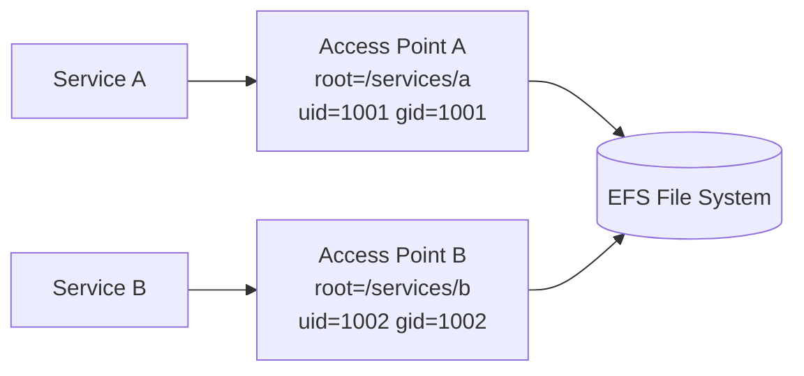
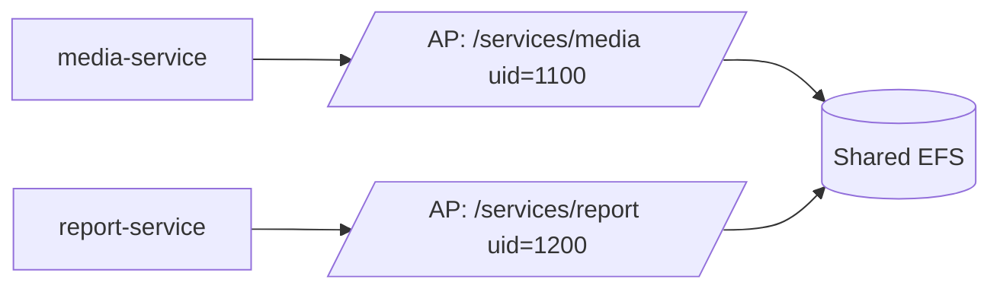

# Part 054 — EFS Access Points, Permissions, and Security

EFS security is not just a security group.

A client can reach TCP 2049 and still fail permissions.

A container can mount the file system and still write files as the wrong UID.

A Lambda can use an access point and still fail because the root directory was not created with the expected permissions.

A shared file system can become a cross-service data leak if every service mounts `/`.

EFS has multiple security layers:

- VPC/network reachability
- security groups
- NFS protocol
- POSIX user/group permissions
- IAM authorization for NFS clients
- EFS file system policy
- access points
- TLS in transit
- encryption at rest
- KMS key policy
- compute service integration
- application-level directory ownership

This part focuses on EFS access points, permissions, IAM/TLS, and safe multi-application isolation.

---

## 1. Problem yang Diselesaikan

Part ini menjawab:

- apa itu EFS access point
- bagaimana access point enforce root directory
- bagaimana access point enforce POSIX user/group
- kapan memakai access point untuk ECS/EKS/Lambda
- bagaimana IAM authorization bekerja dengan EFS mount
- bagaimana TLS in transit dipakai
- bagaimana mendesain directory/UID/GID ownership
- bagaimana menghindari permission drift
- bagaimana multi-tenant/multi-service isolation dibuat
- bagaimana runbook permission denied, mount denied, root-owned files, dan cross-service leakage

---

## 2. Mental Model

### 2.1 EFS access point is an application entry point

An access point is an application-specific entry point into an EFS file system.

It can enforce:

- a root directory
- POSIX user ID
- POSIX group ID
- secondary group IDs
- root directory creation owner/permissions



The application thinks `/` is its access point root.

That is the key isolation property.

### 2.2 Network access is not file access

Security group:

```text
Can this client connect to NFS endpoint?
```

POSIX permission:

```text
Can this user read/write this path?
```

IAM authorization:

```text
Is this principal allowed to mount/write/root-access this EFS file system/access point?
```

Access point:

```text
Which root path and POSIX identity are enforced?
```

All layers matter.

### 2.3 POSIX identity is numeric

EFS permissions use numeric UID/GID, not human usernames.

If one container writes as UID 1000 and another runs as UID 2000, they may see permission denied even if both say "appuser" inside different images.

Production rule:

```text
Standardize numeric UID/GID across images and access points.
```

Or enforce identity through access points.

### 2.4 Shared file system is a blast-radius boundary

If many services mount the same root:

```text
fs-123:/
```

then a permission mistake can expose or delete other services' data.

Access points let you make application-specific roots:

```text
/services/order
/services/billing
/services/media
```

But access points are not a substitute for separate file systems when workload, lifecycle, cost, or blast radius should be isolated.

---

## 3. EFS Security Layers

### 3.1 Network layer

Required:

- client is in VPC or connected network
- route exists
- DNS works
- mount target exists
- mount target security group allows inbound TCP 2049
- client security group allows outbound
- NACLs allow traffic

Failure symptom:

```text
mount timeout
connection refused
no route to host
DNS failure
```

### 3.2 Encryption in transit

Use EFS mount helper with TLS when required.

Example:

```bash
sudo mount -t efs -o tls,noresvport fs-12345678:/ /mnt/efs
```

For IAM authorization with EFS mount helper, TLS is typically required.

### 3.3 Encryption at rest

Enable EFS encryption at rest at file system creation.

For customer managed KMS keys:

- EFS service needs key usage
- recovery/backup role needs decrypt as needed
- key must not be disabled/deleted unexpectedly
- cross-account backup/restore needs key policy review

### 3.4 POSIX file permissions

EFS uses standard POSIX permissions:

- user
- group
- mode bits
- ownership
- execute bit on directories
- sticky bit where relevant

Root user behavior and permissions depend on access point/IAM/root access settings.

### 3.5 IAM authorization

EFS can use IAM to control NFS client access. IAM actions include capabilities like:

- client mount
- client write
- client root access

IAM authorization is strongest when paired with access points and TLS.

### 3.6 File system policy

EFS file system policy controls access to the file system using IAM principals and conditions.

Use it to require:

- TLS
- specific access point
- specific principal
- deny non-approved mounts
- deny root access except specific roles

### 3.7 Access point enforcement

Access point can:

- scope the root directory
- replace NFS client's UID/GID with configured POSIX identity
- create the root directory with specified owner/mode when needed

This is extremely useful for containers and serverless.

---

## 4. Access Point Core Concepts

### 4.1 Root directory

An access point can expose a specific directory as the client's root.

Example:

```text
file system actual path: /services/media
client mounted path: /
```

The client cannot access paths outside that root through that access point.

This is not just convenience. It is a containment boundary.

### 4.2 Root directory creation

When creating an access point, you can specify creation info:

- owner UID
- owner GID
- permissions

If the path does not exist, EFS can create it with those settings when the access point is used.

Without correct creation info, clients can fail because the access point root does not exist or is not accessible.

### 4.3 POSIX user enforcement

Access points can enforce a POSIX identity for all file operations.

When user enforcement is enabled, EFS replaces the NFS client's user and group IDs with the configured access point identity for file operations.

This helps solve:

- container UID mismatch
- Lambda runtime UID ambiguity
- inconsistent host users
- accidental root-owned files
- service-specific identity

### 4.4 Secondary groups

Secondary GIDs allow group access patterns.

Use cautiously. Simpler is better:

```text
one service -> one uid/gid -> one root directory
```

### 4.5 Access point per workload

Recommended pattern:

```text
access point per service/app/tenant boundary
```

Examples:

```text
/services/media
/services/reports
/services/ml-cache
/tenants/tnt-83f2
/jobs/batch-worker
```

Do not let every workload mount `/`.

---

## 5. Patterns

### 5.1 Service-isolated access point



Benefits:

- service cannot traverse to other roots through AP
- file ownership consistent
- cleanup scoped
- incident blast radius reduced
- IAM policy can require AP ARN

### 5.2 ECS task access point

Use access point in ECS task definition.

Design:

- container runs as expected UID/GID or AP enforces identity
- task role allowed to mount via AP
- EFS policy requires access point
- task subnets align with mount targets
- security groups allow NFS
- root directory created by AP

### 5.3 EKS dynamic access points

EFS CSI driver can provision access points for Kubernetes PersistentVolumes.

Use cases:

- namespace/workload isolation
- ReadWriteMany volumes
- app-specific persistent file paths

Concerns:

- PV lifecycle
- reclaim policy
- POSIX identity
- pod security context
- cleanup of unused access points
- backup/restore
- noisy-neighbor throughput

### 5.4 Lambda access point

Lambda requires EFS access point for mounting EFS.

Use cases:

- large model/reference files
- shared dependencies
- stateful file library
- shared outputs

Concerns:

- VPC configuration
- security groups/subnets
- concurrency and file-system throughput
- cold start/mount behavior
- POSIX permissions
- not using EFS as per-invocation scratch if `/tmp` is enough

### 5.5 Tenant-isolated access points

For multi-tenant workloads:

```text
/tenants/<tenant-id>/
```

Access point per tenant can enforce root.

Cautions:

- access point quota
- operational overhead
- tenant lifecycle cleanup
- noisy-neighbor performance still shared if same file system
- IAM role mapping
- backup/restore per tenant

For high-isolation tenants, separate file systems may be better.

### 5.6 Job attempt access point

For batch systems:

```text
/jobs/<job-id>/<attempt-id>/
```

Can isolate job attempts, but creating access point per attempt may be overkill. Use per-worker/service AP plus attempt directory unless strong isolation is required.

---

## 6. IAM Authorization Patterns

### 6.1 Require access point

EFS file system policy can require clients to access through approved access point.

Conceptual policy:

```json
{
  "Effect": "Allow",
  "Principal": {
    "AWS": "arn:aws:iam::123456789012:role/media-task-role"
  },
  "Action": [
    "elasticfilesystem:ClientMount",
    "elasticfilesystem:ClientWrite"
  ],
  "Resource": "arn:aws:elasticfilesystem:region:account:file-system/fs-12345678",
  "Condition": {
    "StringEquals": {
      "elasticfilesystem:AccessPointArn": "arn:aws:elasticfilesystem:region:account:access-point/fsap-abc"
    },
    "Bool": {
      "aws:SecureTransport": "true"
    }
  }
}
```

This prevents the role from mounting the whole filesystem root.

### 6.2 Deny non-TLS

Conceptual deny:

```json
{
  "Effect": "Deny",
  "Principal": "*",
  "Action": "*",
  "Resource": "arn:aws:elasticfilesystem:region:account:file-system/fs-12345678",
  "Condition": {
    "Bool": {
      "aws:SecureTransport": "false"
    }
  }
}
```

### 6.3 Restrict root access

Root access is powerful. Restrict `ClientRootAccess` to tightly controlled roles.

Most application roles should not need root access.

### 6.4 Separate mount and write

Some workloads need read-only shared data.

Grant:

- `ClientMount`

but not:

- `ClientWrite`

where appropriate.

Still enforce POSIX permissions. IAM and POSIX should align.

### 6.5 Defense in depth

Use:

- security group source restriction
- IAM file system policy
- access point root directory
- POSIX enforced identity
- directory permissions
- application-level authorization

Do not rely on one layer only.

---

## 7. POSIX Design

### 7.1 UID/GID registry

Create a registry:

```yaml
posixIdentities:
  media-service:
    uid: 1100
    gid: 1100
    root: /services/media
  report-service:
    uid: 1200
    gid: 1200
    root: /services/report
  batch-worker:
    uid: 1300
    gid: 1300
    root: /services/batch
```

Keep it in IaC/docs.

### 7.2 Directory permissions

Common service root:

```text
owner: service uid
group: service gid
mode: 0750 or 0770 depending collaboration
```

For shared dropbox style:

```text
mode: 1770
```

Sticky bit may be useful where multiple writers share a directory, but prefer clearer ownership models.

### 7.3 Avoid chmod 777

`chmod -R 777` is not a permission strategy.

It hides identity bugs and creates data leakage/delete risks.

### 7.4 Containers

Container image users matter.

If Dockerfile says:

```dockerfile
USER app
```

that maps to a numeric UID inside the image.

EFS sees numeric UID/GID unless access point enforces identity.

### 7.5 Root-owned file drift

Causes:

- startup script runs as root
- init container writes files
- manual admin copy
- access point does not enforce user
- container user changed

Fix:

- enforce AP POSIX user
- init with correct UID/GID
- avoid manual writes
- add startup permission check
- run drift scanner

---

## 8. Terraform Skeleton

### 8.1 EFS file system

```hcl
resource "aws_efs_file_system" "shared" {
  creation_token   = "shared-prod"
  encrypted        = true
  performance_mode = "generalPurpose"
  throughput_mode  = "elastic"

  tags = {
    Service     = "shared-files"
    Environment = "prod"
  }
}
```

### 8.2 Access point

```hcl
resource "aws_efs_access_point" "media" {
  file_system_id = aws_efs_file_system.shared.id

  posix_user {
    uid = 1100
    gid = 1100
  }

  root_directory {
    path = "/services/media"

    creation_info {
      owner_uid   = 1100
      owner_gid   = 1100
      permissions = "0750"
    }
  }

  tags = {
    Service = "media-service"
  }
}
```

### 8.3 File system policy requiring access point and TLS

```hcl
resource "aws_efs_file_system_policy" "shared" {
  file_system_id = aws_efs_file_system.shared.id

  policy = jsonencode({
    Version = "2012-10-17"
    Statement = [
      {
        Sid    = "AllowMediaServiceViaAccessPoint"
        Effect = "Allow"
        Principal = {
          AWS = aws_iam_role.media_task.arn
        }
        Action = [
          "elasticfilesystem:ClientMount",
          "elasticfilesystem:ClientWrite"
        ]
        Resource = aws_efs_file_system.shared.arn
        Condition = {
          StringEquals = {
            "elasticfilesystem:AccessPointArn" = aws_efs_access_point.media.arn
          }
          Bool = {
            "aws:SecureTransport" = "true"
          }
        }
      }
    ]
  })
}
```

### 8.4 Mount with access point

```bash
sudo mount -t efs \
  -o tls,iam,accesspoint=fsap-1234567890abcdef,noresvport \
  fs-12345678:/ \
  /mnt/media
```

---

## 9. ECS Pattern

### 9.1 Task definition concept

```json
{
  "volumes": [
    {
      "name": "media-data",
      "efsVolumeConfiguration": {
        "fileSystemId": "fs-12345678",
        "transitEncryption": "ENABLED",
        "authorizationConfig": {
          "accessPointId": "fsap-1234567890abcdef",
          "iam": "ENABLED"
        }
      }
    }
  ]
}
```

### 9.2 Container mount

```json
{
  "mountPoints": [
    {
      "sourceVolume": "media-data",
      "containerPath": "/app/data",
      "readOnly": false
    }
  ]
}
```

### 9.3 ECS checklist

- task role has EFS client permissions
- file system policy allows task role via AP
- transit encryption enabled
- AP root path exists/creation info works
- container user compatible or AP enforces UID
- security group allows NFS
- task subnets align with mount targets
- throughput shared with other tasks monitored

---

## 10. EKS Pattern

### 10.1 EFS CSI

Use EFS CSI driver for Kubernetes integration.

Patterns:

- static PV referencing existing access point
- dynamic provisioning creates access points
- ReadWriteMany volumes
- namespace/service isolation

### 10.2 Pod security context

Kubernetes UID/GID must align with EFS permissions unless AP enforces identity.

Example:

```yaml
securityContext:
  runAsUser: 1100
  runAsGroup: 1100
  fsGroup: 1100
```

But access point identity enforcement can simplify.

### 10.3 EKS risks

- one PV used by too many pods
- app assumes local disk latency
- shared config mutated by pods
- namespace isolation not enforced at file layer
- PV reclaim deletes or preserves unexpectedly
- root-owned files from init containers
- backup/restore unclear

---

## 11. Lambda Pattern

### 11.1 Lambda + EFS

Lambda can mount EFS using access points.

Use access points to:

- enforce root directory
- enforce POSIX identity
- avoid Lambda runtime UID surprises
- isolate functions

### 11.2 Lambda concurrency caution

If Lambda concurrency spikes, file operations spike.

Risks:

- many functions open same files
- metadata storm
- write contention
- throughput cost
- lock contention
- mount/cold-start behavior

For per-invocation temporary files, use Lambda `/tmp` when durable/shared storage is not needed.

### 11.3 Lambda checklist

- VPC configured
- subnets with EFS mount targets
- security group NFS access
- access point configured
- function role allowed
- file system policy allows AP
- TLS/IAM mount used
- concurrency limited to downstream/EFS capacity
- app handles EFS errors

---

## 12. Multi-Service Isolation Design

### 12.1 One file system, multiple access points

Good when:

- services share lifecycle/performance/cost owner
- blast radius acceptable
- throughput sharing acceptable
- backup/restore shared
- directory roots isolated enough

### 12.2 Separate file systems

Use separate file systems when:

- different criticality
- different cost owner
- different throughput pattern
- noisy-neighbor risk
- different backup/restore
- different retention/lifecycle
- stronger blast-radius separation
- tenant isolation requirement

### 12.3 Access point is not throughput isolation

Access points isolate namespace/identity. They do not give independent file-system throughput pools.

If Service A saturates EFS throughput, Service B can suffer.

### 12.4 Directory ownership contract

For every root:

```yaml
root: /services/media
ownerService: media-service
accessPoint: fsap-media
uid: 1100
gid: 1100
permissions: "0750"
backupPolicy: daily
cleanupPolicy: app-owned
retention: 90d cache, permanent source elsewhere
```

---

## 13. Common Failure Modes

### 13.1 Mount works without access point

Symptom:

- service accidentally sees whole file system
- cross-service files visible
- security review fails

Fix:

- file system policy requires AP ARN
- deny mount without TLS/IAM/AP
- remove broad NFS-only access
- review task definitions

### 13.2 Permission denied after deployment

Symptom:

- new container image fails writing
- old image worked

Cause:

- numeric UID changed
- access point does not enforce identity
- directory ownership mismatch

Fix:

- restore UID/GID compatibility
- enforce AP POSIX user
- add CI check for image UID
- startup permission check

### 13.3 Root-owned files

Symptom:

- app cannot modify files created by init process
- manual repair recurring

Cause:

- root startup script
- admin copied files as root
- AP not enforcing user
- pod init container mismatch

Fix:

- AP identity enforcement
- run init as service UID
- controlled migration job
- alert on root-owned files under service path

### 13.4 Lambda cannot access EFS

Causes:

- wrong subnet/AZ
- security group missing NFS
- access point root missing
- IAM/file system policy denial
- POSIX permission issue
- KMS issue if encrypted and permissions involved through backup/restore

Fix via layered runbook.

### 13.5 Tenant data leak

Cause:

- tenants share root
- app-level path validation bug
- no access point root per tenant/service
- permissive POSIX mode

Fix:

- tenant-scoped roots/APs or separate FS
- opaque tenant IDs
- strict path normalization
- POSIX mode not world-readable
- app authorization before file access

### 13.6 Cleanup deletes other service data

Cause:

- cleanup job mounts root
- broad `rm -rf`
- no access point containment
- shared temp path

Fix:

- cleanup runs through service AP
- path allowlist
- dry-run/audit
- contract per directory
- separate file systems for strong isolation

---

## 14. Operational Runbooks

### 14.1 Permission denied

1. Identify compute identity: EC2 role, ECS task role, Lambda role, pod role.
2. Identify mount method: direct FS or access point.
3. Check file system policy.
4. Check AP root directory and POSIX user.
5. Check path ownership/mode.
6. Check process numeric UID/GID.
7. Check container image user.
8. Check whether root access is needed/denied.
9. Reproduce with `id`, `stat`, `touch`.
10. Fix in IaC/AP/image, not manual chmod.

Commands:

```bash
id
stat /mnt/efs
stat /mnt/efs/some/path
touch /mnt/efs/.permission-test
```

### 14.2 Mount denied

1. Check security group TCP 2049.
2. Check mount target exists.
3. Check DNS.
4. Check TLS/IAM options.
5. Check client IAM role.
6. Check file system policy.
7. Check AP ARN.
8. Check mount helper logs.
9. Test with minimal role/path.

### 14.3 Cross-service data exposure

1. Stop broad access if active incident.
2. Identify which clients mounted root.
3. Rotate/remove broad IAM permission.
4. Require access point condition.
5. Audit file reads if logs available.
6. Fix task definitions/mount configs.
7. Add policy-as-code test.

### 14.4 Root-owned drift

1. Find root-owned files under service roots.

```bash
find /mnt/efs/services/media -uid 0 -ls | head -100
```

2. Identify writer process.
3. Stop incorrect writer.
4. Correct ownership only after confirming policy.
5. Enforce AP POSIX identity.
6. Add drift monitor.

### 14.5 Access point root missing

1. Check AP root path.
2. Check AP creation info.
3. Check if root directory was deleted.
4. Recreate with correct owner/mode if policy allows.
5. Prevent deletion by app role.
6. Add startup check.

---

## 15. Observability and Audit

### 15.1 Security metrics

Track:

- mount attempts denied
- IAM authorization failures
- permission denied count
- root-owned file count
- world-writable directories
- files outside service root
- access point usage by service
- non-TLS mount attempts
- root access attempts
- file system policy changes
- access point changes
- KMS key changes

### 15.2 Application metrics

- file access denied errors
- file open/write failures
- mount unavailable
- path traversal rejection
- cleanup deletion count
- drift repair count
- unexpected owner/mode count

### 15.3 Audit strategy

Use:

- CloudTrail for EFS control plane changes
- IAM Access Analyzer/policy review
- AWS Config rules where applicable
- application-level audit for file access if required
- host/container logs for POSIX permission errors
- periodic file tree audits for ownership/mode

### 15.4 Compliance checks

Examples:

- every access point has POSIX user
- every access point root path under approved prefix
- file system policy requires secure transport
- no application role has broad root access
- NFS security group source is restricted
- encryption at rest enabled
- backup enabled for source-of-truth file systems

---

## 16. Testing Strategy

### 16.1 Mount test

For each service:

```bash
mount path exists
read allowed test file
write temp file if service should write
delete own temp file
cannot access sibling service directory
```

### 16.2 UID/GID test

In container CI:

```bash
id -u
id -g
```

Compare to AP policy.

### 16.3 Policy test

Attempt:

- mount without AP
- mount without TLS
- mount with wrong role
- write with read-only role
- access sibling path

Expected: denied.

### 16.4 Failure injection

- remove security group rule in non-prod
- break POSIX permissions
- run container with wrong UID
- delete AP root directory
- deny IAM permission
- simulate noisy neighbor
- confirm alarms/runbooks

---

## 17. Design Checklist

### 17.1 Access point

- [ ] One AP per service/tenant boundary where needed.
- [ ] Root directory is service-scoped.
- [ ] Creation info sets owner/mode.
- [ ] POSIX user enforced.
- [ ] UID/GID registry exists.
- [ ] AP ARN used in IAM/file system policy.
- [ ] Broad root mount denied.
- [ ] Cleanup runs through scoped AP.

### 17.2 IAM and TLS

- [ ] TLS required.
- [ ] IAM authorization used where appropriate.
- [ ] File system policy least privilege.
- [ ] `ClientRootAccess` restricted.
- [ ] Read-only roles lack write.
- [ ] Security group source restricted.
- [ ] Control-plane changes audited.

### 17.3 POSIX

- [ ] Container UID/GID standardized.
- [ ] Directory mode reviewed.
- [ ] No `chmod 777` workaround.
- [ ] Root-owned drift monitored.
- [ ] Startup permission check exists.
- [ ] Path traversal safe in application.
- [ ] Sibling directories not accessible.

### 17.4 Operations

- [ ] Runbook for permission denied.
- [ ] Runbook for mount denied.
- [ ] Runbook for AP root missing.
- [ ] Runbook for root-owned files.
- [ ] Policy-as-code tests exist.
- [ ] Backup/restore respects permissions.
- [ ] Tenant/service offboarding cleanup defined.

---

## 18. Mini Case Study — ECS Services Sharing EFS

### 18.1 Bad design

Three ECS services mount:

```text
fs-12345678:/
```

All containers run with different default users.

Permissions are fixed manually:

```bash
chmod -R 777 /mnt/efs
```

Failure:

- Service A deletes Service B files
- Service C creates root-owned files
- cleanup job removes shared data
- security audit finds broad access
- incident scope is unclear

### 18.2 Better design

Access points:

```text
media-service  -> /services/media  uid=1100 gid=1100
report-service -> /services/report uid=1200 gid=1200
batch-worker   -> /services/batch  uid=1300 gid=1300
```

File system policy:

- requires TLS
- requires correct AP per task role
- denies broad root mount
- denies root access to app roles

Containers:

- run as matching UID/GID or AP enforces identity
- mount only service path
- startup checks read/write
- cleanup scoped to service root

### 18.3 Resulting invariant

```text
A service can access only its EFS root through its access point.
All files it creates have the service POSIX identity.
```

---

## 19. Mini Case Study — Lambda Model Loader

### 19.1 Requirement

A Lambda function loads a 2 GB ML model.

Options:

- package with function: too large
- download from S3 on every cold start: too slow
- use EFS with model files: plausible

### 19.2 EFS design

- model files under `/models/model-name/version/`
- access point root `/lambda/model-loader`
- POSIX user enforced
- Lambda role allowed via AP only
- model files read-only
- current model pointer file versioned/validated
- Lambda reserved concurrency protects EFS
- model update writes new version then atomic pointer update
- old models cleaned after rollback window

### 19.3 Invariant

```text
Lambda reads shared model files through a read-only access point.
Model version changes are explicit and atomic.
```

---

## 20. Summary

EFS security is layered:

- network
- TLS
- IAM
- file system policy
- access point
- POSIX UID/GID
- directory permissions
- application authorization

Access points are the most important production primitive for safe EFS usage with containers/serverless because they enforce root directory and POSIX identity.

The core rule:

> Do not let every workload mount the EFS root. Give each workload a scoped access point, enforced identity, and explicit permission contract.

Next, we go deeper into EFS operations: backup, replication, lifecycle, migration, DataSync, disaster recovery, cleanup, and incident response.

---

## References

- Amazon EFS User Guide — Working with access points: https://docs.aws.amazon.com/efs/latest/ug/efs-access-points.html
- Amazon EFS User Guide — Creating access points: https://docs.aws.amazon.com/efs/latest/ug/create-access-point.html
- Amazon EFS User Guide — Enforcing a user identity using an access point: https://docs.aws.amazon.com/efs/latest/ug/enforce-identity-access-points.html
- Amazon EFS User Guide — File and directory permissions: https://docs.aws.amazon.com/efs/latest/ug/user-and-group-permissions.html
- Amazon EFS User Guide — Using IAM to control file system data access: https://docs.aws.amazon.com/efs/latest/ug/iam-access-control-nfs-efs.html
- Amazon EFS User Guide — Using TLS to encrypt data in transit: https://docs.aws.amazon.com/efs/latest/ug/encryption-in-transit.html
- Amazon ECS Developer Guide — Best practices for using Amazon EFS volumes with Amazon ECS: https://docs.aws.amazon.com/AmazonECS/latest/developerguide/efs-best-practices.html
- Amazon EKS User Guide — EFS CSI driver: https://docs.aws.amazon.com/eks/latest/userguide/efs-csi.html
- AWS Lambda Developer Guide — Configuring file system access for Lambda functions: https://docs.aws.amazon.com/lambda/latest/dg/configuration-filesystem.html
