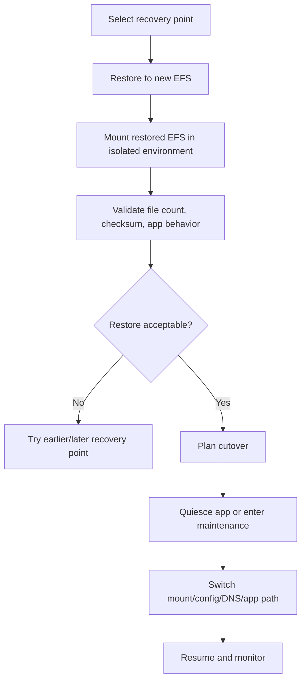
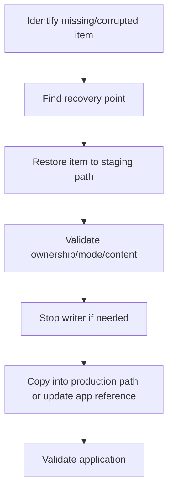
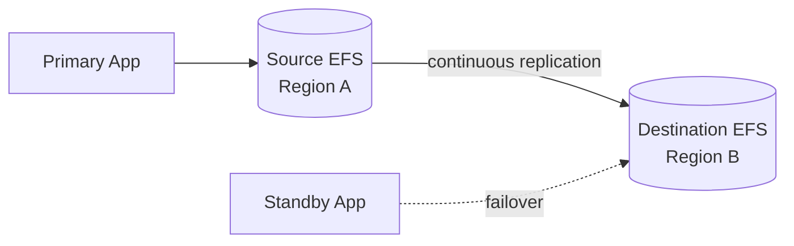
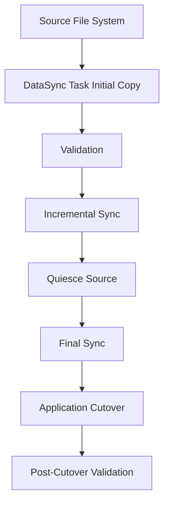

# Part 055 — EFS Backup, Lifecycle, Replication, and Operations

A shared file system becomes production-grade only after you can answer one question:

> If this file system is corrupted, deleted, overloaded, mis-permissioned, or regionally unavailable, what exactly happens next?

Mounting EFS is easy.

Operating EFS is the hard part.

Production EFS operation includes:

- backup policy
- restore testing
- lifecycle management
- storage class transition
- replication
- disaster recovery
- migration
- DataSync jobs
- file ownership preservation
- cleanup ownership
- permission drift detection
- large directory control
- noisy-neighbor isolation
- incident runbooks

EFS often becomes an invisible dependency. Applications write files. Operators assume backups exist. Developers assume a directory can be cleaned. Security assumes permissions are correct. Finance assumes lifecycle reduces cost. DR teams assume replicas are usable.

Those assumptions must become explicit contracts.

---

## 1. Problem yang Diselesaikan

Part ini menjawab:

- bagaimana backup EFS bekerja dengan AWS Backup
- apa bedanya backup vs replication
- bagaimana restore full file system vs item-level restore
- bagaimana lifecycle management EFS memindahkan file ke storage class yang lebih murah
- apa risiko lifecycle pada workload interaktif
- bagaimana EFS replication dipakai untuk DR
- bagaimana failover dan failback file system dilakukan secara mental model
- bagaimana migrasi data ke/dari EFS memakai DataSync
- bagaimana menjaga permission, UID/GID, symlink, metadata, dan file ownership
- bagaimana membuat cleanup yang aman
- bagaimana men-debug EFS corruption, missing file, permission drift, dan slow restore
- bagaimana membangun operational dashboard

---

## 2. Mental Model

### 2.1 Backup is point-in-time recovery

Backup answers:

```text
Can I restore data to a previous point in time?
```

Backup protects against:

- accidental delete
- application corruption
- ransomware-like overwrite if backup retained safely
- operator mistake
- bad deployment
- partial data loss
- need to recover a specific directory/file

Backup is not usually your low-latency live failover path.

### 2.2 Replication is standby data movement

Replication answers:

```text
Can I keep another file system updated for resilience/DR?
```

Replication helps against:

- file system-level issue
- regional/AZ resilience needs
- DR read or failover path
- faster recovery than full restore
- data protection to another Region/AZ

Replication does not automatically protect against logical corruption if the corrupted data replicates.

### 2.3 Lifecycle is cost and access policy

Lifecycle answers:

```text
When should colder files transition to cheaper storage classes?
```

Lifecycle helps with:

- cost optimization
- cold data tiering
- old home directories
- rarely accessed files
- long-lived shared archives

Lifecycle can hurt when:

- application expects low-latency access to old files
- first access to cold file surprises users
- workload scans old directories
- metadata-heavy access touches cold files repeatedly
- retention is based on business state, not last access

### 2.4 Migration is correctness plus metadata

File migration is not just copying bytes.

You need to preserve or intentionally transform:

- file content
- file path
- ownership UID/GID
- permissions
- timestamps
- symlinks
- hard links where relevant
- sparse files where relevant
- hidden files
- case sensitivity expectations
- ACLs depending protocol/source
- application quiescence
- incremental changes
- cutover plan

### 2.5 Operations is contract enforcement

EFS operations should make these contracts visible:

```yaml
fileSystem:
  owner: platform-storage
  applicationOwners:
    - media-service
    - report-service
  dataClass: shared-application-files
  sourceOfTruth: mixed
  backupPolicy: daily, 35-day retention
  restoreRTO: 4h
  restoreRPO: 24h
  replication: enabled to region-b
  lifecycle: transition cold files after policy window
  cleanupOwners:
    /services/media/tmp: media-service
    /services/report/cache: report-service
  accessModel: access-point-per-service
```

If the contract is not documented, EFS becomes shared storage debt.

---

## 3. Backup Strategy

### 3.1 What EFS backup protects

EFS backup protects file data at a recovery point.

Use cases:

- restore accidentally deleted directory
- recover from application bug that overwrote files
- recover from bad cleanup job
- restore file system to a new EFS
- recover selected files/directories
- meet data protection requirements

### 3.2 AWS Backup

AWS Backup can centrally manage and automate backups for EFS file systems. Backups are stored as recovery points in backup vaults.

Backup design questions:

- schedule
- retention
- backup vault
- cold storage lifecycle for recovery points
- cross-account copy
- cross-region copy
- Vault Lock requirement
- restore permission
- KMS key
- backup selection by tags
- restore test frequency

### 3.3 Full restore vs item-level restore

AWS Backup supports restoring an entire EFS file system or selected files/directories with item-level restore.

Full restore:

- restores entire file system
- useful for disaster or broad corruption
- may take longer
- requires application cutover planning

Item-level restore:

- restores selected files/directories
- useful for accidental delete/corruption of limited scope
- still requires path, permission, and overwrite strategy
- test maximum item limits/current service limits

### 3.4 Backup schedule

Common starting pattern:

```yaml
daily:
  retention: 35 days
weekly:
  retention: 12 weeks
monthly:
  retention: 12 months
```

But correct schedule depends on:

- RPO
- rate of change
- business criticality
- cost
- ransomware exposure
- compliance retention
- restore volume
- app consistency requirements

### 3.5 Application consistency

File system backup may capture file states while applications are writing.

For consistency-sensitive workloads:

- quiesce app
- flush writes
- use application-level checkpoint/manifest
- pause writers briefly if needed
- ensure databases are not backed up through EFS unless supported
- use backup hooks/orchestration where available
- test restore with application validation

### 3.6 Backup vault isolation

For high-value EFS source-of-truth:

- use dedicated backup vault
- restrict delete recovery point
- consider AWS Backup Vault Lock
- consider cross-account backup copy
- restrict backup plan modification
- alert on backup job failures
- alert on recovery point deletion
- test restore role

### 3.7 Backup is not enough

Backup does not automatically provide:

- low RTO
- live standby
- application routing
- permission repair
- immediate access after regional failure
- protection from bad data if backups expire too soon
- proof that restored app works

Backup must be paired with restore game days.

---

## 4. Restore Strategy

### 4.1 Restore target

Never restore blindly over production path first.

Safer options:

1. Restore to new EFS.
2. Validate.
3. Copy selected data back.
4. Cut over application if full restore.

This avoids overwriting current data with wrong recovery point.

### 4.2 Full restore flow



### 4.3 Item-level restore flow



### 4.4 Restore validation

Validate:

- file exists
- file size
- checksum if available
- permissions
- UID/GID
- timestamps if meaningful
- symlink targets
- application opens file
- directory listing works
- expected count
- no unexpected overwrite

### 4.5 Restore RTO realism

Restore time depends on:

- recovery point size
- file count
- item count
- target creation
- validation time
- app cutover time
- permission correction
- data copy-back time

RTO is not just "start restore."

### 4.6 Restore runbook metadata

Store per restore:

```yaml
restore:
  recoveryPointArn:
  sourceFileSystem:
  targetFileSystem:
  restoreType: full|item
  requestedBy:
  reason:
  startedAt:
  completedAt:
  validation:
    checksum: pass
    fileCount: pass
    appSmokeTest: pass
  cutoverDecision:
  rollbackPlan:
```

---

## 5. EFS Lifecycle Management

### 5.1 Lifecycle management purpose

EFS lifecycle management automatically transitions file data between storage classes based on lifecycle policies.

Use it for:

- cost optimization
- files not accessed for N days
- home directories with cold data
- old media/document files
- long-lived shared data with rare access
- archive-like file workloads

### 5.2 Lifecycle is access-pattern dependent

A file can be old but hot.

A file can be new but never read again.

Lifecycle based on access age should match actual access behavior.

Do not blindly transition:

- application binaries
- frequently scanned files
- hot model files
- metadata-heavy directory trees
- files used in latency-sensitive requests
- files with unpredictable interactive access unless tested

### 5.3 EFS storage classes

EFS supports storage classes such as Standard, Infrequent Access, Archive, and One Zone variants depending on file system type and configuration.

Design questions:

- how long before transition to IA?
- how long before transition to Archive?
- should files transition back to Standard after access?
- is first-byte latency acceptable?
- is retrieval cost acceptable?
- are old files scanned often?
- is lifecycle state visible in dashboard?

### 5.4 Lifecycle and application UX

If users may access cold files, app should handle:

- slower first access
- possible increased latency
- status/progress if needed
- timeout settings
- retry behavior
- user communication

For backend workloads, cold transition can create p99 spikes.

### 5.5 Lifecycle anti-pattern

Bad:

```text
transition everything not accessed for 7 days to archive
```

Then a weekly/monthly job scans old directories and causes surprise latency/cost.

Better:

- classify directories
- apply lifecycle to known cold areas
- avoid lifecycle on hot app metadata
- monitor access after transition
- test representative access
- use separate file systems for different lifecycle classes if needed

### 5.6 Lifecycle policy review

For each policy:

```yaml
path/scope:
dataOwner:
dataClass:
transitionAfter:
archiveAfter:
transitionBackToStandard:
expectedAccess:
userVisibleImpact:
rollback:
monitoring:
```

---

## 6. EFS Replication

### 6.1 What replication does

EFS replication automatically and transparently replicates data and metadata from a source EFS file system to a destination file system. The replica can be used for failover in DR or game day exercises, and operations can fail back later.

Replication supports resilience and data protection. It is not the same as backup.

### 6.2 Replication architecture



### 6.3 Replica is usually read-only until failover

Treat destination as standby.

If you allow writes to both source and destination without an explicit conflict model, you create split-brain.

### 6.4 Replication RPO

EFS replication has replication lag. RPO depends on lag and the point at which you decide to fail over.

Track:

- last successful sync
- time since last sync
- bytes pending
- replication status
- failed replication state
- source write rate

### 6.5 Replication does not protect from all corruption

If application deletes/corrupts files and replication copies that state, replica may also contain the bad state.

Protection strategy:

- backup for point-in-time restore
- replication for faster DR/standby
- Object/storage-level immutability where applicable for backups
- application-level validation
- access controls preventing destructive writes

### 6.6 Failover mental model

Failover is a controlled authority change.

Steps:

1. Declare incident.
2. Stop or freeze source writes if possible.
3. Check replication status and lag.
4. Decide acceptable recovery point.
5. Promote/fail over to destination.
6. Update application mount/config.
7. Validate permissions and data.
8. Resume service.
9. Record failover epoch.
10. Plan failback.

### 6.7 Failback mental model

Failback is not "turn source back on."

Steps:

1. Determine writes made on destination.
2. Replicate/copy data back to original or choose new primary.
3. Reconcile application state.
4. Validate file counts/checksums.
5. Switch clients.
6. Monitor.
7. Keep old side read-only until confidence.

### 6.8 Replication vs backup matrix

| Scenario | Backup | Replication |
|---|---:|---:|
| accidental delete from yesterday | strong | may replicate delete |
| regional failure | slower restore | faster standby |
| ransomware overwrite | depends retention/vault | may replicate bad data |
| low RTO | may be insufficient | better |
| point-in-time recovery | strong | not primary purpose |
| migration/cutover | possible | useful |
| DR game day | useful | essential |

Use both for critical source-of-truth file systems.

---

## 7. DataSync and Migration

### 7.1 What DataSync is for

AWS DataSync can automate and accelerate data transfers between storage systems and AWS services, including EFS. It supports common migration and copy workflows such as:

- on-prem NFS/SMB to EFS
- EFS to EFS
- EFS across accounts
- EFS across Regions
- EFS to S3 or S3 to EFS depending workload
- periodic ingestion/distribution
- migration cutover

### 7.2 DataSync migration flow



### 7.3 Preserve metadata

When migrating file systems, decide whether to preserve:

- ownership
- permissions
- timestamps
- symlinks
- file modes
- UID/GID
- ACLs depending source/protocol
- deleted files behavior
- verification mode

Do not migrate without application owner validating semantics.

### 7.4 Cutover strategy

For active file systems:

1. Initial bulk copy while app runs.
2. Incremental sync repeatedly.
3. Announce maintenance window if needed.
4. Stop writes or put app read-only.
5. Final sync.
6. Validate.
7. Switch mounts/config.
8. Monitor.
9. Keep old source read-only for rollback window.

### 7.5 DataSync with access points/IAM

DataSync can be configured to use EFS access points and IAM roles when accessing restricted file systems. This is useful when file system policy requires access point/IAM.

### 7.6 Migration anti-patterns

Bad:

```text
rsync once, switch app, hope everything copied
```

Risks:

- files changed during copy
- permissions changed
- symlinks broken
- hidden files missed
- application locks ignored
- partial files copied
- cutover no validation
- rollback impossible

Better:

- DataSync task
- verification
- incremental sync
- quiesce/final sync
- app smoke test
- rollback path

---

## 8. Cleanup and Data Governance

### 8.1 Every directory needs an owner

Example:

```yaml
/services/media/uploads:
  owner: media-service
  class: source-of-truth-projection
  cleanup: never delete without catalog
/services/media/tmp:
  owner: media-service
  class: temporary
  cleanup: delete inactive > 24h
/services/report/cache:
  owner: report-service
  class: derived-cache
  cleanup: LRU over 500GiB
```

### 8.2 Cleanup must be path-scoped

Do not run cleanup from EFS root.

Bad:

```bash
find /mnt/efs -mtime +30 -delete
```

Better:

```bash
find /mnt/efs/services/media/tmp -mindepth 1 -mtime +1 -delete
```

Even better:

- application-aware cleanup
- active file detection
- dry run
- logs deletion
- max deletion count
- owner review

### 8.3 Active file detection

Before deleting:

- check application state
- check file locks
- check open files where possible
- check attempt markers
- check modification time is enough?
- check catalog reference
- avoid deleting by age alone for source-of-truth directories

### 8.4 Quarantine before delete

For uncertain cleanup:

```text
move to quarantine path
wait retention window
delete after validation
```

But moving can break hard links/symlinks and still affects app if path was used. Use carefully.

### 8.5 File count limits as guardrail

Set alarms:

- files per directory
- total file count per service root
- temp directory size
- cache size
- old file count
- unknown owner paths
- root-owned files
- world-writable paths

---

## 9. Backup/Restore with Permissions

### 9.1 Restore can preserve bad permissions

If you restore a directory with old ownership/mode, app may still fail.

Restore validation must include:

```bash
stat path
id app-user
sudo -u appuser test -r path
sudo -u appuser test -w path
```

For containers, test inside the container.

### 9.2 Access point root after restore

If restoring to new file system, access points are separate resources. You need to recreate:

- access points
- POSIX user config
- root directory
- file system policy
- mount targets
- security groups
- IAM policies
- backup/lifecycle/replication config

Restoring data alone does not restore full operating model.

### 9.3 Restore to staging

Recommended:

```text
restore -> staging EFS -> validate -> copy/cutover
```

Avoid direct overwrite unless runbook explicitly says it is safe.

---

## 10. Observability

### 10.1 Backup metrics

Track:

- backup job success/failure
- backup age
- recovery point count
- recovery point retention
- backup vault policy changes
- restore job duration
- restore job success/failure
- last restore test date
- restore RTO measured

### 10.2 Replication metrics

Track:

- replication status
- time since last successful sync
- replication lag
- destination file system health
- failover readiness
- source/destination size drift
- failed replication events

### 10.3 Lifecycle metrics

Track:

- bytes by storage class
- files by storage class
- transition rate
- access latency after transition
- unexpected hot reads from IA/archive
- cost by storage class
- cold file recall patterns

### 10.4 Migration metrics

Track:

- files copied
- bytes copied
- files skipped
- errors
- verification failures
- throughput
- estimated completion
- changed files between syncs
- final sync duration

### 10.5 Cleanup metrics

Track:

- deleted files
- deleted bytes
- skipped active files
- errors
- cleanup duration
- paths touched
- quarantine count
- owner approval status

---

## 11. Runbooks

### 11.1 Accidental delete

1. Stop writer/cleanup job.
2. Identify affected path/time.
3. Check backup recovery points.
4. Decide item-level vs full restore.
5. Restore to staging path/EFS.
6. Validate file content and permissions.
7. Copy back or cut over.
8. Reconcile catalog/application state.
9. Add cleanup guardrail.

### 11.2 Corrupted file tree

1. Stop writes.
2. Identify corruption scope.
3. Snapshot current state if forensic needed.
4. Find latest good recovery point.
5. Restore to staging.
6. Compare file counts/checksums.
7. Decide partial vs full cutover.
8. Validate application.
9. Keep corrupted copy isolated for investigation.

### 11.3 EFS replication failover

1. Declare source unavailable/degraded.
2. Freeze source writes if possible.
3. Check replication status/lag.
4. Promote/fail over destination according to AWS procedure.
5. Update application mount/config.
6. Validate access points/permissions if recreated.
7. Run app smoke test.
8. Resume traffic.
9. Record recovery point.
10. Plan failback.

### 11.4 Failed backup job

1. Check AWS Backup job error.
2. Check file system state.
3. Check IAM/KMS/vault policy.
4. Re-run on-demand backup if needed.
5. Confirm recovery point created.
6. Alert data owner if RPO breached.
7. Fix backup plan.

### 11.5 Lifecycle surprise

1. Identify affected path/file.
2. Check storage class.
3. Check lifecycle policy.
4. Check recent access pattern.
5. If latency/cost issue, adjust transition policy.
6. Exclude hot path or split file system.
7. Monitor recall/access after change.

### 11.6 DataSync migration error

1. Inspect task execution errors.
2. Identify paths skipped/failed.
3. Check permission/ownership.
4. Check source availability.
5. Check network throughput/agent health.
6. Re-run incremental sync.
7. Validate with file count/checksum/sample app test.

---

## 12. Infrastructure Patterns

### 12.1 Backup plan concept

```hcl
resource "aws_backup_vault" "efs" {
  name = "efs-prod-vault"
}

resource "aws_backup_plan" "efs" {
  name = "efs-prod-plan"

  rule {
    rule_name         = "daily"
    target_vault_name = aws_backup_vault.efs.name
    schedule          = "cron(0 5 ? * * *)"

    lifecycle {
      delete_after = 35
    }
  }
}

resource "aws_backup_selection" "efs" {
  name         = "efs-prod-selection"
  iam_role_arn = aws_iam_role.backup.arn
  plan_id      = aws_backup_plan.efs.id

  resources = [
    aws_efs_file_system.app.arn
  ]
}
```

### 12.2 Lifecycle concept

```hcl
resource "aws_efs_file_system" "app" {
  creation_token  = "app-prod"
  encrypted       = true
  throughput_mode = "elastic"

  lifecycle_policy {
    transition_to_ia = "AFTER_30_DAYS"
  }

  lifecycle_policy {
    transition_to_archive = "AFTER_90_DAYS"
  }
}
```

Values and supported transitions can change; validate against current provider/API and file system type.

### 12.3 DataSync task concept

```hcl
resource "aws_datasync_location_efs" "source" {
  efs_file_system_arn = aws_efs_file_system.source.arn
  subdirectory        = "/"
  ec2_config {
    security_group_arns = [aws_security_group.datasync.arn]
    subnet_arn          = aws_subnet.private.arn
  }
}

resource "aws_datasync_location_efs" "destination" {
  efs_file_system_arn = aws_efs_file_system.destination.arn
  subdirectory        = "/"
  ec2_config {
    security_group_arns = [aws_security_group.datasync.arn]
    subnet_arn          = aws_subnet.private.arn
  }
}

resource "aws_datasync_task" "efs_migration" {
  source_location_arn      = aws_datasync_location_efs.source.arn
  destination_location_arn = aws_datasync_location_efs.destination.arn
  name                     = "efs-migration"
}
```

---

## 13. Failure Modes

### 13.1 Backup exists but restore fails

Causes:

- KMS permission
- wrong recovery point
- target config missing
- restore role lacks permissions
- item path wrong
- app expects access points not recreated
- restore too slow for RTO

Fix:

- restore game day
- KMS recovery role test
- IaC for access points/policies
- documented item paths
- RTO measurement

### 13.2 Replication faithfully copies corruption

Causes:

- application bug deletes/corrupts data
- replication updates destination
- no point-in-time backup used

Fix:

- restore from backup
- use backup + replication
- destructive-write guardrails
- application validation

### 13.3 Lifecycle makes hot path slow

Causes:

- old but frequently accessed files transitioned
- periodic jobs touch cold files
- user-interactive access not modeled

Fix:

- exclude prefix
- change transition age
- split file system
- pre-warm/read workflow
- use Standard for hot path

### 13.4 Migration loses permissions

Causes:

- copy tool not preserving UID/GID/mode
- source identity mapping differs
- target access point enforces different user
- SMB to NFS mismatch

Fix:

- test migration sample
- decide identity mapping
- use DataSync options correctly
- validate with application user

### 13.5 Cleanup deletes active files

Causes:

- age-only cleanup
- no active attempt detection
- cleanup runs from root
- shared temp path

Fix:

- scoped cleanup
- active file detection
- app state/cat​​alog check
- quarantine
- dry-run

---

## 14. Game Days

### Scenario 1 — Restore one directory

Inject:

```text
delete /services/report/templates/
```

Expected:

- backup recovery point identified
- item-level restore to staging
- permissions validated
- directory restored
- app smoke test passes
- RTO measured

### Scenario 2 — Bad cleanup job

Inject in non-prod:

```text
cleanup deletes files outside allowed path
```

Expected:

- guardrail blocks cleanup
- alerts fire
- deletion logged
- restore runbook works

### Scenario 3 — Replication failover

Simulate source unavailable.

Expected:

- replication lag checked
- destination promoted/failover executed
- application mounts destination
- smoke test passes
- failback plan documented

### Scenario 4 — Lifecycle latency surprise

Transition a test directory to cold class.

Expected:

- first access behavior understood
- app timeout settings validated
- dashboard shows cold access
- lifecycle policy adjusted if needed

### Scenario 5 — Migration cutover

Run full DataSync migration rehearsal.

Expected:

- initial sync
- incremental sync
- quiesce
- final sync
- validation
- app cutover
- rollback plan

---

## 15. Design Checklist

### 15.1 Backup

- [ ] Backup plan exists.
- [ ] Retention matches RPO/compliance.
- [ ] Backup vault access restricted.
- [ ] KMS recovery access tested.
- [ ] Restore game day performed.
- [ ] Item-level restore tested.
- [ ] Full restore tested.
- [ ] Backup failure alarms exist.
- [ ] Recovery point deletion monitored.

### 15.2 Replication

- [ ] Replication purpose defined.
- [ ] Destination Region/AZ/account chosen.
- [ ] RPO/RTO documented.
- [ ] Replication lag monitored.
- [ ] Failover runbook exists.
- [ ] Failback runbook exists.
- [ ] Backup still exists for point-in-time recovery.
- [ ] Destination app mount/config tested.

### 15.3 Lifecycle

- [ ] Data classes defined.
- [ ] Transition policy matches access pattern.
- [ ] Hot prefixes excluded.
- [ ] Application timeout behavior tested.
- [ ] Bytes by storage class monitored.
- [ ] Cost savings measured.
- [ ] User-visible cold access handled.

### 15.4 Migration

- [ ] Source and target semantics compared.
- [ ] UID/GID/permissions plan defined.
- [ ] Initial and incremental sync tested.
- [ ] Final sync/cutover plan exists.
- [ ] Application smoke test defined.
- [ ] Rollback plan exists.
- [ ] DataSync errors monitored.

### 15.5 Cleanup

- [ ] Every directory has owner.
- [ ] Cleanup path-scoped.
- [ ] Source-of-truth paths protected.
- [ ] Active file detection exists.
- [ ] Dry run supported.
- [ ] Deletion logged.
- [ ] Cleanup alarms exist.

---

## 16. Mini Case Study — Report Service Shared Templates

### 16.1 Context

A report service stores templates and generated PDF cache on EFS.

Paths:

```text
/services/report/templates/
/services/report/cache/
/services/report/tmp/
```

### 16.2 Initial issue

A cleanup job deletes files older than 30 days under `/services/report`.

It accidentally deletes templates that rarely change.

### 16.3 Root cause

The directory tree mixed:

- source-of-truth templates
- derived cache
- disposable tmp files

under one cleanup scope.

### 16.4 Fixed design

Contracts:

```yaml
/services/report/templates:
  class: source-of-truth
  cleanup: never by age
  backup: daily
/services/report/cache:
  class: derived
  cleanup: LRU or age > 30d
/services/report/tmp:
  class: disposable
  cleanup: age > 24h
```

Backup:

- daily AWS Backup
- item-level restore tested for templates

Lifecycle:

- cache can transition/expire if needed
- templates stay in hot class

Cleanup:

- three separate jobs
- allowlist paths
- dry-run logs
- deletion metrics

### 16.5 Invariant

```text
Cleanup policy follows data class, not parent directory.
```

---

## 17. Summary

EFS operations are about protecting shared file state.

Production EFS needs:

- backup
- restore test
- replication
- lifecycle policy
- migration plan
- cleanup ownership
- permission validation
- observability
- game days

The core rule:

> Backup restores points in time. Replication supports standby. Lifecycle optimizes cost. None of them replace application-level ownership of file correctness.

Next, we move into Amazon FSx: choosing the right FSx family and understanding the architectural decision map before going deep into each FSx option.

---

## References

- Amazon EFS User Guide — Backing up and replicating data in Amazon EFS: https://docs.aws.amazon.com/efs/latest/ug/backup-replication.html
- Amazon EFS User Guide — Backing up EFS file systems: https://docs.aws.amazon.com/efs/latest/ug/awsbackup.html
- AWS Backup Developer Guide — Restore an Amazon EFS file system: https://docs.aws.amazon.com/aws-backup/latest/devguide/restoring-efs.html
- Amazon EFS User Guide — Replicating EFS file systems: https://docs.aws.amazon.com/efs/latest/ug/efs-replication.html
- Amazon EFS User Guide — Managing storage lifecycle: https://docs.aws.amazon.com/efs/latest/ug/lifecycle-management-efs.html
- Amazon EFS User Guide — Configuring lifecycle policies: https://docs.aws.amazon.com/efs/latest/ug/enable-lifecycle-management.html
- Amazon EFS User Guide — Using AWS DataSync to transfer data: https://docs.aws.amazon.com/efs/latest/ug/trnsfr-data-using-datasync.html
- AWS DataSync User Guide — What is AWS DataSync?: https://docs.aws.amazon.com/datasync/latest/userguide/what-is-datasync.html
- AWS DataSync User Guide — Configuring transfers with Amazon EFS: https://docs.aws.amazon.com/datasync/latest/userguide/create-efs-location.html
