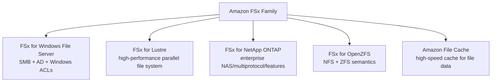
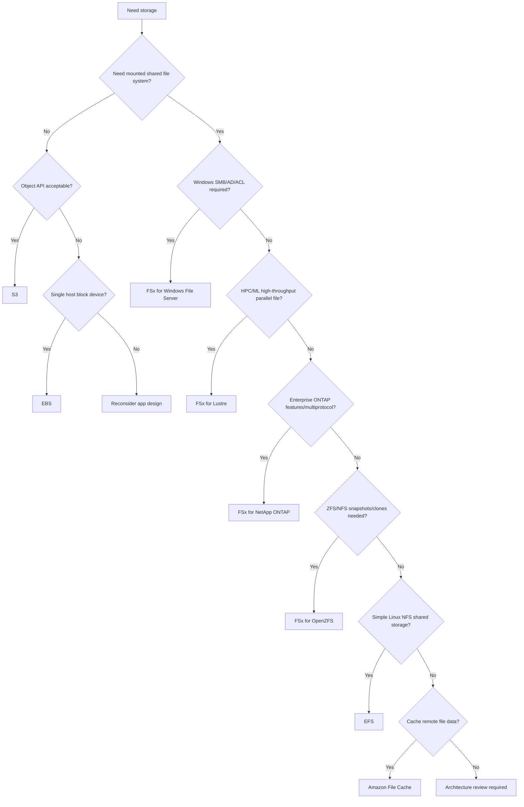
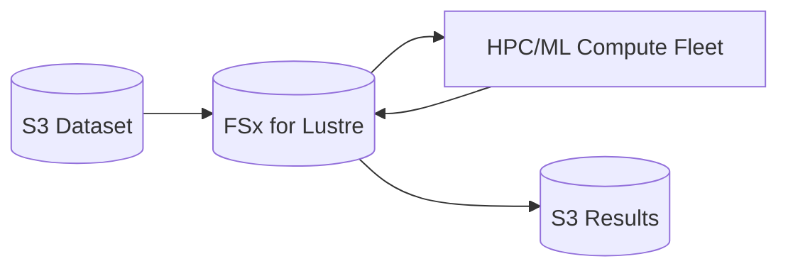
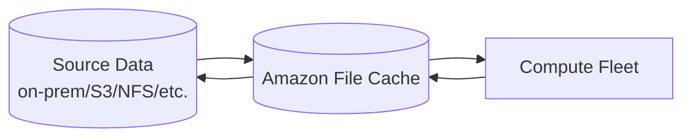
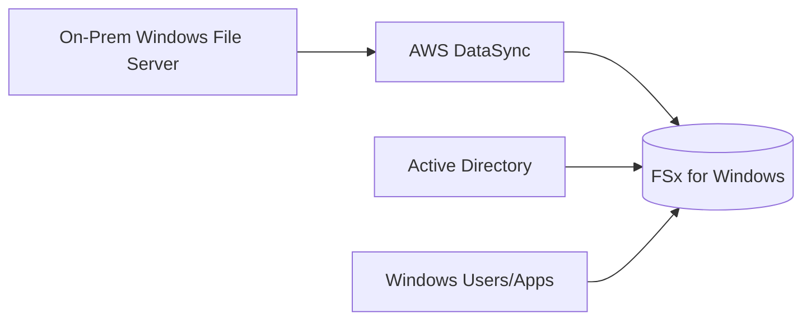
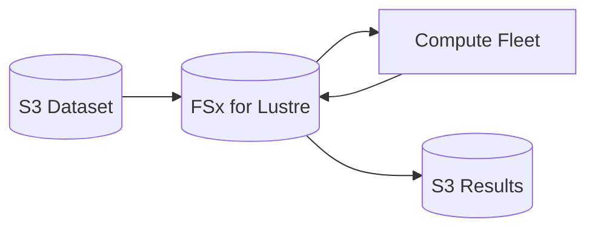
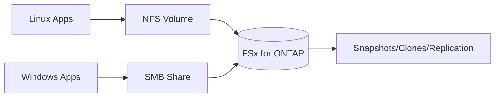
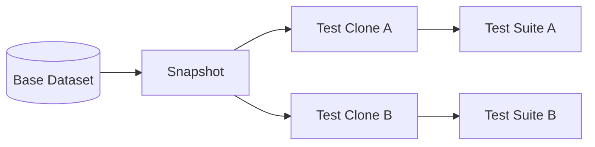

# Part 056 — FSx Family Selection and Architecture Map

Amazon FSx is not one storage service.

It is a family of managed file systems.

That family matters because file workloads are often defined by protocol and semantics, not just by capacity.

A Windows application wants SMB, Active Directory, Windows ACLs, and Windows file server compatibility.

An HPC job wants a parallel file system with high throughput and integration with S3 datasets.

An enterprise NAS migration may require ONTAP features, snapshots, clones, multi-protocol access, and operational familiarity.

A ZFS-based workload may require snapshots, clones, and NFS with OpenZFS semantics.

A data-processing workload may need a high-speed file cache over data stored elsewhere.

Putting all of those under one "shared file storage" label is how teams choose the wrong system.

This part builds the Amazon FSx decision map.

---

## 1. Problem yang Diselesaikan

Kita akan membahas:

- apa itu Amazon FSx family
- kapan memilih FSx dibanding EFS/S3/EBS
- kapan memakai FSx for Windows File Server
- kapan memakai FSx for Lustre
- kapan memakai FSx for NetApp ONTAP
- kapan memakai FSx for OpenZFS
- kapan memakai Amazon File Cache
- bagaimana memikirkan protocol, performance, lifecycle, backup, DR, security, dan migration
- bagaimana menghindari salah memilih file system
- bagaimana membuat architecture review untuk FSx workload

---

## 2. Mental Model

### 2.1 FSx is managed specialized file storage

Amazon FSx makes it possible to run managed file systems without operating the underlying file server infrastructure yourself.

But specialization remains.



The first decision is not:

```text
Which is cheapest?
```

The first decision is:

```text
What file system semantics does the workload require?
```

### 2.2 Protocol determines compatibility

| Protocol/need | Candidate |
|---|---|
| SMB, Windows ACLs, AD integration | FSx for Windows File Server |
| NFS + simple elastic Linux shared storage | EFS or FSx OpenZFS/ONTAP depending features |
| HPC parallel POSIX-like file access | FSx for Lustre |
| ONTAP enterprise features/multiprotocol | FSx for NetApp ONTAP |
| ZFS snapshots/clones/NFS | FSx for OpenZFS |
| Cache remote file datasets | Amazon File Cache |
| Object API/lifecycle/archive | S3 |
| Single-host block storage | EBS |

### 2.3 FSx choice is workload identity

Every FSx option has a workload identity:

```text
Windows File Server: enterprise Windows compatibility
Lustre: high-performance parallel file access
ONTAP: enterprise NAS and multiprotocol data management
OpenZFS: ZFS-based NFS file workloads
File Cache: temporary high-speed file cache over source data
```

If your requirement does not match the identity, re-check the choice.

### 2.4 Managed does not mean no architecture

FSx still requires design for:

- VPC/subnet placement
- AD/domain integration where relevant
- throughput/capacity
- deployment type
- backup
- snapshots
- security groups
- client mount
- DNS
- identity/permissions
- maintenance windows
- monitoring
- migration
- DR
- cost ownership

Managed file system reduces undifferentiated operations. It does not remove application storage design.

---

## 3. FSx vs EFS vs S3 vs EBS

### 3.1 Choose FSx when

- workload needs a specific file system/protocol
- migration compatibility matters
- high-performance file access needed
- enterprise NAS features needed
- Windows file server semantics needed
- HPC/ML wants Lustre
- ZFS/ONTAP operational features matter
- File Cache fits remote-data acceleration

### 3.2 Choose EFS when

- Linux NFS shared file storage is enough
- elastic capacity and serverless operation matter
- simplicity matters
- ECS/EKS/Lambda shared mount
- no specialized FSx feature required
- workload fits EFS performance model

### 3.3 Choose S3 when

- object storage API is acceptable
- data is immutable blobs
- lifecycle/archive/object lock/event integration needed
- analytics/data lake object layout
- massive durable object namespace
- file mount semantics not required

### 3.4 Choose EBS when

- one instance owns the filesystem
- database/block workload
- low-latency block access
- boot/data volume
- shared file access not required

### 3.5 Decision tree



---

## 4. FSx for Windows File Server

### 4.1 Workload identity

Managed Windows file server with SMB support, Windows-native compatibility, Active Directory integration, and Windows ACL semantics.

Use when:

- Windows applications expect SMB share
- users need Windows file shares
- Windows ACLs/NTFS permissions matter
- Active Directory identity required
- lift-and-shift Windows file server
- Microsoft workload compatibility
- enterprise home directories/shared drives

### 4.2 Architecture concerns

- Single-AZ vs Multi-AZ deployment
- throughput capacity
- storage capacity
- Windows AD integration
- DNS names
- SMB client config
- share permissions
- NTFS ACLs
- backups
- shadow copies/snapshots if used
- maintenance windows
- storage type choice
- user/group migration

### 4.3 Anti-patterns

- using Windows FSx for Linux-only NFS workload
- ignoring AD dependency
- treating SMB share as object store
- putting millions of tiny files without metadata review
- broad share permissions + weak NTFS ACLs
- no restore test
- assuming Multi-AZ solves application consistency

### 4.4 Best fit example

Legacy finance app:

```text
\\corp.example.com\finance-share
```

Needs:

- AD groups
- Windows ACLs
- SMB file locking
- Windows backup expectations
- user access from Windows clients

FSx for Windows is a natural candidate.

---

## 5. FSx for Lustre

### 5.1 Workload identity

High-performance parallel file system for compute-intensive workloads.

Use when:

- HPC
- ML training
- genomics
- financial simulation
- rendering
- media processing
- data processing over large files
- high throughput and low latency parallel file access
- integration with S3 datasets

### 5.2 S3 integration mental model

FSx for Lustre can be linked to S3 datasets, enabling high-performance file access to data associated with S3. This is commonly used to accelerate compute jobs while S3 remains durable data lake/source.



### 5.3 Scratch vs persistent

FSx for Lustre has deployment choices that map to workload durability/performance needs.

Conceptual distinction:

- scratch/high-performance temporary job file system
- persistent file system for longer-lived workloads

Always check current deployment options and durability semantics in AWS docs.

### 5.4 Architecture concerns

- data import/export with S3
- throughput per TiB
- metadata workload
- file count
- client mount and kernel modules
- job scheduler integration
- bursty compute fleet
- cleanup after jobs
- checkpoint path
- result export
- cost during idle time

### 5.5 Anti-patterns

- using Lustre as general enterprise file share
- using it as only durable source without understanding deployment type
- ignoring small-file metadata behavior
- failing to export results/checkpoints
- leaving expensive file system idle
- no job cleanup
- no S3 manifest/version identity

### 5.6 Best fit example

ML training:

```text
S3 durable dataset -> FSx for Lustre -> GPU training fleet -> checkpoints/results -> S3
```

Invariant:

```text
FSx for Lustre accelerates compute.
S3/catalog defines durable dataset identity.
```

---

## 6. FSx for NetApp ONTAP

### 6.1 Workload identity

Managed NetApp ONTAP file storage with enterprise NAS capabilities.

Use when:

- migrating NetApp workloads
- ONTAP operational features required
- multiprotocol NFS/SMB/iSCSI needed
- snapshots/clones/replication workflows matter
- enterprise storage admins expect ONTAP model
- storage efficiency features needed
- hybrid data management patterns

### 6.2 Architecture concerns

- storage virtual machines
- volumes
- aggregates/capacity pool concepts
- protocol identity
- NFS/SMB/iSCSI config
- snapshots and clones
- SnapMirror-like migration/replication patterns
- throughput capacity
- multi-AZ deployment
- AD integration for SMB
- ONTAP admin boundaries

### 6.3 Why not just EFS?

Choose ONTAP when you need ONTAP features.

If you only need simple elastic NFS, EFS may be simpler.

If you need enterprise NAS/multiprotocol/snapshot/cloning semantics, FSx ONTAP may be the better fit.

### 6.4 Anti-patterns

- choosing ONTAP only because it sounds enterprise
- ignoring ONTAP operational model
- no staff familiarity
- treating it like generic NFS without using features
- failing to map identities/ACLs
- no volume-level ownership model
- unclear backup/replication design

### 6.5 Best fit example

Enterprise application suite:

- Linux app uses NFS
- Windows users use SMB
- storage team needs snapshots/clones
- migration from on-prem NetApp
- hybrid replication requirements

FSx ONTAP can preserve operational model.

---

## 7. FSx for OpenZFS

### 7.1 Workload identity

Managed OpenZFS file storage with NFS access and ZFS-style features such as snapshots and clones.

Use when:

- NFS workloads need ZFS semantics
- snapshots/clones are important
- high-performance NFS required
- application benefits from point-in-time clones
- development/test clones
- data management features beyond EFS

### 7.2 Architecture concerns

- file system and volume design
- NFS exports
- snapshot policy
- clone lifecycle
- throughput capacity
- capacity planning
- backup
- client mount behavior
- identity/permissions

### 7.3 Why not EFS?

Choose OpenZFS when:

- you need snapshots/clones with ZFS semantics
- performance/cost profile fits
- application expects NFS but benefits from ZFS data management
- capacity/performance provisioning is acceptable

Choose EFS when:

- elastic serverless NFS simplicity is enough
- no specialized ZFS feature is required
- access from Lambda/ECS/EKS with access points is primary pattern

### 7.4 Anti-patterns

- using OpenZFS without snapshot/clone need
- failing to manage clone sprawl
- no snapshot retention policy
- no capacity monitoring
- unclear restore process
- assuming EFS-style elasticity

### 7.5 Best fit example

CI/testing environment:

- shared baseline dataset
- clone per test suite
- fast rollback
- NFS access
- snapshot-based test data management

---

## 8. Amazon File Cache

### 8.1 Workload identity

High-speed cache for file data stored elsewhere.

Use when:

- source data is in on-premises file system or cloud storage
- compute needs fast POSIX-like file access
- dataset can be cached
- cache warmup and consistency model are understood
- source remains authoritative

### 8.2 Mental model



Cache is not automatically the source of truth unless you design it that way.

### 8.3 Architecture concerns

- source data system
- cache warmup
- cache eviction
- write-back/write-through semantics if applicable
- consistency expectation
- job scheduling locality
- lifecycle of cache
- data synchronization
- cost while cache exists

### 8.4 Anti-patterns

- treating cache as durable source
- no warmup plan
- no cache invalidation
- no fallback to source
- no job cleanup
- surprise stale reads

### 8.5 Best fit example

Research compute:

- source dataset on-prem
- burst compute in AWS
- cache dataset near EC2 fleet
- process intensively
- write results back to durable destination
- destroy cache after campaign

---

## 9. Decision Dimensions

### 9.1 Protocol

Ask:

```text
Does the app require SMB, NFS, Lustre client, multiprotocol, or object API?
```

Protocol mismatch is a hard red flag.

### 9.2 Identity

Ask:

- Windows AD?
- POSIX UID/GID?
- NTFS ACL?
- NFS export policy?
- tenant/service isolation?
- cross-account access?

### 9.3 Performance

Ask:

- latency sensitive?
- throughput heavy?
- metadata heavy?
- many small files?
- many clients?
- random vs sequential?
- read-heavy vs write-heavy?
- checkpoint storms?

### 9.4 Durability and availability

Ask:

- Single-AZ acceptable?
- Multi-AZ required?
- backup required?
- snapshots required?
- replication required?
- RPO/RTO?
- source-of-truth vs cache?

### 9.5 Data lifecycle

Ask:

- long-lived?
- temporary scratch?
- cache?
- archive?
- restore window?
- compliance retention?
- clone lifecycle?

### 9.6 Migration

Ask:

- source protocol?
- metadata preservation?
- AD/ACL mapping?
- UID/GID mapping?
- cutover downtime?
- incremental sync?
- rollback?

### 9.7 Operations

Ask:

- who operates the file system?
- is team familiar with ONTAP/ZFS/Lustre/Windows?
- how are backups tested?
- how are metrics monitored?
- how are clients mounted?
- how are patches/maintenance handled?
- what is the incident runbook?

---

## 10. Workload Mapping

### 10.1 Windows line-of-business app

Requirements:

- SMB
- AD
- Windows ACLs
- file locks
- Windows clients

Likely:

```text
FSx for Windows File Server
```

### 10.2 Linux web app shared uploads

Requirements:

- shared NFS
- simple app mount
- elastic capacity
- ECS/EKS/EC2

Likely:

```text
EFS
```

or use S3 if app can be modernized.

### 10.3 ML training over large dataset

Requirements:

- high-throughput parallel reads
- many compute nodes
- S3 dataset source

Likely:

```text
FSx for Lustre
```

or File Cache/local cache depending source.

### 10.4 Enterprise NAS migration

Requirements:

- NFS + SMB
- snapshots/clones
- ONTAP familiarity
- enterprise data management

Likely:

```text
FSx for NetApp ONTAP
```

### 10.5 ZFS-based NFS workload

Requirements:

- NFS
- ZFS snapshots/clones
- high-performance file access

Likely:

```text
FSx for OpenZFS
```

### 10.6 Burst compute over remote dataset

Requirements:

- temporary high-speed cache
- data stored elsewhere
- compute campaign

Likely:

```text
Amazon File Cache
```

### 10.7 Durable object archive

Requirements:

- immutable blobs
- lifecycle/archive
- object lock
- event processing
- data lake integration

Likely:

```text
S3
```

---

## 11. Architecture Patterns

### 11.1 FSx Windows migration



Key concerns:

- AD integration
- ACL preservation
- share paths
- cutover DNS
- backup/restore
- SMB performance

### 11.2 FSx Lustre compute burst



Key concerns:

- dataset version
- import/export
- compute lifecycle
- job cleanup
- checkpoint durability
- idle cost

### 11.3 FSx ONTAP enterprise NAS



Key concerns:

- SVMs/volumes
- protocol identity
- snapshots/clones
- storage efficiency
- operational ownership

### 11.4 FSx OpenZFS dev/test clone



Key concerns:

- clone lifecycle
- capacity growth
- snapshot retention
- NFS permissions

### 11.5 File Cache campaign


Key concerns:

- cache source
- warmup
- eviction
- consistency
- output commit

---

## 12. Security Model

### 12.1 Network

All FSx deployments require:

- VPC/subnet design
- security groups
- route tables
- DNS
- client access control
- cross-VPC/on-prem connectivity if needed

### 12.2 Identity

Depends on file system:

| FSx option | Identity model |
|---|---|
| Windows | Active Directory + Windows ACLs |
| Lustre | Linux/POSIX-style client permissions |
| ONTAP | NFS/SMB/iSCSI identity depending protocol |
| OpenZFS | NFS/POSIX-style |
| File Cache | depends on linked source/cache protocol |

### 12.3 Encryption

Design:

- encryption at rest
- KMS key ownership
- encryption in transit/protocol support
- backup encryption
- cross-account recovery

### 12.4 Least privilege

Do not expose file share broadly.

Use:

- security groups
- AD groups
- export policies
- share ACLs
- POSIX permissions
- client IAM where applicable
- separate file systems for strong boundaries

---

## 13. Performance Model

### 13.1 Throughput capacity

FSx systems generally require explicit capacity/performance choices.

Unlike EFS Elastic throughput, many FSx workloads need provisioning decisions.

Ask:

- required MB/s?
- required IOPS?
- expected metadata ops?
- storage capacity?
- peak vs sustained?
- client count?
- burst behavior?

### 13.2 Metadata-heavy workload

High file count and small files can bottleneck any file system.

Mitigations:

- bundle small files
- compaction
- directory fanout
- metadata catalog
- specialized file system choice
- client parallelism tuning

### 13.3 Client placement

Performance depends on:

- AZ/subnet
- instance network bandwidth
- client mount options
- protocol version
- kernel/client driver
- DNS
- cross-AZ path
- compute scaling

### 13.4 Noisy neighbor

Shared file system means shared limits.

Separate workloads if:

- different latency criticality
- different throughput profile
- batch vs interactive
- different cost owner
- different security boundary

---

## 14. Backup, Snapshots, and DR

### 14.1 Backup expectations differ

FSx family members support backup/snapshot capabilities, but semantics vary by file system type.

Always check:

- automatic backup support
- manual backup
- snapshot/clone support
- cross-region/cross-account copy
- restore behavior
- file-level vs file-system-level restore
- application consistency
- retention
- backup windows

### 14.2 DR architecture

DR design must include:

- data replication/copy
- identity system
- DNS/client mount
- application config
- backup restore
- KMS
- network
- client failover
- validation

File system availability alone is not app DR.

### 14.3 Snapshot is not archive

Snapshots/clones are operational tools.

They do not replace:

- long-term backup
- cross-account recovery
- ransomware protection
- compliance retention
- restore testing

### 14.4 Restore game day

For each FSx workload:

- restore backup/snapshot
- mount from app client
- validate permissions
- validate file content
- run application smoke test
- measure RTO
- test rollback

---

## 15. Migration Strategy

### 15.1 Migration planning

For file migration:

- source protocol
- target FSx type
- identity mapping
- ACL/permission preservation
- file count
- file size distribution
- active writes
- cutover window
- validation method
- rollback
- incremental sync

### 15.2 DataSync

AWS DataSync is commonly used for moving file data between on-premises and AWS storage services or between AWS storage services.

Use for:

- NFS/SMB to FSx
- FSx migration
- EFS/FSx copy
- periodic transfer
- cutover sync

### 15.3 Native replication/migration tools

Depending on FSx type:

- ONTAP migrations may use ONTAP-native capabilities
- Windows migrations may need ACL-aware tools
- Lustre may integrate with S3 datasets
- OpenZFS may use snapshot/clone workflows

Choose migration tool based on semantics.

### 15.4 Migration validation

Validate:

- file count
- byte count
- checksums/sample checksums
- permissions/ACLs
- application open/read/write
- locks where relevant
- directory paths
- symlinks
- timestamps if required
- user access

---

## 16. Observability

### 16.1 Common metrics

Track:

- capacity used
- throughput
- IOPS
- latency
- client connections
- backup status
- restore status
- network errors
- storage efficiency where relevant
- snapshot count
- clone count
- file server CPU/memory where exposed
- queue depth / disk I/O where exposed
- protocol errors

### 16.2 Workload metrics

Application should track:

- file open latency
- directory listing duration
- read/write latency
- lock wait
- permission denied
- stale handle/session errors
- retry count
- files created/deleted per minute
- temp directory size
- cache hit/miss if cache workload

### 16.3 Cost metrics

Track:

- provisioned storage
- used storage
- backup storage
- snapshot storage
- throughput capacity
- data transfer
- idle file systems
- cache lifetime
- unneeded clones
- orphan shares/volumes

### 16.4 Operational inventory

Maintain:

```yaml
fileSystem:
  type: FSx_WINDOWS|LUSTRE|ONTAP|OPENZFS|FILE_CACHE
  owner:
  workload:
  protocol:
  identitySource:
  backupPolicy:
  drPolicy:
  performanceSLO:
  clientMounts:
  costCenter:
  runbook:
```

---

## 17. Common Anti-Patterns

### 17.1 Choosing FSx for all shared files

If EFS is enough, FSx may add unnecessary complexity.

If S3 is enough, file storage may add unnecessary coordination risk.

### 17.2 Choosing EFS for Windows SMB workload

If Windows-native semantics and AD ACLs are required, use FSx for Windows or ONTAP SMB, not EFS.

### 17.3 Choosing Lustre for general file share

Lustre is for high-performance parallel workloads, not casual enterprise file share.

### 17.4 Choosing ONTAP without ONTAP operations

ONTAP is powerful, but teams need to understand its model.

### 17.5 Ignoring identity migration

File migration fails when permissions are not preserved or mapped.

### 17.6 No backup restore test

File systems are easy to fill with critical files and hard to restore under pressure.

### 17.7 Using shared file system as workflow database

Use a queue/database/catalog for workflow state.

---

## 18. Operational Runbooks

### 18.1 Wrong FSx choice discovered

1. Identify violated requirement.
2. Map workload semantics again.
3. Choose target service.
4. Plan data migration.
5. Build compatibility test.
6. Run dual-write or incremental sync if needed.
7. Cut over.
8. Decommission old file system carefully.

### 18.2 Performance incident

1. Identify operation type.
2. Check client count.
3. Check throughput/IOPS/latency metrics.
4. Check metadata/file count.
5. Check protocol errors.
6. Check network/AZ placement.
7. Check noisy neighbor.
8. Tune or scale file system.
9. Redesign layout if needed.

### 18.3 Permission incident

1. Identify protocol.
2. Identify identity source: AD, POSIX, export policy, share ACL.
3. Check client identity.
4. Check file/share permissions.
5. Check recent migration/deployment.
6. Fix at policy/source of truth, not ad hoc chmod only.
7. Add regression test.

### 18.4 Migration cutover

1. Freeze writes.
2. Run final sync.
3. Validate file count/permissions.
4. Switch DNS/mount/config.
5. Run application smoke test.
6. Keep source read-only.
7. Monitor.
8. Roll back if needed.

### 18.5 Backup restore

1. Select recovery point.
2. Restore to isolated target.
3. Mount with application client.
4. Validate permissions and content.
5. Decide cutover/copy-back.
6. Record RTO.
7. Update runbook.

---

## 19. Architecture Review Checklist

### 19.1 Workload fit

- [ ] Required protocol identified.
- [ ] Required identity model identified.
- [ ] File locking expectations documented.
- [ ] File count and size distribution measured.
- [ ] Metadata operation shape understood.
- [ ] Client count and concurrency known.
- [ ] Read/write ratio known.
- [ ] Availability requirement defined.
- [ ] DR/RPO/RTO defined.
- [ ] Source-of-truth vs cache decided.

### 19.2 FSx choice

- [ ] Windows File Server chosen only for SMB/Windows needs.
- [ ] Lustre chosen only for high-performance parallel workloads.
- [ ] ONTAP chosen for enterprise NAS/multiprotocol/features.
- [ ] OpenZFS chosen for ZFS/NFS features.
- [ ] File Cache chosen for cache/source-data acceleration.
- [ ] EFS/S3/EBS alternatives considered.

### 19.3 Operations

- [ ] Backup policy exists.
- [ ] Restore tested.
- [ ] Migration plan exists.
- [ ] Monitoring dashboard exists.
- [ ] Client mount procedure documented.
- [ ] Permissions/identity runbook exists.
- [ ] Cost owner defined.
- [ ] Cleanup/lifecycle defined.
- [ ] Decommission plan exists.

### 19.4 Security

- [ ] Network access restricted.
- [ ] Encryption at rest configured.
- [ ] Encryption in transit considered/enforced.
- [ ] Identity source integrated.
- [ ] Least privilege file/share access.
- [ ] Admin access audited.
- [ ] Backup/KMS recovery tested.
- [ ] Cross-account access reviewed.

---

## 20. Mini Case Study — Three Teams, Three Different "Shared File" Needs

### 20.1 Team A: Windows finance app

Requirements:

- SMB share
- AD groups
- Windows ACLs
- file locks
- finance users access from Windows desktops

Choice:

```text
FSx for Windows File Server
```

Why:

- Windows-native compatibility matters more than Linux NFS simplicity.

### 20.2 Team B: ML training platform

Requirements:

- 200 GPU nodes
- read large dataset repeatedly
- dataset source in S3
- training results written back to S3
- file system only needed during training campaign

Choice:

```text
FSx for Lustre
```

Why:

- high-performance parallel file access and S3-linked workflow.

### 20.3 Team C: legacy NAS migration

Requirements:

- existing NetApp operational model
- NFS and SMB
- snapshots/clones
- migration with enterprise storage features

Choice:

```text
FSx for NetApp ONTAP
```

Why:

- preserving NAS features and operational model reduces migration risk.

### 20.4 Invariant

```text
"Shared file storage" is not a requirement.
Protocol, identity, performance, and operational semantics are the requirement.
```

---

## 21. Mini Case Study — Wrong Choice: S3 Data Lake on SMB

### 21.1 Problem

A team stores analytics events as JSON files on a Windows SMB share because existing tools can write files there.

Symptoms:

- millions of tiny files
- analytics slow
- lifecycle manual
- no partition pruning
- high file server load
- backup window grows
- downstream wants Athena/Spark access

### 21.2 Better design

- write events to S3 data lake layout
- batch into JSONL/Parquet
- partition by date/event
- catalog with Glue
- compact small files
- keep SMB only for tools that require it
- export reports back to SMB if users need files

### 21.3 Invariant

```text
Use file storage for file workloads.
Use object/table layout for analytics workloads.
```

---

## 22. Summary

Amazon FSx is a specialized file storage family.

Choose based on:

- protocol
- identity
- performance
- metadata shape
- enterprise feature need
- cache/source-of-truth boundary
- migration path
- operations capability
- backup/DR requirement

The core rule:

> Do not choose FSx generically. Choose the specific file system whose semantics match the workload.

Next, we go deep into FSx for Windows File Server: SMB, Active Directory, Windows ACLs, deployment options, throughput, backup, migration, and production runbooks.

---

## References

- Amazon FSx Documentation: https://docs.aws.amazon.com/fsx/
- AWS Decision Guide — Choosing an AWS storage service: https://docs.aws.amazon.com/decision-guides/latest/storage-on-aws-how-to-choose/choosing-aws-storage-service.html
- Amazon FSx — Help me choose an Amazon FSx file system: https://aws.amazon.com/fsx/when-to-choose-fsx/
- Amazon FSx for Windows File Server User Guide: https://docs.aws.amazon.com/fsx/latest/WindowsGuide/what-is.html
- Amazon FSx for Lustre User Guide: https://docs.aws.amazon.com/fsx/latest/LustreGuide/what-is.html
- Amazon FSx for NetApp ONTAP User Guide: https://docs.aws.amazon.com/fsx/latest/ONTAPGuide/what-is-fsx-ontap.html
- Amazon FSx for OpenZFS User Guide: https://docs.aws.amazon.com/fsx/latest/OpenZFSGuide/what-is-fsx.html
- Amazon File Cache User Guide: https://docs.aws.amazon.com/filecache/latest/userguide/what-is.html
- Amazon EC2 User Guide — Use Amazon FSx with EC2 instances: https://docs.aws.amazon.com/AWSEC2/latest/UserGuide/storage_fsx.html
- AWS DataSync User Guide — What is AWS DataSync?: https://docs.aws.amazon.com/datasync/latest/userguide/what-is-datasync.html
