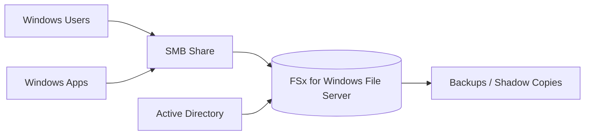
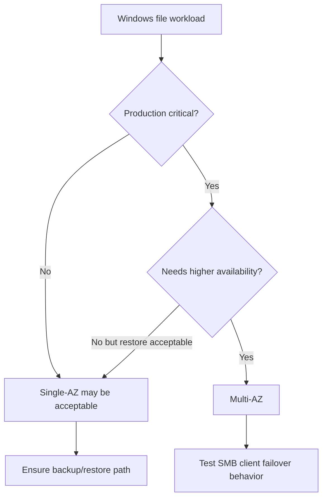
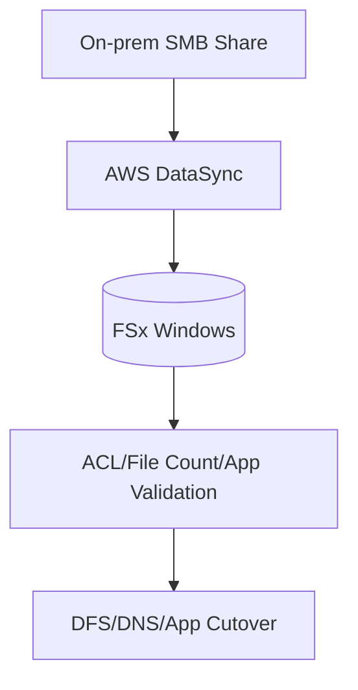

# Part 057 — FSx for Windows File Server

FSx for Windows File Server exists because Windows file workloads are not just "files."

They are SMB shares, Active Directory identities, NTFS ACLs, Windows file locks, drive mappings, DFS namespaces, Windows backup expectations, user home directories, departmental shares, and legacy applications that expect Windows Server file semantics.

If the workload says:

```text
\\fileserver\share
```

that is already an architecture signal.

Amazon FSx for Windows File Server provides fully managed Windows file systems accessible using SMB, with integration into Microsoft Active Directory. It supports Windows-native file system features such as user quotas, end-user file restore through shadow copies, access control lists, and administrative operations familiar to Windows environments.

This part goes deep into production design: when to choose FSx for Windows, how to reason about AD/SMB/ACLs, how to design deployment type and throughput, how to migrate data, and how to debug real incidents.

---

## 1. Problem yang Diselesaikan

Part ini menjawab:

- kapan FSx for Windows File Server tepat
- mengapa SMB/AD/Windows ACL adalah storage requirement, bukan detail kecil
- bagaimana Single-AZ vs Multi-AZ memengaruhi availability
- bagaimana memilih SSD vs HDD storage
- bagaimana throughput capacity memengaruhi performance
- bagaimana Windows ACL dan share permission bekerja sebagai layered security
- bagaimana shadow copies berbeda dari backup
- bagaimana backup/restore/migration dirancang
- bagaimana memakai DFS namespace untuk cutover dan abstraction
- bagaimana menangani permission denied, slow SMB share, AD issue, backup issue, dan file lock issue
- bagaimana membuat production checklist untuk Windows file workload

---

## 2. Mental Model

### 2.1 FSx Windows is a managed Windows file server



The file system is not just storage. It is joined to an Active Directory domain and enforces Windows identity and permissions.

The core runtime path:

```text
Windows client/app -> SMB -> FSx Windows file server -> NTFS permissions -> file data
```

### 2.2 Identity is central

For FSx Windows, identity is not optional.

The design depends on:

- AWS Managed Microsoft AD or self-managed AD
- user and group identities
- service accounts
- computer objects
- DNS
- Kerberos/NTLM behavior
- trust relationship if resource forest pattern is used
- NTFS ACLs
- share permissions

If AD is broken, file access can be broken.

### 2.3 Share permission and NTFS ACL both matter

A user needs both layers to allow access:

```text
effective access = share permission ∩ NTFS permission
```

Common production mistake:

```text
Share allows Everyone Full Control.
NTFS ACL is supposed to protect everything.
```

This can be acceptable in some Windows designs, but only if NTFS ACLs are carefully managed and audited. For stronger defense, align share permission and NTFS ACL intent.

### 2.4 SMB is stateful

SMB clients maintain sessions, open handles, locks, oplocks/leases, and cached state.

That means operations can be affected by:

- client disconnect
- file lock held by another user/process
- stale session
- network interruption
- AD authentication issue
- failover event
- antivirus/indexing behavior
- backup/shadow copy activity
- client-side offline files/caching policy

### 2.5 Managed does not remove Windows operations

FSx manages the infrastructure, but you still own:

- share design
- ACL design
- AD integration
- user/group model
- migration validation
- backup retention
- shadow copy schedule
- client mount/mapping
- application compatibility
- performance sizing
- monitoring
- incident runbooks

---

## 3. When to Use FSx for Windows

### 3.1 Strong fit

Use FSx for Windows when the workload requires:

- SMB file share
- Windows-native compatibility
- Active Directory authentication
- NTFS ACLs
- Windows file locking semantics
- lift-and-shift Windows file server
- user home directories
- departmental shares
- Windows application shared storage
- Microsoft ecosystem integration
- DFS namespace integration
- end-user restore with shadow copies

### 3.2 Weak fit

Reconsider if:

- app is Linux-only and only needs NFS
- object API would work better
- data is analytics/data-lake oriented
- workload is HPC/ML high-throughput file access
- app needs local block storage/database
- team does not need Windows semantics
- AD dependency is undesirable

### 3.3 Decision table

| Requirement | FSx Windows? | Better alternative |
|---|---:|---|
| SMB + AD + ACL | Yes | FSx ONTAP SMB if ONTAP needed |
| Linux NFS shared mount | No | EFS / FSx OpenZFS / ONTAP |
| HPC parallel file | No | FSx for Lustre |
| Object archive/lifecycle | No | S3 |
| User home directories on Windows | Yes | FSx Windows |
| App file share for Windows service | Yes | FSx Windows |
| Data lake table storage | No | S3 + table/catalog |
| Single-host DB data | Usually no | EBS / managed DB |

---

## 4. Architecture Components

### 4.1 File system

Important choices:

- deployment type: Single-AZ or Multi-AZ
- storage type: SSD or HDD
- storage capacity
- throughput capacity
- Active Directory configuration
- subnet placement
- encryption
- backups
- maintenance window
- audit logging
- tags/cost owner

### 4.2 SMB share

A share is the client-facing path:

```text
\\fs-0123456789abcdef0.example.com\share
```

Shares can represent:

- departmental data
- application data
- home directories
- migration staging
- exports
- backup restore area

Share design should avoid one giant share for everything unless governance is clear.

### 4.3 Active Directory

FSx for Windows requires Active Directory integration.

Options:

- AWS Managed Microsoft AD
- self-managed Microsoft AD

Design questions:

- same account or shared services account?
- same VPC or peered/transit connectivity?
- DNS resolution path?
- security groups/firewall for domain controllers?
- service account permissions?
- OU for computer objects?
- resource forest isolation?
- trust relationship?
- disaster recovery for AD itself?

### 4.4 DNS and namespace

Clients need stable names.

Common patterns:

- direct FSx DNS name
- DNS alias
- DFS Namespace
- application config pointing to alias
- blue/green cutover with DNS/DFS

Avoid hardcoding physical file system DNS name everywhere if migration/failover is likely.

### 4.5 Backups and shadow copies

Backups protect file system recovery.

Shadow copies provide point-in-time copies for end-user restore and admin recovery, stored on the file system and included in backups. Shadow copies are not enabled by default; you must enable and schedule them.

Do not confuse:

```text
shadow copy = quick end-user restore on same file system
backup = recovery point stored outside file system
```

---

## 5. Deployment Types

### 5.1 Single-AZ

Single-AZ file systems are deployed within one Availability Zone.

Use when:

- cost sensitivity
- workload can tolerate AZ-level issue
- dev/test
- migration staging
- less critical shares
- application has other recovery path

Risks:

- AZ disruption impacts file system availability
- not ideal for critical multi-AZ applications
- clients in other AZs may incur cross-AZ latency/data transfer

### 5.2 Multi-AZ

Multi-AZ deployment provides higher availability by using a preferred and standby file server across Availability Zones with failover support.

Use when:

- production Windows shares
- critical line-of-business apps
- user directories
- high availability requirement
- maintenance/failure resilience matters

Considerations:

- cost
- failover behavior
- client reconnect behavior
- application tolerance to SMB session interruption
- backup/maintenance window
- AD/DNS dependency

### 5.3 Deployment decision



### 5.4 Failover testing

For Multi-AZ, test:

- open file behavior
- app reconnect
- mapped drive behavior
- service account access after failover
- DFS behavior
- long-running write operations
- client retry timeout
- monitoring alerts

High availability at the file system layer does not automatically mean zero application interruption.

---

## 6. Storage Type

### 6.1 SSD

SSD storage is intended for high-performance and latency-sensitive workloads.

Use for:

- database-like file workloads where supported
- media processing
- high active working set
- data analytics apps needing SMB
- latency-sensitive Windows apps
- many random operations

### 6.2 HDD

HDD storage is designed for broad file workloads where cost per GB matters more than latency.

Use for:

- home directories
- user and departmental shares
- content management
- large less-active data
- cost-sensitive file shares

Caution:

- HDD performance profile differs
- use SSD cache feature where appropriate/currently supported
- benchmark with real workload

### 6.3 Storage decision

Ask:

- latency requirement?
- random vs sequential?
- working set size?
- user interactive?
- file count?
- backup/restore window?
- throughput needs?
- cost per GB target?

Do not choose HDD only because it is cheaper. Choose it because workload fits.

---

## 7. Throughput and Performance

### 7.1 Throughput capacity

FSx Windows file systems have a throughput capacity that you configure. It determines important performance characteristics such as network throughput between the file server and clients, file server resources, and related throughput/IOPS capability.

AWS documentation describes performance scaling options and publishes maximum performance figures that vary by Region and configuration.

### 7.2 Performance dimensions

Performance is shaped by:

- throughput capacity
- storage type
- storage capacity
- file size distribution
- SMB client count
- active working set
- metadata operations
- locking contention
- antivirus/indexing behavior
- backup/shadow copy activity
- cross-AZ clients
- network bandwidth of clients

### 7.3 SMB workload types

| Workload | Bottleneck tendency |
|---|---|
| many users opening Office docs | metadata/locking/session |
| media processing | throughput |
| departmental share | mixed |
| home directories | metadata + small files |
| application config share | latency |
| build output share | metadata + write churn |
| database-like file workload | latency/IOPS; validate support |

### 7.4 Throughput sizing

Start from:

```text
required throughput = peak read/write MBps + margin
required IOPS = peak file operations + margin
client count = concurrent SMB sessions
```

Then choose throughput capacity and storage type.

Use CloudWatch metrics and Windows performance counters where available to validate.

### 7.5 Performance tuning

Practical actions:

- increase throughput capacity if file server is saturated
- choose SSD for latency-sensitive workloads
- reduce metadata-heavy directory scans
- fan out directories
- avoid millions of files in one directory
- use DFS namespace for scale-out across shares/file systems if needed
- separate noisy batch workload from interactive users
- avoid unnecessary antivirus scans on hot paths if policy allows
- optimize client SMB settings only with Windows expertise

### 7.6 Noisy neighbor

One FSx file system can serve many shares, but performance is shared.

Separate file systems when:

- finance share is critical
- batch export is heavy
- home directories are noisy
- backup/restore differs
- security boundary differs
- cost owner differs

---

## 8. Security Model

### 8.1 Active Directory groups

Use AD groups for access.

Pattern:

```text
GG-Finance-Read
GG-Finance-Modify
GG-Finance-Admins
```

Then assign ACLs to groups, not individual users.

### 8.2 Share permissions

Define share-level access intentionally.

Common strategy:

- share permission broad but NTFS ACL strict
- or share permission aligned with top-level group

Either way, document it.

### 8.3 NTFS ACL design

Use inheritance carefully.

Top-level:

```text
\\share\Finance
  Admins: Full Control
  Finance-Modify: Modify
  Finance-Read: Read
```

Avoid ACL chaos:

- deeply unique permissions per folder
- individual user ACEs everywhere
- broken inheritance without documentation
- orphaned SIDs from migration
- broad Everyone access

### 8.4 Administrative access

Restrict:

- share administration
- backup restore
- ACL modification
- file system configuration
- AD service account permissions
- audit log configuration
- DNS alias changes

### 8.5 Encryption

FSx for Windows supports encryption at rest and in transit. Design KMS key ownership and recovery. SMB encryption/in-transit behavior should be validated against client versions and requirements.

### 8.6 Auditing

FSx for Windows can audit end-user accesses of files, folders, and file shares. Enable auditing when required by compliance/security, but plan log volume and destination.

---

## 9. Shadow Copies

### 9.1 What shadow copies solve

Shadow copies help recover previous versions of files quickly.

Useful for:

- accidental user overwrite
- accidental delete
- end-user restore
- admin restore without full backup recovery

### 9.2 What shadow copies do not solve

They do not replace:

- backups
- cross-account recovery
- ransomware-resilient vault
- DR replication
- full file system restore
- legal retention
- backup restore test

They live on the file system and consume storage capacity for changed portions.

### 9.3 Shadow copy design

Decide:

- enabled or not
- schedule
- storage allocation
- user self-service restore policy
- admin restore process
- monitoring
- interaction with backup
- retention expectations

### 9.4 Failure mode

Shadow copy storage fills or schedule missing.

Symptoms:

- users cannot restore expected versions
- shadow copies are old/missing
- storage capacity pressure
- false sense of protection

Fix:

- enable and schedule deliberately
- monitor shadow storage
- communicate retention
- keep AWS Backup independent

---

## 10. Backup and Restore

### 10.1 Automatic and user-initiated backups

FSx supports automatic and user-initiated backups. Backups are incremental and designed for durable storage. Configure:

- backup window
- retention
- manual backup for major changes
- cross-region/account if required
- restore testing
- backup alarms

### 10.2 Restore model

Restore usually creates a new file system from backup.

Operational steps:

1. Select recovery point.
2. Restore to new file system.
3. Join/configure AD as needed.
4. Validate ACLs and shares.
5. Test application/user access.
6. Cut over via DNS/DFS or copy back selected data.
7. Keep old file system for rollback window.

### 10.3 Restore single file/folder

For quick user restore:

- shadow copies may solve it
- backup restore to staging file system may be needed
- copy selected data back
- preserve ACLs

### 10.4 Backup consistency

For application-consistent backups:

- coordinate with app
- quiesce writes if needed
- use VSS-aware expectations when supported
- validate restored app behavior

Do not assume file backup equals application transaction consistency.

---

## 11. Migration

### 11.1 Migration sources

Common sources:

- on-prem Windows file server
- self-managed EC2 Windows file server
- NAS appliance exporting SMB
- another FSx file system
- legacy departmental shares

### 11.2 Migration tools

Options:

- AWS DataSync for SMB/NFS migrations
- Robocopy for Windows-oriented copies
- native backup/restore
- storage vendor migration tools
- DFS namespace cutover
- phased migration by share/department

### 11.3 Migration planning

Plan:

- share inventory
- size and file count
- ACL complexity
- owner/group mapping
- orphaned SIDs
- long paths
- open files
- incremental sync
- cutover freeze
- validation
- rollback
- user communication

### 11.4 DataSync pattern



### 11.5 Robocopy pattern

For Windows migrations, Robocopy can preserve ACLs and metadata when configured correctly.

But be careful:

- retry settings
- open files
- long paths
- ACL preservation
- audit logs
- incremental pass
- final cutover

### 11.6 Cutover

Use DFS Namespace or DNS alias where possible.

Avoid updating hundreds of client configs manually.

Cutover checklist:

- freeze writes
- final sync
- validate file count/ACLs
- switch namespace
- test users/apps
- monitor
- keep source read-only for rollback

---

## 12. Operations

### 12.1 Monitoring

Track:

- storage capacity used
- throughput utilization
- IOPS
- client connections
- file server CPU/memory if exposed
- disk throughput/latency metrics
- backups success/failure
- shadow copy state
- AD connectivity
- SMB errors
- audit log delivery
- free storage
- top shares by growth
- denied access count from app logs/security logs

### 12.2 Capacity management

Watch:

- storage capacity
- shadow copy storage usage
- growth rate
- backup size
- user quotas
- large file growth
- temp/export directories
- orphaned data

FSx for Windows storage capacity can be increased. Plan capacity increases before emergency.

### 12.3 Share inventory

Maintain:

```yaml
share:
  name: Finance
  path: D:\Shares\Finance
  owner: finance-it
  adGroups:
    read: GG-Finance-Read
    modify: GG-Finance-Modify
  backupPolicy: daily-35d
  shadowCopies: enabled
  criticality: high
  migrationSource: onprem-fs01
  runbook: link
```

### 12.4 Maintenance windows

Schedule:

- backups
- throughput/storage changes
- patch/maintenance events
- migration syncs
- antivirus/indexing windows
- shadow copy schedule

Coordinate with business hours.

---

## 13. Common Failure Modes

### 13.1 Access denied

Causes:

- user not in AD group
- Kerberos ticket stale
- share permission denies
- NTFS ACL denies
- explicit deny ACE
- broken inheritance
- orphaned SID after migration
- DFS points to wrong target
- service account changed

Runbook:

1. Identify user/service account.
2. Check group membership.
3. Check share permission.
4. Check NTFS ACL effective access.
5. Check path inheritance.
6. Check AD trust/DNS.
7. Check recent ACL migration/change.
8. Test with known-good admin.

### 13.2 File locked

Causes:

- user has file open
- app holds handle
- stale SMB session
- antivirus/indexer
- backup/shadow process
- crashed process/session

Runbook:

1. Identify open handle/session.
2. Confirm business impact.
3. Ask user/app to close if possible.
4. Force close only with approval.
5. Investigate recurring lock pattern.
6. Redesign workflow if file used as coordination primitive.

### 13.3 Slow share

Causes:

- throughput capacity saturated
- HDD storage not fit
- too many small files
- directory listing huge folder
- cross-AZ/client network
- AD/auth latency
- backup/shadow copy activity
- antivirus scanning
- noisy neighbor workload

Runbook:

1. Identify affected share/path.
2. Check operation type.
3. Check throughput/IOPS metrics.
4. Check file count/directory size.
5. Check client network.
6. Check AD health.
7. Increase throughput or split workload.
8. Redesign layout.

### 13.4 AD issue

Symptoms:

- users cannot authenticate
- new connections fail
- Kerberos errors
- DNS failures

Runbook:

1. Check AD domain controllers.
2. Check DNS resolution.
3. Check security groups/routes.
4. Check FSx AD status.
5. Check service account/computer object.
6. Check trust relationship.
7. Escalate to identity team.

### 13.5 Backup missing

Causes:

- backup disabled
- retention too short
- backup job failed
- wrong file system
- recovery point deleted
- backup window missed

Runbook:

1. Check backup jobs.
2. Check recovery points.
3. Check FSx backup settings.
4. Check AWS Backup if used.
5. Run on-demand backup.
6. Restore test.
7. Alert owner if RPO breached.

### 13.6 Shadow copy expected but absent

Causes:

- not enabled
- schedule not configured
- storage limit reached
- retention shorter than user expected
- file changed before shadow copy

Runbook:

1. Check shadow copy config.
2. Check schedule.
3. Check storage allocation.
4. Use backup restore if needed.
5. Update user expectations.

---

## 14. Runbooks

### 14.1 Slow SMB performance

1. Confirm client, share, path, operation.
2. Check if issue is read, write, open, list, lock.
3. Check FSx throughput metrics.
4. Check storage type SSD/HDD.
5. Check throughput capacity.
6. Check client network/AZ.
7. Check directory file count.
8. Check AD/auth errors.
9. Check backup/shadow copy/AV schedule.
10. Scale throughput or split workload.

### 14.2 Restore deleted file

1. Try previous versions/shadow copy if enabled.
2. If unavailable, identify backup recovery point.
3. Restore backup to new/staging FSx.
4. Copy file/folder back with ACLs preserved.
5. Validate user access.
6. Record incident.
7. Adjust shadow/backup policy if gap found.

### 14.3 Migrate share

1. Inventory source share.
2. Create FSx target and AD integration.
3. Create share and baseline ACL.
4. Run initial DataSync/Robocopy.
5. Validate sample.
6. Run incremental syncs.
7. Freeze source writes.
8. Final sync.
9. Switch DFS/DNS.
10. Test users/apps.
11. Keep source read-only for rollback.

### 14.4 Permission drift

1. Identify changed ACL path.
2. Compare to baseline/inheritance.
3. Identify actor/change time from audit logs if enabled.
4. Restore ACL from known template or backup.
5. Re-test access.
6. Add change control or audit alert.

### 14.5 Capacity pressure

1. Identify top shares/directories.
2. Check shadow copy storage.
3. Check temp/export folders.
4. Notify owners.
5. Expand capacity if needed.
6. Clean only owner-approved disposable data.
7. Add quota/lifecycle/process fix.

---

## 15. Terraform Skeleton

### 15.1 FSx Windows baseline

```hcl
resource "aws_fsx_windows_file_system" "finance" {
  storage_capacity    = 2048
  subnet_ids          = var.subnet_ids
  throughput_capacity = 128

  deployment_type = "MULTI_AZ_1"
  preferred_subnet_id = var.preferred_subnet_id

  storage_type = "SSD"

  active_directory_id = var.aws_managed_ad_id

  automatic_backup_retention_days = 35
  daily_automatic_backup_start_time = "05:00"
  weekly_maintenance_start_time     = "7:06:00"

  tags = {
    Service     = "finance-share"
    Environment = "prod"
    DataClass   = "windows-files"
  }
}
```

Validate attribute names and supported values against current provider version.

### 15.2 Security group concept

```hcl
resource "aws_security_group_rule" "allow_smb_from_windows_clients" {
  type                     = "ingress"
  security_group_id        = aws_security_group.fsx.id
  source_security_group_id = aws_security_group.windows_clients.id
  from_port                = 445
  to_port                  = 445
  protocol                 = "tcp"
}
```

### 15.3 DFS namespace pointer

Conceptual:

```text
\\corp.example.com\shares\finance -> \\fsx-dns-name\share
```

Use DFS to reduce future cutover pain.

---

## 16. Design Checklist

### 16.1 Workload fit

- [ ] SMB required.
- [ ] AD identity required.
- [ ] Windows ACLs required.
- [ ] File locking expectations known.
- [ ] Client OS versions supported.
- [ ] Application compatibility tested.
- [ ] EFS/S3/FSx alternatives considered.

### 16.2 Architecture

- [ ] Single-AZ/Multi-AZ chosen intentionally.
- [ ] SSD/HDD chosen from workload.
- [ ] Throughput capacity sized.
- [ ] Storage capacity sized.
- [ ] AD integration designed.
- [ ] DNS/DFS strategy exists.
- [ ] Security groups restrict SMB.
- [ ] Backup retention configured.
- [ ] Shadow copy policy decided.
- [ ] Audit logging decision documented.

### 16.3 Security

- [ ] AD groups, not individual users, drive ACLs.
- [ ] Share permissions documented.
- [ ] NTFS ACL inheritance designed.
- [ ] Admin access restricted.
- [ ] Audit logs enabled where needed.
- [ ] Encryption requirements met.
- [ ] Service accounts least-privilege.
- [ ] Orphaned SID migration checked.

### 16.4 Operations

- [ ] Performance dashboard exists.
- [ ] Backup restore tested.
- [ ] Shadow restore tested if enabled.
- [ ] Migration runbook exists.
- [ ] Permission incident runbook exists.
- [ ] File lock runbook exists.
- [ ] Capacity growth alarm exists.
- [ ] AD dependency runbook exists.

---

## 17. Mini Case Study — Finance Department File Share

### 17.1 Requirement

Finance team has an on-prem Windows file server:

```text
\\corp\finance
```

Requirements:

- AD group-based access
- NTFS ACL preservation
- user self-service previous versions
- daily backups
- low business-hour latency
- minimal user path change
- rollback possible during migration

### 17.2 Design

- FSx for Windows Multi-AZ
- SSD storage for latency-sensitive active files
- throughput capacity sized from file server metrics
- AWS Managed Microsoft AD or trusted self-managed AD
- DFS namespace:

```text
\\corp\shares\finance
```

- DataSync or Robocopy migration preserving ACLs
- shadow copies enabled with schedule
- backups retained 35 days
- audit logging enabled for sensitive folders
- source file server read-only during rollback window

### 17.3 Invariants

```text
AD groups are permission authority.
DFS namespace is client abstraction.
FSx backup is recovery authority.
Shadow copies are convenience restore, not backup replacement.
```

---

## 18. Mini Case Study — File Lock Incident

### 18.1 Symptom

A nightly batch job fails:

```text
Cannot write report.xlsx: file in use
```

### 18.2 Investigation

- analyst left Excel file open
- SMB lock prevented overwrite
- job wrote directly to final path
- no temp/rename pattern
- no retry or notification

### 18.3 Fix

- job writes `report.xlsx.tmp`
- validates output
- attempts atomic replacement during maintenance window
- if lock exists, job writes versioned output and notifies owner
- old file retained until user closes
- business process updated

### 18.4 Invariant

```text
Shared Windows files can be locked by users.
Batch workflows must handle lock contention as normal behavior.
```

---

## 19. Summary

FSx for Windows File Server is the right choice when Windows file semantics are the requirement.

It gives managed SMB file storage with AD integration, Windows ACLs, backups, and Windows-compatible operations. But the production design must include:

- AD/DNS/DFS architecture
- Single-AZ vs Multi-AZ choice
- SSD/HDD and throughput sizing
- share and NTFS ACL design
- backup and shadow copy strategy
- migration/cutover plan
- performance and capacity monitoring
- file lock and permission runbooks

The core rule:

> Treat SMB, AD, and NTFS ACLs as first-class architecture, not implementation details.

Next, we go deep into FSx for Lustre: high-performance file storage for HPC/ML/data processing, S3 integration, scratch vs persistent, throughput sizing, import/export, job patterns, and operational runbooks.

---

## References

- Amazon FSx for Windows File Server User Guide — What is FSx for Windows File Server?: https://docs.aws.amazon.com/fsx/latest/WindowsGuide/what-is.html
- Amazon FSx for Windows File Server User Guide — Performance: https://docs.aws.amazon.com/fsx/latest/WindowsGuide/performance.html
- Amazon FSx for Windows File Server User Guide — Availability and durability: https://docs.aws.amazon.com/fsx/latest/WindowsGuide/high-availability-multiAZ.html
- Amazon FSx for Windows File Server User Guide — Working with Active Directory: https://docs.aws.amazon.com/fsx/latest/WindowsGuide/auth-access.html
- Amazon FSx for Windows File Server User Guide — Using AWS Managed Microsoft AD: https://docs.aws.amazon.com/fsx/latest/WindowsGuide/fsx-aws-managed-ad.html
- Amazon FSx for Windows File Server User Guide — Protecting your data with backups: https://docs.aws.amazon.com/fsx/latest/WindowsGuide/using-backups.html
- Amazon FSx for Windows File Server User Guide — Protecting your data with shadow copies: https://docs.aws.amazon.com/fsx/latest/WindowsGuide/shadow-copies-fsxW.html
- Amazon FSx for Windows File Server User Guide — Managing storage configuration: https://docs.aws.amazon.com/fsx/latest/WindowsGuide/managing-storage-configuration.html
- AWS DataSync User Guide — What is AWS DataSync?: https://docs.aws.amazon.com/datasync/latest/userguide/what-is-datasync.html
