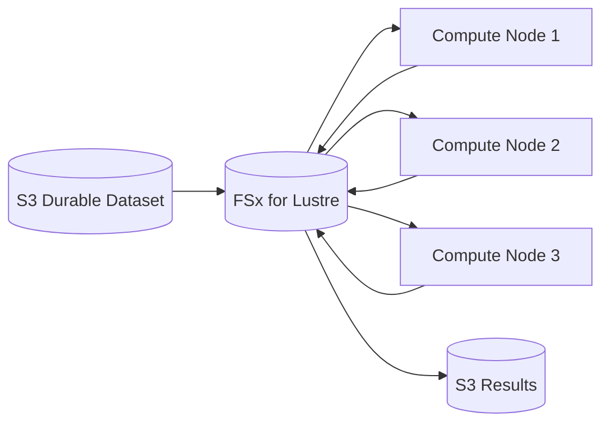
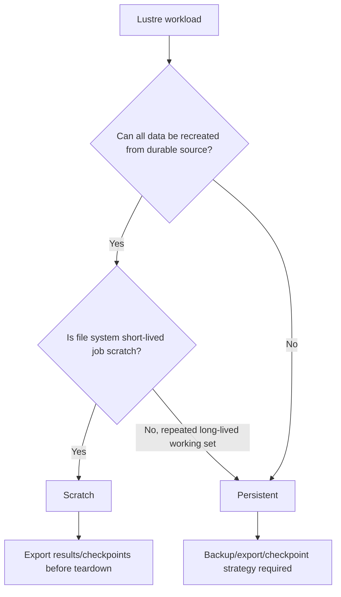
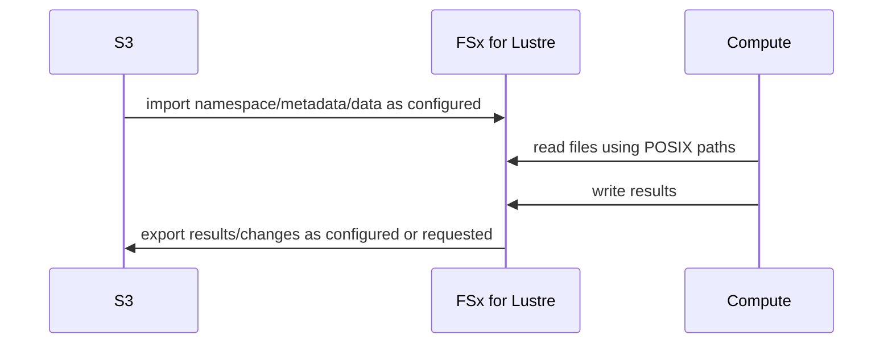
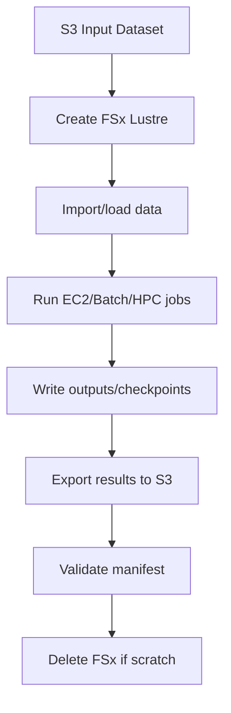
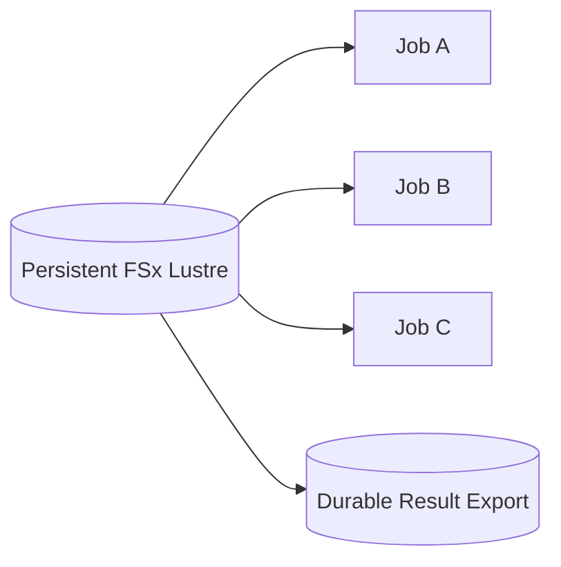

# Part 058 — FSx for Lustre HPC and ML File Systems

FSx for Lustre is not a general shared folder.

It is a high-performance parallel file system.

That distinction matters.

Lustre is built for workloads where many compute clients need fast access to shared files at high throughput and high parallelism. Think:

- HPC simulations
- ML training
- genomics
- financial risk modeling
- electronic design automation
- media rendering
- seismic processing
- large-scale data preprocessing
- S3-backed compute bursts

Amazon FSx for Lustre gives you a managed Lustre file system integrated with AWS compute and deeply integrated with Amazon S3. It can present S3 objects as files, load data into the file system, run compute-intensive jobs, and export results back to S3.

This part is about using Lustre as an accelerator for compute—not as a magic durable bucket, not as a casual NAS share, and not as a database.

---

## 1. Problem yang Diselesaikan

Part ini menjawab:

- kapan FSx for Lustre tepat
- apa beda scratch dan persistent file systems
- bagaimana storage classes SSD, Intelligent-Tiering, dan HDD dipilih
- bagaimana throughput berhubungan dengan storage capacity dan deployment choice
- bagaimana integrasi S3/data repository association bekerja secara mental model
- bagaimana membuat pipeline S3 -> Lustre -> compute -> S3
- bagaimana menangani checkpointing dan result export
- bagaimana menghindari small-file metadata bottleneck
- bagaimana mengelola cost file system high-performance
- bagaimana runbook untuk slow job, import/export issue, full filesystem, client mount issue, dan failed checkpoint

---

## 2. Mental Model

### 2.1 Lustre is a parallel file system for compute fleets



S3 remains excellent durable object storage.

FSx for Lustre provides high-performance file access near compute.

The common pattern:

```text
durable dataset in S3
high-speed processing in Lustre
durable results exported back to S3
```

### 2.2 Lustre is about parallelism

A single-threaded app reading one small file may not showcase Lustre.

Lustre shines when:

- many clients read/write concurrently
- files are large or access is parallelized
- workload is throughput-heavy
- compute fleet needs shared high-speed namespace
- job runtime depends heavily on data access speed

### 2.3 Source-of-truth must be explicit

FSx for Lustre can be temporary scratch, persistent working storage, or linked to S3.

For every workload, define:

```text
source of truth = ?
checkpoint authority = ?
result authority = ?
what can be lost and recomputed?
what must be exported?
```

Without this, job success may depend on data that disappears with file system lifecycle or failure.

### 2.4 S3 integration changes workflow shape

With S3 data repository integration:

- objects in S3 can appear as files in Lustre
- data can be imported/loaded for high-performance access
- results can be exported back to S3
- metadata and data movement have asynchronous aspects
- not every file operation is automatically a business commit

Application still needs manifest/job state.

---

## 3. When to Use FSx for Lustre

### 3.1 Strong fit

Use when:

- HPC or ML workload needs high-throughput shared file access
- dataset is large and compute-intensive
- many EC2 instances need parallel file access
- S3 is durable dataset source
- POSIX-like file path access required by tools
- job performance is I/O bound
- temporary high-performance file system can accelerate processing
- checkpoints/results need structured export

### 3.2 Weak fit

Reconsider when:

- workload is Windows SMB share
- simple Linux NFS shared folder is enough
- app is metadata-heavy tiny-file web app
- object API is acceptable
- file system is long-lived user home directory
- workload needs enterprise NAS features
- database wants low-latency block storage
- team will leave expensive file system idle

### 3.3 Decision table

| Requirement | FSx for Lustre? |
|---|---:|
| GPU training reads large dataset | Strong |
| HPC simulation scratch | Strong |
| S3-backed genomics processing | Strong |
| Windows departmental share | No |
| WordPress uploads | Usually no |
| Legacy SMB app | No |
| Simple NFS app share | Usually EFS first |
| Enterprise ONTAP features | No |
| Durable object archive | S3 |

---

## 4. Deployment Options

### 4.1 Scratch

Scratch file systems are intended for temporary storage and shorter-term processing.

Use when:

- data can be regenerated
- source is S3 or another durable store
- job output will be exported
- file system lifetime matches compute campaign
- lower-cost/high-throughput temporary workload
- loss of file server/data can be tolerated by rerun

Caution:

- scratch is not for the only copy of important data
- checkpoint strategy must export or tolerate loss
- job failure/retry must be designed

### 4.2 Persistent

Persistent file systems are intended for longer-term storage and workloads.

Use when:

- file system data must survive longer
- checkpoint data matters
- repeated jobs use same working set
- storage continuity matters
- higher durability/availability than scratch is required
- workload cannot simply regenerate all intermediate data

Persistent does not mean "no backup needed." It means more durable than scratch deployment, not a complete data protection strategy.

### 4.3 Scratch vs persistent decision



### 4.4 Failure-domain thinking

For scratch:

```text
node/job failure -> rerun from durable source
file system failure -> rerun/reimport
```

For persistent:

```text
file system failure -> service handles replacement/replication depending configuration
app still needs backup/export for logical corruption
```

---

## 5. Storage Classes

### 5.1 SSD

SSD storage class is optimized for workloads with small, random file operations and high-performance requirements. AWS documentation describes SSD as providing consistent low-latency access and very high throughput capabilities.

Use for:

- latency-sensitive HPC/ML
- random I/O
- small/random operations
- high IOPS
- active training datasets
- checkpoints requiring fast write

### 5.2 HDD

HDD storage class is useful for throughput-oriented workloads where cost per TB matters and latency/random IOPS requirements are lower.

Use for:

- large sequential reads/writes
- cost-sensitive large datasets
- throughput-heavy workloads tolerant of HDD profile

Caution:

- metadata/random I/O may suffer
- choose SSD cache options if appropriate/current
- benchmark real job

### 5.3 Intelligent-Tiering

FSx for Lustre Intelligent-Tiering provides elastic, cost-optimized storage for certain workloads with changing access patterns.

Use when:

- dataset size/access pattern changes
- cost optimization matters
- workload fits Intelligent-Tiering performance model
- operational simplicity of tiering is desired

Caution:

- understand performance characteristics
- validate with workload
- monitor tier behavior and job latency

### 5.4 Storage class decision

| Workload | Candidate |
|---|---|
| random small files + latency-sensitive | SSD |
| high-throughput large sequential data | HDD or SSD depending SLA |
| changing access, cost-sensitive | Intelligent-Tiering |
| short-lived fastest job scratch | Scratch SSD commonly considered |
| persistent large dataset | Persistent SSD/HDD/Intelligent-Tiering depending access |

Always verify current supported combinations of deployment type, storage class, throughput, and capacity.

---

## 6. S3 Data Repository Integration

### 6.1 Data repository association

A data repository association links an FSx for Lustre file system to an S3 bucket/prefix.

It lets workloads use file APIs while data lives durably in S3.

Conceptual flow:



### 6.2 Import model

Depending on configuration, S3 objects can be imported as file metadata, and file data may be loaded when accessed or through explicit import tasks.

Design questions:

- which S3 prefix?
- one-way import or export too?
- auto import?
- auto export?
- lazy load acceptable?
- pre-load required before job?
- how to handle changed S3 objects?
- how to handle deleted S3 objects?
- how to map object keys to file paths?

### 6.3 Export model

Results written to Lustre need export if S3 is durable destination.

Export strategy:

- automatic export for linked repository when configured
- explicit data repository task
- application copy/upload to S3
- manifest-based result commit

Do not terminate scratch FS before results/checkpoints are durably exported.

### 6.4 Manifest discipline

For job outputs:

```text
lustre: /jobs/job-123/attempt-2/output/part-0001
s3:     s3://bucket/results/job-123/attempt-2/part-0001
manifest: s3://bucket/results/job-123/attempt-2/_manifest.json
```

Job success should mean:

```text
outputs exported to durable destination
manifest committed
catalog/job state updated
```

### 6.5 S3 object layout matters

Bad S3 layout creates bad Lustre namespace:

```text
millions of tiny objects in one prefix
```

Lustre can accelerate file access, but metadata-heavy tiny-file datasets still need layout/compaction consideration.

---

## 7. Job Architecture Patterns

### 7.1 Batch compute campaign



Use for:

- periodic large jobs
- training campaigns
- simulations
- rendering

### 7.2 Persistent shared working set



Use when:

- repeated jobs use same dataset
- data staging cost is high
- checkpoints need continuity
- file system is long-lived

Add:

- backup/export
- lifecycle/cost review
- access control
- cleanup policy

### 7.3 S3 dataset acceleration

```text
S3 dataset version -> Lustre namespace -> training -> S3 output
```

Catalog stores:

```json
{
  "datasetVersion": "dataset-2026-07-06",
  "s3InputPrefix": "s3://ml-datasets/images/v17/",
  "fsxPath": "/datasets/images/v17/",
  "jobId": "train-991",
  "outputPrefix": "s3://ml-results/train-991/"
}
```

### 7.4 Checkpointing

Checkpoint options:

1. Write checkpoint to Lustre, export periodically to S3.
2. Write checkpoint directly to S3 if framework supports.
3. Write to Lustre for speed, then checkpoint sync job.
4. Use persistent Lustre if checkpoint continuity required.

Checkpoint invariant:

```text
A job can recover from compute/node/file-system failure within RPO using exported or persistent checkpoint.
```

### 7.5 Result commit

Do not declare job complete because output exists on Lustre.

Declare complete when:

- output files are finished
- export to durable destination complete
- checksum/size/manifest valid
- catalog/job state updated

---

## 8. Performance Engineering

### 8.1 Throughput sizing

FSx for Lustre throughput often scales with storage capacity and selected throughput-per-unit options. AWS documentation notes that increasing configured SSD/HDD storage capacity increases throughput capacity because throughput scales linearly with storage capacity for those file systems.

Sizing inputs:

- total dataset size
- active working set
- required read throughput
- required write throughput
- number of clients
- file size distribution
- metadata operations
- checkpoint size/frequency
- job wall-clock target
- import/export time

### 8.2 Client instance bandwidth

File system throughput is useless if clients cannot consume it.

Check:

- EC2 network bandwidth
- EBS/local disk if staging
- CPU decompress/parse
- number of parallel workers
- Lustre client config
- placement groups if needed
- AZ placement
- security group/network path

### 8.3 Parallelism

Lustre performs best when workloads parallelize.

Examples:

- many workers read different file ranges
- many files read concurrently
- distributed training data loader uses multiple workers
- simulation writes partitioned output

Bad:

- one process reads one file serially
- all nodes hammer one metadata directory
- one checkpoint file written by many processes without coordination

### 8.4 Metadata workload

Many tiny files can bottleneck metadata.

Mitigations:

- bundle small files
- use tar/shard formats
- use WebDataset/TFRecord/Parquet-style larger shards for ML where appropriate
- compaction
- directory fanout
- pre-create file lists/manifests
- avoid repeated directory walks during each epoch
- cache file index locally

### 8.5 Data loading for ML

Data loader best practices:

- shard dataset
- avoid per-sample tiny file open where possible
- use multiple workers
- prefetch
- cache metadata
- avoid global random directory walk
- make epoch file list deterministic
- monitor GPU idle time due to I/O

### 8.6 Checkpoint storm

If every worker writes huge checkpoint at once, file system and network can saturate.

Mitigation:

- stagger checkpoints
- checkpoint only rank 0 where framework supports
- write sharded checkpoints intentionally
- compress or delta checkpoint if appropriate
- export asynchronously
- monitor checkpoint duration

---

## 9. Cost Model

### 9.1 Cost dimensions

FSx for Lustre cost includes:

```text
provisioned storage
throughput/performance tier
backup/snapshot if applicable
data transfer
S3 import/export requests/data
idle file system time
compute waiting on I/O
orphaned file systems
```

### 9.2 Scratch economics

Scratch can be cost-effective when:

- file system lifetime is short
- data source is durable elsewhere
- recomputation acceptable
- results exported promptly
- file system deleted after job

Bad scratch economics:

- create scratch FS and leave idle
- store only copy of important checkpoints
- repeated reimport due to bad workflow
- no cleanup automation

### 9.3 Persistent economics

Persistent is better when:

- repeated jobs use same dataset
- staging time dominates
- checkpoints need continuity
- file system frequently used
- data must remain available

But monitor:

- idle time
- cold data
- overprovisioned capacity
- unnecessary snapshots/backups
- old checkpoints

### 9.4 Cost per successful job

For compute workloads, optimize:

```text
cost_per_successful_job =
    compute_cost
  + fsx_cost
  + s3_request/data_cost
  + import/export time cost
  + retry/recompute cost
```

Cheapest storage per GB is not always cheapest job.

---

## 10. Security and Access

### 10.1 Network

FSx for Lustre clients mount over the network.

Design:

- VPC/subnets
- security groups
- client access
- cluster placement
- routing
- on-prem connectivity if needed

### 10.2 POSIX permissions

Lustre uses POSIX-style file permissions.

Design:

- UID/GID registry
- user/group mapping
- job user identity
- shared project directories
- scratch permissions
- result ownership
- cleanup permissions

### 10.3 S3 permissions

If using S3 repository integration:

- FSx service role permissions
- S3 bucket policy
- KMS if S3 encrypted
- source/destination prefix access
- cross-account considerations

### 10.4 Encryption

Design:

- encryption at rest
- encryption in transit where supported/required
- S3 bucket encryption
- KMS access for import/export
- backup encryption

### 10.5 Multi-tenant clusters

If multiple teams share FSx:

- project directories
- quotas if available/needed
- POSIX groups
- job scheduler integration
- cleanup ownership
- noisy-neighbor policy
- separate file systems for strong isolation

---

## 11. Operations and Observability

### 11.1 File system metrics

Track:

- storage used
- throughput
- metadata operation symptoms
- client count
- read/write throughput
- free capacity
- data repository task status
- import/export progress
- backup status if applicable
- failure events
- age of file system
- idle time

### 11.2 Job metrics

Track:

- job runtime
- data load time
- GPU/CPU utilization
- I/O wait
- read throughput
- write throughput
- checkpoint duration
- export duration
- result commit latency
- failed import/export tasks
- file count read
- average file size
- retry count

### 11.3 S3 integration metrics

Track:

- import task status
- export task status
- objects imported/exported
- bytes moved
- failed files
- S3 throttling/errors
- KMS errors
- data repository association health

### 11.4 Operational inventory

For every FSx Lustre file system:

```yaml
fileSystem:
  owner:
  purpose: training-campaign|hpc-scratch|persistent-working-set
  deployment: scratch|persistent
  storageClass:
  capacity:
  throughput:
  s3Input:
  s3Output:
  cleanupDate:
  checkpointPolicy:
  backupPolicy:
  runbook:
```

---

## 12. Runbooks

### 12.1 Job is slow

1. Check if job is CPU/GPU bound or I/O bound.
2. Check FSx read/write throughput.
3. Check client network bandwidth.
4. Check file size distribution.
5. Check metadata operations/directory walks.
6. Check S3 lazy-load/import behavior.
7. Check checkpoint timing.
8. Check noisy neighbor jobs.
9. Increase parallelism or capacity if appropriate.
10. Redesign dataset sharding/format.

### 12.2 File system full

1. Stop new job submissions if risk.
2. Identify top directories.
3. Classify data: input, checkpoint, output, temp.
4. Export results/checkpoints before deletion.
5. Delete only job-owned disposable data.
6. Increase capacity if persistent and justified.
7. Add cleanup policy.
8. Add capacity alarm.

### 12.3 S3 import issue

1. Check data repository association.
2. Check S3 bucket/prefix.
3. Check IAM/service role.
4. Check KMS permissions.
5. Check file/object naming.
6. Check import task status/errors.
7. Retry or create new task.
8. Validate file visibility on clients.

### 12.4 S3 export issue

1. Check export task or auto-export status.
2. Check destination S3 prefix permissions.
3. Check KMS/bucket policy.
4. Check files are closed/complete.
5. Check file count and size.
6. Retry failed export.
7. Validate output manifest in S3.
8. Do not delete FSx until export complete.

### 12.5 Client mount failure

1. Check Lustre client installed.
2. Check security group/network.
3. Check DNS/mount name.
4. Check subnet/AZ route.
5. Check file system status.
6. Check kernel/client compatibility.
7. Test from minimal EC2 in same subnet.
8. Review mount command/options.

### 12.6 Failed checkpoint recovery

1. Identify last valid checkpoint.
2. Check if checkpoint on FSx only or exported to S3.
3. Validate checkpoint completeness.
4. Resume job if framework supports.
5. If checkpoint missing/corrupt, restart from earlier checkpoint/source.
6. Adjust checkpoint export frequency.
7. Add manifest/checksum.

---

## 13. Terraform Skeleton

### 13.1 FSx for Lustre linked to S3 concept

```hcl
resource "aws_fsx_lustre_file_system" "training" {
  storage_capacity = 2400
  subnet_ids       = [var.subnet_id]

  deployment_type = "PERSISTENT_2"

  per_unit_storage_throughput = 250

  data_repository_configuration {
    import_path = "s3://ml-datasets/images-v17/"
    export_path = "s3://ml-results/training-runs/"
  }

  tags = {
    Service     = "ml-training"
    Environment = "prod"
    DataClass   = "derived-compute"
  }
}
```

Validate current provider/API support and preferred data repository association model. Many modern designs use explicit data repository associations and tasks.

### 13.2 Security group

```hcl
resource "aws_security_group_rule" "allow_lustre_clients" {
  type                     = "ingress"
  security_group_id        = aws_security_group.fsx_lustre.id
  source_security_group_id = aws_security_group.compute.id
  from_port                = 988
  to_port                  = 988
  protocol                 = "tcp"
}
```

Additional Lustre ports and rules can be required depending on client/file system behavior; validate with current AWS docs.

### 13.3 Mount concept

```bash
sudo mkdir -p /fsx

sudo mount -t lustre \
  -o relatime,flock \
  fs-0123456789abcdef0.fsx.us-east-1.amazonaws.com@tcp:/fsx \
  /fsx
```

Use the mount command provided by the FSx console/API for your file system.

---

## 14. Data Layout Patterns

### 14.1 Input dataset

```text
/fsx/datasets/images-v17/shard-00001.tar
/fsx/datasets/images-v17/shard-00002.tar
```

Better than:

```text
/fsx/datasets/images-v17/class-a/img000000001.jpg
...
millions of tiny files
```

when ML loader can consume shards.

### 14.2 Job working directory

```text
/fsx/jobs/job-991/attempt-001/
  logs/
  checkpoints/
  output/
```

### 14.3 Results

```text
/fsx/results/job-991/attempt-001/
  metrics.json
  model.tar
  _manifest.json
```

Exported to:

```text
s3://ml-results/job-991/attempt-001/
```

### 14.4 Checkpoints

```text
/fsx/checkpoints/job-991/epoch=010/
  rank-000.pt
  rank-001.pt
  manifest.json
```

Export or persist according to RPO.

---

## 15. Failure Modes

### 15.1 Treating scratch as durable

Symptom:

- job output lost when file system deleted/fails
- no S3 export
- no manifest

Fix:

- use persistent or export results
- checkpoint to durable destination
- job success waits for export

### 15.2 Millions of tiny files

Symptom:

- low throughput, high metadata overhead
- GPU idle
- directory walk slow

Fix:

- shard/pack data
- manifest file lists
- precompute indexes
- compact
- reduce per-sample open

### 15.3 Lazy-load surprise

Symptom:

- first epoch slow
- files appear but read stalls
- S3 import not warmed

Fix:

- pre-load data
- run import task
- warmup job
- monitor import/data access
- adjust job timing

### 15.4 Export forgotten

Symptom:

- results exist on FSx
- S3 output missing
- FSx deleted or inaccessible

Fix:

- export task required before job success
- manifest in S3
- cleanup waits for export status
- dashboard export lag

### 15.5 Idle persistent file system cost

Symptom:

- expensive FSx running with no jobs

Fix:

- owner/cost dashboard
- scheduled teardown for scratch
- persistent justification review
- data export and recreate workflow
- automated idle alarms

### 15.6 Shared checkpoint storm

Symptom:

- all workers checkpoint at once
- I/O spikes
- job stalls

Fix:

- stagger checkpoint
- sharded checkpoint design
- reduce frequency
- monitor checkpoint duration
- use framework best practices

---

## 16. Game Days

### Scenario 1 — Scratch FS deletion before export

Expected:

- job not marked successful
- results missing from S3 detected
- rerun from durable input possible
- runbook prevents premature teardown

### Scenario 2 — Import failure due to KMS

Expected:

- S3/KMS access error visible
- job blocked before compute waste
- permissions fixed
- import retry succeeds

### Scenario 3 — GPU idle due to small files

Expected:

- metrics show I/O bottleneck
- dataset sharding improves GPU utilization
- file count dashboard catches issue

### Scenario 4 — Checkpoint recovery

Expected:

- last valid checkpoint identified
- resumed job works
- corrupt checkpoint ignored
- checkpoint export policy updated

### Scenario 5 — Persistent FS idle cost

Expected:

- idle alarm triggers
- owner decides retain/export/delete
- cost dashboard updated

---

## 17. Design Checklist

### 17.1 Workload fit

- [ ] HPC/ML/data-processing workload requires high-performance file access.
- [ ] S3/EFS/FSx alternatives considered.
- [ ] Dataset size and file count known.
- [ ] File size distribution known.
- [ ] Access pattern measured.
- [ ] Compute client count known.
- [ ] Required throughput known.
- [ ] Metadata workload understood.
- [ ] Source-of-truth boundary defined.

### 17.2 Deployment

- [ ] Scratch vs persistent chosen intentionally.
- [ ] Storage class chosen intentionally.
- [ ] Capacity/throughput sized.
- [ ] S3 data repository integration designed.
- [ ] Import/warmup strategy exists.
- [ ] Export/result strategy exists.
- [ ] Checkpoint strategy exists.
- [ ] Cleanup/teardown policy exists.
- [ ] Cost owner defined.

### 17.3 Operations

- [ ] Mount runbook exists.
- [ ] Import/export runbook exists.
- [ ] Slow job runbook exists.
- [ ] Full file system runbook exists.
- [ ] Checkpoint recovery tested.
- [ ] S3/KMS permissions tested.
- [ ] Metrics dashboard exists.
- [ ] Idle cost alarm exists.

### 17.4 Correctness

- [ ] Job success waits for durable result commit.
- [ ] Manifest records input dataset version.
- [ ] Checkpoints are recoverable within RPO.
- [ ] Scratch data can be recreated.
- [ ] Persistent data has backup/export plan.
- [ ] Failed attempts cleaned safely.
- [ ] No result depends only on unexported scratch.

---

## 18. Mini Case Study — GPU Training Pipeline

### 18.1 Initial design

Training reads 20 million JPEGs directly from S3, one object per sample.

Symptoms:

- GPU utilization 35%
- high S3 GET rate
- training stalls
- data loader spends time opening tiny objects
- retries slow epochs

### 18.2 Improved design

- dataset compacted into larger shards
- S3 stores durable shards and manifest
- FSx for Lustre imports dataset
- GPU fleet mounts `/fsx`
- data loader reads shard files with parallel workers
- checkpoints written to `/fsx/checkpoints`
- every N epochs, checkpoint exported to S3
- final model exported to S3 with manifest
- FSx deleted after training campaign if scratch

### 18.3 Invariants

```text
S3 manifest defines dataset version.
FSx accelerates training.
S3 output manifest defines successful result.
```

### 18.4 Result

- GPU utilization increases
- S3 request rate decreases
- dataset version is reproducible
- training output survives FSx teardown
- job cost is measured per successful model

---

## 19. Mini Case Study — Genomics Batch Processing

### 19.1 Requirement

A genomics pipeline processes large input files and writes intermediate files repeatedly.

Needs:

- high-throughput shared file system
- many EC2 workers
- durable input in S3
- output returned to S3
- intermediate files can be recomputed
- checkpoints useful for long jobs

### 19.2 Design

- FSx for Lustre scratch for intermediate processing
- S3 input repository association
- pre-load inputs before job
- job-specific working directory
- output exported to S3
- manifest validates outputs
- checkpoints exported every stage boundary
- FSx torn down after pipeline completion

### 19.3 Invariant

```text
Intermediate data is disposable.
Stage boundary outputs are durable.
```

---

## 20. Summary

FSx for Lustre is a high-performance compute file system.

Use it when:

- compute fleet needs parallel file access
- S3 dataset needs file-system acceleration
- HPC/ML/data processing is I/O-bound
- job runtime justifies high-performance storage cost

Design carefully:

- scratch vs persistent
- SSD/HDD/Intelligent-Tiering
- S3 import/export
- dataset layout
- small-file mitigation
- checkpointing
- result commit
- cleanup
- cost dashboard
- runbooks

The core rule:

> FSx for Lustre should accelerate compute. Durable truth should be defined explicitly—usually in S3, manifest/catalog, or a persistent/backup strategy.

Next, we continue FSx with FSx for NetApp ONTAP and FSx for OpenZFS: enterprise NAS semantics, multiprotocol access, snapshots/clones, migration, and operational trade-offs.

---

## References

- Amazon FSx for Lustre User Guide — What is Amazon FSx for Lustre?: https://docs.aws.amazon.com/fsx/latest/LustreGuide/what-is.html
- Amazon FSx for Lustre User Guide — Deployment and storage class options: https://docs.aws.amazon.com/fsx/latest/LustreGuide/using-fsx-lustre.html
- Amazon FSx for Lustre User Guide — Linking your file system to an S3 bucket: https://docs.aws.amazon.com/fsx/latest/LustreGuide/create-dra-linked-data-repo.html
- Amazon FSx for Lustre User Guide — Overview of data repositories: https://docs.aws.amazon.com/fsx/latest/LustreGuide/overview-dra-data-repo.html
- Amazon FSx for Lustre User Guide — Managing storage capacity: https://docs.aws.amazon.com/fsx/latest/LustreGuide/managing-storage-capacity.html
- Amazon FSx for Lustre User Guide — Performance: https://docs.aws.amazon.com/fsx/latest/LustreGuide/performance.html
- Amazon FSx API Reference — DataRepositoryAssociation: https://docs.aws.amazon.com/fsx/latest/APIReference/API_DataRepositoryAssociation.html
- Amazon FSx for Lustre User Guide — Mounting from Amazon EC2: https://docs.aws.amazon.com/fsx/latest/LustreGuide/mounting-from-ec2.html
