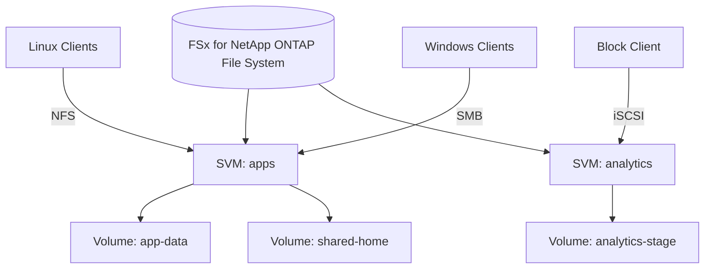
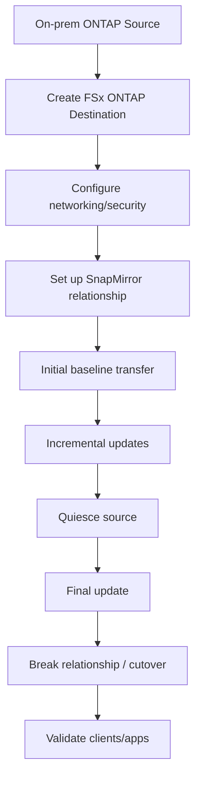

# Part 059 — FSx for NetApp ONTAP Enterprise NAS

FSx for NetApp ONTAP is not "EFS with more features."

It is managed ONTAP.

That matters because ONTAP is not just a file protocol. It is an enterprise storage operating model: storage virtual machines, volumes, multiprotocol access, snapshots, clones, tiering, replication, storage efficiencies, export policies, SMB shares, NFS exports, iSCSI LUNs, and migration paths familiar to NetApp environments.

If your workload needs those semantics, FSx for ONTAP can be extremely powerful.

If your workload only needs a simple shared NFS mount, ONTAP can be unnecessary operational complexity.

This part explains when ONTAP is the right abstraction, how to design it, how to migrate to it, how to operate it, and how to avoid turning enterprise NAS features into enterprise NAS debt.

---

## 1. Problem yang Diselesaikan

Part ini menjawab:

- kapan memilih FSx for NetApp ONTAP dibanding EFS, FSx Windows, FSx OpenZFS, FSx Lustre, S3, atau EBS
- apa itu Storage Virtual Machine/SVM
- apa itu volume, FlexVol, dan FlexGroup
- bagaimana multiprotocol NFS/SMB/iSCSI didesain
- bagaimana SSD tier dan capacity pool tier bekerja sebagai mental model
- bagaimana storage efficiency, compression, deduplication, snapshots, clones, dan tiering dipakai
- bagaimana SnapMirror/migration dari on-prem NetApp ke FSx ONTAP
- bagaimana backup/restore dan disaster recovery dipikirkan
- bagaimana mengelola security: VPC, export policy, SMB ACL, AD, ONTAP users, KMS
- bagaimana menyusun runbook performance, permission, tiering, capacity, snapshot, migration, dan restore

---

## 2. Mental Model

### 2.1 FSx ONTAP is enterprise NAS as a managed AWS service



The file system contains storage virtual machines.

SVMs contain volumes.

Clients access volumes using protocols.

### 2.2 ONTAP is a data management plane

ONTAP features are most valuable when you need:

- snapshots
- clones
- multiprotocol NAS
- enterprise migration compatibility
- tiering
- storage efficiency
- replication
- volume-level operations
- NetApp operational familiarity
- hybrid cloud continuity
- enterprise storage governance

If none of those matter, choose simpler storage.

### 2.3 Separate file system, SVM, and volume concerns

Do not flatten the model.

| Layer | Owns |
|---|---|
| File system | AWS infrastructure, throughput, SSD capacity, HA pairs, network endpoints |
| SVM | protocol endpoint, identity boundary, NFS/SMB/iSCSI namespace |
| Volume | data container, size, tiering policy, snapshots, junction path |
| Share/export/LUN | client-facing access surface |
| Directory/files | application data |

Good architecture chooses boundaries intentionally.

### 2.4 Tiering is workload economics

FSx for ONTAP has SSD storage for active data and capacity pool storage for infrequently accessed data.

SSD tier:

```text
provisioned, high-performance, active working set
```

Capacity pool:

```text
elastic, lower-cost, cold/infrequently accessed data
```

Tiering policy decides how data moves.

This is powerful for enterprise NAS with large cold datasets and smaller active working sets.

It is dangerous if a hot workload unexpectedly recalls cold data and creates latency/cost surprises.

### 2.5 Snapshots and clones change workflow design

Snapshots provide point-in-time images.

Clones can create writable copies quickly without full physical copy at creation time.

That enables:

- fast dev/test environments
- backup-like operational restore
- dataset branching
- analytics sandbox
- pre-production testing
- ransomware recovery workflows when paired with right retention/replication

But snapshot/clone sprawl can consume space and create dependency chains.

---

## 3. When to Use FSx for ONTAP

### 3.1 Strong fit

Use when:

- migrating from NetApp ONTAP
- enterprise NAS features are required
- NFS and SMB access to the same storage estate needed
- iSCSI is needed for block-like access through ONTAP
- snapshots/clones are core workflow
- storage efficiency matters
- tiering active/cold data matters
- SnapMirror migration/replication is required
- storage team already operates ONTAP
- hybrid cloud integration with NetApp estate matters

### 3.2 Weak fit

Reconsider when:

- only simple Linux NFS is needed
- Lambda/ECS/EKS access-point simplicity is the main need
- object storage/lifecycle/object lock is the main need
- HPC/ML high-throughput parallel access is the main need
- Windows SMB only with no ONTAP features needed
- team lacks ONTAP expertise and does not need its features
- database needs single-host block device and EBS/managed DB fits better

### 3.3 Decision table

| Requirement | FSx ONTAP fit |
|---|---:|
| NFS + SMB multiprotocol | Strong |
| NetApp migration | Strong |
| SnapMirror migration | Strong |
| snapshots/clones as workflow | Strong |
| simple NFS app share | Maybe, EFS likely simpler |
| Windows SMB app only | Maybe, FSx Windows may be simpler |
| ML/HPC parallel FS | Weak, FSx Lustre stronger |
| object archive/lifecycle/WORM | Weak, S3 stronger |
| block DB volume | Usually EBS/DB better, unless ONTAP/iSCSI specifically required |

---

## 4. Core Components

### 4.1 File system

The FSx ONTAP file system provides the managed infrastructure.

Key choices:

- deployment type / HA pair design
- SSD storage capacity
- throughput capacity
- provisioned IOPS
- subnets/VPC
- security groups
- KMS key
- administrative endpoint
- backup settings
- maintenance window
- tags and owner

### 4.2 Storage Virtual Machine

SVM is a virtual storage server inside the file system.

It has:

- DNS names/endpoints
- NFS/SMB/iSCSI access
- security style
- authentication
- root volume
- management boundary
- protocol configuration

Use SVM boundaries for:

- application group
- tenant group
- environment
- protocol boundary
- admin boundary
- migration boundary

Avoid one SVM for everything unless operating model is simple and intentionally shared.

### 4.3 Volumes

Volumes are data containers within SVMs.

Use volumes for:

- different data classes
- different snapshot policies
- different tiering policies
- different export/share policies
- different backup policies
- different teams/services
- clone/migration units

Do not put unrelated critical and temporary data in one volume if lifecycle/backup/tiering differs.

### 4.4 FlexVol and FlexGroup

FSx for ONTAP supports volume styles such as FlexVol and FlexGroup.

Conceptually:

- FlexVol: common volume type for many workloads
- FlexGroup: scale-out volume style for workloads needing larger capacity or higher performance across constituents

Use FlexGroup when workload and ONTAP guidance justify it. Do not choose FlexGroup just because it sounds bigger.

### 4.5 Junction paths

Volumes are mounted into the SVM namespace using junction paths.

Example:

```text
SVM namespace:
/app
/app/media
/app/reports
```

NFS clients mount/export paths.

SMB clients see shares.

Junction design influences client paths and migration.

---

## 5. Protocol Design

### 5.1 NFS

Use NFS for Linux/Unix clients.

Design:

- export policy
- client CIDR/security group
- UID/GID mapping
- root squash/privilege model
- NFS version
- mount options
- namespace paths
- file permissions
- performance testing

### 5.2 SMB

Use SMB for Windows clients.

Design:

- Active Directory integration
- SMB share
- NTFS ACLs
- share permissions
- user/group model
- DNS aliases
- Kerberos
- audit
- file locking behavior
- Windows client compatibility

### 5.3 Multiprotocol

Multiprotocol is powerful but tricky.

When Linux and Windows clients access same data:

- identity mapping matters
- security style matters
- permission translation matters
- file naming rules differ
- locking behavior differs
- case sensitivity expectations differ
- application workflows must be compatible

Do not assume NFS and SMB users see the same permissions unless identity mapping is deliberately designed and tested.

### 5.4 iSCSI

Use iSCSI only when ONTAP block-style access is specifically required.

For many AWS block workloads, EBS or managed database services are simpler.

If iSCSI is used:

- design initiator access
- LUN mapping
- multipath
- backup/snapshot
- host filesystem/cluster safety
- failure handling
- performance monitoring

### 5.5 Protocol selection rule

```text
Choose protocol from application compatibility, not storage team preference.
```

---

## 6. Storage Tiering and Capacity

### 6.1 SSD tier

SSD tier is provisioned high-performance storage for active data.

Use for:

- hot working set
- metadata
- active files
- low-latency workloads
- recently written data
- frequently accessed directories

Monitor:

- SSD utilization
- active working set growth
- hot data recalled from capacity pool
- performance saturation
- provisioned IOPS

### 6.2 Capacity pool tier

Capacity pool tier is elastic and cost-optimized for infrequently accessed data.

Use for:

- cold files
- old user data
- archive-like NAS data
- migrated historical directories
- snapshots depending policy/implementation
- datasets where active set is small

Monitor:

- tiering rate
- recall rate
- capacity pool bytes
- read latency after recall
- cost

### 6.3 Tiering policies

Tiering policy should map to data class.

Examples:

```yaml
volume: home-directories
tiering: auto
reason: old user files become cold

volume: active-database-files
tiering: none
reason: latency sensitive

volume: analytics-archive
tiering: all/cold-oriented
reason: mostly cold historical data
```

Exact ONTAP tiering policy names and behavior should be selected from current AWS/ONTAP docs and tested.

### 6.4 Capacity runbook

If SSD tier fills:

1. Identify top volumes.
2. Determine active vs cold data.
3. Increase SSD capacity if needed.
4. Adjust tiering policy only if workload fits.
5. Move unrelated data to separate volume.
6. Clean only owner-approved data.
7. Monitor recall latency.

### 6.5 Storage efficiency

ONTAP storage efficiencies can reduce physical storage use using techniques such as deduplication and compression.

Use when:

- duplicate/compressible data
- VM images
- home directories
- repeated build artifacts
- cloned datasets

Caution:

- savings depend on data
- monitor actual savings
- do not rely on savings for capacity planning without evidence
- understand performance implications

---

## 7. Snapshots and Clones

### 7.1 Snapshot mental model

A snapshot is a point-in-time view of a volume.

Use for:

- quick rollback
- before deployment/migration
- user/admin restore
- clone source
- operational safety
- data protection layer

Snapshots are not a substitute for backup/replication strategy.

### 7.2 Snapshot policy

Define:

```yaml
volume: app-data
snapshotSchedule:
  hourly: 24
  daily: 14
  weekly: 8
owner: app-platform
restoreRunbook: link
```

Avoid:

- snapshots forever
- no snapshot owner
- no restore test
- snapshots on high-churn volume with no capacity plan

### 7.3 Clone mental model

A clone is a writable copy created from snapshot/reference data, often fast and space-efficient initially.

Use for:

- dev/test copy
- analytics sandbox
- CI environment
- dataset branch
- quick restore validation
- migration testing

### 7.4 Clone sprawl

Clones can accumulate.

Track:

- clone owner
- source snapshot
- creation time
- expiry date
- changed data growth
- dependency on source snapshot
- deletion approval

### 7.5 Restore from snapshot

Restore options:

- copy specific files from snapshot view
- create clone and recover from it
- revert volume if appropriate
- restore backup to new volume

Never revert production volume without application owner approval and rollback plan.

---

## 8. Migration

### 8.1 Migration from on-prem NetApp

SnapMirror migration is often a strong reason to choose FSx ONTAP.

Benefits:

- preserves ONTAP-native structures better than generic copy in many cases
- can preserve snapshots
- can reduce transfer when dedup/compression are preserved
- supports incremental cutover patterns

High-level flow:



### 8.2 Migration from non-NetApp file systems

Use:

- AWS DataSync
- rsync
- Robocopy for SMB/Windows data
- application export/import
- custom migration tool

Preserve:

- permissions
- timestamps
- symlinks
- ACLs
- ownership
- file names
- hidden/system attributes
- path semantics

### 8.3 Cutover strategy

Use abstraction:

- DNS alias
- DFS namespace for SMB
- NFS mount alias/path strategy
- application config variable
- load-balanced service endpoint where appropriate

Cutover:

1. initial sync
2. incremental sync
3. freeze writes
4. final sync
5. validate
6. switch clients
7. monitor
8. keep old source read-only
9. rollback if needed

### 8.4 Migration validation

Validate:

- file count
- byte count
- sample checksums
- ACL/effective access
- user/group mapping
- app read/write
- performance
- snapshot/clone behavior
- backup/restore
- monitoring

---

## 9. Backup, Replication, and DR

### 9.1 Backups

FSx for ONTAP supports automatic daily backups and user-initiated backups at volume level. Backups help with retention/compliance and recovery.

Design:

- backup schedule
- backup retention
- backup vault/account strategy
- restore target volume
- KMS
- restore test
- backup job alarms

### 9.2 Snapshot vs backup

Snapshot:

- fast operational point-in-time on the file system
- useful for quick restore/clone
- affected by file system availability/capacity

Backup:

- managed recovery point
- supports restore to volume
- better for data protection/compliance

Use both for critical volumes.

### 9.3 Replication

ONTAP replication/SnapMirror patterns can support migration and DR.

Design:

- source/destination volume
- schedule
- RPO
- failover procedure
- failback procedure
- identity/DNS/client switch
- consistency group if app needs
- test regularly

### 9.4 DR runbook

1. Declare source failure.
2. Stop writes if possible.
3. Identify latest replicated point.
4. Promote destination.
5. Update DNS/client mounts.
6. Validate access/permissions.
7. Resume application.
8. Track changes in DR.
9. Plan failback.

---

## 10. Security

### 10.1 Network boundary

FSx ONTAP endpoints are accessible through VPC networking. Data access uses endpoints in your VPC, and clients access protocols such as NFS, SMB, or iSCSI from resources in the associated VPC or connected networks.

Design:

- security groups
- subnet placement
- route tables
- Direct Connect/VPN for on-prem
- VPC peering/Transit Gateway
- management endpoint restrictions
- DNS

### 10.2 Protocol security

NFS:

- export policies
- client CIDRs
- UID/GID
- root access
- NFS versions

SMB:

- AD
- NTFS ACLs
- share permissions
- Kerberos
- audit policy

iSCSI:

- initiator groups
- LUN mapping
- network isolation
- multipath

### 10.3 Admin security

Restrict:

- ONTAP administrative users
- FSx file system admin access
- snapshot deletion
- volume deletion
- tiering policy change
- backup deletion
- replication break
- security group changes
- KMS key changes

### 10.4 KMS and encryption

Design:

- encryption at rest
- KMS key owner
- backup encryption
- cross-account/DR decrypt
- key deletion guardrails
- audit KMS changes

### 10.5 Multi-tenant separation

Options:

- separate file systems
- separate SVMs
- separate volumes
- separate export policies/shares
- separate AD groups
- separate network/security boundaries

Access separation is not the same as performance/cost separation. Choose boundary based on risk.

---

## 11. Performance

### 11.1 Performance components

FSx ONTAP performance depends on:

- throughput capacity
- SSD storage capacity
- provisioned IOPS
- file system generation/HA pairs
- client instance bandwidth
- protocol
- NFS/SMB tuning
- workload file size
- metadata operations
- cache/tiering behavior
- FlexVol vs FlexGroup
- storage efficiency overhead/savings

### 11.2 Active working set

If active working set fits SSD/caches, performance can be strong.

If workload frequently recalls cold data from capacity pool, latency and cost can change.

Monitor:

- SSD tier usage
- capacity pool reads
- tiering/retrieval
- cache hit/miss indicators where available
- client latency

### 11.3 Metadata-heavy workload

As with every file system, many small files can bottleneck metadata.

Mitigate:

- directory fanout
- fewer small files
- FlexGroup where appropriate
- application metadata catalog
- batch operations
- snapshot/clone lifecycle
- avoid repeated full-tree scans

### 11.4 SMB/NFS client tuning

Use protocol-specific best practices.

NFS:

- mount options
- nconnect where supported/appropriate
- rsize/wsize
- client kernel version

SMB:

- SMB Multichannel where supported
- client network adapters
- Windows version
- antivirus exclusions
- oplocks/leases behavior

Tune only after measuring.

---

## 12. Operations and Observability

### 12.1 Metrics to track

- SSD capacity used
- capacity pool bytes
- throughput utilization
- IOPS
- latency
- cache/tiering metrics
- volume fullness
- inode/file count where relevant
- snapshot reserve/usage
- clone count
- backup success/failure
- replication lag
- client connections
- protocol errors
- storage efficiency savings
- network throughput
- top volumes by growth

### 12.2 Inventory

Maintain:

```yaml
fileSystem:
  owner:
  svm:
  volumes:
    - name: app-data
      protocol: nfs
      owner: app-team
      tieringPolicy:
      snapshotPolicy:
      backupPolicy:
      exportPolicy:
      drPolicy:
      costCenter:
```

### 12.3 Operational dashboards

Build dashboards per:

- file system
- SVM
- volume
- protocol
- team/owner
- cost center
- DR state

### 12.4 Change management

Require approval for:

- volume deletion
- snapshot policy change
- tiering policy change
- backup retention change
- SnapMirror break
- protocol exposure
- AD/security changes
- capacity/throughput major changes

---

## 13. Runbooks

### 13.1 Volume full

1. Identify volume and owner.
2. Check active data vs snapshot/clone usage.
3. Check tiering policy.
4. Check capacity pool and SSD tier.
5. Increase volume size if needed.
6. Delete owner-approved data/snapshots/clones.
7. Review cleanup policy.
8. Add alert threshold.

### 13.2 Performance slow

1. Identify protocol and clients.
2. Check latency/throughput/IOPS.
3. Check client bandwidth.
4. Check SSD/capacity pool activity.
5. Check tiering recalls.
6. Check metadata-heavy directory scans.
7. Check noisy neighbor volumes.
8. Tune throughput/IOPS or split workload.
9. Review FlexGroup need.

### 13.3 NFS permission issue

1. Check export policy.
2. Check client IP/CIDR.
3. Check UID/GID.
4. Check file mode/ownership.
5. Check root squash/access.
6. Check mount path/junction.
7. Test with known UID.
8. Update export/permissions deliberately.

### 13.4 SMB permission issue

1. Check AD user/group membership.
2. Check share permission.
3. Check NTFS ACL/effective access.
4. Check identity mapping if multiprotocol.
5. Check path and inheritance.
6. Check recent migration/ACL change.
7. Test with known user.
8. Fix group/ACL, not ad hoc user ACEs.

### 13.5 Tiering surprise

1. Identify file/volume.
2. Check tiering policy.
3. Check last access/change pattern.
4. Check capacity pool reads.
5. Confirm workload expected cold access.
6. Adjust policy or move workload to hot volume.
7. Communicate latency/cost impact.

### 13.6 Snapshot/clone sprawl

1. List snapshots/clones.
2. Identify owners.
3. Identify dependency chains.
4. Delete expired clones first.
5. Delete unneeded snapshots after dependency check.
6. Add expiry tags/policy.
7. Alert on clone age/growth.

### 13.7 Migration cutover issue

1. Stop new writes if needed.
2. Check SnapMirror/DataSync status.
3. Validate final sync.
4. Check DNS/DFS/NFS mount target.
5. Check permissions.
6. Roll back to old source if within window.
7. Re-run incremental sync after fix.

---

## 14. Terraform Skeleton

### 14.1 FSx ONTAP file system concept

```hcl
resource "aws_fsx_ontap_file_system" "enterprise" {
  storage_capacity    = 2048
  subnet_ids          = var.subnet_ids
  throughput_capacity = 512

  deployment_type = "MULTI_AZ_1"
  preferred_subnet_id = var.preferred_subnet_id

  fsx_admin_password = var.fsx_admin_password

  tags = {
    Service     = "enterprise-nas"
    Environment = "prod"
    DataClass   = "nas"
  }
}
```

### 14.2 SVM concept

```hcl
resource "aws_fsx_ontap_storage_virtual_machine" "apps" {
  file_system_id = aws_fsx_ontap_file_system.enterprise.id
  name           = "apps"

  tags = {
    Owner = "app-platform"
  }
}
```

### 14.3 Volume concept

```hcl
resource "aws_fsx_ontap_volume" "app_data" {
  name                       = "app_data"
  junction_path              = "/app-data"
  size_in_megabytes          = 1048576
  storage_virtual_machine_id = aws_fsx_ontap_storage_virtual_machine.apps.id

  tiering_policy {
    name = "AUTO"
  }

  tags = {
    Owner = "app-team"
  }
}
```

Validate current provider fields and supported deployment options before use.

---

## 15. Anti-Patterns

### 15.1 ONTAP as default NFS

If EFS solves the workload, ONTAP may be unnecessary.

### 15.2 One huge volume for everything

This destroys ownership, snapshot, tiering, backup, and restore boundaries.

### 15.3 Multiprotocol without identity design

NFS and SMB users accessing same data need identity mapping and security style design.

### 15.4 Snapshots forever

Snapshots are not free magic. They consume capacity as data changes and can block cleanup.

### 15.5 Clone sprawl

Every temporary clone needs owner and expiration.

### 15.6 Capacity pool without latency review

Cold data recall can surprise applications.

### 15.7 Migration without validation

NetApp migration can be smooth, but only if permissions, snapshots, cutover, and app behavior are tested.

---

## 16. Game Days

### Scenario 1 — Restore from snapshot

Expected:

- locate snapshot
- create clone or recover file
- validate permissions
- app smoke test
- record RTO

### Scenario 2 — Capacity pool recall spike

Expected:

- dashboard shows tiering/capacity pool reads
- latency impact identified
- policy adjusted for hot workload

### Scenario 3 — SMB/NFS identity mismatch

Expected:

- multiprotocol access denied or mapped incorrectly
- identity mapping fixed
- regression test added

### Scenario 4 — SnapMirror cutover

Expected:

- source quiesced
- final update
- break/promote destination
- clients switch
- validation passes
- rollback plan known

### Scenario 5 — Clone sprawl

Expected:

- stale clones identified
- owner notified
- dependencies checked
- expired clones removed

---

## 17. Design Checklist

### 17.1 Workload fit

- [ ] ONTAP features are explicitly required.
- [ ] Simpler EFS/FSx Windows/OpenZFS/S3/EBS alternatives considered.
- [ ] Protocols required are documented.
- [ ] Identity mapping designed.
- [ ] Migration source understood.
- [ ] Storage team operational ownership exists.

### 17.2 Architecture

- [ ] File system deployment type chosen.
- [ ] SVM boundaries defined.
- [ ] Volume boundaries align with owners/data classes.
- [ ] Tiering policy per volume reviewed.
- [ ] Snapshot policy per volume defined.
- [ ] Backup policy defined.
- [ ] Replication/DR defined.
- [ ] Network/security groups designed.
- [ ] KMS/recovery access tested.

### 17.3 Operations

- [ ] Volume capacity alarms.
- [ ] SSD/capacity pool dashboards.
- [ ] Snapshot/clone inventory.
- [ ] Backup restore tested.
- [ ] Migration runbook exists.
- [ ] Permission runbook exists.
- [ ] Tiering runbook exists.
- [ ] Cost owner defined.

---

## 18. Mini Case Study — NetApp Migration to AWS

### 18.1 Context

A company has on-prem NetApp serving:

- Linux NFS apps
- Windows SMB users
- snapshots for operational restore
- clones for dev/test
- SnapMirror-based DR

### 18.2 Bad migration option

Move all files to EFS.

Problems:

- SMB/AD access lost
- ONTAP snapshots/clones workflow lost
- multiprotocol identity not preserved
- storage team loses operational model
- migration path more disruptive

### 18.3 Better option

Use FSx for ONTAP.

Design:

- one file system per environment
- SVMs by app/domain
- volumes by data class/team
- SnapMirror migration from on-prem
- snapshots and clones preserved where appropriate
- SMB joined to AD
- NFS export policies mapped
- tiering policies based on active/cold data
- backup and DR tested
- DNS/namespace cutover

### 18.4 Invariant

```text
The migration preserves storage semantics, not just file bytes.
```

---

## 19. Summary

FSx for NetApp ONTAP is best when enterprise NAS semantics are the product requirement.

Use it for:

- NetApp migration
- multiprotocol NFS/SMB/iSCSI
- snapshots/clones
- tiering
- storage efficiency
- ONTAP data management
- enterprise NAS operations

Design carefully:

- SVM boundaries
- volume ownership
- protocol identity
- tiering policies
- snapshots and clone lifecycle
- backup and DR
- migration validation
- performance and cost dashboards

The core rule:

> Choose FSx for ONTAP when ONTAP semantics reduce risk or unlock required workflows. Do not choose it as a generic shared folder.

Next, we go deep into FSx for OpenZFS: NFS, ZFS-style snapshots/clones, volumes, performance, nconnect, replication, migration, and dev/test clone patterns.

---

## References

- Amazon FSx for NetApp ONTAP User Guide — What is FSx for ONTAP?: https://docs.aws.amazon.com/fsx/latest/ONTAPGuide/what-is-fsx-ontap.html
- Amazon FSx for NetApp ONTAP User Guide — How FSx for ONTAP works: https://docs.aws.amazon.com/fsx/latest/ONTAPGuide/how-it-works-fsx-ontap.html
- Amazon FSx for NetApp ONTAP User Guide — Managing volumes: https://docs.aws.amazon.com/fsx/latest/ONTAPGuide/managing-volumes.html
- Amazon FSx for NetApp ONTAP User Guide — Volume storage capacity and data tiering: https://docs.aws.amazon.com/fsx/latest/ONTAPGuide/volume-storage-capacity.html
- Amazon FSx for NetApp ONTAP User Guide — Managing storage capacity: https://docs.aws.amazon.com/fsx/latest/ONTAPGuide/managing-storage-capacity.html
- Amazon FSx for NetApp ONTAP User Guide — Performance: https://docs.aws.amazon.com/fsx/latest/ONTAPGuide/performance.html
- Amazon FSx for NetApp ONTAP User Guide — Protecting data with backups: https://docs.aws.amazon.com/fsx/latest/ONTAPGuide/using-backups.html
- Amazon FSx for NetApp ONTAP User Guide — Migrating using NetApp SnapMirror: https://docs.aws.amazon.com/fsx/latest/ONTAPGuide/migrating-fsx-ontap-snapmirror.html
- Amazon FSx for NetApp ONTAP User Guide — File system access control with Amazon VPC: https://docs.aws.amazon.com/fsx/latest/ONTAPGuide/limit-access-security-groups.html
