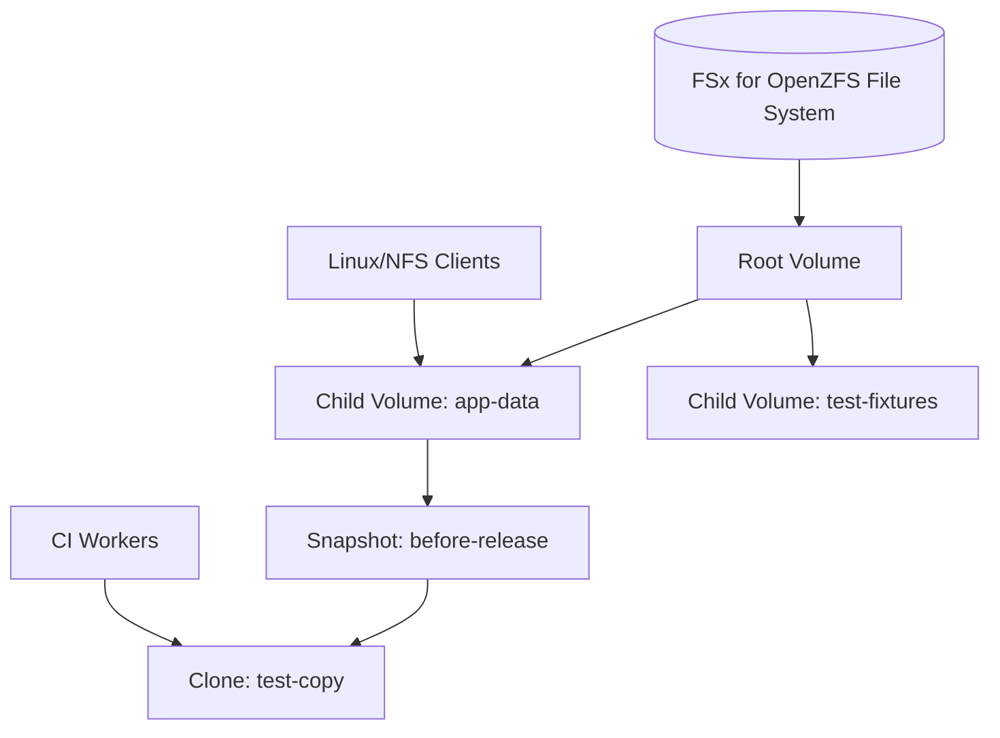
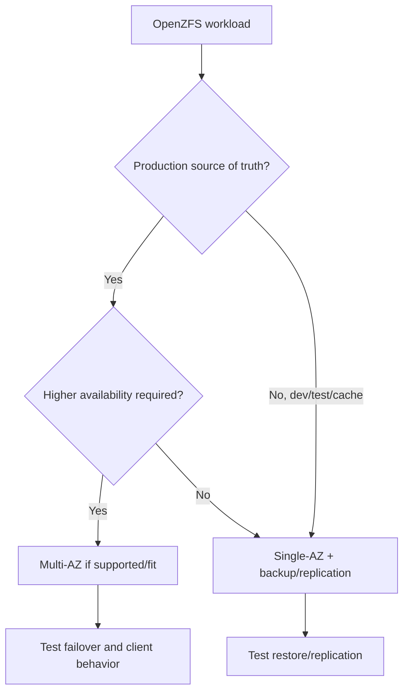
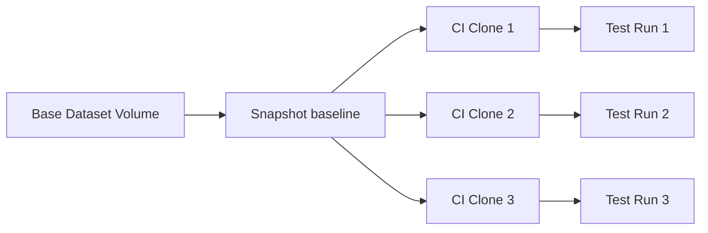

# Part 060 — FSx for OpenZFS Snapshots and Clones

FSx for OpenZFS is for teams that want managed file storage with OpenZFS-style capabilities.

It is not merely "another NFS share."

The important capabilities are:

- NFS access
- volumes as isolated data containers
- point-in-time snapshots
- fast data cloning
- backup and restore
- high-performance file access
- Multi-AZ high availability options
- on-demand replication between file systems
- migration path for existing ZFS/NFS workloads

If your workload needs simple elastic shared NFS with minimal operational modeling, EFS may be simpler.

If your workload needs NFS plus snapshots, clones, fast rollback, dev/test copies, or ZFS-like operational workflows, FSx for OpenZFS becomes interesting.

This part explains how to think about OpenZFS on AWS as a production primitive.

---

## 1. Problem yang Diselesaikan

Part ini menjawab:

- kapan memilih FSx for OpenZFS
- apa beda OpenZFS dengan EFS dan ONTAP dalam decision map
- bagaimana file system, root volume, dan child volumes bekerja
- bagaimana snapshot dan clone dipakai untuk rollback, dev/test, CI, dan dataset branching
- apa perbedaan clone vs full copy
- bagaimana throughput capacity, SSD storage, provisioned IOPS, dan client tuning dipikirkan
- bagaimana NFS `nconnect` membantu performance
- bagaimana Multi-AZ vs Single-AZ dipilih
- bagaimana backup dan on-demand replication dipakai
- bagaimana migration/cutover NFS/ZFS dilakukan
- bagaimana menghindari snapshot/clone sprawl
- bagaimana runbook performance, capacity, snapshot, clone, permission, dan restore ditulis

---

## 2. Mental Model

### 2.1 FSx OpenZFS is managed NFS with ZFS-style data management



The file system contains volumes.

Volumes contain files/directories.

Snapshots capture volume state.

Clones create writable volumes from snapshots.

### 2.2 OpenZFS value is fast point-in-time data management

OpenZFS workflows often value:

- instant snapshot before risky operation
- clone dataset for testing
- rollback from known point
- compare file versions
- dev/test environment creation
- immutable-ish baseline with writable branches
- efficient copies for large datasets

This is different from EFS, where access points and elastic shared NFS simplicity are the main operational primitives.

### 2.3 Clone is not free forever

A clone can be fast to create because it references snapshot data rather than copying all bytes immediately. But as clone diverges, changed blocks consume capacity. The source snapshot may need to remain while clones depend on it.

Clone lifecycle matters:

```text
clone owner
purpose
source snapshot
created time
expiry time
changed data growth
deletion condition
```

### 2.4 Snapshot is local recovery, not full DR

Snapshots are excellent for local point-in-time recovery.

They do not replace:

- backup
- cross-Region replication
- ransomware-resistant vault strategy
- application-consistent backup
- migration validation
- DR runbook

Use snapshots for fast operational safety. Use backups/replication for broader recovery.

### 2.5 NFS remains a distributed file protocol

OpenZFS does not remove NFS realities:

- UID/GID permissions
- mount options
- metadata-heavy workloads
- directory fanout
- client network bandwidth
- stale handles
- locking
- application expectations

The ZFS features add data management power, not immunity to file-system design mistakes.

---

## 3. When to Use FSx for OpenZFS

### 3.1 Strong fit

Use when:

- NFS workload needs snapshots/clones
- existing ZFS/NFS workload needs managed AWS target
- dev/test environments need fast dataset copies
- CI needs clone-per-run or rollbackable fixtures
- app needs high-performance NFS with explicit throughput/IOPS provisioning
- snapshot-based rollback is operationally important
- data can be organized into volumes with lifecycle/clone policy
- Multi-AZ NFS HA is desired and supported for selected deployment/storage class

### 3.2 Weak fit

Reconsider when:

- simple elastic shared NFS is enough
- Lambda/ECS/EKS access point model is primary need
- Windows SMB/AD/ACL is required
- ONTAP multiprotocol/enterprise features required
- HPC/ML parallel file system required
- object lifecycle/archive/object lock required
- database low-latency block storage required
- team does not need snapshots/clones

### 3.3 Decision table

| Requirement | Better fit |
|---|---|
| simple shared Linux NFS | EFS |
| NFS + snapshots/clones | FSx OpenZFS |
| NFS/SMB/iSCSI + ONTAP features | FSx ONTAP |
| Windows SMB/AD | FSx Windows |
| HPC/ML parallel FS | FSx Lustre |
| object store/data lake/archive | S3 |
| single-instance DB block | EBS / managed DB |

---

## 4. Core Components

### 4.1 File system

Key choices:

- deployment type
- storage class
- SSD storage capacity
- throughput capacity
- provisioned SSD IOPS
- subnet/VPC placement
- security groups
- KMS key
- backup settings
- maintenance window
- tags and owner

### 4.2 Root volume

Every FSx for OpenZFS file system has one root volume created at file system creation.

The root volume is parent for child volumes.

Do not put all application data directly in root volume without design. Use child volumes as ownership and lifecycle boundaries.

### 4.3 Child volumes

Volumes are isolated containers for files and directories.

Use volumes for:

- application datasets
- dev/test datasets
- tenant/service boundary
- snapshot policy boundary
- clone source
- backup/restore unit
- migration unit
- performance/capacity management boundary

### 4.4 Snapshots

A snapshot is a read-only point-in-time image of a volume.

Use before:

- release/deployment
- migration
- destructive test
- data transformation
- bulk import
- permission change
- cleanup job

### 4.5 Clones

A clone creates a new writable volume from a snapshot.

Use for:

- testing
- CI
- analytics sandbox
- developer environment
- rollback validation
- what-if data processing
- staging before production update

### 4.6 Copy strategy

FSx for OpenZFS clone/copy behavior can involve strategies such as:

- `CLONE`: new volume references origin snapshot data; faster and does not copy all data initially, but source snapshot cannot be deleted while clone depends on it.
- `FULL_COPY`: copies all data from snapshot into new volume.

Choose based on:

- speed
- capacity
- dependency on source snapshot
- long-term independence
- lifecycle

---

## 5. Deployment and Availability

### 5.1 Single-AZ

Use when:

- workload is AZ-local
- cost/performance profile fits
- dev/test
- data has backup/replication elsewhere
- AZ-level unavailability is acceptable

### 5.2 Multi-AZ

FSx for OpenZFS supports Multi-AZ file systems that provide higher availability and durability than Single-AZ options while preserving performance characteristics documented by AWS for supported configurations.

Use when:

- production file workload needs higher availability
- source of truth needs stronger resilience
- app can tolerate/handle failover
- client reconnect behavior is tested
- RTO/RPO justify cost

### 5.3 Availability decision



### 5.4 Client behavior during failover

Test:

- NFS mount behavior
- open file handles
- long-running writes
- retry timeouts
- application reconnect
- idempotent writes
- file locks
- stale handle handling

High availability is not useful if application crashes unrecoverably on failover.

---

## 6. Performance

### 6.1 Performance dimensions

FSx OpenZFS performance depends on:

- throughput capacity
- SSD storage capacity
- provisioned SSD IOPS
- storage class
- deployment type
- client EC2 network capacity
- client NFS settings
- workload read/write pattern
- metadata operations
- file size distribution
- compression/dedup or storage features where applicable/current
- snapshot/clone activity

### 6.2 Throughput capacity

Throughput capacity is a configured performance property.

When planning:

```text
required throughput = peak read/write workload + headroom
```

Remember:

- single client may be limited by EC2 network and single TCP flow
- aggregate throughput needs enough clients/parallelism
- provisioned capacity and IOPS changes may have update constraints
- Multi-AZ/Intelligent-Tiering update timing constraints can apply

### 6.3 Provisioned SSD IOPS

Provisioned IOPS matters for workloads with random I/O and many operations.

Use when:

- latency-sensitive NFS app
- many small random reads/writes
- build/test workloads
- databases only if supported/validated by vendor/app
- metadata-intensive operations

Benchmark with real workload.

### 6.4 NFS nconnect

FSx for OpenZFS supports the NFS `nconnect` mount option, allowing multiple TCP connections for a single NFS mount, up to documented limits. This can improve performance beyond a single TCP connection limit.

Example concept:

```bash
sudo mount -t nfs \
  -o nfsvers=4.2,nconnect=16,rsize=1048576,wsize=1048576 \
  fs-0123456789abcdef0.fsx.us-east-1.amazonaws.com:/fsx/vol1 \
  /mnt/openzfs
```

Validate current recommended mount options for your OS/kernel and workload.

### 6.5 Client instance selection

Ensure clients can drive file system performance:

- network bandwidth
- CPU
- memory
- kernel/NFS version
- number of worker processes
- connection count
- placement/AZ
- security group path

A small client cannot prove file system maximum performance.

### 6.6 Metadata-heavy workload

Symptoms:

- low MiB/s but high latency
- repeated directory scans
- many tiny files
- CI job slow at checkout/list phase
- file open dominates runtime

Mitigations:

- directory fanout
- bundle files
- reduce repeated stat/list
- use manifests
- keep hot metadata in database
- use clones wisely
- tune clients
- avoid one directory with millions of files

---

## 7. Snapshot Patterns

### 7.1 Before risky operation

Before running migration or bulk update:

```text
snapshot volume: app-data before-release-2026-07-06
```

If operation fails:

- restore from snapshot
- clone snapshot and copy back
- compare differences

### 7.2 Periodic restore points

Use snapshot schedule:

```yaml
hourly: keep 24
daily: keep 14
weekly: keep 8
```

Adjust to churn and capacity.

### 7.3 Dev/test baseline

Create snapshot:

```text
snapshot: baseline-fixtures-v42
```

Create clones:

```text
clone: ci-run-991
clone: dev-alice
clone: staging-test
```

Delete clones after use.

### 7.4 Snapshot validation

A snapshot is useful only if restore process works.

Test:

- create snapshot
- create clone from snapshot
- mount clone
- run app smoke test
- delete clone
- record time/cost

### 7.5 Snapshot capacity

Snapshots retain changed data.

High churn means snapshots can consume significant capacity.

Monitor:

- snapshot count
- snapshot age
- referenced data
- clones dependent on snapshot
- changed data growth
- expired snapshots not deleted due to clone dependency

---

## 8. Clone Patterns

### 8.1 CI clone per run



Benefits:

- fast environment creation
- isolated writes
- reproducible baseline
- cheap initially

Risks:

- clone sprawl
- changed data growth
- snapshot dependency
- cleanup failure

### 8.2 Developer sandbox

Clone production-like dataset to isolated volume.

Rules:

- sanitize sensitive data if needed
- expiry required
- owner required
- no production writes
- cost monitoring
- access restricted

### 8.3 Rollback rehearsal

Create clone from pre-change snapshot, mount in staging, validate rollback before touching production.

### 8.4 FULL_COPY for independence

Use full copy when:

- clone must outlive source snapshot
- independent lifecycle required
- performance/capacity model favors full copy
- source snapshot deletion needed

Trade-off:

- slower creation
- consumes more capacity immediately

### 8.5 Clone lifecycle contract

Every clone should have:

```yaml
clone:
  owner:
  sourceSnapshot:
  purpose:
  createdAt:
  expiresAt:
  maxSize:
  cleanupRunbook:
```

---

## 9. Backup and Replication

### 9.1 Backups

FSx OpenZFS supports backups to protect file systems/volumes depending on configuration.

Use backups for:

- point-in-time recovery beyond local snapshots
- file system recovery
- compliance retention
- migration safety
- disaster recovery baseline

Test restore.

### 9.2 Snapshot vs backup

Snapshot:

- fast local point-in-time
- volume-level operational tool
- source for clones
- depends on file system health/capacity

Backup:

- managed recovery point
- independent recovery workflow
- restore to new file system/volume
- broader data protection

Use both when data matters.

### 9.3 On-demand replication

FSx for OpenZFS supports on-demand replication to synchronize snapshots of data between file systems within and across AWS Regions.

Use for:

- DR copy
- migration between deployment types/storage classes
- periodic copy to another file system
- environment sync
- recovery testing

Design:

- source volume
- destination file system/volume
- schedule/orchestration
- RPO
- failover runbook
- consistency validation

### 9.4 Replication caveat

On-demand replication is not the same as continuous synchronous replication.

If RPO is strict, measure and schedule accordingly. For writes between replication runs, recent changes may not exist at destination.

### 9.5 Restore testing

For critical volumes:

- restore backup to new FS
- replicate to DR FS
- mount from app client
- validate permissions
- run smoke test
- measure RTO/RPO

---

## 10. Migration

### 10.1 Good migration targets

FSx OpenZFS is attractive for:

- on-prem OpenZFS/NFS workloads
- NFS file servers needing snapshots/clones
- ZFS-based dev/test workflows
- workloads requiring fast clone-based environments
- existing tools expecting NFS paths

### 10.2 Migration paths

Options:

- AWS DataSync for NFS
- rsync
- application-level export/import
- backup/restore if compatible
- snapshot-based transfer from ZFS source depending environment/tools

### 10.3 Metadata preservation

Decide:

- UID/GID preservation
- permissions
- timestamps
- symlinks
- sparse files
- hard links
- extended attributes where relevant
- ACLs
- case sensitivity expectations

### 10.4 Cutover

Flow:

1. inventory source
2. create target FSx OpenZFS
3. create volumes
4. initial sync
5. validate
6. incremental sync
7. freeze source writes
8. final sync
9. mount clients to new endpoint
10. app smoke test
11. source read-only rollback window

### 10.5 Migration validation

Validate:

- file count
- bytes
- sample checksums
- permissions
- app read/write
- performance
- snapshot/clone workflow
- backup/restore
- monitoring

---

## 11. Security

### 11.1 Network

Design:

- VPC/subnets
- security groups
- NFS port access
- client source restrictions
- on-prem connectivity if needed
- DNS/mount endpoints
- management access

### 11.2 POSIX permissions

Use:

- UID/GID registry
- project groups
- directory permissions
- controlled root access
- service accounts
- least privilege for CI/dev/test clones

### 11.3 NFS exports

Control:

- which clients can mount
- read-only vs read-write where possible
- root access
- per-volume export path
- tenant/project isolation

### 11.4 Encryption and KMS

Design:

- encryption at rest
- KMS key ownership
- backup/replication decrypt
- key deletion guardrails
- cross-account recovery if needed

### 11.5 Sensitive clone data

Clones can duplicate sensitive production-like data quickly.

Guardrails:

- sanitize before dev clone
- restrict clone access
- expiry date
- audit clone creation
- avoid broad developer access
- tag clone with owner/purpose

---

## 12. Operations and Observability

### 12.1 Metrics

Track:

- storage capacity used
- throughput
- IOPS
- provisioned IOPS utilization
- latency
- client connections
- volume usage
- snapshot count
- clone count
- backup success/failure
- replication task status
- nconnect adoption
- top volumes by growth
- clone age
- snapshot dependency blockers

### 12.2 App metrics

Track:

- open latency
- read/write latency
- list duration
- clone creation time
- test environment provisioning time
- rollback time
- permission denied errors
- stale handle errors
- backup restore time

### 12.3 Inventory

Maintain:

```yaml
fileSystem:
  owner:
  deploymentType:
  storageClass:
  throughputCapacity:
  provisionedIops:
  volumes:
    - name: ci-fixtures
      owner: platform-ci
      snapshotPolicy: hourly/daily
      clonePolicy: ttl-24h
      backupPolicy: daily
```

### 12.4 Change controls

Require approval for:

- volume deletion
- snapshot deletion if clones depend on it
- clone creation from sensitive data
- throughput/IOPS changes
- backup retention changes
- NFS export changes
- replication target changes

---

## 13. Runbooks

### 13.1 Performance slow

1. Identify client and volume.
2. Check operation type: read/write/list/stat.
3. Check throughput/IOPS utilization.
4. Check client EC2 network capacity.
5. Check nconnect usage.
6. Check file size distribution.
7. Check directory size.
8. Check snapshot/clone activity.
9. Increase throughput/IOPS if appropriate.
10. Redesign file layout if metadata-bound.

### 13.2 Volume full

1. Identify volume owner.
2. Check live data vs snapshots/clones.
3. Identify top directories.
4. Delete expired clones.
5. Delete expired snapshots after dependency check.
6. Increase volume/quota/capacity if needed.
7. Add guardrails.

### 13.3 Snapshot cannot be deleted

Likely cause:

- clone depends on snapshot
- policy protects it
- administrative permission issue

Runbook:

1. List clones from snapshot.
2. Contact clone owners.
3. Delete/convert/full-copy clones if appropriate.
4. Delete snapshot after dependencies removed.
5. Add clone expiry automation.

### 13.4 Bad deployment rollback

1. Stop writers.
2. Identify pre-deployment snapshot.
3. Create clone for validation.
4. Validate app state.
5. Decide restore method:
   - copy files from clone
   - revert volume if supported/appropriate
   - cut over to clone
6. Resume traffic.
7. Record RTO and fix deployment guardrail.

### 13.5 CI clone sprawl

1. List clones older than TTL.
2. Check active CI runs.
3. Delete expired inactive clones.
4. Delete snapshots unblocked by clone removal.
5. Add automated cleanup.
6. Add cost alarm.

### 13.6 Migration issue

1. Identify failed path.
2. Check UID/GID/permissions.
3. Check symlink/hard link behavior.
4. Check source file mutation.
5. Re-run incremental sync.
6. Validate with app.
7. Delay cutover if mismatch persists.

### 13.7 Replication failure

1. Check source/destination file systems.
2. Check network/IAM/KMS if relevant.
3. Check task status/errors.
4. Check source snapshot state.
5. Retry replication.
6. Validate destination mount.
7. Alert owner if RPO missed.

---

## 14. Terraform Skeleton

### 14.1 FSx OpenZFS file system concept

```hcl
resource "aws_fsx_openzfs_file_system" "ci" {
  storage_capacity    = 1024
  subnet_ids          = [var.subnet_id]
  throughput_capacity = 512

  deployment_type = "SINGLE_AZ_2"

  root_volume_configuration {
    data_compression_type = "ZSTD"

    nfs_exports {
      client_configurations {
        clients = var.vpc_cidr
        options = ["rw", "crossmnt"]
      }
    }
  }

  tags = {
    Service     = "ci-fixtures"
    Environment = "prod"
    DataClass   = "test-data"
  }
}
```

Validate current provider fields and deployment/storage class options.

### 14.2 Volume concept

```hcl
resource "aws_fsx_openzfs_volume" "fixtures" {
  name             = "fixtures"
  parent_volume_id = aws_fsx_openzfs_file_system.ci.root_volume_id

  volume_type = "OPENZFS"

  storage_capacity_quota_gib = 500

  nfs_exports {
    client_configurations {
      clients = var.ci_worker_cidr
      options = ["rw", "crossmnt"]
    }
  }

  tags = {
    Owner = "ci-platform"
  }
}
```

### 14.3 Snapshot CLI concept

```bash
aws fsx create-snapshot \
  --volume-id fsvol-1234567890abcdef0 \
  --name baseline-2026-07-06
```

### 14.4 Mount concept

```bash
sudo mkdir -p /mnt/openzfs

sudo mount -t nfs \
  -o nfsvers=4.2,nconnect=16,rsize=1048576,wsize=1048576 \
  fs-0123456789abcdef0.fsx.us-east-1.amazonaws.com:/fsx/fixtures \
  /mnt/openzfs
```

Use mount instructions appropriate to your file system endpoint and current docs.

---

## 15. Anti-Patterns

### 15.1 Using OpenZFS without snapshot/clone need

If you do not need ZFS-style data management, EFS may be simpler.

### 15.2 All data in root volume

Root volume becomes dumping ground.

Use child volumes per data class/owner.

### 15.3 Clone forever

Temporary clone becomes permanent production dependency.

Fix with TTL, owner, and cleanup automation.

### 15.4 Deleting source snapshot before clone independence

A clone using snapshot data can block snapshot deletion. If independent lifecycle is needed, use full copy or plan dependency removal.

### 15.5 Dev clones with production secrets

Clone data can copy secrets/PII.

Sanitize or restrict access.

### 15.6 Performance tuning before workload measurement

Do not blindly increase throughput/IOPS before checking:

- client network
- nconnect
- file count
- metadata scans
- directory layout
- application open/list pattern

### 15.7 Snapshot as only backup

Snapshots help local rollback. Backups/replication protect broader recovery scenarios.

---

## 16. Game Days

### Scenario 1 — Bad data transformation

Inject:

```text
bulk transform corrupts files
```

Expected:

- pre-change snapshot exists
- clone created for validation
- restore path chosen
- app recovers
- RTO measured

### Scenario 2 — CI clone sprawl

Inject:

```text
100 stale clones older than TTL
```

Expected:

- dashboard detects
- cleanup finds inactive clones
- dependent snapshots freed
- cost decreases

### Scenario 3 — NFS performance single-flow limit

Expected:

- benchmark with and without nconnect
- client network checked
- throughput improves or bottleneck identified

### Scenario 4 — Replication RPO miss

Expected:

- on-demand replication failure detected
- owner alerted
- destination state not used blindly
- recovery plan chooses backup or older replica

### Scenario 5 — Snapshot delete blocked

Expected:

- clone dependency identified
- owner contacted
- clone removed or full-copied
- snapshot deleted safely

---

## 17. Design Checklist

### 17.1 Workload fit

- [ ] NFS required.
- [ ] Snapshots/clones are required or strongly valuable.
- [ ] EFS/ONTAP/Lustre alternatives considered.
- [ ] File count and size distribution known.
- [ ] Metadata workload understood.
- [ ] Client network capacity known.
- [ ] Dev/test clone requirements documented.
- [ ] Source-of-truth boundary defined.

### 17.2 Architecture

- [ ] Single-AZ/Multi-AZ chosen intentionally.
- [ ] Storage class chosen intentionally.
- [ ] Throughput capacity sized.
- [ ] Provisioned IOPS sized if needed.
- [ ] Volumes created per owner/data class.
- [ ] NFS export policies defined.
- [ ] Backup policy exists.
- [ ] Replication policy exists if needed.
- [ ] KMS/recovery access tested.

### 17.3 Snapshot/clone

- [ ] Snapshot policy defined.
- [ ] Clone use cases defined.
- [ ] Clone TTL required.
- [ ] Sensitive data clone policy exists.
- [ ] Source snapshot dependency understood.
- [ ] Full copy vs clone decision documented.
- [ ] Snapshot/clone cleanup monitored.

### 17.4 Operations

- [ ] Performance dashboard exists.
- [ ] Volume capacity alarms.
- [ ] Snapshot/clone sprawl alarms.
- [ ] Restore game day.
- [ ] Replication game day if used.
- [ ] Migration runbook.
- [ ] Permission runbook.
- [ ] Cost owner defined.

---

## 18. Mini Case Study — CI Test Dataset Clones

### 18.1 Requirement

A CI platform runs integration tests against a 300 GiB fixture dataset.

Problems today:

- copying dataset for each run takes too long
- test data cleanup is unreliable
- tests interfere with each other
- developers need reproducible baseline

### 18.2 OpenZFS design

- store fixture dataset in volume `fixtures-base`
- snapshot `baseline-v42`
- each CI run creates clone:
  - `ci-run-<id>`
- test writes mutate clone only
- clone deleted after run
- baseline snapshot retained until all clones done
- nightly job removes stale clones
- backup protects baseline volume

### 18.3 Invariant

```text
CI tests may mutate their clone.
The baseline snapshot remains immutable during test runs.
Every clone has TTL and owner.
```

### 18.4 Outcome

- faster test start
- isolation per run
- reproducible test data
- predictable cleanup
- lower copy overhead

---

## 19. Mini Case Study — NFS Migration from Self-Managed ZFS

### 19.1 Context

An app uses self-managed NFS/ZFS on EC2.

Pain:

- patching
- backups
- manual snapshots
- capacity expansion
- HA complexity
- clone workflows fragile

### 19.2 Migration target

FSx for OpenZFS.

Plan:

1. Create file system and volumes.
2. Migrate data with DataSync/rsync.
3. Preserve UID/GID and permissions.
4. Create baseline snapshots.
5. Test clone workflow.
6. Mount app in staging.
7. Benchmark with nconnect.
8. Cut over with DNS/mount config.
9. Keep old source read-only temporarily.
10. Enable backups/replication.

### 19.3 Invariant

```text
Migration success means application semantics, permissions, snapshots, clones, and performance all work—not just bytes copied.
```

---

## 20. Summary

FSx for OpenZFS is strongest when NFS workloads need ZFS-style operational capabilities.

Use it for:

- NFS workloads needing snapshots/clones
- dev/test clone workflows
- CI fixture datasets
- migration from ZFS/NFS systems
- high-performance NFS with explicit provisioning
- rollbackable file workflows

Design carefully:

- volumes as ownership boundaries
- snapshot policy
- clone lifecycle
- full copy vs clone dependency
- throughput/IOPS
- nconnect/client tuning
- backup and replication
- migration validation
- security and sensitive clone policy

The core rule:

> FSx for OpenZFS is valuable when snapshots and clones are part of the architecture, not an afterthought.

Next, we finish the file storage section with Amazon File Cache and shared file-storage production patterns: caching remote datasets, cache warmup/eviction, source-of-truth boundaries, and choosing between EFS, FSx, S3, and local cache in real workloads.

---

## References

- Amazon FSx for OpenZFS User Guide — What is FSx for OpenZFS?: https://docs.aws.amazon.com/fsx/latest/OpenZFSGuide/what-is-fsx.html
- Amazon FSx for OpenZFS User Guide — Managing volumes: https://docs.aws.amazon.com/fsx/latest/OpenZFSGuide/managing-volumes.html
- Amazon FSx for OpenZFS User Guide — Creating volumes: https://docs.aws.amazon.com/fsx/latest/OpenZFSGuide/creating-volumes.html
- Amazon FSx for OpenZFS User Guide — Protecting data with snapshots: https://docs.aws.amazon.com/fsx/latest/OpenZFSGuide/snapshots-openzfs.html
- Amazon FSx API Reference — OpenZFSVolumeConfiguration: https://docs.aws.amazon.com/fsx/latest/APIReference/API_OpenZFSVolumeConfiguration.html
- Amazon FSx API Reference — CreateSnapshot: https://docs.aws.amazon.com/fsx/latest/APIReference/API_CreateSnapshot.html
- Amazon FSx for OpenZFS User Guide — Performance: https://docs.aws.amazon.com/fsx/latest/OpenZFSGuide/performance.html
- Amazon FSx for OpenZFS User Guide — Modifying throughput capacity: https://docs.aws.amazon.com/fsx/latest/OpenZFSGuide/managing-throughput-capacity.html
- Amazon FSx for OpenZFS User Guide — On-demand replication: https://docs.aws.amazon.com/fsx/latest/OpenZFSGuide/on-demand-replication.html
- Amazon FSx for OpenZFS User Guide — Resilience: https://docs.aws.amazon.com/fsx/latest/OpenZFSGuide/disaster-recovery-resiliency.html
