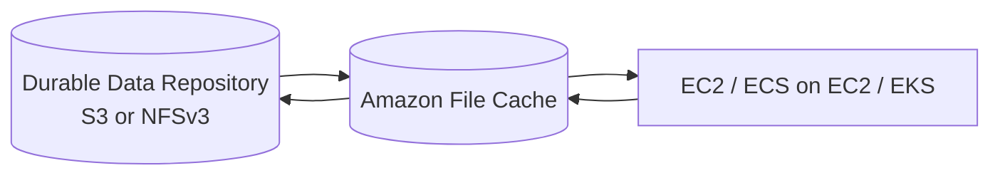
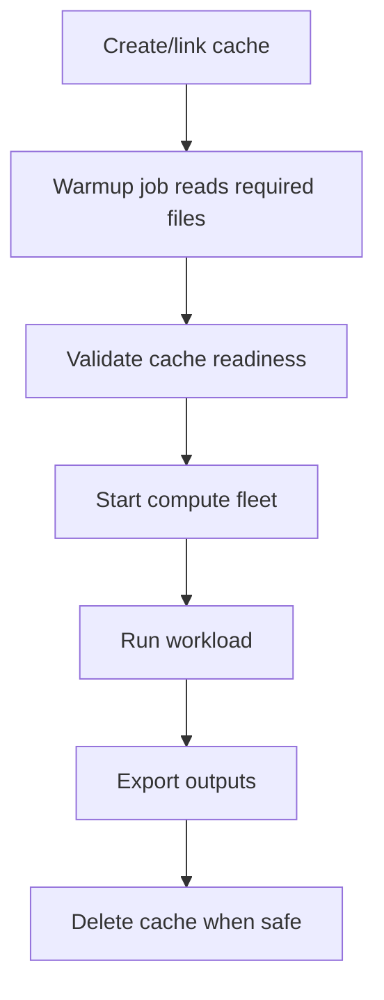
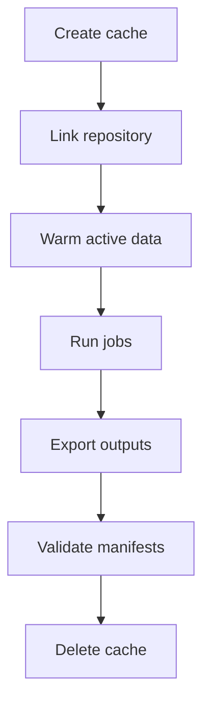

# Part 061 — Amazon File Cache and Remote Dataset Acceleration

A cache is not a source of truth unless you explicitly design it to be one.

Amazon File Cache is a fully managed, high-speed cache on AWS for file data stored elsewhere. It is designed to make it easier to process file data regardless of where the data lives—on Amazon S3, on-premises NFS file systems, or in-cloud NFS file systems.

That means Amazon File Cache is not simply "another FSx file system."

Its identity is different:

```text
remote durable data source -> high-speed AWS cache -> compute workload -> durable output/sync
```

It is useful when compute needs fast file-system access but the authoritative dataset is somewhere else.

Examples:

- burst HPC compute in AWS over on-prem NFS data
- ML preprocessing over S3 datasets with file APIs
- genomics analysis where source data is remote
- migration acceleration
- temporary high-performance workspace
- analytics campaign over file data
- cloud compute over enterprise NAS data

This part explains how to design Amazon File Cache as a production cache: source-of-truth boundary, repository links, lazy loading, warmup, eviction, export, security, cost, runbooks, and correctness.

---

## 1. Problem yang Diselesaikan

Part ini menjawab:

- kapan memakai Amazon File Cache dibanding FSx for Lustre, EFS, S3, atau FSx ONTAP/OpenZFS
- bagaimana cache dihubungkan ke data repository S3 atau NFS
- apa arti lazy load pada metadata dan file content
- bagaimana cache eviction bekerja
- bagaimana mount client memakai Lustre client
- bagaimana import/export dan data repository association dipikirkan
- bagaimana mendesain cache warmup untuk job besar
- bagaimana memastikan output kembali ke durable repository
- bagaimana menghindari stale-data dan lost-output
- bagaimana mengontrol cache cost, idle cache, dan capacity pressure
- bagaimana debugging "file not visible", "first epoch slow", "export missing", "cache full", dan "source repository unreachable"

---

## 2. Mental Model

### 2.1 Amazon File Cache is temporary high-performance proximity



The durable data repository is where data lives long term.

The cache is where compute works fast.

The core question:

```text
What data must survive after the cache is deleted?
```

If the answer is "everything," then you need export/sync/commit rules.

### 2.2 Cache has two identities

Amazon File Cache is:

1. A high-performance Lustre-based file system for compute clients.
2. A cache linked to external data repositories.

This dual identity creates two sets of concerns.

File-system concerns:

- mount client
- Lustre client compatibility
- throughput
- metadata operation rate
- client networking
- POSIX permissions
- file layout

Cache concerns:

- source repository
- lazy load
- cache warmup
- eviction
- export
- stale source changes
- cache fullness
- teardown safety

### 2.3 Cache correctness is about authority

A cache can answer file reads quickly.

It cannot decide business authority.

You must decide:

```text
source of truth = S3/NFS repository?
cache write output = temporary or durable?
who commits output?
what if cache is evicted/deleted before export?
what if source changes while cache is running?
```

### 2.4 Lazy loading changes first-access performance

When data is linked from a repository, File Cache can present repository data as files and directories. When an application accesses data that is not already loaded, the cache loads metadata and file contents from the repository.

This means:

```text
first access may include repository fetch
second access may be fast
```

For large jobs, this matters enormously.

### 2.5 Eviction is normal

Cache eviction is not necessarily data loss.

Eviction can release file contents from the cache while retaining metadata and file listing. Later access can reload content from the repository.

But eviction is dangerous if the file has not been exported/synced to the durable repository.

Rule:

```text
Only disposable or already-exported data may be safely evicted.
```

---

## 3. When to Use Amazon File Cache

### 3.1 Strong fit

Use when:

- data lives in S3 or NFS repository
- compute needs POSIX-like high-speed file access
- workload is temporary or campaign-based
- cache can be recreated
- source repository remains authoritative
- compute needs lower latency/higher throughput than direct remote access
- on-prem data needs cloud burst processing
- EKS/EC2 workload can mount Lustre client
- output can be explicitly exported/committed

### 3.2 Weak fit

Reconsider when:

- data should be permanently stored in the file system
- no external durable repository exists
- simple shared NFS is enough
- Windows SMB/AD required
- ONTAP/ZFS snapshots/clones needed
- workload needs long-lived shared home directories
- application cannot tolerate cache warmup/lazy-load behavior
- source data changes continuously and cache consistency requirements are strict
- team has no export/commit discipline

### 3.3 Decision table

| Requirement | Candidate |
|---|---|
| High-speed cache for S3/NFS file data | Amazon File Cache |
| HPC/ML high-performance file system with S3 integration | FSx for Lustre |
| Simple Linux NFS shared storage | EFS |
| Enterprise NAS/multiprotocol | FSx ONTAP |
| ZFS snapshots/clones | FSx OpenZFS |
| Windows SMB/AD | FSx Windows |
| Durable object storage and lifecycle | S3 |
| Single-host low-latency block | EBS |

### 3.4 File Cache vs FSx for Lustre

They are related in performance model because File Cache is Lustre-based, but the design intent differs.

| Dimension | Amazon File Cache | FSx for Lustre |
|---|---|---|
| Primary identity | high-speed cache over existing repository | high-performance managed Lustre file system |
| Source data | S3 or NFSv3 repository | often S3, or native file system use |
| Lifecycle | temporary/cache-oriented | scratch or persistent file system |
| Best fit | accelerate remote file data | HPC/ML file system and S3-linked compute |
| Source-of-truth | external repository | explicit: S3, persistent FSx, or app-defined |
| Teardown | expected after campaign | depends scratch/persistent design |

---

## 4. Data Repository Links

### 4.1 Repository types

Amazon File Cache can link to data repositories in:

- Amazon S3
- NFS file systems supporting NFSv3

The NFS repository can be on-premises or in the cloud.

A cache can link to multiple repositories, but all linked repositories must be of the same repository type. AWS documentation states a maximum of 8 data repositories per cache.

### 4.2 S3 repository

Use S3 repository when:

- dataset is already object-based
- durable source is S3
- workload needs file API
- job reads large datasets from S3 repeatedly
- results must go back to S3
- data lake/object layout can map to file paths

Cautions:

- S3 object layout becomes file namespace
- many tiny objects become many tiny files
- S3 KMS/bucket policy must allow cache operations
- output commit to S3 must be explicit
- S3 lifecycle/archive classes can surprise file access

### 4.3 NFS repository

Use NFS repository when:

- source is on-prem NAS
- source is cloud NFS file system
- workload wants cloud compute burst
- data cannot be migrated fully yet
- file namespace already exists
- data owner wants source to remain on existing NAS

Cautions:

- network path to source
- firewall allow-lists
- NFS export options
- DNS
- latency/bandwidth to source
- permissions and UID/GID
- source availability
- source change rate

AWS docs warn that, for NFS repositories, the NFS export option `all_squash` must not be used.

### 4.4 Data repository association

The link between cache and repository is a data repository association.

Design fields:

```yaml
repository:
  type: S3|NFS
  path: s3://bucket/prefix or nfs://server/export
  cachePath: /datasets/source-a
  owner:
  importPolicy:
  exportPolicy:
  consistencyExpectation:
  security:
  kms:
  cleanup:
```

### 4.5 Repository boundary

A cache should have a clear repository boundary.

Bad:

```text
link entire enterprise NAS root
```

Better:

```text
link /research/genomics/project-2026-q3
```

or:

```text
s3://ml-datasets/images-v17/
```

Use narrow repositories to reduce:

- namespace confusion
- accidental reads
- permission blast radius
- warmup scope
- eviction complexity
- export risk

---

## 5. Lazy Load and Warmup

### 5.1 Lazy-load behavior

When an application accesses linked data not already in cache, File Cache can load metadata and content from the repository automatically.

This makes setup fast:

```text
create cache
mount cache
files appear as namespace
read file
content loads
```

But first access can be slower because data must be fetched.

### 5.2 Cold-cache effect

A job can behave differently on first and second run:

```text
Run 1: slow because data loads from repository
Run 2: faster because data is cached
```

This is not a mystery. It is cache behavior.

### 5.3 Warmup pattern

For planned jobs, warm the cache before compute starts.



Warmup methods:

- read manifest-listed files
- run import task where available/applicable
- run parallel prefetch
- read file headers/whole files depending need
- pre-load only active working set, not entire world

### 5.4 Warmup manifest

Use manifest:

```json
{
  "datasetVersion": "images-v17",
  "files": [
    "/datasets/images-v17/shard-000001.tar",
    "/datasets/images-v17/shard-000002.tar"
  ],
  "expectedBytes": 982374982734,
  "checksumManifest": "s3://ml-datasets/images-v17/_checksums.json"
}
```

Warmup job:

```text
read all files in manifest
record failures
measure load rate
mark cache READY only if enough files loaded
```

### 5.5 Partial warmup

Not all data needs warmup.

For very large datasets:

- warm only index files
- warm active shards
- warm first epoch
- warm metadata namespace
- lazy-load long tail
- progressively cache based on access

### 5.6 Warmup failure

If warmup fails:

- source unreachable
- permission denied
- KMS denied
- file missing
- cache full
- network bottleneck
- wrong repository link

Do not start expensive compute until readiness criteria pass.

---

## 6. Eviction and Release

### 6.1 Cache eviction mental model

Cache eviction releases local cached file content to make room for new data.

Important:

```text
metadata/listing can remain
file content can be reloaded from repository later
```

### 6.2 Automatic eviction

Amazon File Cache can automatically release less recently used files when cache begins to fill up. Automatic eviction is enabled by default when creating a cache through console, AWS CLI, or API.

This is useful for cache behavior.

But it means:

```text
cache capacity < dataset size
```

can still work if workload locality is good.

### 6.3 Manual release

Manual release can free content using HSM commands.

Use when:

- job phase finished
- specific dataset no longer needed
- need to create room for next phase
- data is already exported/safe
- cache pressure affects new workload

### 6.4 Release safety

AWS docs state you cannot release a file if it is in use or if it has not been exported to a linked data repository.

Operational meaning:

- close files before release
- export outputs before release
- do not release active checkpoint
- release by manifest/job phase
- monitor failures

### 6.5 Eviction and source-of-truth

Eviction is safe when:

```text
file content can be reloaded from repository
```

Eviction is unsafe when:

```text
file content exists only in cache and has not been exported
```

Therefore every generated output needs commit/export policy.

---

## 7. Output and Export

### 7.1 Output must be committed

A compute job writes output to cache:

```text
/cache/results/job-123/output.parquet
```

That is not durable enough if cache is temporary.

Job success should require:

```text
output exported to repository
manifest committed
catalog/job state updated
```

### 7.2 Export options

Depending on repository and configuration:

- automatic export
- explicit export/data repository task
- application copy to S3/NFS
- DataSync or separate sync mechanism
- custom job-level export

Choose one and make it visible.

### 7.3 Manifest pattern

```json
{
  "jobId": "job-123",
  "cacheOutputPath": "/results/job-123/attempt-002/",
  "repositoryOutput": "s3://analytics-results/job-123/attempt-002/",
  "files": [
    {
      "path": "part-0001.parquet",
      "sizeBytes": 268435456,
      "sha256": "..."
    }
  ],
  "exportedAt": "2026-07-06T03:00:00Z"
}
```

### 7.4 Job state

```text
RUNNING
WRITING_OUTPUT
EXPORTING_OUTPUT
VALIDATING_EXPORT
COMMITTED
FAILED
```

Do not jump from `WRITING_OUTPUT` to `COMMITTED`.

### 7.5 Export validation

Validate:

- file count
- bytes
- checksum/sample checksum
- repository visibility
- permissions
- S3 object metadata/tags
- NFS ownership/mode
- manifest presence
- downstream catalog update

### 7.6 Teardown guard

Before deleting cache:

```text
all required outputs exported?
all manifests committed?
all checkpoints preserved if needed?
all jobs completed/failed?
owners approved cleanup?
```

Automate deletion only with these checks.

---

## 8. Cache Consistency and Source Changes

### 8.1 Source repository changes

If source repository changes while cache is active, behavior depends on repository type, cache state, and how changes are imported/refreshed.

Design question:

```text
Is source dataset immutable during cache campaign?
```

Best practice:

- use immutable dataset versions
- link cache to versioned prefix/export
- use manifest
- avoid changing source files mid-job
- if source changes, create new cache or refresh intentionally

### 8.2 Immutable dataset version pattern

S3:

```text
s3://datasets/images/version=v17/
```

NFS:

```text
/export/datasets/images/v17/
```

Cache:

```text
/datasets/images/v17/
```

Compute job stores dataset version.

### 8.3 Mutable source risk

If source files change while compute runs:

- cached content may not match source
- repeated job may see different data
- export may overwrite/conflict
- reproducibility breaks

Fix:

- freeze source during campaign
- snapshot source if possible
- use immutable version directories
- record checksum manifest
- fail job if manifest mismatch

### 8.4 Bidirectional conflict

If both source and cache can write same path, conflict semantics must be explicit.

Avoid:

```text
on-prem user edits file while cloud job writes same file
```

Better:

- read-only input repository
- write output to separate repository path
- merge/review outside cache
- use job-specific output prefixes

---

## 9. Security

### 9.1 Network

Amazon File Cache requires networking between:

- clients and cache
- cache and repository
- cache and DNS/source NFS if applicable
- cache and S3/KMS if applicable

Design:

- VPC/subnets
- security groups
- routing
- on-prem VPN/Direct Connect
- firewalls
- DNS resolver
- source NFS allow-list
- S3 VPC endpoint if used/desired

### 9.2 Client access

Clients use Lustre client.

Restrict:

- security group source
- mount targets/endpoints
- Linux user/group permissions
- job/project directory access
- fileset mounts if namespace scoping needed

### 9.3 Repository permissions

S3:

- bucket policy
- IAM role
- KMS permissions
- prefix scope
- object ownership
- encryption default

NFS:

- export policy
- client IP allow-list
- UID/GID mapping
- no `all_squash`
- root/user permissions

### 9.4 Fileset mount

Amazon File Cache supports mounting a fileset/subdirectory to limit cache namespace visibility on a specific client.

Use when:

- client should see only part of namespace
- multi-project cache is shared
- job should not traverse other datasets
- simple POSIX permissions are insufficient

### 9.5 Sensitive data

A cache can bring sensitive data into AWS compute environment.

Guardrails:

- encryption
- restricted clients
- no broad mounts
- cleanup after campaign
- no debug copies
- audit access where possible
- data classification tags
- approved Region/account

---

## 10. Performance

### 10.1 Lustre-based scale-out

Amazon File Cache is built on Lustre and provides scale-out performance that increases linearly with cache size. Lustre horizontally scales across file servers and disks, allowing clients to access data across those resources.

Implication:

```text
capacity choice affects performance envelope
```

### 10.2 Throughput sizing

Throughput capacity is calculated from cache storage capacity and throughput tier. AWS examples show a 1.2 TiB cache at 1000 MBps/TiB resulting in 1200 MBps, and a 9.6 TiB cache resulting in 9600 MBps.

Sizing inputs:

- required read throughput
- required write throughput
- source repository bandwidth
- cache warmup time
- compute fleet size
- file size distribution
- metadata operation rate
- active working set
- output export bandwidth
- desired job runtime

### 10.3 Metadata storage

AWS documentation notes metadata storage capacity is provisioned for caches. Metadata-heavy workloads still need design:

- millions of tiny files can hurt
- directory scans can be expensive
- file count should be measured
- cache capacity is not the only limit

### 10.4 Client parallelism

Clients must drive throughput.

Check:

- EC2 network capacity
- Lustre client installed
- kernel compatibility
- number of workers
- file sharding
- mount options
- placement and network path

### 10.5 Source bottleneck

A cache cannot load data faster than the source/repository/network allows during cold load.

If source is on-prem NFS:

- WAN bandwidth
- latency
- firewall
- source NAS performance
- DNS
- NFS export behavior

can bottleneck warmup.

### 10.6 Hot-set sizing

Cache does not need to fit the entire dataset if working set is smaller and eviction works.

Estimate:

```text
cache_capacity >= active_working_set + output_buffer + safety_margin
```

If active working set exceeds cache size, eviction churn can destroy performance.

### 10.7 Small-file mitigation

Same as Lustre/HPC:

- shard small files
- use archive/tar/webdataset/parquet formats
- precompute file manifest
- avoid repeated directory walks
- cache metadata/indexes
- use larger sequential reads
- keep file descriptors open when safe

---

## 11. Cost Model

### 11.1 Cost dimensions

Cost includes:

```text
cache storage capacity
throughput tier/capacity
cache lifetime
data transfer from repository
S3 requests
KMS requests
on-prem network cost
compute waiting on cold-load
idle cache time
unexported output loss/recompute
```

### 11.2 Cache lifetime

Amazon File Cache is often campaign-oriented.

Cost pattern:

```text
create cache
warm up
run job
export output
delete cache
```

Idle caches are expensive mistakes.

### 11.3 Cost per campaign

Model:

```text
campaign_cost =
    cache_cost_for_duration
  + compute_cost
  + source transfer cost
  + S3/NFS request cost
  + export cost
  + retry/recompute cost
```

The right metric is not storage cost per TiB. It is cost per successful workload.

### 11.4 Cold load vs persistent cache

If jobs run repeatedly over same dataset, keeping cache warm may be cheaper than repeated reloading.

If jobs are rare, deleting cache may be cheaper.

Decision:

```text
keep cache if saved load time * compute cost + SLA value > idle cache cost
```

### 11.5 Eviction churn cost

If cache too small:

- file content repeatedly evicted
- source reloaded repeatedly
- job slows
- network cost rises
- compute waits

Size for working set, not only minimum capacity.

---

## 12. Observability

### 12.1 Cache metrics

Track:

- free data storage capacity
- read throughput
- write throughput
- read operations
- write operations
- metadata operations
- cache hit/miss proxy metrics where available
- client connections
- file system status
- data repository task status
- import/export errors
- source read errors
- eviction/release activity
- cache age
- idle time

AWS File Cache publishes front-end I/O metrics such as data read/write bytes, read/write operations, and metadata operations into CloudWatch.

### 12.2 Source repository metrics

S3:

- GET/HEAD/LIST/PUT rate
- 4xx/5xx
- KMS errors
- request cost
- retrieval from archive/IA
- bytes downloaded/uploaded

NFS:

- source NAS throughput
- export errors
- permission errors
- network bandwidth
- firewall drops
- latency
- DNS errors

### 12.3 Job metrics

Track:

- warmup duration
- first epoch duration vs subsequent epoch
- data loader wait time
- CPU/GPU idle due to I/O
- output export duration
- checkpoint duration
- cache full incidents
- job failure before export
- bytes read from cache/source
- files opened/listed

### 12.4 Dashboard questions

Your dashboard should answer:

```text
Is cache filling?
Is compute waiting on data?
Is source repository reachable?
Are outputs exported?
Can cache be deleted safely?
Is this cache idle?
Is this workload repeatedly reloading evicted data?
```

---

## 13. Runbooks

### 13.1 Files not visible after mount

1. Confirm cache is available.
2. Confirm Lustre client installed/supported.
3. Confirm mount command and mount name.
4. Confirm data repository association exists.
5. Confirm cache path/repository path.
6. Check S3/NFS repository permissions.
7. For NFS, confirm no `all_squash`.
8. Confirm cache can reach repository network/DNS.
9. Check import/lazy-load behavior.
10. Test known file path.

### 13.2 First run slow

1. Compare cold vs warm run.
2. Check lazy load behavior.
3. Check source throughput.
4. Check warmup completeness.
5. Check file size distribution.
6. Check metadata operation rate.
7. Preload active working set.
8. Increase cache size/throughput if justified.
9. Shard/compact small files.

### 13.3 Cache full

1. Check free data storage capacity.
2. Identify top directories.
3. Identify active jobs.
4. Verify outputs exported before release.
5. Manually release safe files if needed.
6. Increase capacity for future campaign.
7. Reduce working set or split workload.
8. Add capacity alarm.

### 13.4 Export missing

1. Do not delete cache.
2. Identify job output path.
3. Check whether files are closed.
4. Check export policy/task.
5. Check repository permissions/KMS.
6. Check export errors.
7. Retry export.
8. Validate repository files.
9. Commit manifest after validation.

### 13.5 Source NFS unreachable

1. Check network route/VPN/DX.
2. Check firewall allow-list includes cache IPs.
3. Check DNS server config.
4. Check NFS export policy.
5. Check NFS version/export options.
6. Check source NAS health.
7. Pause compute if warmup impossible.
8. Fail over source or reschedule job.

### 13.6 Idle cache

1. Check last I/O timestamp.
2. Check active jobs.
3. Check unexported outputs.
4. Notify owner.
5. Export/commit required data.
6. Delete cache if campaign complete.
7. Tag future caches with expiry.

---

## 14. Infrastructure Skeleton

### 14.1 Cache creation concept

Terraform/provider support can evolve. Conceptually, cache creation needs:

```yaml
cache:
  storageCapacity: 1200 GiB minimum class/size as supported
  throughputTier: selected per workload
  subnetIds:
  securityGroupIds:
  dataRepositoryAssociations:
    - type: S3|NFS
      repositoryPath:
      cachePath:
  tags:
    owner:
    campaign:
    expiresAt:
```

### 14.2 AWS CLI concept

```bash
aws fsx create-file-cache \
  --file-cache-type LUSTRE \
  --storage-capacity 1200 \
  --subnet-ids subnet-abc \
  --security-group-ids sg-cache \
  --client-request-token "$TOKEN" \
  --lustre-configuration '{
    "PerUnitStorageThroughput": 1000,
    "DeploymentType": "CACHE_1"
  }'
```

Validate current API fields before use.

### 14.3 Mount concept

```bash
sudo mkdir -p /cache

sudo mount -t lustre \
  -o relatime,flock \
  fc-0123456789abcdef0.fsx.us-east-1.amazonaws.com@tcp:/mountname \
  /cache
```

Use the mount command from the File Cache console/API for your specific cache.

### 14.4 Fileset mount concept

```bash
sudo mount -t lustre \
  -o relatime,flock \
  fc-0123456789abcdef0.fsx.us-east-1.amazonaws.com@tcp:/mountname/datasets/project-a \
  /cache/project-a
```

This limits namespace visibility for a client.

---

## 15. Operational Patterns

### 15.1 Campaign cache

Use for temporary compute campaign.



Tags:

```yaml
Owner: genomics-platform
Campaign: q3-analysis
ExpiresAt: 2026-07-31
SourceRepo: s3://...
OutputRepo: s3://...
```

### 15.2 Long-lived project cache

Use when repeated jobs benefit from warm cache.

Add:

- stronger ownership
- capacity monitoring
- eviction policy
- periodic source refresh
- output commit policy
- idle review
- access control by project

### 15.3 On-prem burst cache

Use when source data remains on-prem.

Design:

- Direct Connect/VPN bandwidth
- firewall allow-list
- DNS resolver
- NFS export policy
- cache warmup schedule
- output return path
- source freeze/versioning
- on-prem owner approval

### 15.4 S3 data lake acceleration

Use when data is in S3 but tools need file APIs.

Design:

- S3 prefix versioning
- file layout optimized for compute
- sharded large files
- cache warmup
- output manifest to S3
- avoid changing source prefix during job

---

## 16. Failure Modes

### 16.1 Treating cache as durable source

Symptom:

- cache deleted
- only copy of output lost

Fix:

- job success requires export
- teardown guard
- output manifest in durable repository
- owner approval before delete

### 16.2 Cache too small

Symptom:

- eviction churn
- repeated reloads
- job slow despite cache
- source bandwidth high

Fix:

- size cache for active working set
- split job
- warm only needed files
- compact/shard dataset
- monitor capacity

### 16.3 Source changes during job

Symptom:

- non-reproducible results
- mixed file versions
- manifest mismatch

Fix:

- immutable dataset version
- source freeze
- checksum manifest
- create new cache per dataset version
- reject mid-job source mutation

### 16.4 Unexported dirty data

Symptom:

- file cannot be released
- cache cannot be deleted safely
- output missing from repository

Fix:

- close writers
- export data
- validate
- commit manifest
- then release/delete

### 16.5 NFS export misconfiguration

Symptom:

- files missing
- permission denied
- cache cannot access source

Fix:

- check export policy
- avoid all_squash
- allow cache network interfaces
- verify UID/GID
- test NFS access

### 16.6 Wrong service choice

Symptom:

- long-lived shared app data in cache
- no source repository discipline
- users expect home directory behavior

Fix:

- migrate to EFS/FSx persistent option
- export data
- redesign source-of-truth
- decommission cache pattern

---

## 17. Game Days

### Scenario 1 — Cache deleted before export

Expected:

- guardrail blocks deletion
- unexported output detected
- job marked failed/not committed
- recovery plan uses source and rerun

### Scenario 2 — Source NFS unavailable

Expected:

- warmup fails
- compute does not start
- network/source runbook executed
- job rescheduled or failover source used

### Scenario 3 — Eviction churn

Expected:

- metrics show repeated reads/source load
- cache resized or workload split
- active working set recalculated

### Scenario 4 — Stale source

Expected:

- checksum manifest detects mismatch
- job fails fast
- new dataset version created

### Scenario 5 — Idle cache cost

Expected:

- idle alarm fires
- owner confirms no active jobs
- outputs validated
- cache deleted

---

## 18. Checklist

### 18.1 Workload fit

- [ ] Source repository is S3 or supported NFSv3.
- [ ] Cache is not assumed to be durable source.
- [ ] Compute requires high-speed file access.
- [ ] Data can be versioned/frozen for job.
- [ ] Output export/commit path exists.
- [ ] Lustre client support validated.
- [ ] EFS/FSx Lustre/EFS/S3 alternatives considered.

### 18.2 Repository

- [ ] Repository path scoped narrowly.
- [ ] S3/NFS permissions tested.
- [ ] KMS tested if S3 encrypted.
- [ ] NFS network/DNS/firewall tested.
- [ ] Source change policy defined.
- [ ] Dataset manifest exists.
- [ ] Max linked repository constraints understood.

### 18.3 Cache operation

- [ ] Cache size fits active working set.
- [ ] Throughput tier sized.
- [ ] Warmup plan exists.
- [ ] Eviction behavior understood.
- [ ] Output export validated.
- [ ] Teardown guard implemented.
- [ ] Idle cache alarm exists.
- [ ] Cost owner and expiry tag exist.

### 18.4 Security

- [ ] Security groups restrict clients.
- [ ] Fileset mounts used where needed.
- [ ] POSIX permissions designed.
- [ ] Sensitive data classification approved.
- [ ] Source repository access least privilege.
- [ ] Output repository access least privilege.
- [ ] Logs/audit appropriate.

### 18.5 Runbooks

- [ ] Files not visible.
- [ ] First run slow.
- [ ] Cache full.
- [ ] Export missing.
- [ ] Source unreachable.
- [ ] Idle cache cleanup.
- [ ] Stale dataset mismatch.

---

## 19. Mini Case Study — On-Prem Genomics Burst to AWS

### 19.1 Context

A genomics lab has 500 TiB of source data on on-prem NFS.

They need to run a quarterly analysis on AWS EC2 compute.

Requirements:

- source data remains on-prem for now
- compute in AWS must access files quickly
- result dataset must return to S3 and on-prem
- campaign lasts two weeks
- reproducibility required

### 19.2 Design

- source NFS export is versioned/frozen for campaign
- Amazon File Cache links to NFS repository
- Direct Connect bandwidth validated
- cache warmed using manifest of required files
- compute fleet mounts cache via Lustre client
- output written to `/results/campaign-2026-q3/`
- output exported to S3 results bucket
- manifest validates result files
- cache deleted after owner approval

### 19.3 Invariants

```text
On-prem NFS remains source for input.
S3 result manifest is durable output authority.
File Cache is disposable after export validation.
```

### 19.4 Failure handling

- source unavailable before warmup: job does not start
- source changes during job: checksum manifest fails
- cache full: release old safe files or resize/recreate cache
- output export fails: cache retained until export completes
- idle after campaign: expiry tag triggers review and deletion

---

## 20. Mini Case Study — S3 Dataset With File-Based ML Tool

### 20.1 Context

An ML tool expects POSIX paths.

Dataset lives in S3:

```text
s3://ml-datasets/v17/
```

Tool expects:

```text
/data/train/shard-00001.tar
```

### 20.2 Design

- link File Cache to S3 prefix
- mount cache to EC2 training fleet
- warm manifest-listed shards
- run training
- write model/checkpoints to output path
- export final model to S3
- training job success waits for exported manifest

### 20.3 Anti-pattern avoided

Bad:

```text
train writes model only to cache
delete cache after job
```

Good:

```text
train writes model to cache
export to s3://ml-results/job-id/
validate manifest
delete cache
```

### 20.4 Invariant

```text
Cache accelerates the file API.
S3 manifest defines durable model artifact.
```

---

## 21. Summary

Amazon File Cache is powerful when you treat it as a cache.

Use it to accelerate:

- S3 datasets
- on-prem NFS data
- in-cloud NFS data
- temporary compute campaigns
- file-based tools over remote data

Design explicitly:

- repository boundary
- source-of-truth
- lazy load
- warmup
- eviction
- output export
- manifest commit
- cache sizing
- security
- idle cleanup
- runbooks

The core rule:

> Data may pass through the cache, but business truth must live in the repository, manifest, catalog, or another durable authority.

Next, we close the entire file-storage section with cross-service production patterns: when to use EFS, FSx, S3, EBS, instance store, and cache together in real architectures.

---

## References

- Amazon File Cache User Guide — What is Amazon File Cache?: https://docs.aws.amazon.com/fsx/latest/FileCacheGuide/what-is.html
- Amazon File Cache User Guide — Using data repositories: https://docs.aws.amazon.com/fsx/latest/FileCacheGuide/using-data-repositories.html
- Amazon File Cache User Guide — Linking your cache to a data repository: https://docs.aws.amazon.com/fsx/latest/FileCacheGuide/create-linked-data-repo.html
- Amazon File Cache User Guide — Lazy load: https://docs.aws.amazon.com/fsx/latest/FileCacheGuide/mdll-lazy-load.html
- Amazon File Cache User Guide — Importing files from your data repository: https://docs.aws.amazon.com/fsx/latest/FileCacheGuide/importing-files.html
- Amazon File Cache User Guide — Cache eviction: https://docs.aws.amazon.com/fsx/latest/FileCacheGuide/cache-eviction.html
- Amazon File Cache User Guide — Performance: https://docs.aws.amazon.com/fsx/latest/FileCacheGuide/performance.html
- Amazon File Cache User Guide — Installing the Lustre client: https://docs.aws.amazon.com/fsx/latest/FileCacheGuide/install-lustre-client.html
- Amazon File Cache User Guide — Mounting specific filesets: https://docs.aws.amazon.com/fsx/latest/FileCacheGuide/mounting-from-fileset.html
- Amazon File Cache User Guide — File access troubleshooting: https://docs.aws.amazon.com/fsx/latest/FileCacheGuide/file-access-issues.html
- Amazon File Cache User Guide — Quotas: https://docs.aws.amazon.com/fsx/latest/FileCacheGuide/limits.html
