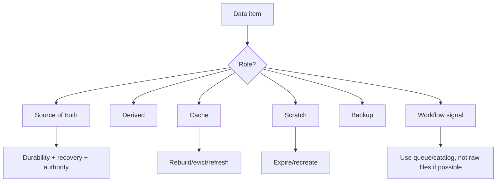
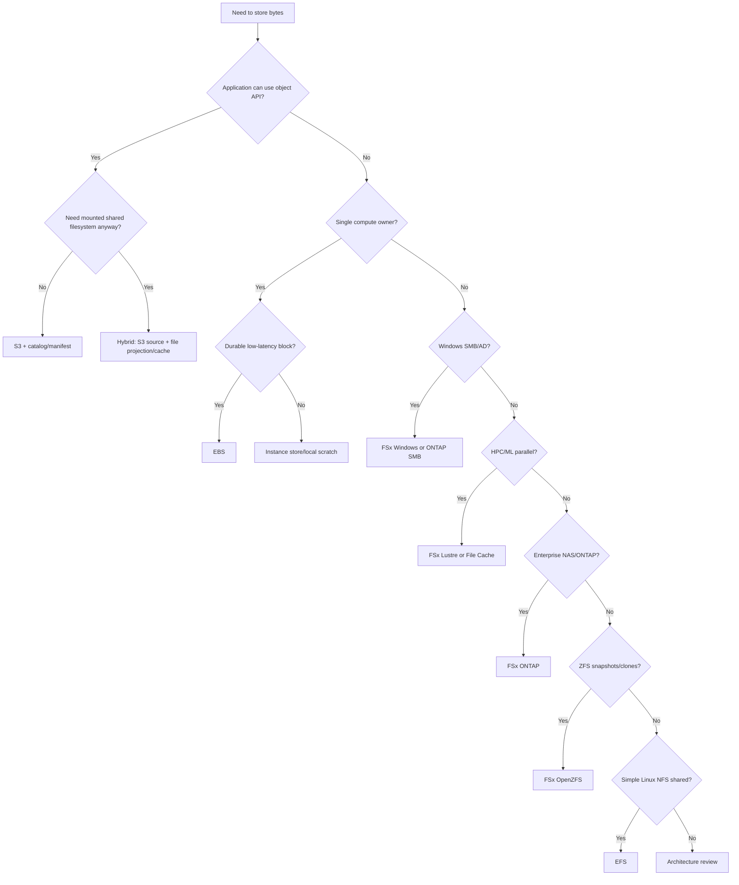
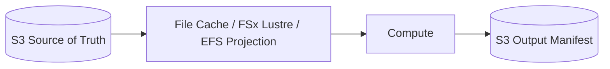
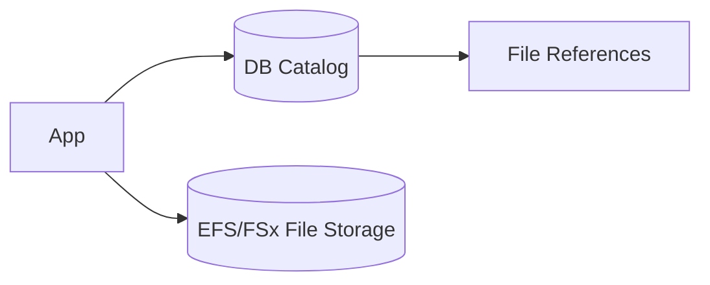
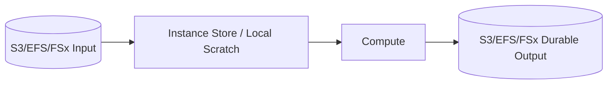
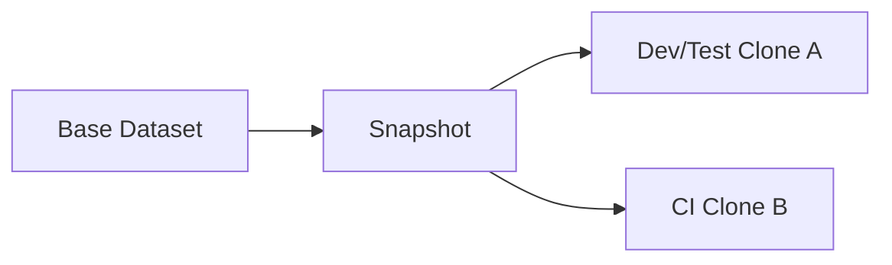
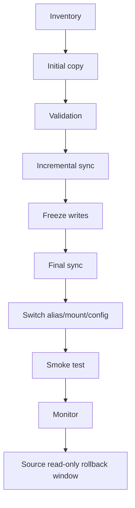

# Part 062 — File Storage Production Patterns and Decision Runbooks

File storage is never just storage.

It is an application contract.

When a system uses files, it usually encodes assumptions about:

- identity
- paths
- permissions
- concurrency
- locks
- atomic rename
- directory listing
- backup
- restore
- lifecycle
- migration
- client operating systems
- local-vs-remote latency
- source-of-truth boundaries

On AWS, you have many storage choices:

- S3 for durable object storage
- EBS for block storage attached to compute
- instance store for ephemeral high-speed local disk
- EFS for elastic Linux NFS shared storage
- FSx for Windows File Server for SMB/AD/Windows ACLs
- FSx for Lustre for HPC/ML high-performance parallel file systems
- FSx for NetApp ONTAP for enterprise NAS/multiprotocol data management
- FSx for OpenZFS for NFS with ZFS snapshots/clones
- Amazon File Cache for high-speed cache over S3/NFS repositories

The hard part is not knowing their names.

The hard part is composing them correctly.

This part closes the file-storage section with production patterns, decision runbooks, anti-patterns, and architecture review tools.

---

## 1. Problem yang Diselesaikan

Part ini menjawab:

- bagaimana memilih EFS vs FSx vs S3 vs EBS vs instance store vs File Cache dalam arsitektur nyata
- bagaimana mendefinisikan source of truth, cache, scratch, backup, dan derived data
- bagaimana shared file storage bisa menjadi hidden database atau hidden queue
- bagaimana merancang file-based workflow yang aman
- bagaimana migration/cutover dilakukan tanpa kehilangan permission/metadata
- bagaimana backup/restore/DR dirancang lintas file services
- bagaimana menghindari small-file/metadata bottleneck
- bagaimana membuat observability dan ownership
- bagaimana menjalankan architecture review untuk file storage workload
- kapan harus modernisasi dari file API ke object/catalog/event pattern

---

## 2. The Core Mental Model

### 2.1 Storage role comes before storage service

Before choosing service, classify data role:

```text
source of truth
derived artifact
cache
scratch
backup
archive
workflow signal
catalog/index
```

Then choose storage.



### 2.2 One path can contain many data roles

Bad:

```text
/mnt/shared/app/
  uploads/
  tmp/
  cache/
  templates/
  reports/
  backups/
```

If cleanup/lifecycle/backup is applied to parent directory, different data roles collide.

Better:

```text
/source/templates/
/source/uploads/
/derived/reports/
/cache/thumbnails/
/scratch/attempts/
/backup-manifests/
```

or separate file systems/buckets.

### 2.3 File system is not a database

A directory listing is not a query engine.

A filename is not a reliable business index.

A file lock is not a distributed transaction manager.

A shared folder is not a queue.

Use files for file payloads. Use database/queue/catalog for business state.

### 2.4 Locality, sharing, and durability are different axes

| Axis | Question |
|---|---|
| locality | should bytes be close to compute? |
| sharing | do multiple clients need same namespace? |
| durability | must data survive failure/deletion? |
| semantics | object, block, file, cache, or database? |
| access | API, mount, SMB, NFS, POSIX, Lustre? |

Do not confuse:

```text
fast local disk
```

with:

```text
durable shared state
```

or:

```text
shared file mount
```

with:

```text
correct multi-writer workflow
```

---

## 3. Service Decision Matrix

### 3.1 Primary decision table

| Workload need | Primary candidate |
|---|---|
| Durable object blobs, lifecycle, events, archive | S3 |
| Single-instance OS/app/database volume | EBS |
| Ephemeral local scratch/cache | Instance store or local ephemeral disk |
| Linux shared NFS, elastic capacity | EFS |
| Windows SMB + AD + NTFS ACL | FSx for Windows File Server |
| HPC/ML parallel file access | FSx for Lustre |
| Enterprise NAS/multiprotocol/NetApp features | FSx for NetApp ONTAP |
| NFS + snapshots/clones/ZFS workflows | FSx for OpenZFS |
| Temporary high-speed cache over S3/NFS | Amazon File Cache |

### 3.2 Source-of-truth matrix

| Source of truth? | Good choices |
|---|---|
| object/source documents | S3 + catalog/versioning/Object Lock if needed |
| Linux shared app files | EFS or FSx depending semantics + backup |
| Windows enterprise files | FSx Windows + AD/backup |
| enterprise NAS | FSx ONTAP |
| NFS ZFS dataset | FSx OpenZFS |
| HPC intermediate | FSx Lustre persistent or S3 checkpoint/export |
| scratch/cache | instance store, EFS temp, FSx scratch, File Cache |
| database data | EBS/managed DB, not generic shared file unless certified |
| backup | AWS Backup/S3/Object Lock/vault/cross-account depending service |

### 3.3 Access pattern matrix

| Access pattern | Avoid | Prefer |
|---|---|---|
| exact object lookup | directory scan | S3/EFS/FSx + catalog |
| analytics scan | SMB/NFS million tiny files | S3 + Parquet/table format |
| multi-writer coordination | shared status files | DB/queue/state machine |
| large ML dataset repeated reads | direct tiny S3 objects or generic NFS | FSx Lustre/File Cache/local shards |
| user home directories | S3 only | EFS/FSx Windows/ONTAP |
| large upload ingestion | proxy through app server | S3 multipart + validation |
| Windows departmental share | EFS | FSx Windows/ONTAP SMB |
| dev/test dataset copy | full file copy every run | OpenZFS/ONTAP snapshots/clones |

### 3.4 Decision tree



---

## 4. Common Production Patterns

### 4.1 Object source + file cache/projection

Use when:

- durable truth is S3
- app/tool needs files
- compute needs local/shared file paths

Pattern:



Rules:

- S3 catalog/manifest is authority
- file layer is cache/projection
- output success requires export/manifest
- file layer can be recreated

### 4.2 Shared app files + metadata catalog

Use when app needs shared file mount but UI/API needs queries.



Rules:

- catalog answers business queries
- file system stores payload
- UI does not scan directories
- backup covers file system and catalog
- consistency between catalog and files is reconciled

### 4.3 File-based ingest with manifest commit

Use when upstream drops files.

```text
incoming/job-123/file.tmp
incoming/job-123/file.done
manifests/job-123.json
```

Rules:

- writer uses temp + rename
- reader processes only done/manifest
- job idempotency exists
- partial files ignored
- directory polling bounded
- queue/event preferred where possible

### 4.4 Local scratch + durable output

Use when compute needs fast temporary storage.



Rules:

- local scratch disposable
- retry can rebuild
- output commit is durable
- disk pressure runbook exists
- cleanup automatic

### 4.5 Enterprise file share migration

Use when moving Windows/NAS workloads.


Rules:

- preserve metadata/permissions
- freeze writes for final sync
- validate ACLs/UID/GID
- cut over via DNS/DFS/mount alias
- source read-only rollback window
- restore test before cutover

### 4.6 Clone-based dev/test

Use when many environments need same baseline.



Rules:

- clone TTL
- sensitive data policy
- owner tag
- cleanup automation
- source snapshot dependency tracked
- cost monitored

---

## 5. Anti-Patterns

### 5.1 Shared filesystem as queue

Bad:

```text
service-a writes files to /queue
service-b polls /queue
service-c deletes processed files
```

Problems:

- duplicate processing
- partial file reads
- directory scan bottleneck
- no visibility timeout
- hard replay
- hidden coupling

Prefer:

- SQS/EventBridge/Step Functions/Kafka
- file storage for payload only
- manifest/cat​​alog for commit

### 5.2 Directory as database

Bad:

```text
list /cases/9231/evidence on every request
```

Prefer:

```text
query catalog by case_id
GET file only when downloading
```

### 5.3 chmod 777 as architecture

Bad:

```bash
chmod -R 777 /mnt/shared
```

Problems:

- data leak
- accidental delete
- hidden UID/GID mismatch
- audit failure

Prefer:

- access points
- AD groups/ACLs
- POSIX UID/GID registry
- least privilege

### 5.4 One file system for every workload

Problems:

- noisy neighbor
- backup mismatch
- lifecycle mismatch
- security blast radius
- cost attribution impossible
- restore too broad

Prefer boundaries by:

- data class
- team
- criticality
- protocol
- lifecycle
- performance profile

### 5.5 Hot analytics over generic file share

Bad:

```text
millions of JSON files on SMB/NFS queried by analytics
```

Prefer:

- S3 data lake
- Parquet/ORC
- Glue/Athena/Spark catalog
- compaction
- table format where needed

### 5.6 Only copy in cache/scratch

Bad:

```text
job output exists only in File Cache or instance store
```

Prefer:

- durable output manifest in S3/EFS/FSx persistent
- export before teardown
- checkpoint policy

### 5.7 Backup without restore test

A backup that is never restored is hope, not a recovery plan.

---

## 6. Source-of-Truth Design

### 6.1 Source-of-truth declaration

For every path/prefix/volume:

```yaml
dataArea:
  path: /services/report/templates
  role: source-of-truth
  owner: report-service
  storage: EFS
  catalog: report_db.templates
  backup: daily-35d
  restoreRTO: 4h
  lifecycle: none
  cleanup: manual approval
```

### 6.2 Derived data declaration

```yaml
dataArea:
  path: /services/report/cache
  role: derived-cache
  owner: report-service
  source: report_db + templates
  rebuild: yes
  cleanup: LRU or older-than-30d
  backup: no
```

### 6.3 Scratch declaration

```yaml
dataArea:
  path: /jobs/job-id/attempt-id/tmp
  role: scratch
  owner: batch-worker
  source: input manifest
  rebuild: retry job
  cleanup: after attempt
  backup: no
```

### 6.4 Backup declaration

```yaml
dataArea:
  path: backup-vault/recovery-points
  role: backup
  owner: platform-storage
  source: EFS/FSx file systems
  retention: 35d daily, 12m monthly
  restoreTest: quarterly
  vaultLock: required for critical systems
```

### 6.5 Catalog consistency

If catalog and file system together form source of truth, backup/restore must handle both.

Example:

```text
DB row references file path/version
file system stores bytes
```

Recovery must restore consistent pair.

Approaches:

- quiesce app before backup
- application-level manifests
- transactional write protocol
- reconciler
- backup time alignment
- restore validation

---

## 7. File Workflow Correctness

### 7.1 Single file commit pattern

```text
write file.tmp
flush/fsync if required
rename file.tmp -> file.final
write/update catalog
```

Readers read only `.final` or catalog references.

### 7.2 Multi-file commit pattern

```text
attempt/job-123/part-0001
attempt/job-123/part-0002
attempt/job-123/_manifest.json
catalog.commit(job-123, manifest)
```

Readers read manifest/catalog.

### 7.3 Directory polling pattern

If unavoidable:

- poll bounded directory
- use done markers
- ignore temp files
- idempotent processing
- move processed files atomically
- maintain processed table
- limit poll frequency
- monitor directory size

### 7.4 File lock pattern

Locks are acceptable only when:

- all clients honor them
- protocol supports them
- stale lock behavior known
- timeout exists
- lock owner visible
- crash recovery tested

For business locks, use database/coordination service.

### 7.5 Partial read prevention

Rules:

- writer writes temp path
- writer closes file
- writer renames
- reader filters final extension/done marker
- manifest includes checksum/size
- reader validates before commit

### 7.6 Idempotent file processor

Processor state:

```json
{
  "processor": "report-parser",
  "inputPath": "/incoming/report-17.pdf",
  "inputVersion": "mtime+size+checksum or version id",
  "status": "SUCCEEDED",
  "outputManifest": "/manifests/report-17.json"
}
```

Do not process same logical input twice unless output is idempotent.

---

## 8. Backup, Restore, and DR

### 8.1 Backup design questions

- What is backed up?
- At what frequency?
- How long retained?
- Where stored?
- Is backup cross-account?
- Is backup immutable?
- Does KMS allow restore?
- Is file system and catalog consistent?
- Is item-level restore needed?
- Is full restore tested?
- Who can delete backups?

### 8.2 Restore design questions

- Restore to same or new file system?
- Restore full file system or selected path?
- How to validate permissions?
- How to cut over clients?
- How to handle files changed after backup?
- How to reconcile catalog?
- What is rollback?
- How to measure RTO?

### 8.3 DR design questions

- Is DR read-only or read-write?
- Is replication used?
- What is RPO?
- What is RTO?
- How are clients remounted?
- How are DNS/DFS aliases switched?
- How is identity system available?
- How is KMS available?
- How is failback handled?

### 8.4 Backup + replication

Use both for critical systems:

| Need | Backup | Replication |
|---|---:|---:|
| point-in-time recovery | strong | weak |
| regional standby | slower | strong |
| accidental delete yesterday | strong | may replicate delete |
| low RTO | maybe weak | strong |
| ransomware/operator mistake | strong with retention/lock | maybe weak |
| fast failover | no | yes |

### 8.5 Restore game day checklist

- [ ] Pick real recovery point.
- [ ] Restore to isolated target.
- [ ] Mount from real client type.
- [ ] Validate file content.
- [ ] Validate permissions.
- [ ] Validate application smoke test.
- [ ] Validate catalog consistency.
- [ ] Measure RTO.
- [ ] Document gaps.

---

## 9. Migration and Cutover

### 9.1 Migration is not copy

Migration must preserve or intentionally transform:

- content
- paths
- metadata
- permissions
- ACLs
- UID/GID
- timestamps
- symlinks
- hard links
- case sensitivity
- hidden files
- shares/exports
- quotas
- snapshots/versions if needed
- application state

### 9.2 Migration method selection

| Source -> Target | Common method |
|---|---|
| on-prem NFS -> EFS/OpenZFS/ONTAP | DataSync/rsync |
| on-prem SMB -> FSx Windows/ONTAP | DataSync/Robocopy |
| NetApp -> FSx ONTAP | SnapMirror/DataSync |
| S3 -> file cache/Lustre | data repository association |
| EFS -> EFS | DataSync/backup restore |
| FSx -> FSx | native replication/backup/DataSync depending type |

### 9.3 Cutover pattern



### 9.4 Cutover abstraction

Use:

- DNS alias
- DFS namespace
- mount path abstraction
- config parameter
- Kubernetes PV abstraction
- application storage endpoint config

Avoid hardcoded physical endpoint.

### 9.5 Migration validation

Minimum:

- file count
- bytes
- sample checksums
- permission/effective access
- app read/write
- performance smoke test
- backup enabled on target
- rollback tested

---

## 10. Observability Standard

### 10.1 File system metrics

Track:

- capacity used
- capacity free
- throughput
- IOPS
- latency
- client connections
- metadata operations
- burst credits or percent I/O limit where applicable
- backup status
- replication status
- snapshot count
- clone count
- storage class/tier distribution
- mount errors
- permission errors

### 10.2 Application file metrics

Track:

- open latency
- read latency
- write latency
- stat latency
- list duration
- files per directory
- file count created/deleted
- lock wait
- failed writes
- temp file age
- processing lag
- cleanup results
- restore validation results

### 10.3 Cost metrics

Track:

- storage GB
- backup GB
- snapshot/clone growth
- provisioned throughput/IOPS
- idle file systems
- cache lifetime
- data transfer
- cross-AZ access
- retrieval/recall/tiering cost
- request cost if S3 is involved

### 10.4 Governance metrics

Track:

- paths without owner
- broad permissions
- root-owned files where unexpected
- stale clones
- expired temp directories
- backup age
- restore test age
- orphaned file systems
- untagged file systems
- public/broad network exposure

### 10.5 Dashboard by owner

Every service/team should see:

```text
their storage usage
their growth rate
their backup status
their cleanup failures
their cost
their restore test status
their top hot paths
```

Shared storage without ownership becomes invisible cost.

---

## 11. Architecture Review Template

Use this for every file-storage request.

```yaml
request:
  workloadName:
  owner:
  environment:
  requiredProtocol:
  clientOS:
  computeServices:
  dataRole:
  sourceOfTruth:
  expectedCapacity:
  fileCount:
  avgFileSize:
  p95FileSize:
  readWriteRatio:
  concurrency:
  metadataOps:
  latencySLO:
  throughputSLO:
  availabilitySLO:
  rpo:
  rto:
  permissionsModel:
  identitySource:
  backupRequired:
  replicationRequired:
  lifecycleRequired:
  migrationSource:
  cutoverWindow:
  costOwner:
```

Review questions:

1. Does this need file semantics?
2. Can S3 + catalog solve it better?
3. Is this source-of-truth, cache, scratch, or derived?
4. What happens if the file system is unavailable?
5. What happens if a file is deleted?
6. What happens if many clients write concurrently?
7. What happens if directory has 10 million files?
8. What is the restore path?
9. What is the cleanup owner?
10. How is cost isolated?

---

## 12. Production Runbooks

### 12.1 "Application file access is slow"

1. Identify service, path, storage service.
2. Identify operation: open/read/write/list/stat/lock.
3. Check file count and directory size.
4. Check throughput/IOPS/latency metrics.
5. Check client network/AZ.
6. Check permission/identity errors.
7. Check backup/snapshot/tiering activity.
8. Check noisy neighbor.
9. Remove directory scan or metadata storm.
10. Scale/tune storage if workload fit remains valid.

### 12.2 "File disappeared"

1. Check path and exact filename.
2. Check recent cleanup/deploy.
3. Check backup/snapshot.
4. Check catalog reference.
5. Check permissions hiding file.
6. Check version/snapshot if service supports.
7. Restore to staging.
8. Validate and copy back.
9. Patch cleanup/permission/writer bug.

### 12.3 "Permission denied"

1. Identify identity model: POSIX, AD/ACL, access point, export policy.
2. Check client identity.
3. Check share/export/access point.
4. Check file ownership/mode/ACL.
5. Check recent image/user/group migration.
6. Test minimal access.
7. Fix identity source or policy.
8. Add regression test.

### 12.4 "Storage cost spike"

1. Break down by service/file system.
2. Identify top directories/volumes/shares.
3. Check snapshots/clones/backups.
4. Check cache idle time.
5. Check noncurrent versions if S3 involved.
6. Check lifecycle/tiering.
7. Check temp/scratch accumulation.
8. Notify owner.
9. Delete only disposable data with approval.
10. Add alarm/cleanup.

### 12.5 "Migration failed"

1. Identify failed path/type.
2. Check copy logs.
3. Check permissions/ACL/UID.
4. Check active writes.
5. Check symlinks/hard links/long path.
6. Re-run incremental sync.
7. Validate app.
8. Delay cutover if semantics mismatch.
9. Update migration plan.

### 12.6 "DR failover needed"

1. Declare incident and freeze source writes if possible.
2. Check latest backup/replica.
3. Choose recovery point.
4. Restore/promote destination.
5. Validate identity/KMS/network.
6. Remount/switch clients.
7. Run app smoke tests.
8. Monitor.
9. Record data-loss window.
10. Start failback plan.

---

## 13. Modernization Paths

### 13.1 File share to object store

When:

- files are immutable blobs
- access is by ID
- lifecycle/archive needed
- sharing is via application, not filesystem
- massive scale needed

Pattern:

```text
old: /shared/uploads/<file>
new: S3 blob + DB catalog + presigned download
```

### 13.2 Directory polling to event queue

When:

- directory is used as workflow queue
- duplicate/partial processing occurs
- scaling issues

Pattern:

```text
old: poll /incoming
new: upload event -> SQS/EventBridge -> processor -> manifest/catalog
```

### 13.3 File metadata to database

When:

- UI/API lists and filters files
- directory scan hot path
- permission queries expensive

Pattern:

```text
file payload remains file storage
metadata moves to database
```

### 13.4 Shared config file to config service

When:

- multiple nodes read/write config
- partial config issue
- reload semantics unclear

Use:

- SSM Parameter Store
- AppConfig
- Secrets Manager
- database config table
- versioned S3 config object with explicit reload

### 13.5 Shared cache to local/cache service

When:

- cache poisoning
- metadata storms
- high churn

Use:

- local instance store cache
- Redis/ElastiCache
- S3 immutable artifacts
- build-cache service
- content-addressed cache

---

## 14. Case Study — Legacy Monolith Shared Files Modernization

### 14.1 Initial architecture

Monolith uses:

```text
/mnt/shared/uploads
/mnt/shared/tmp
/mnt/shared/reports
/mnt/shared/config
```

Problems:

- UI lists directories
- cleanup deletes wrong files
- reports and uploads mixed
- config file updated by hand
- backup restores too broad
- scaling app servers causes metadata load

### 14.2 Step 1: classify data

```text
uploads = source-of-truth blobs
tmp = scratch
reports = derived artifacts
config = application configuration
```

### 14.3 Step 2: assign target storage

```text
uploads -> S3 + catalog + versioning
tmp -> local scratch / EFS temp with TTL
reports -> S3 exports + manifest, or EFS if app requires mount
config -> AppConfig/SSM
```

### 14.4 Step 3: transition safely

- write new uploads to S3
- keep compatibility projection on EFS if legacy path required
- catalog all files
- change UI to query catalog
- cleanup only temp path
- report generation writes manifest
- backup scope reduced
- eventually remove shared upload dependency

### 14.5 Invariant

```text
A file path is no longer the business database.
```

---

## 15. Case Study — ML Platform Storage Composition

### 15.1 Requirements

- raw datasets durable
- training needs high throughput
- checkpoints recoverable
- experiments reproducible
- final models durable and versioned
- cost controlled between campaigns

### 15.2 Storage design

```text
S3: dataset source + manifests + model registry artifacts
FSx for Lustre or File Cache: training acceleration
Instance store: per-node scratch/cache
EBS: trainer host OS/logs if needed
Catalog: experiments, dataset versions, checkpoint refs
```

### 15.3 Job success definition

```text
dataset manifest read
training completed
checkpoint policy satisfied
model artifact exported to S3
model manifest committed
experiment catalog updated
temporary file systems cleaned
```

### 15.4 Invariant

```text
Fast storage accelerates training.
Durable manifests define reproducibility.
```

---

## 16. Case Study — Enterprise Department Share

### 16.1 Requirements

- Windows users
- AD groups
- NTFS ACL
- previous versions
- daily backup
- migration from on-prem Windows server

### 16.2 Storage design

```text
FSx for Windows File Server
DFS namespace
AD group-based ACL
shadow copies
AWS Backup/manual backups
DataSync/Robocopy migration
```

### 16.3 Invariant

```text
Windows identity and ACL semantics are the workload.
```

Do not force this into EFS or S3 unless modernizing the app.

---

## 17. File Storage Section Summary

Across Parts 052–062, the file-storage lesson is:

> File storage is a distributed application interface. Protocol, identity, metadata, locking, backup, and restore are first-class architecture concerns.

Key invariants:

1. Choose file storage because file semantics are required.
2. Do not use shared files as hidden queue/database.
3. Catalog business metadata.
4. Use manifests for multi-file commit.
5. Keep source-of-truth, cache, scratch, and derived data separate.
6. Use access points/shares/volumes as ownership boundaries.
7. Test permissions with real clients.
8. Test restore before trusting backup.
9. Design migration as semantic validation, not byte copy.
10. Make cleanup path-scoped and owner-approved.
11. Monitor file count, metadata operations, and directory scans—not just throughput.
12. Do not leave expensive cache/HPC file systems idle.
13. Keep durable truth outside disposable cache/scratch.
14. Align service choice with protocol and workload semantics.

---

## 18. What Comes Next

Next section: **Backup, Disaster Recovery, and Data Protection Across Compute and Storage**.

We will connect everything:

- EC2/EBS snapshots
- AMI backup
- S3 versioning/Object Lock/replication
- EFS backup/replication
- FSx backup/snapshots
- AWS Backup
- cross-account/cross-region recovery
- restore testing
- ransomware-resilient design
- RPO/RTO modeling
- game days
- production recovery runbooks

Because top-tier engineers are not only good at building systems.

They are good at bringing them back.

---

## References

- AWS Decision Guide — Choosing an AWS storage service: https://docs.aws.amazon.com/decision-guides/latest/storage-on-aws-how-to-choose/choosing-aws-storage-service.html
- Amazon EC2 User Guide — Storage options for your EC2 instances: https://docs.aws.amazon.com/AWSEC2/latest/UserGuide/Storage.html
- Amazon EFS User Guide — How Amazon EFS works: https://docs.aws.amazon.com/efs/latest/ug/how-it-works.html
- Amazon FSx Documentation: https://docs.aws.amazon.com/fsx/
- Amazon File Cache User Guide — What is Amazon File Cache?: https://docs.aws.amazon.com/fsx/latest/FileCacheGuide/what-is.html
- Amazon S3 User Guide — Amazon S3 data consistency model: https://docs.aws.amazon.com/AmazonS3/latest/userguide/Welcome.html#ConsistencyModel
- Amazon S3 User Guide — S3 Event Notifications: https://docs.aws.amazon.com/AmazonS3/latest/userguide/EventNotifications.html
- Amazon EFS User Guide — Backing up and replicating data in Amazon EFS: https://docs.aws.amazon.com/efs/latest/ug/backup-replication.html
- AWS Backup Developer Guide — What is AWS Backup?: https://docs.aws.amazon.com/aws-backup/latest/devguide/whatisbackup.html
- AWS Well-Architected SAP Lens — Evaluate Amazon EFS and Amazon FSx performance characteristics: https://docs.aws.amazon.com/wellarchitected/latest/sap-lens/best-practice-14-3.html
