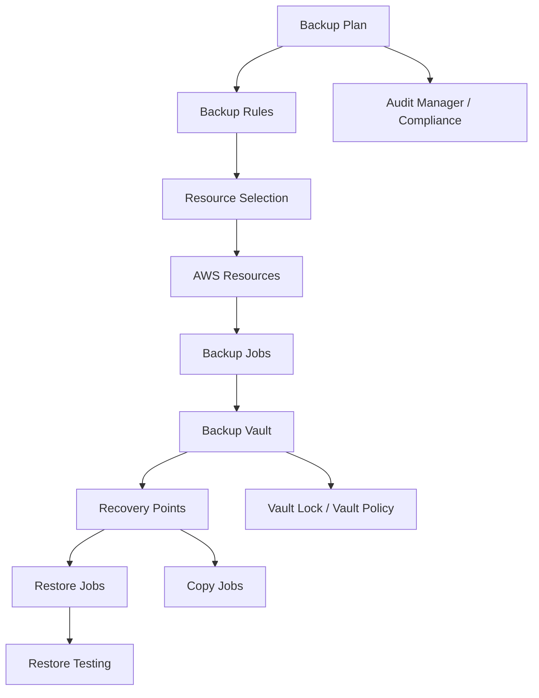
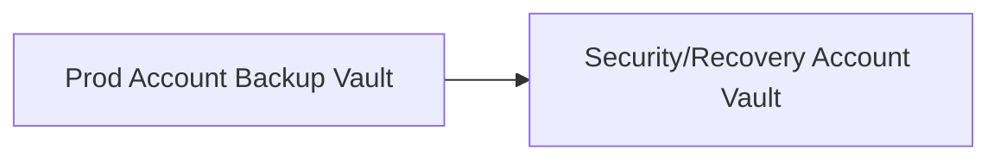
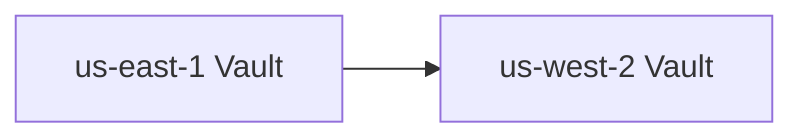

# Part 064 — AWS Backup Control Plane and Operating Model

AWS Backup is not simply "a button that backs up everything."

It is a centralized backup control plane.

It gives you a way to define backup policies, select resources, store recovery points in vaults, copy backups across accounts and Regions, apply retention, protect backups with Vault Lock, test restores, audit compliance, and operate data protection across many AWS services.

That centralization is powerful.

It also introduces operating-model questions:

- who owns backup plans?
- how are resources selected?
- how are data classes mapped to retention?
- where do recovery points live?
- who can delete recovery points?
- which backups are copied cross-account?
- which backups are copied cross-region?
- which backups are immutable?
- who can restore?
- how is restore tested?
- how are KMS keys handled?
- how are backup failures escalated?
- how is compliance proven?

This part turns the recovery mental model from Part 063 into an AWS Backup implementation model.

---

## 1. Problem yang Diselesaikan

Part ini membahas:

- AWS Backup core primitives
- backup plan
- backup rule
- backup selection
- backup vault
- recovery point
- lifecycle and cold storage
- cross-region and cross-account copy
- backup vault access policy
- Vault Lock
- logically air-gapped vault
- restore testing
- AWS Backup Audit Manager
- supported resource considerations
- KMS/encryption
- IAM/service roles
- Terraform/IaC patterns
- runbooks for failed backup, failed copy, failed restore, unprotected resource, vault lock mistake, and KMS restore denial

---

## 2. Mental Model

### 2.1 AWS Backup is policy + vault + restore workflow



Core idea:

```text
Plans decide what and when.
Vaults store recovery points.
Restore jobs prove the plan works.
```

### 2.2 Backup plan is policy

Backup plan defines:

- schedule
- backup window
- lifecycle/retention
- target vault
- copy actions
- continuous backup where supported
- advanced settings for some resource types

A backup plan should reflect data class, not random service grouping.

### 2.3 Backup selection is scope

Selection defines which resources are included.

Selection can be based on:

- explicit resource ARNs
- tags
- conditions
- service-specific options
- organization policies if using AWS Organizations features

Tag-based selection is powerful but dangerous if tags drift.

### 2.4 Backup vault is protection boundary

A vault is a logical container for recovery points.

Vault design controls:

- access policy
- KMS encryption context
- retention enforcement
- lock configuration
- cross-account sharing/copy
- audit boundary
- data class boundary

Do not dump every backup into one vault unless the retention/security model is identical.

### 2.5 Recovery point is restore inventory

A recovery point is the actual restorable backup artifact.

Operators need to find:

- which resource
- backup time
- vault
- lifecycle state
- encryption
- status
- resource type
- copy status
- restore metadata
- retention

If recovery points are not discoverable, recovery slows.

---

## 3. Core AWS Backup Primitives

### 3.1 Backup plan

A backup plan contains rules.

Example policy concept:

```yaml
plan: gold-critical
rules:
  - name: hourly
    schedule: every 1 hour
    startWindow: 1h
    completionWindow: 4h
    lifecycle:
      moveToCold: not for resources requiring fast restore
      deleteAfter: 35d
    targetVault: gold-prod
    copyActions:
      - destinationVault: security-account-gold
        region: us-west-2
        deleteAfter: 35d
```

### 3.2 Backup rule

A rule defines schedule and lifecycle.

Key decisions:

- frequency
- start window
- completion window
- retention
- cold storage transition
- target vault
- copy actions
- continuous backup where supported

### 3.3 Backup selection

Selection maps resources to plan.

Tag-based example:

```text
BackupTier = Gold
Environment = Prod
```

Potential problem:

```text
critical resource missing tag = no backup
```

Guardrail:

- AWS Config / Audit Manager
- tag enforcement
- resource inventory diff
- backup coverage dashboard
- break-glass on-demand backup for newly discovered critical resources

### 3.4 Backup vault

Vault examples:

```text
prod-gold-standard
prod-silver-standard
prod-gold-cross-account
prod-gold-airgapped
dev-short-retention
```

Vault per data class can simplify:

- retention
- access
- lock
- cost
- copy
- audit

### 3.5 Recovery point

A recovery point has lifecycle and status.

Operators should know:

```bash
aws backup list-recovery-points-by-backup-vault \
  --backup-vault-name prod-gold-standard
```

and:

```bash
aws backup describe-recovery-point \
  --backup-vault-name prod-gold-standard \
  --recovery-point-arn "$ARN"
```

### 3.6 Restore job

Restore is resource-specific. Metadata required to restore differs by resource type.

AWS Backup provides APIs such as `GetRecoveryPointRestoreMetadata`, and restore testing can infer needed metadata for restore jobs with secure defaults.

Do not assume restore metadata is obvious during an incident.

---

## 4. Supported Resource Model

### 4.1 AWS Backup supports many services

AWS Backup supports centralized backup for many AWS resource types, including compute/storage/database services. Supported services and feature availability can vary by Region/resource and change over time.

Always check current supported resource matrix.

For compute and storage topics in this course, relevant integrations include resource families such as:

- Amazon EBS
- Amazon EC2
- Amazon EFS
- Amazon FSx
- Amazon S3
- AWS Storage Gateway
- database services such as RDS/Aurora/DynamoDB where relevant to application state

### 4.2 Feature availability differs

Not every resource supports every AWS Backup feature.

Feature dimensions include:

- scheduled backup
- continuous backup/PITR
- cross-region copy
- cross-account copy
- lifecycle to cold storage
- restore testing support
- item-level restore
- independent backup encryption
- backup index/search
- malware scanning integration

Do not copy/paste one backup policy for all resources.

### 4.3 Resource-native backups still matter

AWS Backup centralizes policy/control, but service-native details remain important.

Examples:

- EBS application consistency may need SSM/VSS/pre-post scripts.
- S3 versioning/Object Lock may still be needed.
- EFS access points/mount targets need IaC recreation after data restore.
- FSx family restore behavior differs by file system type.
- RDS/Aurora PITR has database-specific semantics.

AWS Backup is control plane, not a replacement for understanding data semantics.

---

## 5. Backup Plan Design by Tier

### 5.1 Tier model

Example:

| Tier | RPO | Retention | Copy | Lock | Restore test |
|---|---:|---:|---|---|---|
| Platinum | <= 15 min / continuous | 35d + monthly | cross-account + cross-region | required | monthly |
| Gold | hourly/daily | 35d | cross-account | required for prod | quarterly |
| Silver | daily | 14–35d | optional | optional | semiannual |
| Bronze | weekly/daily | 7–14d | no | no | annual/sample |
| None | no backup | n/a | n/a | n/a | n/a |

### 5.2 Tier assignment

Use tags:

```yaml
BackupTier: Gold
DataClass: shared-app-files
Environment: prod
Owner: report-service
RPO: 24h
RTO: 4h
```

But tags are not enough. Back them with audit.

### 5.3 Plan per tier

Do not create a custom backup plan per tiny service unless there is a real policy difference.

Common approach:

- `prod-platinum`
- `prod-gold`
- `prod-silver`
- `nonprod-short`
- `sandbox-none`

### 5.4 Data class exceptions

Examples:

- EFS source-of-truth file system in Gold
- EFS cache file system excluded
- FSx Windows finance share in Platinum/Gold
- S3 evidence bucket protected by S3 versioning/Object Lock plus AWS Backup
- EBS database volume excluded from generic backup because DB-native backup used

Document exceptions.

### 5.5 Backup windows

Schedule backups considering:

- write load
- maintenance windows
- batch windows
- backup job duration
- application consistency scripts
- cross-region copy time
- downstream restore testing windows

---

## 6. Vault Design

### 6.1 Vault by data class/security

Example vaults:

```text
prod-gold
prod-platinum
prod-regulated
prod-cross-account-copy
prod-airgapped
nonprod-short
```

Each vault can have:

- access policy
- KMS key
- Vault Lock
- retention expectations
- monitoring
- recovery ownership

### 6.2 Vault access policy

Vault policy can restrict:

- who can create recovery points
- who can copy into vault
- who can restore
- who can delete recovery points
- cross-account access

Production default:

- application roles do not delete recovery points
- restore role separate from backup creation role
- security account controls protected vault
- deletion heavily restricted

### 6.3 Vault Lock

Vault Lock helps enforce retention and prevent deletion/alteration of vault configuration after lock is active and grace period passes in compliance mode.

Use for:

- ransomware-resilient backups
- compliance retention
- critical production recovery points

Caution:

- wrong retention can be difficult/impossible to change after compliance lock
- test with non-prod
- legal/security approval required
- understand governance vs compliance lock behavior

### 6.4 Logically air-gapped vault

A logically air-gapped vault is a specialized vault with additional security and sharing designed to support recovery. It stores primary backups or copies that were initially created in standard backup vaults.

Use when:

- recovery isolation is a requirement
- backups should be shared for restore under controlled conditions
- RTO improvement through secure sharing matters
- ransomware resilience posture requires stronger vault isolation

### 6.5 Vault separation anti-pattern

Bad:

```text
one default vault for dev, prod, regulated, scratch, and critical workloads
```

Problems:

- same access policy
- same retention
- same lock posture
- poor audit
- accidental deletion risk
- cost visibility poor

Better:

```text
vault boundary follows protection boundary
```

---

## 7. Cross-Account and Cross-Region Copy

### 7.1 Why cross-account

Cross-account copy protects against source-account compromise and operational mistakes.

Pattern:



Benefits:

- separate administrators
- separate vault policy
- separate KMS key
- stronger blast-radius isolation
- recovery account can restore independently if designed

### 7.2 Why cross-region

Cross-region copy protects against regional failure or regional operational impairment.

Pattern:



### 7.3 Copy action design

For each copy action:

- destination Region
- destination account
- destination vault
- retention
- lifecycle
- KMS key
- resource support
- completion monitoring
- restore test target

### 7.4 Copy is not instant

Cross-region/cross-account copy takes time. RPO depends on backup creation and copy completion.

Track:

- backup job completed
- copy job started
- copy job completed
- latest copied recovery point
- copy failure

### 7.5 Destination restore readiness

Destination backup is only useful if:

- destination account can restore
- KMS works
- VPC/subnets/security groups exist or can be created
- IAM roles exist
- service quotas allow restore
- application config can point to restored resources

### 7.6 Copy support differs

Feature availability varies by resource type. Always verify that your resource supports cross-account/cross-region copy and lifecycle behavior needed.

---

## 8. Restore Testing

### 8.1 AWS Backup restore testing

AWS Backup supports restore testing plans. You create a restore testing plan with name, frequency, and target start time, then assign resources/recovery point selection. AWS Backup can infer metadata required for restore jobs.

This is a major operational primitive.

It turns restore from:

```text
manual annual panic
```

into:

```text
scheduled control with validation hooks
```

### 8.2 Restore testing plan

A restore testing plan should define:

- frequency
- target start time
- recovery point selection
- included resource types
- restore target
- cleanup behavior
- validation process
- failure notification

### 8.3 Validation

Restore testing validation can include Lambda-based validation or custom checks.

Validation should prove:

- resource exists
- app role can access
- data is readable
- KMS decrypt works
- expected files/records exist
- basic app smoke test passes
- restored resource cleaned up after test

### 8.4 Test random recovery points

Testing only the newest backup can miss older lifecycle/cold restore issues.

Include:

- latest recovery point
- random recovery point
- cold-storage recovery point when applicable
- cross-account copy
- cross-region copy
- critical resource sample

### 8.5 Restore testing evidence

Store:

```yaml
restoreTest:
  plan:
  resource:
  recoveryPoint:
  restoreJob:
  validationResult:
  duration:
  rtoMeasured:
  failureReason:
  cleanupStatus:
```

### 8.6 Restore testing anti-patterns

Bad:

- restore test starts but no validation
- restore to production accidentally
- restored resource not cleaned
- KMS not validated
- application not tested
- only one resource type tested
- no alert on failed restore test

---

## 9. AWS Backup Audit Manager

### 9.1 Purpose

AWS Backup Audit Manager helps audit backup activity and compliance against controls.

Use it to evaluate:

- resources protected by backup plan
- backup frequency
- backup retention
- cross-account/cross-region copy
- vault lock usage
- backup jobs completed
- restore testing controls
- policy compliance

### 9.2 Control mapping

Example controls:

```text
prod resources have backup plan
critical resources copied cross-account
regulated resources stored in locked vault
backup retention >= required minimum
restore testing executed within required period
```

### 9.3 Audit output

Use audit reports for:

- security review
- compliance evidence
- operational drift
- engineering scorecards
- quarterly recovery readiness

### 9.4 Audit is not restore

Audit Manager can show policy compliance, but it does not prove application works after restore unless validation does.

Use both:

```text
audit coverage + restore testing + app validation
```

---

## 10. Encryption and KMS

### 10.1 Backup encryption depends on resource type

AWS Backup encryption behavior differs by resource type. Some backups use source resource encryption, while others can be independently encrypted by AWS Backup.

Always check resource-specific encryption behavior.

### 10.2 KMS key strategy

For critical backups:

- customer managed key
- recovery account key
- destination region key
- strict key deletion controls
- restore role decrypt tested
- backup service role allowed
- cross-account key policy tested

### 10.3 KMS failure mode

Backup exists but restore fails because:

- key disabled
- key scheduled deletion
- restore role lacks decrypt
- destination key policy wrong
- source key not accessible cross-account
- organization SCP denies decrypt
- grant missing/expired

### 10.4 KMS game day

Test:

- restore encrypted resource
- restore in recovery account
- restore in destination Region
- restore with least-privilege recovery role
- detect key disabled scenario in non-prod

### 10.5 Key retention

Do not delete KMS keys required to decrypt old backups.

Key deletion can make recovery points unusable.

---

## 11. IAM and Roles

### 11.1 Backup service role

AWS Backup needs service role permissions to back up and restore resources.

Use least privilege where possible, but ensure it covers required resource types.

### 11.2 Restore operator role

Separate role for restore operations.

Why:

- backup creation is routine
- restore is high-risk
- restore can create resources/cost
- restore can expose sensitive data
- restore needs KMS decrypt

### 11.3 Backup administrator role

Controls:

- backup plans
- vaults
- vault policies
- restore testing
- copy actions
- audit reports

Restrict changes.

### 11.4 Security/recovery account roles

For cross-account protected backups:

- source account can copy into recovery vault
- source account cannot delete protected recovery points
- recovery account can restore under controlled approval
- KMS policies align

### 11.5 Permissions to monitor

Alert on changes to:

- backup plan
- backup selection
- vault policy
- vault lock
- KMS key
- IAM roles
- copy action
- restore testing plan
- backup organization policy

---

## 12. Terraform/IaC Patterns

### 12.1 Backup vault

```hcl
resource "aws_backup_vault" "gold" {
  name        = "prod-gold"
  kms_key_arn = aws_kms_key.backup.arn

  tags = {
    Environment = "prod"
    BackupTier  = "gold"
  }
}
```

### 12.2 Backup plan

```hcl
resource "aws_backup_plan" "gold" {
  name = "prod-gold"

  rule {
    rule_name         = "daily-35d"
    target_vault_name = aws_backup_vault.gold.name
    schedule          = "cron(0 5 ? * * *)"

    start_window      = 60
    completion_window = 240

    lifecycle {
      delete_after = 35
    }

    copy_action {
      destination_vault_arn = var.security_account_vault_arn

      lifecycle {
        delete_after = 35
      }
    }
  }
}
```

### 12.3 Backup selection by tag

```hcl
resource "aws_backup_selection" "gold_by_tag" {
  name         = "prod-gold-by-tag"
  iam_role_arn = aws_iam_role.aws_backup.arn
  plan_id      = aws_backup_plan.gold.id

  selection_tag {
    type  = "STRINGEQUALS"
    key   = "BackupTier"
    value = "Gold"
  }
}
```

### 12.4 Vault lock concept

```hcl
resource "aws_backup_vault_lock_configuration" "gold" {
  backup_vault_name = aws_backup_vault.gold.name

  min_retention_days = 7
  max_retention_days = 365
}
```

Compliance mode/grace period behavior and provider support must be validated before production.

### 12.5 Restore testing IaC

Restore testing can be managed through API/CloudFormation/Terraform support depending provider/version. Model it as code even if implementation uses SDK/CLI.

Policy:

```yaml
restoreTesting:
  tier: Gold
  frequency: quarterly
  recoveryPointSelection: random-latest-mix
  validation: lambda-app-smoke-test
  cleanup: required
```

---

## 13. Operational Runbooks

### 13.1 Backup job failed

1. Identify resource, vault, plan, rule.
2. Check error message.
3. Check service role permissions.
4. Check resource state.
5. Check KMS key.
6. Check service quota.
7. Run on-demand backup if RPO at risk.
8. Alert owner if RPO breached.
9. Patch plan/role/resource.
10. Verify next backup success.

### 13.2 Copy job failed

1. Identify source recovery point.
2. Check destination vault/account/Region.
3. Check destination vault policy.
4. Check KMS key policies.
5. Check feature support for resource.
6. Retry copy if safe.
7. Alert if cross-account/region RPO breached.
8. Test restore from latest successful copy.

### 13.3 Restore job failed

1. Identify recovery point.
2. Get restore metadata.
3. Check restore role permissions.
4. Check KMS decrypt.
5. Check target VPC/subnet/security group.
6. Check resource quotas.
7. Check resource-specific restore constraints.
8. Retry to isolated target.
9. Escalate if RTO threatened.

### 13.4 Resource unprotected

1. Determine data class.
2. Check tags/backup selection.
3. Add correct tag or explicit ARN selection.
4. Create on-demand backup if critical.
5. Add IaC/policy guardrail.
6. Review similar resources.
7. Update coverage dashboard.

### 13.5 Recovery point deletion attempted

1. Identify actor and recovery point.
2. Check if deletion succeeded/failed.
3. Verify vault lock/policy.
4. Preserve CloudTrail evidence.
5. Rotate/disable compromised credentials if suspicious.
6. Validate remaining recovery points.
7. Escalate security incident if malicious.

### 13.6 Vault Lock mistake

If in test/grace period:

1. Stop changes.
2. Review retention settings.
3. Delete/update lock if still allowed.
4. Recreate after approval.

If compliance mode lock is final:

1. Escalate to legal/security/platform.
2. Document retention/cost implication.
3. Prevent future writes to wrong vault.
4. Create corrected vault/policy.
5. Wait until retention permits where applicable.

### 13.7 KMS denied restore

1. Identify key used by recovery point.
2. Check key status.
3. Check key policy.
4. Check restore role principal.
5. Check destination account/Region.
6. Check grants/SCPs.
7. Test decrypt with minimal action.
8. Use alternate copy/key if available.
9. Add key monitoring.

---

## 14. Dashboards and Alarms

### 14.1 Backup operations dashboard

Show:

- backup jobs by status
- copy jobs by status
- restore jobs by status
- restore testing results
- failed jobs by resource type
- average backup duration
- recovery point age
- resources protected vs unprotected
- vault utilization
- cold storage recovery points

### 14.2 RPO dashboard

For every critical workload:

```text
latest successful backup
latest successful cross-account copy
latest successful cross-region copy
latest successful restore test
actual RPO
RPO target
breach status
```

### 14.3 Vault security dashboard

Show:

- vault lock status
- vault policy changes
- recovery point delete attempts
- cross-account access
- KMS key status
- backup plan changes
- restore role usage
- logically air-gapped vault access requests

### 14.4 Restore readiness dashboard

Show:

- restore test pass/fail
- last restore test date
- average restore duration
- validation failure reasons
- KMS failures
- resource-specific restore gaps
- cleanup failures
- RTO measured

### 14.5 Cost dashboard

Show:

- backup storage by vault
- copy storage by account/region
- cold storage
- restore testing cost
- restore data processed
- unused long-retention backups
- non-prod backup cost
- cross-region data transfer

---

## 15. Governance and Operating Model

### 15.1 Ownership model

Roles:

| Role | Owns |
|---|---|
| application owner | data classification, RPO/RTO, validation |
| platform/storage team | backup platform, vaults, automation |
| security team | immutable vaults, recovery account, incident policy |
| compliance/legal | retention requirements |
| SRE/on-call | restore runbook execution |
| finance | cost review |

### 15.2 Policy as code

Backup policy should be code:

- backup plans
- vaults
- vault policies
- selections
- KMS keys
- cross-account copy
- restore testing plans
- audit controls

Manual backup console setup drifts.

### 15.3 Exception process

Some resources should not be backed up:

- scratch
- cache
- derived data
- non-prod disposable
- recreated by IaC

But exceptions need:

```yaml
resource:
reason:
owner:
rebuildPath:
approval:
expiry:
```

### 15.4 Periodic review

Monthly:

- unprotected critical resources
- failed backup jobs
- copy failures
- restore test failures
- resources with no recent restore
- backup cost growth
- vault lock status
- KMS key deletion schedules

Quarterly:

- game day
- RPO/RTO review
- retention policy review
- cross-account restore test

---

## 16. Common Anti-Patterns

### 16.1 Tag-based selection without tag governance

Critical resources miss backups because tag absent or misspelled.

Fix:

- tag policy
- config rule
- coverage report
- default-deny deployment if missing data protection tag

### 16.2 One vault for everything

Fix:

- vault per data class/security boundary
- separate prod/nonprod
- locked vault for critical data

### 16.3 Backup plan without restore testing

Fix:

- scheduled restore testing
- app validation
- RTO/RPO evidence

### 16.4 Cross-region copy without recovery environment

Backup exists in Region B, but no VPC/KMS/IAM/app exists to restore.

Fix:

- recovery environment IaC
- game day restore in destination

### 16.5 KMS key deleted

Fix:

- key deletion guardrails
- recovery key tests
- alert on ScheduleKeyDeletion/DisableKey

### 16.6 Vault Lock applied blindly

Fix:

- legal/security review
- non-prod test
- short trial
- retention class model

### 16.7 Backing up cache/scratch heavily

Fix:

- classify data role
- exclude disposable data
- store durable outputs elsewhere

### 16.8 Assuming AWS Backup solves application consistency

Fix:

- database/application pre/post scripts
- VSS where needed
- manifest/cat​​alog consistency
- application smoke test

---

## 17. Game Day Scenarios

### Scenario 1 — Restore EBS-backed app

Expected:

- find recovery point
- restore EBS volume
- attach to test instance
- validate app files
- measure RTO

### Scenario 2 — Restore EFS path

Expected:

- item-level restore or full restore
- mount to test client
- validate permissions
- copy back or cut over

### Scenario 3 — Cross-account restore

Expected:

- restore from security account vault
- KMS works
- destination VPC works
- app smoke test passes

### Scenario 4 — Vault deletion attempt

Expected:

- vault lock/policy blocks
- alert fires
- incident evidence captured

### Scenario 5 — Random recovery point restore test

Expected:

- AWS Backup restore testing executes
- validation Lambda runs
- result recorded
- restored resources cleaned

---

## 18. Mini Case Study — Centralized Backup Platform

### 18.1 Initial state

Each team manages backups differently:

- some EBS snapshots manually
- EFS backup enabled but untested
- S3 versioning inconsistent
- FSx backups default
- no cross-account copy
- no restore tests
- no coverage dashboard

### 18.2 Target state

Platform team creates:

- backup tiers
- backup vaults
- Vault Lock for critical vaults
- cross-account recovery vault
- cross-region copy for platinum workloads
- tag-based selection with audit guardrails
- restore testing plans
- KMS recovery policy
- monthly coverage dashboard
- quarterly game day

### 18.3 Policy example

```yaml
BackupTier: Gold
Schedule: daily
Retention: 35d
Copy: security account
VaultLock: governance/compliance based on data class
RestoreTest: quarterly sample
```

### 18.4 Invariant

```text
A resource is protected only when backup, copy, restore, KMS, and validation all pass.
```

---

## 19. Mini Case Study — Missing Tag Causes Backup Gap

### 19.1 Incident

A production EFS file system is created without:

```text
BackupTier=Gold
```

Tag-based AWS Backup selection misses it.

A cleanup bug deletes important files.

### 19.2 What failed

- no deployment guardrail
- no backup coverage dashboard
- no Config/Audit control
- no on-demand backup after creation
- app owner assumed platform protected it

### 19.3 Fix

- Terraform module requires BackupTier
- CI rejects prod storage without data protection tag
- AWS Backup Audit Manager control flags unprotected resources
- daily unprotected resource report
- on-demand backup for newly created critical storage
- restore game day added

### 19.4 Invariant

```text
Tag-based backup requires tag governance.
```

---

## 20. Summary

AWS Backup is the centralized control plane for backup policy, recovery points, copy, restore testing, and audit.

Use it well:

- backup plans by data class
- vaults by protection boundary
- cross-account/cross-region copy for critical data
- Vault Lock/logically air-gapped vaults for immutable recovery
- restore testing for proof
- Audit Manager for compliance visibility
- KMS and IAM tests for real restore readiness
- dashboards for RPO/RTO actuals

The core rule:

> AWS Backup creates recovery points. Your operating model turns those recovery points into recoverable systems.

Next, we go deep into EC2/EBS backup and recovery: AMIs, EBS snapshots, multi-volume consistency, application-consistent snapshots, DLM, rebuildable instances, and production restore patterns.

---

## References

- AWS Backup Developer Guide — What is AWS Backup?: https://docs.aws.amazon.com/aws-backup/latest/devguide/whatisbackup.html
- AWS Backup Developer Guide — Create a backup plan: https://docs.aws.amazon.com/aws-backup/latest/devguide/creating-a-backup-plan.html
- AWS Backup Developer Guide — Backup plan options and configuration: https://docs.aws.amazon.com/aws-backup/latest/devguide/plan-options-and-configuration.html
- AWS Backup Developer Guide — Restore a backup by resource type: https://docs.aws.amazon.com/aws-backup/latest/devguide/restoring-a-backup.html
- AWS Backup Developer Guide — Restore testing: https://docs.aws.amazon.com/aws-backup/latest/devguide/restore-testing.html
- AWS Backup Developer Guide — AWS Backup Vault Lock: https://docs.aws.amazon.com/aws-backup/latest/devguide/vault-lock.html
- AWS Backup Developer Guide — Logically air-gapped vault: https://docs.aws.amazon.com/aws-backup/latest/devguide/logicallyairgappedvault.html
- AWS Backup Developer Guide — Creating backup copies across AWS Regions: https://docs.aws.amazon.com/aws-backup/latest/devguide/cross-region-backup.html
- AWS Backup Developer Guide — Encryption for backups: https://docs.aws.amazon.com/aws-backup/latest/devguide/encryption.html
- AWS Backup Developer Guide — Feature availability: https://docs.aws.amazon.com/aws-backup/latest/devguide/backup-feature-availability.html
- AWS Backup Developer Guide — How AWS Backup works with supported AWS services: https://docs.aws.amazon.com/aws-backup/latest/devguide/working-with-supported-services.html
- AWS Backup API Reference — GetSupportedResourceTypes: https://docs.aws.amazon.com/aws-backup/latest/APIReference/API_GetSupportedResourceTypes.html
