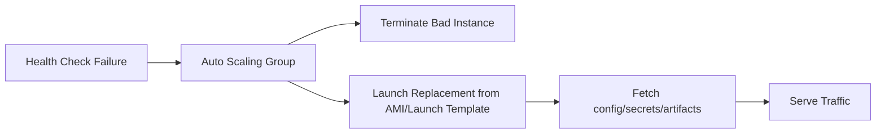
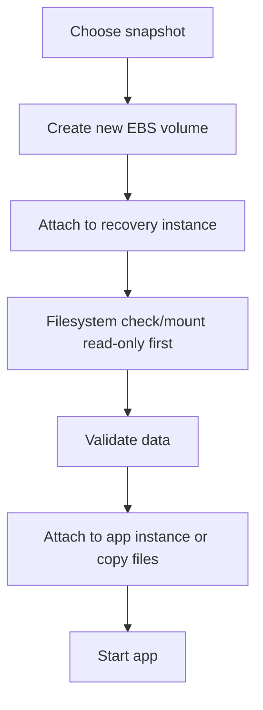

# Part 065 — EC2 and EBS Backup and Recovery Strategy

EC2 recovery is not one thing.

Sometimes you recover the **instance**.

Sometimes you recover the **data volume**.

Sometimes you rebuild the **compute identity** from AMI and IaC.

Sometimes you restore only a **single file** from a snapshot.

Sometimes you must recover a multi-volume database layout.

Sometimes you should not back up anything because the instance is stateless and fully rebuildable.

A top-tier AWS engineer does not ask:

```text
Do we have snapshots?
```

They ask:

```text
What exactly are we trying to recover, from what failure, within what RTO/RPO, and with what validation?
```

This part focuses on EC2 and EBS backup/recovery strategy.

Part 066 will go deeper into EBS snapshot lifecycle, DLM, application consistency, and operational automation.

---

## 1. Problem yang Diselesaikan

Part ini membahas:

- AMI vs EBS snapshot vs AWS Backup vs Data Lifecycle Manager
- boot volume vs data volume recovery
- rebuildable EC2 pattern
- stateful EC2 pattern
- instance store and ephemeral recovery
- golden AMI recovery
- multi-volume application recovery
- EC2 restore target design
- restore validation
- KMS and encrypted snapshots
- cross-account/cross-region recovery
- game days
- runbooks for failed instance, lost volume, bad deployment, corruption, KMS issue, and Region DR

---

## 2. Mental Model

### 2.1 EC2 is compute identity plus attached state

An EC2 instance can include:

```text
AMI / root volume
EBS data volumes
instance store
ENI/network identity
IAM instance profile
security groups
user data
tags
placement/subnet/AZ
Elastic IP or DNS
attached services/agents
application config
```

Recovery must decide which of those matter.

### 2.2 Rebuild beats restore when possible

For stateless EC2:

```text
recover = launch replacement from AMI/IaC
```

For stateful EC2:

```text
recover = restore state + launch/attach compute safely
```

The best EC2 backup strategy is often:

```text
make instances disposable
protect durable state separately
```

### 2.3 AMI captures launch recipe

An AMI captures information required to launch an EC2 instance, including snapshots for attached EBS volumes and block device mappings. AMI is useful when you want to restore/recreate the instance configuration.

Use AMI for:

- boot/root volume template
- golden image
- full instance recovery
- application server baseline
- rollback to previous server image
- launch permission sharing
- consistent block device mappings

### 2.4 EBS snapshot captures volume data

EBS snapshot is point-in-time backup of a volume. It is incremental after the first snapshot and can be used to create new EBS volumes.

Use EBS snapshot for:

- data volume recovery
- before migration/change
- database volume checkpoint
- copy volume to another Region/account
- create test copy
- recover file by mounting restored volume
- point-in-time backup

### 2.5 AWS Backup is centralized policy

AWS Backup can manage EC2/EBS backups centrally.

Use AWS Backup when you want:

- backup plans
- recovery points
- vaults
- cross-account copy
- restore testing
- audit/compliance
- centralized operations
- multi-resource protection

### 2.6 DLM is EBS/AMI lifecycle automation

Amazon Data Lifecycle Manager automates EBS snapshot and EBS-backed AMI lifecycles.

Use DLM when you want focused lifecycle policies for:

- EBS snapshots
- EBS-backed AMIs
- retention/deletion
- tag-based policy
- application-consistent snapshot scripts
- copy policies

---

## 3. EC2 State Taxonomy

### 3.1 Stateless instance

Characteristics:

- no irreplaceable data on root volume
- config from user data/SSM/AppConfig/Secrets Manager
- app binary from image/artifact registry
- logs shipped elsewhere
- uploads stored in S3/EFS/DB
- instance can be terminated anytime

Recovery:

```text
Auto Scaling launches replacement
```

Protection:

- AMI/image pipeline
- IaC
- configuration management
- health checks
- no per-instance backup required except maybe forensic/debug

### 3.2 Semi-stateful instance

Characteristics:

- root volume contains some local config/cache
- app mostly rebuildable
- local cache improves performance
- logs mostly shipped but some local forensic value

Recovery:

```text
rebuild from AMI + rehydrate cache/config
```

Protection:

- AMI for baseline
- optional root snapshot before major changes
- logs shipped
- cache disposable

### 3.3 Stateful instance

Characteristics:

- important data on EBS
- database/search/index/app state
- local files required
- volume identity matters
- RPO/RTO explicit

Recovery:

```text
restore volume snapshot + attach to replacement + validate application
```

Protection:

- EBS snapshots
- multi-volume consistency
- application-consistent backup if needed
- cross-account/region copy
- restore game day
- KMS recovery

### 3.4 Ephemeral high-performance instance

Characteristics:

- instance store used
- scratch/cache/intermediate data
- data lost on stop/terminate/failure
- durable source/output elsewhere

Recovery:

```text
recreate from durable input and rerun/rebuild cache
```

Protection:

- no backup of instance store
- checkpoint/export to S3/EBS/EFS/FSx
- job idempotency
- graceful drain

### 3.5 Pet instance anti-pattern

A "pet" EC2 instance has undocumented manual changes, local state, and unclear restore path.

Symptoms:

- nobody knows how it was built
- root volume backup is only recovery
- manual SSH changes
- config in local files
- packages installed manually
- no IaC
- restore requires remembering tribal knowledge

Fix:

- create AMI/image pipeline
- document bootstrapping
- externalize config/secrets
- move data to separate EBS/S3/EFS/DB
- automate rebuild
- snapshot until migration complete

---

## 4. AMI vs Snapshot Decision

### 4.1 Use AMI when restoring the whole instance

AMI is appropriate when:

- root volume matters
- launch configuration matters
- block device mapping matters
- you want to recreate an instance
- instance has multiple attached volumes that should be represented in launch recipe
- you need launch permissions
- image can be tested as a bootable server

Example:

```text
golden AMI for app server
```

### 4.2 Use EBS snapshot when restoring volume data

Snapshot is appropriate when:

- data volume is the focus
- you need point-in-time volume copy
- you want to mount restored volume to inspect files
- you need cross-region/account volume copy
- root image is rebuildable separately
- you want pre-change checkpoint

Example:

```text
snapshot /data volume before migration
```

### 4.3 Use both when state and launch recipe matter

For a legacy EC2 app:

- AMI for full server recovery
- separate EBS snapshots for data volumes
- IaC for network/IAM/security
- restore test to ensure AMI boots and data attaches correctly

### 4.4 Do not rely only on AMI for frequently changing data

AMI can include snapshots of volumes, but if created daily and data changes every minute, AMI RPO is too high.

Use:

- EBS snapshots more frequently
- app/database-native backup
- replication
- transaction logs
- managed database service if appropriate

### 4.5 Decision matrix

| Need | AMI | EBS Snapshot |
|---|---:|---:|
| launch full instance | strong | weak alone |
| preserve block device mapping | strong | manual |
| restore data volume only | possible but heavy | strong |
| inspect files | via launched/attached volume | strong |
| root image rollback | strong | possible |
| frequent data backup | usually not ideal | strong |
| golden image distribution | strong | no |
| multi-volume crash consistency | possible via image/snapshots | strong with multi-volume snapshot/AWS Backup |
| centralized backup policy | AWS Backup AMI/EBS options | AWS Backup/DLM |

---

## 5. Boot Volume vs Data Volume

### 5.1 Separate operating system from data

Recommended stateful layout:

```text
/dev/xvda -> root OS/app runtime
/dev/xvdf -> application data
/dev/xvdg -> logs/wal/index if needed
```

Why:

- root can be rebuilt
- data can be snapshotted/restored separately
- app upgrades do not mix with data backups
- volume restore is safer
- data volume can be attached to recovery instance
- root corruption does not imply data loss

### 5.2 Root volume backup

Root volume backup is useful for:

- legacy systems
- forensic rollback
- special OS configuration
- one-off app server
- golden image creation

But for modern systems:

```text
root volume should be replaceable
```

### 5.3 Data volume backup

Data volume backup must consider:

- filesystem consistency
- application consistency
- multi-volume consistency
- encryption/KMS
- mount point
- UUID/fstab
- volume type/performance
- snapshot retention
- restore test

### 5.4 Logs

If logs matter:

- ship to CloudWatch/S3/OpenSearch/etc.
- do not rely on root volume log backup
- define forensic log retention
- protect audit logs separately

### 5.5 Ephemeral cache

If cache is on EBS:

- mark as derived/cache
- exclude from backup if rebuildable
- tag `BackupTier=None`
- ensure rebuild path exists

---

## 6. Recovery Patterns

### 6.1 Stateless Auto Scaling recovery



Requirements:

- launch template tested
- AMI current
- bootstrap idempotent
- no local durable state
- logs/metrics externalized
- readiness checks

### 6.2 Replace root, reattach data

Use when root is bad but data volume is good.

Flow:

1. Stop instance or launch replacement.
2. Detach data volume.
3. Launch clean instance from AMI.
4. Attach data volume.
5. Mount carefully.
6. Validate filesystem.
7. Start app.
8. Update DNS/target group.

Caution:

- do not attach same writable filesystem to two active writers
- watch UUID/fstab conflicts
- ensure IAM/security groups match
- validate permissions

### 6.3 Restore data volume from snapshot

Flow:



### 6.4 Full instance restore from AMI

Flow:

1. Choose AMI/recovery point.
2. Launch in isolated subnet.
3. Validate boot.
4. Validate app config.
5. Attach/restore data if needed.
6. Run smoke tests.
7. Switch traffic/DNS.
8. Decommission old instance after approval.

### 6.5 File-level recovery from volume snapshot

Flow:

1. Create volume from snapshot.
2. Attach to recovery instance.
3. Mount read-only.
4. Copy needed files to target.
5. Preserve ownership/permissions.
6. Validate app.
7. Detach/delete recovery volume.

AWS Backup Search can help locate and restore individual files/directories from EBS snapshots in supported contexts, but design should not depend on manual search only.

### 6.6 Region/account recovery

Flow:

1. Ensure snapshot/AMI copy exists in destination.
2. Ensure KMS key usable in destination.
3. Launch replacement via IaC.
4. Restore volumes.
5. Recreate IAM/network/security dependencies.
6. Validate app.
7. Shift traffic.

---

## 7. Stateful EC2 Application Recovery

### 7.1 Single data volume app

Example:

```text
EC2 app with /var/lib/app on one EBS volume
```

Backup:

- snapshot data volume hourly/daily according to RPO
- AMI/root rebuildable
- app config externalized

Recovery:

- launch replacement
- create volume from snapshot
- attach/mount
- start app
- validate

### 7.2 Multi-volume app

Example:

```text
/data
/wal
/index
```

Need multi-volume point-in-time consistency.

Use:

- AWS Backup crash-consistent multi-volume backups
- EBS multi-volume snapshot
- application-consistent snapshots for databases
- database-native backup where appropriate

Recovery:

- restore all volumes from same recovery point/snapshot set
- attach to same instance/AZ
- mount correctly
- run application recovery
- validate data

### 7.3 RAID/LVM layout

Snapshots must capture all participating volumes together.

Do not restore one member from a different point in time.

Recovery includes:

- create all volumes
- attach in correct order
- assemble RAID/LVM
- filesystem check
- app validation

### 7.4 Database on EC2

For databases:

- prefer managed database if possible
- if self-managed, use database-native backup/PITR where needed
- EBS snapshots can be crash-consistent or application-consistent depending coordination
- test restore and recovery logs
- snapshots alone may not meet RPO/RTO

### 7.5 Search/index nodes

Search indexes may be rebuildable from primary data.

Decide:

- backup index volume
- snapshot index for faster recovery
- rebuild from source of truth
- use cluster replication
- use service-native snapshots

Do not back up huge derived indexes blindly if rebuild is cheaper and RTO allows.

---

## 8. Instance Store Recovery

### 8.1 Instance store is not backed up

Instance store data is temporary and tied to instance lifetime.

Data persists across reboot but is lost on stop/hibernate/terminate or underlying host loss depending instance behavior.

Therefore:

```text
instance store cannot be your only copy of important data
```

### 8.2 Good use

- cache
- scratch
- shuffle
- temp files
- spill
- local replicas
- ephemeral processing
- batch intermediate

### 8.3 Protection pattern

```text
input from S3/EFS/FSx
process on instance store
checkpoint/output to S3/EBS/EFS/FSx
instance store deleted
```

### 8.4 Recovery

- relaunch instance
- rehydrate cache
- rerun job from last checkpoint
- restore input from durable source
- never attempt to restore instance store itself

### 8.5 Runbook

If instance store data lost:

1. Confirm data role was scratch/cache.
2. Locate durable source.
3. Rehydrate or rerun.
4. If data was not disposable, treat as design incident.
5. Add checkpoint/export guardrail.

---

## 9. KMS and Encrypted Recovery

### 9.1 EBS encryption

EBS encrypted volumes and snapshots use AWS KMS keys.

Recovery requires:

- source snapshot accessible
- destination account/Region key
- restore role decrypt permission
- KMS key not disabled/deleted
- grants/key policy compatible
- copy re-encryption if needed

### 9.2 Cross-account snapshot sharing

Encrypted snapshot sharing is more complex than unencrypted.

Need:

- share snapshot
- allow destination account to use KMS key or copy/re-encrypt
- key policy permits destination principal
- destination creates its own encrypted copy if needed

### 9.3 KMS failure runbook

1. Identify snapshot and KMS key.
2. Check key state.
3. Check restore role.
4. Check key policy.
5. Check account/Region.
6. Try copy/re-encrypt if allowed.
7. Use alternate copied recovery point if available.
8. Escalate if key deleted/disabled.

### 9.4 Key deletion guardrail

Never schedule deletion for KMS keys used by active backups without:

- backup inventory check
- recovery point retention check
- alternate re-encrypted copy
- approval
- waiting period review

---

## 10. Cross-Account and Cross-Region Recovery

### 10.1 Why copy snapshots/AMIs

Protect against:

- source account compromise
- accidental deletion
- Region impairment
- KMS/key/account lockout
- operational blast radius

### 10.2 Snapshot copy

EBS snapshots can be copied within a Region or across Regions. A snapshot copied to another Region becomes a full copy initially, and subsequent copies can be incremental for the same source/destination snapshot chain depending conditions.

### 10.3 AMI copy

AMI copy creates an AMI in destination Region/account, including backing snapshots.

Use for:

- DR launch readiness
- golden image distribution
- recovery account bootstrap
- multi-region deployment
- regulated account isolation

### 10.4 Recovery account pattern

In recovery account:

- copy critical AMIs/snapshots
- use separate KMS key
- restrict deletion
- pre-create VPC/IAM or deploy via IaC
- run restore tests
- keep restore role separate from app teams

### 10.5 Restore readiness

Destination copy is not enough.

Need:

- launch permissions
- KMS permissions
- security groups
- subnets
- IAM instance profiles
- SSM access
- DNS/route 53
- secrets/config
- monitoring/logging
- service quotas

---

## 11. Observability

### 11.1 Backup coverage

Track:

- EC2 instances without backup strategy
- EBS volumes without backup tag/plan
- volumes tagged cache/scratch excluded intentionally
- old AMIs
- snapshots without owner
- unencrypted snapshots
- public snapshots
- snapshots using keys scheduled deletion
- AMIs with old OS/packages
- failed backup jobs
- failed copy jobs
- last restore test

### 11.2 Recovery readiness

Track:

- latest AMI per service
- latest data volume snapshot
- latest cross-account copy
- latest cross-region copy
- KMS restore test
- launch template validation
- Auto Scaling replacement test
- root/data attach test
- app smoke test result

### 11.3 Cost

Track:

- snapshot storage
- old AMI snapshots
- unattached EBS volumes
- restored test volumes not deleted
- Fast Snapshot Restore cost
- cross-region snapshot copies
- orphaned AMIs
- unused backup recovery points
- EBS volumes created from snapshots for tests

### 11.4 Security

Alert on:

- public snapshot permission
- snapshot share to unknown account
- AMI public launch permission
- KMS key disabled/deletion scheduled
- DeleteSnapshot
- DeregisterImage
- ModifySnapshotAttribute
- backup plan disabled
- DLM policy disabled
- AWS Backup recovery point deletion

---

## 12. Runbooks

### 12.1 Instance failed

1. Determine stateless or stateful.
2. If stateless: let ASG replace or launch from template.
3. If stateful: identify attached volumes.
4. Determine if data volumes are intact.
5. Launch replacement instance.
6. Attach data volumes or restore from snapshot.
7. Validate app.
8. Switch traffic.
9. Preserve failed instance/volumes for forensics if needed.

### 12.2 Root volume corrupted

1. Stop instance if safe.
2. Detach data volume if separate.
3. Launch replacement from AMI.
4. Attach data volume.
5. Restore root-specific config from IaC/SSM.
6. Validate app.
7. Update DNS/target group.
8. Snapshot corrupted root for forensic if needed.

### 12.3 Data volume corrupted

1. Stop writers.
2. Identify corruption start.
3. Choose last good snapshot/recovery point.
4. Create restore volume.
5. Attach to isolated recovery instance.
6. Validate data.
7. Replace/copy back.
8. Restart app.
9. Add validation/backup frequency improvement.

### 12.4 Restore file from snapshot

1. Identify volume and snapshot time.
2. Create volume from snapshot in same AZ as recovery instance.
3. Attach to recovery instance.
4. Mount read-only.
5. Copy file with permissions.
6. Validate with app/user.
7. Detach/delete restore volume.
8. Record recovery point used.

### 12.5 Cross-region EC2 recovery

1. Confirm latest copied AMI/snapshot.
2. Confirm KMS key in destination.
3. Deploy/reuse VPC/IAM/security.
4. Launch instance.
5. Restore/attach data volumes.
6. Configure app/secrets.
7. Validate.
8. Shift traffic.
9. Record RPO/RTO actual.

### 12.6 Snapshot cannot be restored

1. Check snapshot state.
2. Check permissions.
3. Check KMS key.
4. Check destination AZ/Region.
5. Check service quotas.
6. Try alternate recovery point.
7. Escalate if all recovery points fail.
8. Patch restore testing process.

---

## 13. Game Days

### Scenario 1 — Stateless instance replacement

Expected:

- terminate instance
- ASG replaces
- app returns healthy
- no data loss
- logs/metrics continuous

### Scenario 2 — Root corruption

Expected:

- replacement from AMI
- data volume attached
- app validates
- manual root changes not needed

### Scenario 3 — Data volume restore

Expected:

- snapshot selected
- volume restored
- mounted
- app validates
- RTO measured

### Scenario 4 — Cross-account snapshot restore

Expected:

- recovery account can decrypt/copy
- new volume created
- app smoke test passes

### Scenario 5 — KMS denied

Expected:

- restore fails in controlled test
- key policy gap identified
- recovery role fixed
- alert added

---

## 14. Terraform/IaC Concepts

### 14.1 Tag volumes for backup tier

```hcl
resource "aws_ebs_volume" "data" {
  availability_zone = var.az
  size              = 500
  type              = "gp3"
  encrypted         = true
  kms_key_id        = aws_kms_key.ebs.arn

  tags = {
    Name       = "orders-data"
    BackupTier = "Gold"
    DataClass  = "stateful-app-data"
    Owner      = "orders-service"
  }
}
```

### 14.2 Launch template for rebuildable instance

```hcl
resource "aws_launch_template" "app" {
  name_prefix   = "orders-app-"
  image_id      = var.golden_ami_id
  instance_type = "m7i.large"

  iam_instance_profile {
    name = aws_iam_instance_profile.app.name
  }

  vpc_security_group_ids = [aws_security_group.app.id]

  user_data = base64encode(templatefile("${path.module}/user-data.sh", {
    environment = var.environment
  }))

  tag_specifications {
    resource_type = "instance"
    tags = {
      Service = "orders"
      Role    = "app"
    }
  }
}
```

### 14.3 Recovery metadata

Store in repo/runbook:

```yaml
service: orders
rootRecovery: launch from latest approved AMI
dataVolume:
  mount: /var/lib/orders
  backupTier: Gold
  restoreValidation: ./scripts/validate-orders-data.sh
kmsKey: alias/orders-ebs
crossRegionCopy: us-west-2
crossAccountCopy: security-backup-account
```

---

## 15. Design Checklist

### 15.1 EC2 strategy

- [ ] Instances classified as stateless, semi-stateful, stateful, or ephemeral.
- [ ] Root and data volumes separated where stateful.
- [ ] Golden AMI/image pipeline exists.
- [ ] Launch templates/IaC can rebuild instance.
- [ ] User data/bootstrap idempotent.
- [ ] Logs shipped externally.
- [ ] Instance store used only for disposable data.
- [ ] Recovery runbook exists.

### 15.2 EBS data protection

- [ ] Data volumes tagged for backup.
- [ ] Snapshot frequency matches RPO.
- [ ] Retention matches policy.
- [ ] Multi-volume consistency evaluated.
- [ ] Application consistency evaluated.
- [ ] KMS restore tested.
- [ ] Cross-account/region copy evaluated.
- [ ] Restore test executed.

### 15.3 AMI protection

- [ ] AMI creation automated.
- [ ] AMIs tested by launch.
- [ ] Old AMIs lifecycle-managed.
- [ ] AMI copies exist in DR Region/account if needed.
- [ ] Launch permissions restricted.
- [ ] AMI vulnerability/patch posture managed.
- [ ] Deregistration monitored.

### 15.4 Recovery

- [ ] Restore target environment defined.
- [ ] Restore role has permissions.
- [ ] Volume attach/mount steps documented.
- [ ] App validation script exists.
- [ ] RTO/RPO actual measured.
- [ ] Cleanup of test volumes automated.
- [ ] Forensic preservation path defined.

---

## 16. Mini Case Study — Legacy Stateful EC2 App

### 16.1 Initial state

A legacy app runs on one EC2 instance:

```text
root volume: OS + app + uploaded files + logs + local database
```

Problems:

- daily AMI only
- no separate data volume
- manual server changes
- restore not tested
- RPO unknown
- local database not application-consistent

### 16.2 Improved design

- move database to managed DB or separate EBS data volume
- move uploads to S3 or separate data volume
- ship logs to CloudWatch/S3
- build golden AMI
- use launch template
- snapshot data volume every hour
- use application-consistent pre/post scripts or DB-native backup
- copy recovery points cross-account
- restore test quarterly

### 16.3 Recovery

If root fails:

```text
launch replacement from AMI
attach restored/current data volume
start app
```

If data corrupts:

```text
restore data volume from last good snapshot
replay logs if available
validate app
```

### 16.4 Invariant

```text
The EC2 instance is replaceable.
The data volume is protected.
The application state has a tested restore path.
```

---

## 17. Mini Case Study — Batch Worker with Instance Store

### 17.1 Workload

A batch worker processes large files using instance store for scratch.

### 17.2 Bad design

Job writes final results only to instance store.

Instance terminates.

Results lost.

### 17.3 Correct design

- input manifest in S3
- worker downloads/shards to instance store
- processing writes intermediate to instance store
- checkpoints every stage to S3
- final output uploaded to S3
- job success only after manifest commit
- instance store cleaned or instance terminated

### 17.4 Invariant

```text
Instance store can accelerate work.
It cannot be the only copy of important output.
```

---

## 18. Summary

EC2/EBS recovery starts by classifying instance state.

Key principles:

1. Make compute rebuildable.
2. Separate root and data volumes.
3. Use AMIs for launchable machine recovery.
4. Use EBS snapshots for point-in-time volume recovery.
5. Use AWS Backup for centralized policy and recovery points.
6. Use DLM for EBS/AMI lifecycle automation.
7. Use multi-volume snapshots for multi-volume layouts.
8. Use application-consistent backups when crash consistency is insufficient.
9. Treat instance store as disposable.
10. Test restore with real app validation.
11. Protect encrypted snapshots with KMS recovery design.
12. Copy critical recovery points across account/Region when needed.

The core rule:

> EC2 recovery is fastest and safest when instances are replaceable and durable state is explicitly protected.

Next, Part 066 goes deep into EBS snapshot lifecycle, DLM, consistency, Fast Snapshot Restore, snapshot copy/share, encryption, and application-consistent automation.

---

## References

- AWS Prescriptive Guidance — Amazon EC2 backup and recovery with snapshots and AMIs: https://docs.aws.amazon.com/prescriptive-guidance/latest/backup-recovery/ec2-backup.html
- AWS Prescriptive Guidance — Backup and recovery for Amazon EC2 with EBS volumes: https://docs.aws.amazon.com/prescriptive-guidance/latest/backup-recovery/backup-recovery-ec2-ebs.html
- AWS Prescriptive Guidance — Restoring an Amazon EBS volume or an EC2 instance: https://docs.aws.amazon.com/prescriptive-guidance/latest/backup-recovery/restore.html
- Amazon EBS User Guide — Amazon EBS snapshots: https://docs.aws.amazon.com/ebs/latest/userguide/ebs-snapshots.html
- Amazon EBS User Guide — How snapshots work: https://docs.aws.amazon.com/ebs/latest/userguide/how_snapshots_work.html
- Amazon EC2 User Guide — Storage options for EC2 instances: https://docs.aws.amazon.com/AWSEC2/latest/UserGuide/Storage.html
- AWS Backup Developer Guide — Amazon EBS and AWS Backup: https://docs.aws.amazon.com/aws-backup/latest/devguide/multi-volume-crash-consistent.html
- Amazon EBS User Guide — Automate data backups with AWS Backup and Amazon Data Lifecycle Manager: https://docs.aws.amazon.com/ebs/latest/userguide/snapshot-lifecycle.html
