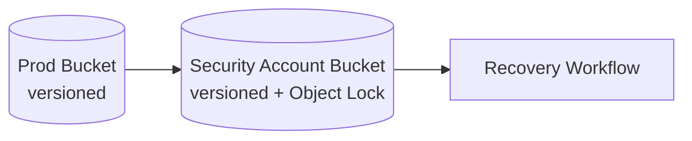

# Part 067 — S3 Data Protection, Versioning, Object Lock, and Replication

Amazon S3 durability is not the same as application data protection.

S3 can store objects durably, but your application can still:

- overwrite the wrong key
- delete the current version
- lifecycle-expire needed noncurrent versions
- replicate a bad delete
- lose catalog references
- archive data needed in a hot path
- fail to restore because KMS permissions are wrong
- assume an event means a backup happened
- preserve bytes but lose business meaning

S3 data protection is about designing object state over time.

The core primitives are:

- Versioning
- delete markers
- Object Lock
- retention mode
- legal hold
- replication
- lifecycle
- S3 Inventory
- AWS Backup for S3
- catalog references to version IDs
- restore workflows

Used together, these can protect against accidental deletion, application bugs, malicious deletion, compliance retention failure, and regional/account-level disaster.

Used carelessly, they can create huge cost, confusing delete behavior, inaccessible archives, and false confidence.

---

## 1. Problem yang Diselesaikan

Part ini membahas:

- S3 versioning as recovery timeline
- delete marker semantics
- why current object is not enough
- Object Lock with Governance and Compliance mode
- legal hold
- retention period vs legal hold
- S3 replication for DR and account isolation
- replication of Object Lock retention metadata
- AWS Backup for S3
- continuous backup and point-in-time restore
- S3 lifecycle risk
- S3 restore runbooks
- catalog + object version consistency
- ransomware/accidental delete protection
- cost and observability
- game days

---

## 2. Mental Model

### 2.1 S3 bucket is not one timeline unless you make it one

Without versioning:

```text
PUT key -> current object changes
DELETE key -> object gone
```

With versioning:

```text
PUT key -> new version
DELETE key -> delete marker becomes current
old versions remain until lifecycle/removal
```

Versioning turns object history into a recovery surface.

### 2.2 Business truth needs version identity

A catalog record should reference:

```text
bucket
key
versionId
checksum
size
createdAt
retention class
```

Not just:

```text
s3://bucket/key
```

If the key is overwritten, a versionless reference may point to different bytes.

### 2.3 Object Lock protects object versions

S3 Object Lock uses a write-once-read-many model. It prevents an object version from being deleted or overwritten for a fixed period or indefinitely.

Important:

```text
Object Lock applies to object versions.
Versioning is required.
```

### 2.4 Replication is availability/isolation, not rollback by itself

Replication copies object changes to destination bucket.

It helps with:

- DR
- read locality
- account isolation
- Region isolation
- protected copy
- compliance copy

But if delete/corruption replicates and no version/lock/backup exists, replica may not save you.

### 2.5 Lifecycle is part of recovery design

Lifecycle can:

- expire old versions
- transition objects to cheaper storage
- delete markers
- abort multipart uploads

Lifecycle can also destroy recovery points.

Never configure lifecycle without answering:

```text
What recovery point am I willing to lose?
```

---

## 3. S3 Versioning

### 3.1 What versioning gives you

Versioning preserves multiple variants of an object in the same bucket. You can retrieve, restore, and recover versions after unintended user actions or application failures.

Use it for:

- accidental delete recovery
- overwrite recovery
- audit history
- object version references
- Object Lock prerequisite
- backup source state
- replication safety

### 3.2 Versioning states

Bucket versioning can be:

- unversioned
- enabled
- suspended

Enabled is not the same as suspended.

When suspended, existing versions remain, but new puts can create null/current behavior that complicates recovery.

Production rule:

```text
Do not suspend versioning on protected buckets without incident/change review.
```

### 3.3 Delete markers

In a versioned bucket, a simple DELETE does not remove all versions. It adds a delete marker that becomes current.

Symptoms:

```text
GET key -> 404-like behavior
list versions -> old versions still exist
```

Recovery:

```text
delete the delete marker
or GET specific old versionId
```

### 3.4 Permanent version deletion

Deleting a specific version ID removes that version, subject to Object Lock/legal hold/permissions.

That is destructive.

Restrict:

- `s3:DeleteObjectVersion`
- lifecycle version expiration
- batch operations that delete versions
- admin roles that can bypass governance mode

### 3.5 Null version trap

If versioning is enabled after objects already exist, those existing objects have a null version.

If versioning is suspended, new writes may use null version semantics.

Operationally:

- know if bucket had pre-versioning objects
- test recovery for null-version objects
- avoid toggling versioning states

### 3.6 Cost impact

Versioning can dramatically increase storage cost if objects are overwritten often.

Mitigate with:

- immutable key design
- lifecycle for noncurrent versions
- S3 Storage Lens
- Inventory
- overwrite controls
- version count alarms for hot keys

---

## 4. Object Lock

### 4.1 What Object Lock protects against

Object Lock helps prevent:

- accidental deletion
- malicious deletion
- ransomware overwrite/delete
- privileged-user mistake
- retention policy violation
- compliance record tampering

It does not prevent:

- reading/exfiltration
- loss of catalog metadata
- KMS key failure
- application writing new wrong object versions
- lifecycle transition to archive if policy allows
- bad data being locked if validation happens too late

### 4.2 Governance mode

Governance mode prevents most users from deleting/overwriting protected object versions unless they have special permission to bypass governance retention.

Use for:

- operational protection
- strong but administratively manageable retention
- non-regulatory critical data
- ransomware-resilience layer
- workflows requiring break-glass

Control:

- restrict `s3:BypassGovernanceRetention`
- require MFA/approval for bypass
- monitor bypass attempts

### 4.3 Compliance mode

Compliance mode prevents protected object versions from being overwritten or deleted by any user, including root account, until retention expires.

Use only when:

- regulatory WORM requirement
- legal/compliance approval
- retention is known
- cost/operational effect accepted
- test bucket used first

Caution:

```text
Compliance mode is intentionally hard to undo.
```

### 4.4 Retention period

Retention period defines:

```text
retain until date
```

Object version cannot be deleted/overwritten before that date.

Design:

```yaml
dataClass: audit-log
retention: 7 years
mode: compliance
```

or:

```yaml
dataClass: critical-backup-object
retention: 35 days
mode: governance
```

### 4.5 Legal hold

Legal hold prevents deletion/overwrite independent of retention date. It remains until explicitly removed.

Use for:

- litigation hold
- investigation
- incident evidence
- manual preservation

Legal hold has no associated retention period.

### 4.6 Object Lock and replication

Object Lock can be used with S3 Replication. When replicating locked objects, retention metadata can be replicated; destination bucket must also have Object Lock enabled.

Design:

- source bucket Object Lock enabled
- destination bucket Object Lock enabled
- replication role has required permissions
- test retention metadata on destination
- destination KMS key works
- object lock configuration cannot be added casually later without planning

### 4.7 Lock after validation

Do not lock unvalidated bad data.

Pattern:

```text
staging upload -> validate checksum/malware/business policy -> commit locked protected object
```

If you lock before validation, invalid/malicious data may become undeletable until retention expires.

---

## 5. S3 Replication

### 5.1 Replication types

S3 replication can copy objects:

- across Regions
- within same Region
- across accounts
- to multiple destinations
- with metadata/tags/storage class depending configuration
- with replica modification sync in selected patterns
- with Replication Time Control if predictable replication time is needed

### 5.2 Why replicate

Use replication for:

- regional disaster recovery
- account isolation
- data locality
- compliance copy
- analytics copy
- backup-like protected destination
- migration
- separation of producer and consumer accounts

### 5.3 Replication requirements

Replication requires versioning enabled on source and destination buckets. The source/destination Regions must be enabled for the accounts involved.

Design includes:

- source bucket
- destination bucket
- IAM replication role
- replication rule
- prefix/tag filter
- KMS permissions
- destination ownership
- delete marker replication choice
- existing object replication/backfill strategy
- metrics/replication status

### 5.4 Delete marker replication

Decide intentionally.

If delete marker replication is enabled:

```text
delete in source can hide object in destination
```

If disabled:

```text
destination may retain visible data after source delete
```

Neither is universally correct.

For protected backup/DR copy, you may want destination versions retained and deletion guarded.

### 5.5 Replication is asynchronous

Replication is not synchronous commit.

A write may be visible in source before destination.

Track:

- replication lag
- failed replication
- bytes pending
- operations pending
- destination object presence
- replication status metadata

### 5.6 Cross-account protected replica pattern



Benefits:

- source app account cannot easily delete protected copy
- separate KMS key
- separate administrators
- retention lock
- better ransomware posture

### 5.7 Replication anti-pattern

Bad:

```text
source unversioned bucket -> destination unprotected copy
```

or:

```text
replica in same account with same admin delete permissions
```

If a bad actor can delete both, recovery isolation is weak.

---

## 6. AWS Backup for S3

### 6.1 Why use AWS Backup for S3

AWS Backup for S3 gives centralized backup governance and recovery points for S3 buckets.

Use when you need:

- backup plans
- vaults
- recovery points
- cross-account copy
- cross-region copy
- AWS Backup audit/control plane
- point-in-time restore for continuous backups
- compliance reporting
- restore testing integration where applicable

### 6.2 Requirement: versioning

AWS Backup for S3 requires S3 Versioning on the bucket.

This is logical because restoring object history requires object versions.

### 6.3 Periodic backup

Periodic backup captures objects and versions in the bucket at backup time.

Recovery point can include:

- current versions
- noncurrent versions
- delete markers
- objects pending lifecycle action

Use for:

- daily/weekly recovery point
- compliance backup
- bucket-level recovery
- audit evidence

### 6.4 Continuous backup / PITR

Continuous backup gives point-in-time restore capability. AWS Backup supports point-in-time restore for S3, with restores up to the most recent 15 minutes of activity according to AWS Backup docs.

Use for:

- frequently changing buckets
- near-continuous protection
- critical object stores
- recovery from precise bad-change time

### 6.5 EventBridge requirement

Continuous S3 backups require EventBridge and versioning. Ensure EventBridge is enabled/configured per AWS Backup requirements.

### 6.6 Restore destination

S3 restore can restore:

- to original bucket
- to a new bucket or prefix depending workflow/options
- selected recovery point/time

Production guidance:

```text
restore to isolated bucket/prefix first
validate
then copy/promote
```

Avoid overwriting production bucket blindly.

### 6.7 AWS Backup vs native S3 protection

Use both where needed.

| Need | Native S3 feature | AWS Backup |
|---|---|---|
| accidental overwrite recovery | versioning | backup recovery point |
| WORM retention | Object Lock | backup vault lock for backup artifacts |
| DR copy | replication | cross-account/cross-region backup copy |
| point-in-time restore | versioning manually | continuous backup/PITR |
| audit/compliance control plane | Storage Lens/CloudTrail/Config | Audit Manager/frameworks |
| bucket-level policy backup | limited | centralized recovery points |

---

## 7. Catalog and Object Version Consistency

### 7.1 Catalog must store version ID

For protected systems:

```json
{
  "bucket": "evidence-prod",
  "key": "objects/sha256/b2/af/content",
  "versionId": "3Lg...abc",
  "sha256": "b2af...",
  "sizeBytes": 938123,
  "retentionUntil": "2033-07-06T00:00:00Z"
}
```

### 7.2 Why version ID matters

If application stores only key:

```text
s3://bucket/case/123/evidence.pdf
```

then overwrite creates ambiguity.

If catalog stores version ID:

```text
GET key versionId=abc
```

you retrieve exact bytes.

### 7.3 Database rollback with S3 versions

If DB restores to older time:

- catalog rows reference old object versions
- S3 noncurrent versions must still exist
- lifecycle must retain versions beyond DB PITR window
- KMS must decrypt old versions
- Object Lock may protect critical versions

### 7.4 Manifest pattern

For multi-object dataset:

```json
{
  "dataset": "case-export",
  "version": "2026-07-06T03:00:00Z",
  "objects": [
    {
      "bucket": "exports-prod",
      "key": "exports/job-1/part-0001",
      "versionId": "abc",
      "sha256": "..."
    }
  ]
}
```

The manifest is itself versioned/locked if important.

### 7.5 Reconciliation

Use S3 Inventory + catalog audits:

- catalog references existing version
- S3 protected versions have catalog owner
- delete markers not hiding active objects unexpectedly
- noncurrent versions retained long enough
- Object Lock retention matches data class
- replication status complete
- backup recovery points exist

---

## 8. Lifecycle Risk

### 8.1 Lifecycle can expire recovery points

Lifecycle rules can expire:

- current objects
- noncurrent versions
- delete markers
- incomplete multipart uploads
- transition to storage classes

Risk:

```text
noncurrent versions deleted before DB PITR window ends
```

### 8.2 Retention alignment

Example:

```yaml
databasePITR: 35 days
s3NoncurrentVersionRetention: 45 days
```

Retain object versions longer than database/catalog restore window.

### 8.3 Archive transition

Archive classes can break RTO if restore requires retrieval.

Before transition:

- define retrieval SLA
- define restore workflow
- test restore
- expose archive state in catalog
- keep hot/critical versions immediate if RTO requires

### 8.4 Lifecycle rule review

For every rule:

```yaml
rule:
  bucket:
  prefix:
  tags:
  action:
  days:
  dataOwner:
  recoveryImpact:
  testedRestore:
  approval:
```

### 8.5 Delete marker cleanup

Delete marker cleanup can restore or remove visibility behavior unexpectedly if misunderstood.

Test:

- delete current object
- list versions
- remove delete marker
- lifecycle behavior on expired object delete markers

---

## 9. Restore Patterns

### 9.1 Restore accidental delete

If versioned:

1. List object versions.
2. Find delete marker/current state.
3. Remove delete marker or copy old version to new current version.
4. Validate checksum/business state.
5. Update catalog if version changed.
6. Record incident.

CLI concepts:

```bash
aws s3api list-object-versions \
  --bucket "$BUCKET" \
  --prefix "$KEY"

aws s3api delete-object \
  --bucket "$BUCKET" \
  --key "$KEY" \
  --version-id "$DELETE_MARKER_VERSION_ID"
```

### 9.2 Restore overwrite

1. Identify known-good version ID.
2. Copy old version to a recovery prefix or restore as current.
3. Validate.
4. If catalog uses version ID, update reference or keep old version reference.
5. Protect restored version if needed.

### 9.3 Restore with AWS Backup

1. Choose bucket/recovery point or PITR time.
2. Restore to isolated bucket/prefix.
3. Validate sample objects, versions, tags, ACL/metadata expectations.
4. Compare with catalog.
5. Promote/copy needed objects.
6. Update application references.
7. Clean staging restore after retention.

### 9.4 Restore locked object

If object is locked:

- cannot delete/overwrite until retention expires
- can copy to new key if read allowed
- legal hold/retention must be considered
- governance bypass requires explicit permission if allowed
- compliance mode cannot be bypassed

### 9.5 Restore archived object

If object/storage class requires restore:

1. Initiate restore.
2. Wait for restore completion.
3. Copy/read restored temporary copy according to class semantics.
4. Update catalog if promoted.
5. Consider transition policy change if hot again.

### 9.6 Restore replicated object

If source account lost:

1. Use destination account bucket.
2. Locate version.
3. Validate Object Lock/retention.
4. Restore/copy into recovery bucket/account.
5. Update DNS/application config/catalog.
6. Decide failback source of truth.

---

## 10. Security and Guardrails

### 10.1 Restrict destructive actions

Restrict:

- `s3:DeleteObject`
- `s3:DeleteObjectVersion`
- `s3:PutLifecycleConfiguration`
- `s3:BypassGovernanceRetention`
- `s3:PutBucketVersioning`
- `s3:PutBucketReplication`
- `s3:PutObjectRetention`
- `s3:PutObjectLegalHold`
- `kms:ScheduleKeyDeletion`
- `kms:DisableKey`

### 10.2 Bucket policy guardrails

Examples:

- deny versioning suspension
- require TLS
- require SSE-KMS or SSE-S3
- deny non-approved principals from deleting object versions
- deny bypass governance except break-glass role
- require object lock retention for protected prefix
- deny lifecycle changes except platform role

### 10.3 SCP guardrails

At organization level:

- prevent public buckets
- prevent disabling security controls
- restrict deletion of protected buckets
- prevent KMS key deletion without approval
- restrict object lock bypass

### 10.4 Monitoring

Alert on:

- versioning suspended
- lifecycle modified
- replication disabled
- Object Lock config changed
- legal hold removed
- retention shortened
- object version delete
- delete marker spike
- KMS key disabled
- backup recovery point deleted
- replication failures

### 10.5 Incident account isolation

For regulated/critical data:

- replicate/backup to security account
- use different KMS key
- restrict source account delete
- enable Object Lock/Vault Lock
- test restore from security account

---

## 11. Observability

### 11.1 S3 protection dashboard

Show:

- versioning status
- Object Lock status
- replication status
- backup status
- latest backup recovery point
- latest PITR window
- noncurrent version bytes
- delete marker count
- objects under legal hold
- objects with governance/compliance retention
- lifecycle rules
- replication failures
- KMS failures

### 11.2 Storage Lens and Inventory

Use Storage Lens for storage activity/usage trends.

Use S3 Inventory for offline object/version reports.

Inventory fields can help audit:

- key
- version ID
- size
- storage class
- encryption status
- replication status
- object lock retention/hold fields where configured
- last modified
- checksum fields where available

### 11.3 Catalog reconciliation dashboard

Track:

- catalog references missing S3 version
- S3 versions without catalog owner
- locked objects missing retention metadata
- noncurrent version retention shorter than DB PITR
- replication incomplete for protected object
- backup recovery point missing
- object checksum mismatch

### 11.4 Cost dashboard

Track:

- current vs noncurrent version bytes
- delete marker count
- Object Lock retained bytes
- replication bytes
- AWS Backup S3 recovery point storage
- lifecycle transitions
- archive retrieval
- old versions of hot keys
- incomplete multipart uploads

---

## 12. Runbooks

### 12.1 Versioning suspended

1. Identify actor/time.
2. Re-enable versioning if appropriate.
3. Identify objects written during suspension.
4. Assess null-version impact.
5. Check backup/replica state.
6. Add guardrail preventing suspension.
7. Incident review.

### 12.2 Object accidentally deleted

1. Check versioning.
2. List object versions.
3. Find delete marker.
4. Remove delete marker or restore previous version.
5. Validate object.
6. Update catalog if needed.
7. Review delete permissions.

### 12.3 Object overwritten by bug

1. Stop writer.
2. Identify overwrite time.
3. Find previous good version.
4. Copy previous version to recovery prefix/current key or update catalog version reference.
5. Validate checksum.
6. Patch writer idempotency/immutable keys.

### 12.4 Replication failure

1. Check replication metrics/status.
2. Check IAM replication role.
3. Check destination bucket/versioning.
4. Check KMS permissions.
5. Check Object Lock destination setup.
6. Re-run failed replication/backfill if needed.
7. Alert if DR RPO breached.

### 12.5 Lifecycle deleted needed version

1. Stop lifecycle rule.
2. Check if version exists in backup/replica.
3. Restore from AWS Backup or replica.
4. Validate catalog.
5. Adjust noncurrent retention.
6. Add lifecycle review guardrail.

### 12.6 Legal hold removal request

1. Confirm legal owner approval.
2. Confirm object version IDs.
3. Confirm retention requirements.
4. Remove legal hold only with audited role.
5. Record evidence.
6. Monitor follow-up deletion attempts.

### 12.7 S3 PITR restore

1. Identify bucket and restore time.
2. Verify backup plan and PITR window.
3. Restore to isolated target.
4. Validate sample/version/catalog.
5. Promote/copy selected objects.
6. Reconcile app state.
7. Clean restore target.

---

## 13. Game Days

### Scenario 1 — Delete current object

Expected:

- delete marker found
- old version restored
- app works
- RTO measured

### Scenario 2 — Bad overwrite

Expected:

- previous version selected
- catalog references exact version
- corrupted version retained for forensic if needed
- writer fixed

### Scenario 3 — Lifecycle bug

Expected:

- rule disabled
- affected versions identified by Inventory/backup
- restore from replica/AWS Backup
- lifecycle policy corrected

### Scenario 4 — Replication/KMS failure

Expected:

- replication failure detected
- KMS permission fixed
- failed objects replicated
- DR RPO dashboard updates

### Scenario 5 — Ransomware delete attempt

Expected:

- Object Lock/Vault Lock prevents deletion
- alerts fire
- recovery account data intact
- source credentials isolated

---

## 14. Terraform/IaC Concepts

### 14.1 Versioned bucket

```hcl
resource "aws_s3_bucket" "protected" {
  bucket = "protected-evidence-prod"
}

resource "aws_s3_bucket_versioning" "protected" {
  bucket = aws_s3_bucket.protected.id

  versioning_configuration {
    status = "Enabled"
  }
}
```

### 14.2 Object Lock bucket

Object Lock must be enabled at bucket creation time in many workflows.

```hcl
resource "aws_s3_bucket" "locked" {
  bucket              = "locked-evidence-prod"
  object_lock_enabled = true
}

resource "aws_s3_bucket_versioning" "locked" {
  bucket = aws_s3_bucket.locked.id

  versioning_configuration {
    status = "Enabled"
  }
}

resource "aws_s3_bucket_object_lock_configuration" "locked" {
  bucket = aws_s3_bucket.locked.id

  rule {
    default_retention {
      mode = "GOVERNANCE"
      days = 35
    }
  }
}
```

### 14.3 Replication concept

```hcl
resource "aws_s3_bucket_replication_configuration" "protected" {
  bucket = aws_s3_bucket.protected.id
  role   = aws_iam_role.replication.arn

  rule {
    id     = "replicate-protected-prefix"
    status = "Enabled"

    filter {
      prefix = "protected/"
    }

    destination {
      bucket        = aws_s3_bucket.destination.arn
      storage_class = "STANDARD"
    }

    delete_marker_replication {
      status = "Disabled"
    }
  }
}
```

Validate exact fields/current provider behavior.

### 14.4 AWS Backup selection concept

```hcl
resource "aws_backup_selection" "s3_gold" {
  name         = "s3-gold"
  iam_role_arn = aws_iam_role.aws_backup.arn
  plan_id      = aws_backup_plan.gold.id

  resources = [
    aws_s3_bucket.protected.arn
  ]
}
```

---

## 15. Design Checklist

### 15.1 Versioning

- [ ] Versioning enabled.
- [ ] Suspension denied/monitored.
- [ ] Catalog stores version ID for critical objects.
- [ ] Noncurrent retention matches DB/catalog PITR.
- [ ] Delete marker recovery tested.
- [ ] Version delete restricted.
- [ ] Cost monitored.

### 15.2 Object Lock

- [ ] Bucket created with Object Lock where needed.
- [ ] Governance vs Compliance chosen intentionally.
- [ ] Retention period approved.
- [ ] Legal hold workflow defined.
- [ ] Bypass governance restricted.
- [ ] Object Lock with replication tested.
- [ ] Bad-data-before-lock prevention exists.

### 15.3 Replication

- [ ] Destination versioning enabled.
- [ ] Destination Object Lock enabled if replicating locked objects.
- [ ] KMS permissions tested.
- [ ] Delete marker replication decision documented.
- [ ] Replication lag monitored.
- [ ] Failed replication alarm.
- [ ] Cross-account isolation evaluated.
- [ ] Restore from destination tested.

### 15.4 AWS Backup

- [ ] S3 bucket versioning enabled.
- [ ] Periodic or continuous backup chosen.
- [ ] PITR window matches RPO.
- [ ] Restore to isolated target tested.
- [ ] Backup vault policy/lock evaluated.
- [ ] Cross-account/cross-region copy evaluated.
- [ ] Recovery point inventory monitored.

### 15.5 Lifecycle

- [ ] Lifecycle reviewed by data owner.
- [ ] Noncurrent expiration safe.
- [ ] Archive transition compatible with RTO.
- [ ] Object Lock/legal hold interaction understood.
- [ ] Inventory validates lifecycle effect.
- [ ] Lifecycle change alarm exists.

---

## 16. Mini Case Study — Protected Evidence Bucket

### 16.1 Requirement

Evidence uploads must be immutable after acceptance.

RPO:

```text
near-zero after accepted
```

Retention:

```text
7 years
```

### 16.2 Design

- staging bucket without Object Lock for upload/validation
- protected bucket with versioning and Object Lock
- Object Lock Compliance mode 7 years for accepted evidence
- catalog stores key/version/checksum/retention
- replication to security account bucket with Object Lock enabled
- AWS Backup for additional recovery point governance
- S3 Inventory validates retention and replication status
- CloudTrail data events for delete/retention changes

### 16.3 Flow

```text
upload staging -> checksum/malware/business validation -> copy to locked bucket -> store versionId -> replicate -> commit catalog
```

### 16.4 Invariant

```text
Only validated evidence enters locked retention.
Catalog references exact locked object version.
```

---

## 17. Mini Case Study — Application Bug Overwrites Objects

### 17.1 Incident

A service accidentally writes all invoices to:

```text
invoices/current.pdf
```

instead of unique immutable keys.

### 17.2 Impact

Current object overwritten repeatedly.

### 17.3 Recovery

- versioning preserves previous versions
- catalog cannot identify which version belongs to which invoice because version IDs were not stored
- restore requires forensic reconstruction by timestamp/logs

### 17.4 Fix

- immutable key per invoice ID/content hash
- catalog stores version ID
- writer idempotency key
- deny overwrite on protected prefix where possible
- lifecycle retains noncurrent versions beyond reconciliation window

### 17.5 Invariant

```text
Versioning helps recovery.
Application identity still belongs in catalog.
```

---

## 18. Summary

S3 data protection is not one feature.

It is a composition:

- versioning for history
- Object Lock for WORM protection
- legal hold for investigation/litigation
- replication for isolated/regional copy
- lifecycle for cost with recovery-aware retention
- AWS Backup for centralized recovery points and PITR
- Inventory/Storage Lens for audit
- catalog version IDs for correctness
- game days for proof

The core rule:

> Durable object storage protects bytes. Versioning, retention, replication, backup, and catalog design protect meaning over time.

Next, Part 068 covers EFS and FSx data protection: backup, restore, item-level recovery, snapshots, replication, cross-account patterns, identity/permission restore, and file-system-specific DR runbooks.

---

## References

- Amazon S3 User Guide — Retaining multiple versions of objects with S3 Versioning: https://docs.aws.amazon.com/AmazonS3/latest/userguide/Versioning.html
- Amazon S3 User Guide — Locking objects with Object Lock: https://docs.aws.amazon.com/AmazonS3/latest/userguide/object-lock.html
- Amazon S3 User Guide — Object Lock considerations: https://docs.aws.amazon.com/AmazonS3/latest/userguide/object-lock-managing.html
- Amazon S3 User Guide — S3 Object Lock legal hold: https://docs.aws.amazon.com/AmazonS3/latest/userguide/batch-ops-legal-hold.html
- Amazon S3 User Guide — Requirements and considerations for replication: https://docs.aws.amazon.com/AmazonS3/latest/userguide/replication-requirements.html
- Amazon S3 User Guide — Data protection in Amazon S3: https://docs.aws.amazon.com/AmazonS3/latest/userguide/data-protection.html
- AWS Backup Developer Guide — Amazon S3 backups: https://docs.aws.amazon.com/aws-backup/latest/devguide/s3-backups.html
- AWS Backup Developer Guide — Continuous backups and point-in-time recovery: https://docs.aws.amazon.com/aws-backup/latest/devguide/point-in-time-recovery.html
- AWS Backup Developer Guide — Restore a backup by resource type: https://docs.aws.amazon.com/aws-backup/latest/devguide/restoring-a-backup.html
