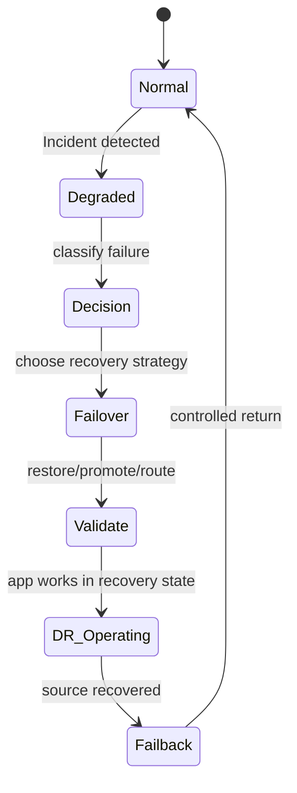
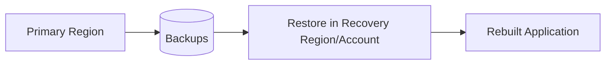
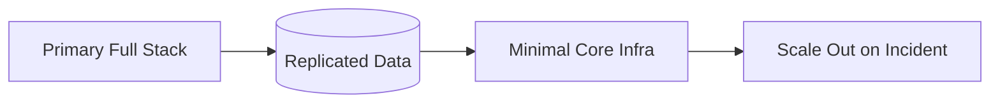
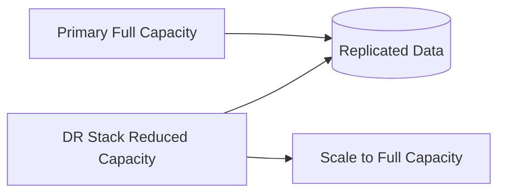
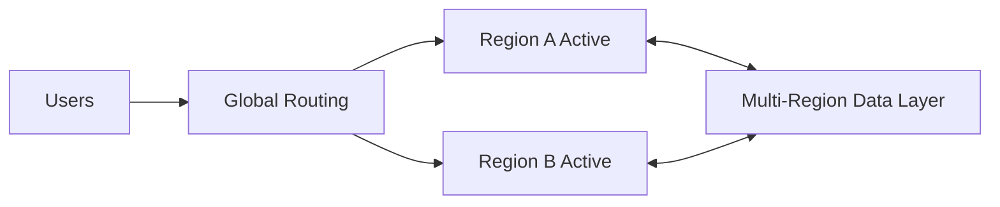

# Part 069 — Disaster Recovery Architectures and Region Evacuation

Disaster recovery is not "we have backups."

Disaster recovery is a controlled ability to move from a failed or unsafe operating state to a known-good operating state within a business objective.

That may mean:

- restoring from backup
- failing over to a replica
- scaling a pilot light
- promoting a warm standby
- shifting traffic away from an impaired Availability Zone
- evacuating a Region
- restoring into a security/recovery account
- rebuilding compute from IaC
- rehydrating data from S3/backups
- choosing a clean recovery point after corruption
- failing back safely after the incident

The hard part is not drawing a multi-Region diagram.

The hard part is preventing split-brain, stale data, missing KMS permissions, insufficient capacity, wrong DNS TTLs, incomplete backups, untested restore, and operator confusion during a real incident.

This part connects AWS compute and storage recovery into full DR architectures.

---

## 1. Problem yang Diselesaikan

Part ini membahas:

- DR strategy taxonomy
- backup and restore
- pilot light
- warm standby
- multi-site active-active
- active/passive vs active/active
- regional vs zonal recovery
- Region evacuation
- AZ evacuation and ARC zonal shift
- Route 53 DNS cutover
- Amazon Application Recovery Controller concepts
- cross-account recovery
- recovery environment design
- dependency recovery: IAM, KMS, DNS, VPC, AD, secrets
- failover and failback runbooks
- DR game days
- architecture review checklist

---

## 2. Mental Model

### 2.1 DR is a state transition



Most failures in DR happen at transition points.

Examples:

- route traffic before data is ready
- restore data but KMS denies app access
- promote replica while source still accepts writes
- fail back without reconciling writes
- scale standby but quotas are insufficient
- switch DNS but clients cache old endpoint
- restore into VPC that cannot reach dependencies

### 2.2 DR strategy is RTO/RPO/cost trade-off

The common AWS DR strategies are:

1. Backup and restore
2. Pilot light
3. Warm standby
4. Multi-site active-active

They differ in:

- cost
- operational complexity
- RTO
- RPO
- readiness
- risk of split-brain
- data replication complexity
- traffic routing complexity

### 2.3 Data recovery and traffic recovery are separate

A DR architecture needs both:

```text
data plane recovery = data exists and is correct
traffic recovery = users reach healthy application
```

You can have recovered data with no traffic route.

You can have traffic routed to a standby with stale or missing data.

Both must be validated.

### 2.4 Compute can be rebuilt; data must be protected

For top-tier DR:

```text
compute = IaC + AMI/container image + config + secrets + capacity
data    = backup/replica/version/manifest + KMS + validation
traffic = DNS/routing/control + health checks + client behavior
```

Do not treat EC2 instances as the DR unit. Treat application capability as the DR unit.

### 2.5 Regional impairment is not the only DR scenario

DR also includes:

- AZ impairment
- account compromise
- KMS key failure
- AD failure
- bad deployment
- ransomware
- data corruption
- accidental deletion
- network misconfiguration
- service quota exhaustion
- control-plane inability

Design DR by failure class, not just "Region down."

---

## 3. DR Strategy Taxonomy

### 3.1 Backup and restore



Characteristics:

- lowest cost
- highest RTO
- RPO depends on backup frequency
- simplest runtime architecture
- requires restore automation
- excellent for non-critical workloads
- still needs game days

Use when:

- RTO can be hours/days
- workload is low criticality
- cost sensitivity high
- data can be restored from backup
- infrastructure can be rebuilt from IaC

Risks:

- restore too slow
- backup missing
- KMS restore failure
- recovery Region capacity/quota missing
- app not validated
- operators never practiced

### 3.2 Pilot light



Characteristics:

- core components always exist
- data replicated/backed up
- application scaled up during disaster
- lower RTO than backup/restore
- moderate cost
- still requires provisioning capacity during incident

Use when:

- RTO moderate
- data must be near-ready
- app can scale from minimal footprint
- DR cost must be controlled
- core dependencies are complex to rebuild

Risks:

- scaling fails due quota/capacity
- pilot light drifts from primary
- data replica not validated
- IAM/KMS/secrets stale
- runbook not tested

### 3.3 Warm standby



Characteristics:

- functional DR environment always running
- reduced capacity
- data replication active
- faster RTO than pilot light
- higher cost
- easier testing with real traffic

Use when:

- lower RTO required
- workload is business critical
- reduced-capacity service acceptable during DR
- data replication is well-understood
- standby can be continuously tested

Risks:

- standby capacity insufficient
- replicas lag
- standby deployment drift
- failover not automated
- clients not tested
- failback complex

### 3.4 Multi-site active-active



Characteristics:

- both sites serve traffic
- lowest RTO potential
- highest cost/complexity
- data conflict resolution required
- operational maturity required
- not a default choice

Use when:

- very low RTO/RPO
- workload designed for multi-region
- data model supports conflicts/replication
- global latency benefits matter
- organization can operate complexity

Risks:

- split-brain
- write conflict
- inconsistent user experience
- hidden single-region dependency
- bad deployment affects all Regions
- complex testing/failback

### 3.5 Strategy comparison

| Strategy | Cost | RTO | RPO | Complexity | Best for |
|---|---:|---:|---:|---:|---|
| backup/restore | low | high | backup interval | low-moderate | non-critical, rebuildable |
| pilot light | medium-low | medium | replication/backup | moderate | core systems with moderate RTO |
| warm standby | medium-high | low-medium | replication | high | critical apps |
| active-active | high | very low | near-zero/design-specific | very high | globally critical apps |

---

## 4. Regional vs Zonal Recovery

### 4.1 Zonal failure

Availability Zone issue may affect:

- EC2 capacity
- subnet/network path
- ALB/NLB targets
- EBS volumes in that AZ
- zonal file systems
- cache/local state

Recovery pattern:

- run multi-AZ
- shift traffic away from AZ
- Auto Scaling replacement in healthy AZ
- use Regional services
- avoid single-AZ source-of-truth unless accepted
- test AZ evacuation

### 4.2 ARC zonal shift

Amazon Application Recovery Controller zonal shift lets you shift traffic for supported resources away from an impaired Availability Zone in a Region to healthy AZs in the same Region.

Use when:

- one AZ impaired
- ALB/NLB/resource supports zonal shift
- application has capacity in other AZs
- stateful dependencies can handle shifted load
- you want fast mitigation before full root cause

Caution:

- other AZs need capacity
- data stores must be available
- shifting traffic does not fix cross-AZ dependencies
- test with zonal autoshift/zonal shift where supported

### 4.3 Regional failure

Region issue may affect:

- compute
- data services
- S3 regional bucket access
- KMS regional keys
- control planes
- network egress
- DNS health checks
- monitoring/logging
- CI/CD
- identity dependencies

Recovery pattern:

- replicated data
- copied backups
- deployable infrastructure in recovery Region
- KMS keys in recovery Region
- secrets/config replicated
- traffic cutover
- failback plan

### 4.4 Account compromise

If source account is unsafe:

- do not restore into same account first
- use recovery/security account
- use isolated vaults
- use copied backups
- rotate credentials
- rebuild infrastructure from known-good IaC
- validate artifacts/images
- avoid reusing compromised IAM roles/secrets

### 4.5 Control-plane failure

If you cannot create/update resources during incident:

- pre-provision critical DR components
- use data-plane controls for failover where possible
- keep routing controls highly available
- avoid depending on last-minute manual console changes
- test "no new resource creation" scenario

---

## 5. Recovery Account and Landing Zone

### 5.1 Why recovery account

A recovery account reduces blast radius.

It can hold:

- protected backups
- copied AMIs/snapshots
- recovery VPC
- restore IAM roles
- validation tooling
- clean deployment pipelines
- forensics environment

### 5.2 Account separation

Recommended separation for critical workloads:

```text
prod app account
security/recovery backup account
log archive account
shared services account
DR app account or DR Region in prod account depending policy
```

### 5.3 Recovery account requirements

- backup vaults
- KMS keys
- IAM restore roles
- VPC/subnets/security groups
- service quotas
- AMI/snapshot copy permissions
- S3 recovery buckets
- secrets/config replication strategy
- monitoring/logging
- CI/CD access
- break-glass controls

### 5.4 Restore isolation

During ransomware or compromise:

```text
restore into isolated VPC/account
validate
scan
rebuild clean compute
then reconnect
```

Do not immediately attach restored data to possibly compromised compute.

### 5.5 Recovery account anti-pattern

Bad:

```text
copy backups to recovery account but no one can restore because KMS/IAM/VPC missing
```

A recovery account must be executable, not decorative.

---

## 6. Traffic Recovery

### 6.1 DNS routing

Route 53 can route traffic using:

- failover routing
- weighted routing
- latency-based routing
- geolocation/geoproximity
- health checks
- alias records

DNS considerations:

- TTL
- client caching
- recursive resolver behavior
- health check accuracy
- dependency on endpoint health
- DNS change propagation
- split-brain risk

### 6.2 Health checks

Health check must represent application readiness, not just port open.

Bad:

```text
GET /health -> 200 if process alive
```

Better:

```text
GET /ready -> validates dependency subset, data role, migration state, write/read readiness
```

DR readiness health check:

- app can read data
- app can write if primary
- database/replica promoted
- secrets loaded
- KMS decrypt works
- migrations complete
- downstream dependencies available

### 6.3 ARC routing controls

Amazon Application Recovery Controller routing controls provide highly available controls for routing failover. They are designed to be used during recovery to manually or programmatically shift traffic.

Use when:

- failover decision must be reliable
- operator-controlled safety switch needed
- DNS health check alone is insufficient
- you want deterministic routing control

### 6.4 Avoid automatic failover to unsafe data

Automatic traffic failover is dangerous if:

- standby data is stale
- replica not promoted
- app writes can split-brain
- dependency not ready
- failure is data corruption, not region outage
- both regions unhealthy

Many critical systems prefer **automated readiness + human approval** for failover.

### 6.5 Traffic cutover checklist

Before shifting traffic:

- recovery stack deployed/scaled
- data recovery point chosen
- write authority assigned
- old primary frozen/isolated if needed
- KMS/secrets ready
- app smoke test passed
- monitoring active
- rollback route known
- user communication ready

---

## 7. Data Authority and Split-Brain

### 7.1 Single-writer rule

For active/passive systems:

```text
only one Region/account is write authority at a time
```

Failover changes authority.

Failback changes authority again.

### 7.2 Split-brain

Split-brain occurs when two sites accept writes as primary.

Causes:

- DNS partially cut over
- old primary not frozen
- async clients continue writing
- operator promotes replica but source still live
- network partition
- active-active implemented without conflict model

### 7.3 Preventing split-brain

Use:

- fencing
- write lock/lease
- database promotion controls
- read-only mode on old primary
- routing control safety rules
- global write token
- explicit epoch number
- idempotent writes
- conflict detection

### 7.4 Failover epoch

Record:

```yaml
failoverEpoch:
  id: dr-2026-07-06-001
  oldPrimary: ap-southeast-1
  newPrimary: ap-southeast-3
  cutoverTime:
  lastGoodRecoveryPoint:
  writeAuthorityFrom:
```

All writes after epoch belong to new authority.

### 7.5 Failback is data reconciliation

Failback is not routing traffic back.

It includes:

- identify writes in DR site
- replicate/copy back
- validate consistency
- freeze DR writes
- promote original/new primary
- switch traffic
- monitor
- keep DR state for rollback

---

## 8. Dependency Recovery

### 8.1 IAM

Recovery needs IAM roles:

- restore role
- app runtime role
- backup copy role
- CI/CD role
- break-glass admin
- cross-account assume role

Test assume-role paths.

### 8.2 KMS

Recovery needs KMS keys:

- EBS snapshot decrypt
- S3 object decrypt
- backup vault decrypt
- Secrets Manager decrypt
- database restore decrypt
- cross-account key policy

Test KMS in DR Region/account.

### 8.3 Secrets and config

Replicate:

- Secrets Manager secrets
- Parameter Store values
- AppConfig configuration
- certificate material if needed
- feature flags
- service discovery config

But avoid copying compromised secrets during security incident without rotation.

### 8.4 Network

Recovery VPC needs:

- subnets
- route tables
- NAT/egress
- VPC endpoints
- security groups
- NACLs
- Transit Gateway/VPN/DX where needed
- DNS resolver rules
- private hosted zones

### 8.5 Identity services

For Windows/SMB:

- Active Directory
- DNS
- trusts
- service accounts
- group membership
- DFS namespace

For POSIX/NFS:

- UID/GID consistency
- LDAP/identity if used
- access point/export policy

### 8.6 Observability

During DR, you need monitoring in recovery site:

- logs
- metrics
- traces
- alarms
- dashboards
- synthetic checks
- incident channel
- cost visibility

Do not restore blind.

---

## 9. Region Evacuation Runbook

### 9.1 Trigger

Examples:

- AWS Health event
- severe latency/error rate
- control-plane impairment
- data plane impairment
- security incident
- dependency outage
- business decision

### 9.2 Classify incident

Questions:

- Is data corrupted?
- Is source account compromised?
- Is Region unavailable or just one service?
- Is KMS available?
- Is primary still accepting writes?
- Is standby data clean?
- Is RPO acceptable?
- Is failover safer than waiting?

### 9.3 Freeze or fence primary

If possible:

- disable writes
- put app read-only
- stop consumers
- revoke writer role
- pause replication if corruption
- stop scheduled jobs
- capture final state

### 9.4 Choose recovery point

Options:

- latest replica
- previous clean backup
- point-in-time restore
- snapshot set
- S3 object versions
- manual recovery point

Record RPO actual.

### 9.5 Activate recovery environment

- scale compute
- restore data
- promote databases/file systems
- mount EFS/FSx
- configure secrets/KMS
- run migrations if needed
- warm caches
- start app

### 9.6 Validate

Validation:

- storage exists
- app can read/write
- business records sample
- background workers safe
- external integrations disabled/enabled appropriately
- health checks green
- monitoring active

### 9.7 Shift traffic

- update Route 53/ARC routing control
- monitor traffic
- watch error rate/latency
- keep old primary isolated
- communicate user impact

### 9.8 Operate in DR

During DR:

- track all writes
- increase monitoring
- freeze risky deployments
- preserve logs
- manage capacity
- prepare failback

### 9.9 Failback

- recover original or choose new primary permanently
- replicate DR writes back
- validate consistency
- freeze DR writes
- switch authority
- route traffic back
- decommission temporary resources
- review incident

---

## 10. Pilot Light Pattern

### 10.1 Components always running

Minimal:

- VPC/subnets/security groups
- KMS keys
- secrets/config
- data replicas/backups
- minimal database/file system standby
- deployment pipeline
- monitoring
- core IAM roles

### 10.2 Components scaled on incident

- EC2 Auto Scaling desired capacity
- ECS/EKS services
- Lambda concurrency/config
- ALB/NLB target groups
- cache clusters
- workers
- schedulers

### 10.3 Pilot light checklist

- [ ] IaC deploys full stack in DR Region.
- [ ] Data replication/backups current.
- [ ] AMIs/container images replicated.
- [ ] Secrets/config available.
- [ ] KMS keys work.
- [ ] Quotas/capacity reserved or tested.
- [ ] Scale-up runbook tested.
- [ ] Traffic routing tested.
- [ ] App smoke test runs in DR.

### 10.4 Failure mode

Pilot light exists but cannot scale because:

- subnet IPs too small
- EC2 capacity unavailable
- service quota low
- image not replicated
- security group missing
- KMS denied
- CI/CD cannot deploy to DR

Game day catches this.

---

## 11. Warm Standby Pattern

### 11.1 Reduced-capacity live stack

Warm standby runs:

- app services at reduced scale
- database replica/standby
- file replicas
- queues/topics where appropriate
- monitoring
- traffic health endpoints

### 11.2 Continuous validation

Send synthetic traffic.

Validate:

- app can serve reads
- app can promote writes
- data replica lag
- deployment version parity
- secrets/KMS
- scaling path
- external integrations

### 11.3 Scaling during failover

Warm standby must scale to production level.

Plan:

- Auto Scaling limits
- ECS/EKS capacity
- database capacity
- file system throughput
- queue consumers
- cache warmup
- rate limits
- third-party allow-lists

### 11.4 Warm standby anti-pattern

Standby runs old version for months.

Fix:

- deploy to standby with same pipeline
- continuous smoke tests
- drift detection
- regular traffic shifts

---

## 12. Active-Active Pattern

### 12.1 Hardest part is data

Active-active compute is not hard.

Active-active data is hard.

Questions:

- can writes be routed to home Region?
- can conflicts happen?
- is last-writer-wins acceptable?
- are operations commutative?
- can users be partitioned?
- can global ordering be avoided?
- what happens during network partition?

### 12.2 Workload fit

Good fit:

- read-heavy global apps
- regional user partitioning
- eventually consistent domains
- independent tenant shards
- idempotent commands
- conflict-free data types
- stateless edge services

Poor fit:

- strict global transactions
- single mutable balance/account without conflict model
- legacy monolith
- file shares with concurrent global writes
- external systems not multi-region aware

### 12.3 Active-active guardrails

- write ownership rules
- idempotency keys
- conflict detection
- monotonic versioning
- region epoch
- global routing policy
- deployment isolation
- data reconciliation
- chaos testing

### 12.4 Active-active incident

If one Region bad:

- stop routing new traffic there
- drain sessions
- prevent writes from bad Region
- reconcile in-flight writes
- monitor global error rate
- restore healthy region before rejoining

---

## 13. Observability for DR

### 13.1 Readiness dashboard

Track:

- latest backup
- latest replica sync
- RPO actual
- standby health
- capacity in standby
- KMS readiness
- secrets/config sync
- AMI/image availability
- route health
- restore test age
- last game day result

### 13.2 Failover dashboard

During failover:

- traffic split
- error rate
- latency
- write success
- queue backlog
- replica lag
- database promotion status
- file system mount health
- cache warmup
- user-visible availability

### 13.3 Failback dashboard

Track:

- writes in DR
- replication back to primary
- consistency validation
- pending queues
- DNS/traffic split
- old primary isolation
- post-failback errors

### 13.4 Alerting

Alert on:

- backup/copy failure
- replica lag breach
- standby unhealthy
- KMS key disabled
- DR quota below required
- routing control changed
- DNS failover
- region health event
- untested DR over threshold
- backup vault deletion attempt

---

## 14. Architecture Review Checklist

### 14.1 Strategy

- [ ] DR strategy selected explicitly.
- [ ] RPO/RTO documented.
- [ ] Strategy matches business criticality.
- [ ] Cost accepted.
- [ ] Complexity accepted.
- [ ] Game day scheduled.

### 14.2 Data

- [ ] Data source of truth identified.
- [ ] Backup/replication selected.
- [ ] KMS keys available in recovery site.
- [ ] Clean recovery point selection process.
- [ ] Split-brain prevention.
- [ ] Failback reconciliation plan.

### 14.3 Compute

- [ ] AMIs/images replicated.
- [ ] IaC deploys recovery stack.
- [ ] Launch templates/task definitions available.
- [ ] Capacity/quota tested.
- [ ] Secrets/config replicated.
- [ ] Runtime roles work.

### 14.4 Network and traffic

- [ ] VPC/subnets/security groups ready.
- [ ] DNS/Route 53 plan.
- [ ] ARC/routing controls evaluated.
- [ ] Health checks represent readiness.
- [ ] TTL/client caching understood.
- [ ] External dependencies configured.

### 14.5 Operations

- [ ] Runbooks exist.
- [ ] Operators trained.
- [ ] Restore tested.
- [ ] Failover tested.
- [ ] Failback tested.
- [ ] Observability in recovery site.
- [ ] Incident communication plan.

---

## 15. Game Days

### Scenario 1 — Backup and restore

- delete test environment
- restore from backup
- deploy compute from IaC
- validate app
- measure RTO/RPO

### Scenario 2 — Pilot light scale-up

- scale DR from minimal to production
- promote replica
- route test traffic
- validate

### Scenario 3 — Warm standby failover

- cut traffic to standby
- scale standby
- run write tests
- fail back

### Scenario 4 — AZ evacuation

- use zonal shift where supported
- remove capacity in one AZ
- validate app remains healthy

### Scenario 5 — Region evacuation

- declare Region unavailable in test
- promote DR
- shift DNS/routing
- operate for fixed window
- fail back

### Scenario 6 — Corruption scenario

- inject bad data
- stop replication if needed
- restore from clean backup
- validate no corrupted data accepted

---

## 16. Mini Case Study — SaaS App Pilot Light

### 16.1 System

Primary Region:

- ALB + ECS services
- Aurora/RDS or database layer
- S3 bucket for uploads
- EFS for shared reports
- SQS workers
- CloudWatch/logs

DR Region pilot light:

- VPC/IAM/KMS/secrets exist
- database replica/backups
- S3 replicated uploads
- EFS backups/copy or replication
- ECS cluster exists at zero/minimal desired count
- ALB exists
- Route 53 failover records configured

### 16.2 Failover

1. Freeze primary writes if possible.
2. Promote database replica/restore.
3. Scale ECS services.
4. Mount restored/replicated file storage.
5. Validate app.
6. Route traffic.
7. Monitor queues/workers.

### 16.3 Invariant

```text
Pilot light is successful only if scale-up, data promotion, and traffic cutover are tested.
```

---

## 17. Mini Case Study — Wrong Active-Active

### 17.1 Design

Two Regions both accept writes to user profile JSON files in S3.

Conflict policy:

```text
none
```

### 17.2 Incident

Network latency causes both Regions to update same user profile.

Replication overwrites changes unpredictably.

### 17.3 Fix

- choose home Region per user
- route writes to home Region
- use versioned commands
- store changes in database with conflict model
- replicate read models
- make failover update write authority epoch

### 17.4 Invariant

```text
Active-active requires a data conflict model, not just two active compute stacks.
```

---

## 18. Summary

DR architecture is the connection between backup, replication, compute rebuild, traffic routing, and operational decision-making.

Key principles:

1. Choose DR strategy from RPO/RTO/cost/complexity.
2. Backup/restore is valid when tested.
3. Pilot light needs scale-up proof.
4. Warm standby needs continuous validation.
5. Active-active requires data conflict design.
6. Zonal recovery and regional recovery are different.
7. Traffic failover must wait for data readiness.
8. Prevent split-brain.
9. KMS/IAM/secrets/network are recovery dependencies.
10. Cross-account recovery reduces compromise blast radius.
11. Failback is a data reconciliation project.
12. Game days turn diagrams into capability.

The core rule:

> Disaster recovery is not a region diagram. It is a tested state transition that preserves data authority and restores user capability.

Next, Part 070 goes deeper into ransomware-resilient and compromise-resilient recovery: immutable backups, recovery accounts, Vault Lock, Object Lock, backup isolation, malware-safe restore, clean-room recovery, and security incident runbooks.

---

## References

- AWS Whitepaper — Disaster recovery options in the cloud: https://docs.aws.amazon.com/whitepapers/latest/disaster-recovery-workloads-on-aws/disaster-recovery-options-in-the-cloud.html
- AWS Well-Architected Reliability Pillar — Use defined recovery strategies to meet recovery objectives: https://docs.aws.amazon.com/wellarchitected/latest/reliability-pillar/rel_planning_for_recovery_disaster_recovery.html
- Amazon Application Recovery Controller Developer Guide — Zonal shift: https://docs.aws.amazon.com/r53recovery/latest/dg/arc-zonal-shift.html
- Amazon Application Recovery Controller Developer Guide — Routing controls and recovery: https://docs.aws.amazon.com/r53recovery/latest/dg/routing-control.html
- Amazon Route 53 Developer Guide — Configuring DNS failover: https://docs.aws.amazon.com/Route53/latest/DeveloperGuide/dns-failover.html
- AWS Backup Developer Guide — Cross-Region backup copy: https://docs.aws.amazon.com/aws-backup/latest/devguide/cross-region-backup.html
- AWS Backup Developer Guide — Managing AWS Backup across multiple AWS accounts: https://docs.aws.amazon.com/aws-backup/latest/devguide/manage-cross-account.html
