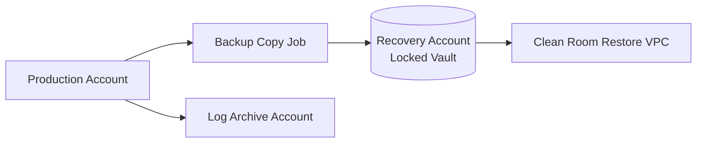
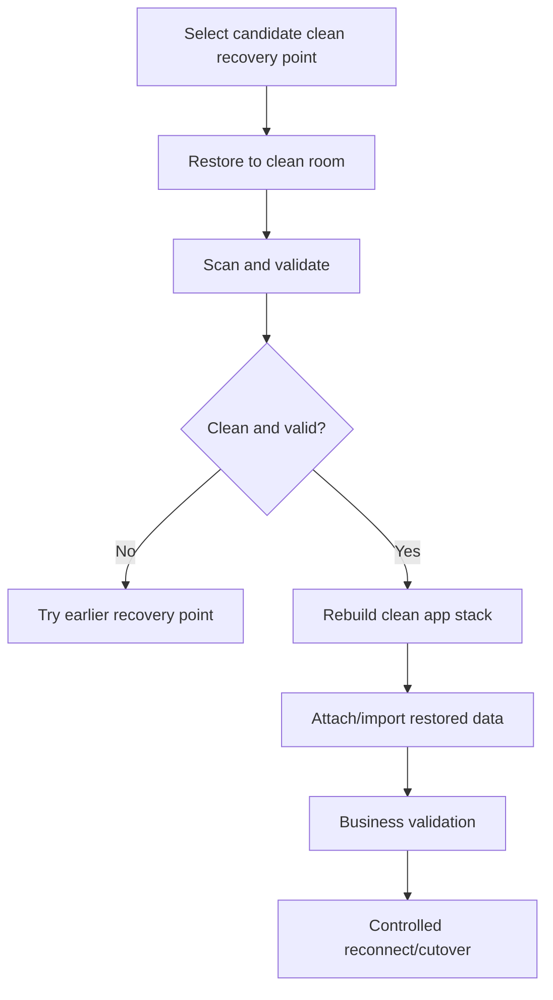

# Part 070 — Ransomware-Resilient Recovery and Immutable Backup Architecture

A normal backup strategy assumes honest mistakes and normal failures.

A ransomware-resilient recovery strategy assumes the attacker may have credentials.

That changes everything.

If an attacker can:

- delete backups
- shorten retention
- disable KMS keys
- delete object versions
- modify lifecycle
- disable replication
- encrypt live file shares
- poison backups with encrypted data
- compromise CI/CD images
- compromise admin roles
- access both production and backup accounts

then "we have backups" may not help.

Ransomware-resilient recovery is about making destructive actions difficult, detectable, delayed, and reversible.

It is about designing a recovery path that survives compromised production credentials.

This part focuses on immutable backup architecture and clean-room recovery on AWS.

---

## 1. Problem yang Diselesaikan

Part ini membahas:

- ransomware-resilient backup mental model
- immutable backup vs normal backup
- isolated recovery account
- AWS Backup Vault Lock
- logically air-gapped vaults
- S3 Object Lock
- EBS Snapshot Lock
- cross-account/cross-region backup copies
- KMS isolation and key deletion guardrails
- backup administrator separation
- clean-room restore
- malware-safe recovery validation
- stopping replication of corruption
- golden image trust
- incident runbooks
- game days and audit evidence

---

## 2. Threat Model

### 2.1 Assume production role compromise

The attacker may control:

- application runtime role
- CI/CD deployment role
- developer credentials
- admin user
- EC2 instance profile
- compromised Windows/AD credential
- S3 writer role
- backup operator with limited access

Design goal:

```text
production compromise should not imply backup destruction
```

### 2.2 Assume live data is untrusted

During ransomware incident:

- files may be encrypted
- object versions may include bad versions
- database rows may be corrupted
- backups after compromise may contain bad data
- replicas may contain encrypted data
- AMIs may contain malware
- logs may be tampered with if not protected

Recovery needs clean point selection.

### 2.3 Assume replication can propagate harm

Replication is useful for availability.

But ransomware can turn replication into a fast copier of corruption.

Design:

- point-in-time backup retained
- immutable recovery points
- ability to stop/pause replication
- versioned replicated destination
- clean recovery point selection

### 2.4 Assume KMS can be attacked

If key disabled/deleted or key policy changed, recovery can fail.

Protect:

- backup vault KMS keys
- S3 object KMS keys
- EBS snapshot keys
- recovery account keys
- key policies
- deletion scheduling
- grants

### 2.5 Assume operators are under pressure

Runbooks must be simple and tested.

During incident, do not rely on:

- tribal knowledge
- manual console exploration
- remembering which backup is clean
- untested scripts
- unavailable people

---

## 3. Immutable Backup Primitives

### 3.1 AWS Backup Vault Lock

Vault Lock can enforce retention on backup recovery points in a vault. In compliance mode, after the grace period ends, vault lock configuration cannot be changed or deleted while recovery points exist.

Use for:

- critical recovery points
- ransomware-resilient backup vaults
- compliance retention
- deletion resistance

Design:

- standard vault for normal backups
- locked vault for protected backups/copies
- carefully chosen min/max retention
- legal/security approval
- non-prod test first

### 3.2 Logically air-gapped vault

AWS Backup logically air-gapped vaults are backup vaults with additional security capabilities. AWS docs state logically air-gapped vaults come equipped with vault lock in compliance mode.

Use for:

- isolated recovery copies
- recovery sharing workflows
- stronger backup isolation
- reduced operational burden compared with maintaining separate copy workflows in some designs
- ransomware recovery posture

Design:

- dedicated vault
- min/max retention
- recovery account access
- restore sharing plan
- KMS behavior understood
- game day restore

### 3.3 S3 Object Lock

S3 Object Lock prevents object versions from deletion/overwrite under retention/legal hold.

Use for:

- backup objects
- audit logs
- evidence
- immutable replicas
- application records requiring WORM

Modes:

- Governance: privileged bypass possible with permission
- Compliance: no delete/overwrite until retention expires

### 3.4 EBS Snapshot Lock

EBS Snapshot Lock protects snapshots from deletion for specified retention.

Use for:

- critical snapshots outside AWS Backup vault workflows
- pre-incident safety copies
- compliance/regulatory snapshot retention
- migration rollback points

### 3.5 Versioning and delete protection

For S3:

- versioning
- Object Lock
- deny `DeleteObjectVersion`
- deny versioning suspension
- lifecycle guardrails
- replication to protected account

For backups:

- vault policy
- Vault Lock
- cross-account copy
- restricted `DeleteRecoveryPoint`
- alert on deletion attempt

### 3.6 Immutability is not validation

Immutable bad backup is still bad.

Need:

- malware scanning
- application validation
- clean recovery point selection
- known-good image verification
- integrity checks
- recovery game days

---

## 4. Recovery Account Architecture

### 4.1 Account structure



### 4.2 Recovery account responsibilities

The recovery account should contain:

- locked backup vaults
- logically air-gapped vaults where used
- KMS recovery keys
- restore IAM roles
- clean-room VPCs
- forensic tooling
- malware scanning tooling
- isolated S3 buckets
- recovery pipelines
- minimal admin access
- monitored CloudTrail

### 4.3 Source account restrictions

Production accounts should not be able to:

- delete recovery account backups
- disable recovery KMS keys
- modify recovery vault policies
- disable recovery logging
- assume high-privilege recovery roles casually

### 4.4 Recovery role model

Roles:

| Role | Purpose |
|---|---|
| backup-copy-writer | copy recovery points into recovery vault |
| recovery-operator | restore selected recovery point |
| security-break-glass | incident-only admin |
| validator | run validation/scanning |
| auditor | read-only evidence |

Separate normal app/platform roles from recovery roles.

### 4.5 Recovery account anti-pattern

Bad:

```text
same admin group owns prod and recovery account with same credentials and no MFA/change control
```

If attacker gets admin, both environments fall.

---

## 5. KMS Isolation

### 5.1 KMS as recovery dependency

Encrypted recovery points require decrypt.

If KMS key is unavailable, recovery point is unusable.

### 5.2 Separate recovery keys

Use recovery account KMS keys for copied backups where possible.

Benefits:

- production key deletion does not destroy copied backup access
- recovery account controls decrypt
- key policy can restrict restore
- incident can isolate production

### 5.3 Key policy design

Allow:

- AWS Backup service
- recovery operator role
- restore validation role
- limited security admins

Deny/avoid:

- broad production admin decrypt
- application runtime decrypt of recovery vault data
- accidental key deletion
- unreviewed key policy change

### 5.4 Key deletion monitoring

Alert on:

- ScheduleKeyDeletion
- DisableKey
- PutKeyPolicy
- CreateGrant for broad principal
- DeleteAlias
- key rotation policy changes where relevant

### 5.5 KMS game day

Test:

- restore encrypted EBS snapshot
- restore EFS/FSx backup
- read S3 object encrypted with recovery key
- cross-account restore
- recovery operator least privilege
- key disabled simulation in non-prod

---

## 6. Backup Copy and Isolation Patterns

### 6.1 Same-account locked vault

Good:

- simple
- protects from accidental deletion
- Vault Lock strengthens retention

Weakness:

- if account compromise includes enough privileges before lock or via non-locked paths, risk remains
- same account dependencies

Use for:

- baseline protection
- workloads not requiring full account isolation
- supplement to cross-account copy

### 6.2 Cross-account locked vault

Better for critical data.

Pattern:

```text
prod backup -> copy to security account locked vault
```

Benefits:

- source account compromise less likely to delete copy
- separate KMS
- separate operators
- restore into clean account

### 6.3 Cross-region locked copy

Use when Region recovery is required.

Pattern:

```text
prod ap-southeast-1 -> security account ap-southeast-3 locked vault
```

Consider:

- data residency
- KMS in destination
- restore environment
- copy completion lag
- cost

### 6.4 S3 protected replica

Pattern:

```text
source bucket -> destination security account bucket with Object Lock
```

Use for:

- object-level backup-like protection
- evidence/logs
- immutable application records
- account-isolated copy

### 6.5 Backup plus object versioning

For S3 critical objects:

```text
Versioning + Object Lock + replication + AWS Backup
```

This may look redundant, but each layer solves a different class of failure.

---

## 7. Clean-Room Restore

### 7.1 What clean-room means

Clean-room restore is recovery in an isolated environment that does not trust production runtime.

It prevents:

- re-infecting restored data
- exposing clean backups to compromised systems
- accidentally reconnecting to malicious clients
- using compromised IAM roles/secrets
- overwriting clean data

### 7.2 Clean-room components

- isolated VPC
- no inbound from prod
- controlled outbound
- recovery IAM roles
- recovery KMS
- restored data
- clean compute image
- scanning tools
- validation scripts
- limited operator access
- logging to secure account

### 7.3 Restore flow



### 7.4 Recovery point selection

Do not automatically choose latest backup after ransomware.

Choose based on:

- first suspicious activity time
- malware detection
- encryption start time
- file/object modification spike
- backup job time
- known-good application version
- logs/audit evidence
- business validation

### 7.5 Malware-safe restore

For file/object data:

- scan restored files
- look for encrypted/renamed patterns
- detect anomalous entropy where relevant
- compare checksums/manifests
- validate file formats
- restore only needed paths first
- avoid executing restored binaries/scripts blindly

### 7.6 Clean compute

Do not boot from compromised AMI if attack may have modified instance images.

Use:

- golden AMI from trusted pipeline
- container image from trusted registry/attestation
- fresh OS image
- patched baseline
- rotated secrets
- least privilege roles

---

## 8. Stopping Harm Propagation

### 8.1 Stop writers

Immediately:

- disable compromised IAM roles
- stop affected EC2/ECS/EKS/Lambda writers
- revoke tokens
- rotate credentials
- block suspicious IPs
- pause schedulers
- disable destructive automation

### 8.2 Stop dangerous replication

If corruption/encryption is replicating:

- pause replication where safe
- disable jobs that propagate changes
- stop lifecycle deletes
- preserve current replica state
- snapshot/backup replica before further action

### 8.3 Preserve evidence

Before cleaning:

- copy logs
- snapshot affected volumes
- preserve S3 versions
- export CloudTrail
- preserve IAM changes
- record timestamps
- isolate compromised resources

### 8.4 Protect backups

During incident:

- verify vault lock status
- restrict backup admin changes
- alert on DeleteRecoveryPoint
- confirm cross-account copies
- preserve old recovery points
- avoid shortening retention
- suspend lifecycle delete if needed

### 8.5 Freeze business workflows

If data integrity uncertain:

- put app read-only
- stop background jobs
- stop data exports
- prevent customer-facing writes if needed
- communicate internally

---

## 9. Ransomware Detection Signals

### 9.1 Storage behavior

Signals:

- massive file modifications
- rapid rename patterns
- file extensions changed
- object overwrite spike
- delete marker spike
- version count spike
- EFS/FSx write throughput anomaly
- S3 PutObject/DeleteObjectVersion spike
- backup deletion attempts
- lifecycle policy changes
- KMS disable/delete attempts

### 9.2 IAM behavior

Signals:

- unusual role assumption
- policy modified to allow delete
- new access keys
- MFA disabled
- unusual source IP
- unusual service principal usage
- denied attempts to vault/object lock

### 9.3 Backup behavior

Signals:

- backup plan disabled
- vault policy changed
- recovery point deletion attempted
- Vault Lock change attempted
- copy jobs disabled
- restore to unknown location
- backup failure spike

### 9.4 Application behavior

Signals:

- unreadable files
- checksum mismatch
- weird file headers
- sudden support tickets
- error spike in file parsers
- thumbnail/transcode failure
- search index corrupt

### 9.5 Detection is defense-in-depth

Do not rely on one signal.

Combine:

- CloudTrail
- GuardDuty
- Security Hub
- AWS Backup Audit Manager
- S3 Storage Lens/Inventory
- CloudWatch metrics
- application checksums
- endpoint/security tooling
- file integrity monitoring

---

## 10. Incident Runbook

### 10.1 Declare and contain

1. Declare security incident.
2. Identify affected accounts/resources.
3. Disable/contain compromised credentials.
4. Stop writers/automation.
5. Pause replication/lifecycle where harmful.
6. Preserve evidence.
7. Restrict backup vault access.

### 10.2 Determine clean point

1. Identify earliest compromise time.
2. Identify corruption/encryption start time.
3. Find recovery points before that time.
4. Check copies in locked vault/recovery account.
5. Choose candidate clean recovery point.
6. Record RPO actual.

### 10.3 Restore to clean room

1. Restore data into isolated account/VPC.
2. Use clean compute image.
3. Use recovery KMS/IAM roles.
4. Do not attach to production network.
5. Scan restored data.
6. Validate business data.
7. Reject if signs of compromise.

### 10.4 Rebuild application

1. Deploy from trusted IaC.
2. Use trusted AMI/container images.
3. Rotate secrets.
4. Use new IAM roles if needed.
5. Attach/import clean data.
6. Run app smoke tests.
7. Run security validation.

### 10.5 Controlled reconnect

1. Decide new primary.
2. Route traffic gradually.
3. Monitor.
4. Keep old environment isolated.
5. Preserve forensic evidence.
6. Communicate status.
7. Plan post-incident remediation.

### 10.6 Post-incident

- root cause analysis
- credential rotation complete
- backup gaps fixed
- detection rules updated
- retention policies reviewed
- game day scheduled
- controls hardened
- legal/compliance reporting

---

## 11. Service-Specific Resilience Patterns

### 11.1 S3 critical data

Use:

- versioning
- Object Lock
- legal hold
- cross-account replication
- deny version delete
- AWS Backup for S3/PITR
- S3 Inventory audit
- CloudTrail data events
- KMS key guardrails

Recovery:

- restore exact version
- restore from protected replica
- restore from AWS Backup to isolated bucket
- validate catalog

### 11.2 EBS/EC2

Use:

- AWS Backup locked vault
- EBS Snapshot Lock for critical snapshots
- cross-account snapshot copy
- trusted AMI pipeline
- DLM/app-consistent snapshots
- KMS recovery key

Recovery:

- restore volume in clean room
- scan/mount read-only
- attach to clean instance
- validate app
- avoid compromised AMI

### 11.3 EFS

Use:

- AWS Backup
- cross-account/cross-region copy where needed
- EFS replication for DR but not as only ransomware protection
- access point least privilege
- file integrity monitoring
- restore to new EFS for validation

Recovery:

- item restore or full restore
- validate POSIX permissions
- scan files
- attach to clean app

### 11.4 FSx Windows

Use:

- FSx backups
- shadow copies for quick user restore
- protected backup copies
- AD hardening
- least privilege SMB ACLs
- audit logging

Recovery:

- restore to new FSx in clean environment
- validate AD/ACLs
- scan files
- route via DFS after validation

### 11.5 FSx ONTAP/OpenZFS

Use:

- snapshots
- backups
- clone validation
- replication with corruption awareness
- snapshot retention protection
- admin separation

Recovery:

- clone snapshot to inspect
- restore backup to new volume/system
- scan/validate
- copy back or cut over

### 11.6 File Cache / FSx Lustre scratch

Use:

- durable S3 source/output
- checkpoint export
- no assumption of cache durability
- output manifest commit

Recovery:

- destroy contaminated cache
- recreate from clean source
- rerun jobs from clean checkpoint

---

## 12. Governance Controls

### 12.1 Prevent backup deletion

Controls:

- Vault Lock
- locked/logically air-gapped vault
- cross-account vault
- deny DeleteRecoveryPoint
- monitor delete attempts
- separated admin roles

### 12.2 Prevent retention weakening

Controls:

- approve backup plan changes
- alert retention decrease
- lock critical vaults
- SCP deny critical changes
- change management

### 12.3 Prevent KMS destruction

Controls:

- deny ScheduleKeyDeletion except key admins
- alert DisableKey
- key deletion waiting period
- key policy review
- recovery key copies
- quarterly KMS restore tests

### 12.4 Prevent public exposure

Controls:

- S3 Block Public Access
- EBS snapshot block public access
- AMI public launch permission monitor
- bucket policies
- SCP guardrails

### 12.5 Prevent backup coverage gaps

Controls:

- required BackupTier tag
- AWS Config rules
- AWS Backup Audit Manager
- deployment policy-as-code
- daily unprotected resource report

---

## 13. Restore Validation Levels

### 13.1 Level 0 — Recovery point exists

Not enough.

### 13.2 Level 1 — Resource restored

Examples:

- EBS volume created
- EFS restored
- S3 bucket restored
- FSx file system restored

Still not enough.

### 13.3 Level 2 — Data readable

- app role can read/decrypt
- sample files/records available
- checksums match

Better.

### 13.4 Level 3 — Application runs

- app starts
- health checks pass
- critical user journey works
- background workers safe

Production-ready baseline.

### 13.5 Level 4 — Security-clean restore

- restored into clean room
- malware scan
- clean compute image
- secrets rotated
- compromised dependencies excluded
- security approval

Needed for ransomware.

### 13.6 Level 5 — Full business recovery

- users routed
- data authority established
- RTO/RPO measured
- monitoring active
- incident communication complete
- failback plan known

---

## 14. Game Days

### Scenario 1 — Backup deletion attempt

Expected:

- Vault Lock blocks deletion
- alert fires
- actor identified
- recovery points remain

### Scenario 2 — KMS disabled

Expected:

- restore test fails in non-prod
- alert fires
- key admin fixes policy/state
- recovery docs updated

### Scenario 3 — S3 object ransomware

Inject:

- overwrite/delete test prefix

Expected:

- versioning/Object Lock protects versions
- protected replica intact
- restore exact version
- catalog validates checksum

### Scenario 4 — FSx Windows encryption simulation

Inject:

- test share files renamed/encrypted by controlled script

Expected:

- stop writer
- identify clean shadow/backup
- restore to clean FSx
- validate ACL/user access

### Scenario 5 — Clean-room restore

Expected:

- recovery account restore
- clean compute boot
- malware scan
- app smoke test
- controlled traffic cutover simulation

### Scenario 6 — Poisoned latest backup

Expected:

- latest backup rejected by validation
- earlier clean recovery point chosen
- RPO actual recorded

---

## 15. Observability and Audit

### 15.1 Immutable backup dashboard

Show:

- vault lock status
- logically air-gapped vault inventory
- recovery points by vault
- protected copies by account/Region
- retention min/max
- delete attempts
- restore test status
- KMS key status
- backup copy failures

### 15.2 Object immutability dashboard

Show:

- Object Lock buckets
- default retention
- objects under legal hold
- governance bypass attempts
- compliance retention expiry
- delete marker spikes
- version delete attempts
- replication to locked destination

### 15.3 Security event dashboard

Show:

- IAM policy changes
- new access keys
- unusual role assumptions
- KMS disable/delete attempts
- backup plan changes
- vault policy changes
- S3 lifecycle changes
- snapshot/AMI sharing changes

### 15.4 Recovery confidence dashboard

Show:

- last clean-room restore test
- last cross-account restore
- last KMS recovery test
- last application validation
- RTO/RPO actual
- unresolved recovery gaps
- owner

---

## 16. Architecture Review Checklist

### 16.1 Immutability

- [ ] Critical recovery points stored in locked vault or equivalent.
- [ ] S3 critical objects use Object Lock where required.
- [ ] EBS critical snapshots use Snapshot Lock or AWS Backup Vault Lock.
- [ ] Retention approved by legal/security.
- [ ] Governance/compliance mode chosen intentionally.
- [ ] Delete/bypass permissions restricted.

### 16.2 Isolation

- [ ] Cross-account copy exists for critical backups.
- [ ] Recovery account access separated.
- [ ] Recovery KMS key independent.
- [ ] Source account cannot delete recovery copies.
- [ ] Clean-room VPC exists or can be deployed.
- [ ] Restore roles tested.

### 16.3 Detection

- [ ] Delete attempts alarm.
- [ ] Retention change alarm.
- [ ] KMS disable/delete alarm.
- [ ] Replication disabled alarm.
- [ ] Lifecycle change alarm.
- [ ] Unusual storage modification alarm.
- [ ] Backup coverage audit.

### 16.4 Recovery

- [ ] Clean recovery point selection runbook.
- [ ] Clean-room restore tested.
- [ ] Malware/security validation defined.
- [ ] Trusted compute image pipeline.
- [ ] Secrets rotation procedure.
- [ ] Failover/cutover runbook.
- [ ] Failback/reintegration plan.

---

## 17. Mini Case Study — Ransomware Against File Share

### 17.1 Situation

A compromised Windows service account encrypts files on FSx Windows.

### 17.2 Bad design

- shadow copies only
- backups in same account
- no immutable vault
- AD admin can delete backups
- no restore test
- DFS points directly to file system

### 17.3 Better design

- FSx backups copied to recovery account
- locked vault with retention
- shadow copies for quick user restore
- audit logging enabled
- AD groups least privilege
- recovery account clean-room FSx restore
- DFS namespace supports cutover
- quarterly restore test

### 17.4 Incident recovery

1. Disable compromised service account.
2. Stop SMB access.
3. Identify encryption start time.
4. Choose clean backup before compromise.
5. Restore to clean FSx in recovery environment.
6. Validate files and ACLs.
7. Scan restored data.
8. Rotate secrets/service accounts.
9. Switch DFS to clean share.
10. Preserve old share for forensics.

### 17.5 Invariant

```text
Shadow copies help users.
Locked cross-account backups save the business.
```

---

## 18. Mini Case Study — S3 Delete Attack

### 18.1 Situation

Compromised role attempts to delete object versions from evidence bucket.

### 18.2 Protection

- bucket versioning enabled
- Object Lock compliance mode for accepted evidence
- deny DeleteObjectVersion except break-glass
- replication to security account locked bucket
- CloudTrail data events
- S3 Inventory audits Object Lock status
- AWS Backup for S3 PITR

### 18.3 Result

- current delete creates delete marker but locked versions remain
- version delete denied
- alerts fire
- source credentials disabled
- evidence catalog still references exact locked version
- recovery account copy validated

### 18.4 Invariant

```text
Application roles can write new evidence.
They cannot destroy accepted evidence history.
```

---

## 19. Mini Case Study — KMS Key Near-Deletion

### 19.1 Situation

An operator schedules deletion of a KMS key used by old EBS snapshots.

### 19.2 Detection

CloudTrail alert:

```text
ScheduleKeyDeletion
```

### 19.3 Response

1. Cancel deletion.
2. Inventory snapshots using key.
3. Copy/re-encrypt critical snapshots to recovery key if needed.
4. Update key ownership and policy.
5. Add guardrail requiring approval.
6. Run restore test.

### 19.4 Invariant

```text
A backup encrypted by a deleted key is not a backup.
```

---

## 20. Summary

Ransomware-resilient recovery requires assuming the attacker may have production credentials.

Key principles:

1. Store critical backups outside production blast radius.
2. Use immutable retention: Vault Lock, Object Lock, Snapshot Lock where appropriate.
3. Separate recovery account and KMS keys.
4. Protect against backup deletion and retention weakening.
5. Stop harmful replication during corruption incidents.
6. Restore into clean room, not compromised production.
7. Validate backups for malware and business correctness.
8. Use trusted compute images and rotated secrets.
9. Monitor destructive actions and backup control-plane changes.
10. Test clean-room recovery with game days.

The core rule:

> Backups protect against failure. Immutable, isolated, tested backups protect against compromise.

Next, Part 071 moves from recovery architecture into observability and operations excellence for compute/storage: metrics, logs, tracing, SLOs, CloudWatch, EventBridge, CloudTrail, AWS Config, cost and capacity signals, and operational dashboards.

---

## References

- AWS Backup Developer Guide — AWS Backup Vault Lock: https://docs.aws.amazon.com/aws-backup/latest/devguide/vault-lock.html
- AWS Backup Developer Guide — Logically air-gapped vault: https://docs.aws.amazon.com/aws-backup/latest/devguide/logicallyairgappedvault.html
- AWS Backup Developer Guide — Primary backups to logically air-gapped vaults: https://docs.aws.amazon.com/aws-backup/latest/devguide/lag-vault-primary-backup.html
- Amazon S3 User Guide — Locking objects with S3 Object Lock: https://docs.aws.amazon.com/AmazonS3/latest/userguide/object-lock.html
- Amazon EBS User Guide — Lock an Amazon EBS snapshot: https://docs.aws.amazon.com/ebs/latest/userguide/ebs-lock-snapshot.html
- Amazon EBS User Guide — Block public access for EBS snapshots: https://docs.aws.amazon.com/ebs/latest/userguide/block-public-access-snapshots.html
- AWS Backup Developer Guide — Managing AWS Backup across multiple AWS accounts: https://docs.aws.amazon.com/aws-backup/latest/devguide/manage-cross-account.html
- AWS Prescriptive Guidance — Backup and recovery approaches on AWS: https://docs.aws.amazon.com/prescriptive-guidance/latest/backup-recovery/overview.html
