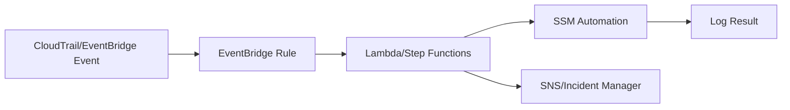

# Part 071 — Compute and Storage Observability Signal Design

Observability is not "we have dashboards."

Observability is the ability to answer operational questions quickly enough to make correct decisions.

For AWS compute and storage, those questions include:

- Is the workload healthy?
- Is it slow because compute is saturated, storage is saturated, or dependency latency increased?
- Are users affected?
- Is a disk filling?
- Is S3 replication lagging?
- Is EFS throughput constrained?
- Is FSx failing backups?
- Did someone disable versioning?
- Did a lifecycle rule delete recovery points?
- Are snapshots being created?
- Can we restore?
- Is cost rising because of noncurrent versions, stale snapshots, or idle file systems?
- Is this alarm actionable or noise?
- Is this a symptom or a cause?

The goal is not to collect every signal.

The goal is to collect the right signals, preserve context, alert only on actionable risk, and connect the signal to a runbook.

---

## 1. Problem yang Diselesaikan

Part ini membahas:

- observability mental model untuk compute/storage
- telemetry types: metrics, logs, traces, events, config state, cost, inventory
- SLI/SLO/error budget for infrastructure
- CloudWatch metrics, logs, alarms, dashboards, anomaly detection, composite alarms
- CloudTrail management/data/network events
- EventBridge event routing
- AWS Config drift/compliance signals
- service-specific signals for EC2, Auto Scaling, EBS, S3, EFS, FSx, AWS Backup
- capacity and cost observability
- dashboard design
- alert design
- operational query examples
- anti-patterns

---

## 2. Mental Model

### 2.1 Observability is question-driven

Do not start with:

```text
What metrics are available?
```

Start with:

```text
What questions must we answer during an incident?
```

Example:

```yaml
question: Why is upload latency high?
neededSignals:
  - app p95 upload latency
  - app 5xx/4xx
  - S3 PutObject latency/error
  - multipart upload failure count
  - EC2 CPU/network
  - ALB target response time
  - KMS throttling/AccessDenied
  - request correlation id
runbook: upload-latency
```

### 2.2 Signals have different jobs

| Signal type | Best for |
|---|---|
| metrics | trends, thresholds, SLOs, capacity, alerting |
| logs | details, causality, debugging, forensic |
| traces | request path and dependency latency |
| events | state changes, API actions, automation triggers |
| config state | drift, compliance, missing controls |
| inventory | offline audit, large-scale discovery |
| cost | waste, runaway lifecycle/snapshots, idle capacity |

### 2.3 Golden signals are not enough

Classic golden signals:

- latency
- traffic
- errors
- saturation

For compute/storage, add:

- durability/protection status
- recovery readiness
- replication lag
- backup age
- snapshot age
- storage growth rate
- permission failures
- lifecycle transitions
- delete/overwrite/version events
- capacity-to-exhaustion
- restore test status

### 2.4 Symptoms vs causes

A good dashboard separates:

```text
user symptom
resource saturation
control-plane change
protection degradation
cost/capacity trend
```

Example:

- symptom: upload p95 8s
- saturation: app network egress 90%
- cause candidate: KMS throttling
- change: new SSE-KMS key policy deployed
- protection: S3 replication failing due KMS deny

### 2.5 Alert must map to action

Every page-worthy alert needs:

```yaml
alert:
  name:
  impact:
  severity:
  owner:
  runbook:
  likelyCauses:
  firstChecks:
  rollback:
  escalation:
```

If no action exists, it is not a page. It is a metric, report, or investigation item.

---

## 3. Telemetry Layers

### 3.1 Application layer

Examples:

- request latency
- error rate
- queue lag
- upload/download latency
- file open duration
- S3 object operation latency
- database operation latency
- cache hit ratio
- retry count
- idempotency conflict count
- business transaction count

This is usually the best signal for user impact.

### 3.2 Compute layer

Examples:

- EC2 CPU
- memory from CloudWatch Agent
- disk filesystem usage
- network packets/bytes/errors
- status checks
- Auto Scaling desired/in-service capacity
- instance launch failures
- Spot interruption
- EBS volume queue/latency/throughput
- container node pressure

### 3.3 Storage layer

Examples:

- S3 4xx/5xx/request metrics
- S3 replication metrics
- EBS volume metrics
- EFS throughput/IO limit/storage
- FSx throughput/IOPS/capacity
- file system backup status
- snapshot age
- delete marker count
- noncurrent version bytes
- lifecycle transitions

### 3.4 Control-plane layer

Examples:

- CloudTrail API events
- EventBridge service events
- AWS Config compliance changes
- backup plan change
- lifecycle rule change
- security group change
- KMS key disabled
- AMI deregistered
- snapshot deleted
- replication disabled
- versioning suspended

Control-plane events often explain sudden failures.

### 3.5 Protection layer

Examples:

- last successful backup
- latest recovery point age
- latest restore test
- replica lag
- cross-account copy status
- vault lock status
- Object Lock status
- backup failure
- restore job failure
- KMS recovery test result

Protection-layer observability is what separates reliable systems from hopeful systems.

### 3.6 Cost/capacity layer

Examples:

- EBS unattached volumes
- old snapshots
- stale AMIs
- S3 noncurrent version bytes
- incomplete multipart uploads
- EFS/FSx idle file systems
- provisioned throughput unused
- high cross-AZ traffic
- backup storage growth
- Fast Snapshot Restore enabled too broadly

Cost is an operational signal.

---

## 4. CloudWatch Metrics

### 4.1 Metrics are numeric time series

Metrics should answer:

- how much?
- how fast?
- how often?
- how long?
- how close to limit?
- how fast is it growing?

Common dimensions:

- service
- environment
- resource ID
- account
- region
- availability zone
- workload
- storage class
- operation
- error type

### 4.2 Metric design principles

Good metrics:

- stable naming
- bounded cardinality
- actionable dimensions
- tied to SLO/runbook
- include both rate and absolute count where useful
- distinguish success, failure, retry, timeout
- include saturation and capacity-to-exhaustion

Bad metrics:

- unbounded user ID as dimension
- only average latency
- no operation dimension
- no environment tag
- emitted only on failure
- no unit
- no owner

### 4.3 Percentiles over averages

Averages hide pain.

Track:

- p50
- p90
- p95
- p99
- max where useful
- request count
- error count

For storage:

- p95 file open latency
- p99 S3 GET latency
- p95 EBS read latency
- p95 checkpoint duration
- p99 restore validation duration

### 4.4 Saturation metrics

Saturation asks:

```text
How close is the system to a hard or soft limit?
```

Examples:

- CPU > 80%
- memory > 85%
- disk filesystem > 85%
- EBS throughput approaching provisioned limit
- EBS IOPS near provisioned limit
- EFS percent I/O limit
- FSx throughput utilization
- S3 prefix request rate/error
- Auto Scaling max capacity reached
- subnet IP exhaustion
- service quota near limit

### 4.5 Leading indicators

Leading indicators predict incidents:

- disk projected full in 8 hours
- snapshot copy lag increasing
- backup jobs failing
- replica lag beyond RPO
- lifecycle rule change on protected bucket
- queue lag rising
- error budget burn increasing
- increasing throttles
- increasing retries

### 4.6 Metric math

Use metric math to build useful signals:

```text
disk_free_hours = free_bytes / bytes_growth_per_hour
backup_rpo_breach = now - last_successful_backup_time > target_rpo
replication_lag_breach = lag_seconds > rpo_seconds
capacity_utilization = used / provisioned
```

### 4.7 Anomaly detection

CloudWatch anomaly detection can model expected metric values based on historical patterns. Use it when static thresholds are weak, such as:

- daily traffic patterns
- weekday/weekend workloads
- backup job duration
- S3 request rate
- EFS throughput
- batch job latency
- storage growth

Do not blindly page on anomaly. Pair anomaly with impact or risk.

### 4.8 Composite alarms

Composite alarms combine other alarms into higher-level health indicators.

Example:

```text
Page only if:
  app_error_rate_high AND
  app_latency_high AND
  not_deploy_in_progress
```

or:

```text
storage_risk_critical =
  disk_full_soon OR
  backup_rpo_breach OR
  replication_lag_breach
```

Composite alarms reduce noise and improve signal quality.

---

## 5. Logs

### 5.1 Logs explain why

Metrics tell you something changed.

Logs explain what happened.

Good logs include:

- timestamp
- service
- environment
- request ID
- correlation ID
- operation
- resource ID
- bucket/key/version where safe
- volume/file system ID
- error code
- retry count
- latency
- user/tenant if allowed
- decision reason

### 5.2 Structured logs

Prefer JSON structured logs.

Example:

```json
{
  "event": "s3_upload_failed",
  "service": "evidence-api",
  "requestId": "req-123",
  "bucket": "evidence-prod",
  "key": "objects/...",
  "versionId": null,
  "errorCode": "AccessDenied",
  "kmsKeyId": "alias/evidence",
  "latencyMs": 734,
  "retryCount": 3
}
```

### 5.3 Log levels

Use:

- DEBUG: detailed local debugging
- INFO: important state transitions
- WARN: recoverable but suspicious
- ERROR: failed operation needing investigation
- FATAL: process cannot continue

Avoid logging every successful low-level operation at high scale without sampling.

### 5.4 Storage logs

Useful events to log:

- object upload committed
- manifest committed
- version ID stored
- file restore started/completed
- snapshot selected
- mount failure
- permission denied
- delete request accepted/denied
- lifecycle policy update
- replication failure
- backup failure
- restore validation result

### 5.5 Log retention

Retention depends on use:

- debugging: days/weeks
- audit: months/years
- compliance: years
- security: aligned with incident requirements

Audit/security logs should be protected from tampering, often in log archive account or locked S3 bucket.

---

## 6. Traces

### 6.1 Traces show request path

Trace a user request through:

```text
ALB -> service -> KMS -> S3 -> DB -> event bus -> worker
```

This helps identify:

- dependency latency
- retries
- failed downstream call
- slow storage operation
- queue delay
- cold start
- serialization overhead

### 6.2 Storage spans

Instrument:

- S3 GET/PUT/HEAD/COPY
- EFS/FSx file open/read/write when app-level wrapper exists
- EBS-backed DB/storage calls at app layer
- backup/restore orchestration
- KMS calls
- DataSync/task orchestration where app controls it

### 6.3 Trace identifiers in objects

For workflows, store trace/job IDs in:

- object metadata
- manifest
- catalog
- logs
- event payload

This enables investigation across object storage and application state.

### 6.4 Avoid tracing every byte

Trace operations, not every read chunk.

Sample high-volume traffic.

Preserve full traces for:

- errors
- slow requests
- critical workflows
- recovery tests
- audit-sensitive transactions

---

## 7. CloudTrail and Control-Plane Observability

### 7.1 CloudTrail event types

CloudTrail records API activity. Event categories include management events, data events, network activity events, and Insights events. By default, trails/event data stores log management events, but not every data/network/Insights category unless configured.

Use CloudTrail for:

- who changed lifecycle rule
- who deleted snapshot
- who disabled KMS key
- who modified security group
- who suspended versioning
- who started restore
- who changed backup plan
- who shared AMI/snapshot
- who deleted object version if data events enabled

### 7.2 Management events

Examples:

- CreateSnapshot
- DeleteSnapshot
- DeregisterImage
- PutBucketLifecycleConfiguration
- PutBucketVersioning
- CreateBackupPlan
- DeleteRecoveryPoint
- DisableKey
- AuthorizeSecurityGroupIngress

These should be centrally logged.

### 7.3 Data events

Enable selectively for critical buckets/Lambda/etc.

Examples:

- S3 GetObject
- PutObject
- DeleteObject
- DeleteObjectVersion

Data events can be high volume/cost. Use on critical prefixes/buckets and security-sensitive data.

### 7.4 CloudTrail Lake / event data store

Use for longer-term query and investigation:

- destructive API query
- key policy change history
- backup control-plane audit
- S3 data access forensic
- snapshot share history

### 7.5 CloudTrail to EventBridge

CloudTrail events can be matched by EventBridge rules for automation or notification.

Examples:

- KMS ScheduleKeyDeletion -> page security
- DeleteSnapshot -> notify storage owner
- PutBucketVersioning suspended -> auto-remediate/re-enable
- DeleteRecoveryPoint -> security incident
- ModifySnapshotAttribute public -> remove public access

---

## 8. EventBridge

### 8.1 EventBridge routes state changes

EventBridge rules match event patterns and send events to targets.

Targets can include:

- Lambda
- SNS
- SQS
- Step Functions
- Systems Manager Automation
- Incident Manager
- EventBridge bus in another account

### 8.2 Useful compute/storage events

Examples:

- EC2 instance state-change
- Auto Scaling launch/terminate
- EBS snapshot status changes
- AWS Backup job state change
- AWS Health event
- Config compliance change
- CloudTrail API events
- S3 object events through EventBridge
- ECS/EKS task/node state changes

### 8.3 Event pattern design

Match only what matters.

Bad:

```json
{
  "source": ["aws.ec2"]
}
```

Better:

```json
{
  "source": ["aws.ec2"],
  "detail-type": ["EBS Snapshot Notification"],
  "detail": {
    "event": ["createSnapshot"],
    "result": ["failed"]
  }
}
```

Exact event formats vary; validate with captured sample events.

### 8.4 Event-driven remediation

Pattern:



### 8.5 Guardrails for automation

Automation can make outages worse.

Require:

- dry-run mode
- allow-list resources
- safety checks
- rate limits
- rollback
- human approval for destructive actions
- idempotency
- audit logs

---

## 9. AWS Config

### 9.1 Config tracks resource configuration

AWS Config records resource configuration and evaluates compliance against rules.

Use for:

- EBS encryption
- backup required tag
- public snapshot
- S3 versioning enabled
- S3 bucket public access blocked
- EFS/FSx backup protected
- security group unrestricted ingress
- KMS key rotation/deletion policy
- AMI age
- lifecycle policy presence

### 9.2 Compliance is drift signal

Config answers:

```text
Is the resource configured the way architecture requires?
```

Examples:

- EFS not protected by backup plan
- S3 bucket versioning suspended
- EBS volume unencrypted
- snapshot public
- root volume delete-on-termination wrong
- security group open to world

### 9.3 Remediation

AWS Config can apply remediation using Systems Manager Automation documents. Remediation can be manual or automatic.

Use automatic remediation for safe cases:

- re-enable S3 Block Public Access
- remove public snapshot permission
- tag missing owner? maybe not automatic
- stop public security group? only with care

Use manual approval for risky cases:

- delete noncompliant resources
- change production security group
- change lifecycle rule
- rotate key
- detach volume

### 9.4 Config anti-pattern

Bad:

```text
compliance dashboard exists but nobody owns violations
```

Fix:

- owner mapping
- SLA for remediation
- exception process
- weekly review
- auto-ticket
- deployment guardrails

---

## 10. Service-Specific Signals

### 10.1 EC2

Track:

- status check failed
- CPU utilization
- memory/disk via CloudWatch Agent
- network in/out/packets
- EBS attached volume latency
- instance state change
- reboot/stop/terminate events
- Spot interruption
- SSM agent status
- patch compliance
- AMI age
- Auto Scaling lifecycle events

Key alerts:

- status check failed with user impact
- ASG unable to maintain desired capacity
- disk full soon
- memory pressure
- repeated instance replacement
- SSM offline for critical nodes

### 10.2 Auto Scaling

Track:

- desired/in-service capacity
- pending/terminating instances
- launch failures
- scaling activity errors
- capacity rebalance
- mixed instance capacity availability
- warm pool readiness
- lifecycle hook timeout

Key alerts:

- in-service < minimum healthy
- launch failures > threshold
- max capacity reached while SLO bad
- lifecycle hook stuck

### 10.3 EBS

Track:

- VolumeReadOps/WriteOps
- VolumeReadBytes/WriteBytes
- VolumeQueueLength
- VolumeThroughputPercentage where applicable
- VolumeConsumedReadWriteOps where applicable
- BurstBalance for burstable volumes
- snapshot age
- snapshot failure
- FSR enabled snapshots
- unattached volumes
- volume modified state

Key alerts:

- latency high and queue length high
- approaching provisioned throughput/IOPS
- burst balance low for critical volume
- snapshot RPO breached
- unattached expensive volume

### 10.4 S3

Track:

- 4xx/5xx
- request rate
- first-byte latency
- total request latency
- replication latency/bytes pending/ops pending
- delete marker count
- noncurrent version bytes
- incomplete multipart uploads
- lifecycle transitions
- Object Lock/legal hold inventory
- versioning state
- bucket policy/lifecycle changes
- KMS errors

Key alerts:

- 5xx sustained
- 403 spike after deploy
- replication lag > RPO
- versioning suspended
- lifecycle changed on protected bucket
- delete marker/version delete spike
- KMS deny spike

### 10.5 EFS

Track:

- ClientConnections
- PercentIOLimit
- BurstCreditBalance if burst mode
- PermittedThroughput
- MeteredIOBytes
- storage bytes by class
- mount target health
- backup success
- replication status/lag
- NFS client errors
- app file open latency

Key alerts:

- PercentIOLimit high with app latency
- burst credits low
- backup failed/RPO breached
- replication lag breached
- mount errors after deployment

### 10.6 FSx

Common:

- storage capacity
- throughput/IOPS/latency
- backup status
- restore test status
- client connections
- network throughput
- file server health
- storage tier/capacity
- snapshot/clone count
- replication status
- AD health for Windows

FSx Windows:

- throughput capacity saturation
- storage capacity
- shadow copy status
- SMB session/access errors
- AD/DNS issues

FSx Lustre/File Cache:

- import/export task status
- data repository errors
- metadata ops
- cache capacity
- client mount status
- job I/O wait

FSx ONTAP/OpenZFS:

- volume capacity
- snapshot/clone sprawl
- tiering/capacity pool activity
- NFS/SMB permissions
- replication lag/tasks

### 10.7 AWS Backup

Track:

- backup job status
- copy job status
- restore job status
- restore testing status
- latest recovery point age
- recovery point deletion attempt
- vault lock state
- vault policy change
- protected resource coverage
- cross-account copy lag
- KMS errors

Key alerts:

- backup failed for critical resource
- RPO breach
- copy failed for protected tier
- restore testing failed
- delete recovery point attempted
- vault lock changed/attempted

---

## 11. SLOs for Compute and Storage

### 11.1 Infrastructure SLO examples

Compute:

```text
99.9% of requests served by healthy capacity within latency SLO
```

Storage:

```text
99.9% of object reads complete under 300ms for hot objects
```

Backup:

```text
100% of Gold resources have recovery point younger than 24h
```

Replication:

```text
99% of protected objects replicate within 15 minutes
```

Restore testing:

```text
100% of Platinum workloads pass restore test within last 90 days
```

### 11.2 Error budget for infrastructure

Infrastructure can have error budgets too:

- backup RPO breach minutes
- replication lag breach minutes
- storage latency SLO violations
- restore test failures
- capacity below redundancy threshold
- failed scaling activities

### 11.3 SLO anti-pattern

Bad:

```text
CPU must be below 70%
```

CPU is not user impact.

Better:

```text
p95 request latency < 300ms and error rate < 0.1%
```

Use CPU as diagnostic/saturation signal, not SLO alone.

### 11.4 Protection SLOs

For top-tier systems, define:

```yaml
backupCoverageSLO: 100% critical resources protected
rpoSLO: latest recovery point < 24h
restoreTestSLO: successful test every 90d
drReadinessSLO: standby health green 99.9%
replicationSLO: lag < 15m 99% of time
```

---

## 12. Dashboard Design

### 12.1 Dashboard hierarchy

Use layered dashboards:

1. Executive/service health
2. Application SLO
3. Compute health
4. Storage health
5. Data protection
6. Cost/capacity
7. Security/control-plane changes
8. Per-resource drilldown

### 12.2 Service health dashboard

Must answer:

- are users impacted?
- which dependency is failing?
- is this regional/zonal?
- is capacity sufficient?
- are recent changes correlated?
- which runbook?

### 12.3 Storage protection dashboard

Show:

- latest backups
- backup failures
- restore test status
- replication lag
- versioning/Object Lock status
- snapshot age
- KMS key health
- protected resource coverage

### 12.4 Capacity dashboard

Show:

- disk full in hours/days
- file system growth rate
- S3 version growth
- EBS volume growth
- subnet IP exhaustion
- ASG max capacity risk
- service quota proximity
- file count growth
- snapshot storage growth

### 12.5 Cost dashboard

Show:

- idle EC2
- unattached EBS
- old snapshots/AMIs
- S3 noncurrent versions
- incomplete multipart uploads
- EFS/FSx idle file systems
- backup storage by tier
- FSR cost
- cross-region copy cost

---

## 13. Alert Design

### 13.1 Severity model

Example:

| Severity | Meaning | Response |
|---|---|---|
| Sev1 | user-facing major outage/data risk | page immediately |
| Sev2 | degraded user experience or RPO risk | page/on-call urgent |
| Sev3 | risk if unaddressed | ticket/business hours |
| Sev4 | optimization/info | backlog/report |

### 13.2 Page on symptoms and critical risk

Page for:

- high error rate
- high latency
- unavailable critical capacity
- RPO breach for critical resource
- restore test failure for Platinum
- data protection control disabled
- destructive API on protected resource
- KMS key disabled
- backup vault deletion attempt

Do not page for:

- CPU 80% alone
- single transient 5xx
- non-critical cost anomaly at 3 AM
- expected batch spike
- one failed retry that self-healed

### 13.3 Multi-window burn alerts

For SLOs:

- fast burn: urgent
- slow burn: ticket/escalate

Example:

```text
5m error budget burn > critical
1h error budget burn > warning
```

### 13.4 Alert payload

Include:

```yaml
service:
environment:
region:
resource:
symptom:
severity:
runbook:
dashboard:
recentChanges:
owner:
firstThreeChecks:
```

### 13.5 Alert fatigue prevention

Use:

- composite alarms
- anomaly detection with guardrails
- maintenance windows
- suppression during deploy
- deduplication
- escalation policies
- review noisy alarms weekly

---

## 14. Operational Queries

### 14.1 "Why is this EC2 workload slow?"

Check:

- app latency/error
- CPU/memory
- EBS latency/queue
- network throughput
- dependency latency
- recent deploy
- instance replacement
- noisy neighbor
- Auto Scaling max

### 14.2 "Will this disk fill tonight?"

Check:

- current used/free
- growth rate
- cleanup job status
- backup/snapshot retention
- temp directory growth
- forecast time-to-full
- owner/action

### 14.3 "Can we restore this file?"

Check:

- storage service
- backup/version/snapshot
- latest recovery point
- permissions/KMS
- restore target
- item-level support
- validation runbook

### 14.4 "Did someone change the storage policy?"

Check:

- CloudTrail
- AWS Config timeline
- EventBridge alerts
- IaC deployment logs
- bucket lifecycle/versioning
- backup plan/vault policy
- KMS key policy

### 14.5 "Why is S3 cost increasing?"

Check:

- current object bytes
- noncurrent version bytes
- incomplete multipart uploads
- replication destination
- lifecycle transitions
- archive retrieval
- request rate
- Storage Lens/Inventory
- backup copies

### 14.6 "Is DR ready?"

Check:

- latest backup/copy
- latest restore test
- replica lag
- KMS readiness
- AMI/image copies
- standby health
- Route 53/ARC controls
- capacity/quota
- runbook age

---

## 15. Anti-Patterns

### 15.1 Dashboard museum

Lots of dashboards, nobody uses them.

Fix:

- dashboards mapped to incidents/runbooks
- on-call training
- remove unused graphs
- add decision context

### 15.2 CPU-only monitoring

CPU does not represent user health.

Add:

- latency
- errors
- saturation
- queue lag
- storage latency
- dependency errors

### 15.3 Alert without runbook

Every page needs action.

### 15.4 Logging secrets

Never log:

- access keys
- secret values
- tokens
- full PII payloads
- unredacted user documents
- encryption keys

### 15.5 No control-plane alerts

Data protection often fails because someone changed config.

Monitor changes, not just resource metrics.

### 15.6 Backup status hidden from service owners

App teams must see their recovery readiness.

### 15.7 No cost observability

Waste becomes architecture debt.

---

## 16. Implementation Checklist

### 16.1 Baseline

- [ ] CloudWatch metrics dashboard.
- [ ] CloudWatch agent for memory/disk where needed.
- [ ] Structured logs with correlation IDs.
- [ ] CloudTrail organization trail/event data store.
- [ ] EventBridge rules for critical destructive events.
- [ ] AWS Config rules for storage posture.
- [ ] Backup/restore status dashboard.
- [ ] Cost/capacity dashboard.
- [ ] Alarm-to-runbook mapping.

### 16.2 Compute

- [ ] EC2 status checks.
- [ ] CPU/memory/disk/network.
- [ ] ASG capacity/scaling failures.
- [ ] EBS latency/queue/throughput.
- [ ] SSM agent status.
- [ ] AMI age.
- [ ] Spot interruption handling.

### 16.3 Storage

- [ ] S3 request/error/replication/versioning signals.
- [ ] EFS throughput/backup/replication/mount signals.
- [ ] FSx capacity/throughput/backup/snapshot signals.
- [ ] Snapshot age and restore test status.
- [ ] Object Lock/Vault Lock/KMS health.
- [ ] Lifecycle and destructive policy changes.

### 16.4 Operations

- [ ] Severity model.
- [ ] Alert review cadence.
- [ ] Runbooks linked.
- [ ] Dashboards reviewed in game days.
- [ ] Post-incident dashboard improvements.
- [ ] Owner tags enforced.
- [ ] Exception process.

---

## 17. Mini Case Study — S3 Replication Failure Hidden for 3 Days

### 17.1 Incident

A protected S3 bucket replicates objects to a security account.

A KMS policy change breaks replication.

No one notices for 3 days.

### 17.2 Missing signals

- no replication latency alarm
- no operations pending alarm
- no EventBridge rule for KMS policy change
- no DR readiness dashboard
- no catalog check for replicated protected objects

### 17.3 Fixed design

- CloudWatch replication metrics alarm
- EventBridge alert on KMS key policy change
- daily reconciliation from S3 Inventory
- DR dashboard shows latest replicated object time
- backup copy status tracked
- game day includes KMS-denied replication

### 17.4 Invariant

```text
Replication that is not monitored is not a recovery capability.
```

---

## 18. Mini Case Study — Disk Full but No Page

### 18.1 Incident

EC2 app fails because `/var/lib/app` reaches 100%.

Existing dashboard had CPU only.

### 18.2 Missing signals

- no CloudWatch Agent disk metric
- no growth-rate forecast
- no temp directory cleanup metric
- no application write failure alert
- no runbook

### 18.3 Fixed design

- disk used percent
- disk free bytes
- projected time-to-full
- app write failure count
- cleanup job success metric
- alert at 85% and 6-hour projected full
- runbook with safe cleanup and volume expansion

### 18.4 Invariant

```text
Storage capacity incidents are predictable if growth is observed.
```

---

## 19. Summary

Compute/storage observability must connect symptoms, saturation, control-plane changes, protection status, and cost/capacity.

Key principles:

1. Start with operational questions.
2. Separate metrics, logs, traces, events, config, cost, and inventory signals.
3. Use application SLOs for user impact.
4. Use resource metrics for diagnosis and saturation.
5. Use CloudTrail/EventBridge/Config for control-plane changes.
6. Monitor backups, restores, replicas, locks, and KMS.
7. Alert only when action exists.
8. Link every page to a runbook.
9. Use composite alarms and anomaly detection to reduce noise.
10. Make recovery readiness visible to service owners.
11. Treat cost and capacity as operational signals.

The core rule:

> Observability is valuable only when it shortens the path from symptom to correct action.

Next, Part 072 turns these signals into operations: Incident Manager, OpsCenter, Systems Manager Automation runbooks, EventBridge remediation, AWS Config remediation, safe automation patterns, post-incident learning, and production runbook architecture.

---

## References

- AWS Well-Architected Operational Excellence Pillar — Utilizing workload observability: https://docs.aws.amazon.com/wellarchitected/latest/operational-excellence-pillar/utilizing-workload-observability.html
- Amazon CloudWatch User Guide — Metrics: https://docs.aws.amazon.com/AmazonCloudWatch/latest/monitoring/working_with_metrics.html
- Amazon CloudWatch User Guide — Anomaly detection: https://docs.aws.amazon.com/AmazonCloudWatch/latest/monitoring/CloudWatch_Anomaly_Detection.html
- Amazon CloudWatch User Guide — Composite alarms: https://docs.aws.amazon.com/AmazonCloudWatch/latest/monitoring/alarm-combining.html
- AWS CloudTrail User Guide — Understanding CloudTrail events: https://docs.aws.amazon.com/awscloudtrail/latest/userguide/cloudtrail-events.html
- Amazon EventBridge User Guide — Event patterns: https://docs.aws.amazon.com/eventbridge/latest/userguide/eb-event-patterns.html
- Amazon EventBridge User Guide — AWS service events delivered via CloudTrail: https://docs.aws.amazon.com/eventbridge/latest/userguide/eb-service-event-cloudtrail.html
- AWS Config Developer Guide — Monitoring AWS Config with EventBridge: https://docs.aws.amazon.com/config/latest/developerguide/monitor-config-with-cloudwatchevents.html
