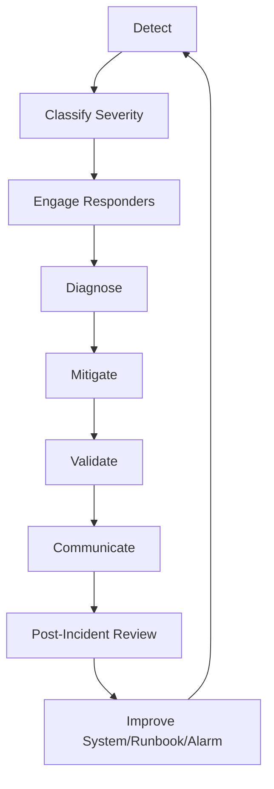
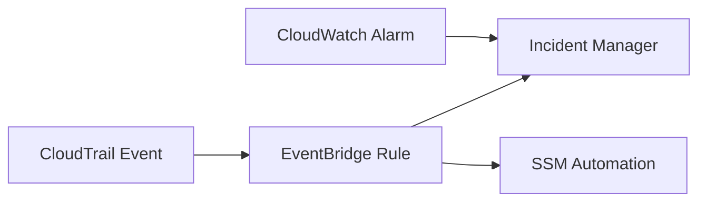
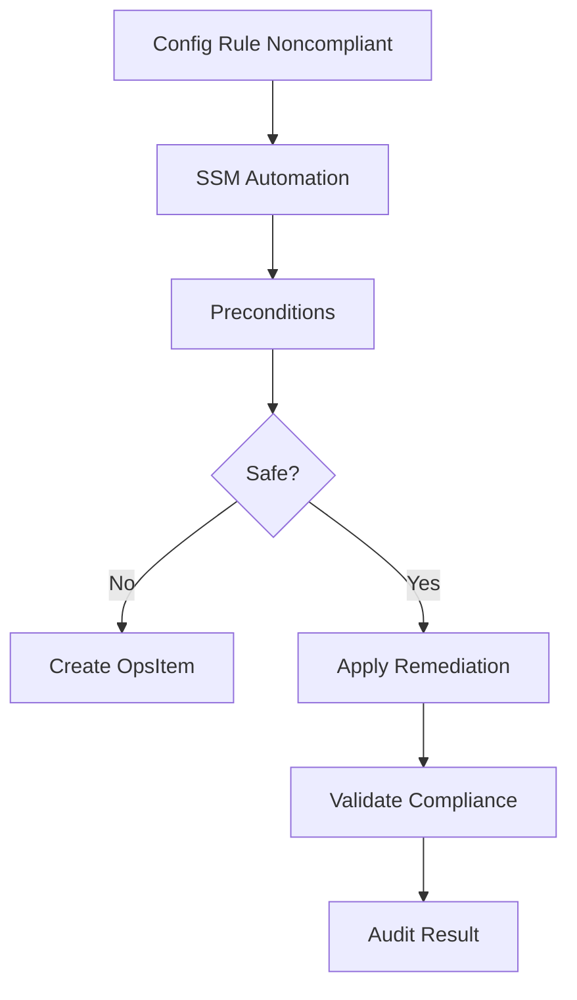
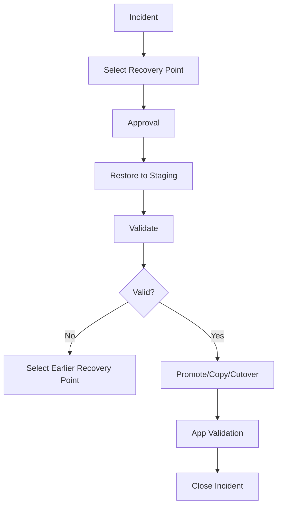
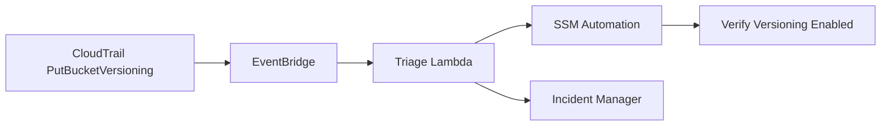

# Part 072 — Incident Response, Runbooks, and Automated Remediation

An alert is not an incident response system.

An alarm that pages someone without context creates stress.

An automation that remediates without guardrails creates outages.

An incident manager that only records tickets but does not connect to runbooks slows recovery.

Production operations need a full response loop:

```text
detect -> classify -> engage -> diagnose -> mitigate -> validate -> communicate -> learn -> improve
```

For AWS compute and storage, this means:

- CloudWatch alarms detect symptoms
- CloudTrail/EventBridge detect dangerous changes
- AWS Config detects drift
- Incident Manager engages responders
- OpsCenter tracks operational issues
- Systems Manager Automation executes runbooks
- EventBridge/Config trigger safe remediation
- dashboards provide context
- runbooks define steps
- post-incident review turns pain into engineering improvements

This part focuses on turning observability into action.

---

## 1. Problem yang Diselesaikan

Part ini membahas:

- incident response lifecycle
- severity classification
- AWS Systems Manager Incident Manager
- response plans
- engagements/escalation
- runbooks in Incident Manager
- Systems Manager Automation documents
- OpsCenter/OpsItems
- EventBridge-triggered runbooks
- AWS Config remediation
- safe automated remediation patterns
- remediation for EC2/EBS/S3/EFS/FSx/AWS Backup
- human approval gates
- rollback and validation
- post-incident review
- runbook architecture and checklist

---

## 2. Mental Model

### 2.1 Incident response is a control loop



The loop improves only when action items are completed.

### 2.2 Runbook vs playbook

Use terms consistently:

- **Runbook**: known procedure for known operation.
- **Playbook**: investigative guide for unknown or broad incident.

Examples:

Runbook:

```text
Restore EFS directory from AWS Backup recovery point.
```

Playbook:

```text
Investigate unexplained write latency increase.
```

### 2.3 Automation is runbook execution

Systems Manager Automation runbooks define sequential steps that Systems Manager performs on managed nodes or AWS resources.

Automation can:

- restart instance
- create AMI
- snapshot volume
- re-enable S3 versioning
- quarantine instance
- expand EBS volume
- stop compromised role use
- collect diagnostics
- run validation

Automation should encode safe, tested, repeatable steps.

### 2.4 Automation is not always automatic

Four levels:

| Level | Description |
|---|---|
| manual | human follows documented steps |
| assisted | automation gathers data/dry-run |
| approved | automation proposes action, human approves |
| automatic | automation acts without human |

Use automatic only when impact is understood and rollback exists.

### 2.5 Every remediation needs validation

A remediation is not complete when an API returns success.

It is complete when:

- target state achieved
- application health improved
- no secondary damage
- audit record written
- owner notified
- dashboard clears

---

## 3. Incident Severity

### 3.1 Severity model

Example:

| Severity | Meaning | Response |
|---|---|---|
| Sev1 | major user impact, data loss risk, security compromise | immediate page, incident commander |
| Sev2 | significant degradation, RPO/RTO risk, critical dependency failing | page on-call |
| Sev3 | limited degradation or risk if ignored | urgent ticket / business hours |
| Sev4 | improvement, cleanup, informational | backlog |

### 3.2 Compute/storage examples

Sev1:

- production data corruption
- ransomware signal
- critical bucket Object Lock disabled/attempted bypass
- restore needed for customer-impacting outage
- Region evacuation
- backup vault deletion attempt
- EBS data volume lost without current restore

Sev2:

- backup RPO breach for Gold workload
- replication lag beyond RPO
- ASG cannot maintain minimum capacity
- EFS/FSx unavailable to production app
- S3 5xx/403 spike affecting users
- KMS disabled for critical storage

Sev3:

- non-critical disk will fill in 24h
- old snapshots cost spike
- restore test failed for non-critical workload
- unprotected new dev EFS

Sev4:

- dashboard improvement
- cleanup old AMIs
- tuning warning thresholds

### 3.3 Severity anti-pattern

Bad:

```text
Every alarm pages as Sev2.
```

Fix:

- severity based on impact and urgency
- alerts routed by owner/service
- ticket vs page split
- auto-remediation for safe issues
- post-incident alert review

---

## 4. AWS Systems Manager Incident Manager

### 4.1 What Incident Manager provides

Incident Manager helps mitigate and recover from incidents affecting AWS-hosted applications. It combines engagements, escalation, runbooks, response plans, chat channels, and post-incident analysis.

Use it for:

- creating incidents
- engaging responders
- escalation plans
- response plans
- runbook attachment
- incident timeline
- post-incident analysis

### 4.2 Response plans

A response plan should define:

- incident title template
- impact/severity
- contacts/escalation
- chat channel
- runbook
- automation role
- initial responders
- tags/service owner
- deduplication strategy

Example:

```yaml
responsePlan: prod-storage-rpo-breach
trigger:
  alarm: BackupRpoBreachGold
engagement:
  - storage-oncall
  - service-owner
runbook:
  name: InvestigateBackupRpoBreach
severity: Sev2
dashboard: storage-protection
```

### 4.3 Engagement

Incident Manager can engage responders using contacts and escalation plans.

Define:

- primary on-call
- secondary escalation
- service owner
- platform owner
- security contact for destructive/security events
- communication owner for Sev1

### 4.4 Runbooks in Incident Manager

In Incident Manager, a runbook drives incident response and mitigation. You can attach Systems Manager Automation runbooks to response plans.

Example incident:

```text
EC2 status check failed for critical singleton.
```

Attached runbook:

```text
collect instance diagnostics
snapshot attached data volumes
launch replacement
attach volume if safe
validate health
```

### 4.5 Post-incident analysis

After incident:

- timeline
- detection quality
- mitigation steps
- what worked
- what failed
- RTO/RPO actual
- action items
- owners
- due dates

No postmortem action items means no operational learning.

---

## 5. Systems Manager Automation

### 5.1 Automation runbook structure

A runbook contains steps.

Each step has:

- action
- inputs
- outputs
- timeout
- failure behavior
- next step
- optional approval

Example actions include:

- `aws:executeAwsApi`
- `aws:runCommand`
- `aws:executeScript`
- `aws:branch`
- `aws:approve`
- `aws:waitForAwsResourceProperty`

### 5.2 Runbook design principles

Good automation:

- idempotent
- parameterized
- least privilege
- validates preconditions
- has dry-run
- logs every decision
- times out safely
- rolls back or stops on danger
- supports approval for destructive actions
- emits metrics/events
- links to manual fallback

### 5.3 Preconditions

Before remediation, check:

- resource tag/owner
- environment
- current state
- maintenance window
- dependency health
- recent deployment
- backup exists
- KMS works
- no existing incident lock
- blast radius

### 5.4 Approval gates

Use approval for:

- deleting data
- replacing production volume
- failover/failback
- disabling user access
- increasing large capacity/cost
- modifying security group broadly
- overriding retention
- promoting replica

### 5.5 Automation output

Runbook output should include:

```yaml
status:
resource:
actionTaken:
preconditions:
validation:
rollback:
logs:
nextSteps:
```

Ops responders need result clarity.

---

## 6. OpsCenter and OpsItems

### 6.1 OpsCenter purpose

Systems Manager OpsCenter helps view, investigate, and resolve operational issues as OpsItems.

Use OpsItems for:

- non-page issues
- recurring operational tasks
- failed backups
- compliance drift
- capacity warnings
- cleanup tasks
- runbook-linked remediation

### 6.2 OpsItem content

Useful fields:

- title
- severity
- source alarm/event
- affected resource
- owner
- runbook
- related CloudWatch dashboard
- related CloudTrail events
- operational data
- status
- resolution

### 6.3 OpsItem vs Incident

Use incident for urgent response.

Use OpsItem for trackable operational issue.

Example:

- Sev1 S3 data deletion -> Incident
- stale AMI cleanup -> OpsItem
- unprotected dev EFS -> OpsItem
- RPO breach for prod -> Incident/OpsItem depending severity

### 6.4 OpsCenter anti-pattern

Bad:

```text
OpsItems accumulate with no owner.
```

Fix:

- owner tag routing
- SLA by severity
- weekly review
- auto-close only after validation
- backlog aging report

---

## 7. EventBridge-Triggered Response

### 7.1 Event-driven incident creation

Pattern:



Examples:

- DeleteRecoveryPoint attempted -> Sev1/Sev2 security incident
- KMS DisableKey -> Sev1 if key protects backups
- S3 versioning suspended -> auto-remediate + incident
- EBS snapshot made public -> auto-remove sharing + security ticket
- Backup job failed -> OpsItem or incident by tier

### 7.2 Event pattern examples

S3 versioning change concept:

```json
{
  "source": ["aws.s3"],
  "detail-type": ["AWS API Call via CloudTrail"],
  "detail": {
    "eventName": ["PutBucketVersioning"]
  }
}
```

EBS snapshot delete concept:

```json
{
  "source": ["aws.ec2"],
  "detail-type": ["AWS API Call via CloudTrail"],
  "detail": {
    "eventName": ["DeleteSnapshot"]
  }
}
```

Validate exact fields using captured CloudTrail events.

### 7.3 EventBridge target choices

Use:

- SNS for notification
- Lambda for lightweight triage
- Step Functions for multi-step orchestration
- SSM Automation for infrastructure remediation
- Incident Manager for urgent response
- SQS for buffering

### 7.4 Event safety

Event-driven remediation can be triggered by false positives or tests.

Add:

- environment allow-list
- resource tag filter
- break-glass bypass
- duplicate suppression
- rate limit
- maximum actions per hour
- dry-run mode
- audit log

---

## 8. AWS Config Remediation

### 8.1 Config remediation model

AWS Config can remediate noncompliant resources using Systems Manager Automation documents. Remediation actions can be manual or automatic.

Use for:

- configuration drift
- compliance violations
- safe corrective actions
- resource posture enforcement

### 8.2 Good automatic remediation candidates

Safe-ish examples:

- enable S3 Block Public Access
- remove public EBS snapshot permission
- add required logging where safe
- stop non-prod instance outside schedule
- tag quarantine marker
- create OpsItem for missing backup tag
- re-enable backup selection if deterministic

### 8.3 Risky automatic remediation

Use manual approval:

- deleting resources
- changing production security groups
- changing bucket lifecycle
- resizing volumes
- failing over data stores
- replacing instances
- modifying KMS key policies
- removing user access broadly

### 8.4 Config remediation runbook pattern



### 8.5 Exception process

Some resources are intentionally noncompliant.

Example:

```yaml
resource:
rule:
exceptionReason:
owner:
expiry:
riskAcceptance:
approval:
```

Exceptions must expire.

---

## 9. Safe Remediation Patterns

### 9.1 Observe-only

Use when learning:

- detect event
- create ticket
- no action
- measure false positives
- tune rule

### 9.2 Dry-run

Automation calculates action but does not apply.

Example:

```text
Would increase EBS volume vol-123 from 500GiB to 750GiB.
```

### 9.3 Auto-collect diagnostics

Safe first step:

- capture CloudWatch metrics
- collect instance logs
- describe resource config
- list recent CloudTrail events
- snapshot before remediation
- attach diagnostic data to incident

### 9.4 Auto-remediate reversible changes

Examples:

- re-enable versioning if suspended
- disable public snapshot sharing
- reattach monitoring agent
- restart failed non-critical service
- scale ASG within allowed max

### 9.5 Human-approved change

Use `aws:approve` or Incident Manager approval flow before:

- failover
- volume replacement
- data restore overwrite
- production restart
- permission revocation with broad impact

### 9.6 Circuit breaker

Automation must stop when:

- too many resources affected
- resource not tagged safe
- incident lock exists
- backup missing
- validation fails
- change window closed
- dependency unhealthy
- cost exceeds threshold

---

## 10. Compute Remediation Patterns

### 10.1 EC2 status check failure

Automation:

1. collect diagnostics
2. confirm ASG or singleton
3. snapshot data volumes if singleton/stateful
4. reboot instance if safe
5. if ASG, replace instance
6. if stateful, engage human approval
7. validate app health

### 10.2 Disk full

Automation levels:

- observe: create OpsItem with top filesystem
- assisted: run diagnostic command via SSM
- approved: expand EBS volume
- automatic: clean known temp path in non-prod

Runbook:

1. check data class
2. stop unsafe cleanup
3. snapshot before expansion if critical
4. modify EBS volume
5. grow partition/filesystem
6. validate free space
7. add cleanup/capacity fix

### 10.3 ASG capacity shortfall

Automation:

- describe scaling activity
- identify launch failure cause
- check capacity pools
- increase diversification if predefined
- notify if max capacity reached
- create OpsItem/incident
- optionally raise desired capacity in standby group if policy permits

### 10.4 Spot interruption

Automation:

- drain instance
- checkpoint job
- remove from load balancer
- launch replacement
- preserve logs
- validate capacity

### 10.5 Unattached EBS volume

Automatic only for non-prod and older-than threshold.

Production:

- create OpsItem
- identify owner
- check last attached instance
- snapshot if required
- delete only after approval

---

## 11. Storage Remediation Patterns

### 11.1 S3 versioning suspended

Automation:

1. detect `PutBucketVersioning`.
2. check bucket tag `Protected=true`.
3. re-enable versioning.
4. notify owner/security.
5. create incident if production/protected.
6. audit objects written during suspension.

### 11.2 S3 public access drift

Automation:

- enable Block Public Access
- remove public bucket policy if matches known unsafe pattern
- create security incident
- preserve CloudTrail evidence

Use caution: some public buckets are intentional, but should be tagged/approved.

### 11.3 EBS snapshot public

Automation:

- remove public restore permission
- enable/verify block public access
- create security OpsItem/incident
- inspect exposure window

### 11.4 Backup job failed

Automation:

- classify by BackupTier
- fetch error
- check KMS/key state
- run on-demand backup if safe
- create incident for Gold/Platinum RPO risk
- create OpsItem for lower tiers
- attach recovery point age

### 11.5 EFS backup missing

Automation:

- check file system tags
- check backup plan selection
- add missing tag? only if deterministic
- create on-demand backup if critical
- create OpsItem to fix IaC
- verify recovery point

### 11.6 FSx backup failed

Automation:

- identify FSx family
- check backup job status
- check storage/throughput/maintenance window
- create manual backup if safe
- notify owner
- update RPO dashboard

### 11.7 Replication lag

Automation:

- check source/destination health
- check KMS/IAM
- check service metrics
- notify owner if RPO breach
- do not automatically failover unless explicit safe design

---

## 12. Data Restore Automation

### 12.1 Restore is high risk

Do not automatically overwrite production data after an alarm.

Restores should usually be:

- human-approved
- to staging/isolated target first
- validated
- copied/promoted intentionally

### 12.2 Restore automation flow



### 12.3 EBS file restore

Automation can:

- create volume from snapshot
- attach to recovery instance
- mount read-only
- copy selected file
- detach/delete volume

Human should approve target file overwrite.

### 12.4 EFS item restore

Automation can:

- start restore job
- wait for completion
- validate path
- notify app owner

Human should approve copy-back to production if overwrite.

### 12.5 S3 object restore

Automation can:

- list versions
- find delete marker
- restore previous version to staging prefix
- validate checksum

Human should approve current-key overwrite for critical objects.

---

## 13. Runbook Architecture

### 13.1 Runbook template

```yaml
runbook:
  name:
  owner:
  severity:
  purpose:
  triggers:
  affectedServices:
  prerequisites:
  permissions:
  dashboards:
  safetyChecks:
  steps:
  validation:
  rollback:
  escalation:
  communication:
  postIncident:
```

### 13.2 First five minutes section

Every incident runbook should have:

```text
1. Confirm impact.
2. Stop further damage.
3. Preserve evidence.
4. Identify owner.
5. Choose mitigation path.
```

### 13.3 Decision points

Good runbooks include branches:

```text
If ASG workload -> replace instance.
If singleton stateful -> snapshot first and escalate.
If data corruption suspected -> stop writers before restore.
```

### 13.4 Validation section

Include:

- metric that should recover
- app smoke test
- user journey
- data integrity check
- backup/restore status
- permission check

### 13.5 Rollback section

Every action should answer:

```text
How do we undo this?
```

If no rollback exists, require stronger approval.

### 13.6 Runbook testing

Test runbooks:

- in game days
- in staging
- after AWS API changes/provider updates
- after major architecture change
- after every incident where runbook was used

---

## 14. Incident Communication

### 14.1 Communication roles

For Sev1/Sev2:

- incident commander
- operations lead
- communications lead
- subject matter experts
- scribe

### 14.2 Update cadence

Internal updates should answer:

- current impact
- mitigation status
- next decision
- ETA only if evidence supports it
- customer action needed
- risks/blockers

### 14.3 Avoid false certainty

Bad:

```text
Issue is fixed.
```

Better:

```text
Traffic has been shifted and error rate has remained below threshold for 20 minutes. We are continuing validation.
```

### 14.4 Post-incident communication

Include:

- what happened
- impact
- timeline
- root/contributing causes
- remediation
- prevention actions
- owners/dates

---

## 15. Post-Incident Review

### 15.1 Blameless but accountable

Blameless does not mean actionless.

Focus on:

- system design
- alert quality
- runbook gaps
- automation gaps
- human factors
- unclear ownership
- missing guardrails
- insufficient tests

### 15.2 Timeline

Record:

- first bad event
- detection time
- acknowledgement time
- mitigation start
- customer impact end
- full recovery
- communication points
- follow-up actions

### 15.3 Key metrics

Measure:

- MTTD: mean time to detect
- MTTA: mean time to acknowledge
- MTTR: mean time to recover
- RPO actual
- RTO actual
- alert noise count
- manual steps count
- automation success/failure

### 15.4 Action item quality

Bad:

```text
be more careful
```

Good:

```text
Add EventBridge rule for PutBucketVersioning on protected buckets and SSM Automation runbook to re-enable versioning within 2 minutes. Owner: platform-storage. Due: 2026-07-20.
```

### 15.5 Close the loop

Every action item should map to:

- code change
- runbook update
- alarm update
- dashboard update
- test/game day
- ownership fix
- training

---

## 16. Game Days

### Scenario 1 — Disk full automation

Expected:

- alarm fires
- OpsItem created
- runbook collects diagnostics
- human approves EBS expansion
- filesystem grows
- validation clears alarm

### Scenario 2 — S3 versioning suspended

Expected:

- EventBridge detects CloudTrail event
- automation re-enables versioning
- security incident created
- audit finds writes during gap

### Scenario 3 — Backup RPO breach

Expected:

- CloudWatch/EventBridge alarm
- Incident Manager response plan
- automation checks cause
- on-demand backup triggered if safe
- owner notified

### Scenario 4 — Public snapshot

Expected:

- Config/EventBridge detects
- automation removes public permission
- Security OpsItem created
- exposure window investigated

### Scenario 5 — EFS restore

Expected:

- runbook guides item-level restore
- staging restore validates
- copy-back approved
- app smoke test passes

### Scenario 6 — Failed automation

Expected:

- automation stops safely
- incident escalates
- manual fallback used
- automation bug fixed after review

---

## 17. Terraform/IaC Concepts

### 17.1 EventBridge to Incident Manager concept

```hcl
resource "aws_cloudwatch_event_rule" "backup_rpo_breach" {
  name = "backup-rpo-breach-gold"

  event_pattern = jsonencode({
    source      = ["aws.backup"]
    detail-type = ["Backup Job State Change"]
    detail = {
      state = ["FAILED", "ABORTED", "EXPIRED"]
    }
  })
}
```

Exact event detail fields should be validated with captured events.

### 17.2 Config remediation concept

```hcl
resource "aws_config_remediation_configuration" "remediate_public_snapshot" {
  config_rule_name = aws_config_config_rule.ebs_snapshot_public.name
  target_type      = "SSM_DOCUMENT"
  target_id        = "AWSConfigRemediation-RemovePublicAccessToEBSVolumeSnapshot"
  automatic        = true
}
```

Validate document name and parameters.

### 17.3 SSM Automation runbook skeleton

```yaml
schemaVersion: '0.3'
description: Re-enable S3 versioning on a protected bucket after drift.
parameters:
  BucketName:
    type: String
  AutomationAssumeRole:
    type: String
mainSteps:
  - name: CheckBucketTag
    action: aws:executeAwsApi
    inputs:
      Service: s3
      Api: GetBucketTagging
      Bucket: '{{ BucketName }}'
  - name: EnableVersioning
    action: aws:executeAwsApi
    inputs:
      Service: s3
      Api: PutBucketVersioning
      Bucket: '{{ BucketName }}'
      VersioningConfiguration:
        Status: Enabled
  - name: Verify
    action: aws:executeAwsApi
    inputs:
      Service: s3
      Api: GetBucketVersioning
      Bucket: '{{ BucketName }}'
```

Add tag validation/branching in real implementation.

### 17.4 Incident response plan as code

Where possible, manage:

- contacts
- escalation plans
- response plans
- runbook documents
- EventBridge rules
- IAM roles
- automation permissions
- dashboards

as IaC.

---

## 18. Anti-Patterns

### 18.1 Auto-remediate everything

This causes outages.

Use risk-based automation levels.

### 18.2 Automation without owner

Every automation needs:

- code owner
- operational owner
- test owner
- emergency disable switch

### 18.3 No dry-run

Dry-run is how you discover blast radius.

### 18.4 No audit output

If automation acts, it must leave evidence.

### 18.5 Runbook stale

Runbooks rot after architecture changes.

Tie runbook tests to releases/game days.

### 18.6 Human approval but no context

Approval prompt must include impact, resource, action, rollback, and validation.

### 18.7 Manual console-only recovery

Console can help, but repeatable recovery should be scriptable/IaC-backed.

---

## 19. Design Checklist

### 19.1 Incident response

- [ ] Severity model defined.
- [ ] Response plans exist for critical alerts.
- [ ] Contacts/escalation configured.
- [ ] Incident commander role defined.
- [ ] Dashboards linked.
- [ ] Runbooks linked.
- [ ] Communication template exists.
- [ ] Post-incident process exists.

### 19.2 Automation

- [ ] Automation runbooks are versioned.
- [ ] Preconditions implemented.
- [ ] Dry-run supported.
- [ ] Approval gates for risky actions.
- [ ] Idempotency tested.
- [ ] Rollback/fallback documented.
- [ ] Validation step included.
- [ ] Audit logs emitted.
- [ ] Failure path safe.

### 19.3 Remediation

- [ ] Config rules mapped to actions.
- [ ] EventBridge rules for destructive events.
- [ ] Safe auto-remediations enabled.
- [ ] Risky remediations require approval.
- [ ] Exceptions expire.
- [ ] Resource owners receive OpsItems.
- [ ] Remediation SLAs tracked.

### 19.4 Learning

- [ ] Game days scheduled.
- [ ] MTTR/MTTD tracked.
- [ ] Alert noise reviewed.
- [ ] Runbooks updated after incidents.
- [ ] Action items owned.
- [ ] Recurring incidents eliminated.

---

## 20. Mini Case Study — Automated S3 Versioning Remediation

### 20.1 Incident

A protected bucket has versioning suspended by mistake.

### 20.2 Desired response

- re-enable immediately
- notify security/platform
- identify actor
- find objects written during gap
- create incident if production

### 20.3 Architecture



### 20.4 Safety checks

Automation only re-enables if:

- bucket tag `Protected=true`
- environment is prod/preprod
- versioning status not already enabled
- automation role allowed

### 20.5 Invariant

```text
Protected bucket versioning drift is remediated within minutes and investigated as a control-plane incident.
```

---

## 21. Mini Case Study — Backup Failure Response

### 21.1 Incident

AWS Backup job fails for Gold EFS.

### 21.2 Bad response

A ticket is created, nobody sees it, RPO is breached.

### 21.3 Better response

- EventBridge catches backup job failure
- Lambda checks BackupTier
- Gold = Incident Manager Sev2
- runbook checks role/KMS/resource state
- on-demand backup attempted if safe
- dashboard updates RPO actual
- owner notified
- post-incident fixes policy

### 21.4 Invariant

```text
Backup failure is not a backup team problem. It is a service recovery risk.
```

---

## 22. Mini Case Study — Disk Full with Safe Automation

### 22.1 Problem

App volume fills because temp files accumulate.

### 22.2 Automation design

Level 1:

- alarm creates OpsItem
- SSM collects `df`, `du`, process list
- no deletion

Level 2:

- if non-prod and path tagged disposable, cleanup temp older than 24h

Level 3:

- if prod, human approves EBS expansion
- automation snapshots, expands volume, grows filesystem

### 22.3 Invariant

```text
Automation can gather facts automatically. Production destructive cleanup needs ownership and guardrails.
```

---

## 23. Summary

Incident response and remediation turn observability into operational capability.

Key principles:

1. Alerts need severity, owner, context, and runbook.
2. Incident Manager organizes engagement and response plans.
3. Systems Manager Automation executes repeatable procedures.
4. OpsCenter tracks non-urgent operational work.
5. EventBridge routes critical events into response systems.
6. AWS Config remediation corrects drift through SSM documents.
7. Automation must be safe, idempotent, audited, and validated.
8. Risky actions need approval.
9. Restore operations should validate in staging before production overwrite.
10. Post-incident reviews must produce engineering changes.
11. Game days test people, automation, and runbooks together.

The core rule:

> The goal is not automation. The goal is safe, validated, repeatable recovery.

Next, Part 073 moves into cost and capacity engineering for compute/storage: utilization, rightsizing, savings plans/reservations, Spot risk, storage lifecycle economics, snapshot/version cost, unit economics, and capacity forecasting.

---

## References

- AWS Well-Architected Framework — OPS07-BP03 Use runbooks to perform procedures: https://docs.aws.amazon.com/wellarchitected/latest/framework/ops_ready_to_support_use_runbooks.html
- AWS Systems Manager User Guide — Automation: https://docs.aws.amazon.com/systems-manager/latest/userguide/systems-manager-automation.html
- AWS Systems Manager User Guide — Creating your own runbooks: https://docs.aws.amazon.com/systems-manager/latest/userguide/automation-documents.html
- AWS Systems Manager Incident Manager User Guide — What is Incident Manager?: https://docs.aws.amazon.com/incident-manager/latest/userguide/what-is-incident-manager.html
- AWS Systems Manager Incident Manager User Guide — Integrating Systems Manager Automation runbooks: https://docs.aws.amazon.com/incident-manager/latest/userguide/runbooks.html
- AWS Systems Manager Incident Manager User Guide — Response plans: https://docs.aws.amazon.com/incident-manager/latest/userguide/response-plans.html
- AWS Config Developer Guide — Remediating noncompliant resources: https://docs.aws.amazon.com/config/latest/developerguide/remediation.html
- AWS Config Developer Guide — Setting up auto remediation: https://docs.aws.amazon.com/config/latest/developerguide/setup-autoremediation.html
- Amazon EventBridge User Guide — Event patterns: https://docs.aws.amazon.com/eventbridge/latest/userguide/eb-event-patterns.html
