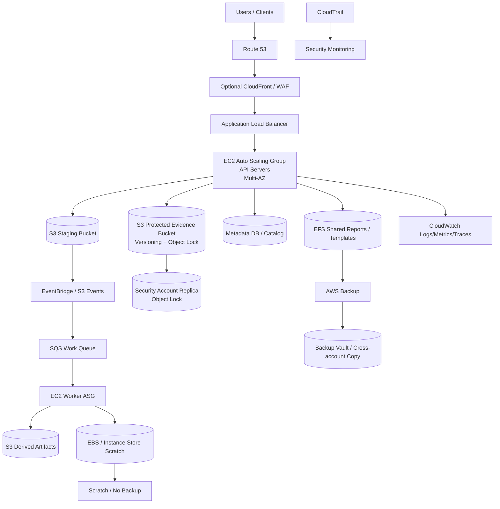
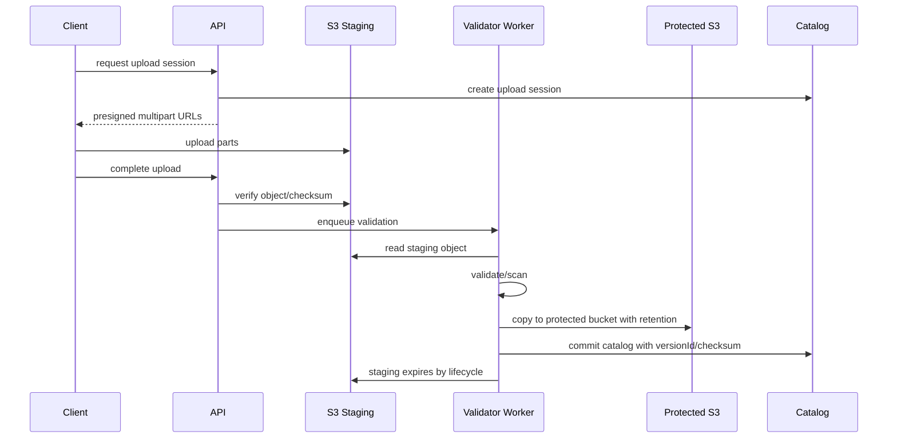

# Part 075 — Reference Architecture: Production Web/API Workload

This part synthesizes everything.

The goal is not to memorize another AWS diagram.

The goal is to learn how a top-tier engineer composes compute, storage, backup, security, observability, cost, and operations into one production workload.

We will design a production web/API workload that can support:

- public HTTP traffic
- stateless application servers
- stateful supporting storage
- object upload/download
- shared file needs where unavoidable
- background workers
- multi-AZ resilience
- backup and restore
- disaster recovery posture
- security guardrails
- capacity/cost controls
- operational runbooks

The architecture is intentionally EC2-centered because this course is about compute and storage. The same patterns apply when the compute layer is ECS, EKS, Lambda, or managed services.

---

## 1. Target Workload

Example application:

```text
Evidence Management API
```

Features:

- users upload evidence files
- API stores metadata
- evidence blobs stored durably
- thumbnails/transcripts generated asynchronously
- admin downloads files
- reports generated periodically
- critical audit trail retained
- stateless API must scale horizontally
- accepted evidence must be immutable
- recovery required after accidental delete, AZ failure, bad deploy, and compromised app role

This is a realistic workload because it combines:

- web/API traffic
- large object ingestion
- storage lifecycle
- background processing
- compliance retention
- backup/restore
- security posture
- cost and capacity management

---

## 2. Architecture Overview



This is not the only possible architecture. It is a teaching blueprint.

---

## 3. Workload Invariants

Before services, define invariants.

### 3.1 Compute invariants

```text
API servers are stateless.
Any API instance may be terminated and replaced.
No accepted evidence exists only on EC2 local disk.
```

### 3.2 Object storage invariants

```text
Staging upload is temporary.
Accepted evidence is immutable and version-addressed.
Catalog stores S3 bucket/key/versionId/checksum.
```

### 3.3 File storage invariants

```text
EFS stores only data that truly needs shared file semantics.
Generated scratch and cache are not backed up as source of truth.
```

### 3.4 Backup invariants

```text
Every source-of-truth data class has a documented recovery path.
Backup success is not trusted until restore is tested.
```

### 3.5 Security invariants

```text
Application roles can write new evidence.
Application roles cannot destroy accepted evidence history.
```

### 3.6 Operations invariants

```text
Every alert has owner, dashboard, and runbook.
Every restore runbook validates application behavior.
```

---

## 4. Compute Layer

### 4.1 Application Load Balancer

Use ALB for:

- HTTP/HTTPS routing
- TLS termination
- target health checks
- path-based routing
- integration with Auto Scaling
- user-facing health and readiness signals

Health check:

```text
GET /ready
```

Should validate:

- process alive
- config loaded
- database reachable enough for readiness
- S3/KMS permissions optional lightweight check
- not in migration/maintenance lock
- does not perform expensive full dependency scan

Do not use:

```text
GET /
```

as readiness if it can return 200 while dependencies are broken.

### 4.2 Auto Scaling Group

Design:

- span at least two or three Availability Zones
- minimum capacity based on redundancy
- desired capacity based on expected load
- maximum capacity based on peak + failure + guardrail
- target tracking based on useful pressure metric
- instance refresh for safe rollout
- lifecycle hooks for graceful drain
- mixed instance policy if appropriate
- warm pool if startup time threatens SLO

Example capacity logic:

```text
min = 2 per AZ for N+1 baseline
desired = forecasted steady traffic / safe_rps_per_instance
max = peak traffic + one-AZ failure + deploy surge
```

### 4.3 Launch template

Launch template defines:

- AMI
- instance type
- IAM instance profile
- security groups
- user data
- EBS block device mappings
- metadata options
- tags
- monitoring
- IMDSv2 requirement

Golden AMI should include:

- base OS
- CloudWatch agent
- SSM agent
- security baseline
- app runtime dependencies
- no secrets
- no environment-specific config

User data should:

- fetch config from SSM/AppConfig
- fetch secrets from Secrets Manager
- register app
- start service
- emit startup metric
- fail fast if bootstrap invalid

### 4.4 Stateless instance contract

API instance may use:

- root EBS volume for OS/app
- local disk for temp only
- memory cache
- no durable user data

Allowed local directories:

```text
/tmp
/var/cache/app
/var/log/app if logs shipped
```

Forbidden:

```text
/var/lib/app/uploads as only copy
/root/manual-config
/home/app/important-state
```

### 4.5 Graceful termination

On lifecycle hook:

1. mark instance draining
2. stop accepting new requests
3. finish in-flight requests within timeout
4. flush logs/metrics
5. release local locks
6. exit cleanly
7. complete lifecycle action

For uploads, design resumable/multipart direct-to-S3 so termination does not lose upload.

### 4.6 Instance profile

API role permissions:

- read config/secrets
- PUT to staging bucket
- copy/commit to evidence bucket through controlled path
- write metadata DB
- emit logs/metrics
- read only required objects
- no `s3:DeleteObjectVersion` on protected bucket
- no broad KMS admin
- no backup deletion
- no snapshot deletion

---

## 5. Storage Layer

### 5.1 S3 staging bucket

Purpose:

```text
temporary untrusted uploads
```

Properties:

- versioning optional/short retention
- lifecycle expiry
- malware/content validation
- incomplete multipart cleanup
- SSE-KMS or SSE-S3
- no Object Lock unless business requires staging retention
- event notifications to validation pipeline

Flow:

```text
client multipart upload -> staging key -> validate -> copy to protected bucket -> commit catalog -> expire staging
```

### 5.2 S3 protected evidence bucket

Purpose:

```text
accepted evidence source of truth
```

Properties:

- versioning enabled
- Object Lock enabled
- default or per-object retention
- governance/compliance mode based on requirement
- replication to security account bucket
- restrictive bucket policy
- CloudTrail data events for protected prefix
- S3 Inventory for audit
- lifecycle only after retention/recovery review
- catalog stores versionId/checksum

Object key design:

```text
evidence/sha256/ab/cd/<sha256>
```

or:

```text
tenant/<tenantId>/case/<caseId>/evidence/<contentHash>
```

Prefer immutable/content-addressed keys for accepted evidence.

### 5.3 S3 derived artifacts

Purpose:

```text
rebuildable or semi-durable outputs
```

Examples:

- thumbnails
- transcripts
- redacted copies
- reports
- exports

Protection depends on rebuild cost and business value.

Design:

```yaml
thumbnails:
  role: derived
  backup: no or short
  rebuild: yes
transcripts:
  role: derived-but-audit-relevant
  backup: yes
  versioning: yes
reports:
  role: user-output
  retention: business policy
```

### 5.4 EFS shared reports/templates

Use EFS only for data that needs:

- shared Linux file access
- multiple API/worker instances
- file semantics
- legacy library requiring path access

Separate directories:

```text
/templates        source-of-truth, backed up
/reports          user output, backed up/retained
/tmp              scratch, lifecycle cleanup, not backed up if separated
/cache            rebuildable, not backed up
```

Better: separate file systems/access points for different data roles if policies differ.

### 5.5 EBS local volumes

API instances:

- root volume only
- logs shipped
- temp data disposable

Workers:

- EBS or instance store scratch for processing
- checkpoints to S3 if work is expensive
- no source-of-truth data only on worker volume

For self-managed DB/search on EC2:

- separate data volumes
- EBS snapshots
- application-consistent backup
- consider managed service first

### 5.6 Database/catalog

Although outside this compute/storage course, catalog is essential.

It stores:

- evidence object versionId
- checksum
- data class
- retention
- processing status
- derived artifact references
- audit metadata
- idempotency state

Object storage holds bytes. Catalog holds meaning.

---

## 6. Upload Workflow

### 6.1 Direct-to-S3 multipart upload

Avoid routing large file bytes through API servers unless required.

Flow:



### 6.2 Upload states

```text
INITIATED
UPLOADING
UPLOADED
VALIDATING
REJECTED
ACCEPTED
COMMITTED
FAILED
```

Do not expose accepted evidence until `COMMITTED`.

### 6.3 Idempotency

Use:

- upload session ID
- content hash
- client idempotency key
- multipart upload ID
- database unique constraints
- manifest commit

Repeated client retries should not create duplicate evidence records.

### 6.4 Validation before lock

Validate before applying long Object Lock retention.

Checks:

- checksum
- file type
- malware scan
- max size
- tenant/case authorization
- content policy/business rules
- optional duplicate detection

### 6.5 Version commit

Commit record:

```json
{
  "caseId": "case-123",
  "bucket": "evidence-prod",
  "key": "evidence/sha256/ab/cd/...",
  "versionId": "3HL4...",
  "sha256": "abcd...",
  "sizeBytes": 84239102,
  "retentionMode": "COMPLIANCE",
  "retainUntil": "2033-07-06T00:00:00Z"
}
```

---

## 7. Worker Architecture

### 7.1 Queue-driven workers

Workers process:

- validation
- thumbnail generation
- transcription
- report generation
- export jobs

Use queue:

- SQS
- EventBridge
- Step Functions
- AWS Batch for larger batch workflows

EC2 worker ASG:

- scale on queue depth / age of oldest message
- support graceful termination
- checkpoint if processing expensive
- write outputs to S3
- update catalog idempotently

### 7.2 Worker scratch

Use:

- instance store for fast disposable scratch
- EBS gp3 for larger persistent scratch during task
- EFS/FSx only if shared file semantics required

Rules:

```text
scratch may be deleted
outputs must be committed to S3/catalog
job retry must be safe
```

### 7.3 Poison message handling

Use:

- max receive count
- DLQ
- error classification
- input validation
- idempotent output
- manual replay tool
- correlation ID

### 7.4 Spot for workers

Good fit if:

- tasks idempotent
- checkpoints exist for long tasks
- interruption handler drains
- On-Demand baseline exists for critical queues
- ASG mixed instance policy diversified

Do not use Spot for single critical commit writer unless designed.

---

## 8. Multi-AZ Reliability

### 8.1 Compute

- ALB across subnets/AZs
- ASG across AZs
- maintain at least one instance per AZ for critical workloads
- one-AZ failure capacity modeled
- lifecycle drain
- health checks based on readiness

### 8.2 Storage

S3 is regional by design.

EFS Standard is regional across AZs; mount targets per AZ.

EBS is AZ-scoped; do not rely on one EBS volume for multi-AZ app unless instance is tied to that AZ and recovery is understood.

FSx deployment type determines availability behavior.

### 8.3 AZ failure scenario

If one AZ impaired:

- ALB routes away from unhealthy targets
- ASG replaces in healthy AZs if configured
- EFS accessible through remaining mount targets
- EBS volumes in impaired AZ unavailable until recovery/restore
- workers retry jobs
- local scratch lost and rebuilt

### 8.4 Cross-AZ cost and latency

Avoid unnecessary cross-AZ data path:

- clients mount EFS local mount target when possible
- ALB target groups across AZs carefully
- NAT per AZ
- data transfer observed
- placement-aware design for EBS/EC2

### 8.5 Fault isolation

Separate:

- API fleet
- worker fleet
- admin jobs
- batch/report jobs
- upload validation
- background cleanup

Do not let report generation starve API capacity.

---

## 9. Backup and Recovery

### 9.1 Data class table

| Data | Role | Protection |
|---|---|---|
| accepted evidence | source of truth | S3 versioning + Object Lock + replication + AWS Backup/PITR if required |
| metadata catalog | source of truth | DB PITR/snapshots/replica |
| staging uploads | temporary | short lifecycle, optional backup no |
| derived thumbnails | rebuildable | no/short backup |
| transcripts | audit-relevant derived | versioning/backup |
| templates | source file data | EFS backup + restore test |
| reports | user output | EFS/S3 backup by retention |
| worker scratch | scratch | no backup |
| logs/audit | audit | central log archive + Object Lock where required |

### 9.2 Restore procedures

Supported restores:

- restore deleted evidence object version
- restore catalog point-in-time
- restore EFS template/report directory
- restore worker derived output by rebuild
- restore API fleet from AMI/ASG
- restore data in recovery account

### 9.3 Recovery consistency

Critical consistency:

```text
catalog record -> S3 version ID
```

If catalog is restored to older point, S3 noncurrent versions must still exist.

Set retention:

```text
S3 noncurrent version retention > DB PITR window + safety margin
```

### 9.4 Backup control plane

Use AWS Backup for:

- EFS
- EBS if any stateful volumes
- S3 if governance/PITR needed
- EC2/AMI where legacy state exists
- cross-account copy
- restore testing

Use service-native features for:

- S3 Object Lock/Versioning/Replication
- EFS replication
- FSx snapshots/backups
- database-native PITR

### 9.5 Restore game days

Quarterly:

- restore one evidence object
- restore EFS template directory
- restore API fleet in staging
- simulate AZ loss
- restore from cross-account backup
- KMS-denied recovery test

---

## 10. Disaster Recovery

### 10.1 Strategy selection

For this example:

```yaml
strategy: pilot light or warm standby depending business criticality
rpo:
  evidence: near-zero after commit
  catalog: <= 15 minutes or DB PITR target
  reports: 24 hours
rto:
  api: 1-4 hours
  evidence read: 1-4 hours
  admin reports: lower priority
```

### 10.2 DR data

- S3 evidence replicated to security/DR account/Region
- DB PITR/replica/cross-region copy
- EFS backup copied or replication if needed
- AMI/container image copied
- KMS keys in DR Region/account
- secrets/config replicated
- Route 53 failover records prepared

### 10.3 DR compute

Pilot light:

- VPC/IAM/KMS/secrets exist
- ALB/ASG definitions exist
- desired capacity zero/minimal
- data replicas/backups ready
- can scale on incident

Warm standby:

- minimal API stack always serving synthetic traffic
- workers disabled or reduced
- data replica monitored
- regular traffic tests

### 10.4 DR failover

1. declare incident
2. freeze primary writes if possible
3. choose data authority/recovery point
4. scale DR compute
5. promote catalog/data store
6. validate S3 evidence access
7. validate EFS/derived storage
8. route traffic
9. monitor
10. record RPO/RTO actual

### 10.5 Split-brain guardrail

Only one write authority:

```text
primaryRegionWriteEpoch = dr-2026-07-06-001
```

Application should reject writes from stale Region after failover.

---

## 11. Security Guardrails

### 11.1 Network

- ALB public, instances private
- no SSH from internet
- SSM Session Manager for admin access
- VPC endpoints for S3/SSM/CloudWatch where useful
- security groups least privilege
- subnet segmentation
- NACLs only if operationally justified

### 11.2 IAM

Roles:

- API role
- worker role
- deploy role
- backup role
- restore role
- break-glass role
- security audit role

Avoid:

- wildcard S3 delete on protected bucket
- KMS admin on app role
- backup deletion by app/platform role
- broad PassRole
- long-lived access keys

### 11.3 S3 bucket policy

Controls:

- deny non-TLS
- require encryption
- deny delete version on protected prefix
- deny governance bypass except break-glass
- restrict access by VPC endpoint/org where applicable
- require expected bucket owner in clients
- block public access

### 11.4 Object Lock governance

Mode choice:

- Governance for operational protection with break-glass
- Compliance for strict regulatory retention

Runbook for break-glass must be audited.

### 11.5 Secrets and config

Use:

- Secrets Manager
- SSM Parameter Store
- AppConfig
- no secrets in AMI/user data logs
- secret rotation
- DR secret replication/rotation plan

### 11.6 Audit

- CloudTrail management events organization-wide
- S3 data events for protected bucket/prefix
- AWS Config rules
- GuardDuty/Security Hub integration
- logs to centralized locked account

---

## 12. Observability

### 12.1 User-facing SLOs

Example:

```yaml
apiAvailability: 99.9%
apiP95Latency: 300ms
uploadSessionCreateP95: 200ms
acceptedEvidenceCommitP95: 2m
downloadFirstByteP95: 500ms
```

### 12.2 Compute metrics

- ALB 5xx/target 5xx
- target response time
- ASG in-service/desired/max
- instance status checks
- CPU/memory/disk/network
- lifecycle hook failures
- deployment health

### 12.3 Storage metrics

S3:

- 4xx/5xx
- PUT/GET latency
- replication lag
- delete marker spike
- noncurrent version growth
- incomplete MPU count
- KMS AccessDenied/throttle

EFS:

- PercentIOLimit
- ClientConnections
- backup status
- storage class bytes
- file open latency from app

EBS:

- disk usage
- volume queue/latency
- snapshot age
- unattached volumes

### 12.4 Protection metrics

- last successful backup
- latest cross-account copy
- restore test status
- Object Lock status
- versioning status
- vault lock status
- KMS key state
- backup RPO actual

### 12.5 Operational dashboards

Dashboards:

- service health
- upload pipeline
- worker queue
- storage protection
- backup/restore
- capacity
- cost
- security/control-plane changes

---

## 13. Cost and Capacity

### 13.1 Unit economics

Define:

```text
cost per accepted evidence upload
cost per GB retained
cost per validation job
cost per report generated
cost per tenant-month
```

Include:

- API compute
- worker compute
- S3 storage/request/KMS
- replication/Object Lock
- EFS reports/templates
- backups
- logs/audit
- network transfer
- failed retries

### 13.2 Compute cost controls

- rightsize API instances
- ASG target tracking
- Savings Plan for baseline
- Spot for workers only if safe
- scheduled scaling if traffic predictable
- idle dev/test shutdown
- Compute Optimizer review

### 13.3 Storage cost controls

- staging lifecycle
- incomplete MPU abort
- immutable keys to reduce version churn
- noncurrent version lifecycle aligned with recovery
- S3 Storage Lens
- EFS lifecycle for reports
- no backup for scratch/cache
- snapshot cleanup
- backup retention by data class

### 13.4 Capacity controls

- ASG max reviewed
- multi-AZ capacity for one-AZ failure
- subnet IP headroom
- S3 request distribution
- KMS request quotas
- EFS throughput mode
- worker queue scaling
- DR quotas and capacity reservations where needed

### 13.5 Forecast

Forecast:

- uploads/day
- average object size
- retained GB/year
- validation CPU seconds/object
- worker queue peaks
- S3 request/KMS rate
- EFS report growth
- backup growth
- DR capacity

---

## 14. Deployment and Change Management

### 14.1 AMI pipeline

Pipeline:

1. build base AMI
2. patch/security baseline
3. install agents
4. install app runtime
5. vulnerability scan
6. boot test
7. publish version
8. rollout via ASG instance refresh/canary

### 14.2 Blue/green or rolling

Use:

- ASG instance refresh
- health checks
- minimum healthy percentage
- lifecycle hooks
- rollback to previous launch template/AMI
- deployment metrics
- synthetic tests

### 14.3 Database/storage migrations

For storage-impacting changes:

- pre-change snapshot/backup
- migration dry-run
- backward-compatible schema
- validation queries
- rollback plan
- write freeze if needed
- manifest/cat​​alog reconciliation

### 14.4 Feature flags

For risky storage behavior:

- new upload path
- new lifecycle policy
- new worker pipeline
- new object lock mode
- new replication destination

Use flags and staged rollout.

### 14.5 Change observability

Track:

- deployment ID in logs/metrics
- AMI version
- launch template version
- bucket lifecycle version
- backup plan version
- IAM policy version
- KMS policy change
- feature flag state

---

## 15. Runbooks

### 15.1 API latency high

1. Check ALB target response time/error.
2. Check API CPU/memory/network.
3. Check DB latency.
4. Check S3/KMS latency/errors.
5. Check EFS file open latency if path uses EFS.
6. Check recent deploy/IAM/KMS changes.
7. Scale ASG if capacity issue.
8. Roll back if deploy issue.

### 15.2 Upload stuck

1. Check upload session state.
2. Check multipart upload status.
3. Check staging bucket/KMS access.
4. Check validation queue lag.
5. Check worker health.
6. Check protected bucket Object Lock/KMS.
7. Requeue idempotently.
8. Notify user if session expired.

### 15.3 Evidence deleted/hidden

1. Check catalog version ID.
2. Check S3 object versions/delete markers.
3. Verify Object Lock retention.
4. Restore/delete marker or use versioned GET.
5. Check CloudTrail actor.
6. Escalate if malicious.
7. Patch delete permissions.

### 15.4 Worker backlog high

1. Check queue age.
2. Check worker ASG desired/in-service.
3. Check Spot interruptions.
4. Check poison messages/DLQ.
5. Check S3/EFS/DB latency.
6. Scale workers or route to On-Demand.
7. Validate output commit.

### 15.5 EFS report path full/slow

1. Check EFS throughput/PercentIOLimit.
2. Check directory file count.
3. Check report generation spike.
4. Check lifecycle/cold access.
5. Move scratch/cache out.
6. Increase throughput mode if justified.
7. Add cleanup/partitioning.

### 15.6 KMS denied

1. Identify resource and key.
2. Check app role permissions.
3. Check key policy.
4. Check recent KMS/IAM changes.
5. Check cross-account/DR key.
6. Roll back key policy if needed.
7. Add validation test.

### 15.7 DR failover

1. Declare incident.
2. Freeze primary writes if possible.
3. Promote/restore catalog.
4. Validate protected S3 access.
5. Scale API/worker DR stack.
6. Run smoke tests.
7. Shift Route 53/ARC routing.
8. Monitor and record RPO/RTO.

---

## 16. Game Days

### Scenario 1 — API instance termination

Expected:

- ASG replaces
- ALB drains
- no upload lost
- logs shipped

### Scenario 2 — One AZ impaired

Expected:

- ALB routes to healthy targets
- ASG launches in remaining AZs
- capacity sufficient
- EFS/S3 path works

### Scenario 3 — Bad object overwrite attempt

Expected:

- immutable key/object lock prevents loss
- catalog version reference intact
- alert fires if protected delete attempted

### Scenario 4 — Worker Spot interruption

Expected:

- worker drains/checkpoints
- message retried
- output idempotent
- queue recovers

### Scenario 5 — EFS directory restore

Expected:

- restore to staging
- validate permissions
- copy back or update path
- app works

### Scenario 6 — Cross-account restore

Expected:

- backup copy accessible
- KMS works
- clean-room validation passes

---

## 17. Architecture Review Checklist

### 17.1 Compute

- [ ] ASG spans multiple AZs.
- [ ] ALB health checks represent readiness.
- [ ] API instances stateless.
- [ ] Launch template/AMI versioned.
- [ ] Lifecycle drain implemented.
- [ ] ASG max supports peak + failure.
- [ ] Memory/disk metrics collected.

### 17.2 Storage

- [ ] S3 staging/protected/derived separated.
- [ ] Protected objects versioned and locked.
- [ ] Catalog stores version ID.
- [ ] EFS/FSx used only where file semantics required.
- [ ] Scratch/cache excluded or separated.
- [ ] Lifecycle rules recovery-reviewed.
- [ ] KMS permissions tested.

### 17.3 Data protection

- [ ] Backup plan by data class.
- [ ] Restore tests exist.
- [ ] Cross-account/cross-region copies where needed.
- [ ] Object Lock/Vault Lock evaluated.
- [ ] DB/catalog and object version retention aligned.
- [ ] DR runbook tested.

### 17.4 Operations

- [ ] Dashboards exist.
- [ ] Alerts map to runbooks.
- [ ] CloudTrail/EventBridge/Config guardrails.
- [ ] Incident response plan.
- [ ] Cost/unit economics dashboard.
- [ ] Capacity forecast and quotas.
- [ ] Game days scheduled.

---

## 18. Common Failure Reviews

### 18.1 Files accidentally stored on EC2

Symptom:

- instance terminated
- uploaded files lost

Fix:

- direct-to-S3
- no local durable state
- app startup fails if durable local path configured
- integration test checks upload path

### 18.2 Object lock applied before validation

Symptom:

- malware/bad file locked for years

Fix:

- staging bucket
- validation first
- protected copy after validation
- retention applied only on commit

### 18.3 EFS becomes hidden database

Symptom:

- API lists millions of files per request

Fix:

- DB catalog
- EFS stores payload only
- async reconciliation
- no directory scans on request path

### 18.4 Backup exists but catalog inconsistent

Symptom:

- DB restored but object versions expired

Fix:

- versionId in catalog
- noncurrent retention > DB PITR
- restore game day validates both

### 18.5 Worker duplicates output

Symptom:

- retry creates duplicate derived records

Fix:

- idempotency key
- output attempt path
- manifest commit
- unique constraints
- safe retry

---

## 19. Mini Case Study — Evidence Upload Incident

### 19.1 Incident

A deployment accidentally changes S3 key generation from content hash to constant key:

```text
evidence/current.pdf
```

### 19.2 Impact

Uploads overwrite current object in staging.

Validation workers begin failing checksum comparisons.

### 19.3 Why architecture survives

- staging bucket has short-lived versions/logs
- protected bucket copy happens only after validation
- catalog commit requires checksum/version ID
- accepted evidence bucket unchanged
- alert fires on validation failure spike
- deployment rolled back
- bad staging objects expired

### 19.4 Improvement

- add unit test for key generation
- add canary upload
- add protected bucket deny-overwrite guardrail where possible
- add metric for duplicate content-hash conflict

### 19.5 Invariant

```text
Staging failure must not corrupt protected source of truth.
```

---

## 20. Summary

A production web/API architecture is a composition of invariants.

Key principles:

1. Stateless compute behind ALB/ASG.
2. Durable state in explicit storage systems.
3. S3 staging and protected buckets separated.
4. Validate before locking immutable data.
5. Catalog stores version IDs/checksums.
6. EFS/FSx only where file semantics are required.
7. Worker pipelines are idempotent and queue-driven.
8. Backups and restores are by data class.
9. Multi-AZ compute and storage behavior are tested.
10. DR includes data, compute, KMS, secrets, and traffic.
11. Observability connects user symptoms to storage/compute causes.
12. Cost and capacity are designed, not discovered after outage.

The core rule:

> A production architecture is not the services on a diagram. It is the set of invariants that remain true during failure, deploy, scale, restore, and attack.

Next, Part 076 builds a second reference architecture: batch/worker/data-processing workloads using queues, Spot/On-Demand mixed fleets, FSx/File Cache/S3/EBS scratch, checkpoints, job idempotency, and campaign-oriented cost/capacity operations.

---

## References

- AWS Well-Architected Framework — Pillars of the framework: https://docs.aws.amazon.com/wellarchitected/latest/framework/the-pillars-of-the-framework.html
- AWS Well-Architected Reliability Pillar — Deploy workload to multiple locations: https://docs.aws.amazon.com/wellarchitected/latest/reliability-pillar/rel_fault_isolation_multiaz_region_system.html
- Amazon EC2 Auto Scaling User Guide — Resilience in Amazon EC2 Auto Scaling: https://docs.aws.amazon.com/autoscaling/ec2/userguide/disaster-recovery-resiliency.html
- Amazon EC2 Auto Scaling User Guide — Use Elastic Load Balancing: https://docs.aws.amazon.com/autoscaling/ec2/userguide/autoscaling-load-balancer.html
- Amazon S3 User Guide — Retaining multiple versions of objects with S3 Versioning: https://docs.aws.amazon.com/AmazonS3/latest/userguide/Versioning.html
- Amazon S3 User Guide — Locking objects with Object Lock: https://docs.aws.amazon.com/AmazonS3/latest/userguide/object-lock.html
- AWS Backup Developer Guide — What is AWS Backup?: https://docs.aws.amazon.com/aws-backup/latest/devguide/whatisbackup.html
