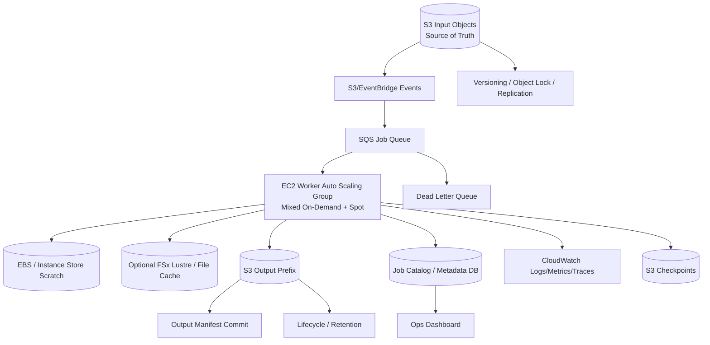

# Part 076 — Reference Architecture: Batch, Worker, and Data Processing Workloads

Batch workloads fail differently from web workloads.

A web request usually has a user waiting.

A batch job may run for minutes, hours, or days.

A web API cares about request latency.

A batch platform cares about throughput, queue age, retry cost, checkpoint frequency, data locality, fleet capacity, interruption handling, and cost per successful job.

A top-tier engineer does not just ask:

```text
Can this worker process the job?
```

They ask:

```text
Can this platform process all jobs within SLO, survive interruption, avoid duplicate output, checkpoint safely, scale capacity, and keep cost per successful job under control?
```

This part builds a production reference architecture for batch, worker, and data-processing systems on AWS.

It applies to:

- queue workers
- video/image processing
- document conversion
- ML preprocessing
- genomics workflows
- analytics transformation
- report generation
- simulation/rendering
- migration jobs
- file normalization pipelines

---

## 1. Target Workload

Example workload:

```text
Evidence Processing Platform
```

Inputs:

- uploaded evidence objects in S3
- processing jobs in SQS/EventBridge
- large PDFs/videos/images/audio
- metadata in catalog

Processing:

- malware scan
- OCR/transcription
- thumbnail extraction
- metadata extraction
- redaction
- packaging/export

Outputs:

- derived artifacts in S3
- processing status in catalog
- audit logs
- failed-job DLQ
- checkpoint/progress state

Requirements:

- process 95% of jobs within 30 minutes
- tolerate EC2 failure and Spot interruption
- never corrupt accepted evidence
- never publish partial output
- avoid duplicate derived artifacts
- scale for campaigns
- use Spot where safe
- checkpoint long jobs
- keep cost per successful job measurable

---

## 2. Architecture Overview



Alternative:

- use AWS Batch instead of self-managed worker ASG
- use ECS/EKS managed compute
- use FSx for Lustre for high-throughput parallel file workloads
- use Amazon File Cache for remote S3/NFS acceleration
- use Step Functions for orchestration
- use Lambda for small/short tasks

The invariants are more important than the exact compute product.

---

## 3. Workload Invariants

### 3.1 Input invariant

```text
Input object is immutable for a job attempt.
Job references bucket/key/versionId/checksum.
```

### 3.2 Output invariant

```text
Partial output is never visible as committed output.
```

### 3.3 Retry invariant

```text
A job may run more than once.
Repeated attempts must not create incorrect duplicate business state.
```

### 3.4 Interruption invariant

```text
Spot/instance failure may stop work.
The system resumes from checkpoint or reruns safely.
```

### 3.5 Scratch invariant

```text
Scratch can be destroyed at any time.
Durable progress exists in checkpoint/catalog/S3.
```

### 3.6 Cost invariant

```text
Optimization is measured by cost per successful job, not EC2 hourly discount.
```

---

## 4. Job Model

### 4.1 Job identity

Job record:

```json
{
  "jobId": "job-2026-07-06-001",
  "type": "TRANSCRIBE",
  "input": {
    "bucket": "evidence-prod",
    "key": "evidence/sha256/ab/cd/...",
    "versionId": "3HL4...",
    "sha256": "abcd..."
  },
  "outputPrefix": "derived/job-2026-07-06-001/attempt-003/",
  "status": "RUNNING",
  "attempt": 3,
  "idempotencyKey": "TRANSCRIBE:bucket:key:versionId:modelVersion"
}
```

### 4.2 Job states

```text
CREATED
QUEUED
CLAIMED
RUNNING
CHECKPOINTING
WRITING_OUTPUT
VALIDATING_OUTPUT
COMMITTING
SUCCEEDED
FAILED_RETRYABLE
FAILED_FINAL
CANCELLED
```

### 4.3 Attempt model

Every retry creates an attempt:

```text
jobId/attempt-001/
jobId/attempt-002/
jobId/attempt-003/
```

Only one attempt is committed.

### 4.4 Output manifest

```json
{
  "jobId": "job-2026-07-06-001",
  "attempt": 3,
  "inputVersionId": "3HL4...",
  "modelVersion": "transcriber-v9",
  "outputs": [
    {
      "key": "derived/job-.../attempt-003/transcript.json",
      "versionId": "abc",
      "sha256": "..."
    }
  ],
  "committedAt": "2026-07-06T03:00:00Z"
}
```

### 4.5 Commit rule

```text
Write output to attempt path.
Validate output.
Write manifest.
Atomically update catalog from RUNNING to SUCCEEDED if attempt is current.
```

Never expose attempt directory as final truth without catalog/manifest.

---

## 5. Queue and Orchestration

### 5.1 SQS queue

Use SQS for simple job distribution.

Design:

- visibility timeout > expected processing heartbeat window
- max receive count
- DLQ
- message attributes for job type/tenant/priority
- queue depth and age metrics
- idempotent consumer

### 5.2 Visibility timeout

If job runs long, use heartbeat extension.

Pattern:

```text
worker claims message
periodically extends visibility
writes checkpoint
on success deletes message
on failure lets visibility expire or sends failure state
```

If worker dies, message returns.

### 5.3 DLQ

Messages go to DLQ when repeated failures occur.

DLQ process:

- classify cause
- fix data/code/config
- replay safely
- preserve evidence
- prevent poison loop

### 5.4 Priority queues

Separate:

- urgent user-facing processing
- normal batch
- backfill
- reprocessing
- best-effort analytics

Avoid one giant queue where low-value jobs block critical jobs.

### 5.5 Step Functions

Use Step Functions when:

- workflow has multiple steps
- human approval
- retries per step
- branching
- long-running coordination
- external service calls
- audit trail matters

### 5.6 AWS Batch

Use AWS Batch when:

- job scheduling and compute environments matter
- heterogeneous compute
- containerized batch
- queue priority
- Spot/On-Demand compute environments
- multi-node or array jobs
- HPC-like scheduling

AWS Batch can manage compute environments, job queues, and retry strategies, but application idempotency/checkpointing still belongs to you.

---

## 6. Compute Fleet Design

### 6.1 Worker ASG

Design:

- mixed instance policy
- On-Demand baseline
- Spot burst
- multiple instance families
- multiple AZs
- capacity-optimized Spot allocation
- lifecycle hooks
- graceful drain
- CloudWatch/SSM agents
- queue-depth scaling

### 6.2 Scaling metric

Better than CPU:

```text
age_of_oldest_message
queue_depth_per_worker
jobs_running
job_deadline_miss_risk
```

Formula:

```text
required_workers =
  queue_depth * avg_job_duration / target_drain_time
```

### 6.3 On-Demand baseline

Use On-Demand for:

- control workers
- critical queue baseline
- high-priority jobs
- final commit workers if separated
- jobs with low interruption tolerance

### 6.4 Spot burst

Use Spot for:

- retryable jobs
- stateless compute
- checkpointed long tasks
- backfill
- low-priority queues
- parallel processing

### 6.5 Interruption handler

On Spot interruption notice:

1. stop claiming new jobs
2. checkpoint current job if possible
3. mark attempt interrupted
4. release/let visibility timeout expire
5. flush logs/metrics
6. terminate gracefully

### 6.6 Worker startup

Worker startup includes:

- AMI boot
- container/artifact pull
- model/tool download
- dependency cache
- FSx/File Cache mount
- SSM registration
- health signal

If startup slow, use:

- warm pools
- baked AMI
- local cache
- scheduled scaling
- persistent FSx/File Cache
- pre-pulled containers

---

## 7. Storage Design

### 7.1 S3 input

Input should be immutable.

Job references:

```text
bucket/key/versionId/checksum
```

If object overwritten, job still points to exact version.

For critical input:

- versioning
- Object Lock if accepted evidence
- replication/backups
- catalog references

### 7.2 S3 output

Output layout:

```text
derived/<jobType>/<jobId>/attempt-003/...
derived/<jobType>/<jobId>/manifest.json
```

or final pointer:

```text
catalog points to committed attempt manifest
```

Avoid overwriting:

```text
derived/latest/output.json
```

unless it is only a pointer file with versioning and atomic semantics.

### 7.3 S3 checkpoints

Checkpoint layout:

```text
checkpoints/<jobType>/<jobId>/attempt-003/checkpoint-0007.bin
```

Checkpoint policy:

- frequency based on recompute cost
- retention until job success + grace period
- clean old attempts
- versioned if valuable
- encrypted
- lifecycle after retention

### 7.4 EBS scratch

Use EBS scratch when:

- data larger than memory
- job needs local filesystem
- instance store unavailable/insufficient
- scratch must survive reboot but not termination
- predictable gp3 performance needed

Tag:

```yaml
DataRole: scratch
BackupTier: None
ExpiresAt:
```

### 7.5 Instance store scratch

Use when:

- high local throughput
- data disposable
- job can rerun/checkpoint
- interruption acceptable
- output committed elsewhere

### 7.6 FSx for Lustre

Use when:

- many workers need shared high-throughput file system
- data processing is file-intensive
- input/output linked to S3
- ML/HPC-like workload
- POSIX paths required at scale

Pattern:

```text
S3 dataset -> FSx Lustre -> compute fleet -> S3 output
```

### 7.7 Amazon File Cache

Use when:

- source data is remote S3/NFS
- workload is campaign-based
- high-speed cache needed temporarily
- durable source remains external repository

Pattern:

```text
create cache -> warm active set -> process -> export output -> delete cache
```

### 7.8 EFS

Use EFS for batch only when:

- shared NFS semantics needed
- throughput fits
- metadata pattern fits
- simpler than FSx
- workload is not HPC-level parallel scan

Avoid EFS for massive small-file analytics unless tested.

---

## 8. Data Locality and Performance

### 8.1 Cold vs warm data

First run may be slower because:

- S3 data downloaded
- File Cache lazy loads
- FSx imports metadata/data
- model files pulled
- container image pulled
- EBS restored from snapshot not initialized

Measure cold and warm separately.

### 8.2 Warmup phase

Before large campaign:

1. create FSx/File Cache if needed
2. mount from warmup workers
3. read manifest-listed active set
4. validate cache hit readiness
5. start compute fleet

### 8.3 File layout

Avoid:

- millions of tiny files in one directory
- request-path LIST
- single hot output key
- constantly overwritten manifest without versioning

Prefer:

- sharded objects
- manifest files
- Parquet/WebDataset/tar shards for ML
- content-addressed files
- partitioned prefixes

### 8.4 Throughput planning

Estimate:

```text
required_read_throughput = workers * read_MBps_per_worker
required_write_throughput = workers * write_MBps_per_worker
```

Then check:

- EC2 network
- EBS bandwidth
- FSx throughput
- S3 request pattern
- KMS quota
- NAT/VPC endpoint path
- source repository bandwidth

### 8.5 Metadata bottleneck

Symptoms:

- low MB/s
- high job wait time
- many stat/open/list calls
- CPU idle
- storage metadata ops high

Mitigations:

- reduce file count
- use manifest
- bundle small files
- avoid recursive scans
- pre-index metadata
- use distributed readers

---

## 9. Fault Tolerance

### 9.1 Instance failure

If worker dies:

- SQS visibility timeout returns message
- job attempt marked stale/interrupted
- next worker resumes from checkpoint or reruns
- partial output not committed
- scratch lost

### 9.2 Spot interruption

Spot workers:

- receive notice
- checkpoint
- stop claiming
- release job safely
- replacement from other capacity pool

### 9.3 Duplicate execution

Two workers may process same job due to retries/race.

Protect with:

- idempotency key
- attempt number
- conditional catalog update
- output attempt paths
- manifest commit
- distributed lock if necessary
- unique constraints

### 9.4 Partial output

Partial output remains under attempt path.

Cleanup:

- after success and retention period
- after failed final
- after manual investigation
- lifecycle rules by attempt status tag/prefix

### 9.5 Poison input

If file always fails:

- DLQ after N attempts
- error classification
- mark job failed final
- notify owner/user
- preserve input
- no infinite retry

### 9.6 Downstream dependency failure

If S3/KMS/DB unavailable:

- fail retryable
- exponential backoff
- do not commit partial
- track dependency metrics
- circuit breaker if broad outage

---

## 10. Backup and Recovery

### 10.1 What to protect

Protect:

- input objects
- job catalog
- committed output manifests
- committed output objects if not rebuildable
- checkpoints if recompute cost high
- workflow definitions/config
- AMIs/container images
- IaC

Do not protect forever:

- scratch
- failed attempt temp
- cache
- logs beyond retention
- intermediate files if rebuildable

### 10.2 Job recovery

If job fails:

1. determine retryable/non-retryable
2. find latest checkpoint
3. create new attempt
4. resume/rerun
5. validate output
6. commit manifest

### 10.3 Platform recovery

If worker fleet lost:

- ASG/Batch recreates
- queue retains jobs
- scratch lost
- checkpoint/S3/catalog recover
- jobs resume/retry

### 10.4 Data recovery

If output corrupted:

- use manifest/versioning
- revert to previous committed output
- rerun from input version
- invalidate bad derived artifact
- preserve bad attempt for debugging

### 10.5 DR

DR plan:

- input S3 replicated/backed up
- catalog PITR/replica
- output bucket replication based on data class
- queue replay/recreation plan
- worker AMI/image copied
- FSx/File Cache recreated from S3/NFS source
- checkpoints replicated if RPO needs
- capacity quotas in DR Region

---

## 11. Observability

### 11.1 Job metrics

Track:

- jobs created
- jobs queued
- jobs running
- jobs succeeded/failed
- retry count
- attempt duration
- queue age
- age of oldest message
- checkpoint duration
- output commit duration
- DLQ depth
- poison input count
- cost per successful job

### 11.2 Worker metrics

Track:

- workers desired/in-service
- CPU/memory/disk/network
- scratch free space
- Spot interruptions
- lifecycle drain success
- startup time
- processing slots available
- tool/model load time

### 11.3 Storage metrics

Track:

- S3 GET/PUT latency/errors
- S3 request rate
- KMS throttles
- FSx/EFS throughput/metadata ops
- File Cache warmup progress
- EBS scratch usage
- checkpoint bytes
- output bytes
- incomplete multipart uploads

### 11.4 SLOs

Examples:

```yaml
jobCompletionSLO:
  95% TRANSCRIBE jobs complete within 30m
  99% THUMBNAIL jobs complete within 5m
queueDelaySLO:
  age_of_oldest_high_priority_message < 2m
dataSafetySLO:
  zero committed outputs without manifest
retrySLO:
  retry rate < 5% outside Spot interruption windows
```

### 11.5 Dashboards

Dashboards:

- queue health
- worker fleet health
- job latency histogram
- storage throughput
- Spot interruption
- cost per job
- checkpoint health
- DLQ/poison inputs
- campaign progress
- DR readiness

---

## 12. Cost Engineering

### 12.1 Cost per successful job

Formula:

```text
cost_per_success =
  worker_compute_all_attempts
+ scratch_storage
+ S3_read_write_requests
+ KMS_requests
+ FSx/FileCache/EFS
+ checkpoint_storage
+ output_storage
+ failed_attempt_overhead
```

### 12.2 Spot economics

Use Spot when:

```text
interruption_cost < savings
```

Measure:

- interruption rate
- checkpoint overhead
- recompute minutes
- queue deadline misses
- On-Demand fallback cost
- success cost

### 12.3 Campaign file system cost

For FSx/File Cache:

```text
campaign_cost =
  file_system_cost_duration
+ warmup_time_compute
+ source transfer
+ output export
+ idle time
```

Delete after campaign only after output/checkpoint validation.

### 12.4 Storage lifecycle

Rules:

- attempt temp expires quickly
- failed attempt retained briefly
- checkpoints retained until success + grace
- committed outputs retained by data class
- logs retained by audit/debug policy
- cache not backed up unless source-of-truth mistake

### 12.5 Cost guardrails

- budgets per campaign
- max worker capacity
- queue admission control
- per-tenant limits
- large-job approval
- cost anomaly detection
- idle FSx/File Cache alarm
- unattached scratch EBS cleanup

---

## 13. Capacity Engineering

### 13.1 Worker capacity

Estimate:

```text
workers_required = incoming_jobs_per_hour * avg_job_minutes / 60 / target_utilization
```

For mixed job types, model separately.

### 13.2 Queue-based scaling

Scale workers from:

- queue depth
- age of oldest message
- job type
- deadline risk
- average runtime
- worker slots
- failure rate

### 13.3 Capacity classes

```yaml
critical:
  onDemandBaseline: yes
  maxQueueAge: 2m
normal:
  mixedSpotOnDemand: yes
  maxQueueAge: 30m
backfill:
  spotPreferred: yes
  maxQueueAge: 24h
```

### 13.4 GPU/HPC campaigns

Before campaign:

- reserve capacity if needed
- stage data
- warm cache/FSx
- validate checkpoints
- check quotas
- budget approved
- run small canary
- monitor progress

### 13.5 DR capacity

Ensure recovery site can:

- recreate queues
- launch workers
- access input/output buckets
- restore catalog
- recreate FSx/File Cache
- process backlog after failover

### 13.6 Backlog recovery

If backlog grows:

1. classify cause
2. scale workers
3. add On-Demand fallback
4. prioritize urgent queues
5. pause low-priority jobs
6. fix poison messages
7. increase storage throughput
8. communicate expected delay

---

## 14. Security

### 14.1 Worker IAM

Worker role should:

- read assigned input
- write attempt output prefix
- write checkpoint prefix
- update job state with conditional permissions
- emit metrics/logs
- read required secrets/config

It should not:

- delete accepted evidence versions
- bypass Object Lock
- delete backups
- modify queue policy
- modify KMS key
- read other tenant data broadly

### 14.2 Tenant isolation

Options:

- separate prefixes
- per-tenant KMS keys
- per-tenant queues for high isolation
- IAM condition keys
- catalog authorization
- encryption context
- separate accounts for strict isolation

### 14.3 Untrusted input

Treat input as untrusted:

- malware scan
- sandbox processors
- resource limits
- no arbitrary command execution
- no trusting file extensions
- no writing output before validation
- isolate high-risk processors

### 14.4 Secrets

- no secrets in job messages
- fetch secrets at runtime
- rotate
- least privilege
- avoid logging secrets
- DR secret strategy

### 14.5 Audit

Log:

- job claim
- input version
- output manifest
- status transitions
- retries
- failures
- deletion/cleanup
- privileged replay
- manual override

---

## 15. Deployment

### 15.1 Worker image

Use AMI/container image with:

- tool versions
- model versions
- dependencies
- security patches
- startup diagnostics
- no secrets
- version tag

### 15.2 Versioned processor

Every output records:

```text
processorVersion
modelVersion
configVersion
inputVersionId
```

This enables reproducibility.

### 15.3 Canary jobs

Before rolling out:

- process known sample
- compare output checksum/schema
- measure runtime
- validate no permission drift
- roll out to small worker subset

### 15.4 Blue/green workers

Run old and new worker fleets:

- route subset of jobs to new queue/fleet
- compare outputs
- rollback by stopping new consumers
- preserve attempts

### 15.5 Backward compatibility

Workers must handle:

- old job messages
- old input manifests
- old output schemas
- mixed versions during rollout

---

## 16. Runbooks

### 16.1 Queue backlog high

1. Check age of oldest message.
2. Check worker desired/in-service.
3. Check launch failures/quota.
4. Check Spot interruption rate.
5. Check storage/KMS latency.
6. Check poison messages.
7. Scale workers/add On-Demand.
8. Prioritize critical queues.
9. Communicate delay.

### 16.2 Job repeatedly fails

1. Inspect job state and attempts.
2. Check logs by correlation ID.
3. Validate input version exists.
4. Reproduce in staging/sandbox.
5. Classify retryable/non-retryable.
6. Move to DLQ or replay after fix.
7. Patch processor if bug.

### 16.3 Partial output found

1. Check attempt status.
2. Confirm manifest committed or not.
3. If uncommitted, hide/expire attempt path.
4. If committed but invalid, mark output invalid and rerun.
5. Patch commit validation.

### 16.4 Spot interruption spike

1. Check affected pools.
2. Verify checkpoint success.
3. Increase On-Demand percentage.
4. Expand instance type/AZ flexibility.
5. Pause low-priority jobs.
6. Review cost/deadline impact.

### 16.5 Scratch disk full

1. Identify worker/job.
2. Check scratch path size.
3. Check job input size estimate.
4. Fail job retryable if safe.
5. Increase scratch volume for job class.
6. Add cleanup and preflight size check.

### 16.6 FSx/File Cache slow

1. Check warmup state.
2. Check throughput/metadata ops.
3. Check source repository latency.
4. Check file count/layout.
5. Scale throughput/capacity if justified.
6. Shard/compact workload.
7. Check cache eviction churn.

### 16.7 Bad processor deployment

1. Stop new workers/consumers.
2. Identify affected job attempts.
3. Prevent bad output commit.
4. Invalidate committed bad outputs if any.
5. Roll back worker image.
6. Requeue affected jobs.
7. Add canary/regression.

### 16.8 DR processing recovery

1. Restore/recreate catalog.
2. Restore/recreate queues from job state.
3. Ensure input/output buckets accessible.
4. Launch worker fleet in DR.
5. Recreate FSx/File Cache from source.
6. Resume jobs from checkpoint or rerun.
7. Validate outputs.

---

## 17. Game Days

### Scenario 1 — Worker dies mid-job

Expected:

- message reappears
- checkpoint used or job reruns
- partial output uncommitted
- job succeeds eventually

### Scenario 2 — Spot interruption wave

Expected:

- workers drain/checkpoint
- fleet diversifies
- On-Demand fallback
- queue SLO protected

### Scenario 3 — Poison input

Expected:

- retries limited
- DLQ receives message
- no infinite retry
- user/owner notified

### Scenario 4 — Output commit race

Expected:

- only one attempt commits
- duplicate attempt rejected
- manifest consistency holds

### Scenario 5 — FSx/File Cache cold start

Expected:

- warmup dashboard shows progress
- compute starts only after readiness
- first epoch latency acceptable

### Scenario 6 — DR backlog recovery

Expected:

- queues reconstructed
- workers launch in DR
- inputs accessible
- jobs resume/retry
- RTO/RPO measured

---

## 18. Terraform/IaC Concepts

### 18.1 Queue and DLQ

```hcl
resource "aws_sqs_queue" "jobs_dlq" {
  name = "evidence-processing-dlq"
}

resource "aws_sqs_queue" "jobs" {
  name                       = "evidence-processing"
  visibility_timeout_seconds = 900

  redrive_policy = jsonencode({
    deadLetterTargetArn = aws_sqs_queue.jobs_dlq.arn
    maxReceiveCount     = 5
  })
}
```

### 18.2 Worker ASG mixed instances

```hcl
resource "aws_autoscaling_group" "workers" {
  min_size         = 2
  desired_capacity = 5
  max_size         = 100

  vpc_zone_identifier = var.private_subnet_ids

  mixed_instances_policy {
    instances_distribution {
      on_demand_base_capacity                  = 2
      on_demand_percentage_above_base_capacity = 20
      spot_allocation_strategy                 = "capacity-optimized"
    }

    launch_template {
      launch_template_specification {
        launch_template_id = aws_launch_template.worker.id
        version            = "$Latest"
      }

      override { instance_type = "m7i.large" }
      override { instance_type = "m7a.large" }
      override { instance_type = "c7i.large" }
      override { instance_type = "c7a.large" }
    }
  }

  tag {
    key                 = "Service"
    value               = "evidence-processing"
    propagate_at_launch = true
  }
}
```

### 18.3 Queue depth alarm concept

```hcl
resource "aws_cloudwatch_metric_alarm" "oldest_message" {
  alarm_name          = "evidence-processing-oldest-message-high"
  namespace           = "AWS/SQS"
  metric_name         = "ApproximateAgeOfOldestMessage"
  statistic           = "Maximum"
  period              = 60
  evaluation_periods  = 5
  threshold           = 1800
  comparison_operator = "GreaterThanThreshold"

  dimensions = {
    QueueName = aws_sqs_queue.jobs.name
  }
}
```

### 18.4 S3 output prefix policy concept

Use IAM condition/prefix scope so worker writes only to expected job output prefixes.

Exact policy should be generated from tenant/job authorization model.

---

## 19. Anti-Patterns

### 19.1 Queue message contains huge payload

Put payload in S3. Message contains reference/version/checksum.

### 19.2 Output overwrite as commit

Writing directly to final key can expose partial output.

Use attempt path + manifest + catalog commit.

### 19.3 Spot without checkpoint

Spot discount disappears when jobs restart from zero.

### 19.4 One queue for all work

Critical jobs wait behind low-priority backfill.

Separate priorities.

### 19.5 No DLQ

Poison messages create infinite loops and waste.

### 19.6 LIST as job discovery

Use events/catalog/queue, not bucket scans on hot path.

### 19.7 Scratch backed up as source

If scratch needs backup, it is not scratch.

### 19.8 No processor version in output

You cannot reproduce or debug derived artifacts.

---

## 20. Architecture Review Checklist

### 20.1 Job correctness

- [ ] Job references exact input version/checksum.
- [ ] Output attempt path used.
- [ ] Manifest commit exists.
- [ ] Idempotency key defined.
- [ ] Duplicate execution safe.
- [ ] Partial output hidden.
- [ ] DLQ configured.
- [ ] Poison input process exists.

### 20.2 Compute

- [ ] Worker fleet spans AZs.
- [ ] Spot only for interruption-safe work.
- [ ] On-Demand baseline exists for critical queues.
- [ ] Interruption handler implemented.
- [ ] Queue-based scaling.
- [ ] Startup/warmup measured.
- [ ] AMI/image versioned.

### 20.3 Storage

- [ ] Input versioning/immutability defined.
- [ ] Scratch disposable.
- [ ] Checkpoint policy defined.
- [ ] FSx/File Cache/EFS chosen by access pattern.
- [ ] Output lifecycle by data class.
- [ ] KMS permissions tested.
- [ ] No directory scan hot path.

### 20.4 Operations

- [ ] Job SLOs defined.
- [ ] Queue/worker/storage dashboards.
- [ ] Cost per successful job measured.
- [ ] Backlog runbook.
- [ ] Spot interruption runbook.
- [ ] Restore/DR runbook.
- [ ] Game days scheduled.

---

## 21. Mini Case Study — Duplicate Processing Bug

### 21.1 Incident

A worker processes a job, writes output, but crashes before deleting SQS message.

Message becomes visible and another worker processes same job.

### 21.2 Bad architecture

Both workers write to:

```text
derived/job-123/output.json
```

Second output overwrites first, catalog updates twice.

### 21.3 Correct architecture

- each attempt writes separate path
- conditional catalog commit:
  - `WHERE job_status = RUNNING AND attempt_id = current_attempt`
- second attempt sees job already succeeded
- duplicate output expires
- no user-visible corruption

### 21.4 Invariant

```text
At-least-once processing requires idempotent commit.
```

---

## 22. Mini Case Study — Campaign ML Preprocessing

### 22.1 Workload

Preprocess 200 TiB of images for model training.

### 22.2 Design

- S3 input dataset with manifest
- FSx for Lustre linked to S3
- warmup active shards
- Spot worker fleet with On-Demand baseline
- checkpoints every shard group
- outputs to S3 partitioned prefix
- manifest commit
- FSx deleted after export validation
- cost per processed TiB dashboard

### 22.3 Failure handling

- Spot interruption resumes shard group
- FSx issue falls back to recreate from S3
- output incomplete not committed
- bad worker image rolled back and affected shards requeued

### 22.4 Invariant

```text
FSx accelerates processing.
S3 manifests define durable input and output truth.
```

---

## 23. Summary

Batch/worker/data-processing architecture is about safe retries, durable commits, and cost-effective capacity.

Key principles:

1. Input references exact object versions.
2. Jobs are idempotent.
3. Output is attempt-scoped until manifest commit.
4. Scratch is disposable.
5. Checkpoints are durable when recompute cost matters.
6. Spot requires interruption-aware design.
7. Queue scaling should use backlog/deadline, not CPU alone.
8. FSx/File Cache/EFS choices follow access pattern.
9. Cost is measured per successful job.
10. Capacity is planned by queue SLO and job duration.
11. DR can recreate compute and cache from durable input/output state.
12. Game days must kill workers, interrupt Spot, poison messages, and verify duplicate execution safety.

The core rule:

> Batch systems are reliable when every job can be retried without corrupting output, losing progress beyond RPO, or exceeding cost/SLO boundaries.

Next, Part 077 builds the third synthesis blueprint: stateful compute and self-managed data systems on EC2/EBS/FSx—when you cannot avoid stateful servers, how to operate them like a top-tier engineer.

---

## References

- Amazon EC2 User Guide — Best practices for EC2 Spot: https://docs.aws.amazon.com/AWSEC2/latest/UserGuide/spot-best-practices.html
- AWS Batch User Guide — Use Amazon EC2 Spot best practices for AWS Batch: https://docs.aws.amazon.com/batch/latest/userguide/bestpractice6.html
- AWS Batch User Guide — Amazon EC2 On-Demand or Amazon EC2 Spot: https://docs.aws.amazon.com/batch/latest/userguide/bestpractice5.html
- Amazon SQS Developer Guide — Visibility timeout: https://docs.aws.amazon.com/AWSSimpleQueueService/latest/SQSDeveloperGuide/sqs-visibility-timeout.html
- Amazon SQS Developer Guide — Dead-letter queues: https://docs.aws.amazon.com/AWSSimpleQueueService/latest/SQSDeveloperGuide/sqs-dead-letter-queues.html
- Amazon EC2 Auto Scaling User Guide — Mixed instances groups: https://docs.aws.amazon.com/autoscaling/ec2/userguide/ec2-auto-scaling-mixed-instances-groups.html
- Amazon EC2 Auto Scaling User Guide — Spot allocation strategies: https://docs.aws.amazon.com/autoscaling/ec2/userguide/allocation-strategies.html
- Amazon FSx for Lustre User Guide — Using data repositories: https://docs.aws.amazon.com/fsx/latest/LustreGuide/data-repositories.html
- Amazon File Cache User Guide — What is Amazon File Cache?: https://docs.aws.amazon.com/fsx/latest/FileCacheGuide/what-is.html
