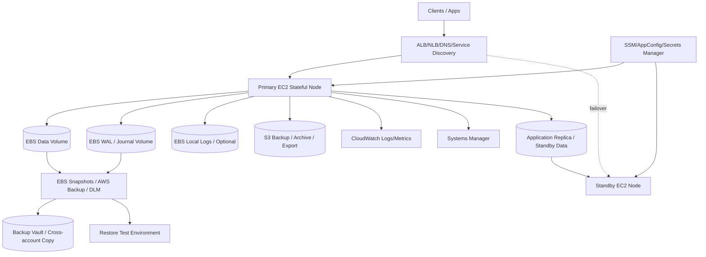
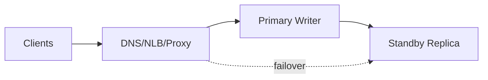

# Part 077 — Reference Architecture: Stateful Compute and Self-Managed Data Systems

The safest stateful server is the one you do not have to operate.

If a managed service can meet the workload’s semantics, SLO, compliance, and cost requirements, use it.

But real engineering is not always ideal:

- legacy database runs only on EC2
- vendor application needs local disk
- custom storage engine requires block device control
- low-level filesystem tuning is required
- licensing prevents managed migration
- enterprise NAS semantics are required
- cluster software manages its own replication/quorum
- application expects shared disk or specific failover behavior
- migration timeline forces an interim stateful EC2 design

When you cannot avoid stateful compute, you must operate it deliberately.

A top-tier engineer does not simply attach an EBS volume and call it production.

They design:

- state ownership
- volume layout
- filesystem consistency
- backup and restore
- app-consistent snapshots
- failover semantics
- fencing
- quorum
- monitoring
- upgrades
- rollback
- data corruption recovery
- KMS and IAM
- capacity
- game days

This part is the reference architecture for stateful EC2 and self-managed data systems.

---

## 1. Target Workloads

Examples:

- self-managed PostgreSQL/MySQL/Redis/Search on EC2
- legacy vendor application with local data directory
- single-writer filesystem service
- clustered application with quorum
- active/passive EC2 pair
- on-prem application rehosted with AWS Application Migration Service
- file server migrated to FSx/EFS but still with EC2 control nodes
- specialized data system using EBS io2
- ZFS/ONTAP-like workflow migrated to FSx
- application requiring snapshot/clone test environments

The target is not "build your own database because you can."

The target is:

```text
operate unavoidable stateful compute with clear failure semantics
```

---

## 2. Architecture Overview



This is a conceptual blueprint. The exact shape depends on the software.

---

## 3. First Decision: Should This Be Self-Managed?

Before designing stateful EC2, ask:

### 3.1 Can a managed service replace it?

Examples:

| Requirement | Managed candidate |
|---|---|
| relational database | RDS/Aurora |
| key-value/cache | ElastiCache / MemoryDB |
| document/search | OpenSearch / managed alternatives |
| object store | S3 |
| shared Linux files | EFS / FSx OpenZFS / FSx ONTAP |
| Windows file share | FSx Windows / FSx ONTAP |
| NetApp NAS | FSx ONTAP |
| ZFS snapshots/clones | FSx OpenZFS |
| HPC filesystem | FSx Lustre |

If managed service meets the semantics, it usually reduces operational burden.

### 3.2 Why stay self-managed?

Acceptable reasons:

- unsupported engine/version/extension
- deep filesystem/kernel tuning needed
- vendor certification only on EC2
- licensing constraints
- migration interim state
- data gravity/timeline
- custom storage engine
- specific failover behavior
- specialized hardware/accelerator need

Bad reasons:

- "we already know EC2"
- "managed service seems expensive" without TCO
- "snapshots are enough"
- "we do not want to learn managed service"
- "we need root access" but no actual requirement

### 3.3 Exit strategy

Every self-managed stateful system should have:

```text
current stateful design
managed or modernized target
migration triggers
decommission plan
```

If you cannot modernize now, avoid trapping the system further.

---

## 4. Stateful Compute Mental Model

### 4.1 Identity and state are separate

A stateful service includes:

```text
compute identity: EC2 instance, hostname, IAM role, IP, DNS
data identity: volumes, snapshots, replicas, catalog, backup
service identity: endpoint clients use
write authority: who may accept writes
```

Design so compute identity can change without losing data.

### 4.2 Single writer vs multi-writer

Most stateful systems are single-writer per data shard.

Examples:

```text
primary database
primary file writer
leader node
active controller
```

Multi-writer requires explicit software support.

Do not assume shared disk means safe multi-writer.

### 4.3 Failover is authority transfer

Failover is not just "start the standby."

It is:

```text
stop/fence old writer
promote new writer
redirect clients
validate data
record new epoch
```

### 4.4 Snapshots are recovery points, not clustering

Snapshots help rollback/recovery.

They do not provide live high availability unless paired with restore/failover process.

### 4.5 Replication is not backup

Replication helps availability/RTO.

Backup helps point-in-time recovery from delete/corruption.

Use both for critical state.

---

## 5. Volume Layout

### 5.1 Separate root and data

Recommended:

```text
/dev/xvda  root OS/app runtime
/dev/xvdf  data
/dev/xvdg  WAL/journal/redo
/dev/xvdh  local backup/export/staging optional
```

Why:

- root can be rebuilt
- data can be snapshotted separately
- WAL/journal can have separate performance
- restore can target only data
- upgrades less risky
- backup policy by data role

### 5.2 Root volume

Root should contain:

- OS
- runtime
- app binary
- agent
- minimal config bootstrap

Root should not be only source of:

- data
- secrets
- manual config
- persistent uploads
- irreplaceable logs

### 5.3 Data volume

Data volume should be:

- encrypted
- tagged
- sized with growth forecast
- monitored for filesystem free space
- backed up by RPO policy
- restored in game days
- performance tuned
- separate from scratch/cache

### 5.4 WAL/journal volume

Use separate volume when:

- database or storage engine benefits
- write latency critical
- recovery logs have different IO pattern
- capacity isolation needed
- snapshot coordination understood

Snapshot together with data volume.

### 5.5 Scratch/cache volume

Tag explicitly:

```yaml
DataRole: scratch
BackupTier: None
```

Do not include in expensive backup if rebuildable.

### 5.6 Filesystem choices

Common:

- ext4
- XFS
- application-specific layouts
- LVM/RAID when justified

Be careful with:

- RAID across EBS volumes
- LVM snapshots
- device name changes
- fstab UUID mismatch after restore
- filesystem freeze
- multi-volume consistency

---

## 6. EBS Performance Design

### 6.1 gp3 default

Use gp3 for many workloads because IOPS/throughput can be provisioned separately from size.

Size for:

- capacity
- baseline IOPS
- throughput
- latency
- burst avoidance
- growth

### 6.2 io2 / io2 Block Express

Use for critical high-performance workloads requiring high IOPS/low latency and durability.

Justify with:

- measured latency SLO
- high write rate
- database requirements
- cost model
- restore/DR plan

### 6.3 Instance EBS bandwidth

EBS volume performance cannot exceed instance EBS/network limits.

Check:

- instance family EBS bandwidth
- network throughput
- queue length
- volume throughput
- CPU steal/contention
- Nitro generation
- enhanced networking

### 6.4 Multi-volume layouts

If using multiple volumes:

- snapshot together
- restore together
- tag as volume group
- monitor all volumes
- document attach order/mount
- validate restore

### 6.5 EBS Multi-Attach caution

EBS Multi-Attach allows a single io1/io2 volume to be attached to multiple instances in the same AZ. Each attached instance has full read/write access.

This is not a normal shared filesystem.

You must use cluster-aware software that manages concurrent writes, fencing, and consistency.

Avoid using Multi-Attach for:

- ext4/XFS mounted read-write on multiple instances
- generic shared file storage
- application-level locking without cluster filesystem support
- cross-AZ HA

Use EFS/FSx or application replication for shared access unless you have strong cluster semantics.

---

## 7. Availability Patterns

### 7.1 Single node with fast restore

Simplest.

Use when:

- RTO can be hours
- low criticality
- workload not easily clustered
- backup restore acceptable
- cost sensitivity high

Pattern:

```text
EC2 + EBS snapshots + AMI/IaC + restore runbook
```

Failure:

```text
restore volume from snapshot
launch replacement
attach volume
validate
```

### 7.2 Single node with standby compute

Use when compute boot/config time matters but data restore still manual.

Pattern:

```text
primary EC2 + stopped/warm standby + snapshots
```

Caution:

- standby must be patched/configured
- data still needs restore/attach
- avoid two writers

### 7.3 Active/passive with replication

Use when:

- lower RTO needed
- software supports replication
- clear promotion process exists

Pattern:



Key:

- replication lag monitored
- promotion tested
- old primary fenced
- endpoint switched
- failback documented

### 7.4 Cluster/quorum

Use when software supports:

- leader election
- quorum
- fencing
- replication
- consistent failover

Examples:

- database cluster
- consensus-based system
- vendor HA cluster

Design:

- odd quorum nodes
- witness if needed
- avoid split-brain
- distribute across AZs only if latency supported
- test network partition
- document failure domains

### 7.5 Shared storage cluster

Use only if software supports shared disk.

Alternatives:

- FSx/EFS shared file
- application-level replication
- managed service
- ONTAP/OpenZFS if semantics fit

---

## 8. Fencing and Split-Brain

### 8.1 Why fencing matters

If old primary is still alive and standby is promoted, both can accept writes.

That is split-brain.

### 8.2 Fencing mechanisms

Options:

- stop/terminate old EC2
- detach/revoke volume
- revoke IAM/write credentials
- remove from load balancer
- security group deny
- application-level leader lease
- cluster fencing agent
- DNS/endpoint control
- storage-level lock/lease

### 8.3 Fencing order

Failover should normally be:

```text
detect failure
confirm failure or decide force failover
fence old primary
promote standby
switch endpoint
validate writes
```

In ambiguous network partition, failing over too aggressively can corrupt data.

### 8.4 Epoch number

Maintain:

```yaml
writeEpoch: 2026-07-06T03:00:00Z-primary-b
```

All writers verify current epoch.

This helps detect stale primary.

### 8.5 Manual override

Manual failover must require:

- incident commander approval
- current replication lag
- old primary status
- backup before promotion if possible
- clear rollback/failback plan

---

## 9. Backup and Snapshot Strategy

### 9.1 Recovery point types

Use:

- EBS snapshots
- AWS Backup recovery points
- DLM snapshot policies
- application-native backups
- export to S3
- FSx snapshots/backups
- AMIs for root/rebuild
- cross-account copies
- cross-region copies

### 9.2 Crash consistency

AWS Backup creates crash-consistent backups for EBS volumes attached to the same EC2 instance by default, with snapshots taken at the same moment.

Use when:

- application can recover from crash
- journaling is sufficient
- multi-volume point-in-time matters
- RPO/RTO acceptable

### 9.3 Application consistency

Use DLM pre/post scripts, Systems Manager, VSS, database-native backup, or application checkpointing when crash consistency is insufficient.

Examples:

- database checkpoint
- filesystem freeze
- flush WAL
- pause writes
- VSS snapshot
- app maintenance mode

### 9.4 Backup frequency

Map to RPO:

```text
hourly snapshots for critical app
daily for lower criticality
pre-change snapshots before migration/upgrade
continuous/PITR via app-native if required
```

### 9.5 Restore test

Test:

- volume restore
- app start
- data integrity
- permissions
- KMS
- multi-volume mount
- performance after restore
- RTO/RPO actual

### 9.6 Backups and replication together

Use:

- replication for lower RTO
- backup for point-in-time recovery
- immutable backup for ransomware/corruption
- app-native export for logical recovery

---

## 10. FSx Options for Stateful Systems

### 10.1 FSx Windows

Use for:

- Windows application file share
- SMB
- AD integration
- NTFS ACLs
- user shares
- Windows vendor app

Avoid replacing Windows ACL workload with EFS.

### 10.2 FSx ONTAP

Use for:

- enterprise NAS
- NFS/SMB/iSCSI
- snapshots/clones
- SnapMirror
- storage efficiency
- multi-protocol workloads
- migration from NetApp

### 10.3 FSx OpenZFS

Use for:

- NFS workloads needing ZFS semantics
- snapshots/clones
- dev/test clones
- Linux file server migration
- rollback-friendly stateful data

### 10.4 FSx Lustre

Use for:

- HPC/ML scratch/persistent high-performance file workloads
- not general stateful database storage unless software supports it
- S3-linked processing

### 10.5 EFS

Use for:

- elastic Linux shared file storage
- home directories
- shared app assets
- moderate shared state
- NFS simplicity

Not for:

- database primary block storage
- high metadata storm without testing
- strict Windows ACLs
- high-performance HPC that needs Lustre

---

## 11. Endpoint and Client Routing

### 11.1 Stable service endpoint

Clients should not connect directly to instance private IP unless unavoidable.

Use:

- DNS CNAME
- Route 53 private hosted zone
- NLB for TCP
- ALB for HTTP
- service discovery
- proxy layer

### 11.2 Failover endpoint

Failover changes endpoint target:

```text
stateful.service.internal -> primary-a
stateful.service.internal -> primary-b
```

or target group shifts.

### 11.3 DNS TTL

Low TTL helps failover but clients may cache.

Test real clients.

### 11.4 Connection draining

Stateful clients may hold long connections.

Runbook must include:

- connection drain
- client reconnect behavior
- retry policy
- transaction timeout
- partial commit behavior

### 11.5 Read-only mode

During maintenance/failover:

- app can enter read-only
- writers stopped
- readers allowed if safe
- endpoint returns clear errors
- background jobs paused

---

## 12. Upgrades and Maintenance

### 12.1 Pre-change checklist

- backup/snapshot created
- restore tested recently
- rollback plan
- maintenance window
- replication healthy
- old primary fencing plan
- app smoke test
- owner approval
- monitoring focused dashboard
- communication

### 12.2 Rolling upgrade for replicas

If cluster supports:

1. upgrade standby/replica
2. validate replication
3. failover
4. upgrade old primary
5. validate
6. failback if desired

### 12.3 Single-node upgrade

1. create application-consistent snapshot
2. stop writes
3. upgrade in-place or launch replacement
4. attach restored/current volume
5. validate
6. open traffic
7. keep rollback snapshot until confidence

### 12.4 Schema/storage format changes

High risk:

- may not be backward-compatible
- rollback may require restore
- replicas may break
- snapshots must be retained

Use:

- expand/contract migration
- shadow copy
- dual-write carefully
- validation
- canary
- restore point

### 12.5 Kernel/filesystem changes

Test with:

- restored volume copy
- fsck/xfs_repair dry-run where applicable
- performance benchmark
- mount options
- rollback AMI

---

## 13. Observability

### 13.1 Application state metrics

Track:

- leader/primary identity
- replica lag
- write throughput
- read latency
- write latency
- transaction errors
- checkpoint duration
- failover count
- read-only mode
- corruption/checksum errors
- recovery log replay duration

### 13.2 EC2/EBS metrics

Track:

- CPU/memory
- disk filesystem usage
- EBS read/write latency
- queue length
- IOPS/throughput
- instance status checks
- network
- burst balance where relevant
- volume modification state
- snapshot age

### 13.3 Backup metrics

Track:

- latest recovery point
- backup job status
- app-consistent snapshot result
- cross-account copy
- restore test status
- KMS restore test
- RPO actual

### 13.4 Failover metrics

Track:

- detection time
- promotion time
- endpoint switch time
- client reconnect time
- RTO actual
- replication lag at failover
- data loss window
- failed transactions

### 13.5 Dashboards

Dashboards:

- service health
- storage latency/capacity
- replication health
- backup/recovery
- failover readiness
- cost/capacity
- change history

---

## 14. Security

### 14.1 IAM

Separate roles:

- app runtime
- backup
- restore
- snapshot management
- failover operator
- break-glass
- monitoring

App role should not:

- delete snapshots
- delete backups
- disable KMS keys
- modify backup plans
- modify security groups broadly
- assume failover admin role

### 14.2 KMS

Design:

- customer managed key for data volumes
- backup/recovery key strategy
- cross-account copy key
- key deletion guardrail
- restore role decrypt test
- monitoring on key policy changes

### 14.3 Network

- private subnets
- restricted security groups
- no public SSH
- SSM Session Manager
- TLS for client protocols where supported
- NACLs only as deliberate boundary
- VPC endpoints where useful

### 14.4 Secrets

- Secrets Manager/SSM Parameter Store
- rotate credentials
- no local secret files as only source
- standby/DR secret availability
- failover credential plan

### 14.5 Audit

Log:

- failover actions
- snapshot creation/deletion
- backup restore
- KMS changes
- security group changes
- data export
- operator access
- root/admin login

---

## 15. Cost and Capacity

### 15.1 Cost drivers

- EC2 primary/standby
- EBS volume type/size/IOPS/throughput
- snapshots/backups
- cross-region/account copies
- FSx throughput/storage
- idle standby
- Capacity Reservations
- restore tests
- data transfer
- monitoring/logging

### 15.2 Capacity planning

Forecast:

- data growth
- write throughput
- read throughput
- IOPS
- backup window
- restore time
- failover capacity
- replica lag under peak
- maintenance surge

### 15.3 Standby cost

Standby can be:

- cold: cheaper, slower
- warm: moderate cost, faster
- hot: expensive, fastest

Choose by RTO.

### 15.4 Snapshot cost

High churn data creates snapshot growth.

Track:

- changed blocks/day
- retention
- copied snapshots
- app-consistent frequency
- old AMI snapshots
- restore test volumes

### 15.5 Cost-to-recover

Measure:

```text
monthly protection cost
cost per restore test
cost of standby
cost of RTO reduction
cost of data loss avoided
```

This makes resilience trade-offs explicit.

---

## 16. Runbooks

### 16.1 Primary instance impaired

1. Confirm impact.
2. Determine if primary still writes.
3. Stop/fence primary if failover needed.
4. Check replica lag.
5. Promote standby.
6. Switch endpoint.
7. Validate writes.
8. Preserve old primary for analysis.
9. Record RTO/RPO.

### 16.2 Volume full

1. Check filesystem usage.
2. Identify growth path.
3. Stop runaway writer if needed.
4. Snapshot if critical.
5. Modify EBS volume.
6. Grow partition/filesystem.
7. Validate app.
8. Add cleanup/forecast fix.

### 16.3 Data corruption

1. Stop writers.
2. Identify corruption time.
3. Check replica state; stop replication if propagating.
4. Choose clean backup/snapshot.
5. Restore to isolated environment.
6. Validate data.
7. Repair/copy back or full rollback.
8. Patch root cause.

### 16.4 Replication lag high

1. Check network/storage throughput.
2. Check primary write spike.
3. Check standby health.
4. Check EBS/FSx saturation.
5. Reduce load or scale resources.
6. Alert if RPO breached.
7. Avoid failover if lag too high unless business accepts data loss.

### 16.5 Application-consistent backup failed

1. Check SSM agent.
2. Check pre/post script logs.
3. Check freeze timeout.
4. Ensure app unfrozen.
5. Run manual backup if RPO at risk.
6. Fix script.
7. Test restore.

### 16.6 KMS restore denied

1. Identify volume/snapshot/backups key.
2. Check key state.
3. Check restore role.
4. Check key policy/grants.
5. Use copied recovery point if available.
6. Fix key policy.
7. Add game day.

### 16.7 Bad upgrade rollback

1. Stop writes.
2. Decide restore vs fix-forward.
3. Use pre-change snapshot.
4. Restore to staging first if possible.
5. Cut over to restored data.
6. Validate app.
7. Preserve failed version for analysis.

---

## 17. Game Days

### Scenario 1 — Primary EC2 dies

Expected:

- old primary fenced
- standby promoted
- endpoint switched
- app validates
- RTO measured

### Scenario 2 — EBS volume restore

Expected:

- snapshot selected
- volume restored
- attached/mounted
- app starts
- permissions/KMS work

### Scenario 3 — Multi-volume restore

Expected:

- data + WAL restored from same recovery point
- app recovery logs clean
- smoke tests pass

### Scenario 4 — Replication split-brain drill

Expected:

- old primary isolated
- stale writer rejected
- epoch updated
- no dual writes

### Scenario 5 — Application-consistent backup under load

Expected:

- pre/post scripts complete
- freeze window acceptable
- restore validates app

### Scenario 6 — KMS failure

Expected:

- restore failure detected in test
- recovery key/path used
- key policy fixed

---

## 18. Terraform/IaC Concepts

### 18.1 EBS data volume

```hcl
resource "aws_ebs_volume" "data" {
  availability_zone = var.az
  size              = 1000
  type              = "gp3"
  iops              = 6000
  throughput        = 500
  encrypted         = true
  kms_key_id        = aws_kms_key.data.arn

  tags = {
    Name       = "orders-primary-data"
    Service    = "orders"
    DataRole   = "source-of-truth"
    BackupTier = "Gold"
  }
}
```

### 18.2 Instance profile boundary

```hcl
resource "aws_iam_role" "stateful_app" {
  name = "orders-stateful-app"
  assume_role_policy = data.aws_iam_policy_document.ec2_assume.json
}
```

Attach only runtime permissions, not backup deletion/failover admin.

### 18.3 Backup selection by tag

```hcl
resource "aws_backup_selection" "gold_stateful" {
  name         = "gold-stateful-volumes"
  iam_role_arn = aws_iam_role.aws_backup.arn
  plan_id      = aws_backup_plan.gold.id

  selection_tag {
    type  = "STRINGEQUALS"
    key   = "BackupTier"
    value = "Gold"
  }
}
```

### 18.4 Failover metadata

Store in repo/runbook:

```yaml
service: orders-stateful
primaryEndpoint: orders.internal
writeAuthority: single-primary
fencing:
  - remove-from-target-group
  - stop-instance
  - revoke-writer-token
replication:
  lagMetric:
  maxAcceptedLagSeconds:
backup:
  plan: gold
restoreValidation: scripts/validate-orders.sh
```

---

## 19. Anti-Patterns

### 19.1 Stateful singleton with no restore test

Backups are theoretical until restored.

### 19.2 Root volume as data store

Root rebuild and data recovery become tangled.

### 19.3 Multi-Attach as shared filesystem

Unsafe without cluster-aware filesystem/application.

### 19.4 Replication as only recovery

Corruption/deletes replicate.

### 19.5 Failover without fencing

Split-brain risk.

### 19.6 Snapshot without application validation

Volume exists, app may still be corrupt.

### 19.7 Manual failover tribal knowledge

Incident runbook must be explicit and tested.

### 19.8 Standby drift

Standby not patched/configured like primary.

---

## 20. Architecture Review Checklist

### 20.1 Necessity

- [ ] Managed service alternative evaluated.
- [ ] Reason for self-managed state documented.
- [ ] Exit/modernization path documented.

### 20.2 State

- [ ] Root and data separated.
- [ ] Volume group documented.
- [ ] Data role tags applied.
- [ ] Filesystem and mount config documented.
- [ ] Scratch/cache separated.

### 20.3 Consistency

- [ ] Crash vs application consistency decided.
- [ ] Multi-volume snapshots coordinated.
- [ ] App-native backup considered.
- [ ] Restore validation script exists.

### 20.4 Availability

- [ ] Failover pattern chosen.
- [ ] Fencing mechanism defined.
- [ ] Split-brain prevention tested.
- [ ] Endpoint switching tested.
- [ ] Replica lag monitored.
- [ ] Failback runbook exists.

### 20.5 Operations

- [ ] Backup/restore tested.
- [ ] KMS restore tested.
- [ ] Dashboards exist.
- [ ] Alerts link to runbooks.
- [ ] Upgrades have rollback.
- [ ] Game days scheduled.

---

## 21. Mini Case Study — Self-Managed PostgreSQL on EC2

### 21.1 Context

A legacy PostgreSQL instance uses an extension not supported by managed service.

### 21.2 Design

- primary EC2 with EBS gp3/io2 data volume
- separate WAL volume
- standby replica in another AZ
- cataloged DNS endpoint
- app-consistent backup with PostgreSQL-native backup/PITR plus EBS snapshots for volume restore
- AWS Backup for EBS
- cross-account copy
- KMS recovery key
- failover runbook with fencing
- restore test quarterly

### 21.3 Failover

1. stop app writes
2. fence old primary
3. check replica lag
4. promote standby
5. switch DNS/proxy endpoint
6. run SQL smoke tests
7. record epoch

### 21.4 Invariant

```text
PostgreSQL correctness is proven by database recovery validation, not by EBS snapshot existence.
```

---

## 22. Mini Case Study — Vendor App with Local File State

### 22.1 Context

Vendor app stores state under:

```text
/opt/vendor/data
```

Cannot be changed quickly.

### 22.2 Interim design

- move `/opt/vendor/data` to separate EBS volume
- root rebuilt from AMI
- data backed up by AWS Backup
- pre-change snapshots before patching
- logs shipped
- endpoint through NLB/DNS
- restore runbook tested
- modernization plan to move data to S3/EFS/managed DB

### 22.3 Invariant

```text
Lift-and-shift state is isolated first, modernized second.
```

---

## 23. Summary

Stateful EC2 is production-ready only when state is intentionally owned, protected, monitored, and recoverable.

Key principles:

1. Prefer managed services where possible.
2. Separate compute identity from data identity.
3. Separate root, data, WAL/journal, scratch.
4. Use EBS performance classes intentionally.
5. Treat EBS Multi-Attach as advanced cluster primitive, not shared disk magic.
6. Coordinate multi-volume and application-consistent backups.
7. Use replication for RTO and backups for RPO/corruption recovery.
8. Fence old primaries before promotion.
9. Validate restore at application level.
10. Monitor replica lag, storage latency, backup age, and failover readiness.
11. Plan upgrades with pre-change recovery points.
12. Keep an exit strategy toward managed or simpler architecture.

The core rule:

> Stateful compute is acceptable when the state machine, failure model, and recovery path are explicit and tested.

Next, Part 078 covers migration and modernization playbooks: how to move existing compute/storage workloads into AWS safely, choose the right 7R strategy, use MGN/DataSync/SnapMirror/cutover runbooks, and progressively modernize from rehosted state toward resilient cloud-native patterns.

---

## References

- AWS Backup Developer Guide — Amazon EBS multi-volume crash-consistent backups: https://docs.aws.amazon.com/aws-backup/latest/devguide/multi-volume-crash-consistent.html
- Amazon EBS User Guide — Attach a volume to multiple instances with EBS Multi-Attach: https://docs.aws.amazon.com/ebs/latest/userguide/ebs-volumes-multi.html
- Amazon EBS User Guide — Automate application-consistent snapshots with Data Lifecycle Manager: https://docs.aws.amazon.com/ebs/latest/userguide/automate-app-consistent-backups.html
- Amazon EC2 User Guide — Application-consistent Windows VSS EBS snapshots: https://docs.aws.amazon.com/AWSEC2/latest/UserGuide/application-consistent-snapshots.html
- Amazon FSx for OpenZFS User Guide — Protecting data with snapshots: https://docs.aws.amazon.com/fsx/latest/OpenZFSGuide/snapshots-openzfs.html
- Amazon FSx for NetApp ONTAP User Guide — Replicating your data using SnapMirror: https://docs.aws.amazon.com/fsx/latest/ONTAPGuide/scheduled-replication.html
