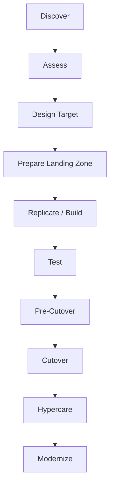
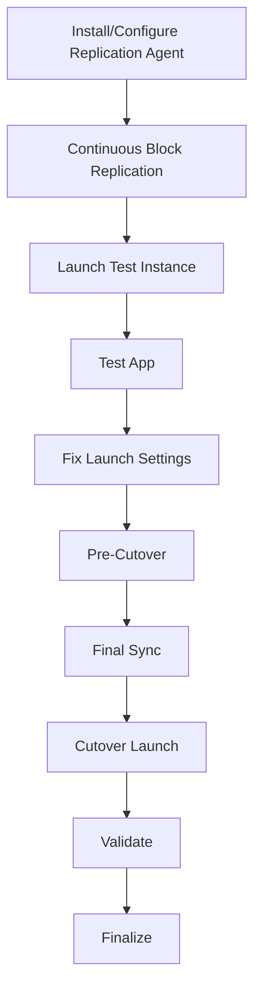
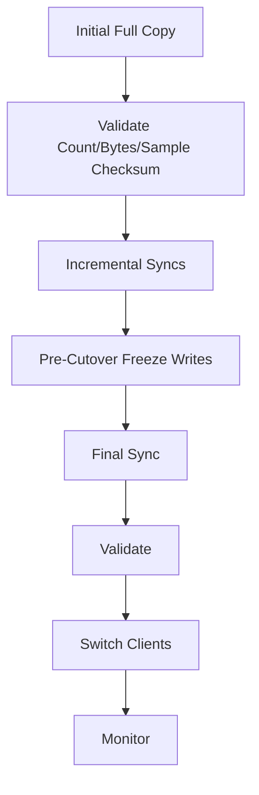

# Part 078 — Migration and Modernization Playbook for Compute and Storage

A migration is not a copy.

A migration is a controlled change of system authority.

You move:

- compute runtime
- data
- identity
- network path
- DNS
- permissions
- backup responsibility
- monitoring
- operational ownership
- cost model
- failure mode
- recovery path

A bad migration moves servers and preserves fragility.

A good migration reduces risk while creating a path to modernization.

For compute and storage, the migration goal is not simply:

```text
move VM to EC2
copy files to AWS
```

The goal is:

```text
move workload into an AWS operating model where compute is rebuildable, storage roles are explicit, backup/restore are tested, observability exists, and future modernization is possible.
```

This part is a production migration and modernization playbook.

---

## 1. Problem yang Diselesaikan

Part ini membahas:

- 7 Rs migration strategy
- discovery and dependency mapping
- wave planning
- landing zone readiness
- rehost with AWS Application Migration Service / MGN
- file/object migration with AWS DataSync
- ONTAP migration with SnapMirror
- database/stateful migration considerations
- cutover and rollback
- DNS/traffic migration
- validation and acceptance
- post-migration stabilization
- rehost-to-modernize roadmap
- modernization patterns from file/block/server to object/catalog/managed/cloud-native
- runbooks and game days

---

## 2. Migration Mental Model

### 2.1 Migration is authority transfer

Before migration:

```text
old system is source of truth
old endpoint receives traffic
old backup is recovery path
old operations team owns incidents
```

After migration:

```text
new system is source of truth
new endpoint receives traffic
new backup is recovery path
new operations model owns incidents
```

Cutover is the moment of authority transfer.

### 2.2 Data movement is not enough

Data copy can succeed while migration fails because:

- app points to old endpoint
- permissions not preserved
- DNS cache stale
- backup not enabled
- KMS key inaccessible
- monitoring absent
- performance worse
- users cannot authenticate
- rollback impossible
- source continues receiving writes
- file metadata changed

### 2.3 Migration has phases



### 2.4 Rehost can be a step, not the destination

Rehost is acceptable when:

- timeline urgent
- app risky to change
- business needs data center exit
- modernization requires discovery from running workload
- vendor support constraints

But rehost should produce modernization backlog:

```text
manual server -> AMI pipeline
local files -> S3/EFS/FSx
manual backup -> AWS Backup
SSH ops -> SSM
static capacity -> ASG
pet instance -> replaceable compute
```

### 2.5 Every migration needs rollback

Rollback is not failure. It is a controlled safety mechanism.

Rollback plan must define:

- trigger criteria
- decision owner
- data handling
- DNS/traffic reversal
- source write state
- maximum rollback window
- customer communication
- validation after rollback

---

## 3. Migration Strategy: The 7 Rs

AWS Prescriptive Guidance describes seven migration strategies:

- Retire
- Retain
- Rehost
- Relocate
- Repurchase
- Replatform
- Refactor / re-architect

### 3.1 Retire

Decommission workload.

Use when:

- no business owner
- no usage
- replaced by another system
- duplicate application
- data archived

Engineering task:

- confirm dependencies
- export/archive data
- preserve compliance records
- update DNS/inventory
- stop paying cost

### 3.2 Retain

Keep workload where it is for now.

Use when:

- not ready
- compliance constraint
- dependency too risky
- low priority
- pending business decision

Engineering task:

- document reason
- define review date
- still improve backup/observability if needed

### 3.3 Rehost

Lift-and-shift to AWS with minimal app change.

Tools:

- AWS Application Migration Service / MGN
- VM import/export in some cases
- manual image build
- backup/restore

Use when:

- fast migration needed
- app compatibility unknown
- old OS/app hard to modify
- data center exit

Risk:

- moving bad ops to cloud
- pet instances remain pets
- cost not optimized
- storage layout unchanged
- backup gaps

### 3.4 Relocate

Move platform without changing app architecture.

Examples:

- VMware Cloud on AWS
- EKS cluster relocation
- RDS relocation where relevant

Use when platform-level movement fits.

### 3.5 Repurchase

Move to SaaS/product replacement.

Use when:

- custom app no longer differentiates
- vendor SaaS acceptable
- migration effort lower than modernization
- compliance fits

### 3.6 Replatform

Make modest changes to use AWS-managed capabilities.

Examples:

- VM app to EC2 Auto Scaling
- local files to EFS
- on-prem NAS to FSx
- backup scripts to AWS Backup
- static app server to ALB/ASG
- local object store to S3

### 3.7 Refactor / re-architect

Deep redesign.

Examples:

- monolith to services
- local uploads to S3 + catalog
- directory polling to SQS events
- self-managed DB to managed service
- VM workers to AWS Batch/ECS/EKS
- shared file state to object + metadata DB

Use when business value justifies complexity.

---

## 4. Discovery and Assessment

### 4.1 Inventory

Collect:

- servers
- OS/version
- CPU/memory/disk/network usage
- storage volumes
- file shares
- databases
- scheduled jobs
- services/processes
- ports
- users/groups
- certificates
- secrets
- DNS names
- load balancers
- external dependencies
- backup jobs
- monitoring
- owners
- SLAs/RTO/RPO
- licensing

### 4.2 Dependency mapping

Map:

```text
app -> database
app -> file share
app -> object store
app -> downstream API
app -> identity service
app -> batch scheduler
app -> DNS name
app -> cron jobs
```

Migration waves should follow dependency groups.

AWS Prescriptive Guidance recommends dependency analysis using trusted discovery data when creating wave plans.

### 4.3 Storage classification

For every storage path/share/bucket/volume:

```yaml
path:
role: source-of-truth|cache|scratch|derived|backup|archive
owner:
protocol:
size:
fileCount:
changeRate:
permissions:
rpo:
rto:
target:
```

### 4.4 Performance baseline

Measure before migration:

- request latency
- throughput
- CPU/memory
- disk IOPS/throughput/latency
- network throughput
- file open/list latency
- batch duration
- backup duration
- restore duration
- cost

Without baseline, "AWS is slower" is hard to diagnose.

### 4.5 Risk classification

Classify:

| Risk | Examples |
|---|---|
| data risk | high change rate, weak backup, no checksum |
| dependency risk | unknown integrations |
| cutover risk | many DNS/clients |
| performance risk | storage latency sensitive |
| security risk | old OS/secrets |
| rollback risk | hard to reverse writes |
| operations risk | no runbook |

---

## 5. Landing Zone Readiness

### 5.1 Account structure

Prepare:

- workload accounts
- shared services
- security/log archive
- backup/recovery account
- network account if used
- non-prod/prod separation

### 5.2 Network

Prepare:

- VPC/subnets
- route tables
- security groups
- VPN/Direct Connect if hybrid
- Transit Gateway if needed
- DNS resolver rules
- private hosted zones
- VPC endpoints
- firewall/inspection path if required

### 5.3 IAM and identity

Prepare:

- IAM roles
- SSO/federation
- least privilege
- instance profiles
- migration service roles
- DataSync roles
- backup/restore roles
- AD integration if needed

### 5.4 KMS and secrets

Prepare:

- KMS keys
- key policies
- Secrets Manager/SSM parameters
- secret rotation
- DR keys
- migration temporary credentials

### 5.5 Observability

Prepare:

- CloudWatch agent/config
- logs destination
- CloudTrail organization trail
- Config rules
- dashboards
- alarms
- incident response
- runbooks

### 5.6 Backup

Before production cutover:

- AWS Backup plans
- vaults
- cross-account copy
- restore role
- restore test
- data classification tags
- pre-cutover backups

### 5.7 Cost and capacity

Prepare:

- quotas
- budgets
- cost allocation tags
- capacity reservations if needed
- subnet IP headroom
- storage capacity
- DR capacity

---

## 6. Rehost with MGN

### 6.1 MGN role

AWS Application Migration Service, now AWS Transform MGN in AWS docs, is a highly automated lift-and-shift rehost solution. It replicates source servers into your AWS account and helps cut over without long disruption windows.

Use for:

- physical/virtual/cloud server migration
- rehost waves
- data center exit
- legacy app migration
- fast move with minimal app change

### 6.2 Rehost flow



### 6.3 Launch template modernization

Even in rehost, improve:

- instance type rightsize
- EBS volume type gp3/io2
- IAM instance profile
- security groups
- private subnets
- SSM instead of SSH
- CloudWatch agent
- backup tags
- user data/bootstrap
- load balancer target

### 6.4 Rehost anti-pattern

Bad:

```text
migrate server exactly as-is and never revisit
```

Fix:

- create modernization backlog
- separate data volumes
- add backup/restore
- remove manual config
- add AMI pipeline
- move local files to S3/EFS/FSx where appropriate
- introduce ASG if stateless

### 6.5 Test launch

Test before cutover:

- OS boots
- app starts
- services enabled
- network reachable
- DNS dependencies
- storage mounted
- permissions
- licenses
- performance
- backup agent conflicts removed/replaced
- monitoring/logging

---

## 7. File and Object Migration with DataSync

### 7.1 DataSync role

AWS DataSync transfers data between on-premises/self-managed storage and AWS storage services. AWS docs describe use cases including migration, archiving cold data, and replication into S3/EFS/FSx.

Use for:

- NFS to EFS/OpenZFS/ONTAP
- SMB to FSx Windows/ONTAP
- on-prem to S3
- FSx to FSx
- EFS to EFS
- periodic sync during migration
- copy-back from restore

### 7.2 DataSync planning

Measure:

- total bytes
- file count
- average file size
- change rate
- permissions/metadata
- network bandwidth
- cutover window
- verification mode
- filtering
- schedule
- source load
- target performance

### 7.3 Metadata preservation

Protocol matters.

NFS:

- UID/GID
- mode
- timestamps
- symlinks
- hard links where supported/needed

SMB:

- ACLs
- owner
- timestamps
- attributes
- AD identity

S3:

- object metadata/tags
- storage class
- key mapping
- versioning if needed
- checksum

### 7.4 Migration sync pattern



### 7.5 DataSync validation

Validate:

- file count
- bytes
- sample checksum
- permissions
- timestamps
- application read/write
- performance
- backup enabled on target

### 7.6 DataSync anti-pattern

Bad:

```text
run one copy, cut over, discover permissions broken
```

Fix:

- test copy with representative subset
- validate effective access
- run app smoke test
- preserve rollback source read-only

---

## 8. ONTAP Migration with SnapMirror

### 8.1 When SnapMirror fits

Use for NetApp ONTAP workloads migrating to FSx for ONTAP.

AWS docs recommend SnapMirror for on-prem ONTAP to FSx for ONTAP because it performs block-level replication and preserves deduplicated/compressed data and snapshots.

Good for:

- large NetApp datasets
- snapshot history preservation
- efficient replication
- NAS migration
- DR/migration cutover

### 8.2 High-level flow

- create destination FSx for ONTAP
- configure networking/LIFs
- peer clusters/SVMs
- create SnapMirror relationship
- replicate
- keep destination updated
- cut over clients
- validate
- break relationship if target becomes primary

### 8.3 Cutover

During cutover:

1. freeze source writes
2. final SnapMirror update
3. break/promote destination
4. update DNS/mounts/SMB/NFS
5. validate permissions/data
6. monitor
7. preserve source rollback window

### 8.4 SnapMirror anti-pattern

Bad:

```text
replicate data but ignore client access and identity mapping
```

Fix:

- validate NFS/SMB clients
- validate AD/LDAP/UID/GID
- validate DNS aliases
- validate application file locks

---

## 9. Cutover Strategy

### 9.1 Cutover is traffic and write authority move

AWS Prescriptive Guidance describes cutover as moving network traffic from existing endpoints to newly deployed AWS resources.

For stateful workloads, also move write authority.

### 9.2 Cutover types

| Type | Description |
|---|---|
| big bang | all at once |
| phased | subset of users/services |
| blue/green | old and new side-by-side |
| canary | small percentage first |
| read-only validation | new reads before writes |
| shadow | duplicate traffic/results compare |
| DNS switch | endpoint change |
| proxy/router switch | route layer change |

### 9.3 Pre-cutover checklist

- migration runbook ready
- owners assigned
- communication sent
- backups taken
- restore tested
- source writes freeze plan
- final sync plan
- DNS TTL lowered earlier
- monitoring active
- rollback decision points
- validation checklist
- customer support ready

### 9.4 Cutover runbook

A cutover runbook should track tasks, planned times, sequence, and owners. AWS Prescriptive Guidance recommends using a cutover runbook and RACI-style ownership for migration activities.

Example:

```yaml
cutover:
  - freeze source writes
  - final data sync
  - validate sync
  - update DNS/load balancer
  - start AWS app
  - smoke test
  - monitor
  - declare success or rollback
```

### 9.5 Rollback triggers

Define before cutover:

- error rate > threshold
- latency > threshold
- data validation failed
- login/auth failure
- file permission failure
- missing transactions
- queue backlog unacceptable
- critical integration failure
- RTO window exceeded

### 9.6 Rollback data strategy

Rollback is easy for stateless apps.

Hard for stateful apps after writes occur on target.

Options:

- keep source read-write until final moment, target read-only
- short write freeze window
- dual-write with reconciliation only if designed
- target writes can be replayed back
- rollback only before write authority transfer
- fix-forward after write authority transfer

Decide explicitly.

---

## 10. Validation

### 10.1 Infrastructure validation

- VPC/routing
- security groups
- DNS
- IAM roles
- KMS
- instance health
- ASG/ALB
- storage mounts
- backup plan
- monitoring

### 10.2 Data validation

- count
- bytes
- checksum samples
- object version IDs
- file permissions
- ACLs
- timestamps
- database consistency
- application record counts
- reconciliation queries

### 10.3 Application validation

- login
- create/read/update critical record
- upload/download
- background job
- report generation
- file access
- API integration
- rollback smoke path

### 10.4 Performance validation

Compare baseline:

- p95/p99 latency
- throughput
- disk latency
- file open/list latency
- batch duration
- CPU/memory
- network
- storage IOPS/throughput
- cost per unit

### 10.5 Recovery validation

Before production acceptance:

- backup created in AWS
- restore tested or scheduled in hypercare
- KMS restore verified
- runbooks updated
- owners trained
- alerts firing to correct team

---

## 11. Hypercare

### 11.1 Hypercare window

After cutover:

- intensified monitoring
- migration team on standby
- old source preserved read-only
- rollback/fix-forward decision window
- daily health review
- cost review
- backup verification
- performance tuning
- user support loop

### 11.2 Hypercare metrics

Track:

- error rate
- latency
- user tickets
- data reconciliation
- queue backlog
- storage growth
- backup success
- cost anomaly
- instance health
- security alerts

### 11.3 Decommission

Only decommission old source after:

- target stable
- backups tested
- rollback window closed
- data retention/export done
- compliance approval
- DNS/inventory updated
- cost owner approves

### 11.4 Hypercare anti-pattern

Bad:

```text
cut over Friday night, migration team leaves, old backups disabled, no restore test
```

Fix:

- hypercare plan
- owner handoff
- backup validation
- decommission checklist

---

## 12. Modernization After Rehost

### 12.1 Pet EC2 to immutable compute

Steps:

1. inventory manual changes
2. create AMI pipeline
3. externalize config/secrets
4. move local durable data
5. add launch template
6. add ASG if stateless
7. remove SSH dependency
8. add SSM/CloudWatch

### 12.2 Local files to S3/EFS/FSx

Decision:

- object blobs -> S3 + catalog
- shared Linux files -> EFS/FSx OpenZFS/ONTAP
- Windows shares -> FSx Windows/ONTAP
- NetApp -> FSx ONTAP
- ZFS/NFS -> FSx OpenZFS
- scratch/cache -> instance store/EBS temp

### 12.3 Cron jobs to event/queue

Move:

```text
cron on one server
```

to:

- EventBridge Scheduler
- SQS worker
- Step Functions
- AWS Batch
- ECS scheduled task

### 12.4 Local backup scripts to AWS Backup

Replace:

- shell snapshot scripts
- manual tar backups
- ad hoc rsync

with:

- AWS Backup
- DLM
- service-native backups
- restore testing
- backup vault policies
- cross-account copy

### 12.5 Directory polling to events

Move:

```text
poll /incoming
```

to:

- S3 events
- EventBridge
- SQS
- catalog states
- manifest commit

### 12.6 Stateful DB to managed service

When feasible:

- assess compatibility
- migrate with DMS/native tools
- test performance
- validate backups/PITR
- switch app connection
- retire self-managed backup/failover

---

## 13. Migration Observability

### 13.1 Migration dashboard

Show:

- wave status
- replication status
- data sync progress
- lag/change rate
- test launch status
- cutover readiness
- validation pass/fail
- rollback status
- hypercare issues

### 13.2 Data movement metrics

- bytes transferred
- files transferred
- files skipped/error
- verification result
- transfer duration
- source change rate
- final sync estimate
- network throughput
- source/target errors

### 13.3 Cutover metrics

- start time
- freeze duration
- final sync duration
- DNS switch time
- app startup time
- smoke test duration
- user impact
- rollback/fix-forward decision

### 13.4 Post-migration metrics

- cost vs forecast
- performance vs baseline
- backup success
- restore test
- error/ticket rate
- capacity utilization
- modernization backlog burn-down

---

## 14. Security Migration

### 14.1 Least privilege during migration

Migration often uses powerful roles.

Control:

- temporary credentials
- scoped IAM roles
- limited duration
- CloudTrail monitoring
- break-glass approval
- no broad long-lived keys

### 14.2 Secrets

During migration:

- do not bake secrets into AMIs
- rotate migrated secrets
- remove secrets from old servers
- update clients
- validate DR secret access

### 14.3 KMS

Plan:

- source encryption
- target encryption
- KMS key policy
- cross-account copy
- restore key
- key deletion guardrails

### 14.4 Network exposure

Do not temporarily open:

```text
0.0.0.0/0 SSH/RDP/database
```

Use:

- VPN/DX
- SSM Session Manager
- bastion with controls if unavoidable
- security groups scoped to migration agents

### 14.5 Audit

Log:

- migration role usage
- data copy actions
- snapshot/backup sharing
- cutover changes
- DNS changes
- KMS policy changes
- firewall/security group changes

---

## 15. Cost and Capacity Migration

### 15.1 Pre-migration cost model

Estimate:

- EC2 instance cost
- EBS volumes/snapshots
- FSx/EFS/S3
- DataSync transfer
- MGN replication/staging
- NAT/data transfer
- backup storage
- duplicate run during migration
- DR copies
- monitoring/logging

### 15.2 Right-sizing during migration

Do not map VM size 1:1 blindly.

Use:

- source utilization
- Compute Optimizer after migration
- load test
- instance family selection
- gp3 tuning
- Savings Plan only after baseline stabilizes

### 15.3 Duplicate environment cost

During migration, old and new may run together.

Budget:

- dual compute
- dual storage
- replication
- testing
- rollback window
- hypercare

### 15.4 Capacity readiness

Check:

- EC2 quotas
- subnet IPs
- EBS quotas
- FSx/EFS quotas
- S3/KMS request rates
- backup/restore quotas
- DR Region quotas

### 15.5 Decommission savings

Savings occur only after old environment is decommissioned.

Track:

- old servers shut down
- old storage archived/deleted
- old backups retained/expired
- old licenses cancelled
- old network links reduced
- old monitoring removed

---

## 16. Runbooks

### 16.1 Migration wave readiness

1. Confirm inventory.
2. Confirm dependencies.
3. Confirm owner.
4. Confirm target architecture.
5. Confirm data migration plan.
6. Confirm backup/restore.
7. Confirm cutover/rollback.
8. Confirm test results.
9. Confirm support plan.
10. Approve wave.

### 16.2 Rehost server cutover

1. Verify replication healthy.
2. Launch test instance.
3. Run smoke/performance tests.
4. Freeze source writes.
5. Final sync.
6. Launch cutover instance.
7. Update DNS/load balancer.
8. Validate.
9. Monitor.
10. finalize or rollback.

### 16.3 File share migration cutover

1. Initial DataSync copy.
2. Validate permissions.
3. Run incremental syncs.
4. Freeze source writes.
5. Final sync.
6. Switch mount/DFS/DNS.
7. Validate users/app.
8. Keep source read-only.
9. Decommission after window.

### 16.4 S3/object migration

1. Inventory source.
2. Choose key layout.
3. Copy with checksum/manifest.
4. Validate object count/bytes/checksums.
5. Enable versioning/lifecycle.
6. Update catalog/app.
7. Run dual-read if needed.
8. Cut over writers.
9. Monitor errors/cost.

### 16.5 Rollback

1. Stop writes to target if needed.
2. Determine if target writes must be replayed.
3. Switch DNS/traffic back.
4. Re-enable source writers.
5. Validate source.
6. Preserve target for analysis.
7. Communicate.
8. Re-plan migration.

### 16.6 Post-migration stabilization

1. Verify backups.
2. Run restore test.
3. Review performance.
4. Review cost.
5. Tune instance/storage.
6. Close security gaps.
7. Update runbooks.
8. Start modernization backlog.

---

## 17. Game Days

### Scenario 1 — Test cutover rollback

Expected:

- rollback trigger recognized
- DNS/traffic restored to source
- data consistency maintained
- decision owner clear

### Scenario 2 — DataSync permission mismatch

Expected:

- validation catches ACL/UID issue
- migration paused
- copy options corrected
- no production cutover

### Scenario 3 — Rehost launch failure

Expected:

- test launch catches driver/network/license issue
- launch settings fixed
- cutover not attempted prematurely

### Scenario 4 — KMS restore failure

Expected:

- pre-cutover restore test fails
- key policy fixed
- production acceptance blocked until pass

### Scenario 5 — Post-cutover performance regression

Expected:

- baseline comparison identifies storage latency
- gp3/io2/instance sizing adjusted
- rollback/fix-forward decision made

### Scenario 6 — Old source receives writes after cutover

Expected:

- write freeze/fencing detects
- stale writes reconciled or rollback/fix-forward decision
- source set read-only

---

## 18. Architecture Review Checklist

### 18.1 Strategy

- [ ] 7R choice documented.
- [ ] Managed target evaluated.
- [ ] Rehost exit path defined.
- [ ] Business owner approved.
- [ ] RPO/RTO documented.

### 18.2 Discovery

- [ ] Server inventory complete.
- [ ] Storage inventory complete.
- [ ] Dependencies mapped.
- [ ] Performance baseline captured.
- [ ] Backup/restore baseline captured.
- [ ] Security/licensing constraints known.

### 18.3 Target

- [ ] VPC/IAM/KMS ready.
- [ ] Compute sizing justified.
- [ ] Storage service chosen by access pattern.
- [ ] Backup/DR configured.
- [ ] Observability configured.
- [ ] Cost allocation tags applied.
- [ ] Capacity/quota checked.

### 18.4 Cutover

- [ ] Cutover runbook with owners.
- [ ] Rollback plan.
- [ ] Source write freeze.
- [ ] Final sync.
- [ ] Validation plan.
- [ ] Communication plan.
- [ ] Hypercare plan.

### 18.5 Post-migration

- [ ] Backups verified.
- [ ] Restore tested.
- [ ] Performance compared.
- [ ] Cost compared.
- [ ] Old resources decommissioned.
- [ ] Modernization backlog created.

---

## 19. Mini Case Study — Legacy Document App

### 19.1 Current state

- two on-prem VMs
- local file uploads
- SMB share
- SQL database
- nightly backup
- manual DNS
- no restore test
- RDP admin changes

### 19.2 Migration strategy

Phase 1: Rehost/replatform

- app VM via MGN
- SMB share to FSx Windows via DataSync
- SQL to managed DB or EC2 interim
- ALB/NLB where applicable
- AWS Backup
- CloudWatch/SSM
- cutover runbook

Phase 2: Modernize

- uploads to S3 + catalog
- async workers via queue
- reports to S3/EFS by data role
- app servers stateless
- ASG
- CI/CD
- Object Lock for regulated docs

### 19.3 Invariant

```text
Data center exit does not end migration. It starts modernization from a safer operating base.
```

---

## 20. Mini Case Study — NetApp NAS to FSx ONTAP

### 20.1 Current state

- 120 TiB NetApp volume
- NFS/SMB clients
- snapshots used for user restore
- strict ACLs
- high change rate
- short cutover window

### 20.2 Migration strategy

- FSx ONTAP target
- SnapMirror replication
- preserve snapshots and storage efficiency
- validate NFS/SMB access
- final SnapMirror update during freeze
- DNS/mount alias cutover
- source read-only rollback window
- backup/DR configured in AWS

### 20.3 Invariant

```text
NAS migration must preserve data, metadata, identity semantics, and client path expectations.
```

---

## 21. Mini Case Study — Rehosted VM Becomes Cloud-Native

### 21.1 Rehost

Application moved with MGN.

Initial EC2 still has:

- local uploads
- cron jobs
- manual config
- root volume data
- SSH operations

### 21.2 First 30 days modernization

- move uploads to S3
- move config to SSM/AppConfig
- move secrets to Secrets Manager
- ship logs
- backup data volume
- replace cron with EventBridge Scheduler
- create AMI pipeline
- split root/data volume
- add health checks

### 21.3 Next 90 days

- stateless ASG
- object catalog
- queue workers
- managed database migration
- DR restore test
- cost/unit dashboard

### 21.4 Invariant

```text
Rehost buys time. Modernization spends that time to reduce operational risk.
```

---

## 22. Summary

Migration is a production change to system authority.

Key principles:

1. Choose migration strategy intentionally using the 7 Rs.
2. Discover dependencies before wave planning.
3. Classify storage roles before copying bytes.
4. Build landing zone, IAM, KMS, backup, observability, and capacity before cutover.
5. Use MGN for rehost where appropriate.
6. Use DataSync for file/object transfer and validation.
7. Use SnapMirror for ONTAP migration where fit.
8. Cutover requires runbook, owners, validation, and rollback triggers.
9. Stateful rollback requires data strategy.
10. Hypercare is part of migration.
11. Decommission old resources to realize savings.
12. Rehost should create modernization backlog, not permanent cloud-shaped legacy.

The core rule:

> A successful migration does not merely move workloads to AWS. It transfers authority safely and improves the system’s future operating model.

Next, Part 079 builds the capstone production readiness review: a rigorous end-to-end checklist and architecture review process across compute, storage, security, backup, observability, cost, capacity, and operations before a workload is allowed into production.

---

## References

- AWS Prescriptive Guidance — About the migration strategies: https://docs.aws.amazon.com/prescriptive-guidance/latest/large-migration-guide/migration-strategies.html
- AWS Prescriptive Guidance — Wave planning: https://docs.aws.amazon.com/prescriptive-guidance/latest/application-portfolio-assessment-guide/wave-planning.html
- AWS Transform MGN User Guide — What is AWS Transform MGN?: https://docs.aws.amazon.com/mgn/latest/ug/what-is-mgn.html
- AWS DataSync User Guide — What is AWS DataSync?: https://docs.aws.amazon.com/datasync/latest/userguide/what-is-datasync.html
- AWS DataSync User Guide — Configuring transfers with Amazon EFS: https://docs.aws.amazon.com/datasync/latest/userguide/create-efs-location.html
- Amazon FSx for Windows File Server User Guide — Migrating existing files using DataSync: https://docs.aws.amazon.com/fsx/latest/WindowsGuide/migrate-files-to-fsx-datasync.html
- Amazon FSx for NetApp ONTAP User Guide — Migrating using SnapMirror: https://docs.aws.amazon.com/fsx/latest/ONTAPGuide/migrating-fsx-ontap-snapmirror.html
- AWS Prescriptive Guidance — Overview of the cutover phase: https://docs.aws.amazon.com/prescriptive-guidance/latest/best-practices-migration-cutover/overview-cutover-phase.html
- AWS Prescriptive Guidance — Cutover stage and rollback: https://docs.aws.amazon.com/prescriptive-guidance/latest/best-practices-migration-cutover/cutover-stage.html
