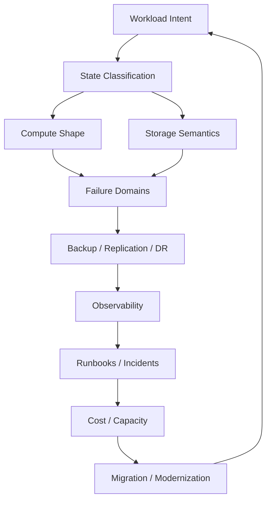

# Part 080 — Capstone Synthesis and Path to Top-Tier Compute and Storage Engineering

This is the final part of the series.

The goal of this course was never simply to know AWS service names.

The goal was to become the kind of engineer who can look at a workload and reason clearly about:

- compute shape
- state ownership
- storage semantics
- failure domains
- consistency
- durability
- scaling
- backup
- restore
- disaster recovery
- cost
- capacity
- security
- observability
- operations
- migration
- modernization

A top-tier engineer is not defined by how many AWS services they can list.

A top-tier engineer is defined by how accurately they can predict failure, design invariants, and build systems that still behave correctly when reality is messy.

This capstone consolidates the mental models, heuristics, review habits, and deliberate practice plan from all 80 parts.

---

## 1. The Whole Series in One Mental Model

Every compute/storage architecture can be reasoned through this loop:



If you are missing any box, the architecture is incomplete.

---

## 2. Core Mental Models

### 2.1 Compute is replaceable unless you make it stateful

The best compute design is:

```text
instance dies -> replacement launches -> workload continues
```

If that is impossible, ask:

- why does compute hold state?
- can state move to S3/EFS/FSx/DB?
- can local state become cache?
- can root and data be separated?
- can state be replicated?
- can restore be tested?

Stateful compute is not forbidden. Unexamined stateful compute is dangerous.

### 2.2 Storage is a contract, not a disk

Storage choices encode contracts:

| Service | Contract |
|---|---|
| S3 | object store, key/version/metadata, not filesystem |
| EBS | AZ-scoped block device attached to compute |
| EFS | regional elastic NFS shared file system |
| FSx Windows | managed SMB/Windows file semantics |
| FSx Lustre | high-performance parallel filesystem/HPC/ML |
| FSx ONTAP | enterprise NAS with ONTAP semantics |
| FSx OpenZFS | ZFS-like NFS snapshots/clones |
| instance store | local ephemeral high-performance scratch |
| File Cache | accelerated cache over remote datasets |

Choose the contract that matches the access pattern.

### 2.3 Source of truth is the most important label

Every byte must have a role:

```text
source-of-truth
cache
scratch
derived
backup
archive
replica
temporary
```

If you do not classify it, you cannot decide:

- backup
- retention
- lifecycle
- restore
- cost
- permissions
- cleanup
- RPO/RTO

### 2.4 Backup is not recovery

Recovery requires:

```text
backup exists
backup can be found
backup can be decrypted
backup can be restored
app can use restored data
business validation passes
RTO/RPO acceptable
```

A backup without restore proof is a hope.

### 2.5 Replication is not backup

Replication helps availability and RTO.

Backup helps rollback and recovery after corruption/delete.

If corruption replicates, only a clean point-in-time recovery path saves you.

### 2.6 Durability is not correctness

S3 can durably store wrong data.

EBS can preserve corrupted blocks.

EFS can retain broken permissions.

Object Lock can make invalid data undeletable.

Correctness requires validation and application semantics.

### 2.7 Cost is architecture feedback

Cost tells you:

- state classification is wrong
- lifecycle is wrong
- retries are wasteful
- compute is overprovisioned
- backups are duplicated
- snapshots are stale
- cache should be deleted
- derived data should be rebuilt
- unit economics changed

Do not treat cost as an afterthought.

### 2.8 Capacity is not infinite

Cloud capacity is elastic, but constrained by:

- quotas
- AZ/Region availability
- instance family
- subnet IPs
- KMS requests
- restore target capacity
- storage performance
- scaling speed
- account boundaries

Capacity readiness must be tested.

### 2.9 Observability is decision support

Observability is not dashboards.

It is the ability to answer:

```text
What is broken?
Who is affected?
Why?
What changed?
What is the safe next action?
Did the action work?
```

### 2.10 Operations are part of architecture

If a system cannot be operated, restored, upgraded, scaled, and debugged, the architecture is incomplete.

Runbooks, alarms, game days, restore tests, and post-incident reviews are not "ops extras."

They are production design.

---

## 3. The Top-Tier Engineering Heuristics

### 3.1 Ask "what is the invariant?"

Examples:

```text
Accepted evidence cannot be overwritten or deleted before retention expires.
Only one primary accepts writes.
Every committed output has a manifest.
Every catalog row references exact object version.
Any API instance can be terminated.
Scratch can be deleted.
Every critical backup has been restored.
```

Invariants are stronger than diagrams.

### 3.2 Ask "what happens if this disappears?"

For every resource:

- EC2 instance
- EBS volume
- S3 object version
- EFS directory
- FSx file system
- KMS key
- IAM role
- subnet
- AZ
- Region
- backup vault
- DNS record
- queue message

If the answer is unclear, the design is not ready.

### 3.3 Ask "what can write?"

Most data loss comes from writers.

For every data store:

- who can write?
- who can overwrite?
- who can delete?
- who can delete versions?
- who can change lifecycle?
- who can bypass retention?
- who can disable KMS?
- who can modify backup policy?

### 3.4 Ask "how do we know?"

For every assumption:

- backup works
- replica is current
- app is healthy
- instance is stateless
- object is immutable
- EFS performance is enough
- Spot interruption is safe
- DR Region can launch
- cost will stay under budget

Ask:

```text
Which metric/log/test/game day proves it?
```

### 3.5 Ask "what is the rollback?"

Before change:

- deployment rollback
- schema rollback
- storage migration rollback
- lifecycle rollback
- IAM/KMS rollback
- failover rollback
- data restore plan

If rollback is impossible, require extra validation and approval.

### 3.6 Ask "is this source, cache, scratch, or derived?"

This one question often reveals design mistakes.

Example:

```text
Why are we backing up /tmp?
Why is accepted evidence in cache?
Why does derived report need 7-year retention?
Why is source-of-truth data in instance store?
```

### 3.7 Ask "what is the unit cost?"

A system without unit economics cannot scale responsibly.

Examples:

- cost per upload
- cost per GB retained
- cost per processed job
- cost per training run
- cost per protected TB
- cost per restore test

### 3.8 Ask "what fails during recovery?"

Recovery depends on:

- IAM
- KMS
- network
- DNS
- quotas
- restore metadata
- app config
- secrets
- capacity
- operator knowledge

Test those dependencies, not just backup creation.

---

## 4. Service-Level Mastery Summary

### 4.1 EC2

Mastery means you understand:

- instance families
- launch templates
- AMIs
- user data
- Auto Scaling
- lifecycle hooks
- Spot/On-Demand
- placement groups
- instance store
- OS tuning
- status checks
- SSM operations
- failure recovery

Production rule:

```text
EC2 instances should be rebuildable unless explicitly stateful.
```

### 4.2 Auto Scaling

Mastery means you understand:

- target tracking
- step scaling
- scheduled scaling
- warm pools
- mixed instance policies
- lifecycle hooks
- capacity rebalance
- health checks
- min/desired/max
- scale-in safety

Production rule:

```text
Scaling metric must represent pressure that threatens SLO.
```

### 4.3 EBS

Mastery means you understand:

- volume types
- IOPS/throughput/latency
- gp3 tuning
- snapshots
- multi-volume consistency
- application consistency
- encryption/KMS
- Fast Snapshot Restore
- resize/modify
- root/data separation

Production rule:

```text
EBS is AZ-scoped state. Protect and restore it deliberately.
```

### 4.4 Instance store

Mastery means you understand:

- ephemeral lifecycle
- high-performance local IO
- cache/scratch patterns
- checkpointing
- failure/rebuild
- job idempotency

Production rule:

```text
Instance store can accelerate work but cannot be the only copy of important data.
```

### 4.5 S3

Mastery means you understand:

- object/key/version semantics
- consistency
- multipart upload
- checksums
- versioning/delete markers
- Object Lock
- lifecycle
- replication
- events
- prefix/request patterns
- data layout
- cost

Production rule:

```text
S3 protects bytes; catalog/version/retention design protects meaning.
```

### 4.6 EFS

Mastery means you understand:

- NFS semantics
- mount targets
- access points
- POSIX identity
- throughput modes
- lifecycle
- backup
- replication
- file count/directory shape
- performance limits

Production rule:

```text
Use EFS for shared file semantics, not as a hidden queue/database.
```

### 4.7 FSx

Mastery means you understand family fit:

- Windows for SMB/NTFS/AD
- Lustre for HPC/ML high-throughput file workloads
- ONTAP for enterprise NAS/NetApp semantics
- OpenZFS for NFS/ZFS snapshots/clones
- File Cache for accelerated remote datasets

Production rule:

```text
FSx choice is protocol and semantics first, performance second.
```

### 4.8 AWS Backup and DR

Mastery means you understand:

- backup plans
- vaults
- recovery points
- cross-account/cross-region copy
- Vault Lock
- logically air-gapped vaults
- restore testing
- Audit Manager
- RPO/RTO
- game days

Production rule:

```text
Recovery capability is measured by successful restore validation, not backup count.
```

### 4.9 Observability and operations

Mastery means you understand:

- CloudWatch metrics/alarms/logs
- CloudTrail
- EventBridge
- AWS Config
- Incident Manager
- Systems Manager Automation
- runbooks
- post-incident review

Production rule:

```text
Every critical signal must shorten time to correct action.
```

### 4.10 Cost and capacity

Mastery means you understand:

- unit economics
- Cost Explorer/CUR
- Compute Optimizer
- Savings Plans/RI
- Spot
- S3 Storage Lens
- budgets
- quotas
- Capacity Reservations
- forecasting

Production rule:

```text
Cost and capacity are design constraints, not accounting afterthoughts.
```

---

## 5. The Production Design Algorithm

Use this algorithm for any workload.

### Step 1 — Define workload intent

```yaml
businessCapability:
users:
criticality:
availability:
latency:
rpo:
rto:
compliance:
growth:
```

### Step 2 — Classify data

```yaml
data:
  - name:
    role:
    owner:
    accessPattern:
    consistency:
    retention:
    rpo:
    rto:
```

### Step 3 — Choose storage contract

For each data class:

```text
object -> S3
block -> EBS
shared Linux file -> EFS/FSx OpenZFS/ONTAP
Windows SMB -> FSx Windows/ONTAP
HPC/ML file -> FSx Lustre/File Cache
scratch -> instance store/EBS temp
```

### Step 4 — Choose compute shape

```text
stateless ASG
stateful EC2
worker fleet
batch compute
container platform
serverless
```

### Step 5 — Define failure domains

```text
instance
volume
AZ
Region
account
KMS
network
identity
dependency
operator
```

### Step 6 — Define protection

```text
backup
versioning
replication
snapshot
Object Lock
Vault Lock
DR strategy
restore test
```

### Step 7 — Define observability

```text
SLI/SLO
resource metrics
logs
events
config drift
protection status
cost/capacity
dashboards
alarms
```

### Step 8 — Define operations

```text
runbooks
incident response
deployment
rollback
restore
failover
game days
postmortems
```

### Step 9 — Define economics

```text
unit cost
cost drivers
budgets
rightsizing
lifecycle
capacity forecast
quotas
reservations
```

### Step 10 — Review and test

```text
Well-Architected review
production readiness review
restore test
load test
failure injection
DR test
cost review
security review
```

---

## 6. Deliberate Practice Plan

Reading this series is not enough.

You become strong by building, breaking, restoring, measuring, and explaining systems.

### 6.1 Practice loop

```text
design -> implement -> load test -> break -> observe -> recover -> improve -> document
```

### 6.2 Weekly practice themes

Week 1:

- build stateless EC2 ASG behind ALB
- terminate instances
- observe replacement
- add lifecycle drain

Week 2:

- build S3 upload pipeline with multipart upload
- store version ID/checksum
- simulate duplicate upload
- restore delete marker

Week 3:

- build EBS stateful app
- separate root/data
- snapshot and restore
- test KMS denial

Week 4:

- build EFS shared file workload
- access points
- backup/item restore
- throughput test

Week 5:

- build worker queue system
- SQS DLQ
- Spot interruption simulation
- idempotent manifest commit

Week 6:

- create AWS Backup plan/vault/copy
- restore test
- Vault Lock in non-prod
- restore validation script

Week 7:

- create DR pilot light
- copy backups/AMI
- run failover drill
- measure RPO/RTO

Week 8:

- cost/capacity review
- Compute Optimizer
- S3 Storage Lens/Inventory
- quotas dashboard
- unit economics

### 6.3 Practice outputs

For each project, produce:

- architecture diagram
- ADRs
- Terraform/IaC
- runbooks
- dashboards
- game day report
- cost model
- postmortem for injected failure

---

## 7. Capstone Projects

### Project 1 — Evidence Upload Platform

Build:

- ALB + EC2 ASG API
- direct S3 multipart upload
- staging bucket
- protected bucket with versioning/Object Lock
- catalog storing version ID/checksum
- SQS worker validation
- derived artifacts
- AWS Backup/restore test
- CloudTrail/EventBridge alerts
- cost per upload dashboard

Failure drills:

- delete marker restore
- bad overwrite
- API instance termination
- KMS deny
- worker duplicate attempt
- DR restore to new account/bucket

### Project 2 — Batch Processing Platform

Build:

- SQS job queue + DLQ
- EC2 worker ASG mixed Spot/On-Demand
- checkpoint to S3
- attempt output path
- manifest commit
- queue-depth scaling
- Spot interruption handler
- cost per successful job
- FSx Lustre or File Cache optional

Failure drills:

- worker kill
- Spot interruption
- duplicate message
- poison input
- scratch disk full
- FSx/File Cache cold start

### Project 3 — Stateful EC2 Recovery Lab

Build:

- EC2 primary with separate EBS data/WAL volumes
- standby replica or restore target
- AWS Backup/DLM snapshots
- app-consistent snapshot script
- KMS encryption
- failover endpoint
- restore validation

Failure drills:

- primary termination
- data volume corruption
- multi-volume restore
- KMS restore denied
- split-brain prevention
- rollback after bad upgrade

### Project 4 — File Storage Migration Lab

Build:

- source NFS/SMB simulation
- DataSync to EFS/FSx
- validation report
- cutover runbook
- rollback plan
- backup after migration

Failure drills:

- permission mismatch
- final sync delay
- source writes after cutover
- target performance regression
- restore from backup

### Project 5 — Production Readiness Review Lens

Create custom review checklist or Well-Architected custom lens covering:

- compute replaceability
- data classification
- storage semantics
- backup/restore
- DR
- IAM/KMS
- observability
- cost
- capacity
- operations

Apply it to your own workload.

---

## 8. Interview and Design Prompts

Use these to test depth.

### 8.1 EC2/ASG

- Design an EC2 web tier that survives one AZ failure.
- How do you roll back a bad AMI?
- How do you drain instances during termination?
- What metric would you use to scale an I/O-bound app?
- How do you know an instance is stateless?

### 8.2 EBS

- A database uses data and WAL volumes. How do you back it up?
- What is crash consistency vs application consistency?
- Why can a restored EBS volume be slow initially?
- When would you use Fast Snapshot Restore?
- Why is Multi-Attach dangerous?

### 8.3 S3

- How do you prevent accidental overwrite from losing data?
- Explain delete markers.
- How do you design object keys for analytics vs application lookup?
- How do you recover after a lifecycle rule deletes needed versions?
- What does Object Lock protect and not protect?

### 8.4 EFS/FSx

- When would you choose EFS vs FSx Windows vs FSx ONTAP?
- Why is file count/directory shape important?
- How do you restore one deleted EFS directory?
- How do you migrate SMB share to AWS?
- Why is EFS not a queue?

### 8.5 Backup/DR

- How do you design RPO/RTO for mixed data classes?
- Why is replication not backup?
- How do you recover from ransomware?
- How do you test DR readiness?
- What can make a backup unrestorable?

### 8.6 Cost/capacity

- How do you calculate cost per successful batch job?
- When should you use Savings Plans vs Capacity Reservations?
- How do you plan for Black Friday capacity?
- Why can Spot be more expensive than On-Demand?
- How do you detect S3 noncurrent version cost explosion?

### 8.7 Operations

- What should an alert contain?
- What is a good runbook?
- How do you automate remediation safely?
- What should happen after an incident?
- What evidence proves production readiness?

---

## 9. Advanced Failure Drills

### 9.1 Storage corruption drill

Inject:

- bad object version
- corrupted file
- corrupted EBS data
- invalid catalog pointer

Practice:

- stop writers
- identify clean recovery point
- restore to staging
- validate
- copy/promote
- patch root cause

### 9.2 KMS dependency drill

Inject:

- key policy denies restore role in non-prod

Practice:

- detect
- diagnose
- fix policy
- restore
- add guardrail

### 9.3 Replication lag drill

Inject:

- S3/KMS replication failure or EFS replica lag

Practice:

- alert
- investigate role/key/status
- determine RPO breach
- restore/catch up
- update dashboard

### 9.4 Cost runaway drill

Inject:

- retry loop creates many S3 requests
- incomplete multipart uploads
- stale FSx
- snapshot sprawl

Practice:

- detect anomaly
- identify owner/root cause
- stop runaway
- cleanup safely
- preserve recovery requirements

### 9.5 Capacity failure drill

Inject:

- ASG cannot launch due quota/subnet
- Spot pool unavailable
- DR Region quota too low

Practice:

- fallback instance types
- On-Demand fallback
- quota request
- capacity reservation
- communication

### 9.6 Ransomware simulation

Inject controlled:

- mass file rename in test FSx/EFS
- S3 delete attempts on protected prefix
- backup deletion attempt

Practice:

- contain
- stop replication
- select clean backup
- clean-room restore
- validate
- recover

---

## 10. How to Think Like a Principal Engineer

### 10.1 See systems, not services

Do not say:

```text
We use S3, EFS, EC2, AWS Backup.
```

Say:

```text
Accepted evidence is immutable S3 object versions referenced by catalog.
EFS is only for report templates/user outputs.
EC2 is stateless and replaceable.
AWS Backup protects EFS and stateful EBS, with restore tests.
```

### 10.2 Convert assumptions into tests

Assumption:

```text
ASG can scale during peak.
```

Test:

```text
load test + quota check + one-AZ-loss game day
```

Assumption:

```text
Backup works.
```

Test:

```text
restore to isolated environment + app validation
```

Assumption:

```text
Spot saves money.
```

Test:

```text
cost per successful job including interruptions
```

### 10.3 Design for boring recovery

A mature system has boring recovery:

- known alert
- known owner
- known dashboard
- known runbook
- known restore point
- known validation
- known communication

Chaos in incident response usually means insufficient design.

### 10.4 Reduce irreversible operations

Dangerous operations:

- delete object version
- delete backup
- disable KMS key
- overwrite source-of-truth
- promote replica
- apply compliance retention to bad data
- lifecycle expire noncurrent versions
- failback without reconciliation

Add approval, guardrails, and tests.

### 10.5 Keep state explicit

State hidden in:

- EC2 local disk
- file directories
- temporary queues
- implicit S3 prefixes
- manual config
- old snapshots
- admin machines

will eventually cause incident.

Make state explicit and owned.

---

## 11. Common Patterns to Carry Forward

### 11.1 Immutable source + derived outputs

```text
S3 immutable source -> worker -> derived output -> manifest -> catalog
```

Great for:

- evidence
- media processing
- analytics
- ML datasets

### 11.2 Replaceable compute + durable state

```text
ASG/launch template -> S3/EFS/DB/EBS state protected separately
```

Great for:

- web/API
- worker fleets
- migrated apps

### 11.3 Attempt path + manifest commit

```text
job/attempt-001/output -> validate -> manifest -> catalog commit
```

Great for:

- batch
- event processing
- data pipelines

### 11.4 Restore to staging first

```text
backup -> isolated restore -> validation -> copy/promote
```

Great for:

- ransomware
- accidental delete
- file restore
- database restore

### 11.5 Data class separated storage

```text
source bucket
derived bucket
scratch prefix
backup vault
archive bucket
```

Great for:

- cost
- retention
- access control
- lifecycle

### 11.6 Cross-account protected recovery

```text
production -> backup/security account -> clean-room restore
```

Great for:

- ransomware resilience
- compliance
- high-criticality workloads

---

## 12. Red Flags You Should Notice Immediately

### 12.1 Compute red flags

- manually patched EC2 instance
- no launch template
- root volume contains source-of-truth data
- no ASG for stateless workload
- SSH required for routine operation
- no graceful termination
- ASG max too low
- Spot used for critical non-checkpointed work

### 12.2 Storage red flags

- S3 key overwritten as normal commit
- catalog lacks version ID
- EFS used as queue
- instance store holds final output
- EBS volume untagged/unbacked
- FSx snapshots/clones never cleaned
- lifecycle rules not reviewed
- versioning suspended

### 12.3 Recovery red flags

- "we have backup" but no restore test
- KMS key not tested in recovery account
- replication treated as rollback
- backup vault deletion not monitored
- DR Region has no quota/capacity
- failback unknown
- no clean-room restore path for compromise

### 12.4 Observability red flags

- CPU-only dashboards
- no user-impact metric
- alerts without runbooks
- no CloudTrail alert for destructive changes
- backup failures only visible in console
- no cost/capacity dashboard
- logs without correlation IDs

### 12.5 Security red flags

- app role has `s3:*`
- broad KMS admin
- public snapshots/AMIs
- no S3 Block Public Access
- delete object version allowed broadly
- no separation of backup/restore roles
- secrets in AMI/user data/logs

---

## 13. How to Use AWS Well-Architected Going Forward

AWS Well-Architected provides a structured framework built around six pillars:

- Operational Excellence
- Security
- Reliability
- Performance Efficiency
- Cost Optimization
- Sustainability

Use it as a regular review rhythm, not a one-time checkbox.

### 13.1 Apply lenses

Use AWS Well-Architected Tool lenses to review workloads against best practices.

For compute/storage-heavy systems, create a custom lens that includes:

- source-of-truth classification
- restore proof
- KMS recovery
- S3 version ID/catalog semantics
- EFS/FSx access semantics
- ASG replaceability
- batch idempotency
- storage lifecycle recovery impact
- capacity game day
- unit economics

AWS Well-Architected Tool supports custom lenses with your own pillars, questions, best practices, and improvement plans.

### 13.2 Track improvements

A review without improvement tracking becomes theater.

For each high-risk item:

```yaml
risk:
bestPractice:
currentState:
targetState:
owner:
dueDate:
evidence:
```

### 13.3 Pair with Resilience Hub

Use AWS Resilience Hub where useful to define resilience goals, assess application posture, and validate against RTO/RPO goals.

Do not let tools replace engineering thinking. Use tools to scale review and evidence.

### 13.4 Pair with Trusted Advisor

Use Trusted Advisor as an additional signal for:

- cost optimization
- performance
- fault tolerance
- security
- service quotas

Treat findings as inputs to review, not automatic truth.

---

## 14. Final Production Principles

### Principle 1 — No unclassified state

Every data location has role, owner, RPO, RTO, retention.

### Principle 2 — Compute is disposable by default

If compute is not disposable, document why and protect state.

### Principle 3 — Storage semantics drive service choice

Choose S3/EBS/EFS/FSx based on access pattern and consistency needs.

### Principle 4 — Restore is the real backup test

Backup success is insufficient.

### Principle 5 — Replication lowers RTO but can copy damage

Keep point-in-time recovery.

### Principle 6 — Idempotency is required for at-least-once systems

Events, queues, workers, retries, and failovers require idempotent design.

### Principle 7 — KMS and IAM are part of data availability

Encrypted data without decrypt path is lost during recovery.

### Principle 8 — Lifecycle is a recovery decision

Cost optimization can delete recovery points.

### Principle 9 — Alerts require runbooks

No action, no page.

### Principle 10 — Cost and capacity are reliability signals

A system that cannot afford or acquire capacity will fail.

### Principle 11 — Game days are architecture tests

Diagrams lie. Failure drills reveal truth.

### Principle 12 — Modernization is continuous

Rehost is not the destination. Make the next failure easier to survive.

---

## 15. Final Self-Assessment

Rate yourself honestly.

### 15.1 Level 1 — Service familiarity

You can explain:

- what EC2/EBS/S3/EFS/FSx are
- basic launch/upload/mount/snapshot concepts
- simple backup ideas

### 15.2 Level 2 — Implementation competence

You can build:

- ASG behind ALB
- S3 upload flow
- EBS snapshot restore
- EFS access point
- FSx file system
- AWS Backup plan
- basic dashboards

### 15.3 Level 3 — Production readiness

You can design:

- data classification
- backup/restore
- IAM/KMS guardrails
- observability
- cost/capacity controls
- runbooks
- game days

### 15.4 Level 4 — Failure-driven architecture

You can predict and test:

- AZ failure
- Region failure
- corrupted data
- compromised credentials
- capacity shortage
- lifecycle mistake
- Spot interruption
- restore failure
- split-brain

### 15.5 Level 5 — Top-tier operating model

You can lead:

- architecture review
- migration strategy
- production readiness review
- incident response
- DR game day
- cost/capacity planning
- modernization roadmap
- cross-team standards

The goal is Level 5 behavior, not Level 5 vocabulary.

---

## 16. What to Study Next

After this course, strong next areas are:

### 16.1 AWS Networking and Content Delivery

Why:

- VPC design determines compute/storage reachability
- private endpoints affect S3/EFS/FSx access
- Route 53/ARC are DR-critical
- NAT/data transfer affect cost
- network failure domains drive architecture

Topics:

- VPC
- subnet design
- Transit Gateway
- PrivateLink
- VPC endpoints
- Route 53
- CloudFront
- WAF
- Global Accelerator
- ARC

### 16.2 AWS Security, Monitoring, and Management

Why:

- IAM/KMS/CloudTrail/Config/Security Hub are central to production safety
- backup and storage security depend on identity control
- incident response requires security monitoring

Topics:

- IAM deep dive
- SCPs
- KMS
- CloudTrail Lake
- Config
- Security Hub
- GuardDuty
- Systems Manager
- Incident Manager
- Organizations

### 16.3 AWS Databases and Application Integration

Why:

- many storage correctness problems are catalog/database problems
- event-driven compute/storage systems require queues and streams
- RPO/RTO depend on database design

Topics:

- RDS/Aurora
- DynamoDB
- ElastiCache
- SQS/SNS/EventBridge
- Step Functions
- Lambda
- Glue/Athena
- OpenSearch

### 16.4 Kubernetes/ECS Production Operations

Why:

- many teams run compute on containers
- storage semantics become PV/PVC, CSI, ephemeral volumes, object-backed workflows
- autoscaling and observability become multi-layered

Topics:

- ECS capacity providers
- EKS node groups/Karpenter
- EBS/EFS CSI
- pod disruption
- service autoscaling
- container security
- observability

### 16.5 SRE and Reliability Engineering

Why:

- service levels, incident response, error budgets, toil reduction, and postmortems are how systems improve

Topics:

- SLOs
- error budgets
- incident command
- chaos engineering
- capacity planning
- release engineering
- reliability reviews

---

## 17. Final Capstone Checklist

Use this as your permanent compute/storage review.

```text
1. What is the workload objective?
2. What are the SLO/RPO/RTO?
3. What data exists?
4. Which data is source-of-truth/cache/scratch/derived/archive?
5. Why was each storage service chosen?
6. Can compute be replaced?
7. What happens if an instance dies?
8. What happens if an AZ dies?
9. What happens if a Region dies?
10. What happens if credentials are compromised?
11. What can write/delete/overwrite?
12. What protects object versions/snapshots/backups?
13. How is backup restored?
14. How is restore validated?
15. How is KMS tested?
16. How are events/queues idempotent?
17. How is partial output hidden?
18. How is scaling triggered?
19. What capacity/quotas are required?
20. What is the unit cost?
21. What dashboards answer incident questions?
22. Which alerts page?
23. Which runbooks exist?
24. Which game days were run?
25. What is the modernization path?
```

If you can answer these clearly, you are operating beyond template-level AWS knowledge.

---

## 18. Final Words

The difference between average and top-tier cloud engineers is not memorization.

It is disciplined reasoning under constraints.

Average engineers ask:

```text
Which AWS service should I use?
```

Strong engineers ask:

```text
What are the semantics, failure modes, recovery requirements, and operating costs?
```

Average engineers trust diagrams.

Strong engineers test invariants.

Average engineers create backups.

Strong engineers restore them.

Average engineers scale after alerts.

Strong engineers forecast capacity and run game days.

Average engineers optimize bills.

Strong engineers build unit economics without weakening reliability.

Average engineers migrate servers.

Strong engineers transfer authority and modernize the operating model.

Average engineers react to incidents.

Strong engineers turn incidents into system improvements.

The purpose of AWS Compute and Storage mastery is not to know AWS.

It is to build systems that keep their promises.

---

## 19. Series Completion

You have completed the 80-part advanced AWS Compute and Storage In Action series.

The full arc covered:

- mental models
- EC2
- Auto Scaling
- EBS
- instance store
- S3
- EFS
- FSx
- Amazon File Cache
- backup and disaster recovery
- ransomware-resilient recovery
- observability
- incident response
- cost engineering
- capacity engineering
- production reference architectures
- migration and modernization
- production readiness review
- capstone synthesis

Use the material as:

- reference
- checklist
- architecture review guide
- interview preparation
- implementation roadmap
- game day library
- production operating standard

The final rule:

> The best engineer in the room is not the one who knows the most services. It is the one who can make the system’s promises explicit, then prove those promises under failure.

---

## References

- AWS Well-Architected Framework — The pillars of the framework: https://docs.aws.amazon.com/wellarchitected/latest/framework/the-pillars-of-the-framework.html
- AWS Well-Architected Tool — Using lenses: https://docs.aws.amazon.com/wellarchitected/latest/userguide/lenses.html
- AWS Well-Architected Tool — Custom lenses for workloads: https://docs.aws.amazon.com/wellarchitected/latest/userguide/lenses-custom.html
- AWS Resilience Hub — What is AWS Resilience Hub?: https://docs.aws.amazon.com/resilience-hub/latest/userguide/what-is.html
- AWS Resilience Hub API Reference — Welcome: https://docs.aws.amazon.com/resilience-hub/latest/APIReference/Welcome.html
- AWS Trusted Advisor — What is AWS Trusted Advisor?: https://docs.aws.amazon.com/awssupport/latest/user/trusted-advisor.html
- AWS Trusted Advisor — Check reference: https://docs.aws.amazon.com/awssupport/latest/user/trusted-advisor-check-reference.html
- AWS Well-Architected Operational Excellence Pillar — Use runbooks to perform procedures: https://docs.aws.amazon.com/wellarchitected/latest/framework/ops_ready_to_support_use_runbooks.html
