# Part 001 — Compute Placement Mental Model

> Tujuan part ini bukan membuat kamu hafal “pakai service apa”. Tujuannya membuat kamu punya **decision engine**: ketika melihat workload baru, kamu bisa menurunkannya menjadi kontrak runtime, failure boundary, scaling behavior, cost surface, dan ownership model, lalu memilih compute substrate yang masuk akal.

Di level basic, pertanyaan yang sering muncul adalah:

- “Ini sebaiknya pakai Lambda atau ECS?”
- “Kapan harus pakai EKS?”
- “Fargate itu serverless atau container?”
- “App Runner cocok untuk production atau hanya quick deploy?”
- “Step Functions itu compute atau orchestration?”

Di level production, pertanyaannya lebih tajam:

- Siapa pemilik proses ketika workload stuck?
- Apa yang terjadi saat downstream lambat?
- Bagaimana sistem menahan retry storm?
- Apakah workload butuh graceful shutdown?
- Apakah state hidup di memory, disk, database, queue, atau workflow state?
- Scaling dikendalikan oleh request rate, queue depth, shard count, jadwal, atau operator?
- Jika deployment buruk, apa yang otomatis rollback dan apa yang harus manual?
- Apakah biaya datang dari idle capacity, cold start mitigation, NAT traffic, log volume, image pull, telemetry, atau overprovisioning?

AWS Containers and Serverless bukan sekadar kumpulan layanan. Ini adalah cara menyusun **execution platform**.

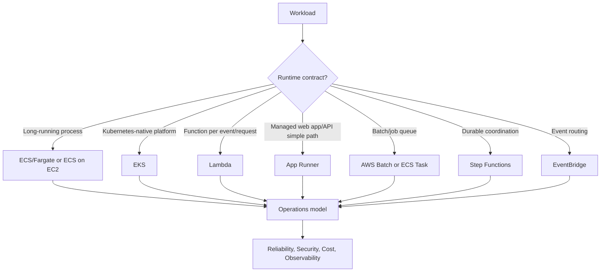

---

## 1. Core Mental Model: Compute Is a Contract, Not a Server

Saat kamu memilih compute platform, kamu sebenarnya sedang menandatangani kontrak dengan runtime.

Kontrak itu menjawab:

1. **Bagaimana unit kerja dijalankan?**
   - Process panjang?
   - Function singkat?
   - Job batch?
   - Workflow state machine?
   - Event router?

2. **Siapa yang menjadwalkan execution?**
   - ECS scheduler?
   - Kubernetes scheduler?
   - Lambda service?
   - Step Functions state engine?
   - AWS Batch scheduler?
   - App Runner managed service?

3. **Siapa yang mengelola capacity?**
   - Kamu via EC2/node group?
   - AWS via Fargate/Lambda/App Runner?
   - Hybrid via Karpenter/Cluster Autoscaler?

4. **Apa failure semantics-nya?**
   - Process restart?
   - Function retry?
   - Queue redelivery?
   - Workflow catch/retry?
   - Deployment rollback?
   - Pod reschedule?

5. **Apa scaling signal-nya?**
   - CPU?
   - Memory?
   - Request count?
   - Queue depth?
   - Stream shard?
   - Schedule?
   - Workflow fanout?

6. **Apa batas state-nya?**
   - Stateless request handler?
   - Stateful long-running worker?
   - Durable state machine?
   - In-memory cache?
   - Disk-backed process?
   - External database?

7. **Apa observability boundary-nya?**
   - Process log?
   - Container metric?
   - Pod event?
   - Lambda invocation metric?
   - State transition history?
   - Event bus archive/replay?

Di sistem nyata, kesalahan terbesar biasanya bukan karena salah konfigurasi kecil. Kesalahan terbesar adalah **salah memilih kontrak runtime**.

Contoh:

- Memakai Lambda untuk proses yang butuh koneksi panjang, shutdown terkontrol, dan waktu proses tidak pasti.
- Memakai EKS untuk satu tim kecil yang hanya butuh web API biasa, sehingga platform overhead lebih besar daripada manfaatnya.
- Memakai ECS/Fargate untuk alur bisnis multi-step yang butuh audit dan compensation, padahal Step Functions lebih cocok sebagai durable coordinator.
- Memakai App Runner untuk workload yang butuh kontrol network/service mesh/sidecar kompleks.
- Memakai Kubernetes untuk semua hal karena “standard”, padahal banyak workload cukup dengan ECS atau Lambda.

---

## 2. First Principle: Workload Has Shape

Sebelum memilih layanan, gambar bentuk workload-nya.

Sebuah workload minimal punya delapan dimensi:

| Dimensi | Pertanyaan | Contoh Jawaban |
|---|---|---|
| Trigger | Apa yang memulai kerja? | HTTP, queue, event, schedule, file upload, stream, manual operator |
| Duration | Berapa lama satu unit kerja? | 50 ms, 5 detik, 10 menit, 3 jam, indefinite |
| Concurrency | Berapa banyak kerja paralel? | Fixed pool, burst ribuan, shard-based, per tenant |
| State | Di mana state hidup? | Memory, disk, DB, S3, queue, workflow history |
| Latency | Seberapa sensitif response time? | Interactive, near-real-time, eventual, batch |
| Shutdown | Apakah butuh graceful termination? | Drain request, checkpoint, rollback, cancel job |
| Retry | Apa yang aman diulang? | Idempotent, non-idempotent, compensated, manual review |
| Ownership | Siapa operate platform? | App team, platform team, AWS-managed, hybrid |

Jika bentuk workload belum jelas, keputusan layanan akan spekulatif.

### 2.1 Runtime Shape

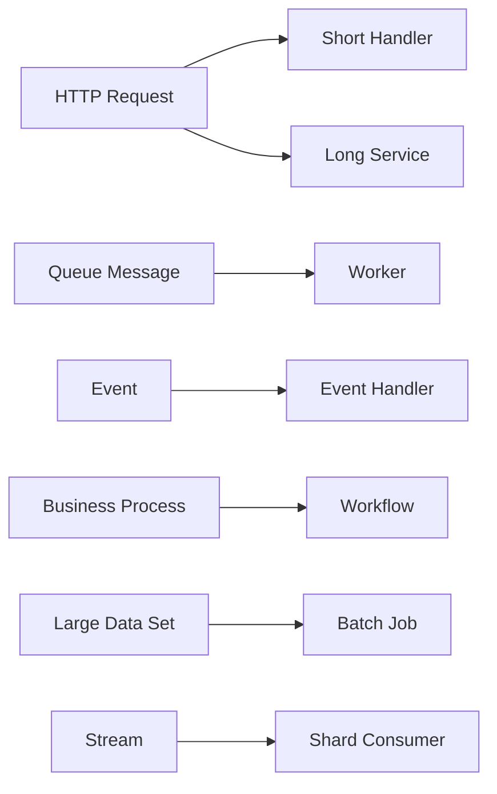

- **Short handler** cocok untuk Lambda atau container API ringan.
- **Long service** cocok untuk ECS/EKS/App Runner.
- **Worker** cocok untuk ECS task, EKS deployment/job, Lambda-SQS, atau Batch tergantung durasi dan kontrol.
- **Workflow** cocok untuk Step Functions, bukan hanya kode procedural panjang.
- **Batch job** cocok untuk AWS Batch, ECS task, Step Functions + ECS, atau EKS Job.
- **Stream consumer** cocok untuk Lambda event source mapping, Kinesis Client Library di container, Flink/MSK stack, atau EKS operator tergantung throughput dan semantics.

### 2.2 Operational Shape

Dua workload dengan kode bisnis sama bisa punya platform yang berbeda karena operational shape berbeda.

Misal “generate report”:

| Kondisi | Placement yang Masuk Akal |
|---|---|
| Report kecil, event-driven, selesai < 15 menit | Lambda |
| Report butuh JVM besar, library berat, CPU stabil 30 menit | ECS/Fargate task |
| Report ribuan tenant, queue-based, retry per job | ECS worker atau AWS Batch |
| Report punya 12 step, beberapa parallel, butuh audit dan compensation | Step Functions + Lambda/ECS |
| Report butuh custom scheduler Kubernetes dan shared platform internal | EKS Job |

Nama fitur sama: “report”. Bentuk workload berbeda. Compute placement berbeda.

---

## 3. AWS Compute Primitives: What They Really Are

Kita perlu bedakan **compute runtime**, **scheduler**, **orchestrator**, dan **event router**.

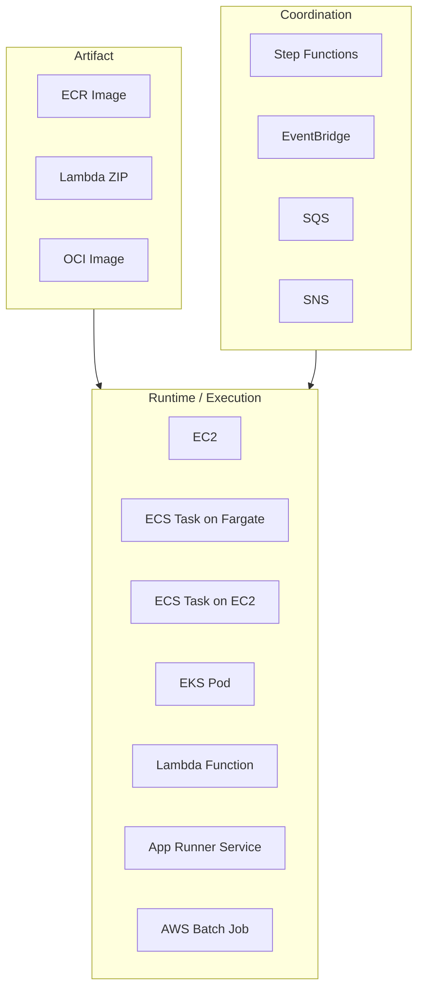

### 3.1 EC2

EC2 adalah primitive paling rendah di daftar ini. Kamu mengelola VM, patching, AMI, capacity, process supervisor, autoscaling, networking, dan runtime.

Gunakan EC2 langsung ketika:

- butuh kontrol OS/kernel/driver tinggi;
- workload tidak cocok dikemas sebagai container/function;
- butuh daemon host-level khusus;
- ada lisensi/performance constraint yang sangat spesifik.

Untuk seri ini, EC2 lebih sering muncul sebagai **capacity substrate** untuk ECS on EC2 atau EKS nodes, bukan fokus utama.

### 3.2 ECS

Amazon ECS adalah orchestrator container AWS-native. Unit dasarnya adalah **task**. Task didefinisikan oleh **task definition**: image, CPU/memory, port, env, secrets, role, logging, health check, dan runtime options.

ECS cocok ketika:

- kamu ingin container orchestration tanpa kompleksitas Kubernetes penuh;
- workload long-running atau worker process;
- integrasi AWS-native lebih penting daripada Kubernetes portability;
- tim ingin deployment, autoscaling, service discovery, IAM task role, dan ALB integration yang relatif langsung.

ECS bukan “Kubernetes versi ringan”. ECS adalah model berbeda: lebih sedikit surface area, lebih AWS-native, lebih sederhana, tetapi juga lebih terbatas untuk pola platform yang sangat extensible.

### 3.3 Fargate

Fargate adalah serverless compute engine untuk container. Dengan Fargate, kamu menjalankan container tanpa mengelola EC2 host atau cluster capacity VM.

Fargate cocok ketika:

- kamu ingin container tetapi tidak ingin mengelola node;
- workload punya sizing CPU/memory yang cukup jelas;
- startup latency masih acceptable;
- tidak butuh daemon host-level, custom kernel, privileged container, atau bin packing manual;
- operational simplicity lebih penting daripada optimasi kapasitas ekstrem.

Fargate menghilangkan banyak pekerjaan node operations, tetapi tidak menghilangkan desain:

- kamu tetap harus mendesain networking;
- kamu tetap harus mengatur IAM role;
- kamu tetap harus menentukan CPU/memory;
- kamu tetap harus mengelola image, logs, metrics, deployment, health check, dan cost.

Serverless tidak berarti “tanpa operasi”. Serverless berarti **sebagian lapisan operasi dipindahkan ke provider**.

### 3.4 EKS

EKS adalah managed Kubernetes di AWS. AWS mengelola control plane Kubernetes; kamu tetap mendesain data plane, networking, add-ons, workload identity, ingress, scaling, policy, observability, dan upgrade path.

EKS cocok ketika:

- organisasi butuh platform Kubernetes bersama;
- banyak tim ingin standard deployment API yang sama;
- workload butuh Kubernetes ecosystem: operators, CRD, service mesh, GitOps, admission policy;
- ada portability concern;
- ada platform engineering team yang sanggup mengoperasikan day-2 complexity.

EKS tidak otomatis lebih “advanced”. EKS hanya lebih tepat bila kebutuhan platform-nya memang membutuhkan Kubernetes.

### 3.5 Lambda

Lambda adalah function runtime yang event-driven. Kamu tidak mengelola server atau container host. Kamu mengirim kode atau container image, lalu Lambda menjalankan handler ketika ada invocation.

Lambda cocok ketika:

- unit kerja pendek;
- event-driven;
- scaling burst tinggi;
- stateless atau state eksternal;
- idempotency dapat dirancang;
- durasi sesuai batas runtime Lambda;
- cold start dapat diterima atau dimitigasi.

Lambda kurang cocok ketika:

- butuh process yang hidup terus;
- butuh koneksi panjang dengan lifecycle rumit;
- job bisa berjalan melebihi batas timeout;
- butuh kontrol runtime OS tinggi;
- side effect tidak idempotent dan sulit dikompensasi;
- latency cold start tidak acceptable.

### 3.6 App Runner

App Runner adalah jalur managed untuk menjalankan web app/API dari source code atau container image. Ia menyederhanakan build/deploy/service exposure/autoscaling untuk kasus web service yang relatif standar.

App Runner cocok ketika:

- tim ingin deploy web service cepat;
- service tidak butuh kontrol orkestrasi mendalam;
- tidak butuh Kubernetes ecosystem;
- tidak butuh konfigurasi ECS/EKS yang kompleks;
- traffic pattern cukup standar.

App Runner kurang cocok ketika:

- perlu sidecar kompleks;
- perlu mesh/custom networking detail;
- perlu advanced deployment topology;
- perlu worker fleet yang sangat khusus;
- perlu platform policy granular seperti Kubernetes.

### 3.7 AWS Batch

AWS Batch adalah managed batch scheduler untuk job berbasis container. Fokusnya bukan long-running service, melainkan job queue, compute environment, retry, priority, array job, dan pemrosesan batch.

Batch cocok ketika:

- workload berupa job terpisah;
- ada antrean job;
- butuh retry policy per job;
- butuh compute environment dinamis;
- durasi job bisa panjang;
- throughput batch lebih penting daripada interactive latency.

### 3.8 Step Functions

Step Functions bukan compute runtime utama. Step Functions adalah durable workflow orchestrator.

Ia cocok ketika:

- bisnis proses punya beberapa step;
- butuh audit trail state transition;
- butuh retry/catch/compensation eksplisit;
- butuh human approval atau callback;
- butuh koordinasi Lambda, ECS, Batch, API, dan service AWS lain;
- butuh memecah workflow panjang menjadi state durable.

Kesalahan umum: menulis orchestration panjang di dalam satu Lambda atau satu worker container. Itu membuat retry, visibility, dan compensation menjadi kode ad-hoc. Step Functions memindahkan state orchestration ke platform yang memang didesain untuk itu.

### 3.9 EventBridge

EventBridge bukan compute. EventBridge adalah event router.

Ia cocok untuk:

- routing event berdasarkan pattern;
- decoupling producer dan consumer;
- cross-account event integration;
- event archive/replay;
- schedule-triggered automation;
- menghubungkan SaaS/AWS/custom event.

EventBridge tidak menggantikan queue. Queue punya semantics buffering dan backpressure yang berbeda. Event bus membantu routing, bukan selalu menyerap backlog besar seperti queue.

---

## 4. Compute Placement as a Multi-Axis Decision

Jangan pilih layanan dengan satu dimensi.

Salah:

> “Lambda murah, pakai Lambda.”

Lebih benar:

> “Workload ini event-driven, durasinya < 2 detik p95, stateless, traffic bursty, idempotency bisa dijamin, downstream punya throttling guardrail, cold start acceptable, dan team tidak perlu long-running process. Lambda cocok.”

Salah:

> “EKS lebih powerful, pakai EKS.”

Lebih benar:

> “Organisasi punya multi-team platform, butuh policy admission, GitOps, mesh, shared ingress, operator ecosystem, dan platform team punya ownership day-2. EKS cocok.”

### 4.1 Decision Axes

| Axis | Pertanyaan Kritis | Implikasi Placement |
|---|---|---|
| Runtime duration | Apakah kerja singkat, panjang, atau indefinite? | Lambda untuk pendek; container/job untuk panjang; service untuk indefinite |
| Startup sensitivity | Apakah cold start mengganggu? | Provisioned concurrency, warm service, or container service |
| Control need | Butuh kontrol OS/scheduler/network? | EKS/ECS on EC2/EC2 lebih cocok |
| Operational maturity | Ada platform team? | EKS butuh maturity lebih tinggi |
| Event semantics | Butuh retry, DLQ, replay, fanout? | Lambda/EventBridge/SQS/Step Functions |
| Statefulness | State external atau local? | External state memudahkan serverless/container elasticity |
| Scaling signal | Scaling berdasarkan request, CPU, queue, shard? | Pilih compute yang natural terhadap signal tersebut |
| Cost shape | Idle vs per invocation vs per task runtime | Lambda murah untuk burst; ECS/EC2 lebih baik untuk steady load |
| Compliance | Butuh audit workflow, isolation, approval? | Step Functions/EKS policy/ECS separation |
| Deployment complexity | Butuh canary/blue-green/rollback? | ECS/EKS/Lambda punya mekanisme berbeda |

---

## 5. Service Selection Matrix

Matrix ini bukan hukum absolut. Ini baseline untuk berpikir.

| Workload | Default Candidate | Alternatif | Warning |
|---|---|---|---|
| Simple HTTP API, low ops overhead | App Runner / ECS Fargate | Lambda + API Gateway | App Runner kurang cocok untuk kontrol kompleks |
| Production Java API dengan steady traffic | ECS Fargate | EKS, App Runner | Lambda Java bisa cocok, tapi cold start/runtime contract harus dihitung |
| Multi-team internal platform | EKS | ECS + platform templates | Jangan pakai EKS tanpa platform ownership |
| Queue worker pendek dan bursty | Lambda + SQS | ECS worker | Wajib idempotent dan kontrol concurrency |
| Queue worker panjang/CPU-heavy | ECS/Fargate worker | AWS Batch, EKS Job | Pastikan visibility timeout, retry, checkpoint |
| Batch processing besar | AWS Batch | ECS task, EKS Job, Step Functions | Jangan pakai Lambda kalau durasi/IO tidak sesuai |
| Workflow multi-step auditable | Step Functions | Temporal/self-managed, custom orchestrator | Jangan sembunyikan state workflow di satu function |
| Event routing antar domain | EventBridge | SNS/SQS | EventBridge bukan pengganti semua queue |
| Stream processing ringan | Lambda event source mapping | ECS/EKS consumer | Perhatikan shard concurrency dan duplicate processing |
| Highly customized networking/platform | EKS/ECS on EC2 | ECS Fargate | Fargate membatasi host-level customization |

---

## 6. The Ownership Boundary

Top 1% engineer tidak hanya bertanya “apakah bisa jalan?” tetapi “siapa yang owning failure?”

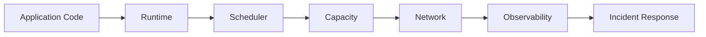

Pada setiap compute pilihan, ownership boundary berubah.

### 6.1 Lambda Ownership

AWS mengelola:

- server provisioning;
- execution environment scheduling;
- runtime sandbox orchestration;
- horizontal scaling mechanism;
- base invocation lifecycle.

Kamu tetap owning:

- handler correctness;
- timeout budget;
- idempotency;
- retry side effects;
- concurrency guardrail;
- downstream overload;
- package/image size;
- observability;
- security role;
- cost from invocation, duration, logs, and retries.

### 6.2 ECS/Fargate Ownership

AWS mengelola lebih banyak capacity layer bila memakai Fargate.

Kamu tetap owning:

- image build quality;
- task definition;
- CPU/memory sizing;
- deployment strategy;
- health checks;
- autoscaling signal;
- network path;
- secrets/config;
- logs/traces;
- task role;
- failure runbook.

### 6.3 EKS Ownership

AWS mengelola control plane availability dan API server layer tertentu. Namun platform ownership tetap besar:

- node provisioning;
- cluster add-ons;
- CNI behavior;
- ingress controller;
- IAM integration;
- RBAC;
- policies;
- upgrades;
- observability;
- multi-tenancy;
- pod security;
- autoscaling;
- incident handling.

EKS tidak mengurangi pekerjaan. EKS mengubah jenis pekerjaan dari “app deployment” menjadi “platform engineering”.

---

## 7. Duration and Lifecycle

Runtime duration adalah axis paling sering diremehkan.

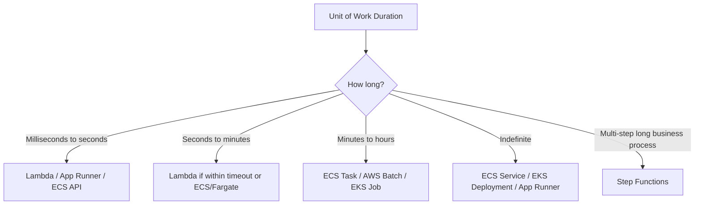

### 7.1 Short Work

Short work is easy to scale but hard to observe if events are duplicated.

Cocok untuk Lambda ketika:

- logic jelas;
- side effects idempotent;
- time budget pendek;
- state eksternal;
- retry dapat diterima.

### 7.2 Long Work

Long work butuh:

- heartbeat;
- checkpoint;
- cancellation;
- graceful shutdown;
- retry dari titik aman;
- progress visibility.

Cocok untuk ECS task, EKS Job, AWS Batch, atau Step Functions yang memecah pekerjaan menjadi step.

### 7.3 Indefinite Work

Long-running service butuh:

- health check;
- readiness;
- rolling deployment;
- graceful draining;
- memory leak monitoring;
- connection management;
- autoscaling;
- dependency failure strategy.

Cocok untuk ECS Service, EKS Deployment, App Runner, atau EC2-based service.

---

## 8. Scaling Signal: Do Not Scale on the Wrong Metric

Scaling bukan sekadar “naik turun instance”. Scaling adalah feedback loop.

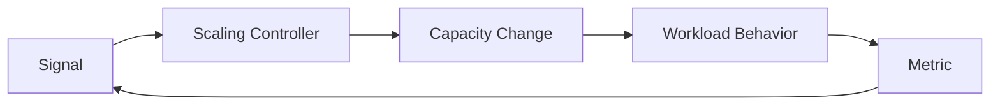

Jika signal salah, scaling akan salah.

### 8.1 CPU-Based Scaling

Cocok jika CPU berkorelasi dengan load.

Tidak cocok jika bottleneck ada di:

- database connection pool;
- external API rate limit;
- lock contention;
- queue backlog;
- thread starvation;
- memory pressure;
- downstream latency.

### 8.2 Request-Based Scaling

Cocok untuk HTTP service bila request rate berkorelasi dengan workload. Namun request count saja tidak cukup jika request complexity sangat bervariasi.

Contoh:

- `GET /health` murah.
- `POST /generate-report` mahal.
- `GET /case/{id}/timeline` mungkin query-heavy.

Scaling berdasarkan request count bisa misleading jika endpoint cost tidak homogen.

### 8.3 Queue-Depth Scaling

Cocok untuk worker.

Lebih baik memakai metrik seperti:

- backlog per worker;
- age of oldest message;
- expected processing time;
- downstream capacity;
- retry/DLQ growth.

Rule sederhana:

```txt
required_workers ≈ backlog_size * avg_processing_time / target_drain_time
```

Tapi rumus ini harus dibatasi oleh downstream capacity. Kalau database hanya sanggup 200 write/sec, menambah worker sampai 1.000 hanya mengubah backlog queue menjadi backlog database.

### 8.4 Stream Scaling

Stream scaling sering dibatasi shard/partition.

Untuk Kinesis/DynamoDB Streams/Kafka/MSK, concurrency sering mengikuti:

- jumlah shard/partition;
- batch size;
- ordering requirement;
- checkpoint behavior;
- consumer group model;
- retry pada record gagal.

### 8.5 Workflow Scaling

Step Functions scaling bukan hanya jumlah execution. Yang penting:

- state transition rate;
- service integration limit;
- concurrency downstream;
- retry burst;
- fanout state;
- execution duration;
- payload size.

---

## 9. Latency Model

Latency bukan hanya runtime speed. Latency adalah jalur lengkap.

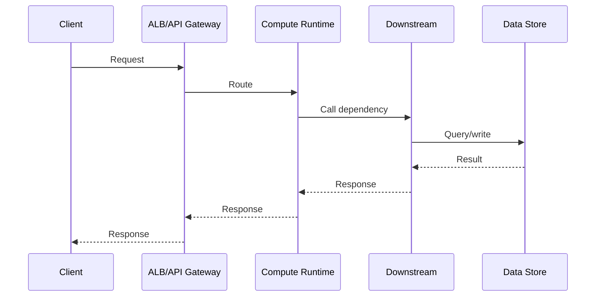

Compute placement memengaruhi latency lewat:

- cold start;
- image pull;
- task startup;
- pod scheduling;
- ENI allocation;
- network hops;
- NAT path;
- TLS handshake;
- dependency connection reuse;
- autoscaling lag;
- load balancer health delay;
- retry/backoff;
- queue wait time.

### 9.1 Cold Start vs Warm Capacity

Lambda cold start bukan selalu masalah. Container service warm capacity bukan selalu lebih baik.

Pertanyaannya:

- p50/p95/p99 latency target berapa?
- traffic burst datang dari nol atau steady?
- runtime Java berat atau lightweight?
- ada provisioned concurrency budget?
- request bisa async?
- user-facing atau background?

Jika request interactive dan p99 ketat, cold start harus dimitigasi atau pilih warm service.

Jika workload async, cold start mungkin tidak penting dibanding throughput dan cost.

### 9.2 Startup Latency in Containers

Container juga punya cold path:

- image pull;
- container create;
- application boot;
- dependency warmup;
- JIT warmup;
- readiness check;
- load balancer target registration.

ECS/Fargate atau EKS tidak otomatis bebas cold start. Mereka hanya punya bentuk cold start yang berbeda.

---

## 10. State Model

Compute elastis butuh state yang jelas.

State bisa hidup di:

| State Location | Contoh | Risiko |
|---|---|---|
| Memory | cache, session, in-flight map | hilang saat restart, tidak shared |
| Local disk | temp file, checkpoint lokal | hilang saat task/pod/function mati kecuali volume durable |
| Database | transaction state, domain state | bottleneck, locking, schema coupling |
| Queue | pending work | duplicate, poison message, visibility timeout |
| Object storage | large artifact | eventual coordination, partial write |
| Workflow engine | execution state | payload limit, transition cost, orchestration coupling |

Serverless/container architecture yang sehat biasanya punya prinsip:

> Compute boleh ephemeral. State harus eksplisit, eksternal, dan recoverable.

### 10.1 In-Memory State Trap

In-memory state terlihat cepat, tetapi membuat scaling dan recovery sulit.

Contoh buruk:

```java
static Map<String, ApprovalContext> pendingApprovals = new ConcurrentHashMap<>();
```

Masalah:

- hilang saat restart;
- tidak terlihat instance lain;
- tidak recoverable;
- tidak auditable;
- tidak cocok untuk horizontal scaling.

Lebih baik:

- simpan pending state di database/workflow;
- gunakan cache hanya sebagai optimization;
- jadikan cache rebuildable;
- jangan jadikan memory sebagai source of truth.

### 10.2 Workflow State

Jika state adalah progress proses bisnis, Step Functions sering lebih cocok daripada field status yang tersebar di banyak service.

Misalnya enforcement case lifecycle:

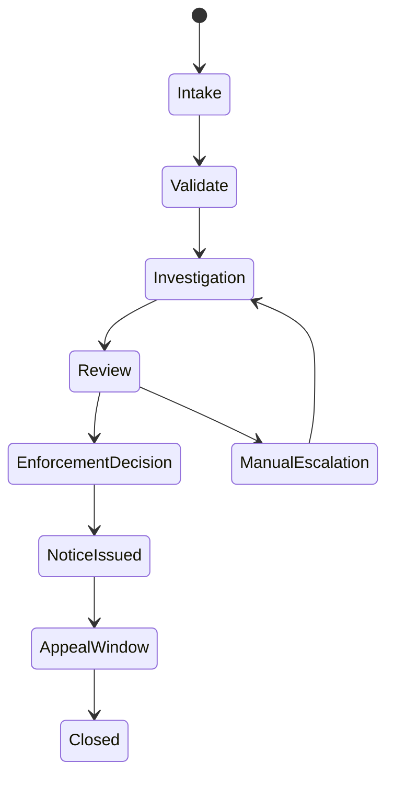

Jika setiap transition punya retry, timeout, approval, compensation, dan audit requirement, jangan sembunyikan semua ini dalam satu worker loop.

---

## 11. Failure Semantics

Compute placement menentukan bentuk failure.

| Platform | Failure Umum | Recovery Pattern |
|---|---|---|
| Lambda | timeout, throttling, cold start, duplicate event | retry, DLQ, reserved concurrency, idempotency |
| ECS/Fargate | unhealthy task, OOM, image pull failure, stuck deployment | health check, restart, circuit breaker, rollback |
| EKS | pending pod, node pressure, CNI exhaustion, webhook failure | reschedule, autoscale, PDB, runbook, admission control |
| App Runner | build/deploy failure, instance scaling lag, service health issue | managed rollback/redeploy, simplified service ops |
| AWS Batch | failed job, capacity unavailable, retry exhaustion | job retry, queue priority, compute environment tuning |
| Step Functions | failed state, timeout, unhandled error, payload problem | retry/catch, compensation, manual recovery |
| EventBridge | unmatched event, target failure, throttling | DLQ, archive/replay, rule testing, schema governance |

### 11.1 Retry Is Not Recovery

Retry hanya aman jika:

- operasi idempotent;
- downstream bisa menerima retry;
- ada backoff/jitter;
- ada retry budget;
- ada DLQ atau terminal failure state;
- duplicate side effects dicegah.

Retry tanpa idempotency adalah multiplier kerusakan.

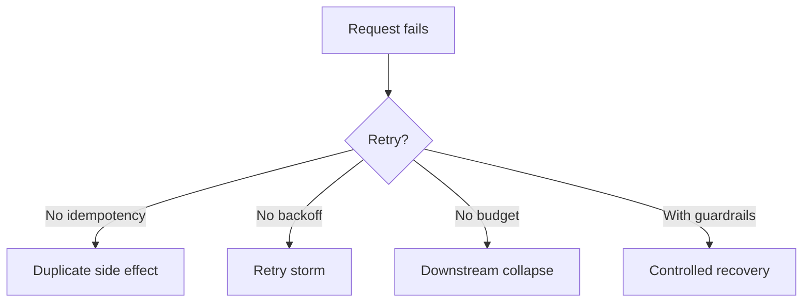

### 11.2 Deployment Failure Is Runtime Failure

Deployment bukan fase terpisah dari runtime. Deployment adalah salah satu sumber failure paling besar.

Pertanyaan production:

- Apakah health check benar-benar merepresentasikan readiness?
- Apakah deployment bisa rollback otomatis?
- Apakah migration database backward-compatible?
- Apakah task baru bisa start sebelum task lama drain?
- Apakah traffic shifting punya alarm?
- Apakah log/traces cukup untuk membedakan bug app vs config vs capacity?

ECS, EKS, Lambda, dan App Runner punya deployment semantics berbeda. Jangan copy-paste strategi rollout antar platform tanpa memahami boundary-nya.

---

## 12. Cost Surface

Biaya bukan hanya harga compute.

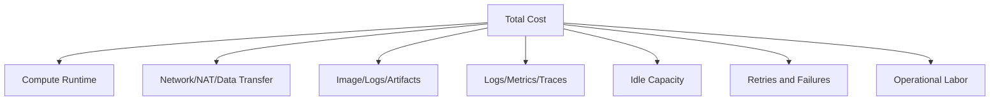

### 12.1 Lambda Cost Shape

Lambda cenderung bagus untuk:

- bursty workload;
- low idle traffic;
- event-driven units;
- scale-to-zero.

Namun biaya bisa naik karena:

- durasi panjang;
- memory besar;
- high invocation volume;
- provisioned concurrency;
- retry storm;
- log volume;
- NAT path saat dalam VPC;
- downstream inefficiency.

### 12.2 Fargate Cost Shape

Fargate cenderung bagus untuk:

- container tanpa node management;
- moderate steady workload;
- predictable CPU/memory sizing;
- team yang menghargai ops simplicity.

Namun biaya bisa naik karena:

- task idle;
- overprovisioned CPU/memory;
- banyak service kecil dengan minimum capacity;
- NAT gateway traffic;
- image pull/logging;
- always-on worker yang sebenarnya bisa event-driven.

### 12.3 EKS Cost Shape

EKS cenderung bagus jika:

- banyak workload berbagi cluster;
- node packing efisien;
- platform overhead dibagi banyak tim;
- Kubernetes capability benar-benar dipakai.

Namun biaya bisa naik karena:

- underutilized nodes;
- over-requested pods;
- add-on overhead;
- platform team labor;
- observability cardinality;
- service mesh overhead;
- upgrade burden.

### 12.4 App Runner Cost Shape

App Runner menyederhanakan operational burden, tetapi kamu membayar untuk managed abstraction dan instance/runtime yang aktif sesuai konfigurasi. Cocok jika kesederhanaan dan time-to-market lebih bernilai daripada tuning detail.

---

## 13. Security Boundary

Compute placement mengubah security model.

| Platform | Identity Unit | Common Mistake |
|---|---|---|
| Lambda | Function execution role | Satu role terlalu luas untuk banyak function |
| ECS | Task role + execution role | Mencampur permission pull image/log dengan permission bisnis |
| EKS | Pod identity/service account/RBAC | Namespace dianggap security boundary kuat padahal tidak cukup sendiri |
| App Runner | Service role/instance role pattern | Menganggap managed service berarti tidak perlu least privilege |
| Step Functions | State machine role | Role orchestration terlalu luas karena semua integration digabung |

Prinsip:

> Identity harus mengikuti unit blast radius terkecil yang realistis.

Jangan memakai satu role besar untuk semua worker karena “lebih mudah”. Itu menurunkan kualitas forensic, audit, dan containment.

---

## 14. Observability Boundary

Setiap compute platform punya sinyal utama berbeda.

### 14.1 ECS/Fargate

Perhatikan:

- task desired/running count;
- task stop reason;
- deployment events;
- target group health;
- CPU/memory;
- container logs;
- application metrics;
- ALB latency/error;
- queue depth for workers;
- tracing across dependencies.

### 14.2 EKS

Perhatikan:

- pod phase;
- container restart count;
- pending reason;
- node pressure;
- deployment rollout status;
- HPA behavior;
- ingress health;
- CNI/IP pressure;
- DNS latency;
- admission webhook failure;
- service mesh telemetry if used.

### 14.3 Lambda

Perhatikan:

- invocation count;
- duration;
- error;
- throttle;
- concurrent executions;
- iterator age for streams;
- DLQ/destination failures;
- cold start marker;
- downstream latency;
- logs per invocation;
- trace propagation.

### 14.4 Step Functions

Perhatikan:

- execution started/succeeded/failed/timed out;
- failed state;
- retry count;
- state transition volume;
- downstream integration error;
- execution duration;
- redrive/replay behavior.

---

## 15. Decision Tree

Gunakan decision tree ini untuk diskusi awal. Jangan berhenti di sini; validasi dengan requirement nyata.

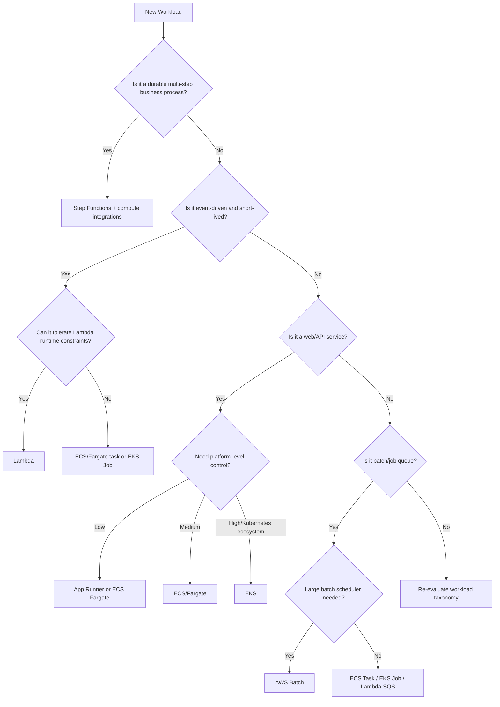

---

## 16. Practical Placement Examples

### 16.1 Public REST API for Case Management

Requirement:

- Java service;
- p95 latency < 200 ms;
- steady traffic during business hours;
- strict audit logging;
- relational DB;
- multi-AZ;
- predictable release process.

Good candidates:

- ECS/Fargate behind ALB;
- EKS if organization already has platform baseline;
- App Runner if service is simple and networking constraints are light.

Less ideal:

- Lambda if cold start, connection pooling, and framework startup create latency variance unless carefully engineered.

### 16.2 Enforcement Lifecycle Workflow

Requirement:

- intake;
- validation;
- investigation;
- supervisor review;
- notice generation;
- appeal window;
- compensation/cancel path;
- audit trail.

Good candidate:

- Step Functions as durable process coordinator;
- Lambda for small steps;
- ECS/Fargate for heavy document generation;
- EventBridge for domain events.

Bad default:

- one giant worker with a `while(status != CLOSED)` loop.

### 16.3 PDF Generation Worker

Requirement:

- takes 2–8 minutes;
- CPU/memory heavy;
- uses browser engine;
- output to object storage;
- triggered from queue;
- must retry safely.

Good candidates:

- ECS/Fargate worker;
- AWS Batch if many queued jobs and scheduling priority matters;
- EKS Job if platform already standardizes on Kubernetes jobs.

Less ideal:

- Lambda if runtime size, duration, memory, and browser dependency are awkward.

### 16.4 Lightweight Event Enrichment

Requirement:

- event arrives from EventBridge;
- enrich with small DB lookup;
- publish new event;
- usually < 500 ms;
- bursty.

Good candidate:

- Lambda;
- strict idempotency and retry handling;
- reserved concurrency to protect DB.

### 16.5 ML Batch Scoring

Requirement:

- thousands of records;
- large model/image;
- GPU maybe;
- job queue;
- priority;
- retry per job.

Good candidates:

- AWS Batch;
- EKS with GPU node pools if Kubernetes platform mature;
- ECS on EC2 if GPU/container without Kubernetes.

---

## 17. Anti-Patterns

### 17.1 “Lambda for Everything”

Lambda is excellent, but not universal.

Warning signs:

- complex in-memory orchestration;
- long-running work;
- non-idempotent side effects;
- framework cold starts ignored;
- database overloaded by burst concurrency;
- retry storm hidden behind async invocation;
- no DLQ or terminal failure path.

### 17.2 “Kubernetes for Everything”

Kubernetes is excellent, but it introduces a platform.

Warning signs:

- one or two services only;
- no platform team;
- no policy/observability/upgrade ownership;
- YAML complexity hides app simplicity;
- developers debug cluster issues more than product issues.

### 17.3 “Fargate Means No Ops”

Fargate removes host ops, not system ops.

You still need:

- sizing;
- health checks;
- deployments;
- logs;
- traces;
- networking;
- IAM;
- retry;
- runbooks;
- cost controls.

### 17.4 “EventBridge as Queue”

EventBridge routes events. It is not always the right backlog buffer.

If consumer must drain large backlog with explicit backpressure, SQS may be the right primitive. EventBridge and SQS often complement each other.

### 17.5 “Step Functions as Code Replacement”

Step Functions should model coordination, not every tiny line of code. Business process state belongs there; local computation details often remain in Lambda/container code.

---

## 18. Engineering Review Checklist

Sebelum memilih compute, jawab pertanyaan ini.

### Workload Shape

- Apa trigger utama workload?
- Berapa durasi p50/p95/p99 unit kerja?
- Apakah workload request/response, async worker, stream consumer, batch, atau workflow?
- Apakah concurrency bursty, steady, atau schedule-based?
- Apakah ada ordering requirement?

### State and Consistency

- Di mana state authoritative hidup?
- Apakah operasi idempotent?
- Apa yang terjadi jika proses mati di tengah?
- Apakah ada checkpoint?
- Apakah duplicate processing aman?

### Failure

- Failure apa yang paling mungkin?
- Failure apa yang paling berbahaya?
- Apakah retry aman?
- Apakah ada DLQ/terminal state?
- Bagaimana manual recovery dilakukan?

### Scaling

- Signal scaling apa yang paling akurat?
- Apa bottleneck downstream?
- Apakah scaling compute bisa merusak dependency?
- Apakah butuh reserved/provisioned capacity?
- Apakah scale-to-zero penting?

### Deployment

- Apakah rollout bisa gradual?
- Apakah rollback otomatis?
- Apakah database migration kompatibel?
- Apakah health check mewakili readiness?
- Apakah version skew aman?

### Security

- Apa identity unit terkecil?
- Apakah permission terlalu luas?
- Apakah network boundary jelas?
- Apakah secret rotation aman?
- Apakah audit trail cukup?

### Cost

- Biaya dominan dari compute, idle, network, logs, traces, retries, atau labor?
- Apakah workload steady atau bursty?
- Apakah overprovisioning lebih mahal dari cold start mitigation?
- Apakah NAT path bisa dihindari dengan VPC endpoint?

---

## 19. A Simple Scoring Model

Gunakan scoring ini untuk memaksa diskusi objektif. Nilai 1–5.

| Criterion | Lambda | ECS/Fargate | EKS | App Runner | AWS Batch | Step Functions |
|---|---:|---:|---:|---:|---:|---:|
| Low ops overhead | 5 | 4 | 2 | 5 | 3 | 5 |
| Runtime control | 2 | 4 | 5 | 2 | 4 | 1 |
| Burst scaling | 5 | 3 | 3 | 3 | 3 | 4 |
| Long-running process | 1 | 5 | 5 | 4 | 4 | 2 |
| Durable workflow | 2 | 1 | 1 | 1 | 2 | 5 |
| Platform extensibility | 1 | 3 | 5 | 1 | 2 | 3 |
| Developer simplicity | 4 | 4 | 2 | 5 | 3 | 3 |
| Fine-grained ops tuning | 2 | 3 | 5 | 1 | 4 | 2 |
| Cost for bursty low traffic | 5 | 2 | 2 | 3 | 2 | 4 |
| Cost for steady high traffic | 3 | 4 | 4 | 3 | 4 | 2 |

Interpretasi:

- Total skor bukan keputusan final.
- Skor membantu membuka trade-off.
- Kriteria tertentu bisa memiliki weight lebih tinggi.
- Misalnya regulated workflow mungkin memberi weight tinggi ke auditability, compensation, dan deterministic process state.

---

## 20. Reference Architecture Patterns

### 20.1 Container API + Async Worker

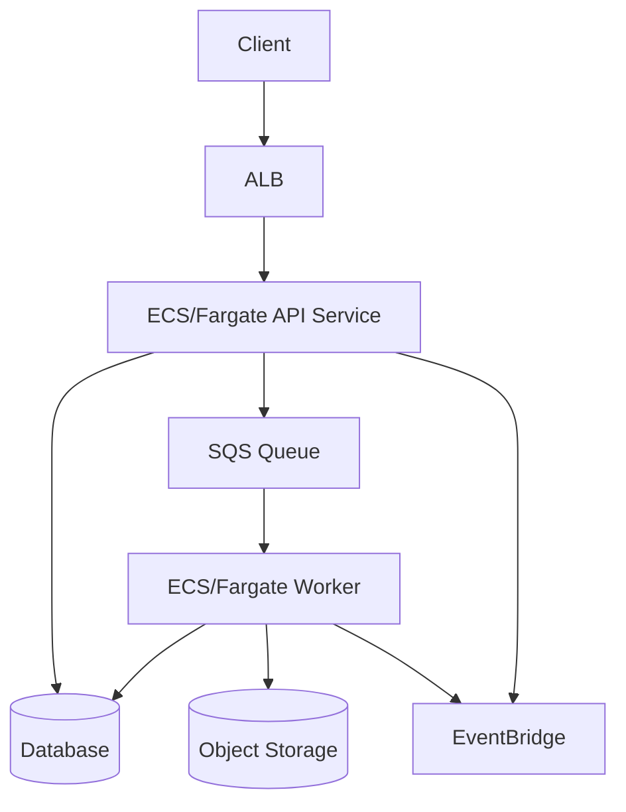

Use when:

- synchronous API and async processing both needed;
- worker duration may be longer than Lambda comfort zone;
- deployment consistency between API/worker matters;
- containerized Java codebase is already standard.

### 20.2 Serverless Event Workflow

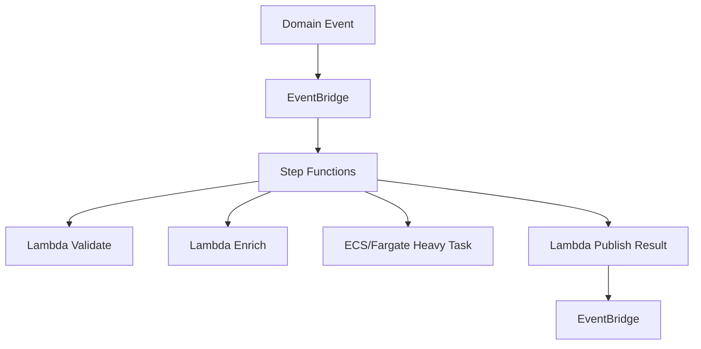

Use when:

- business process has visible states;
- retry/catch/compensation matters;
- some steps are lightweight, some heavy;
- auditability matters.

### 20.3 EKS Platform

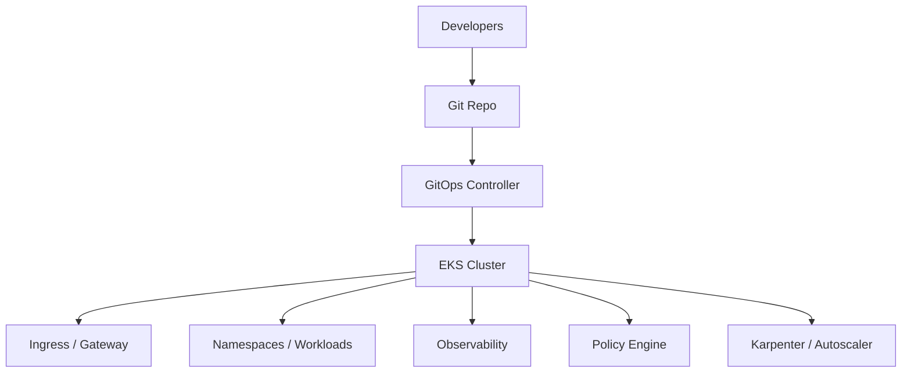

Use when:

- many teams share platform;
- Kubernetes APIs/operators are required;
- platform team owns cluster lifecycle;
- policy, tenancy, and GitOps are core.

---

## 21. How to Think Like a Staff/Principal Engineer

A junior engineer asks:

> “Can this run on Lambda?”

A senior engineer asks:

> “What happens when it retries after partially writing data?”

A staff engineer asks:

> “What is the execution contract, who owns the failure boundary, how does it degrade, and how do we prove recovery?”

A principal-level review frames compute placement around invariants:

1. **Every unit of work has an owner.**
2. **Every side effect has idempotency or compensation.**
3. **Every retry has a budget.**
4. **Every async boundary has observability.**
5. **Every deployment can fail safely.**
6. **Every scale-out path respects downstream capacity.**
7. **Every state transition is recoverable or auditable.**
8. **Every platform abstraction has an explicit ownership boundary.**

---

## 22. Minimal Decision Record Template

Gunakan template ini untuk architecture decision record.

```mdx
# ADR: Compute Placement for <Workload Name>

## Context

What workload are we placing? What business capability does it support?

## Workload Shape

- Trigger:
- Duration p50/p95/p99:
- Traffic pattern:
- State:
- Retry semantics:
- Ordering requirement:
- Latency target:
- Compliance/audit need:

## Options Considered

1. Lambda
2. ECS/Fargate
3. EKS
4. App Runner
5. AWS Batch
6. Step Functions + compute integration

## Decision

Chosen platform:

## Why

- Runtime contract:
- Scaling model:
- Failure model:
- Operational ownership:
- Cost shape:

## Risks

- Risk 1:
- Risk 2:
- Risk 3:

## Guardrails

- Idempotency:
- Timeout:
- Concurrency:
- DLQ/terminal failure:
- Observability:
- Rollback:

## Revisit Trigger

We will revisit if:

- traffic changes by X;
- runtime duration exceeds Y;
- operational incidents exceed Z;
- platform ownership changes;
- compliance requirement changes.
```

---

## 23. Summary

Compute placement is not about memorizing AWS product names. It is about matching workload shape to runtime contract.

The high-value mental model:

```txt
Workload Shape
  -> Runtime Contract
  -> Scaling Signal
  -> Failure Semantics
  -> State Boundary
  -> Ownership Model
  -> Cost Surface
  -> Production Guardrails
```

Use this part as the lens for the rest of the series.

ECS/Fargate, EKS, Lambda, App Runner, Batch, EventBridge, and Step Functions are not competitors in a single flat category. They are building blocks at different layers:

- container orchestration;
- function execution;
- managed web service;
- batch scheduling;
- event routing;
- durable workflow orchestration.

The best systems combine them deliberately.

---

## 24. Official References

- Amazon ECS Developer Guide — https://docs.aws.amazon.com/AmazonECS/latest/developerguide/Welcome.html
- AWS Fargate for Amazon ECS — https://docs.aws.amazon.com/AmazonECS/latest/developerguide/AWS_Fargate.html
- Amazon EKS Documentation — https://docs.aws.amazon.com/eks/
- AWS Lambda Developer Guide — https://docs.aws.amazon.com/lambda/latest/dg/welcome.html
- AWS Lambda timeout configuration — https://docs.aws.amazon.com/lambda/latest/dg/configuration-timeout.html
- AWS Lambda quotas — https://docs.aws.amazon.com/lambda/latest/dg/gettingstarted-limits.html
- AWS Step Functions Developer Guide — https://docs.aws.amazon.com/step-functions/latest/dg/welcome.html
- EventBridge User Guide — https://docs.aws.amazon.com/eventbridge/latest/userguide/eb-what-is.html
- AWS App Runner Developer Guide — https://docs.aws.amazon.com/apprunner/latest/dg/what-is-apprunner.html
- AWS Batch User Guide — https://docs.aws.amazon.com/batch/latest/userguide/what-is-batch.html
