# Part 002 — Workload Taxonomy

> Sebelum memilih ECS, EKS, Fargate, Lambda, App Runner, Batch, EventBridge, atau Step Functions, kamu harus tahu jenis workload yang sedang kamu desain. Taxonomy adalah alat untuk mencegah arsitektur asal pilih.

Part sebelumnya membangun mental model compute placement. Part ini memperjelas bentuk workload.

Banyak kegagalan arsitektur cloud terjadi karena semua logic diperlakukan sebagai “service”. Padahal tidak semua kerja adalah service.

Ada kerja yang berupa request cepat.
Ada kerja yang berupa worker antrean.
Ada kerja yang berupa job besar.
Ada kerja yang berupa workflow bisnis panjang.
Ada kerja yang berupa stream consumer.
Ada kerja yang berupa schedule.
Ada kerja yang berupa platform daemon.
Ada kerja yang harus diisolasi per tenant.

Jika semua dipaksa menjadi REST service, sistem akan penuh endpoint palsu, polling, retry manual, status table yang membengkak, dan operasi yang sulit direcover.

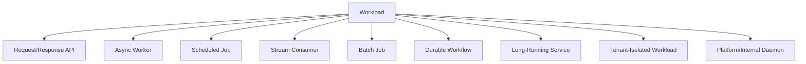

---

## 1. Why Taxonomy Matters

Taxonomy membantu menjawab:

- bagaimana workload dimulai;
- bagaimana workload selesai;
- bagaimana workload gagal;
- bagaimana workload diulang;
- bagaimana workload diskalakan;
- bagaimana workload diamati;
- bagaimana workload di-deploy;
- bagaimana workload diisolasi;
- bagaimana workload dihitung biayanya.

Tanpa taxonomy, design review berubah menjadi preferensi pribadi.

Dengan taxonomy, diskusi menjadi objektif:

```txt
This is not just a service.
This is a request/response API that emits async work, starts a durable workflow, and has one CPU-heavy worker stage.
```

Kalimat itu langsung membuka desain yang lebih tepat:

- API mungkin ECS/Fargate atau Lambda/API Gateway.
- Async work mungkin SQS + Lambda atau ECS worker.
- Durable process mungkin Step Functions.
- Heavy stage mungkin ECS/Fargate task atau AWS Batch.
- Domain event mungkin EventBridge.

---

## 2. Universal Workload Descriptor

Untuk setiap workload, tulis descriptor berikut.

```mdx
## Workload Descriptor

Name:
Business capability:
Primary trigger:
Input shape:
Output shape:
Expected duration:
Latency target:
Concurrency model:
State location:
Retry behavior:
Idempotency strategy:
Failure terminal state:
Scaling signal:
Downstream dependencies:
Security boundary:
Tenant boundary:
Observability signals:
Operational owner:
```

Descriptor ini lebih penting daripada diagram awal. Diagram tanpa descriptor sering indah tetapi ambigu.

---

## 3. Taxonomy Overview

| Workload Type | Primary Trigger | Typical Runtime | Natural AWS Candidates | Main Risk |
|---|---|---:|---|---|
| Request/Response API | HTTP/gRPC | ms–seconds | ECS/Fargate, EKS, App Runner, Lambda/API Gateway | latency, dependency failure, deployment regression |
| Async Worker | Queue/event | seconds–minutes/hours | ECS task/service, Lambda, EKS worker, Batch | duplicate processing, poison message, backlog |
| Scheduled Job | cron/rate/one-time schedule | seconds–hours | EventBridge Scheduler + Lambda/ECS/Step Functions, Batch | overlapping runs, missed schedule, retry ambiguity |
| Stream Consumer | stream shard/partition | continuous | Lambda event source mapping, EKS/ECS consumer | ordering, checkpoint, replay, hot shard |
| Batch Job | job queue/dataset | minutes–hours/days | AWS Batch, ECS task, EKS Job, Step Functions | capacity, retry granularity, partial output |
| Durable Workflow | business/process event | minutes–months | Step Functions + Lambda/ECS/Batch | compensation, audit, state explosion |
| Long-Running Service | deployment desired state | indefinite | ECS Service, EKS Deployment, App Runner | memory leak, deployment, health, capacity |
| Tenant-Isolated Workload | tenant request/event | variable | ECS service/task, EKS namespace/nodepool, Lambda per tenant pattern | noisy neighbor, permission bleed, cost attribution |
| Platform Daemon | node/cluster/service lifecycle | indefinite | EKS DaemonSet, ECS daemon service, EC2 agent | privilege, host coupling, upgrade risk |

---

## 4. Request/Response API

Request/response API adalah workload yang menerima request sinkron dan mengembalikan response ke caller.

Contoh:

- `GET /cases/{id}`
- `POST /enforcement-actions`
- `PATCH /investigations/{id}/assignee`
- `GET /reports/{id}/status`

### 4.1 Runtime Contract

API sinkron punya kontrak:

- caller menunggu response;
- latency budget terbatas;
- error harus dimapping ke contract HTTP/gRPC;
- dependency call harus masuk time budget;
- deployment buruk langsung terlihat oleh user;
- overload harus dikendalikan sebelum merusak downstream.

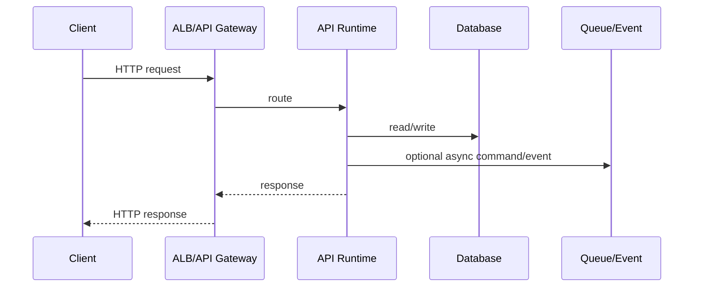

### 4.2 Natural Placement

| Candidate | When It Fits | Watch Out |
|---|---|---|
| ECS/Fargate | Java API, steady traffic, container standard, ALB integration | sizing, startup, health check, deployment rollback |
| EKS | org already has Kubernetes platform, needs ingress/policy/mesh/GitOps | day-2 complexity, platform ownership |
| App Runner | simple web API with low platform customization | less control, service constraints |
| Lambda + API Gateway | bursty/simple API, short handler, low idle | cold start, connection pooling, timeout, payload/latency constraints |

### 4.3 API Design Invariants

A production API workload should have:

- explicit timeout per dependency;
- request correlation ID;
- idempotency key for mutating operation;
- bounded connection pool;
- readiness check that validates critical dependency only when appropriate;
- graceful shutdown/draining;
- safe deploy/rollback;
- structured error model;
- rate limit or overload protection;
- audit logging for sensitive actions.

### 4.4 Common Anti-Patterns

#### Endpoint That Actually Starts a Long Job

Bad:

```txt
POST /generate-report
```

Then the API waits 5 minutes.

Better:

```txt
POST /reports        -> returns reportId
GET  /reports/{id}   -> returns status/result pointer
```

Behind the scenes:

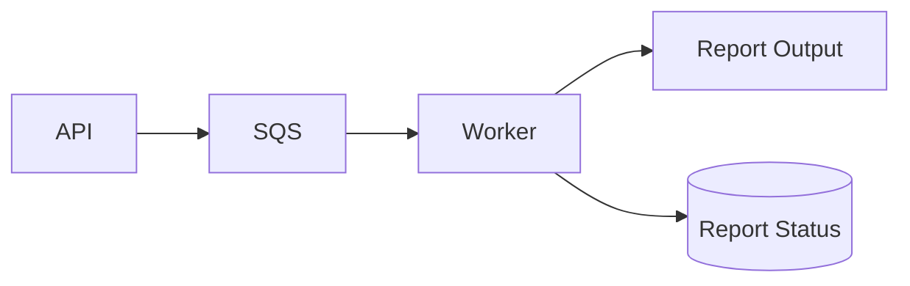

#### API as Orchestrator for Everything

Bad:

```txt
Controller -> validate -> reserve -> generate -> notify -> audit -> call external -> update status
```

If this is a business workflow with retry/compensation, move coordination to Step Functions or a workflow engine.

---

## 5. Async Worker

Async worker memproses work item dari queue, event, atau task source. Caller tidak menunggu langsung.

Contoh:

- process uploaded file;
- generate notice document;
- send notification;
- synchronize external registry;
- recompute case risk score;
- enrich domain event;
- retry external API call.

### 5.1 Runtime Contract

Worker contract:

- input datang dari queue/event;
- message bisa duplicate;
- processing bisa gagal sebagian;
- retry bisa otomatis;
- backlog harus diamati;
- poison message harus dipisahkan;
- downstream harus dilindungi;
- output harus idempotent.

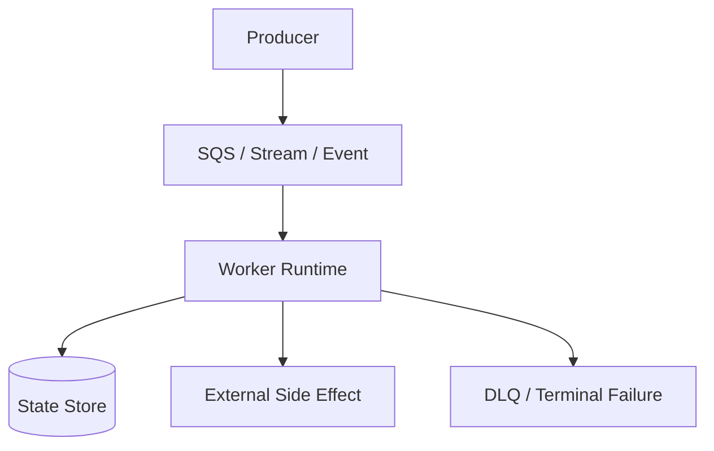

### 5.2 Natural Placement

| Worker Shape | Good Candidate |
|---|---|
| Short, stateless, bursty, event-driven | Lambda |
| Long-running, CPU/memory predictable | ECS/Fargate worker |
| Kubernetes-standardized platform | EKS Deployment/Job |
| Large batch/job queue | AWS Batch |
| Multi-step worker process | Step Functions + Lambda/ECS |

### 5.3 Worker Scaling Signal

For queue worker, scaling by CPU is often wrong. Better signals:

- queue depth;
- age of oldest message;
- backlog per worker;
- processing duration;
- downstream latency;
- DLQ growth;
- retry rate.

```txt
backlog_per_worker = visible_messages / running_workers
```

Useful but incomplete. A worker can drain backlog fast and still destroy the database.

Add downstream guardrail:

```txt
max_workers <= downstream_safe_qps / avg_worker_qps
```

### 5.4 Idempotency Pattern

Worker idempotency usually needs a durable key.

Example idempotency table:

```sql
CREATE TABLE processed_work_item (
    idempotency_key VARCHAR(200) PRIMARY KEY,
    status VARCHAR(30) NOT NULL,
    result_reference TEXT,
    created_at TIMESTAMP NOT NULL,
    updated_at TIMESTAMP NOT NULL
);
```

Processing flow:

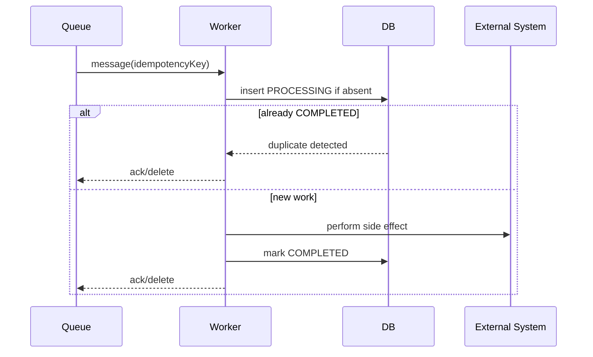

### 5.5 Poison Message Handling

Poison message is a work item that will keep failing no matter how many times it is retried.

Signs:

- same message retried repeatedly;
- retry count near maxReceiveCount;
- worker logs show deterministic validation error;
- queue age increases while processing rate appears nonzero;
- DLQ starts growing.

Policy:

- transient failures retry with backoff;
- deterministic business validation should go to terminal state, not infinite retry;
- unknown failures go to DLQ after bounded attempts;
- DLQ must have owner and redrive procedure.

---

## 6. Scheduled Job

Scheduled job berjalan berdasarkan waktu, bukan request/event langsung.

Contoh:

- nightly reconciliation;
- daily report generation;
- regulatory deadline reminder;
- cleanup expired sessions;
- monthly billing close;
- SLA breach scanner;
- retry pending external sync.

### 6.1 Runtime Contract

Scheduled workload harus menjawab:

- apakah schedule fixed, flexible, atau one-time;
- apakah job boleh overlap;
- apa yang terjadi jika run sebelumnya belum selesai;
- apakah missed run harus dikejar;
- bagaimana retry dilakukan;
- apakah output idempotent;
- apakah ada holiday/business calendar logic;
- apakah timezone eksplisit.

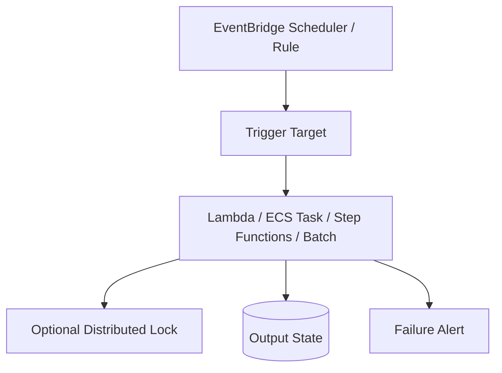

### 6.2 Natural Placement

| Job Type | Candidate |
|---|---|
| Short cleanup task | Lambda scheduled by EventBridge Scheduler |
| Long containerized job | EventBridge Scheduler -> ECS/Fargate task |
| Multi-step scheduled process | EventBridge Scheduler -> Step Functions |
| Large batch run | EventBridge Scheduler -> AWS Batch |
| Kubernetes environment | CronJob in EKS, with caution |

### 6.3 Overlap Control

A scheduled job must explicitly decide overlap behavior.

Options:

1. **Allow overlap**
   - good for independent partitions;
   - dangerous for global mutation.

2. **Skip if previous run active**
   - good for cleanup/reconciliation;
   - requires active-run detection.

3. **Queue next run**
   - good when every run matters;
   - can create backlog.

4. **Cancel previous run**
   - good for refresh-type jobs;
   - requires cancellation semantics.

5. **Shard by time window**
   - good for deterministic reconciliation;
   - each window has idempotent key.

### 6.4 Time Window Design

Bad:

```sql
WHERE created_at > now() - interval '1 day'
```

Better:

```txt
window_start = 2026-07-05T00:00:00+07:00
window_end   = 2026-07-06T00:00:00+07:00
idempotency_key = job_name + window_start + window_end
```

Why:

- replayable;
- auditable;
- timezone explicit;
- no moving target;
- less duplicate risk.

---

## 7. Stream Consumer

Stream consumer memproses data dari append-only stream atau log.

Contoh:

- DynamoDB Streams change processor;
- Kinesis event consumer;
- Kafka/MSK consumer;
- audit event pipeline;
- CDC processor;
- near-real-time projection updater.

### 7.1 Runtime Contract

Stream workload berbeda dari queue biasa:

- ordering bisa penting;
- checkpoint menentukan replay point;
- concurrency sering terikat shard/partition;
- satu record buruk bisa menahan shard;
- replay bisa menghasilkan duplicate side effects;
- lag adalah sinyal kesehatan utama.

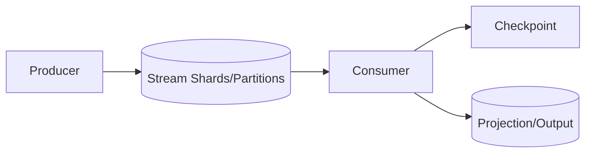

### 7.2 Natural Placement

| Stream Shape | Candidate |
|---|---|
| Simple per-record/batch processing | Lambda event source mapping |
| Complex long-lived consumer | ECS/EKS service |
| Kafka ecosystem/operator | EKS/MSK-based platform |
| Stateful stream processing | Managed Flink or specialized runtime |

### 7.3 Stream Failure Modes

| Failure | Effect | Mitigation |
|---|---|---|
| Poison record | shard blocked | partial batch response, skip/quarantine, DLQ depending source |
| Hot shard | lag grows | partition key design, resharding, consumer scaling |
| Slow downstream | iterator age grows | backpressure, concurrency cap, buffer, downstream scaling |
| Bad deploy | duplicate/replay issue | idempotent writes, canary consumer, rollback |
| Checkpoint too early | data loss risk | checkpoint after durable side effect |
| Checkpoint too late | duplicate processing | idempotency, output dedupe |

### 7.4 Ordering vs Throughput

Ordering limits parallelism. This is not an AWS-specific issue; it is a distributed systems invariant.

If strict ordering is required per aggregate:

- partition by aggregate ID;
- process one partition order at a time;
- keep handler fast;
- avoid slow external calls inside ordered path;
- move slow side effects to separate async step.

---

## 8. Batch Job

Batch job memproses kumpulan data atau work item dalam satu run/job queue.

Contoh:

- annual archive;
- large CSV import;
- scoring 10 million records;
- ETL transform;
- report rebuild;
- document conversion at scale;
- evidence package generation.

### 8.1 Runtime Contract

Batch workload perlu:

- partitioning strategy;
- retry granularity;
- output commit semantics;
- checkpoint;
- job priority;
- compute environment;
- progress tracking;
- cancellation;
- failure summarization.

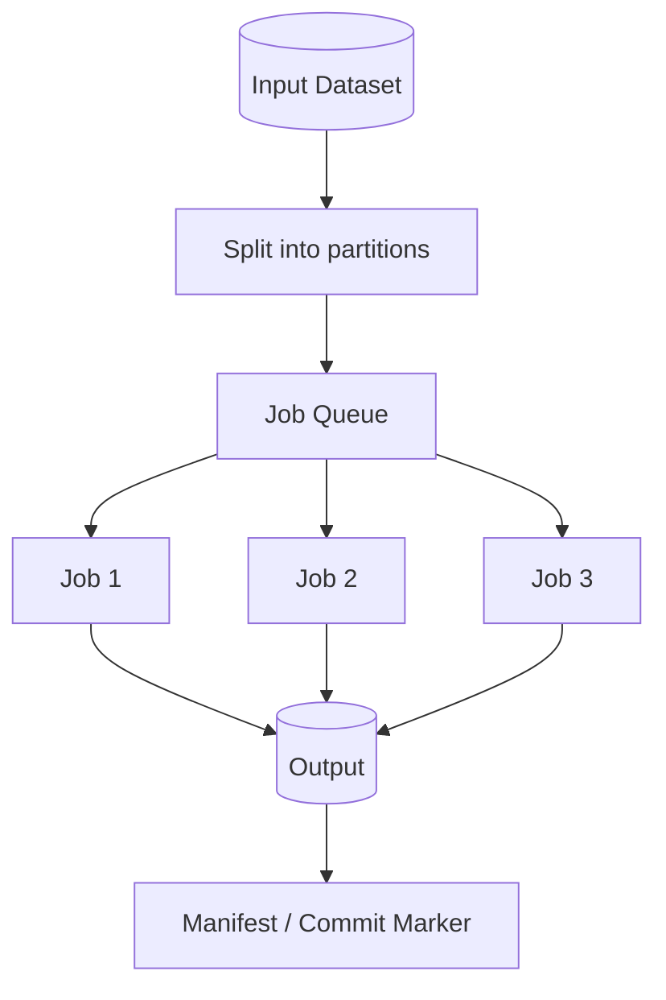

### 8.2 Natural Placement

| Batch Shape | Candidate |
|---|---|
| Few short jobs | ECS scheduled/run task |
| Many queued jobs with priority/retry | AWS Batch |
| Kubernetes-native batch platform | EKS Job/CronJob |
| Multi-step business batch | Step Functions + Batch/ECS/Lambda |
| Lightweight scheduled batch | Lambda if within constraints |

### 8.3 Commit Protocol

Batch failure often creates partial output.

Bad:

```txt
write output files directly to final location as each worker finishes
```

Better:

```txt
write to staging/jobId/partitionId
validate all partitions
write manifest/commit marker
promote or make final view point to manifest
```

This makes failure visible and recoverable.

### 8.4 Retry Granularity

Retrying a whole 6-hour batch because one partition failed is expensive. Partition-level retry is better.

Design:

- split input into deterministic partitions;
- assign idempotency key per partition;
- track status per partition;
- commit output after validation;
- retry only failed partitions;
- summarize final job status.

---

## 9. Durable Workflow

Durable workflow adalah proses bisnis multi-step yang state-nya penting dan berjalan lintas waktu.

Contoh:

- onboarding tenant;
- enforcement case lifecycle;
- complaint investigation process;
- payment settlement;
- document review and approval;
- external agency synchronization;
- appeal process.

### 9.1 Runtime Contract

Workflow punya kontrak berbeda dari API atau worker:

- state transition harus durable;
- retry/catch harus eksplisit;
- step bisa sync atau async;
- compensation bisa dibutuhkan;
- audit trail penting;
- manusia bisa menjadi bagian proses;
- durasi bisa panjang;
- visibility status penting.

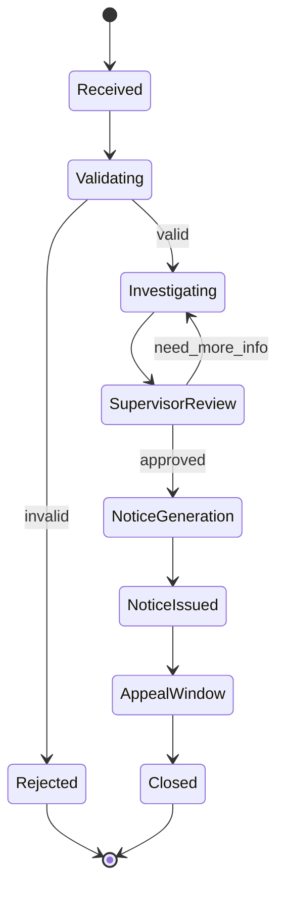

### 9.2 Natural Placement

Step Functions is often a strong fit when:

- state transitions are business meaningful;
- retry/timeout rules differ per step;
- audit and explainability matter;
- step implementation can be Lambda, ECS task, Batch job, or API call;
- process needs compensation.

### 9.3 Workflow vs State Column

A `status` column is not a workflow engine.

A status column tells current state. It does not automatically provide:

- transition validation;
- retry policy;
- timeout handling;
- compensation;
- parallel branches;
- wait state;
- callback token;
- execution history;
- state-level error handling.

For simple lifecycle, a status column is enough. For complex lifecycle, use workflow orchestration or build equivalent machinery deliberately.

### 9.4 Compensation

Distributed systems rarely have true rollback across services. You need compensation.

Example:

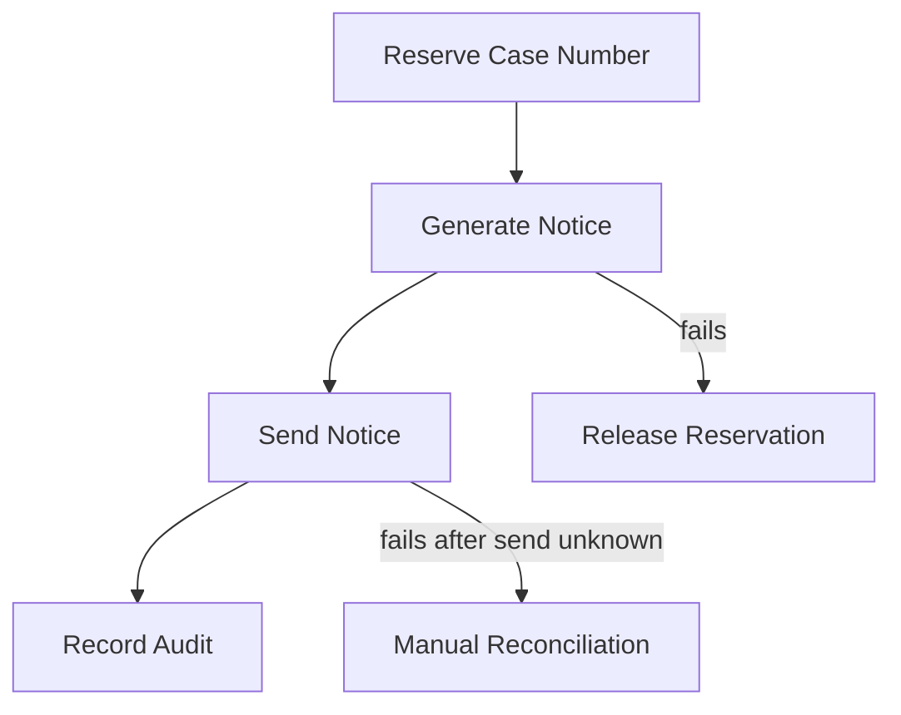

Not every failure can be automated. A mature workflow explicitly models manual reconciliation when uncertainty exists.

---

## 10. Long-Running Service

Long-running service is a process expected to stay alive and serve traffic or continuously poll/process work.

Contoh:

- REST API;
- gRPC service;
- WebSocket service;
- Kafka consumer group;
- scheduler service;
- rule evaluation engine;
- tenant-specific processing daemon.

### 10.1 Runtime Contract

Long-running service needs:

- readiness/liveness health;
- graceful shutdown;
- deploy strategy;
- memory leak monitoring;
- connection lifecycle;
- autoscaling;
- config reload strategy;
- rolling update compatibility;
- resource requests/limits.

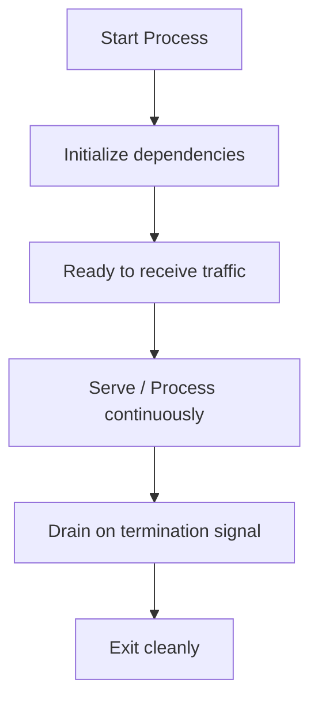

### 10.2 Natural Placement

| Need | Candidate |
|---|---|
| AWS-native container service | ECS/Fargate |
| Kubernetes platform | EKS Deployment |
| Simple web service | App Runner |
| Full host control | ECS on EC2 / EC2 / EKS nodes |

### 10.3 Graceful Shutdown

A service should handle termination signal.

Bad:

```txt
SIGTERM arrives -> process exits immediately -> in-flight request lost
```

Better:

```txt
SIGTERM arrives
  -> stop accepting new work
  -> drain in-flight requests
  -> commit/ack safe messages
  -> close connections
  -> exit before platform kill deadline
```

Graceful shutdown is not optional for workers that perform side effects.

---

## 11. Tenant-Isolated Workload

Tenant-isolated workload is about blast radius and fairness.

Contoh:

- per-tenant document processing;
- per-tenant regulatory case partition;
- premium tenant dedicated capacity;
- isolated execution for sensitive customer;
- noisy tenant protection.

### 11.1 Isolation Dimensions

| Dimension | Examples |
|---|---|
| Compute | separate task/service/function/nodepool |
| Network | separate security group/subnet/VPC pattern |
| Identity | per-tenant role or scoped credentials |
| Data | tenant partition/database/schema/bucket prefix |
| Queue | per-tenant queue or message group |
| Scaling | per-tenant concurrency/capacity limit |
| Observability | tenant-tagged metrics/logs/traces |
| Cost | tenant-level attribution |

### 11.2 Placement Patterns

| Pattern | Good For | Risk |
|---|---|---|
| Shared compute, tenant-aware code | many small tenants | noisy neighbor, permission bugs |
| Per-tenant queue, shared worker fleet | fair async processing | worker complexity |
| Per-tenant Lambda concurrency | burst isolation | function sprawl, config management |
| Per-tenant ECS service | stronger runtime isolation | cost/ops overhead |
| Per-tenant EKS namespace | platform consistency | namespace not enough alone for hard isolation |
| Per-tenant nodepool | stronger performance isolation | cost and capacity fragmentation |

### 11.3 Noisy Neighbor Guardrails

Use:

- per-tenant rate limit;
- queue partitioning;
- reserved concurrency;
- worker pool limits;
- budget alarms;
- tenant labels/tags;
- circuit breakers per tenant;
- fairness scheduling.

---

## 12. Platform/Internal Daemon

Platform daemon is not business workload. It supports the runtime environment.

Contoh:

- log collector;
- metric agent;
- node agent;
- service mesh sidecar/control plane;
- certificate refresher;
- policy controller;
- GitOps controller;
- cluster autoscaler;
- admission webhook.

### 12.1 Runtime Contract

Platform daemon often needs privileged access. That makes it risky.

Questions:

- does it need host access?
- does it run on every node?
- what happens if it fails?
- can it block deployments?
- does it sit in the request path?
- how is it upgraded?
- what is its blast radius?

### 12.2 Natural Placement

| Daemon Type | Candidate |
|---|---|
| Kubernetes node-level agent | EKS DaemonSet |
| ECS cluster daemon on EC2 | ECS daemon service |
| Fargate task side behavior | usually limited; sidecar where supported by task model |
| Control-plane-like app | EKS Deployment / ECS service |

### 12.3 Dangerous Pattern: Critical Webhook Without Failure Policy Review

In Kubernetes/EKS, admission webhooks can block pod creation. If webhook is down and failure policy is strict, deployments can halt.

This is not merely configuration. This is platform availability design.

---

## 13. Composite Workloads

Real systems are composite.

A single feature can contain multiple workload types.

Example: “Submit Enforcement Action”

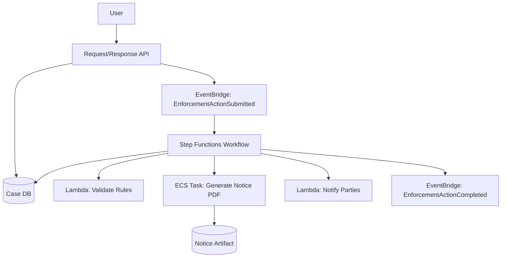

Taxonomy:

| Component | Workload Type | Candidate |
|---|---|---|
| Submit endpoint | Request/Response API | ECS/Fargate or Lambda/API Gateway |
| Domain event | Event routing | EventBridge |
| Business process | Durable workflow | Step Functions |
| Rule validation | Short event/function | Lambda |
| PDF generation | CPU-heavy async job | ECS/Fargate task |
| Artifact storage | State/output | Object storage |
| Notification | Async side effect | Lambda/SQS worker |

This is how mature systems are designed: not by forcing one compute service everywhere, but by aligning each unit with its natural runtime.

---

## 14. Taxonomy Decision Flow

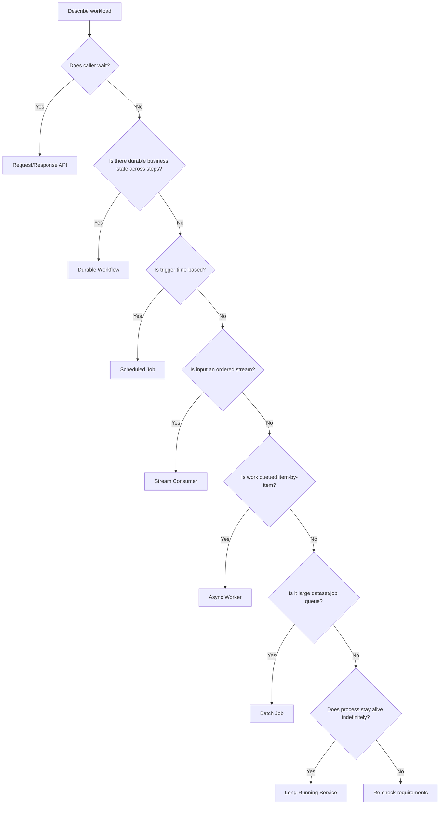

---

## 15. Workload Smells

### 15.1 Request That Should Be Async

Symptoms:

- API timeout increased repeatedly;
- users wait for long-running work;
- retries duplicate expensive work;
- load balancer/API Gateway timeout becomes business constraint;
- frontend polls anyway.

Fix:

- return job ID;
- move heavy work to async worker/workflow;
- expose status endpoint/event notification.

### 15.2 Worker That Should Be Workflow

Symptoms:

- worker has giant switch-case over status;
- retry logic differs per step;
- manual approval added awkwardly;
- compensation hidden in code branches;
- debugging needs reading logs across hours/days.

Fix:

- move orchestration to Step Functions;
- keep step implementations small;
- persist domain state deliberately.

### 15.3 Workflow That Should Be Simple Worker

Symptoms:

- state machine has dozens of tiny computational states;
- transition cost/complexity dominates;
- no business-level visibility gained;
- local code would be clearer.

Fix:

- collapse pure computation into function/container;
- keep workflow for meaningful business transitions.

### 15.4 Batch That Should Be Stream

Symptoms:

- nightly job reprocesses huge dataset;
- business wants near-real-time projection;
- batch window keeps growing;
- failures require rerunning massive job.

Fix:

- process changes incrementally via stream/event;
- keep batch for reconciliation/backfill.

### 15.5 Stream That Should Be Queue

Symptoms:

- ordering not required;
- replay semantics add complexity;
- consumer blocked by poison record;
- team only needs work distribution.

Fix:

- use queue with DLQ and worker scaling.

---

## 16. Mapping Taxonomy to AWS Services

### 16.1 Request/Response API Mapping

| Constraint | Placement Bias |
|---|---|
| simple web app/API, minimal ops | App Runner |
| Java/Spring API, steady traffic | ECS/Fargate |
| multi-team Kubernetes platform | EKS |
| low idle, bursty, small handler | Lambda/API Gateway |
| needs custom host/runtime | ECS on EC2/EKS nodes/EC2 |

### 16.2 Worker Mapping

| Constraint | Placement Bias |
|---|---|
| short event processing | Lambda |
| queue worker with long processing | ECS/Fargate |
| massive queued jobs | AWS Batch |
| Kubernetes-native worker | EKS |
| multi-step side effects | Step Functions + worker steps |

### 16.3 Scheduled Mapping

| Constraint | Placement Bias |
|---|---|
| simple cron | EventBridge Scheduler + Lambda |
| container job | EventBridge Scheduler + ECS task |
| multi-step scheduled workflow | EventBridge Scheduler + Step Functions |
| batch scheduler | EventBridge Scheduler + AWS Batch |
| Kubernetes-only environment | EKS CronJob, carefully |

### 16.4 Stream Mapping

| Constraint | Placement Bias |
|---|---|
| DynamoDB/Kinesis simple processing | Lambda event source mapping |
| Kafka/MSK rich consumer | ECS/EKS long-running consumer |
| strict custom checkpoint control | container consumer |
| stateful processing | specialized stream processing runtime |

### 16.5 Workflow Mapping

| Constraint | Placement Bias |
|---|---|
| business process audit | Step Functions Standard |
| high-volume short orchestration | Step Functions Express where semantics fit |
| long-running human approval | Step Functions Standard + callback/wait pattern |
| heavy step | Step Functions + ECS/Fargate/Batch |
| simple sequential code | Lambda/container without state machine may be enough |

---

## 17. Architecture Review Method

When reviewing a proposed architecture, do not start with “why not Kubernetes?” or “why not serverless?” Start with taxonomy.

### 17.1 Review Questions

1. What is the workload type?
2. Is it actually multiple workload types?
3. What is the trigger?
4. Who waits for result?
5. How long can it run?
6. What happens on duplicate input?
7. What happens after partial side effect?
8. What signal scales it?
9. What downstream dependency limits it?
10. What is the terminal failure path?
11. What must be audited?
12. What is the minimum isolation boundary?
13. Who operates it at 03:00?

### 17.2 Output of Review

A good review output is not just a service name.

Bad:

```txt
Use Lambda.
```

Good:

```txt
This workload is an async event enrichment worker.
It is short-lived, stateless, idempotent by eventId, and bursty.
Use Lambda triggered by EventBridge rule.
Set reserved concurrency to protect the enrichment database.
Send terminal failures to DLQ and emit a failure event.
Track invocation error, duration, throttle, and downstream latency.
```

---

## 18. Worked Example: Regulatory Case Intake

### 18.1 Business Requirement

A user submits a complaint. The system must:

1. accept the complaint;
2. validate required data;
3. create case record;
4. run risk scoring;
5. check duplicate complaints;
6. notify intake officer;
7. start SLA timer;
8. allow supervisor escalation if high risk.

### 18.2 Naive Design

```txt
POST /complaints does everything synchronously.
```

Problems:

- latency grows;
- external scoring failure blocks intake;
- retry can create duplicate cases;
- SLA timer hidden in application logic;
- escalation not visible;
- partial failure is hard to audit.

### 18.3 Taxonomy Decomposition

| Capability | Workload Type | Candidate |
|---|---|---|
| Accept complaint | Request/Response API | ECS/Fargate API or Lambda/API Gateway |
| Persist initial case | Transactional operation | API + DB |
| Emit complaint received | Event routing | EventBridge |
| Validate/enrich | Short async step | Lambda |
| Risk scoring | Worker/function depending model size | Lambda or ECS task |
| Duplicate check | Async worker or workflow step | Lambda/ECS |
| SLA timer | Durable wait/schedule | Step Functions/EventBridge Scheduler |
| Escalation | Workflow transition | Step Functions |
| Notify officer | Async side effect | Lambda/SQS worker |

### 18.4 Better Architecture

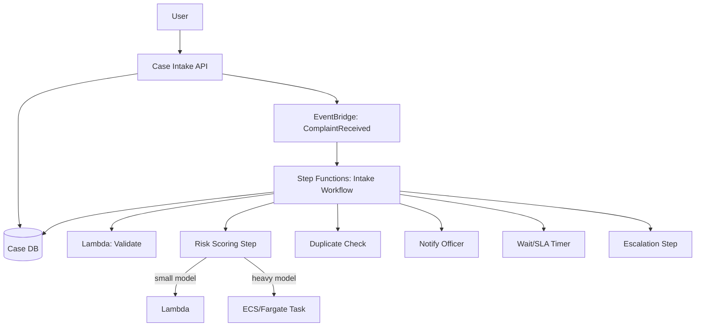

This design separates:

- user-facing latency;
- durable business process;
- heavy compute;
- event routing;
- audit visibility;
- retry and compensation.

---

## 19. Worked Example: Evidence Package Generation

### 19.1 Requirement

Generate evidence package containing:

- case timeline;
- documents;
- attachments;
- generated PDF;
- audit record;
- external delivery.

Package generation can take 20 minutes.

### 19.2 Taxonomy

| Step | Workload Type |
|---|---|
| Request package | Request/Response API |
| Generate package | Batch/async job |
| Track progress | Durable workflow/state |
| Render PDF | CPU-heavy container task |
| Store artifact | Object storage output |
| Notify completion | Async event/notification |

### 19.3 Candidate Architecture

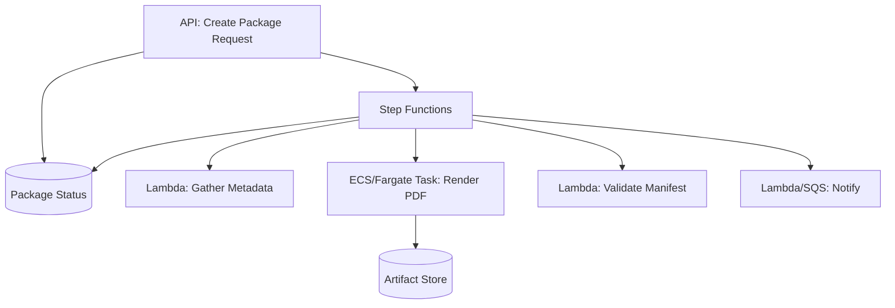

Why not one Lambda?

- duration can exceed comfort zone;
- PDF rendering may require heavy dependencies;
- progress should be visible;
- failure should be recoverable;
- output needs commit semantics.

---

## 20. Taxonomy-Driven Testing Strategy

Different workload types need different tests.

| Workload | Must Test |
|---|---|
| API | latency, error mapping, dependency timeout, rollout, auth |
| Worker | duplicate message, retry, DLQ, poison message, downstream outage |
| Scheduled job | overlap, missed schedule, replay window, timezone |
| Stream consumer | replay, checkpoint, poison record, hot shard |
| Batch | partition retry, partial output, commit marker, cancellation |
| Workflow | retry/catch, compensation, timeout, manual recovery, redrive |
| Long-running service | graceful shutdown, memory leak, health, autoscaling |
| Tenant-isolated workload | noisy neighbor, permission boundary, cost attribution |

A top-tier engineer does not use the same test plan for all compute.

---

## 21. Taxonomy-Driven Observability

### 21.1 API Signals

- request rate;
- latency p50/p95/p99;
- error rate by status class;
- dependency latency;
- saturation;
- deployment version;
- trace coverage.

### 21.2 Worker Signals

- backlog;
- age of oldest message;
- processing duration;
- success/failure count;
- retry count;
- DLQ growth;
- idempotency conflict count;
- downstream throttling.

### 21.3 Scheduled Job Signals

- last successful run;
- run duration;
- missed run;
- overlapping run;
- processed window;
- output count;
- failure reason.

### 21.4 Stream Signals

- iterator age/consumer lag;
- records processed;
- batch failure;
- checkpoint lag;
- hot shard;
- replay count;
- poison record count.

### 21.5 Workflow Signals

- executions started/succeeded/failed/timed out;
- failed state name;
- retry count;
- compensation count;
- execution duration;
- stuck/waiting executions;
- manual intervention queue.

### 21.6 Batch Signals

- queued jobs;
- runnable jobs;
- running jobs;
- failed partitions;
- retry attempts;
- compute capacity;
- output commit status.

---

## 22. Taxonomy-Driven Failure Modelling

Use this matrix during design review.

| Workload | Failure Question |
|---|---|
| API | What happens if dependency exceeds latency budget? |
| Worker | What happens if the same message is delivered twice? |
| Scheduled job | What happens if two runs overlap? |
| Stream consumer | What happens if one record always fails? |
| Batch | What happens if 80% output succeeds and 20% fails? |
| Workflow | What happens if step 5 succeeds but step 6 fails permanently? |
| Long-running service | What happens when process receives SIGTERM during in-flight work? |
| Tenant-isolated workload | What happens if one tenant sends 100x normal traffic? |

Failure modelling is where taxonomy proves its value.

---

## 23. Implementation Heuristics

### 23.1 API

- Keep synchronous path small.
- Push slow side effects async.
- Make mutating endpoints idempotent.
- Fail fast on dependency timeout.
- Protect database from burst.

### 23.2 Worker

- Design duplicate-safe processing first.
- Make terminal failure visible.
- Cap concurrency by downstream capacity.
- Track backlog age, not just message count.
- Use DLQ with owner/runbook.

### 23.3 Scheduled Job

- Use explicit time windows.
- Decide overlap policy.
- Make output idempotent.
- Record run metadata.
- Alert on missed success, not just runtime error.

### 23.4 Stream Consumer

- Know partition key semantics.
- Checkpoint after durable side effects.
- Handle poison record deliberately.
- Monitor lag.
- Make projections rebuildable.

### 23.5 Batch

- Partition input deterministically.
- Track per-partition status.
- Write output with commit marker.
- Retry failed partitions only.
- Separate staging and final output.

### 23.6 Workflow

- Model business transitions, not tiny code steps.
- Use retry/catch per failure class.
- Make compensation explicit.
- Keep payload small.
- Expose workflow status to operators.

### 23.7 Long-Running Service

- Implement graceful shutdown.
- Separate liveness from readiness.
- Use bounded pools.
- Watch memory over time.
- Roll out gradually.

### 23.8 Tenant-Isolated Workload

- Define tenant boundary before coding.
- Attach tenant metadata to logs/metrics/traces.
- Apply per-tenant rate/concurrency limits.
- Keep IAM/data boundaries auditable.
- Attribute cost by tenant where needed.

---

## 24. Workload Classification Worksheet

Use this worksheet before implementation.

```mdx
# Workload Classification: <Name>

## Business Capability

What business capability does this support?

## Primary Type

Choose one:

- Request/Response API
- Async Worker
- Scheduled Job
- Stream Consumer
- Batch Job
- Durable Workflow
- Long-Running Service
- Tenant-Isolated Workload
- Platform Daemon

## Secondary Types

List if composite.

## Trigger

Who/what starts it?

## Completion

How does it finish?

## Runtime Duration

- p50:
- p95:
- max expected:

## State

- source of truth:
- temporary state:
- output state:

## Failure Semantics

- retryable failures:
- non-retryable failures:
- terminal failure path:
- manual recovery path:

## Scaling

- signal:
- upper bound:
- downstream bottleneck:

## Candidate Placement

- primary:
- alternatives:
- rejected options:

## Guardrails

- idempotency:
- timeout:
- concurrency:
- DLQ/compensation:
- observability:
```

---

## 25. Summary

Workload taxonomy is the bridge between requirement and platform choice.

The key classifications:

```txt
Request/Response API
Async Worker
Scheduled Job
Stream Consumer
Batch Job
Durable Workflow
Long-Running Service
Tenant-Isolated Workload
Platform/Internal Daemon
```

The practical rule:

> Do not choose AWS compute service until you can classify the workload and describe its trigger, duration, state, retry semantics, scaling signal, and failure terminal state.

This taxonomy will be reused throughout the series:

- ECS parts will focus heavily on long-running service, worker, and container job shapes.
- EKS parts will focus on platform, tenancy, Kubernetes workload primitives, and day-2 operations.
- Lambda parts will focus on short event-driven handlers and event source mapping.
- EventBridge/Step Functions parts will focus on event routing and durable orchestration.
- Production platform parts will combine multiple workload shapes into deployable systems.

---

## 26. Official References

- Amazon ECS Developer Guide — https://docs.aws.amazon.com/AmazonECS/latest/developerguide/Welcome.html
- AWS Fargate for Amazon ECS — https://docs.aws.amazon.com/AmazonECS/latest/developerguide/AWS_Fargate.html
- AWS Lambda Developer Guide — https://docs.aws.amazon.com/lambda/latest/dg/welcome.html
- AWS Lambda event source mappings — https://docs.aws.amazon.com/lambda/latest/dg/invocation-eventsourcemapping.html
- Using AWS Lambda with Amazon SQS — https://docs.aws.amazon.com/lambda/latest/dg/with-sqs.html
- AWS Step Functions Developer Guide — https://docs.aws.amazon.com/step-functions/latest/dg/welcome.html
- Run Amazon ECS or Fargate tasks with Step Functions — https://docs.aws.amazon.com/step-functions/latest/dg/connect-ecs.html
- Amazon EventBridge User Guide — https://docs.aws.amazon.com/eventbridge/latest/userguide/eb-what-is.html
- EventBridge Scheduler — https://docs.aws.amazon.com/scheduler/latest/UserGuide/what-is-scheduler.html
- AWS Batch User Guide — https://docs.aws.amazon.com/batch/latest/userguide/what-is-batch.html
- AWS App Runner Developer Guide — https://docs.aws.amazon.com/apprunner/latest/dg/what-is-apprunner.html
