# Part 003 — Control Plane vs Data Plane

Di sistem cloud modern, banyak keputusan arsitektur menjadi kabur karena kita terlalu cepat bertanya:

> “Pakai ECS, EKS, Lambda, atau Step Functions?”

Pertanyaan yang lebih kuat adalah:

> “Bagian mana dari sistem ini yang mengubah konfigurasi, dan bagian mana yang melayani traffic nyata?”

Itulah perbedaan **control plane** dan **data plane**.

Control plane adalah bagian sistem yang menerima keputusan administratif: membuat resource, mengubah desired state, men-deploy versi baru, mengatur routing, mengatur policy, atau menyusun workflow. Data plane adalah bagian sistem yang melakukan pekerjaan aktual: menerima request user, menjalankan container, memproses event, menulis data, mengirim response, atau memindahkan message.

AWS Well-Architected menjelaskan control plane sebagai administrative APIs untuk provision, update, remove, deploy, dan monitor; sedangkan data plane adalah bagian yang menyediakan fungsi utama layanan. Dalam praktik engineering, definisi ini bukan sekadar istilah infrastruktur. Ini adalah alat berpikir untuk membatasi blast radius, membuat runbook, dan mendesain sistem yang tetap berjalan ketika sebagian control plane sedang lambat, throttled, atau gagal.

## 1. Mental Model Dasar

Bayangkan restoran.

Control plane adalah sistem booking, menu planning, jadwal staf, pricing, procurement, dan layout dapur.

Data plane adalah koki memasak, pelayan mengantar makanan, kasir menerima pembayaran, dan pelanggan benar-benar makan.

Jika sistem booking sedang down, restoran mungkin tetap bisa melayani pelanggan yang sudah duduk. Jika dapur mati, sistem booking yang sempurna tidak membantu.

Di cloud, pola yang sama muncul terus-menerus:

- ECS API menerima update service.
- ECS scheduler menjaga desired task count.
- Task yang berjalan menerima request dari load balancer.
- Lambda control plane mengelola konfigurasi function.
- Lambda data plane mengeksekusi invocation.
- EventBridge rule dikonfigurasi lewat control plane.
- EventBridge event bus mengirim event ke target lewat data plane.
- Step Functions definition diubah lewat control plane.
- Execution berjalan sebagai data plane orchestration.

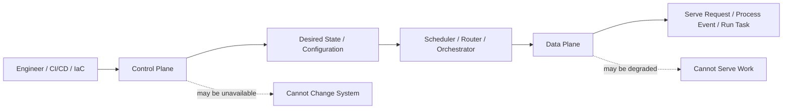

Kunci pembeda:

| Aspek | Control Plane | Data Plane |
|---|---|---|
| Pertanyaan utama | “Sistem harus seperti apa?” | “Pekerjaan aktual diproses bagaimana?” |
| Contoh aksi | Create service, update deployment, change rule, publish function version | Serve HTTP request, process queue message, execute Lambda handler |
| Sifat traffic | Rendah, administratif, burst saat deployment/operation | Tinggi, user-facing atau workload-facing |
| Failure impact | Tidak bisa mengubah sistem, deploy tertahan, scaling tertunda | User request gagal, event tertahan, job tidak selesai |
| Desain utama | Consistency, auditability, safety, idempotent operations | Availability, latency, throughput, isolation, backpressure |
| Operator utama | Engineer, CI/CD, IaC, platform automation | Application runtime, event source, load balancer, queue, workflow execution |

Control plane menjawab **intent**. Data plane menjalankan **effect**.

## 2. Mengapa Ini Penting untuk Engineer Senior

Engineer biasa sering debugging dari gejala:

> “Service error.”

Engineer senior akan memecahnya:

1. Apakah desired state berubah?
2. Apakah scheduler berhasil membuat runtime instance?
3. Apakah runtime instance sehat?
4. Apakah traffic diarahkan ke instance sehat?
5. Apakah downstream menerima beban?
6. Apakah retry memperbaiki atau memperburuk situasi?

Dengan membedakan control plane dan data plane, kita bisa memisahkan beberapa kelas masalah:

| Gejala | Kemungkinan Control Plane | Kemungkinan Data Plane |
|---|---|---|
| Deployment stuck | ECS service deployment tidak mencapai steady state, admission webhook EKS gagal, CloudFormation rollback | Container crash, health check gagal, dependency tidak bisa dijangkau |
| Service tidak bisa scale out | Application Auto Scaling throttled, quota tercapai, subnet/IP habis | Instance/task overload, queue menumpuk, downstream bottleneck |
| Rule EventBridge tidak mengirim event | Rule disabled, target permission salah, event pattern salah | Target throttled, Lambda error, DLQ menumpuk |
| Lambda tidak update versi | Publish/update function gagal, IAM permission salah | Invocation timeout, cold start, downstream error |
| Kubernetes pod tidak jalan | API server/admission/scheduler issue | Image pull error, CrashLoopBackOff, readiness probe gagal |

Batas ini juga membantu ketika membuat **runbook**. Runbook yang baik tidak hanya berkata “restart service”. Ia bertanya:

- Apakah kita perlu mengubah desired state?
- Apakah aman melakukan perubahan control plane saat data plane sedang overload?
- Apakah rollback control plane cukup untuk memperbaiki data plane?
- Apakah failure berada di runtime, routing, dependency, atau orchestration?

## 3. Desired State: Jantung Control Plane

Banyak layanan AWS modern memakai pola **desired state**.

Desired state adalah deklarasi: “Saya ingin sistem berada dalam kondisi ini.”

Contoh:

- ECS service desired count = 6.
- Task definition revision = 42.
- Deployment minimum healthy percent = 100.
- Kubernetes Deployment replicas = 10.
- Lambda alias `prod` menunjuk ke version 18.
- EventBridge rule mengirim event `OrderSubmitted` ke target tertentu.
- Step Functions state machine definition memiliki retry policy tertentu.

Control plane menerima desired state, lalu scheduler/orchestrator berusaha membuat actual state mendekati desired state.

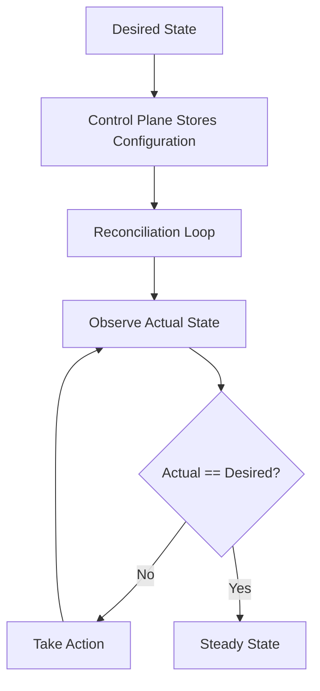

Ini menjelaskan mengapa banyak sistem cloud terlihat “eventually consistent”. Ketika kita menekan deploy, perubahan tidak berarti traffic langsung berpindah sempurna. Ada loop yang harus menyelesaikan beberapa langkah:

1. Control plane menerima update.
2. Scheduler menghitung perubahan.
3. Runtime instance baru dibuat.
4. Image ditarik.
5. Container start.
6. Health check lolos.
7. Target didaftarkan ke load balancer.
8. Traffic mulai mengalir.
9. Instance lama di-drain dan dihentikan.

Jika salah satu langkah gagal, masalahnya bisa berada pada control plane, data plane, atau boundary di antaranya.

## 4. ECS: Control Plane dan Data Plane

Amazon ECS adalah managed container orchestration service. Dalam ECS, control plane mencakup API, cluster metadata, task definition, service definition, scheduler, deployment controller, dan integrasi dengan layanan seperti load balancer, IAM, CloudWatch, dan Application Auto Scaling.

Data plane adalah task/container yang benar-benar berjalan di Fargate atau EC2 capacity, menerima traffic, mengirim log, membuka koneksi database, memproses message, dan mengonsumsi CPU/memory.

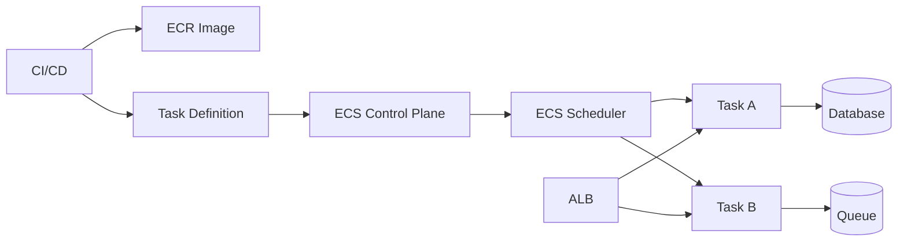

### 4.1 ECS Control Plane Objects

| Object | Control/Data Plane | Fungsi |
|---|---|---|
| Cluster | Control plane grouping | Mengelompokkan service/task dan capacity provider |
| Task definition | Control plane contract | Template runtime: image, CPU, memory, port, env, secret, role |
| Service | Control plane desired state | Menjaga sejumlah task tetap berjalan |
| Scheduler | Control plane actuator | Menentukan kapan task dibuat/diganti |
| Deployment controller | Control plane rollout logic | Mengelola pergantian task definition revision |
| Task | Data plane runtime unit | Unit eksekusi container |
| Container | Data plane process | Proses aplikasi aktual |
| ALB target | Data plane routing endpoint | Tujuan traffic user |

AWS ECS service dirancang untuk menjalankan dan mempertahankan jumlah task sesuai desired count. Jika task berhenti atau gagal, service scheduler akan meluncurkan pengganti. Ini adalah contoh eksplisit pola desired state.

### 4.2 Failure Boundary di ECS

Misalnya deployment ECS gagal.

Jangan langsung menyimpulkan “ECS bermasalah”. Pecah menjadi fase:

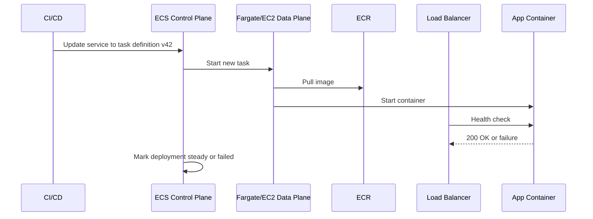

Kemungkinan failure:

| Fase | Failure | Kategori |
|---|---|---|
| Update service | IAM denied, invalid task definition | Control plane |
| Start task | Quota, capacity, subnet IP exhaustion | Boundary control/data |
| Pull image | ECR permission, image not found, network endpoint issue | Boundary |
| Start container | Bad entrypoint, missing env, OOM | Data plane |
| Health check | App not ready, wrong path, dependency unavailable | Data plane/routing |
| Rollback | Circuit breaker disabled/misconfigured | Control plane policy |

### 4.3 Invariant ECS

Untuk ECS production, beberapa invariant penting:

1. **Task definition harus immutable.** Jangan bergantung pada tag mutable seperti `latest` untuk production release.
2. **Service adalah desired state, bukan process manager biasa.** Jangan memperbaiki masalah dengan masuk ke container dan mengubah state manual.
3. **Health check adalah kontrak traffic.** Jika health check terlalu dangkal, traffic bisa dikirim ke task yang belum siap.
4. **Task role adalah identitas data plane.** Execution role hanya untuk bootstrap seperti pull image/logs.
5. **Deployment config adalah safety policy.** Minimum/maximum healthy percent menentukan apakah rollout bisa menjaga kapasitas saat transisi.

## 5. EKS: Kubernetes Control Plane di Atas AWS Data Plane

EKS menambahkan satu lapisan kompleksitas karena ada dua control plane yang perlu dibaca:

1. **Kubernetes control plane**: API server, scheduler, controller manager, etcd.
2. **AWS control plane integrations**: IAM, VPC CNI, Load Balancer Controller, EBS/EFS CSI, EKS add-ons, node groups, Karpenter.

Data plane EKS adalah node, pod, container, network path, volume, dan ingress target yang benar-benar memproses traffic.

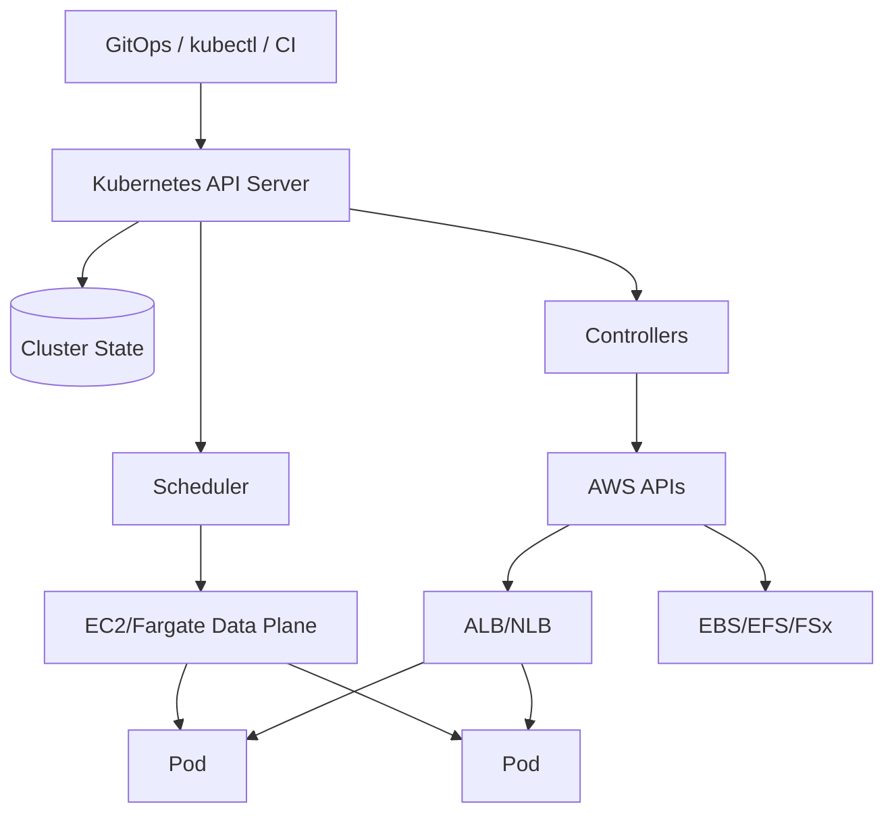

### 5.1 Kubernetes Reconciliation

Kubernetes adalah mesin reconciliation.

Ketika kita membuat Deployment dengan `replicas: 5`, kita tidak menjalankan lima process secara manual. Kita menulis desired state. Kubernetes controller membuat ReplicaSet. Scheduler menempatkan Pod. Kubelet menjalankan container. Jika Pod mati, controller membuat pengganti.

Masalah EKS sering perlu dibaca berlapis:

| Gejala | Kemungkinan Layer |
|---|---|
| Pod `Pending` | Scheduler tidak menemukan node sesuai request/affinity/taint, node capacity habis, PVC belum bound |
| Pod `ImagePullBackOff` | ECR permission/network/image tag salah |
| Pod `CrashLoopBackOff` | App process gagal, config salah, dependency tidak tersedia |
| Ingress tidak punya address | AWS Load Balancer Controller gagal create ALB/NLB, IAM permission salah |
| Service tidak bisa reach Pod | Selector salah, readiness false, network policy, CNI issue |
| Node tidak muncul | Managed node group/Karpenter failure, subnet/capacity/IAM/bootstrap issue |

### 5.2 EKS Anti-Pattern: Menganggap Kubernetes API Sama dengan Data Plane

Kubernetes API bisa sehat sementara aplikasi down. Aplikasi bisa tetap melayani traffic sementara sebagian control plane tidak responsif. Dua kondisi itu berbeda.

Contoh:

- API server lambat, tetapi Pod existing masih melayani request.
- Admission webhook down, deployment baru gagal, tetapi traffic lama tetap jalan.
- Load Balancer Controller gagal, Ingress baru tidak dibuat, tetapi ALB existing masih melayani target existing.
- Cluster Autoscaler/Karpenter gagal, Pod baru pending, tetapi Pod lama masih sehat.

Karena itu, alerting EKS tidak boleh hanya melihat “cluster available”. Harus ada observability untuk:

- API server/control plane health.
- Node pressure.
- Pod readiness.
- Ingress target health.
- Workload SLO.
- Autoscaler effectiveness.
- CNI/IP pressure.
- DNS health.

## 6. Lambda: Control Plane Function, Data Plane Invocation

Lambda terlihat sederhana: upload code, function jalan. Tetapi production Lambda memiliki boundary yang jelas.

Control plane Lambda:

- Function configuration.
- Runtime setting.
- Memory/timeout/ephemeral storage.
- Environment variables.
- IAM execution role.
- Version dan alias.
- Event source mapping.
- Reserved/provisioned concurrency.
- Resource-based policy.

Data plane Lambda:

- Invocation request.
- Execution environment.
- Init phase.
- Handler execution.
- Extension lifecycle.
- Logs/metrics/traces emission.
- Downstream calls.

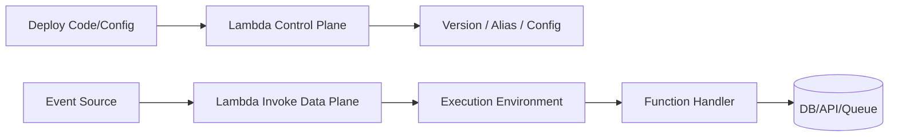

AWS Lambda documentation menjelaskan execution environment sebagai lingkungan runtime terisolasi yang mengelola resource untuk menjalankan function. Lifecycle-nya mencakup initialization, invocation, dan shutdown.

### 6.1 Control Plane Tidak Sama dengan Invocation Path

Saat engineer mengubah timeout Lambda dari 3 detik ke 30 detik, itu control plane. Saat function dipanggil oleh SQS event source mapping dan memproses batch, itu data plane.

Masalah umum:

| Gejala | Control Plane | Data Plane |
|---|---|---|
| Function tidak bisa diupdate | IAM denied, package terlalu besar, invalid runtime | - |
| Invocation throttled | Reserved/account concurrency, event source config | Traffic spike, retry storm |
| Cold start tinggi | Memory/runtime/package/provisioned concurrency config | Init code berat, dependency besar |
| SQS batch berulang | Event source mapping policy | Handler gagal sebagian, idempotency buruk |
| Alias salah versi | Deployment/alias config | Runtime mungkin sehat tetapi versi salah |

### 6.2 Lambda Alias sebagai Control Plane Router

Untuk production, alias penting karena ia memisahkan versi immutable dari traffic routing.

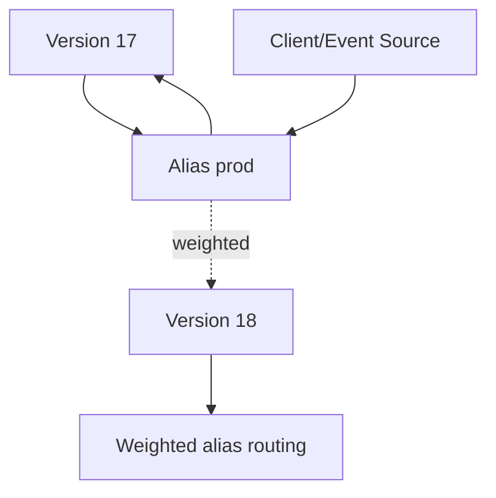

Tanpa alias/version discipline, deployment Lambda mudah menjadi opaque. Engineer tidak tahu invocation yang gagal berasal dari code version mana.

Invariant:

- Deploy ke version immutable.
- Arahkan traffic via alias.
- Attach alarms ke alias/route production.
- Rollback dengan mengubah alias, bukan rebuild package.
- Jangan menjadikan `$LATEST` sebagai production target.

## 7. EventBridge: Event Routing sebagai Data Plane

EventBridge terdiri dari event bus, rules, targets, pipes, scheduler, schemas, archive/replay, dan API destinations. Dalam mental model control/data plane:

Control plane:

- Membuat event bus.
- Membuat rule.
- Menulis event pattern.
- Menentukan target.
- Mengatur permission.
- Mengaktifkan archive/replay.
- Mengatur scheduler.

Data plane:

- Event diterima.
- Event pattern dievaluasi.
- Event dikirim ke target.
- Target menjalankan process.
- Retry/DLQ terjadi bila delivery gagal.

AWS EventBridge documentation menyebut event bus sebagai router yang menerima event dan mengirimnya ke zero atau more targets. Rule menentukan event mana yang dikirim ke target tertentu.

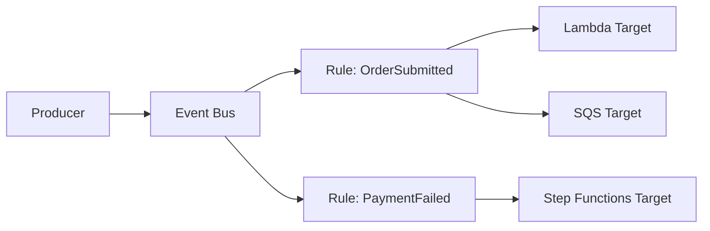

### 7.1 EventBridge Failure Boundary

EventBridge sering disalahpahami sebagai “message broker biasa”. Ia lebih tepat dilihat sebagai event router.

Failure yang perlu dipisahkan:

| Failure | Kategori | Dampak |
|---|---|---|
| Producer gagal `PutEvents` | Data plane ingress | Event tidak masuk bus |
| Event pattern salah | Control plane config | Event masuk bus tetapi tidak match target |
| Target permission salah | Control plane/boundary | Delivery gagal |
| Target throttled | Data plane target | Retry/DLQ, latency meningkat |
| DLQ tidak dikonfigurasi | Control plane safety | Event gagal sulit direcover |
| Schema berubah tanpa kontrak | Contract governance | Consumer runtime gagal |

### 7.2 Event Bus Bukan Database

Event bus bukan tempat menyimpan truth utama. Ia adalah jalur pengiriman fakta domain.

Anti-pattern:

- Menganggap event bus sebagai audit log utama tanpa archive/retention strategy.
- Mengirim event tanpa idempotency key.
- Mengubah schema secara breaking tanpa versioning.
- Memakai event sebagai command tersembunyi tanpa owner yang jelas.
- Tidak memisahkan business event dan technical event.

## 8. Step Functions: Control Plane State Machine, Data Plane Execution

Step Functions punya boundary yang sangat menarik.

Control plane:

- State machine definition.
- IAM role untuk service integration.
- Version/alias.
- Logging/tracing config.
- Retry/catch definition.
- Choice/Map/Parallel structure.

Data plane:

- Execution instance.
- State transition.
- Task invocation.
- Retry attempt.
- Catch path.
- Wait state.
- Callback token.
- Execution history.

AWS Step Functions mendukung error handling dengan `Retry` dan `Catch`; tanpa handler, error pada state dapat membuat seluruh execution gagal.

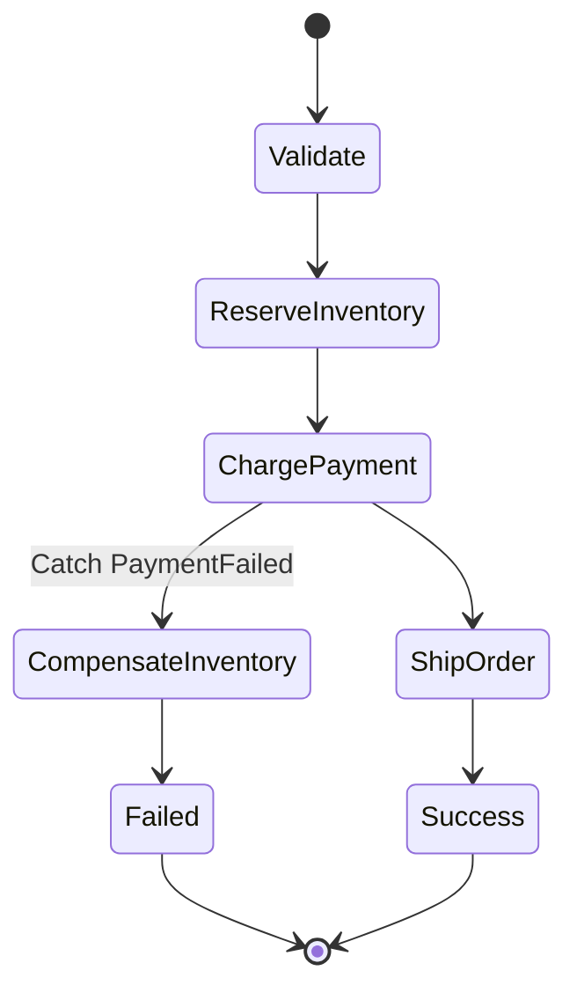

### 8.1 State Machine Definition Bukan Workflow Execution

Mengubah state machine definition tidak otomatis memperbaiki execution lama. Execution yang sedang berjalan mengikuti definisi/version yang berlaku sesuai model deployment dan pemanggilan.

Ini penting untuk long-running workflow:

- Execution bisa berjalan lebih lama dari satu release cycle.
- Bug di definition bisa menghasilkan banyak execution stuck.
- Retry policy buruk bisa memperbesar downstream outage.
- Compensation step harus dirancang sebagai bagian dari domain behavior, bukan patch setelah incident.

### 8.2 Step Functions Sebagai Durable Control Flow

Step Functions bukan sekadar “Lambda chain”. Ia adalah durable control flow.

Gunakan ketika:

- Ada banyak step dengan state transisi jelas.
- Retry/catch perlu eksplisit.
- Ada compensation atau saga.
- Ada human approval atau wait.
- Ada integrasi service yang lebih baik dibuat deklaratif.
- Ada kebutuhan audit execution history.

Hindari ketika:

- Proses sangat sederhana dan bisa selesai dalam satu handler.
- Latency overhead tidak bisa diterima.
- State machine hanya menjadi diagram palsu yang semua logic tetap tersembunyi di Lambda besar.
- Workflow butuh query/ad-hoc state mutation kompleks seperti workflow engine domain-specific yang lebih cocok disimpan di database aplikasi.

## 9. App Runner: Paved Road dengan Control Plane Sederhana

App Runner menyederhanakan banyak control plane decision untuk web app/API container.

Control plane App Runner:

- Source code atau container image source.
- Build/deploy setting.
- Auto scaling config.
- Health check.
- Networking connector.
- Custom domain/TLS.

Data plane:

- Running service instance.
- Request handling.
- Scaling instances.
- Outbound connection.

App Runner cocok untuk workload yang ingin “deploy web service cepat” tanpa menanggung detail ECS/EKS. Tetapi simplifikasi berarti ada batas customization.

Trade-off:

| Kebutuhan | App Runner | ECS | EKS |
|---|---|---|---|
| Deploy web API cepat | Sangat baik | Baik | Overkill jika hanya satu service |
| Platform customization | Terbatas | Sedang | Sangat tinggi |
| Multi-container topology | Terbatas | Baik | Sangat baik |
| Complex networking | Terbatas/sedang | Baik | Sangat baik |
| Team platform maturity | Rendah cukup | Sedang | Tinggi |

Control/data plane thinking membantu kita melihat App Runner bukan “lebih buruk dari ECS”, melainkan “control plane yang lebih sempit dengan data plane web service yang dikelola lebih jauh”.

## 10. Control Plane Failures: Sistem Tidak Bisa Berubah

Control plane failure biasanya berarti sistem tidak bisa berubah, bukan selalu tidak bisa melayani traffic.

Contoh:

- Tidak bisa deploy versi baru.
- Tidak bisa scale out.
- Tidak bisa create target baru.
- Tidak bisa update rule.
- Tidak bisa publish Lambda alias.
- Tidak bisa create node baru.
- Tidak bisa rotate config.

Risiko terbesar control plane failure adalah saat sistem **membutuhkan perubahan cepat untuk survive**, misalnya:

- Traffic spike butuh scale out.
- Deployment buruk butuh rollback.
- Secret bocor butuh rotation.
- Downstream outage butuh routing change.
- Queue backlog butuh worker tambahan.

Jika control plane unavailable, data plane existing mungkin masih jalan, tetapi kemampuan adaptasi hilang.

### 10.1 Design Principle: Jangan Membutuhkan Control Plane untuk Setiap Request

Sistem yang kuat tidak memanggil control plane di hot path user request.

Buruk:

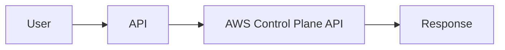

Lebih baik:

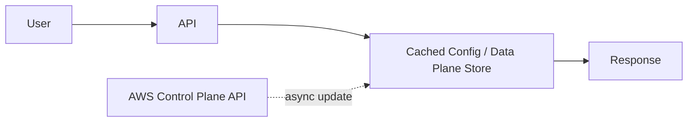

Control plane operation harus jarang, idempotent, observable, dan aman diulang.

## 11. Data Plane Failures: Sistem Tidak Bisa Melayani Work

Data plane failure langsung terasa ke user atau downstream process.

Contoh:

- HTTP 5xx meningkat.
- Lambda timeout.
- ECS task OOM.
- Pod readiness false.
- SQS backlog naik.
- EventBridge target delivery gagal.
- Step Functions execution gagal.
- Database connection pool exhausted.

Data plane failure sering diperburuk oleh retry yang tidak dikontrol.

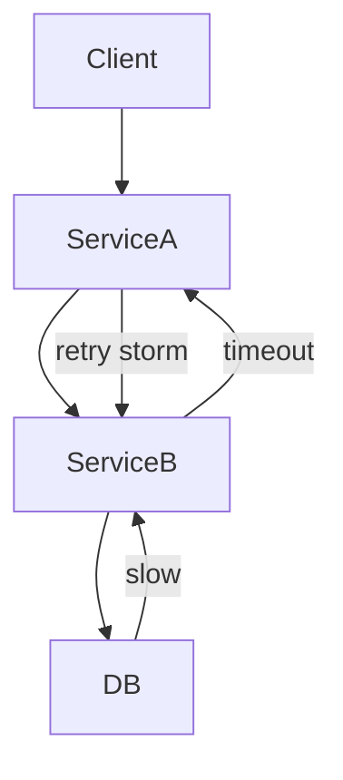

Principle:

- Retry harus punya budget.
- Timeout harus lebih pendek dari caller deadline.
- Circuit breaker mencegah cascading failure.
- Queue memberi buffer, bukan mukjizat.
- DLQ adalah safety net, bukan desain utama.
- Idempotency adalah syarat ketika retry ada.

## 12. Boundary: Tempat Banyak Incident Berasal

Incident jarang berada murni di control plane atau data plane. Banyak terjadi di boundary.

Contoh boundary:

| Boundary | Contoh Failure |
|---|---|
| Deployment → Runtime | Image berhasil dipush, tetapi task gagal start |
| Scheduler → Capacity | Desired count naik, tetapi subnet IP habis |
| Router → Target | ALB punya target, tetapi readiness tidak valid |
| Event Rule → Target | Rule benar, tetapi target permission salah |
| Queue → Consumer | Queue sehat, consumer throttled |
| Lambda Config → Handler | Env var ada, tetapi format tidak sesuai |
| EKS API → Webhook | Deployment blocked karena admission webhook down |

Boundary harus dirancang eksplisit.

Checklist boundary:

- Apa sinyal suksesnya?
- Apa sinyal gagalnya?
- Siapa owner-nya?
- Apakah ada retry?
- Apakah retry aman?
- Apakah ada DLQ/rollback/compensation?
- Apakah failure terlihat di dashboard?
- Apakah alert mengarah ke action yang benar?

## 13. Deployment sebagai Control Plane Transaction

Deployment bukan sekadar mengganti code. Deployment adalah transaksi control plane yang mencoba mengubah data plane tanpa memutus service.

Fase deployment yang sehat:

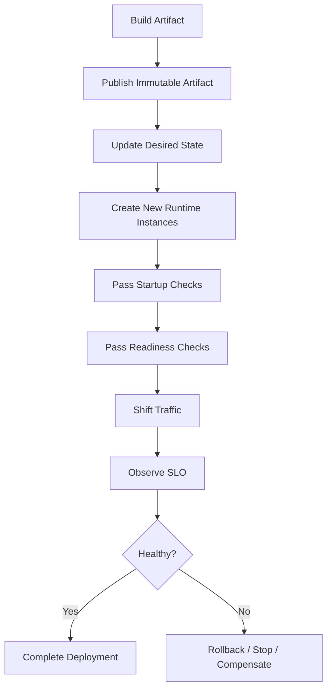

Setiap compute model punya variasi:

| Model | Deployment Control Plane | Data Plane Transition |
|---|---|---|
| ECS | Update service to new task definition | New tasks start, pass health, receive traffic |
| EKS | Apply Deployment/Helm/GitOps change | Pods rollout, readiness, Service/Ingress routes |
| Lambda | Publish version/update alias | New invocations route to new version |
| Step Functions | Update/publish state machine | New executions use new definition/version pattern |
| EventBridge | Update rules/targets | Future events route differently |

Deployment yang buruk biasanya gagal karena tidak memahami transisi ini.

Anti-pattern:

- Health check hanya mengecek process alive.
- Deployment tidak punya rollback otomatis.
- Artifact mutable.
- Config berubah di luar pipeline.
- Database migration tidak sinkron dengan rollout.
- Event schema berubah tanpa compatibility.
- Lambda alias tidak digunakan.
- Step Functions workflow diubah tanpa mempertimbangkan execution lama.

## 14. Scaling sebagai Perubahan Control Plane yang Dipicu Data Plane

Autoscaling adalah loop yang membaca sinyal data plane lalu mengubah desired state di control plane.

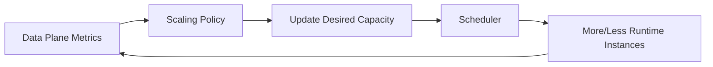

Contoh:

- ECS service CPU tinggi → Application Auto Scaling menaikkan desired count.
- SQS queue depth naik → ECS worker count naik atau Lambda concurrency meningkat.
- Kubernetes HPA membaca CPU/custom metrics → replicas naik.
- Karpenter melihat pending pods → node baru dibuat.
- Lambda menerima event lebih banyak → concurrency meningkat sampai quota atau reserved limit.

Scaling failure sering terjadi karena sinyal salah.

| Workload | Sinyal Buruk | Sinyal Lebih Baik |
|---|---|---|
| API service | CPU only | Request count per target, p95 latency, saturation |
| Queue worker | CPU only | Queue age, backlog per worker, processing time |
| Stream consumer | Invocation count | Iterator age, shard lag, error rate |
| Batch job | Desired count manual | Queue depth, deadline, job duration |
| Workflow | Execution started | Failed/timeout state, transition latency, downstream throttling |

Autoscaling bukan solusi jika bottleneck ada di downstream. Menambah worker bisa mempercepat kehancuran database.

## 15. Observability: Pisahkan Signal Control dan Signal Data

Dashboard production harus punya dua sisi.

Control plane signals:

- Deployment status.
- Desired vs running count.
- Pending tasks/pods.
- Failed scheduling events.
- Rollback/circuit breaker event.
- IAM/access denied pada provisioning.
- Quota/capacity errors.
- GitOps sync status.

Data plane signals:

- Request rate.
- Error rate.
- Latency.
- Saturation.
- Queue age/backlog.
- Lambda duration/throttle/error.
- Container restart/OOM.
- Downstream timeout.
- Business outcome rate.

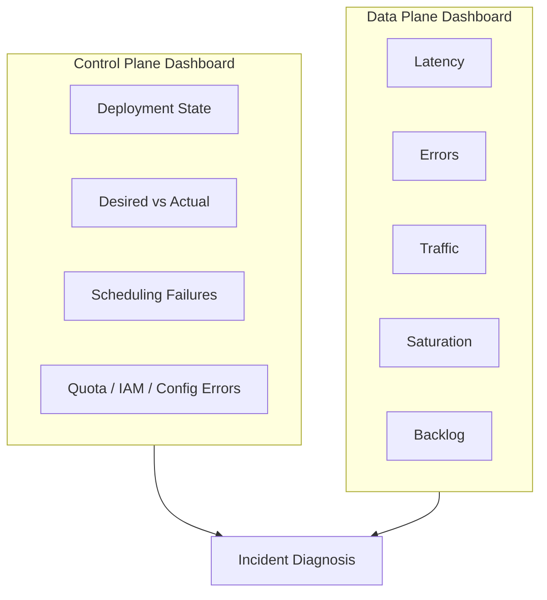

Jika hanya melihat data plane, kita tahu user sakit tetapi tidak tahu apakah deployment/scale/control state berubah. Jika hanya melihat control plane, kita tahu deployment sukses tetapi belum tentu user bahagia.

## 16. Control Plane Safety Patterns

Production system harus melindungi control plane dari perubahan berbahaya.

Pattern:

### 16.1 Immutable Artifact

Artifact tidak boleh berubah setelah dipromosikan.

- Container pakai digest.
- Lambda pakai version.
- State machine pakai version/alias jika cocok.
- Helm chart/app manifests dipin.

### 16.2 Declarative Infrastructure

Desired state disimpan di code.

- CDK/Terraform/SAM/CloudFormation.
- GitOps untuk Kubernetes.
- PR review untuk perubahan policy.
- Drift detection.

### 16.3 Progressive Rollout

Perubahan tidak langsung 100%.

- ECS rolling/blue-green.
- EKS canary/blue-green via ingress/service mesh/controller.
- Lambda alias weighted routing.
- Step Functions versioned rollout.

### 16.4 Guardrail

Control plane harus punya pagar:

- IAM least privilege.
- SCP/account boundary.
- Policy-as-code.
- Admission control.
- Quota alert.
- Required tags/owner.
- Approval untuk high-risk operation.

### 16.5 Emergency Brake

Harus ada cara menghentikan kerusakan:

- Disable EventBridge rule.
- Set reserved concurrency Lambda ke 0 untuk stop consumer.
- Scale ECS service to 0 untuk worker tertentu.
- Pause GitOps sync.
- Rollback alias.
- Stop Step Functions execution bila aman.
- Redrive DLQ setelah fix.

Emergency brake adalah control plane operation. Jangan membuatnya bergantung pada sistem yang sedang rusak.

## 17. Data Plane Safety Patterns

Data plane harus melindungi user dan downstream.

Pattern:

### 17.1 Deadline Propagation

Request tidak boleh hidup lebih lama dari nilai bisnisnya.

- Client timeout.
- API timeout.
- Service timeout.
- DB timeout.
- Queue visibility timeout.
- Lambda timeout.
- Step Functions state timeout.

Semua harus konsisten.

### 17.2 Backpressure

Jika downstream lambat, upstream harus menahan laju.

- Queue buffer.
- Concurrency limit.
- Rate limit.
- Circuit breaker.
- Bulkhead.
- Token bucket.

### 17.3 Idempotency

Retry berarti duplikasi mungkin terjadi. Idempotency membuat duplikasi tidak merusak state.

- Idempotency key.
- Conditional write.
- Unique constraint.
- Deduplication table.
- Outbox/inbox pattern.

### 17.4 Poison Message Isolation

Satu event buruk tidak boleh menghentikan seluruh consumer.

- Partial batch response.
- DLQ.
- Redrive policy.
- Schema validation.
- Quarantine queue.

### 17.5 Graceful Degradation

Ketika dependency non-kritis down, core path tetap jalan.

- Cache fallback.
- Async enrichment.
- Feature flag.
- Default response.
- Skip non-critical side effect.

## 18. Membaca AWS Service dengan Lensa Ini

Gunakan tabel ini sebagai peta cepat:

| Service | Control Plane | Data Plane | Boundary Paling Sering Bermasalah |
|---|---|---|---|
| ECS | Cluster, service, task definition, deployment config | Task/container receiving traffic | Image pull, health check, capacity/IP, ALB target |
| EKS | Kubernetes API, controllers, add-ons, node provisioning | Pod/container/node/ingress traffic | Admission webhook, CNI/IP, scheduling, readiness |
| Lambda | Function config, version, alias, event source mapping | Invocation/execution environment/handler | Concurrency, timeout, async retry, event source batch |
| EventBridge | Bus, rule, target, permission, archive | Event ingestion/routing/delivery | Pattern mismatch, target permission, target throttle |
| Step Functions | State machine definition, IAM, version/alias | Execution/state transitions/tasks | Retry storm, stuck execution, compensation bug |
| App Runner | Service config, source/image, autoscaling, networking | Web request handling | Build/deploy config, health check, VPC connector |
| Batch | Job queue, compute environment, job definition | Containerized job execution | Capacity, retry, array job failure, queue starvation |

## 19. Practical Design Review Questions

Saat review arsitektur container/serverless, pakai pertanyaan ini.

### 19.1 Control Plane

1. Apa desired state utama sistem?
2. Di mana desired state disimpan?
3. Siapa boleh mengubahnya?
4. Apakah perubahan tercatat dan bisa diaudit?
5. Apakah artifact immutable?
6. Apakah rollback mengembalikan desired state atau hanya patch runtime?
7. Apakah deployment punya safety gate?
8. Apakah ada limit/quota yang bisa menggagalkan perubahan?
9. Apakah ada dependency control plane di request hot path?
10. Apa emergency brake yang tersedia?

### 19.2 Data Plane

1. Apa request/event/job utama yang diproses?
2. Apa SLO user-facing atau business-facing?
3. Apa batas concurrency?
4. Apa timeout paling luar dan paling dalam?
5. Apa retry policy?
6. Apakah retry idempotent?
7. Apa yang terjadi jika downstream lambat?
8. Apa yang terjadi jika event duplikat?
9. Apa yang terjadi jika message poison?
10. Apa sinyal observability yang membuktikan workload sehat?

### 19.3 Boundary

1. Bagaimana deployment berpindah dari version lama ke baru?
2. Apa definisi “ready” sebelum traffic masuk?
3. Apa yang terjadi jika scaling policy menaikkan kapasitas tetapi capacity tidak tersedia?
4. Apa yang terjadi jika schema event berubah?
5. Apa yang terjadi jika target permission salah?
6. Apa yang terjadi jika workflow execution lama bertemu definition baru?
7. Apa yang terjadi jika queue backlog naik tetapi consumer gagal?
8. Bagaimana rollback memengaruhi event/job yang sudah diproses sebagian?

## 20. Common Anti-Patterns

### 20.1 Control Plane in Hot Path

Aplikasi memanggil API AWS control plane untuk setiap request user. Ini menambah latency, throttling risk, dan coupling.

Perbaikan: cache, precompute, async reconciliation, atau gunakan data plane service yang memang dirancang untuk high-throughput access.

### 20.2 Mutable Production Artifact

Tag image `latest` dipakai production. Hari ini tag menunjuk image A, besok image B, tetapi deployment history terlihat sama.

Perbaikan: digest pinning, immutable tags, release manifest.

### 20.3 Health Check Bohong

Endpoint `/health` selalu 200 walaupun app belum siap menerima traffic.

Perbaikan: pisahkan liveness, readiness, startup check. Readiness harus merepresentasikan kemampuan menerima traffic untuk path utama.

### 20.4 Retry Tanpa Budget

Client, service, queue, Lambda, dan Step Functions semua melakukan retry sendiri-sendiri.

Perbaikan: definisikan retry budget end-to-end. Pastikan timeout caller lebih besar dari callee tapi tetap bounded.

### 20.5 Control Plane Rollback Dianggap Data Plane Recovery

Rollback code tidak membatalkan side effect yang sudah terjadi.

Perbaikan: desain compensation, outbox, idempotency, dan data repair path.

### 20.6 Workflow Definition Tanpa Versioning Strategy

State machine berubah saat ada execution lama berjalan.

Perbaikan: version/alias discipline, migration plan, bounded execution duration, compatibility policy.

## 21. Mini Lab: Diagnosis dengan Control/Data Plane

Gunakan skenario berikut untuk melatih cara berpikir.

### Skenario A — ECS API Deployment Gagal

Gejala:

- CI/CD berhasil build image.
- ECS deployment started.
- New tasks repeatedly stop.
- ALB masih melayani old tasks.

Diagnosis:

1. Control plane update service berhasil.
2. Scheduler mencoba membuat task baru.
3. Data plane task gagal start atau gagal health check.
4. Jika old tasks masih melayani, data plane production belum total down.
5. Fokus debugging pada stopped task reason, container logs, ECR pull, env/secret, health path.

### Skenario B — Event Tidak Sampai Consumer

Gejala:

- Producer berhasil memanggil `PutEvents`.
- Consumer Lambda tidak ter-trigger.

Diagnosis:

1. Data plane ingress ke EventBridge mungkin berhasil.
2. Rule pattern bisa salah.
3. Rule bisa disabled.
4. Target permission bisa salah.
5. Target bisa throttled.
6. DLQ/failed invocation metric harus dicek.

### Skenario C — Kubernetes Deployment Macet

Gejala:

- GitOps sync sukses.
- Deployment tidak ready.
- Pod pending.

Diagnosis:

1. Control plane menerima desired state.
2. Scheduler tidak dapat menempatkan pod.
3. Cek resource requests, node capacity, taint/toleration, affinity, PVC, Karpenter/Cluster Autoscaler.
4. Jangan debugging app logs dulu jika pod belum pernah start.

### Skenario D — Lambda Biaya Naik Mendadak

Gejala:

- Invocation naik.
- Error naik.
- Retry naik.
- Downstream throttled.

Diagnosis:

1. Data plane mengalami retry amplification.
2. Control plane concurrency mungkin terlalu longgar.
3. Event source mapping batch/retry policy perlu dilihat.
4. Reserved concurrency dapat menjadi emergency brake.
5. Idempotency dan DLQ menentukan apakah recovery aman.

## 22. Engineering Heuristics

Beberapa aturan praktis:

1. **Control plane should be boring.** Perubahan harus kecil, reviewable, idempotent, dan reversible.
2. **Data plane should be bounded.** Runtime harus punya timeout, concurrency limit, retry budget, dan failure isolation.
3. **Boundary should be observable.** Deployment, routing, scheduling, event delivery, dan scaling harus punya status eksplisit.
4. **Desired state is not actual state.** Jangan percaya deployment sukses sampai data plane SLO sehat.
5. **Rollback is not time travel.** Side effect yang sudah terjadi harus ditangani lewat compensation atau repair.
6. **Autoscaling is not reliability.** Scaling tanpa backpressure dapat memperbesar incident.
7. **Serverless is not no-ops.** Ia memindahkan banyak control plane ownership ke provider, tetapi data plane behavior tetap milik engineer.
8. **Kubernetes is not magic.** Ia adalah reconciliation engine; jika desired state salah, ia akan merekonsiliasi ke kondisi salah dengan disiplin tinggi.

## 23. Ringkasan

Control plane dan data plane adalah fondasi untuk membaca sistem AWS container/serverless secara dewasa.

Control plane menjawab:

- Apa yang harus dibuat?
- Apa desired state?
- Siapa boleh mengubahnya?
- Bagaimana deployment/rollback dilakukan?
- Apa guardrail-nya?

Data plane menjawab:

- Apa workload aktual?
- Bagaimana request/event/job diproses?
- Apa timeout, retry, concurrency, dan backpressure-nya?
- Apa failure mode-nya?
- Bagaimana user impact diukur?

Boundary menjawab:

- Bagaimana desired state menjadi runtime nyata?
- Apa yang terjadi saat transisi gagal?
- Bagaimana sistem membuktikan bahwa perubahan aman?

Jika Part 001 memberi kita model pemilihan compute, dan Part 002 memberi taxonomy workload, maka Part 003 memberi **cara membaca anatomi sistem**. Mulai dari sini, setiap layanan AWS tidak lagi dipahami sebagai daftar fitur, tetapi sebagai kumpulan control plane, data plane, dan boundary yang harus dirancang.

## 24. Referensi

- AWS Well-Architected — Control plane and data plane: https://docs.aws.amazon.com/wellarchitected/latest/reducing-scope-of-impact-with-cell-based-architecture/control-plane-and-data-plane.html
- Amazon ECS services: https://docs.aws.amazon.com/AmazonECS/latest/developerguide/ecs_services.html
- What is Amazon ECS: https://docs.aws.amazon.com/AmazonECS/latest/developerguide/Welcome.html
- Understanding the Lambda execution environment lifecycle: https://docs.aws.amazon.com/lambda/latest/dg/lambda-runtime-environment.html
- EventBridge event buses: https://docs.aws.amazon.com/eventbridge/latest/userguide/eb-event-bus.html
- EventBridge rules: https://docs.aws.amazon.com/eventbridge/latest/userguide/eb-rules.html
- Step Functions error handling: https://docs.aws.amazon.com/step-functions/latest/dg/concepts-error-handling.html
